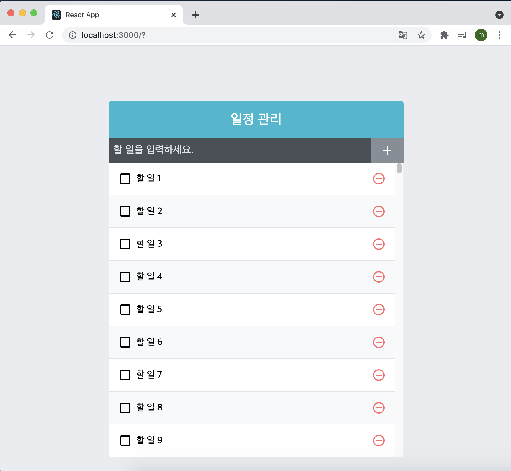
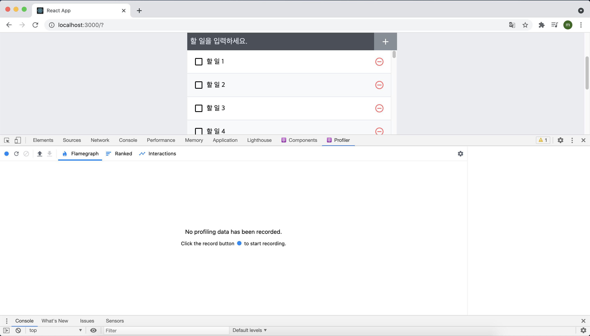
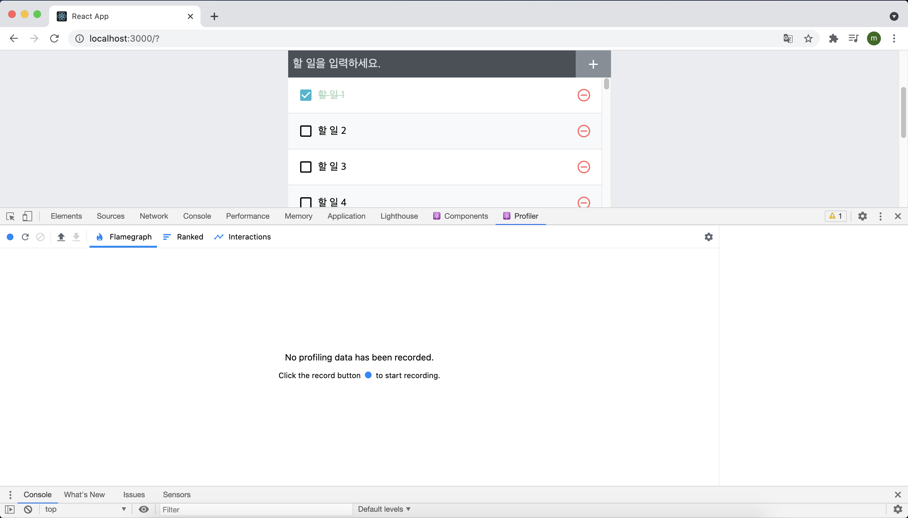
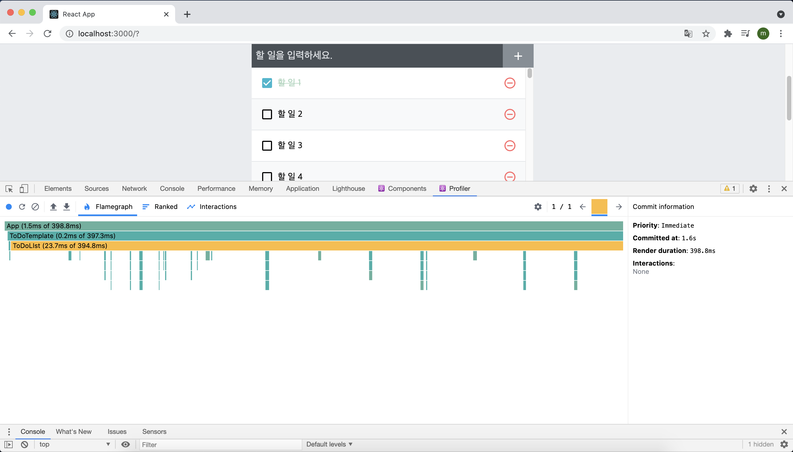
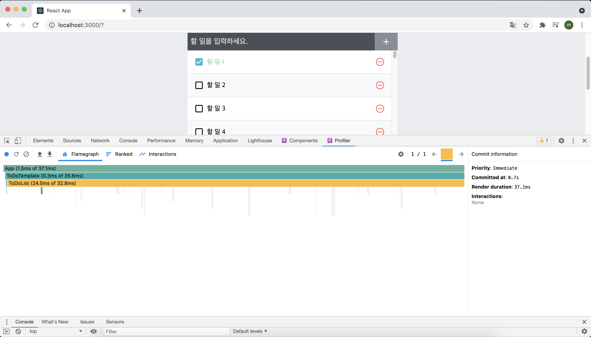
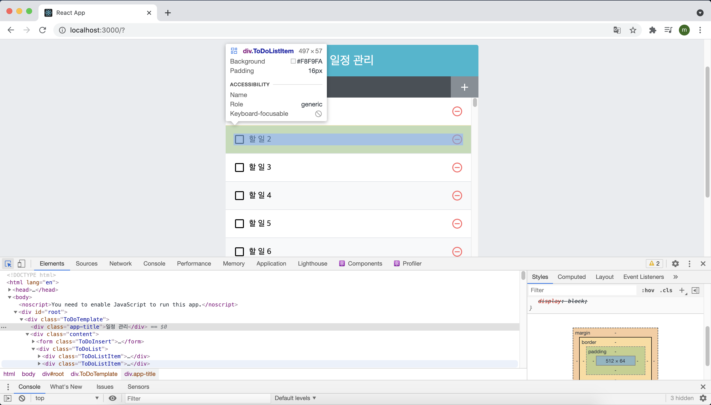
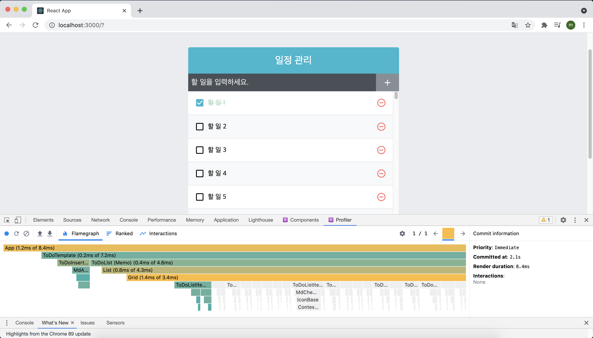

# 컴포넌트 성능 최적화

10장에서 만든 일정관리 앱에서는 데이터의 수가 많지 않기 때문에 사용할 때 불편함을 느끼지 못했다. 그렇지만 데이터의 수가 무수히 많아지면, 애플리케이션이 느려지는 것을 체감할 수 있을 정도로 지연이 발생할 수 있다.

이번 장의 실습은 다음과 같은 흐름으로 진행된다.

> 많은 데이터 렌더링하기 → 크롬 개발자 도구를 통한 성능 모니터링 → React.memo를 통한 컴포넌트 리렌더링 성능 최적화 → onToggle과 onRemove가 새로워지는 현상 방지하기 → react-virtualized를 사용한 렌더링 최적화

## 11.1 많은 데이터 렌더링 하기

우선 실제로 랙(lag)을 경험할 수 있도록 많은 데이터를 렌더링해 보자. App 컴포넌트를 다음과 같이 수정해서 2500개의 데이터를 생성하기 위한 함수를 만들었다. 

```react
import { useCallback, useRef, useState } from "react";
import "./App.css";
import ToDoInsert from "./components/ToDoInsert";
import ToDoLIst from "./components/ToDoList";
import ToDoTemplate from "./components/ToDoTemplate";

function createBulkTodos() {
  const array = [];

  for (let i = 1; i <= 2500; i++) {
    array.push({
      id: i,
      text: `할 일 ${i}`,
      checked: false,
    });
  }
  return array;
}

const App = () => {
  const [todos, setTodos] = useState(createBulkTodos);

  // 고윳값으로 사용될 id
  // ref를 사용하여 변수 담기
  const nextId = useRef(4);

  const onInsert = useCallback(
    (text) => {
      const todo = {
        id: nextId.current,
        text,
        checked: false,
      };
      setTodos(todos.concat(todo));
      nextId.current += 1; // nextId 1씩 더하기
    },
    [todos]
  );

  const onRemove = useCallback(
    (id) => {
      setTodos(todos.filter((todo) => todo.id !== id));
    },
    [todos]
  );

  const onToggle = useCallback(
    (id) => {
      setTodos(
        todos.map((todo) =>
          todo.id === id ? { ...todo, checked: !todo.checked } : todo
        )
      );
    },
    [todos]
  );

  return (
    <ToDoTemplate>
      <ToDoInsert onInsert={onInsert} />
      <ToDoLIst todos={todos} onRemove={onRemove} onToggle={onToggle} />
    </ToDoTemplate>
  );
};

export default App;
```

여기서 주의할 점은 useState의 기본값에 함수를 넣어 주었다는 것이다. 여기서 `useState(createBulkTodos())` 라고 작성하면 리렌더링될 때마다 createBulkTodos가 호출되지만, `useState(createBulkTodos)`처럼 파라미터를 함수 형태로 넣어 주면 컴포넌트가 처음 렌더링될 때만 createBulkTodos 함수가 실행될 것이다. 코드를 실행하고 결과를 보면 다음과 같은 화면이 나오는데 항목 중 하나를 선택하면 이전보다 느려진게 체감이 될 것이다.



## 11.2 크롬 개발자 도구를 통한 성능 모니터링

성능을 분석해야할 때 단순히 느려졌다는 느낌만으로 충분하지 않다. 정확히 몇 초가 걸리는지 확인을 해야 하는데, 그롬 개발자 도구의 Profiler 탭을 사용하여 측정하면 된다. 개발자 도구의 Profiler 탭을 열면 다음과 같이 녹화 버튼이 나타난다.

> ❗️
>
> 책에서는 Performance 탭에서 성능 분석을 했으나 나는 이전에 리액트 개발자 도구를 깔아서 Profiler 탭에서 성능 분석을 진행 했다.



녹화 버튼을 누르고 ''할일 1' 항목을 체크한 다음, 화면에 변화가 반영되면 Stop 버튼을 누른다. 그러면 다음과 같은 성능 분석 결과가 나타난다.



Task의 총 소요시간을 보게 되면 다음과 같이 0.4초 가량 걸리는 것을 확인할 수 있다. 



데이터가 2500개 밖에 안되는데 0.4초가 걸리는 것은 성능이 안 좋다는 것을 의미한다. 이제 이를 최적화 하는 방법에 대해서 알아보자

## 11.3 느려지는 원인 분석

컴포넌트는 다음과 같은 상황에서 리렌더링이 발생한다.

1. 자신이 전달받은 props가 변경될 때
2. 자신의 state가 바뀔 때
3. 부모 컴포넌트가 리렌더링될 때
4. foceUpdate 함수가 실행될 때

지금 상황을 분석해 보면, '할 일 1' 항목을 체크할 경우 App 컴포넌트의 state가 변경되면서 App 컴포넌트가 리렌더링된다. 부모 컴포넌트가 리렌더링되었으니 ToDoList 컴포넌트가 리렌더링되고 그 안의 무수한 컴포넌트들도 리렌더링이 된다.

'할 일 1' 항목은 리렌더링되어야 하는 것이 맞지만, '할 일 2'부터 '할 일 2500'까지는 리렌더링을 안해도 되는 상황인데 모두 리렌더링되고 있으므로 이렇게 느려진 것이다. 컴포넌트의 개수가 많지 않다면 모든 컴포넌트를 리렌더링해도 느려지지 않는데, 지금처럼 약 2000개가 넘어가면 성능이 저하된다.

이럴 때는 컴포넌트 리렌더링 성능을 최적화해 주는 작업을 해 주어야 한다. 즉, 리렌더링이 불필요할 때는 리렌더링을 방지해 주어야 하는데, 어떻게 방지하는지 알아보자.

## 11.4 React.memo를 사용하여 컴포넌트 성능 최적화

컴포넌트의 리렌더링을 방지할 때는 7장에서 배운 shoulComponentUpdate라는 라이프 사이클을 사용하면 된다. 그런데 함수형 컴포넌트에서는 라이프사이클 메서드를 사용할 수 없기 때문에 React.memo라는 함수를 사용하여 리렌더링을 방지할 수 있다. 컴포넌트의 props가 바뀌지 않았다면, 리렌더링하지 않도록 설정하여 함수형 컴포넌트의 리렌더링 성능을 최적화해 줄 수 있다.

React.memo의 사용법은 매우 간단하다. 컴포넌트를 만들고 나서 감싸주기만 하면 된다. ToDoListItem 컴포넌트에 React.memo를 적용해보자.

```react
import React from "react";
import cn from "classnames";
import {
  MdCheckBox,
  MdCheckBoxOutlineBlank,
  MdRemoveCircleOutline,
} from "react-icons/md";
import "./ToDoListItem.scss";

const ToDoListItem = ({ todo, onRemove, onToggle }) => {
  const { id, text, checked } = todo;

  return (
    <div className="ToDoListItem">
      <div className={cn("checkbox", { checked })} onClick={() => onToggle(id)}>
        {checked ? <MdCheckBox /> : <MdCheckBoxOutlineBlank />}
        <div className="text">{text}</div>
      </div>
      <div className="remove" onClick={() => onRemove(id)}>
        <MdRemoveCircleOutline />
      </div>
    </div>
  );
};

export default React.memo(ToDoListItem);
```

이처럼 export 해줄 때 React.memo로 컴포넌트를 감싸주면 todo, onRemove, onToggle이 바뀌지 않으면 리렌더링을 하지 않는다.

## 11.5 onToggle, onRemove 함수가 바뀌지 않게 하기

React.memo를 사용하는 것만으로 컴포넌트 최적화가 끝나지는 않는다. 현재 프로젝트에서는 todos 배열이 업데이트되면 onRemove와 onToggle 함수도 새롭게 바뀌기 때문이다.

onRemove와 onToggle 함수는 배열 상태를 업데이트하는 과정에서 최신 상태의 todos를 참조하기 때문에 todos 배열이 바뀔 때마다 함수가 새로 만들어진다. 이렇게 함수가  계속 만들어지는 상황을 방지하는 방법은 두 가지이다. 첫 번째 방법은 useState의 함수형 업데이트 기능을 사용하는 것이고, 두 번째 방법은 useReducer를 사용하는 것이다.

#### 11.5.1 useState의 함수형 업데이트

기존에 setTodos 함수를 사용할 때는 새로운 상태를 파라미터로 넣어 주었다. setTodos를 사용할 때 새로운 상태를 파라미터로 넣는 대신, 상태 업데이트를 어떻게 할지 정의해 주는 업데이트 함수를 넣을 수도 있다. 이를 함수형 업데이트라고 부른다.

```react
const [number, setNumber] = useState(0);
//prevNumbers는 현재 number 값을 가리킨다.
const onIncrese = useCallback(
	() => setNumber(prevNumber => preNumber + 1),
  [],
);
```

setNumber(number + 1)을 하는 것이 아니라, 위 코드처럼 어떻게 업데이트할지 정의해 주는 업데이트 함수를 넣어 준다. 그러면 useCallback을 사용할 때 두 번째 파라미터로 넣는 배열에 number를 넣지 않아도 된다.

그럼 이제 onToggle, onRemove 함수에서 useState의 함수형 업데이트를 적용해보자. 이 과정에서 onInsert 함수도 함께 수정할 예정이다.

```react
import { useCallback, useRef, useState } from "react";
import "./App.css";
import ToDoInsert from "./components/ToDoInsert";
import ToDoLIst from "./components/ToDoList";
import ToDoTemplate from "./components/ToDoTemplate";

function createBulkTodos() {
  const array = [];

  for (let i = 1; i <= 2500; i++) {
    array.push({
      id: i,
      text: `할 일 ${i}`,
      checked: false,
    });
  }
  return array;
}

const App = () => {
  const [todos, setTodos] = useState(createBulkTodos);

  // 고윳값으로 사용될 id
  // ref를 사용하여 변수 담기
  const nextId = useRef(4);

  const onInsert = useCallback((text) => {
    const todo = {
      id: nextId.current,
      text,
      checked: false,
    };
    setTodos((todos) => todos.concat(todo));
    nextId.current += 1; // nextId 1씩 더하기
  }, []);

  const onRemove = useCallback((id) => {
    setTodos((todos) => todos.filter((todo) => todo.id !== id));
  }, []);

  const onToggle = useCallback((id) => {
    setTodos((todos) =>
      todos.map((todo) =>
        todo.id === id ? { ...todo, checked: !todo.checked } : todo
      )
    );
  }, []);

  return (
    <ToDoTemplate>
      <ToDoInsert onInsert={onInsert} />
      <ToDoLIst todos={todos} onRemove={onRemove} onToggle={onToggle} />
    </ToDoTemplate>
  );
};

export default App;
```

setTodos를 사용할 때 그 안에 `todos =>`만 앞에 넣어 주면 된다. 코드를 저장하고 개발자 도구에서 성능을 측정해보면 



0.4초에서 0.03초로 성능이 훨씬 향상된 것을 확인할 수 있다.

#### 11.5.2 useReducer 사용하기

useState의 함수형 업데이트를 사용하는 대신, useReducer를 사용해도 onToggle과 onRemove가 계속 새로워지는 문제를 해결할 수 있다. App 컴포넌트를 다음과 같이 수정해보자.

```react
import { useCallback, useReducer, useRef } from "react";
import "./App.css";
import ToDoInsert from "./components/ToDoInsert";
import ToDoLIst from "./components/ToDoList";
import ToDoTemplate from "./components/ToDoTemplate";

function createBulkTodos() {
  const array = [];

  for (let i = 1; i <= 2500; i++) {
    array.push({
      id: i,
      text: `할 일 ${i}`,
      checked: false,
    });
  }
  return array;
}

function todoReducer(todos, action) {
  switch (action.type) {
    case "INSERT": // 새로 추가
      // { type: 'INSERT', todo: { id: 1, text: 'todo' , checked: false } }
      return todos.concat(action.todo);
    case "REMOVE": // 제거
      // { type: 'REMOVE', id: 1 }
      return todos.filter((todo) => todo.id !== action.id);
    case "TOGGLE": // 토글
      // { type: 'TOGGLE', id: 1 }
      return todos.map((todo) =>
        todo.id === action.id ? { ...todo, checked: !todo.checked } : todo
      );
    default:
      return todos;
  }
}

const App = () => {
  const [todos, dispatch] = useReducer(todoReducer, undefined, createBulkTodos);

  // 고윳값으로 사용될 id
  // ref를 사용하여 변수 담기
  const nextId = useRef(2501);

  const onInsert = useCallback((text) => {
    const todo = {
      id: nextId.current,
      text,
      checked: false,
    };
    dispatch({ type: "INSERT", todo });
    nextId.current += 1; // nextId 1씩 더하기
  }, []);

  const onRemove = useCallback((id) => {
    dispatch({ type: "REMOVE", id });
  }, []);

  const onToggle = useCallback((id) => {
    dispatch({ type: "TOGGLE", id });
  }, []);

  return (
    <ToDoTemplate>
      <ToDoInsert onInsert={onInsert} />
      <ToDoLIst todos={todos} onRemove={onRemove} onToggle={onToggle} />
    </ToDoTemplate>
  );
};

export default App;
```

useReducer를 사용할 때는 원래 두 번째 파라미터에 초기 상태를 넣어 주어야 한다. 지금은 그 대신 두 번째 파라미터에 undefined를 넣고, 세 번째 파라미터에 초기 상태를 만들어 주는 함수인 createBulkTodos를 넣어 줬다. 이렇게 하면 컴포넌트가 맨 처음 렌더링될 때만 createBulkTodos 함수가 호출된다.

useReducer를 사용하는 방법은 기존 코드를 많이 고쳐야 한다는 단점이 있지만, 상태를 업데이트 하는 로직을 모아서 컴포넌트 바깥에 둘 수 있다는 장점이 있다. 성능상으로는 두 가지 방법이 비슷하기 때문에 어떤 방법을 선택할지는 취향에 따라 고르면 된다.

## 11.6 불변성의 중요성

리액트 컴포넌트에서 상태를 업데이트할 때 불변성을 지키는 것은 매우 중요하다. 앞에서 useState를 사용해 만든 todos 배열과 setTodos 함수를 사용하는 onToggle 함수를 다시 확인해보자.

```react
const onToggle = useCallback(id => {
  setTodos(todos => todos.map(todo => {
    todo.id === id ? {...todo, checked: !todo.checked} : todo
  }));
}, []);
```

기존 데이터를 수정할 때 직접 수정하지 않고, 새로운 배열을 만든 다음에 새로운 객체를 만들어 필요한 부분을 교체해 주는 방식으로 구현했다. 업데이트가 필요한 곳에서는 아예 새로운 배열 혹은 새로운 객체를 만들기 때문에, React.memo를 사용했을 때 props가 바뀌었는지 혹은 바뀌지 않았는지를 알아내서 리렌더링 성능을 최적화해 줄 수 있다.

이렇게 기존의 값을 직접 수정하지 않으면서 새로운 값을 만들어 내느 것을 '불변성을 지킨다'고 한다. 다음 예시 코드에서 불변성을 어떻게 지키고 있는지 생각해보자.

```react
const array = [1,2,3,4,5];

const nextArrayBad = array; // 배열을 복사하는 것이 아니라 똑같은 배열을 가리킨다.
nextArrayBad[0] = 100;
console.log(array === nextArrayBad); // 완전히 같은 배열이기 때문에 true

const nextArrayGood = [...array]; // 배열 내부의 값을 모두 복사한다.
nextArrayGood[0] = 100;
console.log(array === nextArrayGood); // 다른 배열이기 때문에 false

const object = {
  foo: 'bar',
  value: 1
};

const nextObjectBad = object; // 객체가 복사되지 않고, 똑같은 객체를 가리킨다.
nextObjectBad.value = nextObjectBad.value + 1;
console.log(object === nextObjectBad); // 같은 객체이기 때문에 true;

const nextObjectGood = {
  ...obeject, // 기존에 있던 내용을 모두 복사해서 넣는다.
  value: object.value + 1 // 새로운 값을 덮어 쓴다.
};
console.log(object === nextObjectGood); // 다른 객체이기 때문에 false;
```

불변성이 지켜지지 않으면 객체 내부의 값이 새로워져도 바뀐 것을 감지하지 못한다. 그러면 React.memo에서 서로 비교하여 최적화 하는 것도 불가능하게 된다. 추가로 전개 연산자(...문법)를 사용하여 객체나 배열 내부의 값을 복사할 때는 얕은 복사를 하게 된다. 즉, 내부의 값이 완전히 새로 복사되는 것이 아니라 가장 바깥쪽에 있는 값만 복사된다. 따라서 내부의 값이 객체 혹은 배열이라면 내부의 값 또한 따로 복사해 주어야 한다. 다음 코드를 보고 이해해보자.

```react
const todos = [{id: 1, checked: true}, {id: 2, checked: true}];
const nextTodos = [...todos];

nextTodos[0].checked = false;
console.log(todos[0] === nextTodos[0]); // 아직까지는 똑같은 객체를 가리키고 있기 때문에 true

nextTodos[0] = {
  ...nextTodos[0],
  checked: false
};
console.log(todos[0] === nextTodos[0]); // 새로운 객체를 할당해 주었기에 false
```

만약 객체 안에 있는 객체라면 불변성을 지키면서 새 값을 할당해야 하므로 다음과 같이 해 주어야 한다.

```react
const nextComplexObject = {
  ...complexObject,
  objectInside: {
    ...complexObject.objectInside,
    enabled: false
  }
};

console.log(complexObject = nextComplexObject); // false
console.log(complextObject.objectInside === nextComplexObject.objectInside); // false
```

배열 혹은 객체의 구조가 정말 복잡해진다면 이렇게 불변성을 유지하면서 업데이트하는 것도 까다로워진다. 이렇게 복잡한 상황일 경우 immer라는 라이브러리의 도움을 받으면 정말 편하게 작성할 수 있는데 다음 장에서 자세히 알아보도록 하자.

## 11.7 ToDoList 컴포넌트 최적화 하기

리스크에 관련된 컴포넌트를 최적화 할 때는 리스트 내부에서 사용하는 컴포넌트도 최적화해야 하고, 리스트로 사용되는 컴포넌트 자체도 최적화해 주는 것이 좋다. ToDoList 컴포넌트를 다음과 같이 수정해보자.

```react
import React from "react";
import ToDoListItem from "./ToDoListItem";
import "./ToDoList.scss";

const ToDoLIst = ({ todos, onRemove, onToggle }) => {
  return (
    <div className="ToDoList">
      {todos.map((todo) => (
        <ToDoListItem
          todo={todo}
          key={todo.id}
          onRemove={onRemove}
          onToggle={onToggle}
        />
      ))}
    </div>
  );
};

export default React.memo(ToDoLIst);
```

위 최적화 코드는 현재 프로젝트 성능에 전혀 영향을 주지 않는다. 왜냐하면, ToDoList 컴포넌트의 부모 컴포넌트인 App 컴포넌트가 리렌더링되는 유일한 이유가 todos 배열이 업데이트될 때이기 때문이다. 즉, 지금 ToDoList 컴포넌트는 불필요한 리렌더링이 발생하지 않는다. 하지만 App 컴포넌트에 다른 state가 추가되어 해당 값들이 업데이트될 때는 ToDoList 컴포넌트가 불필요한 렌더링을 할 수도 있는 상황이 생길 수 있다. 그렇기에 React.memo를 사용해서 미리 최적화를 해준 것이다.

리스트 관련 컴포넌트를 작성할 때는 리스트 아이템과 리스트, 이 두 가지 컴포넌트를 최적화해 주는 것을 까먹으면 안된다. 그러나 내부 데이터가 100개를 넘어가지 않거나 업데이트가 자주 발생하지 않는다면, 이런 최적화 작업을 반드시 해 줄 필요는 없다.

## 11.8 react-virtualized를 사용한 렌더링 최적화

지금까지 리액트 컴포넌트 리렌더링 성능을 최적화하는 방법을 알아봤다. 리렌더링 성능을 최적화할 떄는 필요할 때만 리렌더링을 하도록 설정을 해주었는데 이번에는 또 다른 렌더링 성능 최적화 방법을 알아보도록 하자. 일정 관리 애플리케이션에 초기 데이터가 2500개 등록되어 있는데, 실제 화면에 나오는 항목은 아홉개 뿐이다. 나머지는 스크롤을 해야만 볼 수 있다.

현재 컴포넌트가 맨 처음 렌더링될 때 2500개 컴포넌트 중 2491개 컴포넌트는 스크롤하기 전에는 보이지 않음에도 불구하고 렌더링이 이루어진다. 이는 꽤나 비효율적인 상황이다. 그리고 나중에 todos 배열에 변동이 생길 때도 ToDoList 컴포넌트 내부의 map 함수에 배열의 처음부터 끝가지 컴포넌트로 변환해 주는데, 이 중에서 2491개는 보이지 않으므로 시스템 자원 낭비다.

이번 절에서 배울 react-virtualized를 사용하면 리스트 컴포넌트에서 스크롤되기 전에 보이지 않는 컴포넌트는 렌더링하지 않고 크기만 차지하게끔 할 수 있다. 그리고 만약 스크롤되면 해당 스크롤 위치에서 보여 주어야 할 컴포넌트를 자연스럽게 렌더링 시킨다. 이 라이브러리를 사용하면 낭비되는 자원을 아주 쉽게 아낄 수 있다.

#### 11.8.1 최적화 준비

우선 `yarn add react-virtualized` 명령어를 통해 라이브러리를 설치해준다.

react-virtualized에서 제공하는 List 컴포넌트를 사용하여 ToDoList 컴포넌트의 성능을 최적화 할 예정이다.

최적화를 수행하려면 사전에 먼저 해야 하는 작업이 있는데, 바로 각 항목의 실제 크기를 px 단위로 알아내는 것이다. 이 값은 우리가 작성한 CSS를 확인해서 직접 계산해도 되지만, 이보다 훨씬 더 편리하게 알아 낼 수 있는 방법이 있는데 개발자 도구의 좌측 상단에 있는 아이콘을 눌러서 크기를 알고 싶은 항목에 커서를 갖다 대면 각 항목의 크기를 알 수 있다. 



각 항목의 크기는 가로 497px, 세로 57px이다. 

#### 11.8.2 ToDoList 수정

크기를 알아냈다면 ToDoList 컴포넌트를 다음과 같이 수정해보자.

```react
import React, { useCallback } from "react";
import { List } from "react-virtualized";
import ToDoListItem from "./ToDoListItem";
import "./ToDoList.scss";

const ToDoLIst = ({ todos, onRemove, onToggle }) => {
  const rowRenderer = useCallback(
    ({ index, key, style }) => {
      const todo = todos[index];
      return (
        <ToDoListItem
          todo={todo}
          key={key}
          onRemove={onRemove}
          onToggle={onToggle}
          style={style}
        />
      );
    },
    [todos, onRemove, onToggle]
  );

  return (
    <List
      className="ToDoList"
      width={512} // 전체 크기
      height={513} // 전체 높이
      rowCount={todos.length} // 항목 개수
      rowHeight={57} // 항목 높이
      rowRenderer={rowRenderer} // 항목을 렌더링할 때 쓰는 함수
      list={todos} // 배열
      style={{ outline: "none" }} // 리스트에 기본 적용되는 outline 스타일 제거
    />
  );
};

export default React.memo(ToDoLIst);
```

List 컴포넌트를 사용하기 위해 rowRenderer라는 함수를 새로 작성해줬다. 이 함수는 react-virtualized의 List 컴포넌트에서 각 ToDoListItem을 렌더링할 때 사용하며, 이 함수를 List 컴포넌트의 props로 설정해 주어야 한다. 이 함수는 파라미터에 index, key, style 값을 객체 타입으로 받아와서 사용한다.

List 컴포넌트를 사용할 때는 해당 리스트의 전체 크기와 각 항목의 높이, 각 항목을 렌더링할 때 사용해야 하는 함수, 그리고 배열을 props로 넣어 주어야 한다. 그러면 이 컴포넌트가 전달받은 props를 사용하여 자동으로 최적화를 해준다.

#### 11.8.3 ToDoListItem 수정

ToDoList를 저장하고 나면 스타일이 깨져서 나타날텐데 ToDoListItem 컴포넌트를 다음과 같이 수정해주면 해결된다.

```react
import React from "react";
import cn from "classnames";
import {
  MdCheckBox,
  MdCheckBoxOutlineBlank,
  MdRemoveCircleOutline,
} from "react-icons/md";
import "./ToDoListItem.scss";

const ToDoListItem = ({ todo, onRemove, onToggle, style }) => {
  const { id, text, checked } = todo;

  return (
    <div className="ToDoListItem-virtualized" style={style}>
      <div className="ToDoListItem">
        <div
          className={cn("checkbox", { checked })}
          onClick={() => onToggle(id)}
        >
          {checked ? <MdCheckBox /> : <MdCheckBoxOutlineBlank />}
          <div className="text">{text}</div>
        </div>
        <div className="remove" onClick={() => onRemove(id)}>
          <MdRemoveCircleOutline />
        </div>
      </div>
    </div>
  );
};

export default React.memo(ToDoListItem);
```

render 함수에서 기존에 보여 주던 내용을 div로 한 번 감싸고, 해당 div에는 ToDoListItem-virtualized라는 className을 설정하고, props로 받아 온 style을 적용시켜 줬다.

여기서 ToDoListItem-virtualized라는 클래스를 만든 것은 컴포넌트 사이사이에 테두리를 제대로 쳐 주고, 홀수 번째/짝수 번째 항목에 다른 배경 색상을 설정하기 위해서다.

그 다음 ToDoListItem의 스타일 파일에서 최하단에 있던 & + &를 사용하여 .ToDoListItem 사이사이에 테두리를 설정했던 코드와 &:nth-child(even)을 사용하여 다른 배경 색상을 주는 코드를 지우고, 코드 최상단에 다음 코드를 삽입 하면 된다.

```scss
.ToDoListItem-virtualized {
  // 엘리먼트 사이사이에 테두리를 넣어 줌
  & + & {
    border-top: 1px solid #dee2e6;
  }
  &:nth-child(even) {
    background: #f8f9fa;
  }
}
(...)
```

그런 다음 저장하고 컴포넌트의 성능을 다시 한번 측정해 보면



0.03초에서 0.008초로 성능이 향상된 것을 확인할 수 있다.

## 11.9 정리

이 장에서는 리액트 애플리케이션에 많은 데이터를 렌더링하는 리스트를 만들어 지연을 유발해보고, 이를 해경하는 방법을 알아봤다. 리액트 컴포넌트의 렌더링은 기본적으로 빠르기 때문에 컴포넌트를 개발할 때 최적화 작업에 대해 너무 큰 스트레스를 받거나 모든 컴포넌트에 일일이 React.memo를 작성할 필요는 없다. 단, 리스트와 관련된 컴포넌트를 만들 대 보여 줄 항목이 100개 이상이고 업데이트가 자주 발생한다면, 이 장에서 학습한 방식을 활용해 최적화 하는 작업이 필요하다.