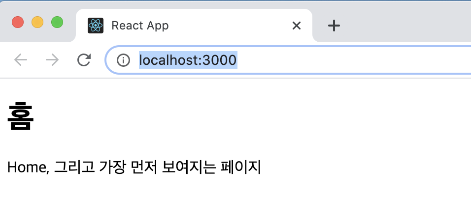
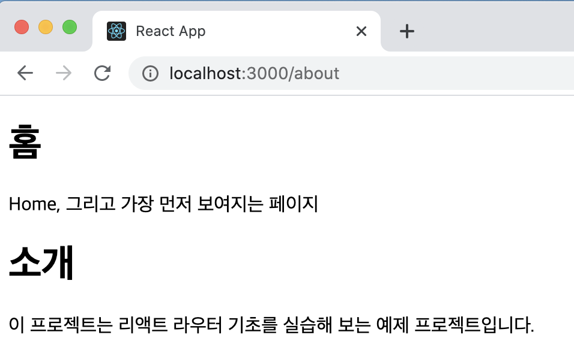
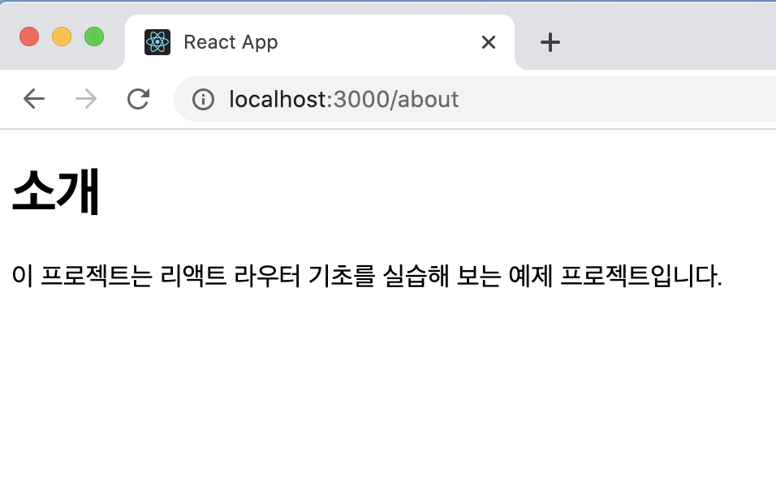

# 리액트 라우터로 SPA 개발하기

## 13.1 SPA란

SPA는 Single Page Application의 약어로 한 개의 페이지로 이루어진 어플리케이션을 말한다. 전통적인 웹 페이지는 다음과 같이 여러 페이지로 구성되어 있다.


기존에는 사용자가 다른 페이지로 이동할 때마다 새로우 html을 받아 오고, 페이지를 로딩할 때마다 서버에서 리소스를 전달받아 해석한 뒤 화면에 보여 주었다. 이렇게 사용자에게 보이는 화면은 서버 측에서 준비했다. 사전에 html 파일을 만들어서 제공하거나, 데이터에 따라 유동적인 html을 생성해 주는 템플릿 엔진을 사용하기도 했다.

하지만 요즘 웹에는 제공되는 정보가 엄청나게 많기 때문에 이렇게 서버에서 모든 뷰를 준비하면 트래픽이 너무 많이 나오거나 사용자가 몰려 서버에 높은 부하가 걸리는 등 성능상의 문제가 생길 수 있다. 캐싱과 압축을 해서 서비스를 제공하면 어느 정도 최적화될 수 있겠지만, 사용자와의 인터랙션이 자주 발생하는 모던 웹 애플리케이션에는 적당하지 않을 수 있다.

그래서 리액트 같은 라이브러리 혹은 프레임워크를 사용하여 뷰 렌더링을 사용자의 브라우저가 담당하도록 하고, 우선 애플리케이션을 브라우저에 불러와서 실행시킨 후에 사용자와의 인터랙션이 발생하면 필요한 부분만 자바스크립트를 사용하여 업데이트 해준다. **만약 새로운 데이터가 필요하다면 서버API를 호출하여 필요한 데이터만 새로 불러와** 애플리케이션에 사용할 수도 있다.


싱글 페이지라고 해서 화면이 한 종류인것은 아니다. 블로그를 개발한다고 해보자. 블로그에는 홈, 포스트 목록, 글쓰기 등의 화면이 있을 것이다. SPA의 경우 서버에서 사용자에게 제공하는 페이지는 한 종류이지만, 해당 페이지에서 로딩된 자바스크립트와 현재 사용자 부라우저의 주소 상태에 따라 다양한 화면을 보여줄 수 있다.

**다른 주소에 다른 화면을 보여주는 것**을 라우팅이라고 한다. 리액트 라이브러리에 이 기능이 내장되어 있지 않지만 그 대신 브라우저의 API를 직접 사용하여 이를 관리하거나, 라이브러리를 사용하여 이 작업을 더욱 쉽게 구현할 수 있다.

리액트 라우터는 클라이언트 사이드에서 이루어지는 라우팅을 아주 간단하게 구현할 수 있도록 해준다. 더 나아가 나중에 서버 사이드 렌더링을 할 때로 라우팅을 도와주는 컴포넌트들을 제공해준다.

#### 13.1.1 SPA의 단점

SPA의 단점은 앱의 규모가 커지면 자바스크립트 파일이 너무 커진다는 것이다. 페이지 로딩 시 사용자가 실제로 방문하지 않을 수도 있는 페이지의 스크립트도 불러오기 때문이다. 이 문제는 추후에 배울 코드 스플리팅을 사용하여 라우트별로 파일들을 나누어서 트래픽과 로딩 속도를 개선할 수 있다.

리액트 라우터처럼 브라우저에서 자바스크립트를 사용하여 라우팅을 관리하는 것은 자바스크립트를 실행하지 않는 일반 크롤러에서는 페이지의 정보를 제대로 수집해 가지 못한다는 잠재적인 단점이 있다. 그렇기 때문에 구글, 네이버, 다음 같은 검색 엔진의 검색 결과에 페이지가 잘 나타나지 않을 수도 있다. 구글 검색 엔진에서 사용하는 크롤러의 경우 자바스크립트를 실행해 주는 기능이 탑재되어 있기는 하지만, 크롤링하는 모든 페이지에서 자바스크립트를 실행하고 있지는 않다(2019년 기준). 또한, 자바스크립트가 실행될 때까지 페이지가 비어 있기 때문에 자바스크립트 파일이 로딩되어 실행되는 짧은 시가 동안 흰 페이지가 나타날 수 있다는 단점도 있다. 이러한 문제점들은 나중에 배우게 될 서버 사이드 렌더링을 통해 모두 해결할 수 있다.

## 13.2 프로젝트 준비 및 기본적인 사용법

이번 실습은 다음 흐름대로 진행된다.

> 프로젝트 생성 및 리액트 라우터 적용 → 페이지 만들기 → Route 컴포넌트로 특정 주소에 컴포넌트 연결 → 라우트 이동하기 → URL 파라미터와 쿼리 이해하기 → 서브 라우트 → 부가 기능 알아보기

#### 13.2.1 프로젝트 생성 및 라이브러리 설치

우선 실습을 진행할 새로운 리액트 프로젝트를 만든다.

`$ yarn create react-app router-tutorial`

그리고 해당 프로젝트 디렉터리로 이동하여 리액트 라우터 라이브러리를 설치한다. 

`$ yarn add react-router-dom`

#### 13.2.2 프로젝트에 라우터 적용

프로젝트에 리액트 라우터를 적용할 때는 src.index.js 파일에서 react-router-dom에 내장되어 있는 BrowserRouter라는 컴포넌트를 사용하여 감싸면 된다. 이 컴포넌트는 웹 애플리케이션에 HTML5의 History API를 사용하여 페이지를 새로고침하지 않고도 주소를 변경하고, 현재 주소에 관련된 정보를 props로 쉽게 조회하거나 사용할 수 있도록 한다.

```react
import React from "react";
import ReactDOM from "react-dom";
import { BrowserRouter } from "react-router-dom";
import App from "./App";

ReactDOM.render(
  <BrowserRouter>
    <App />
  </BrowserRouter>,
  document.getElementById("root")
);
```

#### 13.2.3 페이지 만들기

사용자가 웹 사이트에 들어왔을 때 처음 보여 줄 Home 컴포넌트와 웹 사이트를 소개하는 About 컴포넌트를 만들어준다.

```react
import React from "react";

const Home = () => {
  return (
    <div>
      <h1>홈</h1>
      <p>Home, 그리고 가장 먼저 보여지는 페이지</p>
    </div>
  );
};

export default Home;
```

```react
import React from "react";

const About = () => {
  return (
    <div>
      <h1>소개</h1>
      <p>이 프로젝트는 리액트 라우터 기초를 실습해 보는 예제 프로젝트입니다.</p>
    </div>
  );
};

export default About;
```

#### 13.2.4 Route 컴포넌트로 특정 주소에 컴포넌트 연결

Route라는 컴포넌트를 사용하여 사용자의 현재 경로에 따라 다른 컴포넌트가 보여지게끔 설정해보자. Route 컴포넌트를 사용하면 어떤 규칙을 가진 경로에 어떤 컴포넌트를 보여줄 지 정의할 수 있다. 사용법은 아래와 같다.

> <Route path="주소규칙" component={보여 줄 컴포넌트} />

App 컴포넌트에 방금 만든 Home 컴포넌트 혹은 About 컴포넌트를 보여줄 수 있도록 아래와 같이 설정했다.

```react
import React from "react";
import { Route } from "react-router-dom";
import Home from "./Home";
import About from "./About";

function App() {
  return (
    <div>
      <Route path="/" component={Home} />
      <Route path="/about" component={About} />
    </div>
  );
}

export default App;
```

이제 개발서버를 다시 시작하면 아래와 같이 홈 화면이 첫 번째 화면으로 나타나게 된다.



그리고 주소창에 /about 경로를 추가하면 아래와 같이 보이는 걸 확인할 수 있다.



/about 경로로 들어가면 About 컴포넌트만 나오기를 예상했지만, 예상과 다르게 두 컴포넌트가 모두 나타나는 것을 확인할 수 있다. 이는 Home 컴포넌트가 보여질 경로인 '/'과 About 컴포넌트가 보여질 경로 '/about'이 공통된 경로 '/'를 가지고 있기 때문에(규칙이 일치) 발생한 현상이다. 이를 해결하기 위해서 Route 컴포넌트에 props로 exact를 true로 주게 되면 경로가 정확하게 일치하는 경우에만 출력을 할 수 있게 된다. 

Home을 위한 Route 컴포넌트의 props를 `<Route path="/" exact={true} component={Home} />` 이와 같이 수정해주고 브라우저를 확인하면 



위 처럼 컴포넌트가 하나만 잘 나타나는 것을 확인할 수 있다.

#### 13.2.5 Link 컴포넌트를 사용하여 다른 주소로 이동하기

Link 컴포넌트는 **클릭하면 다른 주소로 이동시켜 주는 컴포넌트**다. 일반 웹 애플리케이션에서 a 태그를 사용하여 페이지를 전환하는데, 리액트 라우터를 사용할 때는 이 태그를 직접 사용하면 안된다. 이 태그는 페이지를 전환하는 과정에서 페이지를 새로 불러오기 때문에 애플리케이션이 들고 있던 상태를 모두 날려 버리게 된다. 다시 말해, **렌더링된 컴포넌트들도 모두 사라지고 다시 처음부터 렌더링**을 한다.

Link 컴포넌트를 사용하여 페이지를 전환하면, 페이지를 새로 불러오지 않고 애플리케이션은 그대로 유지한 상태에서 HTML5 History API를 사용하여 페이지의 주소만 변경해준다. **Link 컴포넌트 자체는 a 태그로 이루어져 있지만, 페이지 전환을 방지하는 기능이 내장되어 있다.**

Link 컴포넌트는 다음과 같이 사용한다.

> <Link to="주소">내용</Link>

이제 "/" 경로에서 "/about" 경로로 이동하는 Link 컴포넌트를 만들어보자

```react
import React from "react";
import { Route, Link } from "react-router-dom";
import Home from "./Home";
import About from "./About";

function App() {
  return (
    <div>
      <ul>
        <li>
          <Link to="/">홈</Link>
        </li>
        <li>
          <Link to="/about">소개</Link>
        </li>
      </ul>
      <hr />
      <Route path="/" exact={true} component={Home} />
      <Route path="/about" component={About} />
    </div>
  );
}

export default App;
```

페이지 상단에 있는 링크를 눌러보면 페이지가 정상적으로 전환되는 것을 확인할 수 있다.

