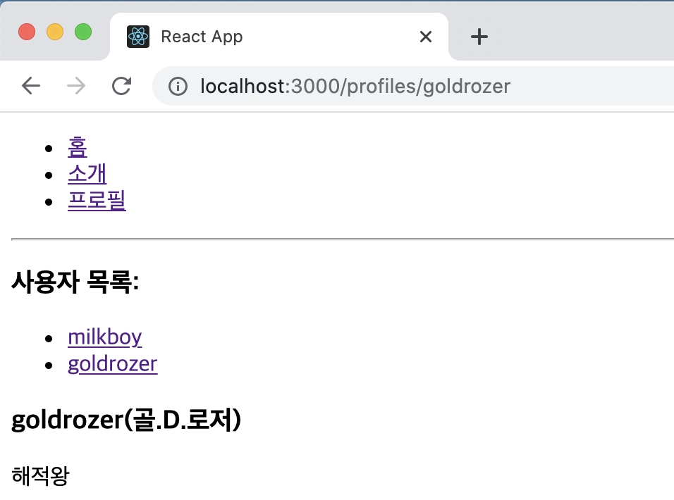

# 리액트 라우터로 SPA 개발하기

## 13.1 SPA란

SPA는 Single Page Application의 약어로 한 개의 페이지로 이루어진 어플리케이션을 말한다. 전통적인 웹 페이지는 다음과 같이 여러 페이지로 구성되어 있다.


기존에는 사용자가 다른 페이지로 이동할 때마다 새로우 html을 받아 오고, 페이지를 로딩할 때마다 서버에서 리소스를 전달받아 해석한 뒤 화면에 보여 주었다. 이렇게 사용자에게 보이는 화면은 서버 측에서 준비했다. 사전에 html 파일을 만들어서 제공하거나, 데이터에 따라 유동적인 html을 생성해 주는 템플릿 엔진을 사용하기도 했다.

하지만 요즘 웹에는 제공되는 정보가 엄청나게 많기 때문에 이렇게 서버에서 모든 뷰를 준비하면 트래픽이 너무 많이 나오거나 사용자가 몰려 서버에 높은 부하가 걸리는 등 성능상의 문제가 생길 수 있다. 캐싱과 압축을 해서 서비스를 제공하면 어느 정도 최적화될 수 있겠지만, 사용자와의 인터랙션이 자주 발생하는 모던 웹 애플리케이션에는 적당하지 않을 수 있다.

그래서 리액트 같은 라이브러리 혹은 프레임워크를 사용하여 뷰 렌더링을 사용자의 브라우저가 담당하도록 하고, 우선 애플리케이션을 브라우저에 불러와서 실행시킨 후에 사용자와의 인터랙션이 발생하면 필요한 부분만 자바스크립트를 사용하여 업데이트 해준다. **만약 새로운 데이터가 필요하다면 서버API를 호출하여 필요한 데이터만 새로 불러와** 애플리케이션에 사용할 수도 있다.


싱글 페이지라고 해서 화면이 한 종류인것은 아니다. 블로그를 개발한다고 해보자. 블로그에는 홈, 포스트 목록, 글쓰기 등의 화면이 있을 것이다. SPA의 경우 서버에서 사용자에게 제공하는 페이지는 한 종류이지만, 해당 페이지에서 로딩된 자바스크립트와 현재 사용자 부라우저의 주소 상태에 따라 다양한 화면을 보여줄 수 있다.

**다른 주소에 다른 화면을 보여주는 것**을 라우팅이라고 한다. 리액트 라이브러리에 이 기능이 내장되어 있지 않지만 그 대신 브라우저의 API를 직접 사용하여 이를 관리하거나, 라이브러리를 사용하여 이 작업을 더욱 쉽게 구현할 수 있다.

리액트 라우터는 클라이언트 사이드에서 이루어지는 라우팅을 아주 간단하게 구현할 수 있도록 해준다. 더 나아가 나중에 서버 사이드 렌더링을 할 때로 라우팅을 도와주는 컴포넌트들을 제공해준다.

#### 13.1.1 SPA의 단점

SPA의 단점은 앱의 규모가 커지면 자바스크립트 파일이 너무 커진다는 것이다. 페이지 로딩 시 사용자가 실제로 방문하지 않을 수도 있는 페이지의 스크립트도 불러오기 때문이다. 이 문제는 추후에 배울 코드 스플리팅을 사용하여 라우트별로 파일들을 나누어서 트래픽과 로딩 속도를 개선할 수 있다.

리액트 라우터처럼 브라우저에서 자바스크립트를 사용하여 라우팅을 관리하는 것은 자바스크립트를 실행하지 않는 일반 크롤러에서는 페이지의 정보를 제대로 수집해 가지 못한다는 잠재적인 단점이 있다. 그렇기 때문에 구글, 네이버, 다음 같은 검색 엔진의 검색 결과에 페이지가 잘 나타나지 않을 수도 있다. 구글 검색 엔진에서 사용하는 크롤러의 경우 자바스크립트를 실행해 주는 기능이 탑재되어 있기는 하지만, 크롤링하는 모든 페이지에서 자바스크립트를 실행하고 있지는 않다(2019년 기준). 또한, 자바스크립트가 실행될 때까지 페이지가 비어 있기 때문에 자바스크립트 파일이 로딩되어 실행되는 짧은 시가 동안 흰 페이지가 나타날 수 있다는 단점도 있다. 이러한 문제점들은 나중에 배우게 될 서버 사이드 렌더링을 통해 모두 해결할 수 있다.

## 13.2 프로젝트 준비 및 기본적인 사용법

이번 실습은 다음 흐름대로 진행된다.

> 프로젝트 생성 및 리액트 라우터 적용 → 페이지 만들기 → Route 컴포넌트로 특정 주소에 컴포넌트 연결 → 라우트 이동하기 → URL 파라미터와 쿼리 이해하기 → 서브 라우트 → 부가 기능 알아보기

#### 13.2.1 프로젝트 생성 및 라이브러리 설치

우선 실습을 진행할 새로운 리액트 프로젝트를 만든다.

`$ yarn create react-app router-tutorial`

그리고 해당 프로젝트 디렉터리로 이동하여 리액트 라우터 라이브러리를 설치한다. 

`$ yarn add react-router-dom`

#### 13.2.2 프로젝트에 라우터 적용

프로젝트에 리액트 라우터를 적용할 때는 src.index.js 파일에서 react-router-dom에 내장되어 있는 BrowserRouter라는 컴포넌트를 사용하여 감싸면 된다. 이 컴포넌트는 웹 애플리케이션에 HTML5의 History API를 사용하여 페이지를 새로고침하지 않고도 주소를 변경하고, 현재 주소에 관련된 정보를 props로 쉽게 조회하거나 사용할 수 있도록 한다.

```react
import React from "react";
import ReactDOM from "react-dom";
import { BrowserRouter } from "react-router-dom";
import App from "./App";

ReactDOM.render(
  <BrowserRouter>
    <App />
  </BrowserRouter>,
  document.getElementById("root")
);
```

#### 13.2.3 페이지 만들기

사용자가 웹 사이트에 들어왔을 때 처음 보여 줄 Home 컴포넌트와 웹 사이트를 소개하는 About 컴포넌트를 만들어준다.

```react
import React from "react";

const Home = () => {
  return (
    <div>
      <h1>홈</h1>
      <p>Home, 그리고 가장 먼저 보여지는 페이지</p>
    </div>
  );
};

export default Home;
```

```react
import React from "react";

const About = () => {
  return (
    <div>
      <h1>소개</h1>
      <p>이 프로젝트는 리액트 라우터 기초를 실습해 보는 예제 프로젝트입니다.</p>
    </div>
  );
};

export default About;
```

#### 13.2.4 Route 컴포넌트로 특정 주소에 컴포넌트 연결

Route라는 컴포넌트를 사용하여 사용자의 현재 경로에 따라 다른 컴포넌트가 보여지게끔 설정해보자. Route 컴포넌트를 사용하면 어떤 규칙을 가진 경로에 어떤 컴포넌트를 보여줄 지 정의할 수 있다. 사용법은 아래와 같다.

> <Route path="주소규칙" component={보여 줄 컴포넌트} />

App 컴포넌트에 방금 만든 Home 컴포넌트 혹은 About 컴포넌트를 보여줄 수 있도록 아래와 같이 설정했다.

```react
import React from "react";
import { Route } from "react-router-dom";
import Home from "./Home";
import About from "./About";

function App() {
  return (
    <div>
      <Route path="/" component={Home} />
      <Route path="/about" component={About} />
    </div>
  );
}

export default App;
```

이제 개발서버를 다시 시작하면 아래와 같이 홈 화면이 첫 번째 화면으로 나타나게 된다.


그리고 주소창에 /about 경로를 추가하면 아래와 같이 보이는 걸 확인할 수 있다.


/about 경로로 들어가면 About 컴포넌트만 나오기를 예상했지만, 예상과 다르게 두 컴포넌트가 모두 나타나는 것을 확인할 수 있다. 이는 Home 컴포넌트가 보여질 경로인 '/'과 About 컴포넌트가 보여질 경로 '/about'이 공통된 경로 '/'를 가지고 있기 때문에(규칙이 일치) 발생한 현상이다. 이를 해결하기 위해서 Route 컴포넌트에 props로 exact를 true로 주게 되면 경로가 정확하게 일치하는 경우에만 출력을 할 수 있게 된다. 

Home을 위한 Route 컴포넌트의 props를 `<Route path="/" exact={true} component={Home} />` 이와 같이 수정해주고 브라우저를 확인하면 


위 처럼 컴포넌트가 하나만 잘 나타나는 것을 확인할 수 있다.

#### 13.2.5 Link 컴포넌트를 사용하여 다른 주소로 이동하기

Link 컴포넌트는 **클릭하면 다른 주소로 이동시켜 주는 컴포넌트**다. 일반 웹 애플리케이션에서 a 태그를 사용하여 페이지를 전환하는데, 리액트 라우터를 사용할 때는 이 태그를 직접 사용하면 안된다. 이 태그는 페이지를 전환하는 과정에서 페이지를 새로 불러오기 때문에 애플리케이션이 들고 있던 상태를 모두 날려 버리게 된다. 다시 말해, **렌더링된 컴포넌트들도 모두 사라지고 다시 처음부터 렌더링**을 한다.

Link 컴포넌트를 사용하여 페이지를 전환하면, 페이지를 새로 불러오지 않고 애플리케이션은 그대로 유지한 상태에서 HTML5 History API를 사용하여 페이지의 주소만 변경해준다. **Link 컴포넌트 자체는 a 태그로 이루어져 있지만, 페이지 전환을 방지하는 기능이 내장되어 있다.**

Link 컴포넌트는 다음과 같이 사용한다.

> <Link to="주소">내용</Link>

이제 "/" 경로에서 "/about" 경로로 이동하는 Link 컴포넌트를 만들어보자

```react
import React from "react";
import { Route, Link } from "react-router-dom";
import Home from "./Home";
import About from "./About";

function App() {
  return (
    <div>
      <ul>
        <li>
          <Link to="/">홈</Link>
        </li>
        <li>
          <Link to="/about">소개</Link>
        </li>
      </ul>
      <hr />
      <Route path="/" exact={true} component={Home} />
      <Route path="/about" component={About} />
    </div>
  );
}

export default App;
```

페이지 상단에 있는 링크를 눌러보면 페이지가 정상적으로 전환되는 것을 확인할 수 있다.


## 13.3 Route 하나에 여러 개의 path 설정하기

Route 하나에 여러 개의 path를 지정하는 것은 최신 버전의 라우터 v5부터 적용된 기능이다. Route를 여러 번 사용하는 대신 path props를 배열로 설정해 주면 여러 경로에서 같은 컴포넌트를 보여 줄 수 있다.

```react
import React from "react";
import { Route, Link } from "react-router-dom";
import Home from "./Home";
import About from "./About";

function App() {
  return (
    <div>
      <ul>
        <li>
          <Link to="/">홈</Link>
        </li>
        <li>
          <Link to="/about">소개</Link>
        </li>
      </ul>
      <hr />
      <Route path="/" exact={true} component={Home} />
      <Route path={["/about", "/info"]} component={About} />
    </div>
  );
}

export default App;
```

위와 같이 코드를 수정해주고 결과를 보게 되면 "/info" 경로를 입력해도 About 컴포넌트의 내용이 나타나는 것을 확인할 수 있다.


## 13.4 URL 파라미터와 쿼리

페이지 주소를 정의할 때 가끔은 유동적인 값을 전달해야 할 때도 있다. 이는 파라미터와 쿼리로 나눌 수 있다.

- 파라미터 예시 : /profile/**velopert**

- 쿼리 예시 : /about?**detail=true**

유동적인 값을 사용해야 하는 상황에서 파라미터를 써야 할지 쿼리를 써야 할지 정할 때, 무조건 따라야 하는 규칙은 없다. 다만 일반적으로 파라미터는 특정 아이디 혹은 이름을 사용하여 조회할 때 사용하고, 쿼리는 우리가 어떤 키워드를 검색하거나 페이지에 필욯나 옵션을 전달할 때 사용한다.

#### 13.4.1 URL 파라미터

 /profile/milkboy와 같은 형식으로 뒷부분에 유동적인 usename 값을 넣어 줄 때 해당 값을 props로 받아 와서 조회하는 방법을 알아보도록하자

먼저 profile 컴포넌트를 아래와 같이 정의해준다.

```react
import React from "react";

const data = {
  milkboy: {
    name: "설재혁",
    description: "리액트를 좋아하는 개발자",
  },
  goldrozer: {
    name: "골.D.로저",
    description: "해적왕",
  },
};

const Profile = ({ match }) => {
  const { username } = match.params;
  const profile = data[username];

  if (!profile) {
    return <div>존재하지 않는 사용자입니다.</div>;
  }
  return (
    <div>
      <h3>
        {username}({profile.name})
      </h3>
      <p>{profile.description}</p>
    </div>
  );
};

export default Profile;
```

URL 파라미터를 사용할 때는 라우트로 사용되는 컴포넌트에서 받아 오는 match라는 객체 안의 params 값을 참조한다. match 객체 안에는 현재 컴포넌트가 어떤 경로 규칙에 의해 보이는지에 대한 정보가 들어 있다.

이제 App 컴포넌트에서 Profile 컴포넌트를 위한 라우트를 정의 하는데 이번에 사용할 path 규칙에는 **/profile/:username**이라고 넣어 주면 된다. 이렇게 설정하면 match.params.username 값을 통해 현재 username 값을 조회할 수 있다. 아래 코드처럼 라우트를 정의하고 상단에 각 프로필 페이지로 갈 수 있는 링크도 추가하면 된다.

```react
import React from "react";
import { Route, Link } from "react-router-dom";
import Home from "./Home";
import About from "./About";
import Profile from "./Profile";

function App() {
  return (
    <div>
      <ul>
        <li>
          <Link to="/">홈</Link>
        </li>
        <li>
          <Link to="/about">소개</Link>
        </li>
        <li>
          <Link to="/profile/milkboy">milkboy 프로필</Link>
        </li>
        <li>
          <Link to="/profile/goldrozer">goldrozer 프로필</Link>
        </li>
      </ul>
      <hr />
      <Route path="/" exact={true} component={Home} />
      <Route path={["/about", "/info"]} component={About} />
      <Route path="/:username" exact={true} component={Profile} />
    </div>
  );
}

export default App;
```

저장한 뒤 결과를 출력해보면 정상적으로 작동하는 것을 확인할 수 있다.


#### 13.4.2 URL 쿼리

이번에는 About 페이지에서 쿼리를 받아 오려고 한다. 쿼리는 location 객체 안에 들어 있는 search 값에서 조회할 수 있다. location 객체는 라우트로 사용된 컴포넌트에게 props로 전달되며, location의 형태는 다음과 같다.

```react
{
  "pathname" : "/about",
  "search" : "?detail=true",
  "hash" : ""
}
```

위 location 객체는 http://localhost:3000/about?detail=true 주소로 들어갔을 때의 값이다. URL 쿼리를 읽을 때는 위 객체가 지닌 값 중에서 search 값을 확인해야 합니다. 이 값은 문자열 형태로 되어 있다. URL 쿼리는 ?detail=true&another=1과 같이 문자열에 여러 가지 값을 설정해 줄 수 있다. Search 값에서 특정 값을 읽어 오기 위해서는 이 문자열을 객체 형태로 반환해 주어야 한다.

쿼리 문자열을 객체로 변활할 때는 qs라는 라이브러리를 사용한다. 

`$ yarn add qs` 명령어를 통해 해당 라이브러리를 설치하고 About 컴포넌트에서 location.search 값에 있는 detail이 true인지 아닌지에 따라 추가 정보를 보여 주도록 만들어보자. About 컴포넌트를 다음과 같이 수정했다.

```react
import React from "react";
import qs from "qs";

const About = ({ location }) => {
  console.log(location);
  const query = qs.parse(location.search, {
    ignoreQueryPrefix: true, // 이 설정을 통해 문자열 맨 앞의 ?를 생략한다.
  });
  console.log(query); // 파싱된 쿼리
  const showDetail = query.detail === "true"; // 쿼리의 파싱 결과값은 문자열
  return (
    <div>
      <h1>소개</h1>
      <p>이 프로젝트는 리액트 라우터 기초를 실습해 보는 예제 프로젝트입니다.</p>
      {showDetail && <p>detail 값을 true로 설정하셨군요!</p>}
    </div>
  );
};

export default About;
```

쿼리를 사용할 때는 쿼리 문자열을 객체로 파싱하는 과정에서 결과 값은 언제나 문자열이라는 점에 주의해야 한다. ?value=1 혹은 ?value=true와 같이 숫자나 논리 자료형을 사용한다고 해서 해당 값이 우리가 원하는 형태로 변환되는 것이 아니라, "1", "true"와 같이 문자열 형태로 받아진다.

그렇기 때문에 숫자를 받아 와야 하면 parseInt 함수를 통해 꼭 숫자로 변환해 주고, 지금처럼 논리 자료형 값을 사용해야 하는 경우에는 정확히 "true" 문자열이랑 일치하는지를 비교해야 한다. 코드를 저장하고 브라우저의 결과를 보면 아래와 같이 정상적으로 출력되는 것을 확인할 수 있다.


## 13.5 서브 라우트

서브 라우트는 라우트 내부에 또 라우트를 정의하는 것을 의미한다. 기존의 App 컴포넌트에서는 두 종류의 프로필 링크를 보여줬다. 이를 잘라내서 프로필 링크를 보여주는 Profiles라는 라우트 컴포넌트를 따로 만들고, 그 안에서 Profile 컴포넌트를 서브 라우트로 사용하도록 만들어보자.

우선 Profiles라는 컴포넌트를 만들어 준다.

```react
import React from "react";
import { Link, Route } from "react-router-dom";
import Profile from "./Profile";

const Profiles = () => {
  return (
    <div>
      <h3>사용자 목록:</h3>
      <ul>
        <li>
          <Link to="/profiles/milkboy">milkboy</Link>
        </li>
        <li>
          <Link to="/profiles/goldrozer">goldrozer</Link>
        </li>
      </ul>

      <Route
        path="/profiles"
        exact
        render={() => <div>사용자를 선택해 주세요.</div>}
      />
      <Route path="/profiles/:username" component={Profile} />
    </div>
  );
};

export default Profiles;
```

이 코드에서 첫 번째 Route 컴포넌트에는 component 대신 render라는 props를 넣어 주었다. 컴포넌트 자체를 전달하는 것이 아니라, 보여 주고 싶은 JSX를 넣어 줄 수도 있다. 지금처럼 따로 컴포넌트를 만들기 애매한 상황에 사용해도 되고, 컴포넌트에 props를 별도로 넣어 주고 싶을때도 사용할 수 있다.

컴포넌트를 다 만들었다면 기존의 App 컴포넌트에 있던 프로필 링크를 지우고, Profiles 컴포넌트를 /profiles 경로에 연결 시키고 해당 경로로 이동하는 링크도 만들어 준다.

```react
import React from "react";
import { Route, Link } from "react-router-dom";
import Home from "./Home";
import About from "./About";
import Profiles from "./Profiles";

function App() {
  return (
    <div>
      <ul>
        <li>
          <Link to="/">홈</Link>
        </li>
        <li>
          <Link to="/about">소개</Link>
        </li>
        <li>
          <Link to="/profiles">프로필</Link>
        </li>
      </ul>
      <hr />
      <Route path="/" exact={true} component={Home} />
      <Route path={["/about", "/info"]} component={About} />
      <Route path="/profiles" component={Profiles} />
    </div>
  );
}

export default App;
```

결과를 보게 되면 서브 라우트가 잘 나오는 것을 확인할 수 있다.



## 13.6 리액트 라우터 부가 기능

#### 13.6.1 history

history 객체는 라우트로 사용된 컴포넌트에 match, location과 함께 전달되는 props 중 하나로, 이 객체를 통해 컴포넌트 내에 구현하는 메서드에서 라우터 API를 호출할 수 있다. 예를 들어, 특정 버튼을 눌렀을 때 뒤로 가거나, 로그인 후 화면을 전환하거나, 다른 페이지로 이탈하는 것을 방지해야 할 때 history를 활용한다.

이 객체의 사용법을 알아보기 위해 HistorySample 컴포넌트를 작성해준다.

```react
import React, { Component } from "react";

class HistorySample extends Component {
  // 뒤로 가기
  handleGoBack = () => {
    this.props.history.goBack();
  };

  //홈으로 이동
  handleGoHome = () => {
    this.props.history.push("/");
  };

  componentDidMount() {
    //이것을 설정하고 나면 페이지에 변화가 생기려고 할 때마다 정말 나갈것인지를 질문함
    this.unblock = this.props.history.block("정말 떠나실 건가요?");
  }

  componentWillUnmount() {
    // 컴포넌트가 언마운트되면 질문을 멈춤
    if (this.unblock) {
      this.unblock();
    }
  }

  render() {
    console.log(this.props);
    return (
      <div>
        <button onClick={this.handleGoBack}>뒤로 가기</button>
        <button onClick={this.handleGoHome}>홈으로</button>
      </div>
    );
  }
}

export default HistorySample;
```

저장하고 결과를 출력해보면 정상적으로 작동하는 것을 확인할 수 있다.


#### 13.6.2 withRouter

withRouter 함수는 HoC(Higher-order-Component)다. 이는 라우트로 사용된 컴포넌트가 아니어도 match, location, history 객체를 접근할 수 있게 해준다. WithRouterSample 컴포넌트를 만들어 사용해보도록 하자.

```react
import React from "react";
import { withRouter } from "react-router-dom";

const WithRouterSample = ({ location, match, history }) => {
  return (
    <div>
      <h4>location</h4>
      <textarea
        value={JSON.stringify(location, null, 2)}
        rows={7}
        readOnly={true}
      />
      <h4>match</h4>
      <textarea
        value={JSON.stringify(match, null, 2)}
        rows={7}
        readOnly={true}
      />
      <button onClick={() => history.push("/")}>홈으로</button>
    </div>
  );
};

export default withRouter(WithRouterSample);
```

작성하고 저장한 다음 브라우저를 보게 되면 라우트를 사용하지 않았는데도 withRouter 함수를 통해 location, match, history 객체를 사용할 수 있는 것을 확인할 수 있었다.


그런데 여기서 match 객체를 보면 params가 비어 있는 것을 볼 수 있다. withRouter를 사용하면 현재 자신을 보여 주고 있는 라우트 컴포넌트(현재 Profiles)를 기준으로 match가 전달된다. Profiles를 위한 라우트를 설정할 때는 path="./profiles"라고만 입력했으므로 username을 읽어 오지 못하는 상태다.

이 문제를 해결하는 것은 withRouterSample을 Profiles에서 지우고 Profile에서 렌더링 시켜주면 제대로 보이는 것을 확인할 수 있다.

```react
import React from "react";
import WithRouterSample from "./WithRouterSample";

(...)
 
const Profile = ({ match }) => {
  (...)
  return (
    <div>
      (...)
      <WithRouterSample />
    </div>
  );
};

export default Profile;
```

이렇게 Profile 컴포넌트에 렌더링 시켜주면 


match의 params가 제대로 username을 받아오는 것을 확인할 수 있다.

#### 13.6.3 Switch

Switch 컴포넌트는 여러 Route를 감싸서 그중 일치하는 단 하나의 라우트만을 렌더링 시켜준다. Switch를 사용하면 모든 규칙과 일치하지 않을 때 보여줄 Not Found 페이지도 구현할 수 있다. App 컴포넌트를 다음과 같이 수정해보자

```react
import React from "react";
import { Route, Link, Switch } from "react-router-dom";
import Home from "./Home";
import About from "./About";
import Profiles from "./Profiles";
import HistorySample from "./HistorySample";

function App() {
  return (
    <div>
      <ul>
        <li>
          <Link to="/">홈</Link>
        </li>
        <li>
          <Link to="/about">소개</Link>
        </li>
        <li>
          <Link to="/profiles">프로필</Link>
        </li>
        <li>
          <Link to="/history">History</Link>
        </li>
      </ul>
      <hr />
      <Switch>
        <Route path="/" exact={true} component={Home} />
        <Route path={["/about", "/info"]} component={About} />
        <Route path="/profiles" component={Profiles} />
        <Route path="/history" component={HistorySample} />
        <Route
          // path를 따로 정의하지 않으면 모든 상황에 렌더링 된다.
          render={({ location }) => (
            <div>
              <h2>이 페이지는 존재하지 않습니다.</h2>
              <p>{location.pathname}</p>
            </div>
          )}
        />
      </Switch>
    </div>
  );
}

export default App;
```

이제 존재하지 않는 페이지인 http://localhost:3000/nowhere에 들어가보면 다음과 같은 결과가 출력된다.


#### 13.6.4 NavLink

NavLink는 Link와 비슷하다. 현재 경로와 Link에서 사용하는 경로가 일치하는 경우 특정 스타일 혹은 CSS 클래스를 적용할 수 있는 컴포넌트다.

NavLink에서 링크가 활성화되었을 때의 스타일을 적용할 때는 activeStyle 값을, CSS 클래스를 적용할 때는 activeClassName 값을 props로 넣어주면 된다. Profiles에서 사용하고 있는 컴포넌트에서 Link 대신 NavLink를 사용하게 하고, 현재 선택되어 있는 경우 검정색 배경에 흰색 글씨로 스타일을 보여 주게끔 코드를 수정해보자.

```react
import React from "react";
import { NavLink, Route } from "react-router-dom";
import Profile from "./Profile";

const Profiles = () => {
  const activeStyle = {
    background: "black",
    color: "white",
  };
  return (
    <div>
      <h3>사용자 목록:</h3>
      <ul>
        <li>
          <NavLink activeStyle={activeStyle} to="/profiles/milkboy">
            milkboy
          </NavLink>
        </li>
        <li>
          <NavLink activeStyle={activeStyle} to="/profiles/goldrozer">
            goldrozer
          </NavLink>
        </li>
      </ul>

      <Route
        path="/profiles"
        exact
        render={() => <div>사용자를 선택해 주세요.</div>}
      />
      <Route path="/profiles/:username" component={Profile} />
    </div>
  );
};

export default Profiles;
```

코드를 저장하고 브라우저를 확인하면 프로필의 목록에 있는 사용자를 클릭했을 때 색상이 바뀌는 것을 확인할 수 있다.


## 13.7 정리

큰 규모의 프로젝트를 진행하다 보면 한 가지 문제가 발생하는데 바로 웹 브라우저에서 사용할 컴포넌트, 상태 관리를 하는 로직, 그 외 여러 기능을 구현하는 함수들이 점점 쌓이면 최종 결과물인 자바스크립트 파일의 크기가 매우 커진다는 점이다.

예를 들어 방금 만든 프로젝트는 사용자가 /about 페이지에 들어왔을 때 지금 당장 필요하지 않은 Profile 컴포넌트까지 불러온다. 라우트에 따라 필요한 컴포넌트만 불러오고, 다른 컴포넌트는 다른 페이지를 방문하는 등의 필요한 시점에 불러오면 더 효율적일 것이라고 생각한다.  이를 해결해주는 기술이 바로 **코드 스플리팅**이다. 이에 관련된 내용은 뒤에서 배우도록 하고 14장에서는 지금까지 배웠던 지식을 활용해 최신 뉴스 목록을 보여주는 프로젝트를 진행해보도록 하겠다.

 