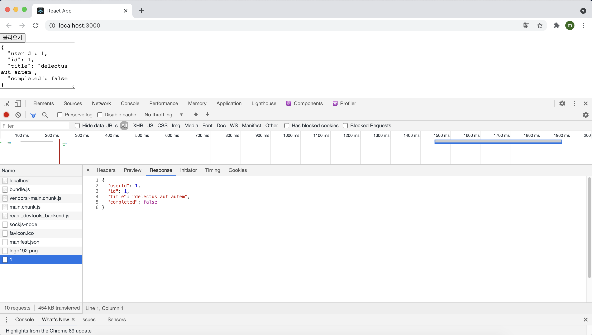
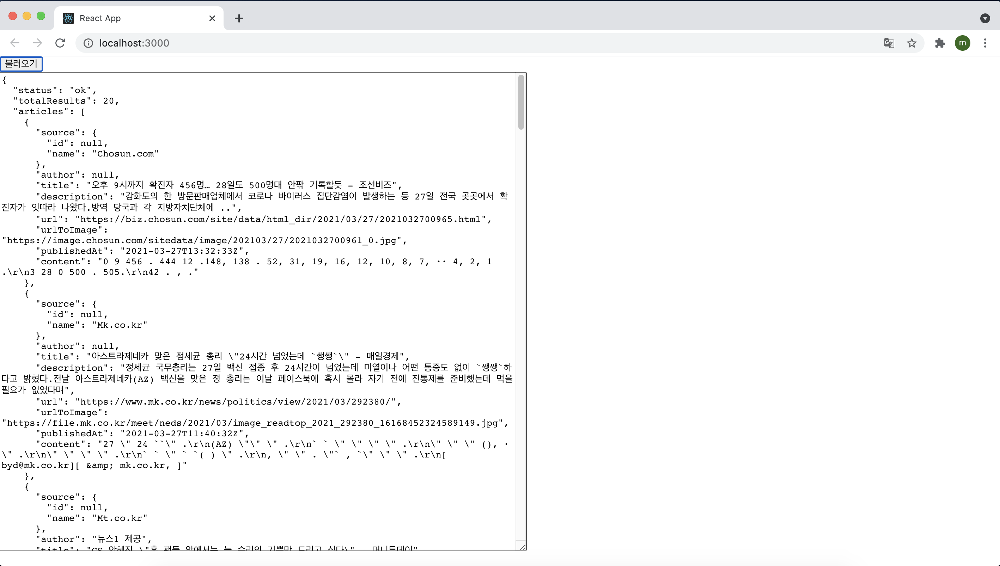
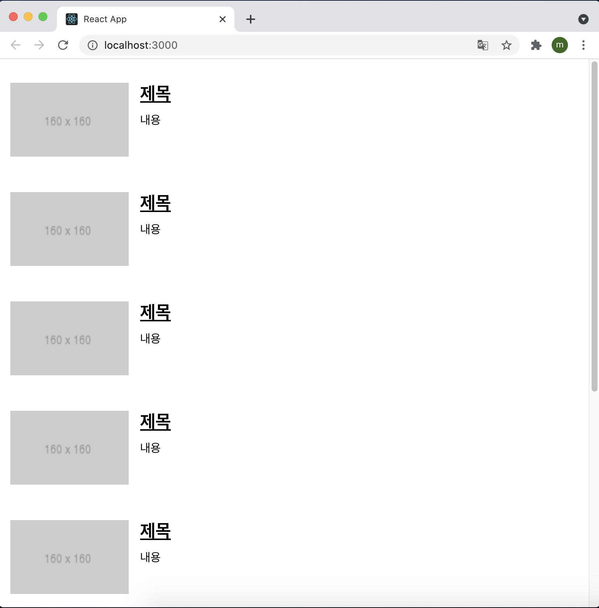

# 외부 API와 연동하여 뉴스 뷰어 만들기

지금까지 배운 내용들을 활용하여 카테고리별로 최신 뉴스 목록을 보여 주는 뉴스 뷰어 프로젝트를 진행해 보도록 하자.

Https://newsapi.org/에서 제공하는 API를 사용하여 데이터를 받아 오고, styled-component를 활용해 프로젝트를 스타일링할 예정이다. 이번 프로젝트는 다음과 같은 흐름으로 진행된다.

> 비동기 작업의 이해 → axios로 API 호출해서 데이터 받아오기 → newapi API 키 발급받기 → 뉴스 뷰어 UI 만들기 → 데이터 연동하기 → 카테고리 기능 구현하기 → 리액트 라우터 적용하기

## 14.1 비동기 작업의 이해

웹 패플리케이션을 만들다 보면 처리할 때 시간이 걸리는 작업이 있다. 예를 들어 웹 애플리케이션에서 서버 쪽 데이터가 필요할 때는 Ajax 기법을 사용하여 서버의 API를 호출함으로써 데이터를 수신한다. 이렇게 서버의 API를 사용해야 할 때는 네트워크 송수신 과정에서 시간이 걸리기 때문에 작업이 즉시 처리되는 것이 아니라, 응답을 받을 때까지 기다렸다가 전달받은 응답 데이터를 처리한다. 바로 이 과정에서 해당 작업을 비동기적으로 처리하게 된다.


만약 작업을 동기적으로 처리한다면 요청이 끝날 때까지 기다리는 동안 중지 상태가 되기 때문에 다른 작업을 할 수 없다. 해당 요청이 끝나야지만 다음 작업을 할 수가 있다. 이는 애플리케이션의 성능을 낮추고 자원을 낭비하는 현상을 발생시킬 수 있다. 하지만 이를 비동기적으로 처리한다면 웹 애플리케이션이 멈추지 않기 때문에 동시에 여러 가지 요청을 처리할 수도 있고, 기다리는 과정에서 다른 함수도 호출할 수 있다. 

이렇게 서버 API를 호출할 때 외에도 작업을 비동기적으로 처리할 때가 있는데, 바로 setTimeout 함수를 사용하여 특정 작업을 예약할 때이다. 예를 들어 다음 코드는 3초 후에 printMe함수를 호출한다.

```react
function printMe() {
  console.log('Hello World!');
}
setTimeout(printMe, 3000);
console.log('대기중...');
```

> -실행결과-
>
> 대기중...
>
> HelloWorld!

setTimeout이 사용되는 시점에서 코드가 3초 동안 멈추는 것이 아니라, 일단 코드가 위부터 아래까지 다 호출되고 3초 뒤에 우리가 지정해주 printMe함수가 호출되고 있다.

자바스크립트에서 비동기 작업을 할 때 가장 흔히 사용되는 방법이 콜백 함수를 사용하는 것이다. 위 코드에서 printMe가 3초 뒤에 호출되도록 printMe 함수 자체를 setTimeout 함수의 인자로 전달해 주었는데, 이런 함수를 콜백함수라고 부른다.

#### 14.1.1 콜백 함수

예를 들어 파라미터 값이 주어지면 1초 뒤에 10을 더해서 반환하는 함수가 있다고 생각해보자. 그리고 해당 함수가 처리된 직후 어떠한 작업을 하고 싶다면 다음과 같이 콜백 함수를 활용해서 작업한다.

```react
function increase(number, callback) {
  setTimeout(() => {
    const result = number + 10;
    if(callback) {
      callback(result);
    }
  },1000);
}

increase(0, result => {
  console.log(result);
});
```

1초에 걸쳐서 10, 20, 30, 40과 같은 형태로 여러 번 순차적으로 처리하고 싶다면 콜백 함수를 중첩하여 구현할 수 있다.

```react
function increase(number, callback) {
  setTimeout(() => {
    const result = number + 10;
    if(callback) {
      callback(result);
    }
  },1000);
}

console.log('작업 시작');
increase(0, result => {
  console.log(result);
  increase(result, result => {
  	console.log(result);
    increase(result, result => {
  		console.log(result);
      increase(result, result => {
  			console.log(result);
        increase(result, result => {
  			console.log(result);
        console.log('작업 완료');
});
```

> -실행 결과-
>
> 작업 시작
>
> 10
>
> 20
>
> 30
>
> 40
>
> 50
>
> 작업 완료

이렇게 콜백 안에 또 콜백을 넣어서 구현할 수 있는데, 여러 번 중첩되니까 코드의 가독성이 나빠졌다. 이러한 형태를 '콜백 지옥'이라고 부른다. 왠만하면 이러한 형태로 코드를 작성하는 것은 지양해야 된다. 

그렇다면 콜백 지옥을 만들지 않기 위한 방법으로는 어떤 방법이 있을까? 

자바스크립트에서 비동기적으로 처리하기 위한 방법으로 **Promise**, **async/await**가 있다

#### 14.1.2 Promise

Promise는 자바스크립트 ES6에 도입된 기능으로 콜백 지옥 같은 코드가 형성되지 않게 하는 방법이다. 앞에 작성한 코드를 Promise를 사용하여 구현해보자.

```react
function increase(number) {
	const promise = new Promise((resole, reject) => {
    // resolve는 성공, reject는 실패
    setTimeout(() => {
      const result = number + 10;
      if(result > 50) {
        // 50보다 높으면 에러 발생시키기
        const e = new Error('Number Too Big');
        return reject(e);
      }
      resolve(result); // number 값에 +10 후 성공 처리
    }, 1000);
  });
  return promise;
}

increase(0)
	.then(number => {
  	// Promise에서 resolve된 값은 .then을 통해 받아 올 수 있다.
  	console.log(number);
  	return increase(number); // Promise를 리턴하면
	})
	.then(number => {
  	console.log(number);
  	return increase(number);
	})
	.then(number => {
  	console.log(number);
  	return increase(number);
	})
	.then(number => {
  	console.log(number);
  	return increase(number);
	})
	.catch(e => {
  	// 도중에 에러가 발생한다면 .catch를 통해 알 수 있다.
  	console.log(e);
	})
```

여러 작업을 연달아 처리한다고 해서 함수를 여러 번 감싸는 것이 아니라 .then을 사용하여 그 다음 작업을 설정하기 때문에 콜백 지옥이 형성되지 않는다.

#### 14.1.3 async/await

async/await는 Promise를 더욱 쉽게 사용할 수 있도록 해 주는 ES2017(ES8) 문법이다. 이 문법을 사용하려면 함수의 앞부분에 async 키워드를 추가하고, 해당 함수 내부에서 Promise의 앞 부분에 await 키워드를 사용한다. 이렇게 하면 Promise가 끝날 때까지 기다리고, 결과 값을 특정 변수에 담을 수 있다.

```react
function increase(number) {
	const promise = new Promise((resole, reject) => {
    // resolve는 성공, reject는 실패
    setTimeout(() => {
      const result = number + 10;
      if(result > 50) {
        // 50보다 높으면 에러 발생시키기
        const e = new Error('Number Too Big');
        return reject(e);
      }
      resolve(result); // number 값에 +10 후 성공 처리
    }, 1000);
  });
  return promise;
}

async function runTasks() {
  // try/catch 구문을 사용하여 에러를 처리
  let result = await increase(0);
  try { 
    console.log(result)
    result = await increase(result);
    console.log(result)
    result = await increase(result);
    console.log(result)
    result = await increase(result);
    console.log(result)
    result = await increase(result);
    console.log(result)
    result = await increase(result);
    console.lgo(result);
  } catch(e) {
    console.log(e);
  }
}
```

## 14.2 axios로 API 호출해서 데이터 받아 오기

axios는 현재 가장 많이 사용되고 있는 자바스크립트 HTTP 클라이언트다. 이 라이브러리의 특징은 HTTP 요철을 Promise 기반으로 처리한다는 점이다. 리액트 프로젝트를 생성하여 이 라이브러리를 설치하고 사용하는 방법을 알아보도록 하자.

`$ yarn create react-app news-viewer`

`$ yarn add axios`

설치를 다 마친 후 App.js의 코드를 다음과 같이 고쳐줬다.

```react
import React, { useState } from "react";
import axios from "axios";

function App() {
  const [data, setData] = useState(null);
  const onClick = () => {
    axios
      .get("https://jsonplaceholder.typicode.com/todos/1")
      .then((response) => {
        setData(response.data);
      });
  };
  return (
    <div>
      <div>
        <button onClick={onClick}>불러오기</button>
      </div>
      {data && (
        <textarea
          rows={7}
          value={JSON.stringify(data, null, 2)}
          readOnly={true}
        />
      )}
    </div>
  );
}

export default App;
```

위 코드는 **불러오기** 버튼을 누르면 JSONPlaceholder에서 제공하는 가짜 API를 호출하고 이에 대한 응답을 컴포넌트 상태에 넣어서 보여주는 예제다.



onClick 함수에서 axios.get 함수를 사용했다. 이 함수는 파라미터로 전달된 주소에 GET 요청을 해준다. 그리고 이에 대한 결과는 .then을 통해 비동기적으로 확인할 수 있다. 위 코드에 async를 적용하려면 아래와 같이 코드를 수정해주면 된다.

```react
import React, { useState } from "react";
import axios from "axios";

function App() {
  const [data, setData] = useState(null);
  const onClick = async () => {
    try{
    	const response = await axios.get("https://jsonplaceholder.typicode.com/todos/1")  
      setData(response.data);
    } catch(e) {
      console.log(e)
    }
  };
  return (
    <div>
      <div>
        <button onClick={onClick}>불러오기</button>
      </div>
      {data && (
        <textarea
          rows={7}
          value={JSON.stringify(data, null, 2)}
          readOnly={true}
        />
      )}
    </div>
  );
}

export default App;
```

화살표 함수에 async/await를 적용할 때는 async () => {} 와 같은 형식으로 적용한다. 불러오기 버튼을 눌렀을 때 이전과 같이 데이터를 잘 받아오는 것을 확인할 수 있다.

## 14.3 newsapi API 키 발급 받기

이번 프로젝트에서는 newsapi에서 제공하는 API를 사용하여 최신 뉴스를 불러온 후 보여 줄 것이다. 이를 수행하기 위해선 사전에 newsapi에서 API 키를 발급받아야 한다. API 키는 https://newsapi.org/register에 가입하면 발급받을 수 있다. 

7f503bc4b6d64e3baa9f7b4593d8e279

API 키는 외부에 노출시키지 않는 것이 좋은데 만약에 나의 API 키를 사용해서 API를 요청하는 사람들이 많다고 가정한다면 사이트 측에서 block을 걸어 버릴 수도 있다. 그렇기에 API키는 나만 알 수 있는 곳에 안전하게 저장을 해두는 습관이 필요하다.

발급받은 API 키는 추후 API를 요청할 때 API 주소의 쿼리 파라미터로 넣어서 사용하면 된다. 우리가 사용할 API에 대해서 알아보자. https://newsapi.org/s/south-korea-news-api 링크에 들어가면 한국 뉴스를 가져오는 API에 대한 설명서가 있다.

사용할 API 주소는 두 가지 형태다.

1. 전체 뉴스 불러오기

   GET https://newsapi.org/v2/top-headlines?country=kr&apiKey=7f503bc4b6d64e3baa9f7b4593d8e279

2. 특정 카테고리 뉴스 불러오기

   GET https://newsapi.org/v2/top-headlines?country=kr&category=technology&apiKey=7f503bc4b6d64e3baa9f7b4593d8e279

이제 기존 리액트 프로젝트에서 사용해던 JSONPlacholder 가짜 API를 전체 뉴스를 불러오는 API로 대체하면 다음과 같이 전체 뉴스를 정상적으로 불러오는 것을 확인할 수 있다.



## 14.4 뉴스 뷰어 UI 만들기

styled-Component를 사용하여 뉴스 정보를 보여 줄 컴포넌트를 만들어 보자

Src 디렉터리 안에 components를 만들고 그 안에 NewsItem.js와 NewsList.js 파일을 만들어 준다. NewsItem은 각 뉴스 정보를 보여 주는 컴포넌트이고, NewsList는 API를 요청하고 뉴스 데이터가 들어 있는 배열을 컴포넌트 배열로 변환하여 렌더링해 주는 컴포넌트다.

#### 14.4.1 NewsItem

NewsItem을 만들기 전에 각 뉴스 데이터에 어떤 필드가 있는지 확인해보는 것이 필요하다. 위의 첨부된 이미지를 보면 전체 뉴스 API를 호출했을 때 받아오는 JSON 데이터인데 내가 사용할 데이터는 아래와 같다.

- title: 제목
- description: 내용
- url: 링크
- urlToImage: 뉴스 이미지

NewsItem 컴포넌트는 article이라는 객체를 props로. 통째로 받아 와서 사용한다. NewsItem 컴포넌트를 아래와 같이 작성해줬다.

```react
import React from "react";
import styled from "styled-components";

const NewItemBlock = styled.div`
  display: flex;
  .thumbnail {
    margin-right: 1rem;
    img {
      display: block;
      width: 160px;
      height: 100px;
      object-fit: cover;
    }
  }
  .contents {
    h2 {
      margin: 0;
      a {
        color: black;
      }
    }
    p {
      margin: 0;
      line-height: 1.5;
      margin-top: 0.5rem;
      white-space: normal;
    }
  }
  & + & {
    margin-top: 3rem;
  }
`;

const NewsItem = ({ article }) => {
  const { title, description, url, urlToImage } = article;
  return (
    <NewItemBlock>
      {urlToImage && (
        <div className="thumbnail">
          <a href={url} target="_blank" rel="noopener noreferrer">
            
          </a>
        </div>
      )}
      <div className="contents">
        <h2>
          <a href={url} target="_blank" rel="noopener noreferrer">
            {title}
          </a>
        </h2>
        <p>{description}</p>
      </div>
    </NewItemBlock>
  );
};

export default NewsItem;
```

#### 14.4.2 NewsList

이 컴포넌트에서 API 요청을 하게 될텐데 아직 데이터를 불러오지 않고 있으니 sampleArticle이라는 객체에 미리 예시 데이터(Mock Data)를 넣은 후 각 컴포넌트에 전달하여 가짜 내용을 보이게 해줬다.

```react
import React from "react";
import styled from "styled-components";
import NewsItem from "./NewsItem";

const NewsListBlock = styled.div`
  box-sizing: border-box;
  padding-bottom: 3rem;
  width: 768px;
  margin: 0 auto;
  margin-top: 2rem;
  @media screen and (max-width: 768px) {
    width: 100%;
    padding-left: 1rem;
    padding-right: 1rem;
  }
`;

const sampleArticle = {
  title: "제목",
  description: "내용",
  url: "https://google.com",
  urlToImage: "https://via.placeholder.com/160",
};

const NewsList = () => {
  return (
    <NewsListBlock>
      <NewsItem article={sampleArticle} />
      <NewsItem article={sampleArticle} />
      <NewsItem article={sampleArticle} />
      <NewsItem article={sampleArticle} />
      <NewsItem article={sampleArticle} />
      <NewsItem article={sampleArticle} />
      <NewsItem article={sampleArticle} />
      <NewsItem article={sampleArticle} />
    </NewsListBlock>
  );
};

export default NewsList;
```

그런 다음 App 컴포넌트를 다 지우고 NewsList를 렌더링 해주면 다음과 같은 화면이 나타나게 된다.



