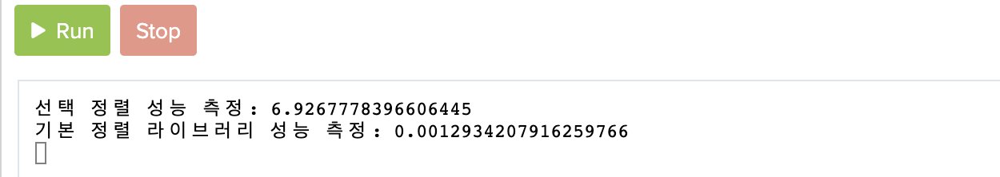

복잡도는 알고리즘의 성능을 나타내는 척도이다. 복잡도는 크게 시간 복잡도(Time Complexity)와 공간 복잡도(Space Complexity)로 나눌 수 있다.

쉽게 말해 **시간 복잡도**는 특정한 크기의 입력에 대하여 **알고리즘이 얼마나 오래 걸리느냐**를 의미하고, **공간 복잡도** 는 특정한 크기의 입력에 대하여 **알고리즘이 얼마나 많은 메모리를 차지하느냐**이다

동일한 기능을 수행하는 알고리즘이 있다면 일반적으로 복잡도가 낮을수록 좋은 알고리즘이다.

복잡도를 측정함으로써 다음의 2가지를 계산할 수 있다.

- 시간 복잡도: 알고리즘을 위해 필요한 연산의 횟수
- 공간 복잡도: 알고리즘을 위해 필요한 메모리의 양

효율적인 알고리즘을 사용한다고 했을 때 보통 시간 복잡도와 공간 복잡도는 일종의 거래 관계(Trade off)가 성립된다. 즉, 메모리를 조금 더 사용하는 대신 반복되는 연산을 생략하거나 더욱 많은 정보를 관리하며 계산의 복잡도를 줄일 수 있다. 이때 메모리를 더 소모하는 대신에 시간적인 이점이 매우 큰 경우가 종종 있는데 이렇게 메모리를 사용하여 시간을 비약적으로 줄이는 방법을 **메모이제이션** 이라고 한다. 이 개념은 추후에 살펴보도록 하자.

#### 시간 복잡도

알고리즘을 풀 때 단순히 '복잡도'라고 하면 보통은 시간 복잡도를 의미한다.

시간 복잡도를 표현할 때는 빅오(BIg-O) 표기법을 사용한다. 빅오 표기법을 간단히 정의하자면 가장 빠르게 증가하는 항만을 고려하는 표기법을 말한다. 다시 말해 함수의 상한만을 나타낸다.


```python
array = [3, 5, 1, 2, 4]
sumOfArray = 0

for x in array:
  sumOfArray += x
  
print(sumOfArray)
```

위 코드는 5개의 데이터를 차례대로 더하여 결과를 출력하는 코드이다. 이때 연산횟수를 보게 되면 총 5번을 더해주므로 연산횟수는 입력값의 갯수 N에 비례하는 것을 알 수 있다. 물론 변수를 선언하는 과정도 있고 변수를 출력하는 과정도 있지만 이런 과정들은 상대적으로 N이 커짐에 따라 무시할 수 있을 정도로 작아진다. 따라서 위 코드에서 가장 **영향력이 큰 부분** 은 N에 비례하는 연산을 수행하는 반복문이므로 시간 복잡도는 O(N)이 된다.


```python
array = [3, 5, 1, 2, 4]

for i in array:
  for j in array:
    temp = i * j
    print(temp)
```

위 코드는 데이터의 개수가 N개일 때, _O(n<sup>2</sup>)_의 시간 복잡도를 가진다. 2중 반복문을 이용하여 각 원소에 대하여 다른 모든 원소와의 곱셈의 결과를 출력하고 있기 때문이다.

하지만 모든 2중 반복문의 시간 복잡도가 _O(n<sup>2</sup>)_은 아니다. 구현한 코드가 내부적으로 다른 메서드를 호출한다면 내부 메서드의 시간 복잡도까지 고려해야 하기 때문이다. 따라서 소스코드를 정확히 분석한 뒤에 시간 복잡도를 계산해야 한다는 점을 명심해야 한다.

반면, 퀵 정렬(Quick sort)의 평균 시간 복잡도는 _O(NlogN)_이지만 최악의 경우 시간 복잡도는 _O(n<sup>2</sup>)_ 이다. 일반적인 코딩 테스트의 경우에는 최악의 경우에 대한 연산 횟수가 가장 중요하기 때문에 최악의 경우의 시간 복잡도를 우선적으로 고려해야 한다.

| 빅오 표기법        |           명칭           |
| ------------------ | :----------------------: |
| _O(1)_             | 상수 시간(Constant time) |
| _O(logN)_          |   로그 시간(Log time)    |
| _O(N)_             |        선형 시간         |
| _O(NlogN)_         |      로그 선형 시간      |
| _O(N<sup>2</sup>)_ |        이차 시간         |
| _O(N<sup>3</sup>)_ |        삼차 시간         |
| _O(2<sup>n</sup>)_ |        지수 시간         |

이처럼 일반적인 빅오 표기법에서는 차수가 가장 큰 항만 남기는 것이 보통이지만, 그렇지 않은 경우(ex: 상수가 아주 큰 경우)도 있으니 빅오 표기법이 항상 절대적인 것은 아니라는 점을 인지하자.

다음으로 각기 다른 시간 복잡도의 연산 횟수가 N의 크기에 따라서 어떻게 분포되는지 확인해보자.

|                    | N = 1000일 때 연산 횟수 |
| ------------------ | :---------------------: |
| _O(N)_             |          1,000          |
| _O(NlogN)_         |         10,000          |
| _O(N<sup>2</sup>)_ |        1,000,000        |
| _O(N<sup>3</sup>)_ |      1,000,000,000      |

위 표는 각각의 시간 복잡도에 따른 대략적인 연산 횟수를 보여주는 표로, 시간 복잡도가 동일하더라도 실제 연산 횟수에서는 차이가 날 수 있다. 

예를 들어 시간 복잡도가 _O(NlogN)_ 인 알고리즘은 매우 다양하게 존재한다. 하지만 빅오 표기법으로 표기한 시간 복잡도가 같더라도 알고리즘 내부 로직 및 차수가 낮은 항의 영향에 따라 10,000번, 100,000번 등 실제 수행되는 연산 횟수는 다를 수 있다.

> 💬
>
> 보통 시간 복잡도에서의 '연산'은 프로그래밍 언어에서 지원하는 사칙 연산, 비교 연산 등과 같은 기본 연산을 의미한다.
>
> 예를 들어 두 정수 a와 b를 더하는 더하기 연산뿐만 아니라, 두 정수를 비교하는 연산 또한 한 번의 연산으로 취급한다.

시간 복잡도 분석은 문제 풀이의 핵심이다. 그렇기에 문제 내의 주어진 데이터의 갯수를 보고 어떤 알고리즘을 사용해야할 지 정하는 전략을 취할 수도 있다.

일반적으로 문제를 풀 때의 예시를 보자. 다음은 모두 시간 제한이 1초인 문제에 대한 예시이다. 

- N의 범위가 500인 경우: 시간 복잡도가 _O(N<sup>3</sup>)_ 인 알고리즘을 설계하면 문제 해결 가능
- N의 범위가 2000인 경우: 시간 복잡도가 _O(N<sup>2</sup>)_ 인 알고리즘을 설계하면 문제 해결 가능
- N의 범위가 100,000인 경우: 시간 복잡도가 _O(NlogN)_인 알고리즘을 설계하면 문제 해결 가능
- N의 범위가 10,000,000인 경우: 시간 복잡도가 _O(N)_ 인 알고리즘을 설계하면 문제 해결 가능


#### 공간 복잡도

공간 복잡도도 시간 복잡도와 마찬가지로 빅오 표기법으로 표기한다. 다만 시간 복잡도에서 1초라는 절대적인 제한이 있던 것처럼, 공간 복잡도에도 메모리 사용량에 절대적인 제한이 있다.

> ❗️
>
> 코딩 테스트의 문제는 대부분 배열(리스트)를 사용해서 뭎어야 한다. 대부분의 문제는 다수의 데이터에 대한 효율적인 처리를 요구하기 때문이다. 그렇다면 고전적인 프로그래밍 언어에서 정수형 자료형인 `int` 를 기준으로 리스트 크기에 따른 메모리 사용량을 확인해보자. 단, 실제로 컴퓨터 시스템에서 차지하는 메모리양은 컴파일러에 따라 조금씩 다르게 적용될 수 있다.
>
> ```c
> int a[1000]: 4KB
> int a[1000000]: 4MB
> int a[2000][2000]: 16MB
> ```
>
> 코딩 테스트에서는 보통 메모리 사용량을 128~512MB 정도로 제한한다. 다시 말해 일반적인 경우 데이터의 개수가 1000만 단위가 넘어가지 않도록 알고리즘을 설계해야 한다는 의미다. 


#### 시간과 메모리 측정

실질적인 알고리즘의 소요 시간을 측정하는 것은 알고리즘의 효율성을 측정하는 가장 기본적인 방법이다. 그렇기에 프로그램의 소요 시간을 측정하는 방법을 알아두어야 한다.

```python
import time
start_time = time.time() # 측정 시작

# 프로그램 소스코드

end_time = time.time() # 측정 종료
print("time:", end_time - start_time) # 수행 시간 출력
```


예를 들어 '선택 정렬'과 '파이썬의 기본 정렬 라이브러리'의 속도를 비교할 때는 다음과 같이 코드를 작성할 수 있다.

```python
from random import randint
import time

# 배열에 10,000개의 정수를 삽입
array = []
for _ in range(10000):
    array.append(randint(1, 100)) # 1부터 100 사이의 랜덤한 정수

# 선택 정렬 프로그램 성능 측정
start_time = time.time()

# 선택 정렬 프로그램 소스코드
for i in range(len(array)):
    min_index = i # 가장 작은 원소의 인덱스
    for j in range(i + 1, len(array)):
        if array[min_index] > array[j]:
            min_index = j
    array[i], array[min_index] = array[min_index], array[i] # 스와프

end_time = time.time() # 측정 종료
print("선택 정렬 성능 측정:", end_time - start_time) # 수행 시간 출력

# 배열을 다시 무작위 데이터로 초기화
array = []
for _ in range(10000):
    array.append(randint(1, 100)) # 1부터 100 사이의 랜덤한 정수

# 기본 정렬 라이브러리 성능 측정
start_time = time.time()

# 기본 정렬 라이브러리 사용
array.sort()

end_time = time.time() # 측정 종료
print("기본 정렬 라이브러리 성능 측정:", end_time - start_time) # 수행 시간 출력
```

선택 정렬을 사용할 때 최악의 경우 시간 복잡도가 _O(N<sup>2</sup>)_ 이며, 파이썬의 기본 정렬 라이브러리는 최악의 경우 시간 복잡도가 _O(NlogN)_ 을 보장하여 상대적으로 빠르다. 실제로 수행 시간 측정 결과 아래와 같은 결과를 보였다.



이처럼 설계한 알고리즘의 성능을 실제로 확인하기 위하여, 시간 측정 라이브러리를 사용해보는 습관을 기르는 것이 좋다.