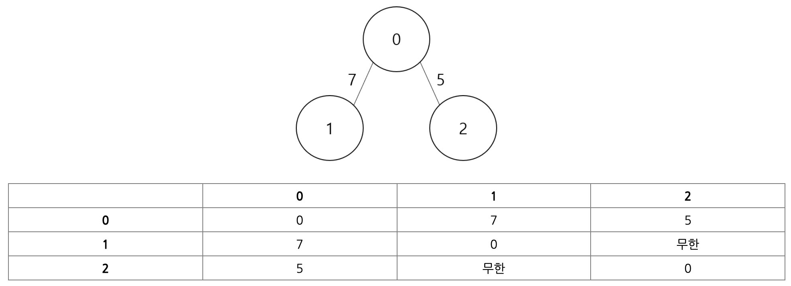
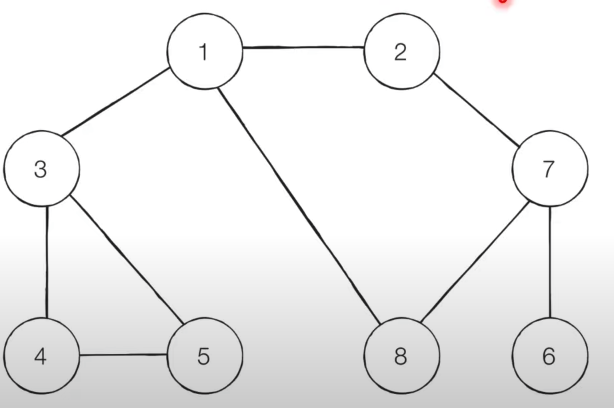

# 꼭 필요한 자료구조 기초

탐색이란 **많은 양의 데이터 중에서 원하는 데이터를 찾는 과정**을 말한다. 대표적인 탐색 알고리즘으로 DFS와 BFS를 꼽을 수 있는데 이 두 알고리즘의 원리를 제대로 이해해야 탐색 유형의 문제를 풀 수 있다. 

DFS/BFS를 제대로 이해하려면 기본 자료구조인 스택과 큐에 대한 이해가 전제되어야하므로 스택과 큐 그리고 재귀함수에 대해서 간단히 정리해보도록 하자.

자료구조(Data Structure)란 **데이터를 표현하고 관리하고 처리하기 위한 구조**를 의미한다. 그 중 스태과 큐는 자료구조의 기초 개념으로 다음의 두 핵심적인 함수로 구성된다.

- 삽입(Push): 데이터를 삽입
- 삭제(Pop): 데이터를 삭제

실제로 스택과 큐를 사용할 때는 삽입과 삭제 외에도 오버플로와 언더플로를 고민해야 한다. 오버플로(Overflow)는 특정한 자료구조가 수용할 수 있는 데이터의 크기를 이미 가득 찬 상태에서 삽입 연산을 수행할 때 발생한다. 즉, 저장 공간을 벗어나 데이터가 넘쳐흐를 때 발생한다. 반면에 특정한 자료구조에 데이터가 전혀 들어가 있지 않은 상태에서 삭제 연산을 수행하면 데이터가 전혀 없는 상태이므로 언더플로(Underflow)가 발생한다.

## 스택

스택은 박스 쌓기에 비유할 수 있다. 아래에서부터 위로 차곡차곡 쌓고 아래에 있는 박스를 치우기 위해서는 위에 있는 박스를 먼저 내려야 한다. 이러한 구조를 선입후출(FILO) 구조 또는 후입선출(LIFO)구조라고 한다.

이러한 구조를 파이썬 코드로 표현하면 아래와 같다.

```python
stack = []

# 삽입
stack.append(5)
stack.append(2)
stack.append(4)
stack.append(7)
stack.pop()
stack.append(3)
stack.append(9)
stack.pop()

print(stack) # 최하단 원소부터 출력
print(stack[::-1]) # 최상단 원소부터 출력
```

파이썬에서 스택을 이용할 때는 별도의 라이브러리를 사용할 필요 없이 기본 리스트에서 `append()` 와 `pop()` 을 사용하면 스택 자료구조와 동일하게 동작한다. `append()` 메서드는 리스트의 가장 뒤 쪽에 데이터를 삽입하고, `pop()` 메서드는 리스트의 가장 뒤쪽에서 데이터를 꺼내기 때문이다.

----

## 큐

큐는 대기줄에 비유할 수 있다. 흔히 놀이공원을 가기 위해 줄을 섰다고 가정하면 먼저 도착한 사람들이 먼저 들어간다. 나중에 온 사람일수록 나중에 들어가기 때문에 흔히 '공정한' 자료구조라고 비유된다. 이러한 구조를 선입선출(FIFO) 구조라고 한다.

이러한 구조를 파이썬 코드로 표현하면 아래와 같다.

```python
from collections import deque

# 큐(Queue) 구현을 위해 deque 라이브러리 사용
queue = deque()

# 삽입

queue.append(5)
queue.append(2)
queue.append(4)
queue.append(7)
queue.popleft()
queue.append(3)
queue.append(9)
queue.popleft()

print(queue)  # 먼저 들어온 순서대로 출력
queue.reverse()  # 다음 출력을 위해 역순으로 바꾸기
print(queue)  # 나중에 들어온 원소부터 출력
```

파이썬으로 큐를 구현할 때는 `collections` 모듈에서 제공하는 `deque` 자료구조를 활용하면 된다.  `deque` 는 스택과 큐의 장점을 모두 채택한 것인데 데이터를 넣고 빼는 속도가 리스트 자료형에 비해 효율적이며 `queue` 라이브러리를 이용하는 것보다 더 간단하다. 그리고 대부분의 코딩 테스트에서는 `collections` 모듈과 같은 기본 라이브러리의 사용을 허용하기 때문에 사용하는 것이 좋다.

만약 `deque` 객체를 리스트 자료형으로 변경하고자 하면 `list()` 메서드를 이용하면 된다. 

----

## 재귀함수

재귀함수란 **자기 자신을 다시 호출하는 함수**를 의미한다.

```python
def recursive_function():
  print('재귀함수를 호출합니다.')
  recursive_function()
  
recursive_function()
```

이 코드를 실행하면 '재귀함수를 호출합니다.' 라는 문장이 무한히 출력된다. 하지만 어느 정도 출력하다가 다음과 같은 오류 메세지를 출력하고 말 것이다.

> RecursionError: maximum recursion depth exceeded while calling a Python object

이 오류 메세지는 재귀의 최대 깊이를 초과했다는 내용이다. 보통 파이썬 인터프리터는 호출 횟수 제한이 있는데 이 한계를 벗어나서 이 메세지가 출력되는 것이다. 따라서 무한대로 재귀 호출을 진행할 수는 없다.

**재귀 함수의 종료 조건**

재귀 함수를 문제 풀이에서 사용할 때는 재귀 함수가 언제 끝날지, 종료 조건을 꼭 명시해야 한다.

종료조건이 명시되지 않으면 함수가 무한 호출될 수 있다.

```python
def recursive_function(i):
    # 100번째 출력했을 때 종료되도록 종료 조건 명시
    if i == 100:
        return
    print(i, '번째 재귀 함수에서', i+1, '번째 재귀함수를 호출합니다.')
    recursive_function(i + 1)
    print(i, '번째 재귀 함수를 종료합니다.')


recursive_function(1)
```

컴퓨터 내부에서 재귀 함수의 수행은 스택 자료구조를 이용한다.  함수를 계속 호출했을 때 가장 마지막에 호출한 함수가 먼저 수행을 끝내야 그 앞의 함수 호출이 종료되기 때문이다. 컴퓨터의 구조 측면에서 보자면 연속해서 호출되는 함수는 메인 메모리의 스택 공간에 적재되므로 재귀 함수는 스택 자료구조와 같다는 말은 틀린 말이 아니다. 따라서 스택 자료구조를 활용해야 하는 상당수 알고리즘은 재귀 함수를 이용해서 간편하게 구현될 수 있다. DFS가 대표적인 예다.

또한 재귀함수를 이용하는 대표적인 예제로 팩토리얼 문제가 있따. 수학적으로 0!과 1!의 값은 1로 같다는 성질을 이용해서 팩토리얼 메서드는 n이 1 이하가 되었을 때 함수를 종료하는 재귀 함수의 형태로 구현할 수 있다.

```python
# 반복적으로 구현한 n!
def factorial_iterative(n):
    result = 1
    # 1부터 n까지의 수를 차례대로 곱하기
    for i in range(1, n+1):
        result *= i
    return result


# 재귀적으로 구현한 n!
def factorial_recursive(n):
    if n <= 1:    # n이 1 이하인 경우 1을 반환
        return 1
    # n! = n * (n-1)!를 그대로 코드로 작성
    return n * factorial_recursive(n - 1)


print('반복적으로 구현:', factorial_iterative(5))
print('재귀적으로 구현:', factorial_recursive(5))
```

실행 결과는 동일하다. 그렇다면 반복문 대신에 재귀 함수를 사용했을 때 얻을 수 있는 이점은 무엇일까?

우선 코드가 더 간결하다. 간결해진 이유는 수학의 점화식(재귀식)을 그대로 소스코드로 옮겼기 때문이다. 수학에서 점화식은 특정한 함수를 자신보다 더 작은 변수에 대한 함수와의 관계로 표현한 것을 의미한다. 이 개념은 '다이나믹 프로그래밍'으로 이어지기 때문에 중요한 개념이다.

팩토리얼을 수학적 점화식으로 표현해보면 다음과 같다.

1. n이 0 혹은 1일 때: *factorial(n) = 1*
2. n이 1보다 클 때: *factorial(n) = n x factorial(n-1)*

일반적으로 점화식에서는 종료 조건을 찾을 수 있는데, 앞 예시에서 종료 조건은 'n이 0 혹은 1일 때'이다. 팩토리얼은 n이 양의 정수일 때만 유효하기 때문에 n이 1이하인 경우 1을 반환할 수 있도록 재귀함수를 작성해야 한다. n이 1 이하인 경우를 고려하지 않으면 재귀 함수가 무한히 반복되어 결과를 출력하지 못할 것이다. 또한 n의 값으로 음수가 들어와을 때는 입력 범위 오류로, 오류 메세지를 띄우도록 코드를 작성할 수도 있다. 따라서 재귀 함수 내에서 특정 조건일 때 더 이상 재귀적으로 함수를 호출하지 않고 종료하도록 if문을 이용하여 꼭 종료 조건을 구현해주어야 한다.

다시 한번 앞의 점화식과 조금 전에 작성했던 팩토리얼의 재귀 함수 버전을 비교해보자. 재귀 함수의 소스코드와 점화식이 매우 닮아있는 것을 확인할 수 있다. 다시 말해 재귀 함수는 반복문을 이용하는 것과 비교했을 때 더욱 간결한 형태임을 이해할 수 있다.

# 탐색 알고리즘 DFS/BFS

## DFS

DFS는 Depth-First-Search, 깊이 우선 탐색이라고도 부르며, 그래프에서 깊은 부분을 우선적으로 탐색하는 알고리즘이다. 

여기서 그래프는 노드(Node)와 간선(Edge)으로 표현되며 이때 노드를 정점(Vertex)이라고도 말한다. 그래프 탐색이란 하나의 노드를 시작으로 다수의 노드를 방문하는 것을 말한다. 또한 두 노드가 간선으로 연결되어 있다면 '두 노드는 인접하다(Adjacent)'라고 표현한다.

갑자기 노드와 간선이라는 생소한 단어가 나와서 헷갈릴 수 있는데, 일반적으로 그래프를 표현할 때 사용하는 단어들이다. 쉽게 이해하기 위해서 노드를 도시, 간선을 도로라고 생각하면, A라는 도시(노드)에서 B라는 도시(노드)로 이동하기 위해서, A와 B 사이를 연결하는 도로(간선)을 지난다고 이해하면 쉬울 것이다.

프로그래밍에서 그래프는 크게 2가지 방식으로 표현할 수 있다.

- 인접 행렬(Adjacency Matrix): 2차원 배열로 그래프와 연결 관계를 표현하는 방식
- 인접 리스트(Adjacency List): 리스트로 그래프의 연결 관계를 표현하는 방식



먼저 인접 행렬 방식은 2차원 배열에 각 노드가 연결된 형태를 기록하는 방식이다. 위와 같인 연결된 그래프를 인접 행렬로 표현할 때 파이썬에서는 2차원 리스트로 구현할 수 있다.

연결되어 있지 않은 노드끼리는 무한(infinity)의 비용이라고 작성한다. 실제 코드에서는 논리적으로 정답이 될 수 없는 큰 값중에서 9999999999, 987654321 등의 값으로 초기화하는 경우가 많다. 인접 행렬 방식으로 처리할 때는 다음과 같이 데이터를 초기화한다.

```python
INF = 999999999  # 무한의 비용 선언

# 2차원 리스트를 이용해 인접 행렬 표현
graph = [
    [0, 7, 5],
    [7, 0, INF],
    [5, INF, 0]
]

print(graph)
```

그렇다면 인접 리스트 방식에서는 데이터를 어떤 방식으로 저장할까? 인접 리스트 방식에서는 모든 노드에 연결된 노드에 대한 정보를 차례대로 연결하여 저장한다.

인접 리스트는 '연결 리스트'라는 자료구조를 이용해 구현하는데, C++이나 자바와 같은 프로그래밍 언어에서는 별도로 연결 리스트 기능을 위한 표준 라이브러리를 제공한다. 반면에 파이썬은 기본 자료형인 리스트 자료형이 `append()` 와 메서드를 제공하므로, 전통적인 프로그래밍 언어에서의 배열과 연결 리스트의 기능을 모두 기본으로 제공한다. 파이썬으로 인접 리스트를 이용해 그래프를 표현하고자 할 때에도 단순히 2차원 리스트를 이용하면 된다는 점을 기억하자.

다음은 예제 그래프를 인접 리스트 방식으로 처리할 때 데이터를 초기화한 코드다.

```python
# 행(Row)가 3개인 2차원 리스트로 인접 리스트 표현
graph = [[] for _ in range(3)]

# 노드 0에 연결된 노드 정보 저장(노드, 거리)
graph[0].append((1, 7))
graph[0].append((2, 5))

# 노드 1에 연결된 노드 정보 저장(노드, 거리)
graph[1].append((0, 7))

# 노드 0에 연결된 노드 정보 저장(노드, 거리)
graph[2].append((0, 5))

print(graph)
```

*이 두 방식은 어떤 차이가 있을까?*

메모리 측면에서 보면 인접 행렬 방식은 모든 관계를 저장하므로 노드 개수가 많을 수록 메모리가 불필요하게 저장된다. 반면에 인접 리스트 방식은 연결된 정보만을 저장하기 때문에 메모리를 효율적으로 사용한다. 하지만 이와 같은 속성 때문에 인접 리스트 방식은 인접 행렬 방식에 비해 특정한 두 노드가 연결되어 있는지에 대한 정보를 얻는 속도가 느리다. 인접 리스트 방식에서는 연결된 데이터를 하나씩 확인해야 하기 때문이다.

예를 들어 노드 1과 노드 7이 연결되어 있는지를 확인해보자. 인접 행렬 방식에서는 `graph[1][7]` 만 확인하면 된다. 반면에 인접 리스트 방식에서는 노드 1에 대한 인접 리스트를 앞에서부터 차례대로 확인해야 한다. 그러므로 특정한 노드와 연결된 모든 인접 노드를 순회해야 하는 경우, 인접 리스트 방식이 인접 행렬 방식에 비해 메모리 공간의 낭비가 적다.

*DFS는 탐색을 위해서 사용되는 알고리즘이라고 했는데 구체적으로 어떻게 동작할까?*

이 알고리즘은 특정한 경로로 탐색하다가 특정한 상황에서 최대한 깊숙이 들어가서 노드를 방문한 후, 다시 돌아가 다른 경로로 탐색하는 알고리즘이다.

DFS는 스택 자료구조를 이용하며 구체적인 동작 과정은 다음과 같다.

1. 탐색 시작 노드를 스탭에 삽입하고 방문 처리를 한다.
2. 스택의 최상단 노드에 방문하지 않은 인접 노드가 있으면 그 인접 노드를 스택에 넣고 방문 처리를 한다. 방문하지 않은 인접 노드가 없으면 스택에서 최상단 노드를 꺼낸다.
3. 2번의 과정을 더 이상 수행할 수 없을 때까지 반복한다.

다음과 같은 그래프를 생각해보자 노드 1을 시작 노드로 설정하여 DFS를 이용해 탐색을 진행하면 어떻게 될까? 직관적으로 생각하면, 깊이 우선 탐색이라는 이름에서도 알 수 있듯이 단순하게 가장 깊숙이 위치하는 노드에 닿을 때까지 확인(탐색)하면 된다.



DFS를 이용하여 탐색하면 그 과정은 다음과 같다. 또한 일반적으로 인접한 노드 중에서 방문하지 않은 노드가 여러 개 있으면 번호가 낮은 순서부터 처리한다.

> ❗️
>
> DFS의 기능을 생각하면 순서와 상관없이 처리해도 되지만, 코딩 테스트에서는 번호가 낮은 순서부터 처리하도록 명시하는 경우가 종종 있다. 따라서 관행적으로 번호가 낮은 순서부터 치리하도록 구현해도 문제가 없다.

깊이 우선 탐색(DFS) 알고리즘은 스택 자료구조에 기초한다는 점에서 구현이 간단하다. 실제로는 스택을 쓰지 않아도 되며 탐색을 수행함에 있어서 데이터의 개수가 N개인 경우 *O(N)* 의 시간이 소요된다는 특징이 있다.

또한 DFS는 스택을 이용하는 알고리즘이기 때문에 실제 구현은 재귀 함수를 이용했을 때 매우 간결하게 구현할 수 있다.

```python
# DFS 메서드 정의
def dfs(graph, v, visited):
    # 현재 노드를 방문 처리
    visited[v] = True
    print(v, end=' ')
    # 현재 노드와 연결된 다른 노드를 재귀적으로 방문
    for i in graph[v]:
        if not visited[i]:
            dfs(graph, i, visited)
            
            
# 각 노드가 연결된 정보를 리스트 자료형으로 표현(2차원 리스트)
graph = [
    [],
    [2, 3, 8],
    [1, 7],
    [1, 4, 5],
    [3, 5],
    [3, 4],
    [7],
    [2, 6, 8],
    [1, 7]
]

# 각 노드가 방문한 정보를 리스트 자료형으로 표현(1차원 리스트)
visited = [False] * 9

# 정의된 DFS 함수 호출
dfs(graph, 1, visited)
```

