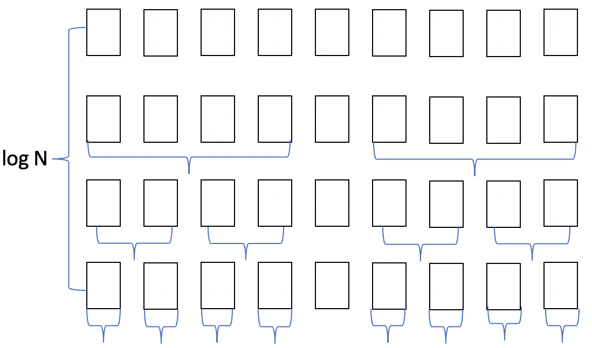

# 기준에 따라 데이터를 정렬

정렬이란 데이터를 특정한 기준에 따라 순서대로 나열하는 것을 말한다. 프로그램에서 데이터를 가공할 때 어떤 식으로든 정렬해서 사용하는 경우가 많기 때문에 정렬 알고리즘은 프로그램을 작성할 때 가장 많이 사용되는 알고리즘 중 하나다. 정렬 알고리즘으로 데이터를 정렬하면 이진 탐색이 가능해진다. 즉 정렬 알고리즘은 이진 탐색의 전처리 과정이기도 하니 정렬 알고리즘을 정확하게 아는 것이 중요하다.

#### 선택 정렬

컴퓨터가 데이터를 정렬할 때 어떻게 할 지 한번 생각해보자. 데이터가 무작위로 여러 개 있을 때, **이 중에서 가장 작은 데이터를 선택해 맨 앞에 있는 데이터와 바꾸고, 그다음 작은 데이터를 선택해 앞에서 두 번째 데이터와 바꾸는 과정을 반복하면 어떨까?** 이 방법은 가장 원시적인 방법으로 매번 '가장 작은 것을 선택'한다는 의미에서 선택 정렬(Selection Sort) 알고리즘이라고 한다.

다시 말해, 가장 작은 것을 선택해서 앞으로 보내는 과정을 반복해서 수행하다 보면, 전체 데이터의 정렬이 이루어지는 것이다. 선택 정렬은 가장 작은 데이터를 앞으로 보내는 과정을 N - 1번 반복하면 정렬이 완료되는 것을 알 수 있다.

```python
array = [7, 5, 9, 0, 3, 1, 6, 2, 4, 8]

for i in range(len(array)):
    min_index = i  # 가장 작은 원소의 인덱스
    for j in range(i + 1, len(array)):
        if array[j] < array[min_index]:
            min_index = j
    array[i], array[min_index] = array[min_index], array[i]  # 스와프

print(array)
```

여기서 처리된 값들을 스와프 해주었다. 스와프란 특정한 리스트가 주어졌을 때 두 변수의 위치를 변경하는 작업을 의미한다. 파이썬에서는 위와 같이 간단하게 두 원소의 위치를 변경할 수 있다.

**선택 정렬의 시간 복잡도**

선택 정렬은 N - 1번 만큼 가장 작은 수를 찾아서 맨 앞으로 보내야 한다. 또한 매번 가장 작은 수를 찾기 위해 비교 연산이 필요하다. 구현 방식에 따라서 사소한 오차는 있을 수 있지만 위 코드대로 구현했을 시 연산 횟수는 N + (N - 1) + (N -2) + ... + 2로 볼 수 있다. 따라서 근사치로 N x (N + 1) / 2번의 연산을 수행한다고 가정하면 이는 *(N<sup>2</sup> + N) / 2* 로 표현할 수 있는데, 빅오 표기법으로 간단히 *O(N<sup>2</sup>)* 로 표현할 수 있다.

앞서 반복문이 얼마나 중첩됐는지를 기준으로 간단히 시간 복잡도를 판단할 수 있다고 했다. 선택 정렬의 시간 복잡도는 *O(N<sup>2</sup>)* 이다. 따라서 이중 반복문이 사용됐다고 이해할 수 있다.

만약 정렬해야 할 데이터의 개수가 100배 늘어나면, 이론적으로 수행시간은 10,000배로 늘어난다. 이러면 시간 복잡도를 가지는 선택 정렬을 아주 비효율적인 알고리즘이 될 것이다.

3개 정도의 정렬 알고리즘의 수행시간을 측정해보면 

| 데이터의 개수(N) | 선택 정렬 |  퀵 정렬  | 기본 정렬 라이브러리 |
| :--------------: | :-------: | :-------: | :------------------: |
|     N = 100      | 0.0123초  | 0.00156초 |     0.00000753초     |
|    N = 1,000     |  0.354초  | 0.00343초 |     0.0000365초      |
|    N = 10,000    | 15.475초  | 0.0312초  |      0.000248초      |

위 표에서 보이듯이 선택 정렬은 다른 알고리즘에 비해 매우 비효율적인 것을 알 수 있다. 다만, 특정한 리스트에서 가장 작은 데이터를 찾는 것은 코딩 테스트에 잦으므로 선택 정렬 소스 코드 형태에 익숙해질 필요는 있다.

#### 삽입 정렬

선택 정렬은 알고리즘 문제 풀이에 사용하기엔 느린 편이다. 그렇다면 다른 접근 방법에 대해서 생각해보자

​	**데이터를 하나씩 확인하며, 각 데이터를 적절한 위치에 삽입하면 어떨까?'**

삽입 정렬은 선택 정렬처럼 동작 원리를 직관적으로 이해하기 쉬운 알고리즘이다. 또한 삽입 정렬은 선택 정렬에 비해 실행 시간 측면에서 더 효율적인 알고리즘으로 알려져 있다. 특히 삽입 정렬은 필요할 때만 위치를 바꾸므로 **'데이터가 거의 정렬 되어 있을 때'** 훨씬 효율적이다. 선택 정렬은 현재 데이터의 상태와 상관없이 무조건 모든 원소를 비교하고 위치를 바꾸는 반면 삽입 정렬을 그렇지 않다.

삽입 정렬은 특정한 데이터를 적절한 위치에 '삽입'한다는 의미에서 삽입 정렬이라고 부른다. 더불어 삽입 정렬은 특정한 데이터가 적절한 위치에 들어가기 이전에, 그 앞까지의 데이터는 이미 정렬되어 있다고 가정한다. 정렬되어 있는 데이터 리스트에서 적절한 위치를 찾은 뒤에, 그 위치에 삽입된다는 점이 특징이다. 또한 삽입 정렬은 두 번째 데이터부터 시작한다. 왜냐면 첫 번째 데이터는 그 자체로 정렬 되어 있다고 생각하기 때문이다.

삽입 정렬은 재미있는 특징이 있는데, 정렬이 이루어진 원소는 항상 오름차순을 유지하고 있다는 점이다. 삽입 정렬에서는 특정한 데이터가 삽입될 위치를 선정할 때(삽입될 위치를 찾기 위하여 왼쪽으로 한 칸씩 이동할 때), 삽입될 데이터보다 작은 데이터를 만나면 그 위치에서 멈추면 된다.

다시 말해 특정한 데이터의 왼쪽에 있는 데이터는 이미 정렬이 된 상태이므로 자기보다 작은 데이터를 만났다면 더 이상 데이터를 살펴볼 필요 없이 그 자리에 삽입되면 되는 것이다.

```python
array = [7, 5, 9, 0, 3, 1, 6, 2, 4, 8]

for i in range(1, len(array)):
    for j in range(i, 0, -1):  # 인덱스 i부터 1까지 감소하면서 반복
        if array[j] < array[j - 1]:  # 한 칸씩 왼쪽으로 이동하면서 값 비교 
            array[j], array[j - 1] = array[j - 1], array[j]
        else:  # 왼쪽에 있는 값보다 크면(자기보다 작은 데이터를 만나면) 그 위치에서 멈춤
            break

print(array)
```

**삽입 정렬의 시간 복잡도**

삽입 정렬의 시간 복잡도는 *O(N<sup>2</sup>)* 인데, 선택 정렬과 마찬가지로 반복문이 2번 중첩되어 사용되었다. 실제로 수행 시간을 테스트해보면 선택 정렬과 흡사한 시간이 소요되는 것을 알 수 있다. 그렇지만 여기서 꼭 기억해야할 것은 삽입 정렬은 **현재 리스트의 데이터가 거의 정렬되어 있는 상태라면 매우 빠르게 동작한다는 점이다.** 그렇기에 최선의 경우 *O(N)*의 시간 복잡도를 가진다. 퀵 정렬과 비교했을 때, 보통의 경우 퀵 정렬이 더 효율적이나 정렬이 거의 다 되어있는 상태라면 삽입 정렬이 퀵 정렬보다 더욱 빠르게 동작한다. 따라서 **거의 정렬되어 있는 상태로 입력이 주어지는 문제라면 삽입 정렬을 사용하는 것이 정답 확률을 높일 수 있다.**

#### 퀵 정렬

퀵 정렬은 가장 많이 사용되는 알고리즘 중 하나다. 퀵 정렬과 비교할 만큼 빠른 알고리즘으로 '병합 정렬' 알고리즘이 있다. 이 두 알고리즘은 프로그래밍 언어의 정렬 라이브러리의 근간이 되는 알고리즘이기도 하다. 그렇다면 퀵 정렬은 어떻게 동작하길래 이름부터 '빠른 정렬 알고리즘'인지 알아보자.

​	**기준 데이터를 설정하고 그 기준보다 큰 데이터와 작은 데이터의 위치를 바꾸면 어떨까?**

퀵 정렬은 기준을 설정한 다음 큰 수와 작은 수를 교환한 후 리스트를 반으로 나누는 방식으로 동작한다. 퀵 정렬에서는 피벗(Pivot)이 사용된다. 큰 숫자와 작은 숫자를 교환할 때, 교환하기 위한 '기준'을 바로 피벗이라고 한다. 퀵 정렬을 수행하기 전에는 피벗을 어떻게 설정할 것인지 미리 명시해야 한다. 피벗을 설정하고 리스트를 분할하는 방법에 따라서 여러 가지 방식으로 퀵 정렬을 구분하는데, 대표적인 분할 방식인 호어 분할을 기준으로 퀵 정렬을 이해해보자.

호어 분할에서는 다음과 같은 규칙에 따라 피벗을 설정한다.

> 리스트의 첫 번째 데이터를 피벗으로 정한다.

이와 같이 피벗을 설정한 뒤에는 왼쪽에서부터 피벗보다 큰 데이터를 찾고, 오른쪽에서부터 피벗보다 작은 데이터를 찾는다. 그다음 큰 데이터와 작은 데이터의 위치를 서로 교환해준다. 이러한 과정을 반복하면 '피벗'에 대하여 정렬이 수행된다. 

퀵 정렬에서는 이처럼 특정한 리스트에서 피벗을 설정하여 정렬을 수행한 이후에, 피벗을 기준으로 왼쪽 리스트와 오른쪽 리스트에서 각각 다시 정렬을 수행한다. 이는 재귀 함수와 동작 원리가 같다. 실제로 퀵 정렬은 재귀 함수 형태로 작성했을 때 구현이 매우 간결해진다. 재귀 함수와 동작 원리가 같다면, 종료 조건도 있어야 할 것이다. 퀵 정렬이 끝나느 조건은 언제일까?

바로 현재 리스트의 데이터 개수가 1개인 경우다. 리스트의 원소가 1개라면, 이미 정렬이 되어 있다고 간주할 수 있으며 분할이 불가능하다.

 ```python
array = [5, 7, 9, 0, 3, 1, 6, 2, 4, 8]

def quick_sort(array, start, end):
    if start >= end: # 원소가 1개인 경우 종료
        return
    pivot = start # 피벗은 첫 번째 원소
    left = start + 1
    right = end
    while(left <= right):
        # 피벗보다 큰 데이터를 찾을 때까지 반복 
        while(left <= end and array[left] <= array[pivot]):
            left += 1
        # 피벗보다 작은 데이터를 찾을 때까지 반복
        while(right > start and array[right] >= array[pivot]):
            right -= 1
        if(left > right): # 엇갈렸다면 작은 데이터와 피벗을 교체
            array[right], array[pivot] = array[pivot], array[right]
        else: # 엇갈리지 않았다면 작은 데이터와 큰 데이터를 교체
            array[left], array[right] = array[right], array[left]
    # 분할 이후 왼쪽 부분과 오른쪽 부분에서 각각 정렬 수행
    quick_sort(array, start, right - 1)
    quick_sort(array, right + 1, end)

quick_sort(array, 0, len(array) - 1)
print(array)
 ```

다음은 파이썬의 장점을 살려 짧게 작성한 퀵 정렬 소스코드다. 전통 퀵 정렬의 분할 방식과는 조금 다른데, 피벗과 데이터를 비교하는 비교 연산 횟수가 증가하므로 시간 면에서는 조금 비효율적이다.

```python
array = [5, 7, 9, 0, 3, 1, 6, 2, 4, 8]

def quick_sort(array):
    # 리스트가 하나 이하의 원소만을 담고 있다면 종료
    if len(array) <= 1:
        return array

    pivot = array[0] # 피벗은 첫 번째 원소
    tail = array[1:] # 피벗을 제외한 리스트

    left_side = [x for x in tail if x <= pivot] # 분할된 왼쪽 부분
    right_side = [x for x in tail if x > pivot] # 분할된 오른쪽 부분

    # 분할 이후 왼쪽 부분과 오른쪽 부분에서 각각 정렬을 수행하고, 전체 리스트를 반환
    return quick_sort(left_side) + [pivot] + quick_sort(right_side)

print(quick_sort(array))
```

**퀵 정렬의 시간 복잡도**

앞서 다룬 선택 정렬과 삽입 정렬의 시간 복잡도는 *O(N<sup>2</sup>)* 이라고 했다. 선택 정렬과 삽입 정렬은 최악의 경우에도 항상 시간 복잡도 *O(N<sup>2</sup>)*을 보장한다. 퀵 정렬의 평균 시간 복잡도는 *O(NlogN)*이다. 앞서 다룬 두 알고리즘에 비해 매우 빠른 편이다.

퀵 정렬에서 최선의 경우를 생각해보자. 피벗값의 위치가 변경되어 분할이 일어날 때마다 정확이 왼쪽 리스트와 오른쪽 리스트를 절반씩 분할한다면 어떨까? 데이터의 개수를 8개라고 가정하고 다음과 같이 정확히 절반씩 나눈다고 도식화 해보자. 이때 높이를 확인해보면, 데이터의 개수가 N개일 때 높이는 약 *logN* 이라고 판단할 수 있다.



다시 말해 분할이 이루어지는 횟수가 기하급수적으로 감소하게 되는 것이다. 일반적으로 컴퓨터 과학에서 log의 의미는 밑이 2인 로그를 의미한다. 즉 *log<sub>2</sub>N* 을 의미하며 데이터의 개수 N이 1,000일 때 *log<sub>2</sub>N* 은 10가량이다. N = 1000일 때, *log<sub>2</sub>N* = 10은 상대적으로 매우 작은 수임을 이해할 수 있다.

데이터의 개수가 많을 수록 차이는 매우 극명하게 드러난다. 다음 표는 '평균 시간 복잡도'를 기준으로 각 정렬 알고리즘이 데이터의 개수에 따라 얼마나 많은 연산을 요구하는지를 보여주기 위한 것이며 엄밀한 연산 횟수 비교는 아니다.

| 데이터의 개수(N) | *N<sup>2</sup>*(선택 정렬, 삽입 정렬) | *Nlog<sub>2</sub>N*(퀵 정렬) |
| ---------------- | ------------------------------------- | ---------------------------- |
| N = 1000         | 약 1,000,000 회                       | 약 10,000 회                 |
| N = 1,000,000    | 약 1,000,000,000,000 회               | 약 20,000,000 회             |

다만 퀵 정렬의 시간 복잡도에 대하여 한 가지 기억해둘 점이 있다. 바로 평균적으로 시간 복잡도가 *O(NlogN)*이지만 최악의 경우 시간 복잡도가 *O(N<sup>2</sup>)*이라는 것이다. 데이터가 무작위로 입력되는 경우 퀵 정렬은 빠르게 동작할 확률이 높다. 하지만 앞서 했던 것처럼 리스트의 가장 왼쪽 데이터를 피벗으로 삼을 때, '이미 데이터가 정렬되어 있는 경우'에는 매우 느리게 동작한다.

앞서 다룬 삽입 정렬은 이미 데이터가 정렬되어 있는 경우에는 매우 빠르게 동작한다고 했는데, 퀵 정렬은 그와 반대된다고 할 수 있다.