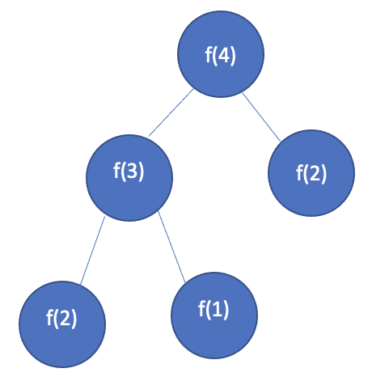
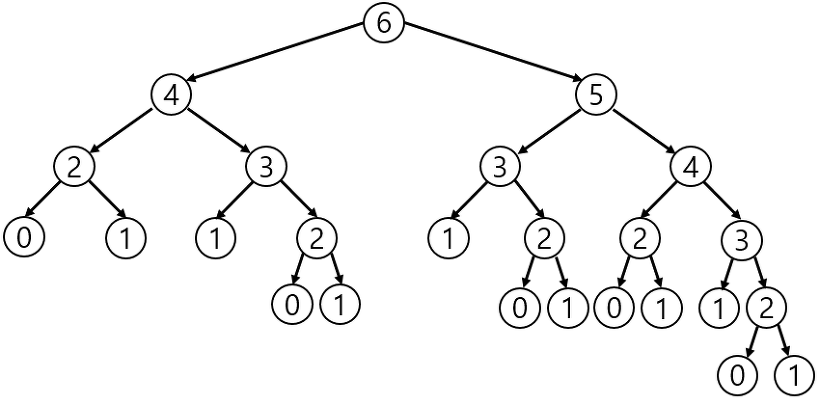

# 다이나믹 프로그래밍

#### 중복되는 연산을 줄이자

현실에는 많은 문제들이 있다. 이 중 컴퓨터를 활용해도 해결하기 어려운 문제들은 무엇일까?

최적의 해를 구하기에 시간이 매우 많이 필요하거나 메모리 공간이 매우 많이 필요한 문제등이 컴퓨터로도 해결하기 어려운 문제들이다. 컴퓨터는 연산 속도에 한계가 있고 메모리 공간을 사용할 수 있는 데이터의 개수도 한정적이라는 점이 많은 제약을 발생시킨다. 그래서 알고리즘을 작성할 때 연산 속도와 메모리 공간을 최대한으로 활용할 수 있는 효율적인 알고리즘을 작성해야 하는 것이다.

다만 어떤 문제는 메모리 공간을 약간 더 사용하면 연산 속도를 비약적으로 증가시킬 수 있는 방법이 있다. 대표적인 방법이 바로 다이나믹 프로그래밍 기법으로 동적 계획법이라고도 한다.

다이나믹 프로그래밍으로 해결할 수 있는 대표적인 예시는 피보나치 수열이 있다. 피보나치 수열은 이전 두 항의 합을 현재의 항으로 설정하는 특징이 있는 항이다. 수학자들은 점화식을 사용해 수열의 항이 이어지는 형태를 간결하게 표현한다. 점화식이란 인접한 항들 사이의 관계식을 의미하는데, 예를 들어 수열 {a<sub>n</sub>}이 있을 때 수열에서의 각 항을 a<sub>n</sub>이라고 부른다고 가정하자. 우리는 점화식을 이용해 현재의 항을 이전의 항에 대한 식으로 표현할 수 있다. 

예를 들어 피보나치 수열의 점화식은 다음과 같이 표현할 수 있다.

*a<sub>n+2</sub> = f(a<sub>n+1</sub>, a<sub>n</sub>) = a<sub>n+1</sub> + a<sub>n</sub>*

이러한 점화식은 인접 3항간 점화식이라고 부르는데 인접한 총 3개의 항에 대하여 식이 정의되기 때문이다. 결과적으로 위에서 언급한 피보나치 수열에서는 첫 번째 항과 두 번째 항의 값이 모두 1이기 때문에 최종적으로 피보나치 수열을 나타낼 때에는 다음과 같이 정의할 수 있다.

*a<sub>n</sub> = a<sub>n-1</sub> + a<sub>n-2</sub>, a<sub>1</sub> = 1, a<sub>2</sub> = 1*

이를 해석하면 다음과 같다.

- n번째 피보나치 수 = (n - 1)번째 피보나치 수 + (n - 2)번째 피보나치 수
- 단, 1번째 피보나치 수 =1, 2번째 피보나치 수 = 1

프로그래밍에서는 이러한 수열을 배열이나 리스트로 표현할 수 있다. 수열 자체가 여러 개의 수가 규칙에 따라서 배열된 형태를 의미하는 것이기 때문이다. 파이썬에서는 리스트 자료형이 이를 처리하고, C/C++ 또는 자바에서는 배열을 이용해 이를 처리한다. 리스트나 배열 모두 '연속된 많은 데이터'를 처리한다는 점에서 동일하다.

그렇다면 이 점화식에 따라서 실제로 피보나치 수를 구하는 과정을 어떻게 표현할 수 있을까? n번째 피보나치 수를 *f(n)* 이라고 한다면 4번째 피보나치 수 *f(4)* 를 구하려면 다음과 같이 함수 *f* 를 반복해서 호출할 것이다. 그런데 *f(2)* 와  *f(1)*은 항상 1이기 때문에  *f(2)* 이나 *f(1)*을 만났을 때는 호출을 정지한다.



수학적 점화식을 프로그래밍으로 표현하려면 재귀 함수를 사용하면 간단하다. 

```python
# 피보나치를 재귀 함수로 구현
def fibo(x):
    if x == 1 or x == 2:
        return 1
    return fibo(x - 1) + fibo(x - 2)


print(fibo(4))
```

그런데 피보나치 수열의 소스코드를 이렇게 작성하면 심각한 문제가 생길 수 있는데 바로 *f(n)* 함수에서 n이 커지면 커질수록 수행 시간이 기하급수적으로 늘어나기 때문이다. 일반적으로 이렇게 작성하면 *O(2<sup>2</sup>)*의 지수 시간이 걸리게 된다. 예를 들어 n이 30이면, 약 10억회 가량의 연산을 수행해야 한다.



위 그림처럼 *f(6)* 일 때의 호출 과정을 보게 되면 동일한 함수가 반복적으로 호출되는 것을 알 수 있다. 이미 한 번 계산 했지만, 계속 호출할 때마다 계산하는 것이다. 그림에서 *f(3)*은 총 3번 호출됐다. 즉, *f(n)*에서 n이 커지면 커질수록 반복해서 호출하는 수가 많아지게 된다.

이처럼 피보나치 수열의 점화식을 재귀 함수를 사용해 만들 수는 있지만, 단순히 매번 계산하도록 하면 문제를 효율적으로 해결할 수 없다. 이러한 문제들을 바로 다이나믹 프로그래밍을 사용하여 효율적으로 해결하는 것이다. 

다만 다이나믹 프로그래밍은 항상 사용할 수는 없으며, 다음 조건을 만족할 때 사용할 수 있다.

- 큰 문제를 작은 문제로 나눌 수 있다.
- 작은 문제에서 구한 정답은 그것을 포함하는 큰 문제에서도 동일하다.

피보나치 수열은 이러한 조건을 만족하는 대표적인 문제다. 이 문제를 메모이제이션 기법을 사용해서 해결해보자. 

메모리 제이션은 다이나믹 프로그래밍을 구현하는 방법 중 한 종류로, 한 번 구한 결과를 메모리 공간에 메모해두고 같은 식을 다시 호출하면 메모한 결과를 그대로 가져오는 기법을 의미한다. 메모이제이션은 값을 저장하는 방법이므로 캐싱이라고도 부른다.

그렇다면 실제 메모이제이션은 어떻게 구현할 수 있을까? 답은 간단하다. 한 번 구한 정보를 리스트에 저장하는 것이다. 다이나믹 프로그래밍을 재귀적으로 수행하다가 같은 정보가 필요할 때는 이미 구한 정답을 그대로 리스트에서 가져오면 된다.

```python
# 한 번 계산된 결과를 메모이제이션(Memoization)하기 위한 리스트 초기화
d = [0] * 100

# 피보나치 함수(Fibonacci Function)를 재귀함수로 구현 (탑다운 다이나믹 프로그래밍)
def fibo(x):
    # 종료 조건(1 혹은 2일 때 1을 반환)
    if x == 1 or x == 2:
        return 1
    # 이미 계산한 적 있는 문제라면 그대로 반환
    if d[x] != 0:
        return d[x]
    # 아직 계산하지 않은 문제라면 점화식에 따라서 피보나치 결과 반환
    d[x] = fibo(x - 1) + fibo(x - 2)
    return d[x]

print(fibo(99))
```

위 코드를 실행하면 99번째 피보나치 수를 구하도록 했음에도 금방 정답을 도출하는 것을 확인할 수 있다.

정리하자면 다이나믹 프로그램이이란 큰 문제를 작게 나누고, 같은 문제라면 한 번씩만 풀어 문제를 효율적으로 해결하는 알고리즘 기법이다. 사실 큰 문제를 작게 나누는 방법은 퀵 정렬에서도 소개된 적이 있다. 퀵 정렬은 정렬을 수행할 때 정렬할 리스트를 분할하여 전체적으로 정렬이 될 수 있도록 한다. 이는 분할 정복 알고리즘으로 분류된다. 다이나믹 프로그래밍과 분할 정복의 차이점은 다이나믹 프로그래밍은 문제들이 서로 영향을 미치고 있다는 점이다.

퀵 정렬로 예를 들면, 한 번 기준 원소<sup>pivot</sup> 가 자리를 변셩해서 자리를 잡게 되면 그 기준 원소의 위치는 더 이상 바뀌지 않고 그 피벗값을 다시 처리하는 부분 문제는 존재하지 않는다. 반면에 다이나믹 프로그래밍은 한 번 해결했던 문제를 다시금 해결한다는 점이 특징이다. 그렇기 때문에 이미 해결된 부분 문제에 대한 답을 저장해 놓고, 이 문제는 이미 해결이 됐던 것이니까 다시 해결할 필요가 없다고 반환하는 것이다. 예를 들어 재귀 함수를 이용하는 방법(메모이제이션)에서는 한 번 푼 문제는 그 결과를 저장해 놓았다가 나중에 동일한 문제를 풀어야 할 때 이미 저장한 값을 반환한다. 

일반적으로 재귀 함수를 이용한 다이나믹 프로그래밍보다 반복문을 이용한 다이나믹 프로그래밍이 성능이 더 좋다.

그렇다면 다이나믹 프로그래밍을 적용했을 때 피보나치 수열 알고리즘의 시간 복잡도는 어떻게 될까? 바로 *O(N)*이다. 왜냐하면 *f(1)* 을 구한 다음 그 값이 *f(2)* 를 푸는 데 사용되고, *f(2)* 의 값이 *f(3)* 을 푸는데 사용되는 방식으로 이어지기 때문이다. 한 번 구한 결과는 다시 구해지지 않는다.

함수가 종료될 때 어떤 함수를 호출했는지, 현재의 피보나치 수를 출력하도록 코드를 만들면 실제로 시간 복잡도가 *O(N)*이라는 것을 쉽게 이해할 수 있다.

```python
d = [0] * 100

def fibo(x):
    print('f(' + str(x) + ')', end=' ')
    if x == 1 or x == 2:
        return 1
    if d[x] != 0:
        return d[x]
    d[x] = fibo(x - 1) + fibo(x - 2)
    return d[x]

fibo(6)
```

이처럼 재귀 함수를 이용하여 다이나믹 프로그래밍 소스코드를 작성하는 방법을, 큰 문제를 해결하기 위해 작은 문제를 호출한다고 하여 **탑다운 방식**이라고 말한다. 반면에 단순히 반복문을 이용하여 소스코드를 작성하는 경우 작은 문제부터 차근차근 답을 도출한다고 하여 **보텀업 방식**이라고 말한다.

피보나치 수열 문제를 아래에서 위로 올라가는 보텀업 방식으로 풀면 다음과 같다. 동일한 원리를 적용하되 단순히 반복문을 이용하여 문제를 해결한 것으로 이해하면 된다.

```python
# 앞서 계산된 결과를 저장하기 위한 DP 테이블 초기화
d = [0] * 100

# 첫 번째 피보나치 수와 두 번째 피보나치 수는 1
d[1] = 1
d[2] = 1
n = 99

# 피보나치 함수(Fibonacci Function) 반복문으로 구현(보텀업 다이나믹 프로그래밍)
for i in range(3, n + 1):
    d[i] = d[i - 1] + d[i - 2]

print(d[n])
```

탑다운(메모이제이션) 방식은 '하향식'이라고도 하며, 보텀업 방식은 '상향식'이라고도 한다. 다이나믹 프로그래밍의 전형적인 형태는 보텀업 방식이다. 보텀업 방식에서 사용되는 결과 저장용 리스트는 'DP 테이블'이라고 부르며, 메모이제이션은 탑다운 방식에 국한되어 사용되는 표현이다. 다이나믹 프로그래밍과 메모이제이션의 개념을 혼용해서 사용하는 경우도 있는데, 엄밀히 말하면 메모이제이션은 이전에 계산된 결과를 일시적으로 기록해 놓는 넓은 개념을 의미하므로, 다이나믹 프로그래밍과는 별도의 개념이다. 한 번 계산된 결과를 어딘가에 담아 놓기만 하고 다이나믹 프로그래밍을 위해 활용하지 않을 수도 있다.