# 일정관리 웹 애플리케이션

지금가지 리액트의 기본에서부터 컴포넌트 스타일링까지 배워봤다. 이제 배운것을 활용해서 프런트엔드를 공부할 때 많이 구현하는 일정관리 애플리케이션을 만들어 보도록 하자.

이번 실습은 다음과 같은 흐름으로 진행된다.

> 프로젝트 준비하기 → UI 구성하기 → 기능 구현하기

## 10.1 프로젝트 준비하기

`$ yarn create react-app todo-app` 을 사용하여 프로젝트를 생성하고 필요한 라이브러리를 설치해줬다.

`$ yarn add node-sass classnames react-icons` 

이 프로젝트에서는 Sass를 사용할 예정이므로 node-sass를 설치해 주었고, classnames는 나중에 조건부 스타일링을 좀 더 편하게 하기 위해 설치했다. react-icons는 리액트에서 다양하고 예쁜 아이콘을 사용할 수 있는 라이브러리다. 아이콘 리스트와 사용법은  [여기](https://react-icons.netlify.com/)	에서 확인할 수 있다. 이 라이브러리의 장점은 SVG형태로 이루어진 아이콘을 리액트 컴포넌트처럼 매우 쉽게 사용할 수 있다는 것이다. 아이콘의 크기나 색상은 props 혹은 CSS 스타일로 변경하여 사용할 수 있다.

그런 다음 프로젝트의 글로벌 스타일 파일이 들어 있는 index.css 파일을 조금 수정했다. 기존에 있던 설정은 지우고 background 속성을 설정했다.

```react
body {
  margin: 0;
  padding: 0;
  background: #e9ecef;
}
```

App 컴포넌트도 아래와 같이 수정해줬다.

```react
import React from "react";

const App = () => {
  return <div>TODO App을 만들자!</div>;
}

export default App;
```

이렇게 하면 프로젝트의 기본적인 준비는 끝났다.

## 10.2 UI 구성하기

앞으로 만들 컴포넌트는 다음과 같다.

1. ToDoTemplate : 화면을 가운데 정렬시켜 주며, 앱 타이틀(일정 관리)를 보여 준다. children으로 내부 JSX를 받아 와서 렌더링해 준다.
2. ToDoInsert : 새로운 항목을 입력하고 추가할 수 있는 컴포넌트. todo 객체를 props로 받아 와서 상태에 따라 다른 스타일의 UI를 보여준다.
3. ToDoListItem : 각 할 일 항목에 대한 정보를 보여 주는 컴포넌트. todo객체를 props로 받아 와서 상태에 따라 다른 스타일의 UI를 보여준다.
4. ToDoList : todos 배열을 props로 받아 온 후, 이를 배열 내장 함수 map을 사용해서 여러 개의 ToDoListItem 컴포넌트로 변환하여 보여준다.

src디렉터리에 components라는 디렉터리를 만들고 그 안에 저장을 할 예정이다.

#### 10.2.1 ToDoTemplate

```react
import React from "react";
import "./ToDoTemplate.scss";

const ToDoTemplate = ({ children }) => {
  return (
    <div className="ToDoTemplate">
      <div className="app-title">일정 관리</div>
      <div className="content">{children}</div>
    </div>
  );
};

export default ToDoTemplate;
```

```react
import "./App.css";
import ToDoTemplate from "./components/ToDoTemplate";

const App = () => {
  return <ToDoTemplate>ToDo App을 만들자!</ToDoTemplate>;
};

export default App;
```

ToDoTemplate.js와 ToDoTemplate.scss 파일을 만든 뒤 위와 같이 작성하여 App에 렌더링 시켜주면 아래와 같은 화면이 나타난다.

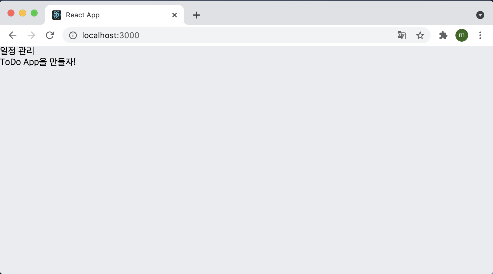

그런 다음 아까 만들어둔 ToDoTemplate.scss 파일에서 스타일을 작성한다.

```react
.ToDoTemplate {
  width: 512px;
  // width가 주어진 상태에서 좌우 중앙 정렬
  margin-left: auto;
  margin-right: auto;
  margin-top: 6rem;
  border-radius: 4px;
  overflow: hidden;

  .app-title {
    background: #22b8cf;
    color: white;
    height: 4rem;
    font-size: 1.5rem;
    display: flex;
    align-items: center;
    justify-content: center;
  }

  .content {
    background: white;
  }
}
```

저장하고 화면을 보게 되면 다음과 같은 결과가 나오는 것을 확인할 수 있다.

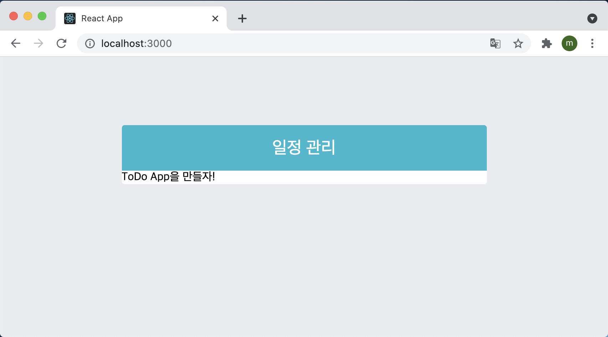

스타일 속성 중 `display: flex;` 를 많이 사용하게 되는데 flex에 대해 자세히 알아보고 게임을 통해 연습을 하고 싶다면 [여기](http://flexboxfroggy.com/#ko)에서 학습하면 큰 도움이 될 것이다.

#### 10.2.2 ToDoInsert

이번에는 components 디렉터리 안에 ToDoinsert.js 와 ToDoInsert.scss 파일을 만들어 작성해보자.

```react
import React from "react";
import { MdAdd } from "react-icons/md";
import "./ToDoInsert.scss";

const ToDoInsert = () => {
  return (
    <form className="ToDoInsert">
      <input placeholder="할 일을 입력하세요." />
      <button type="submit">
        <MdAdd />
      </button>
    </form>
  );
};

export default ToDoInsert;
```

 ToDoInsert.js에 위와 같이 작성한 뒤 App 컴포넌트에 렌더링 시켜 보면 아래와 같은 화면이 나타난다.

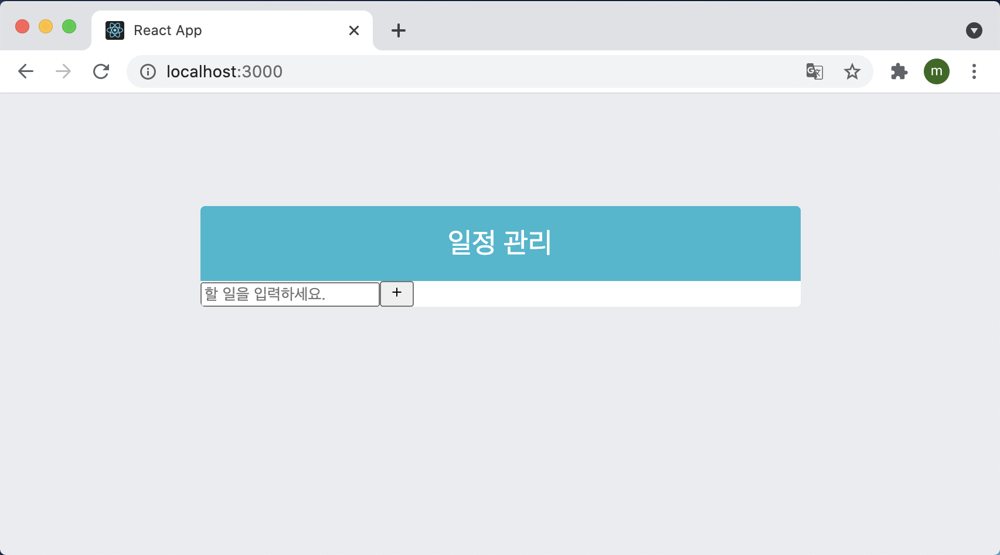

이제 컴포넌트를 스타일링 해보자. ToDoInsert.scss 파일을 아래와 같이 작성한 뒤 브라우저를 확인해 보면 원하는 결과가 잘 출력되는 것을 볼 수 있다.

```scss
.ToDoInsert {
  display: flex;
  background: #495057;
  input {
    // 기본 스타일 초기화
    background: none;
    outline: none;
    border: none;
    padding: 0.5rem;
    font-size: 1.125rem;
    line-height: 1.5;
    color: white;
    &::placeholder {
      color: #dee2e6;
    }
    // 버튼을 제외한 영역을 모두 차지하기
    flex: 1;
  }
  button {
    // 기본 스타일 초기화
    background: none;
    outline: none;
    border: none;
    background: #868e96;
    color: white;
    padding-left: 1rem;
    padding-right: 1rem;
    font-size: 1.5rem;
    display: flex;
    align-items: center;
    cursor: pointer;
    transition: 0.1s background ease-in;
    &:hover {
      background: #abd5bd;
    }
  }
}
```

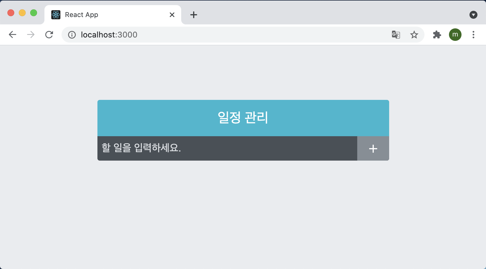

#### 10.2.3 ToDoListItem, ToDoList

먼저 ToDoListItem 컴포넌트부터 만들어보자.

```react
import React from "react";
import { MdCheckBoxOutlineBlank, MdRemoveCircleOutline } from "react-icons/md";
import "./ToDoListItem.scss";

const ToDoListItem = () => {
  return (
    <div className="ToDoListItem">
      <div className="checkbox">
        <MdCheckBoxOutlineBlank />
        <div className="text">할 일</div>
      </div>
      <div className="remove">
        <MdRemoveCircleOutline />
      </div>
    </div>
  );
};

export default ToDoListItem;
```

이 컴포넌트를 다 작성했으면 ToDoList.js 파일과 ToDoList.scss 파일을 생성하고 ToDoList.js 파일을 아래와 같이 작성한다.

```react
import React from "react";
import ToDoListItem from "./ToDoListItem";
import "./ToDoList.scss";

const ToDoLIst = () => {
  return (
    <div className="ToDoList">
      <ToDoListItem />
      <ToDoListItem />
      <ToDoListItem />
    </div>
  );
};

export default ToDoLIst;
```

지금은 이 컴포넌트에 ToDoListItem을 불러와 별도의 props 전달 없이 그대로 여러 번 보여 주고 있다. UI설계가 끝나고 기능을 추가하여 다양한 데이터를 전달할 예정이다. 컴포넌트를 다 작성했으면 App 컴포넌트에 렌더링 시켜주면 아래와 같은 화면이 나타난다.

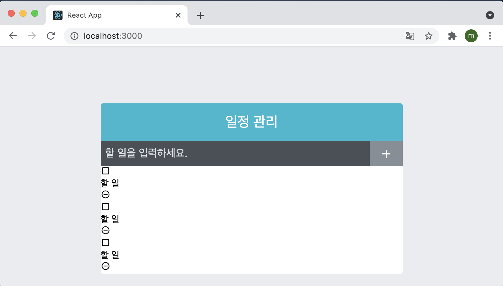

이제 여기에 스타일링을 해보자.

처음 스타일링할 컴포넌트는 ToDoList인데 아래와 같이 작성해준다.

```scss
.ToDoList {
  min-height: 320px;
  max-height: 513px;
  overflow: auto;
}
```

그런 다음 ToDoListItem을 아래와 같이 스타일링 해준다.

```scss
.ToDoListItem {
  padding: 1rem;
  display: flex;
  align-items: center; // 세로 중앙 정렬
  &:nth-child(even) {
    background: #f8f9fa;
  }
  .checkbox {
    cursor: pointer;
    flex: 1; // 차지할 수 있는 영역 모두 차지
    display: flex;
    align-items: center; // 세로 중앙 정렬
    svg {
      // 아이콘
      font-size: 1.5rem;
    }
    .text {
      margin-left: 0.5rem;
      flex: 1; // 차지할 수 있는 영역 모두 차지
    }
    // 체크되었을 때 보여 줄 스타일
    &.checked {
      svg {
        color: #22b8cf;
      }
      .text {
        color: #abd5bd;
        text-decoration: line-through;
      }
    }
  }
  .remove {
    display: flex;
    align-items: center;
    font-size: 1.5rem;
    color: #ff6b6b;
    cursor: pointer;
    &:hover {
      color: #ff8787;
    }
  }

  // 엘리먼트 사이사이에 테두리를 넣어 줌
  & + & {
    border-top: 1px solid #dee2e6;
  }
}
```

저장하고 화면을 확인해보면 아래와 같이 스타일링이 끝난 화면이 나온다.

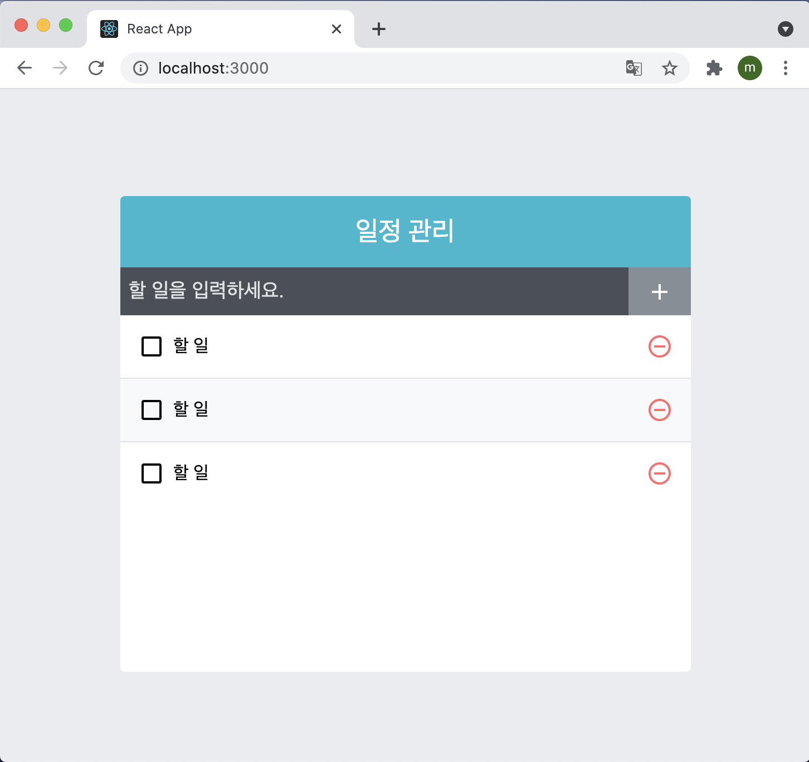

## 10.3 기능 구현

#### 10.3.1 App에서 toDos 상태 사용하기

나중에 추가할 일정 항목에 대한 상태들은 모두 App 컴포넌트에서 관리한다. App에서 useState를 사용하여 todos라는 상태를 정의하고, todos를 ToDoList의 props로 전달해보자.

```react
import { useState } from "react";
import "./App.css";
import ToDoInsert from "./components/ToDoInsert";
import ToDoLIst from "./components/ToDoList";
import ToDoTemplate from "./components/ToDoTemplate";

const App = () => {
  const [todos, setTodos] = useState([
    {
      id: 1,
      text: "리액트의 기초 알아보기",
      checked: true,
    },
    {
      id: 2,
      text: "컴포넌트 스타일링 해보기",
      checked: true,
    },
    {
      id: 3,
      text: "일정 관리 앱 만들어 보기",
      checked: false,
    },
  ]);
  return (
    <ToDoTemplate>
      <ToDoInsert />
      <ToDoLIst todos={todos} />
    </ToDoTemplate>
  );
};

export default App;
```

이런 식으로 App 컴포넌트에서 정의한 todos를 ToDoList의 props로 전달을 하고

```react
import React from "react";
import ToDoListItem from "./ToDoListItem";
import "./ToDoList.scss";

const ToDoLIst = ({ todos }) => {
  return (
    <div className="ToDoList">
      {todos.map((todo) => (
        <ToDoListItem todo={todo} key={todo.id} />
      ))}
    </div>
  );
};

export default ToDoLIst;
```

ToDoList에서는 props로 받아온 todos를 map함수를 통해 ToToListItem으로 렌더링해준다. map함수를 사용하여 컴포넌트로 변환 할 때는 key값을 설정해줘야 하는데 여기서 사용되는 key 값은 각 항목의 고유한 값인 id를 사용해서 key값을 설정해 줬다. 그리고 todo데이터를 통째로 props로 전달하는데 여러 종류의 값을 전달해야 하는 경우에는 객체를 통채로 전달하는 편이 나중에 성능 최적하를 할 때 편리하다.

이제 ToDoListItem에서 받아온 todo 값에 따라 제대로 된 UI를 보여줄 수 있도록 아래와 같이 코드를 구현한다.

```react
import React from "react";
import cn from "classnames";
import {
  MdCheckBox,
  MdCheckBoxOutlineBlank,
  MdRemoveCircleOutline,
} from "react-icons/md";
import "./ToDoListItem.scss";

const ToDoListItem = ({ todo }) => {
  const { text, checked } = todo;

  return (
    <div className="ToDoListItem">
      <div className={cn("checkbox", { checked })}>
        {checked ? <MdCheckBox /> : <MdCheckBoxOutlineBlank />}
        <div className="text">{text}</div>
      </div>
      <div className="remove">
        <MdRemoveCircleOutline />
      </div>
    </div>
  );
};

export default ToDoListItem;
```

위 코드에서는 조건부 스타일링을 위해 classnames를 사용했다. 저장하고 결과를 보면 아래와 같이 받아온 todo 값을 제대로 출력하는 것을 볼 수 있다.

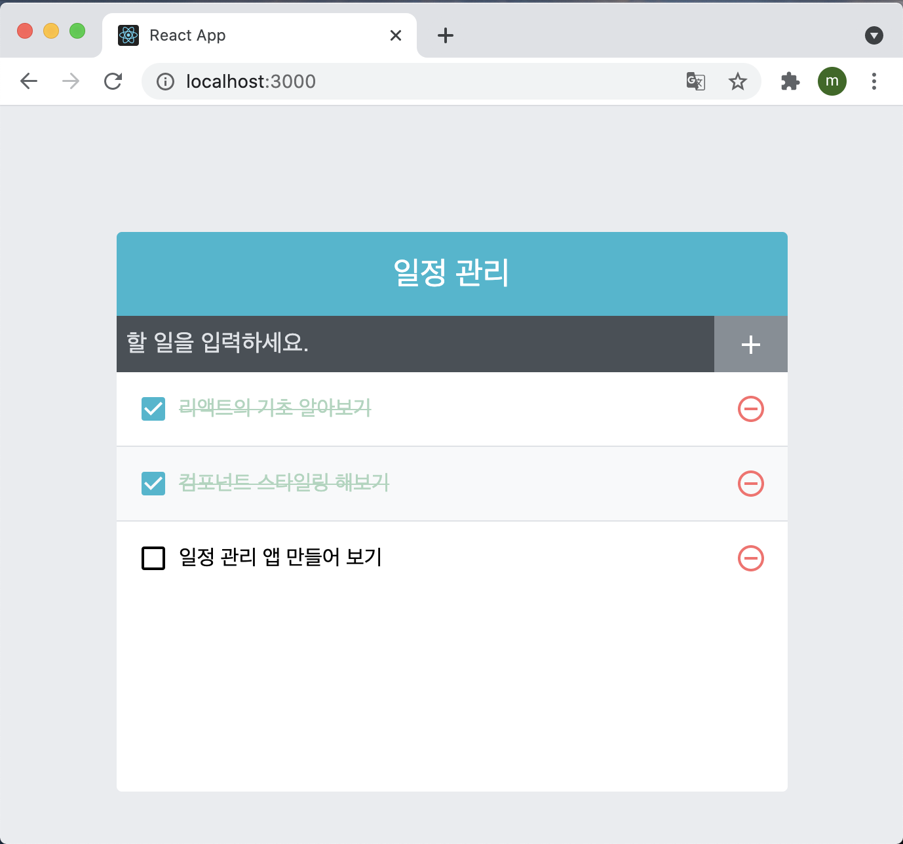

#### 10.3.2 항목 추가 기능 구현

이 기능을 구현하려면, ToDoInsert 컴포넌트에서 인풋 상태를 관리하고 App컴포넌트에는 todos 배열에 새로운 객체를 추가하는 함수를 만들어야 한다.

##### 10.3.2.1 ToDoInsert value 상태 관리하기

ToDoInsert 컴포넌트에서 인풋에 입력하는 값을 관리할 수 있도록 useState를 ㅅ아요하여 value라는 상태를 정의하고 추가로 인풋에 넣어 줄 onChange함수도 작성해줘야 한다. 이 과정에서 컴포넌트가 리렌더링될 때마다 함수를 새로 만드는 것이 아니라, 한 번 함수를 만들고 재사용할 수 있도록 useCallback Hook을 사용해서 코드를 작성해줬다.

```react
import React, { useCallback, useState } from "react";
import { MdAdd } from "react-icons/md";
import "./ToDoInsert.scss";

const ToDoInsert = () => {
  const [value, setValue] = useState("");

  const onChange = useCallback((e) => {
    setValue(e.target.value);
  }, []);
  return (
    <form className="ToDoInsert">
      <input
        placeholder="할 일을 입력하세요."
        value={value}
        onChange={onChange}
      />
      <button type="submit">
        <MdAdd />
      </button>
    </form>
  );
};

export default ToDoInsert;
```

이제 인풋에 텍스르를 입력하면 오류가 발생하지 않고 텍스트가 잘 입력이 된다. 사실 인풋은 value 값과 onChange를 설정하지 않더라도 입력할 수 있다. 그저 리액트 쪽에서 해당 인풋에 무엇이 입력되어 있는지 추적하지 않을 뿐이다. 이런 경우 현재 state가 잘 업데이트 되고 있는지 확인하려면 onChange 함수 안에서 console.log를 찍어 보는 것 외에 리액트 개발자 도구를 사용하는 방법이 있다.

리액트 개발자 도구는 리액트 컴포넌트를 심층 분석할 수 있도록 리액트 개발팀이 만든 툴이며 크롬 웹 스토어에서 React Developer Tools를 검색해서 설치할 수 있다. 크롬 웹 스토어 주소는 [이곳](https://chrome.google.com/webstore/category/extensions)을 누르면 들어갈 수 있다.

설치하고 나서 개발자 도구를 열면 개발자 도구 탭에 Components가 나타난다. 이를 클릭하여 하단에 검색 탭에서 ToDoInsert 컴포넌트를 검색한 후 선택하면, 다음과 같이 인풋을 수정했을 때 Hooks의 State 부분에도 똑같은 값이 잘 들어가는 것을 확인할 수 있다.

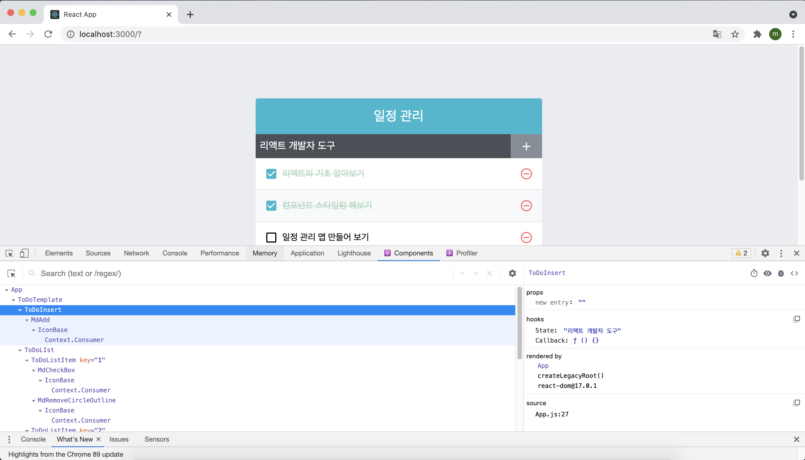 

##### 10.3.2.3 todos 배열에 새 객체 추가하기

이번에는 App 컴포넌트에서 todos 배열에 새 객체를 추가하는 onInsert 함수를 만들어 보자. 이 함수에서는 새로운 객체를 만들 때마다 id 값에 1씩 더해 줘야 하는데 id 값은 useRef를 사용하여 관리를 할 예정이다. 

여기서 useState가 아닌 useRef를 사용하여 컴포넌트에서 사용할 변수를 만드는 이유는 무엇일까? 그것은 바로 id 값이 렌더링되는 정보가 아니기 때문이다. 예를 들어 이 값은 화면에 보이지도 않고, 이 값이 바뀐다고 해서 컴포넌트가 리렌더링될 필요도 없다. 단순히 새로운 항목을 만들 때 참조되는 값일 뿐이다.

또한, onInsert 함수는 컴포넌트의 성능을 아낄 수 있도록 useCallback으로 감싸준다. props로 전달해야 할 함수를 만들 때는 useCallback을 사용하여 함수를 감싸는 것을 습관화 하는 것이 컴포넌트 성능을 높히는데 좋다. 

onInsert 함수를 만든 뒤에는 해당 함수를 ToDoInsert 컴포넌트의 props로 설정하면 된다.

```react
import { useCallback, useRef, useState } from "react";
import "./App.css";
import ToDoInsert from "./components/ToDoInsert";
import ToDoLIst from "./components/ToDoList";
import ToDoTemplate from "./components/ToDoTemplate";

const App = () => {
  const [todos, setTodos] = useState([
    {
      id: 1,
      text: "리액트의 기초 알아보기",
      checked: true,
    },
    {
      id: 2,
      text: "컴포넌트 스타일링 해보기",
      checked: true,
    },
    {
      id: 3,
      text: "일정 관리 앱 만들어 보기",
      checked: false,
    },
  ]);

  // 고윳값으로 사용될 id
  // ref를 사용하여 변수 담기
  const nextId = useRef(4);

  const onInsert = useCallback(
    (text) => {
      const todo = {
        id: nextId.current,
        text,
        checked: false,
      };
      setTodos(todos.concat(todo));
      nextId.current += 1; // nextId 1씩 더하기
    },
    [todos]
  );
  return (
    <ToDoTemplate>
      <ToDoInsert onInsert={onInsert} />
      <ToDoLIst todos={todos} />
    </ToDoTemplate>
  );
};

export default App;
```

##### 10.3.2.4 ToDoInsert에서 onSubmit 이벤트 설정

이제 버튼을 클릭하면 발생할 이벤트를 설정해야 한다. 방금 App에서 ToDoInsert에 넣어 준 onInsert 함수에 현재 useState를 통해 관리하고 있는 value 값을 파라미터로 넣어서 호출한다.

```react
import React, { useCallback, useState } from "react";
import { MdAdd } from "react-icons/md";
import "./ToDoInsert.scss";

const ToDoInsert = ({ onInsert }) => {
  const [value, setValue] = useState("");

  const onChange = useCallback((e) => {
    setValue(e.target.value);
  }, []);

  const onSubmit = useCallback(
    (e) => {
      onInsert(value);
      setValue(""); // value 값 초기화
      // submit이벤트는 브라우저를 새로고침 한다.
      // 이를 방지하기 위해 preventDefault 함수를 호출한다.
      e.preventDefault();
    },
    [onInsert, value]
  );

  return (
    <form className="ToDoInsert" onSubmit={onSubmit}>
      <input
        placeholder="할 일을 입력하세요."
        value={value}
        onChange={onChange}
      />
      <button type="submit">
        <MdAdd />
      </button>
    </form>
  );
};

export default ToDoInsert;
```

onSubmit이라는 함수를 만들고, 이름 form의 onSubmit으로 설정했다. 이 함수가 호출되면 props로 받아 온 onInsert 함수에 현재 value 값을 파라미터로 넣어서 호출하고, 현재 value 값을 초기화 한다.

추가로 onSubmit 이벤트는 브라우저를 새로고침 시키기 때문에 e.preventDefault() 함수를 호출하여 새로고침을 방지해줬다.

물론 다음과 같이 onSubmit 대신 onClick 이벤트로도 처리가 가능하다.

```react
const onClick = useCallback(() => {
  	onInsert(value);
  	setValue('');
	}, [onInsert, value]
);

return (
	<form className="ToDoInsert">
      <input
        placeholder="할 일을 입력하세요."
        value={value}
        onChange={onChange}
      />
      <button type="submit" onClick={onClick}>
        <MdAdd />
      </button>
    </form>
)
```

이렇게 클릭 이벤트만으로도 할 수 있는데 굳이 form과 onSubmit 이벤트를 사용한 이유는 무엇일까?

onSubmit 이벤트의 경우 인풋에서 enter를 눌렀을 때도 발생하기 때문이다. 반면 버튼에서 onClick만 사용했다면 인풋에서 onKeyPress 이벤트를 통해 Enter를 감지하는 로직을 따로 작성해야 한다. 그렇기 때문에 이번에는 onClick이 아닌 onSubmit으로 새 항목을 추가하도록 처리했다.

실제로 새 항목을 입력한 후 추가해보면 다음과 같이 정상적으로 작동하는 것을 확인할 수 있다.

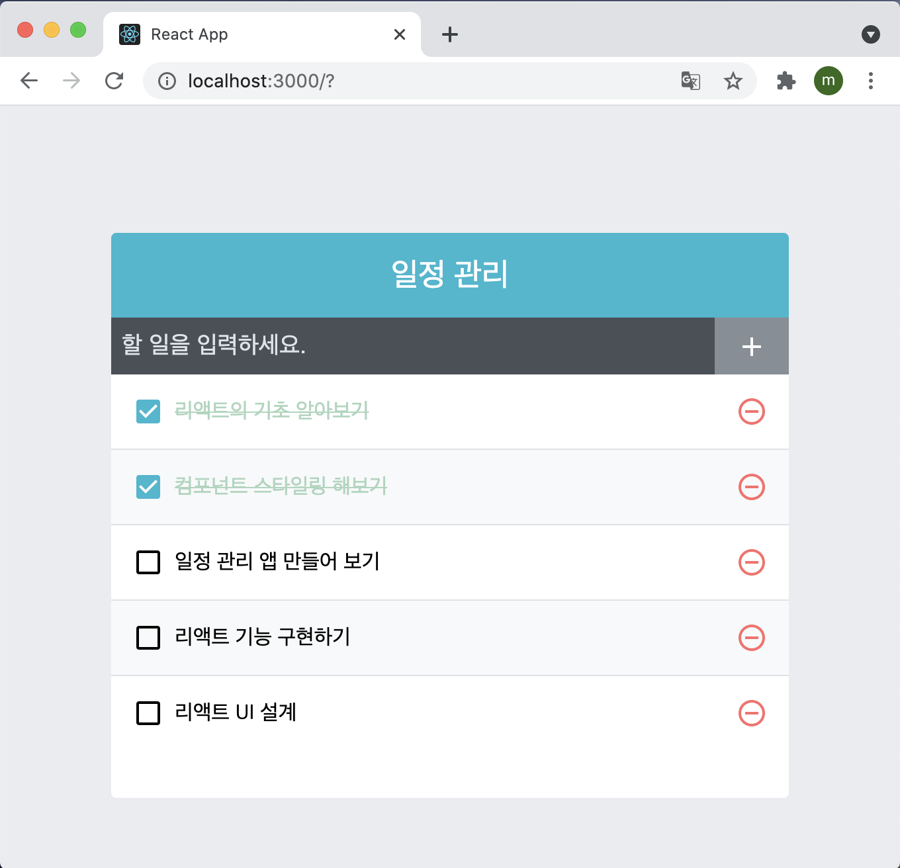

#### 10.3.3 지우기 기능 구현

리액트 컴포넌트에서 불변성을 지키면서 배열 원소를 제거해야 할 경우, 배열의 내장 함수인 filter를 사용하면 매우 간편하게 제거할 수 있다.

##### 10.3.3.1 filter

filter함수는 기존의 배열은 그대로 둔 상태에서 특정 조건에 만족하는 원소들만 따로 추출하여 새로운 배열을 만들어 준다.

```react
const array = [1,2,3,4,5,6,7,8,9,10];
const biggerThanFive = array.filter(num => num > 5);
// 결과 : [6,7,8,9,10]
```

filter 함수에는 조건을 확인해 주는 함수를 파라미터로 넣어 주어야 한다. 파라미터로 넣는 함수는 true or false 값을 반환하며, true를 반환하는 경우만 새로운 배열에 포함된다.

##### 10.3.3.2 todos 배열에서 id로 항목 지우기

filter를 사용해 onRemove 함수를 만들어 보자. App 컴포넌트에 id를 파라미터로 받아 와서 같은 id를 가진 항목을 todos 배열에서 지우는 함수다. 이 함수를 만들고 ToDoList의 props로 설정해주자.

```react
import { useCallback, useRef, useState } from "react";
import "./App.css";
import ToDoInsert from "./components/ToDoInsert";
import ToDoLIst from "./components/ToDoList";
import ToDoTemplate from "./components/ToDoTemplate";

const App = () => {
  const [todos, setTodos] = useState([
    {
      id: 1,
      text: "리액트의 기초 알아보기",
      checked: true,
    },
    {
      id: 2,
      text: "컴포넌트 스타일링 해보기",
      checked: true,
    },
    {
      id: 3,
      text: "일정 관리 앱 만들어 보기",
      checked: false,
    },
  ]);

  // 고윳값으로 사용될 id
  // ref를 사용하여 변수 담기
  const nextId = useRef(4);

  const onInsert = useCallback(
    (text) => {
      const todo = {
        id: nextId.current,
        text,
        checked: false,
      };
      setTodos(todos.concat(todo));
      nextId.current += 1; // nextId 1씩 더하기
    },
    [todos]
  );

  const onRemove = useCallback(
    (id) => {
      setTodos(todos.filter((todo) => todo.id !== id));
    },
    [todos]
  );

  return (
    <ToDoTemplate>
      <ToDoInsert onInsert={onInsert} />
      <ToDoLIst todos={todos} onRemove={onRemove} />
    </ToDoTemplate>
  );
};

export default App;
```

##### 10.3.3.3 ToDoListItem에서 삭제 함수 호출

ToDoListItem에서 onRemove함수를 사용하려면 ToDoList를 거쳐야 하므로 ToDoList 컴포넌트에서 받아온 onRemove를 다음과 같이 ToDoListItem 함수에 props로 넘겨준다.

```react
import React from "react";
import ToDoListItem from "./ToDoListItem";
import "./ToDoList.scss";

const ToDoLIst = ({ todos, onRemove }) => {
  return (
    <div className="ToDoList">
      {todos.map((todo) => (
        <ToDoListItem todo={todo} key={todo.id} onRemove={onRemove} />
      ))}
    </div>
  );
};

export default ToDoLIst;
```

이제 삭제 버튼을 누르면 ToDoListItem에서 onRemove 함수에 현재 자신이 가진 id를 넣어서 삭제 함수를 호출하도록 설정해보자.

```react
import React from "react";
import cn from "classnames";
import {
  MdCheckBox,
  MdCheckBoxOutlineBlank,
  MdRemoveCircleOutline,
} from "react-icons/md";
import "./ToDoListItem.scss";

const ToDoListItem = ({ todo, onRemove }) => {
  const { id, text, checked } = todo;

  return (
    <div className="ToDoListItem">
      <div className={cn("checkbox", { checked })}>
        {checked ? <MdCheckBox /> : <MdCheckBoxOutlineBlank />}
        <div className="text">{text}</div>
      </div>
      <div className="remove" onClick={() => onRemove(id)}>
        <MdRemoveCircleOutline />
      </div>
    </div>
  );
};

export default ToDoListItem;
```

저장한 다음 삭제버튼을 누르게 되면 다음과 같이 정상적으로 삭제가 되는 것을 확인할 수 있다.

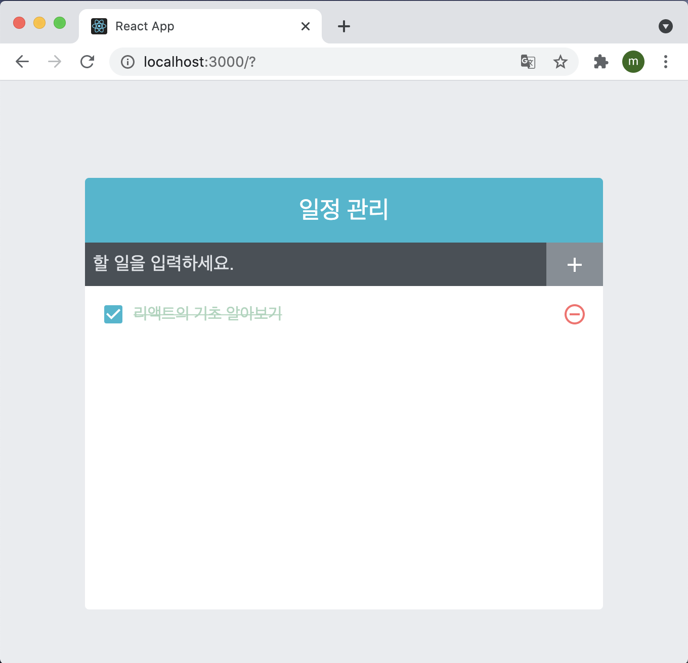

#### 10.3.4 수정기능

수정기능도 방금 만든 삭제기능과 비슷하다. onToggle이라는 함수를 App에 만들고 해당 함수를 ToDoList 컴포넌트에  props로 넣어 준다. 그리고 ToDoList를 통해 ToDoListItem까지 전달해주면 된다.

##### 10.3.4.1 onToggle 구현

```react
import { useCallback, useRef, useState } from "react";
import "./App.css";
import ToDoInsert from "./components/ToDoInsert";
import ToDoLIst from "./components/ToDoList";
import ToDoTemplate from "./components/ToDoTemplate";

const App = () => {
  const [todos, setTodos] = useState([
    {
      id: 1,
      text: "리액트의 기초 알아보기",
      checked: true,
    },
    {
      id: 2,
      text: "컴포넌트 스타일링 해보기",
      checked: true,
    },
    {
      id: 3,
      text: "일정 관리 앱 만들어 보기",
      checked: false,
    },
  ]);

  // 고윳값으로 사용될 id
  // ref를 사용하여 변수 담기
  const nextId = useRef(4);

  const onInsert = useCallback(
    (text) => {
      const todo = {
        id: nextId.current,
        text,
        checked: false,
      };
      setTodos(todos.concat(todo));
      nextId.current += 1; // nextId 1씩 더하기
    },
    [todos]
  );

  const onRemove = useCallback(
    (id) => {
      setTodos(todos.filter((todo) => todo.id !== id));
    },
    [todos]
  );

  const onToggle = useCallback(
    (id) => {
      setTodos(
        todos.map((todo) =>
          todo.id === id ? { ...todo, checked: !todo.checked } : todo
        )
      );
    },
    [todos]
  );

  return (
    <ToDoTemplate>
      <ToDoInsert onInsert={onInsert} />
      <ToDoLIst todos={todos} onRemove={onRemove} onToggle={onToggle} />
    </ToDoTemplate>
  );
};

export default App;
```

위 코드에서는 map함수를 사용하여 특정 id를 가지고 있는 객체의 checked 값을 반전시켜줬다. 불변성을 유지하면서 특정 배열 원소를 업데이트해야 할 때 이렇게 map을 사용하면 짧은 코드로 쉽게 작성할 수 있다.

여기서 왜 갑자기 map이 사용된 것인지 이해하기 힘들 수도 있는데 map 함수는 배열을 전체적으로 새로운 형태로 변환하여 새로운 배열을 생성해야 할 때 사용한다고 위에서 배운 적이 있다. 지금은 딱 하나의 원소만 수정하는데 왜 map을 사용했을까?

onToggle 함수를 보면 `todo.id === id ? ... : ...`라는 삼항 연산자가 사용됐다. 여기서 사용한 코드를 살펴보면 todo.id와 현재 파라미터로 사용된 id 값이 같을 때 우리가 정해 준 규칙대로 새로운 객체를 생성하지만, id 값이 다를 때는 변화를 주지 않고 처음 받아 왔던 상태 그대로 반환한다. 그렇기 때문에 map을 사용하여 만든 배열에서 변화가 필요한 원소만 업데이트되고 나머지는 그대로 남아 있게 되는 것이다.

##### 10.3.4.2 ToDoListItem에서 토글 함수 호출

```react
import React from "react";
import ToDoListItem from "./ToDoListItem";
import "./ToDoList.scss";

const ToDoLIst = ({ todos, onRemove, onToggle }) => {
  return (
    <div className="ToDoList">
      {todos.map((todo) => (
        <ToDoListItem
          todo={todo}
          key={todo.id}
          onRemove={onRemove}
          onToggle={onToggle}
        />
      ))}
    </div>
  );
};

export default ToDoLIst;
```

App에서 생성한 onToggle 함수를 ToDoList를 거쳐 ToDoListItem 컴포넌트에 전달했다. ToDoListItem에서 onToggle 함수를 사용하게끔 코드를 아래와 같이 수정 했다.

```react
import React from "react";
import cn from "classnames";
import {
  MdCheckBox,
  MdCheckBoxOutlineBlank,
  MdRemoveCircleOutline,
} from "react-icons/md";
import "./ToDoListItem.scss";

const ToDoListItem = ({ todo, onRemove, onToggle }) => {
  const { id, text, checked } = todo;

  return (
    <div className="ToDoListItem">
      <div className={cn("checkbox", { checked })} onClick={() => onToggle(id)}>
        {checked ? <MdCheckBox /> : <MdCheckBoxOutlineBlank />}
        <div className="text">{text}</div>
      </div>
      <div className="remove" onClick={() => onRemove(id)}>
        <MdRemoveCircleOutline />
      </div>
    </div>
  );
};

export default ToDoListItem;
```

저장하고 브라우저를 보면 정상적으로 toggle이 이루어지는 것을 확인할 수 있다.

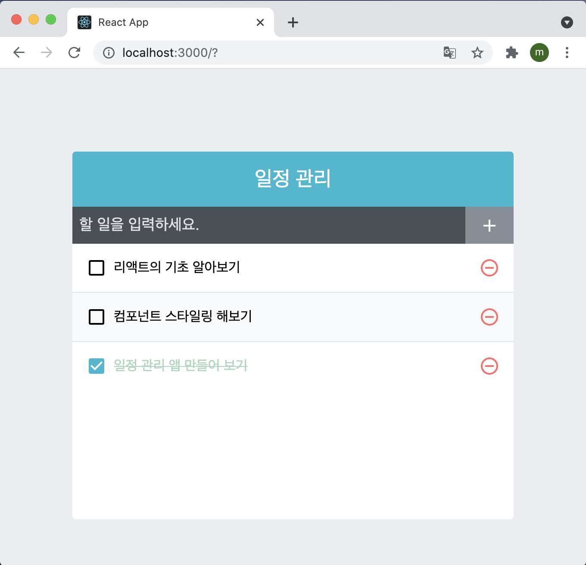

## 10.4 정리

이번에 만든 프로젝트는 소규모이기 때문에 따로 컴포넌트를 리렌더링 최적화 작업을 하지 않아도 정상적으로 작동한다. 하지만 일정 항목이 몇 만 개씩 생긴다면 새로운 항목을 추가하거나 기존 항목을 삭제 및 토글할 때 지연이 발생할 수 있다. 클라이언트 자원을 더욱 효율적으로 사용하려면 불필요한 리렌더링을 방지해야 하는데 이어지는 11장에서 이 문제를 다루도록 해보자.

