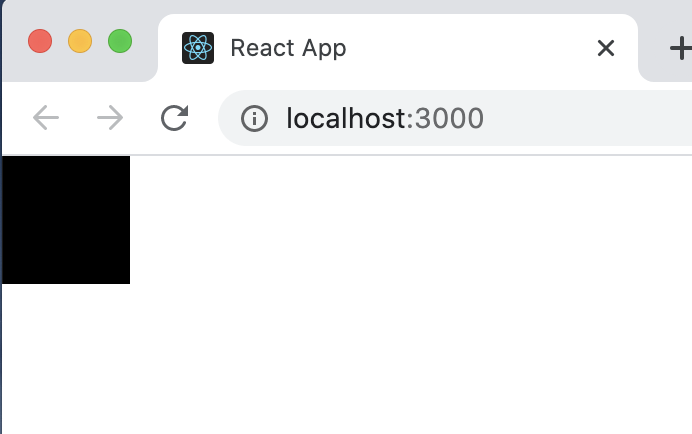
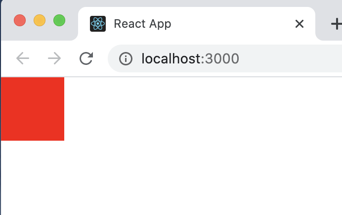
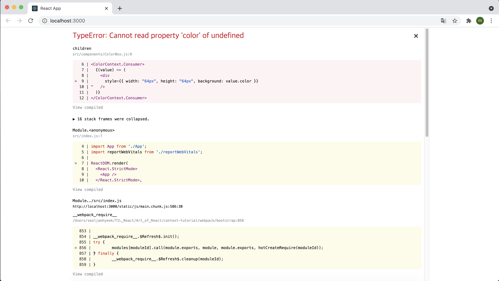
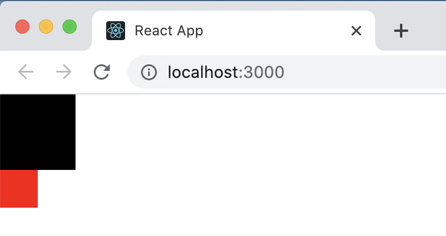
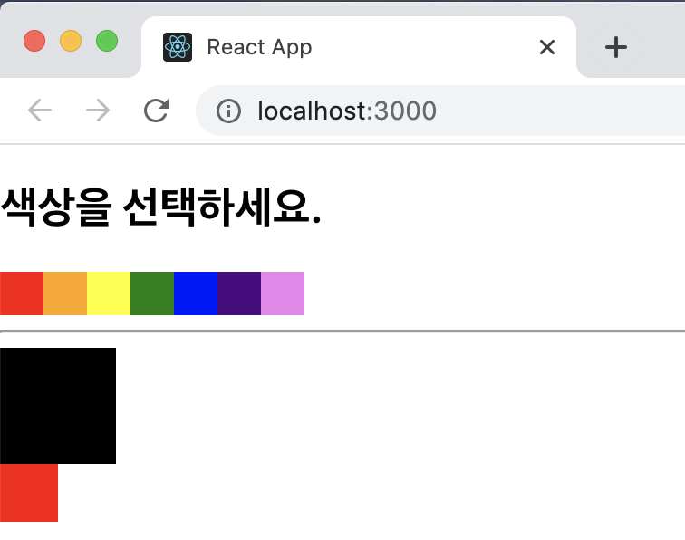
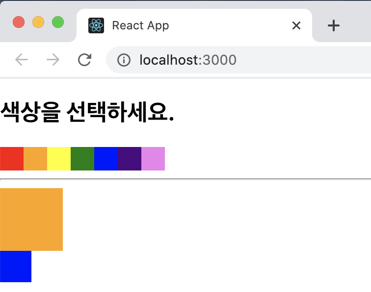

# Context API

Context API는 리액트 프로젝트에서 전역적으로 사용할 데이터가 있을 때 유용한 기능이다. 이를테면 사용자 로그인 정보, 애플리케이션 환경 설정, 테마 등 여러 종류가 있을 수 있다. 이 기능은 리액트 관련 라이브러리에서도 많이 사용되고 있다. 예를 들어 리덕스, 리액트 라우터, styled-components 등의 라이브러리는 Context API를 기반으로 구현되어 있다.

이번 실습은 다음과 같은 흐름으로 진행된다.

> Context API를 사용한 전역 상태 관리 흐름 이해하기 → 기본적인 사용법 익히기 → 동적 Context 사용하기 → Consumer 대신 Hook 또는 static contextType 사용하기

## 15.1 Context API를 사용한 전역 상태 관리 흐름 이해하기

프로젝트 내에서 환경 설정, 사용자 정보와 같은 전역적으로 필요한 상태를 관리해야 할 때는 어떻게 해야 할까?

리액트 애플리케이션은 컴포넌트 간에 **데이터를 props로 전달**하기 때문에 컴포넌트 여기저기서 필요한 데이터가 있을 때는 **주로 최상위 컴포넌트인 App의 state에 넣어서 관리**한다. 


G 컴포넌트는 전역 상태를 업데이트 시키고, F와 J 컴포넌트는 업데이트 된 상태를 렌더링 한다고 가정해보자. 그렇다면 App 컴포넌트에서는 다음과 같이 상태와 업데이트 함수를 정의해야 한다.

```react
const [value, setValue] = useState('Hello');
const onSetValue = useCallback(value => setValue(value), []);
```

그리고 App이 지니고 있는 value 값을 F 컴포넌트와 J 컴포넌트에 전달하려면 여러 컴포넌트를 거쳐야 한다. F의 경우 App -> A -> B -> F의 흐름이고, J의 경우 App -> H -> J의 흐름이다. 추가로 G 컴포넌트에 상태 업데이트 함수를 전달할 때도 App -> A -> B -> E -> G와 같이 복잡하게 여러 번 거쳐서 전달해야 한다.

실제로 리액트 프로젝트에서는 더 많은 컴포넌트를 거쳐야 할 때도 있고 다루어야 하는 데이터가 훨씬 많아질 수도 있으므로, 이런 방식을 사용하면 유지 보수성이 낮아질 가능성이 높다. 그렇기 때문에 **리덕스나 MobX같은 상태 관리 라이브러리를 사용하여 전역 상태 관리 작업을 더 편하게 처리**하기도 한다. 리액트 v16.3 업데이트 이후에는 Context API가 많이 개선되었기 떄문에 별도의 라이브러리를 사용하지 않아도 전역 상태 관리를 손쉽게 할 수 있다.

아래 그림과 같이 기존에는 최상위 컴포넌트에서 여러 컴포넌트를 거쳐 props로 원하는 상태와 함수를 전달했지만, **Context API를 사용하면 Context를 만들어 단 한번에 원하는 값을 받아 와서 사용할 수 있다.**


## 15.2 Context API 사용법 익히기

먼저 Context API를 연습할 리액트 프로젝트를 생성해 준다.

`$ yarn create react-app context-tutorial`

#### 15.2.1 새 Context 만들기

프로젝트를 생성한 후, 새로운 Context를 만들어보자. src 디렉터리에 contexts 디렉터리를 만든 뒤 그 안에 color.js라는 파일을 만든다. Context를 만들 때 반드기 contexts 디렉터리를 만들 필요는 없지만 다른 파일과 구분하기 위해 따로 디렉터리를 만들었다.

파일을 만들고 아래와 같이 입력한다.

```react
import { createContext } from "react";

const colorContext = createContext({ color: "black" });

export default colorContext;
```

새 Context를 만들 때는 createContext 함수를 사용한다. 파라미터에는 해당 Context의 기본 상태를 지정한다.

#### 15.2.2 Consumer 사용하기

이번에는 ColorBox라는 컴포넌트를 만들어서 ColorContext 안에 들어 있는 색상을 보여주도록 해보자. 이때 생상을 props로 받아 오는 것이 아니라 ColorContext 안에 들어 있는 Consumer라는 컴포넌트를 통해 색상을 조회할 예정이다.

Src 디렉터리에 components 디렉터리를 만들고, 그 안에 ColorBox.js 파일을 생성하여 아래와 같이 입력해준다.

```react
import React from "react";
import ColorContext from "../contexts/color";

const ColorBox = () => {
  return (
    <ColorContext.Consumer>
      {(value) => (
        <div
          style={{ width: "64px", height: "64px", backgroud: value.color }}
        />
      )}
    </ColorContext.Consumer>
  );
};

export default ColorBox;
```

Consumer 사이에 중괄호를 열어서 그 안에 함수를 넣어 주었다. 이러한 패턴을 Function as a child, 혹은 Render Props 라고 부른다. 컴포넌트의 children이 있어야 할 자리에 일반 JSX 혹은 문자열이 아닌 함수를 전달하는 것이다.

> 💬
>
> Render Props 예제
>
> ```react
> import React from "react";
> 
> const RenderPropsSample = ({children}) => {
>   return <div>결과: {children(5)}</div>;
> }
> 
> export default RenderPropsSample;
> ```
>
> 만약 위와 같은 컴포넌트가 있다면 추후 사용할 때 다음과 같이 사용할 수 있다.
>
> ```react
> <RenderPropsSample>{value => 2 * value}</RenderPropsSample>;
> ```
>
> RenderPropsSample에게 children props로 파라미터에 2를 곱해서 반환하는 함수를 전달하면 해당 컴포넌트에서는 이 함수에 5를 인자로 넣어서 "결과 : 10"을 렌더링 한다.

컴포넌트를 다 만든 다음 App 컴포넌트에 렌더링 하고 브라우저를 확인해보면 아래와 같은 검정색 정사각형이 나타난 것을 확인할 수 있다.



#### 15.3 Provider

Provider를 사용하면 Context의 value를 변경할 수 있다. App 컴포넌트를 다음과 같이 수정해보자

```react
import React from "react";
import ColorBox from "./components/ColorBox";
import ColorContext from "./contexts/color";

function App() {
  return (
    <ColorContext.Provider value={{ color: "red" }}>
      <div>
        <ColorBox />
      </div>
    </ColorContext.Provider>
  );
}

export default App;
```

저장한 후 브라우저를 확인하면 빨간색 박스로 바뀐 것을 확인할 수 있다.



기존에 createContext 함수를 사용할 때는 파라미터로 Context의 기본값(여기서는 'black')을 넣어 줬다. 이 기본값은 Provider를 사용하지 않았을 때만 사용된다. 만약 Provider를 사용했는데 value를 명시하지 않았다면, 이 기본값을 사용하지 않기 때문에 오류가 발생한다. 

다음은 오류가 발생하는 코드다.

```react
import React from "react";
import ColorBox from "./components/ColorBox";
import ColorContext from "./contexts/color";

function App() {
  return (
    <ColorContext.Provider>
      <div>
        <ColorBox />
      </div>
    </ColorContext.Provider>
  );
}

export default App;
```

Provider를 사용하고 value를 명시하지 않으면 아래와 같이 오류가 발생한다. 따라서 Provider를 사용한다면 value를 꼭 명시해 주어야 제대로 작동한다는 것을 명심해야 한다.



## 15.3 동적 Context 사용하기

지금까지 배운 내용으로는 고정적인 값만 사용할 수 있었다. 이번에는 Context 값을 업데이트해야 하는 경우 어떻게 해야 하는지 알아보자.

#### 15.3.1 Context 파일 수정하기

Context의 value에는 무조건 상태 값만 있어야 하는 것은 아니고 함수를 전달해 줄 수도 있다. 

기존에 작성했던 ColorContext의 코드를 다음과 같이 수정해보자.

```react
import { createContext, useState } from "react";

const ColorContext = createContext({
  state: { color: "black", subcolor: "red" },
  actions: {
    setColor: () => {},
    setSubcolor: () => {},
  },
});

const ColorProvider = ({ children }) => {
  const [color, setColor] = useState("black");
  const [subcolor, setSubcolor] = useState("red");

  const value = {
    state: { color, subcolor },
    actions: { setColor, setSubcolor },
  };

  return (
    <ColorContext.Provider value={value}>{children}</ColorContext.Provider>
  );
};

// const ColorConsumer = ColorContext.Consumer와 같은 의미
const { Consumer: ColorConsumer } = ColorContext;

// ColorProvider와 ColorConsumer 내보내기
export { ColorProvider, ColorConsumer };

export default ColorContext;
```

위 파일에서 ColorProvider라는 컴포넌트를 새로 작성해 주었다. 그리고 그 컴포넌트에서는 ColorContext.Provider를 렌더링하고 있다. 이 Provider의 value에는 상태는 state로, 업데이트 함수는 actions로 묶어서 전달하고 있다. Context에서 값을 동적으로 사용할 때 반드시 묶어줄 필요는 없지만, 이렇게 state와 actions 객체를 따로따로 분리해 주면 나중에 다른 컴포넌트에서 Context의 값을 사용할 때 편하게 사용할 수 있다.

추가로 createContext를 사용할 때 기본값으로 사용할 객체도 수정했다. createContext의 기본값을 실제 Provider의 value에 넣는 객체의 형태와 일치시켜 주는 것이 좋다. 그렇게 하면 Context 코드를 볼 때 내부 값이 어떻게 구성되어 있는지 파악하기도 쉽고, 실수로 Provider를 사용하지 않았을 때 리액트 애플리케이션에서 에러가 발생하지 않는다.

#### 15.3.2 새로워진 Context를 프로젝트에 반영하기

새로 만든 Context를 프로젝에 반영해보자. 우선 App 컴포넌트의 ColorContext.Provider를 ColorProvider로 바꿔준다.

```react
import React from "react";
import ColorBox from "./components/ColorBox";
import { ColorProvider } from "./contexts/color";

function App() {
  return (
    <ColorProvider>
      <div>
        <ColorBox />
      </div>
    </ColorProvider>
  );
}

export default App;
```

그런 다음 ColorBox의 ColorContext.Consumer도 ColorConsumer로 변경하고 사용할 value의 형태도 바뀌었으니 이에 따른 변화를 다음과 같이 반영시켜 준다.

```react
import React from "react";
import { ColorConsumer } from "../contexts/color";

const ColorBox = () => {
  return (
    <ColorConsumer>
      {(value) => (
        <>
          <div
            style={{
              width: "64px",
              height: "64px",
              background: value.state.color,
            }}
          />
          <div
            style={{
              width: "64px",
              height: "64px",
              background: value.state.subcolor,
            }}
          />
        </>
      )}
    </ColorConsumer>
  );
};

export default ColorBox;
```

위 코드에서 객체 비구조화 할당 문법을 사용하면 다음과 같이 value를 조회하는 것을 생략할 수도 있다.

```react
import React from "react";
import { ColorConsumer } from "../contexts/color";

const ColorBox = () => {
  return (
    <ColorConsumer>
      {({ state }) => (
        <>
          <div
            style={{
              width: "64px",
              height: "64px",
              background: state.color,
            }}
          />
          <div
            style={{
              width: "32px",
              height: "32px",
              background: state.subcolor,
            }}
          />
        </>
      )}
    </ColorConsumer>
  );
};

export default ColorBox;
```

저장하고 브라우저를 보면 정상적으로 작동하는 것을 확인할 수 있다.



#### 15.3.3 색상 선택 컴포넌트 만들기

이번에는 Context의 actions에 넣어 준 함수를 호출하는 컴포넌트를 만들어 보자. SelectColors.js 파일을 만들고 아래와 같이 작성해준다. 지금은 Consumer를 사용하지 않고 UI만 작성해보겠다.

```react
import React from "react";

const colors = ["red", "orange", "yellow", "green", "blue", "indigo", "violet"];

const SelectColors = () => {
  return (
    <div>
      <h2>색상을 선택하세요.</h2>
      <div style={{ display: "flex" }}>
        {colors.map((color) => {
          <div
            key={color}
            style={{
              background: color,
              width: "24px",
              height: "24px",
              cursor: "pointer",
            }}
          />;
        })}
      </div>
      <hr />
    </div>
  );
};

export default SelectColors;
```

작성한 뒤 저장하고 App 컴포넌트에서 ColorBox 위에 렌더링 시키자.

```react
import React from "react";
import ColorBox from "./components/ColorBox";
import SelectColors from "./components/SelectColors";
import { ColorProvider } from "./contexts/color";

function App() {
  return (
    <ColorProvider>
      <div>
        <SelectColors />
        <ColorBox />
      </div>
    </ColorProvider>
  );
}

export default App;
```

저장한 뒤 브라우저를 보면 아래와 같이 무지개 색상으로 이루어진 정사각형들이 나타난 것을 확인할 수 있다.



이제 해당 색상에서 마우스 왼쪽 버튼을 클릭하면 큰 정사각형의 색상을 변경하고, 오른쪽 버튼을 클릭하면 작은 정사각형의 색상을 변경하도록 구현해보자.

```react
import React from "react";
import { ColorConsumer } from "../contexts/color";

const colors = ["red", "orange", "yellow", "green", "blue", "indigo", "violet"];

const SelectColors = () => {
  return (
    <div>
      <h2>색상을 선택하세요.</h2>
      <ColorConsumer>
        {({ actions }) => (
          <div style={{ display: "flex" }}>
            {colors.map((color) => (
              <div
                key={color}
                style={{
                  background: color,
                  width: "24px",
                  height: "24px",
                  cursor: "pointer",
                }}
                onClick={() => actions.setColor(color)}
                onContextMenu={(e) => {
                  e.preventDefault(); // 마우스 오른쪽 클릭 시 메뉴가 뜨는 것을 무시함
                  actions.setSubcolor(color);
                }}
              />
            ))}
          </div>
        )}
      </ColorConsumer>
      <hr />
    </div>
  );
};

export default SelectColors;
```

마우스 오른쪽 버튼 클릭 이벤트는 `onContextMenu`를 사용하면 된다. 오른쪽 클릭 시 원래 브라우저 메뉴가 나타나지만, 여기서 `e.preventDefault()` 를 호출하면 메뉴가 뜨지 않는다. 브라우저를 열어서 색상을 클릭해보면 하단에 있는 정사각형의 색상들이 잘 바뀌는 것을 볼 수 있다.



## 15.4 Consumer 대신 Hook 또는 static contextType 사용하기

#### 15.4.1 useContext Hook

리액트에 내장되어 있는 Hook 중에 useContext라는 Hook을 사용하면, 함수형 컴포넌트에서 Context를 아주 편하게 사용할 수 있다. ColorBox.js의 코드를 다음과 같이 수정해보자.

```react
import React, { useContext } from "react";
import ColorContext from "../contexts/color";

const ColorBox = () => {
  const { state } = useContext(ColorContext);
  return (
    <>
      <div
        style={{
          width: "64px",
          height: "64px",
          background: state.color,
        }}
      />
      <div
        style={{
          width: "32px",
          height: "32px",
          background: state.subcolor,
        }}
      />
    </>
  );
};

export default ColorBox;
```

Children 함수에 전달하는 Render Props 패턴이 불편하다면 useContext Hook을 사용하여 편하게 Context 값을 조회할 수 있다. 하지만 Hook은 함수형 컴포넌트에서만 사용할 수 있다는 것을 기억해야 한다.

#### 15.4.2 static contextType

함수형 컴포넌트에서 Context를 쉽게 사용하려면 위에서 본 static contextType을 정의하는 방법이 있다. 다음과 같이 SelectColors 컴포넌트를 클래스형 컴포넌트로 리팩토링 하고 Consumer 쪽의 코드는 제거해줬다.

```react
import React, { Component } from "react";

const colors = ["red", "orange", "yellow", "green", "blue", "indigo", "violet"];

class SelectColors extends Component {
  render() {
    return (
      <div>
        <h2>색상을 선택하세요.</h2>

        {({ actions }) => (
          <div style={{ display: "flex" }}>
            {colors.map((color) => (
              <div
                key={color}
                style={{
                  background: color,
                  width: "24px",
                  height: "24px",
                  cursor: "pointer",
                }}
                onClick={() => actions.setColor(color)}
                onContextMenu={(e) => {
                  e.preventDefault(); // 마우스 오른쪽 클릭 시 메뉴가 뜨는 것을 무시함
                  actions.setSubcolor(color);
                }}
              />
            ))}
          </div>
        )}

        <hr />
      </div>
    );
  }
}

export default SelectColors;
```

그런 다음 클래스 상단에 static contextType을 지정해준다.

```react
import React, { Component } from "react";

const colors = ["red", "orange", "yellow", "green", "blue", "indigo", "violet"];

class SelectColors extends Component {
  static contextType= ColorContext;
  render() {
    (...)
  }
}

export default SelectColors;
```

이렇게 해 주면  `this.context`를 조회했을 때 현재 Context의 value를 가리키게 된다. 만약 setColor를 호출하고 싶다면 `this.context.actions.setColor` 를 호출하면 된다.

컴포넌트를 다음과 같이 완성해보자

```react
import React, { Component } from "react";
import ColorContext from "../contexts/color";

const colors = ["red", "orange", "yellow", "green", "blue", "indigo", "violet"];

class SelectColors extends Component {
  static contextType = ColorContext;

  handleSetColor = (color) => {
    this.state.actions.setColor(color);
  };

  handleSetSubcolor = (color) => {
    this.state.actions.setSubcolor(color);
  };

  render() {
    return (
      <div>
        <h2>색상을 선택하세요.</h2>

        {({ actions }) => (
          <div style={{ display: "flex" }}>
            {colors.map((color) => (
              <div
                key={color}
                style={{
                  background: color,
                  width: "24px",
                  height: "24px",
                  cursor: "pointer",
                }}
                onClick={this.handleSetColor(color)}
                onContextMenu={(e) => {
                  e.preventDefault(); // 마우스 오른쪽 클릭 시 메뉴가 뜨는 것을 무시함
                  this.handleSetSubcolor(color);
                }}
              />
            ))}
          </div>
        )}

        <hr />
      </div>
    );
  }
}

export default SelectColors;
```

static contextType을 정의하면 클래스 메서드에서도 Context에 넣어 둔 함수를 호출할 수 있다는 장점이 있다. 단점이라면, 한 클래스에서 하나의 Context밖에 사용하지 못한다는 것이다.

## 15.5 정리

기존에는 컴포넌트 간에 상태를 교류해야 할 때 무조건 부모 → 자식 흐름으로 props를 전달했었다. 하지만 이제는 Context API를 통해 더욱 쉽게 상태를 교류할 수 있게 됐다.

프로젝트의 컴포넌트 구조가 꽤 간단하고 다루는 상태의 종류가 그다지 많지 않다면, 굳이 Context를 사용할 필요는 없다. 하지만 전역적으로 여기저기서 ㅅ용되는 상태가 있고 컴포넌트의 개수가 많은 상황이라면, Context API를 사용하는 것이 권장된다.

다음 장에서는 리덕스라는 상태 관리 라이브러리를 배울 예정이다. 이 라이브러리는 Context API 기반으로 만들어져 있으며, Context API와 마찬가지로 전역 상태 관리를 도와준다. 리액트 v16.3에서 Context API가 개선되기 전에는 주로 리덕스를 사용하여 전역 상태를 관리해 왔다. 단순한 전역 상태 관리라면 이번에 배운 Context API로 리덕스를 대체할 수 있다. 하지만 리덕스는 더욱 향상된 성능과 미들웨어 기능, 강력한 개발자 도구, 코드의 높은 유지 보수성을 제공하기 때문에 모든 상황에 대해 대체가 가능하지는 않다.