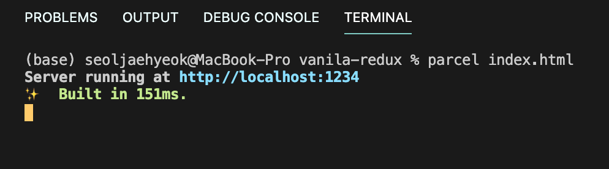
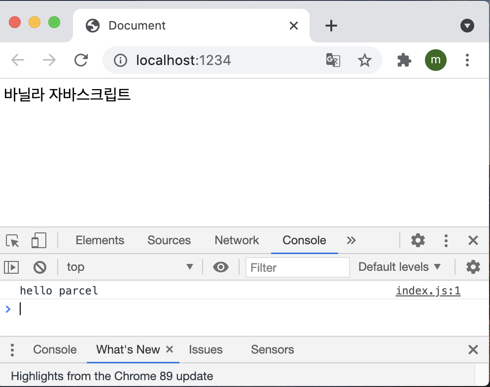

리덕스는 가장 많이 사용하는 상태 관리 라이브러리다. 리덕스를 사용하면 컴포넌트의 상태 업데이트 관련 로직을 다른 파일로 분리시켜서 더욱 효율적으로 관리할 수 있다. 또한, 컴포넌트끼리 똑같은 상태를 공유해야 할 때도 여러 컴포넌트를 거치지 않고 손쉽게 상태 값을 전달하거나 업데이트할 수 있다.

리덕스 라이브러리는 전역 상태를 관리할 때 굉장히 효율적이다. 물론 리덕스를 사용하는 것이 유일한 해결책은 아니다. 이전에 배운 Context API를 통해서도 똑같은 작업을 할 수 있다. Context API가 개선되기 전에는 사용 방식이 매우 불편했기 때문에 주로 리덕스를 사용해 전역 상태 관리를 했다.

단순히 전역 상태 관리만 한다면 Context API를 사용하는 것만으로도 충분하다. 하지만 리덕스를 사용하면 상태를 더욱 체계적으로 관리할 수 있기 때문에 프로젝트의 규모가 클 경우에는 리덕스를 사용하는 편이 좋다. 코드의 유지 보수성도 높여 주고 작업 효율도 극대화해 주기 때문이다. 추가로 아주 편리한 개발자 도구도 지원하며, 미들웨어라는 기능을 제공하여 비동기 작업을 훨씬 효율적으로 관리할 수 있게 해 주기도 한다.

이번 실습은 다음과 같은 흐름으로 진행된다.

> 핵심 키워드 알아보기 → Parcel로 프로젝트 구성하기 → 토글 스위치와 카운터 구현하기

## 16.1 개념 미리 정리하기

먼저 앞으로 리덕스를 사용하면서 접하게 될 키워드의 개념을 간략하게 알아보도록 하자. 

#### 16.1.1 액션

상태에 어떠한 변화가 필요하면 액션(action)이란 것이 발생한다. 이는 하나의 객체로 표현되는데 액션 객체는 다음과 같은 형식으로 이루어져 있다.

```react
{
  type: 'TOGGLE_VALUE',
}
```

액션 객체는 type 필드를 반드시 가지고 있어야 한다. 이 값을 액션의 이름이라고 생각하면 된다. 그리고 그 외의 값들은 나중에 상태 업데이트를 할 때 참고해야 할 값이며, 작성자 마음대로 넣을 수 있다. 

```react
{
  type: 'ADD_TODO',
  data: {
    id: 1,
    text: '리덕스 배우기',
  }
}
  
{
  type: 'CHANGE_INPUT',
  text: '안녕하세요',
}
```

#### 16.1.2 액션 생성 함수

액션 생성 함수(action creator)는 액션 객체를 만들어 주는 함수다.

```react
function addTodo(data) {
	return {
    type: 'ADD_TODO',
    data
  };
}
// 화살표 함수로도 만들 수 있다.
const changeInput = text => ({
  type: 'CHANGE_INPUT',
  text
});
```

#### 16.1.3 리듀서

리듀서(Reducer)는 변화를 일으키는 함수다. 액셔을 만들어서 발생시키면 리듀서가 현재 상태와 전달받은 액션 객체를 파라미터로 받아 온다. 그리고 두 값을 참고하여 **새로운 상태를 만들어서 반환**해 준다. 리듀서 코드는 다음과 같은 형태로 이루어져 있다.

```react
const initialState = {
  counter: 1,
}

function reducer(state=initialState, action) {
	switch(action.type) {
    case INCREMENT:
      return {
        counter: state.counter + 1
      };
    default:
      return state;
  }
}
```

#### 16.1.4 스토어

프로젝트에 리덕스를 적용하기 위해 스토어(store)를 만든다. 한 개의 프로젝트는 단 하나의 스토어만 가질 수 있다. 스토어 안에는 현재 애플리케이션 상태와 리듀서가 들어가 있으며, 그 외에도 몇 가지 중요한 내장 함수를 지닌다.

#### 16.1.5 디스패치

디스패치는 스토어의 내장 함수 중 하나다. 디스패치는 **'액션을 발생시키는 것'**이라고 이해하면된다. 이 함수는 `dispatch(action)` 과 같은 형태로 액션 객체를 파라미터로 넣어서 호출한다. 이 함수가 호출되면 스토어는 **리듀서 함수를 실행시켜 새로운 상태를 만들어 준다.**

#### 16.1.6 구독

구독(subscribe)도 스토어의 내장 함수 중 하나다. subscribe 함수 안에 리스너 함수를 파라미터로 넣어서 호출해 주면(**함수 형태의 값을 파라미터로 받음**), 이 리스너 함수가 액션이 디스패치되어 상태가 업데이트될 때마다 호출된다.

```react
const listener = () => {
  console.log('상태가 업데이트됨');
}
const unsubscribe = store.subscribe(listener);

unsubscribe(); // 추후 구독을 비활성화할 때 함수를 호출
```

## 16.2 리액트 없이 쓰는 리덕스

리덕스는 리액트에 종속되는 라이브러리가 아니다. 리액트에서 사용하려고 만들어졌지만 실제로 다른 UI 라이브러리/프레임워크와 함께 사용할 수도 있다.

또한 리덧스는 바닐라 자바스크립트와 함께 사용할 수도 있다. 이번에는 바닐라 자바스크립트 환경에서 리덕스를 하용하여 리덕스의 핵심 기능과 작동 원리를 이해해 보자.

#### 16.2.1 Parcel로 프로젝트 만들기

프로젝트를 구성하기 위해 Parcel이라는 도구를 사용해보겠다. 이 도구를 사용하면 아주 쉽고 빠르게 웹 애플리케이션 프로젝트를 구성할 수 있다.

먼저 parcel_bundler를 설치하고

`$ yarn global add parcel-bundler`

> ❗️ yarn global이 잘 설치되지 않으면 `npm install -g parcel-bundler` 를 해보자

프로젝트 디렉터리를 생성한 후 package.json 파일을 생성한다.

` $ mkdir vanila-redux `

`$ cd vanila-redux`

`$ yarn init -y` => package.json 파일 생성

에디터로 해당 디렉터리를 열어서 index.html과 index.js 파일을 만든 다음 아래 명령어를 실행하면 개발용 서버가 실행된다.

`$ parcel index.html`



개발 서버의 주소를 http://localhost:1234이며, 파일을 저장할 때마다 자동으로 새로고침 된다. 해당 주소로 들어가게 되면 정상적으로 돌아가고 있는 것을 확인할 수 있다.



이제 yarn을 사용하여 리덕스 모듈을 설치하면 프로젝트 준비가 완료된다.

`$ yarn add redux`

#### 16.2.2 간단한 UI 구성

