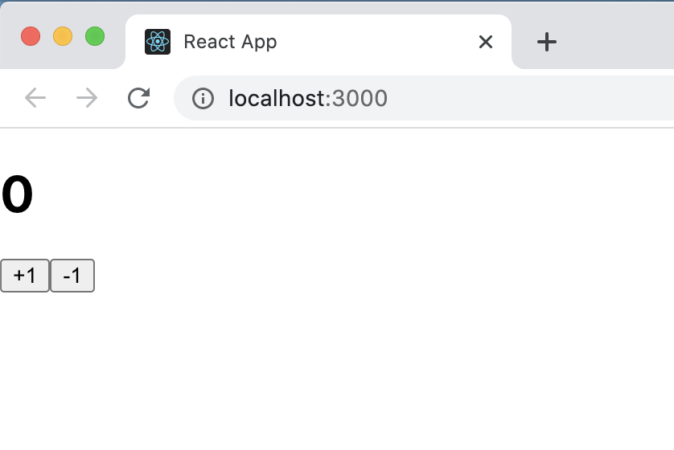
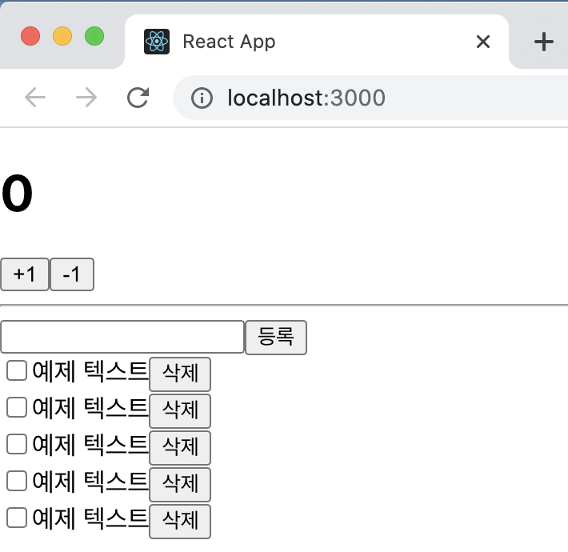
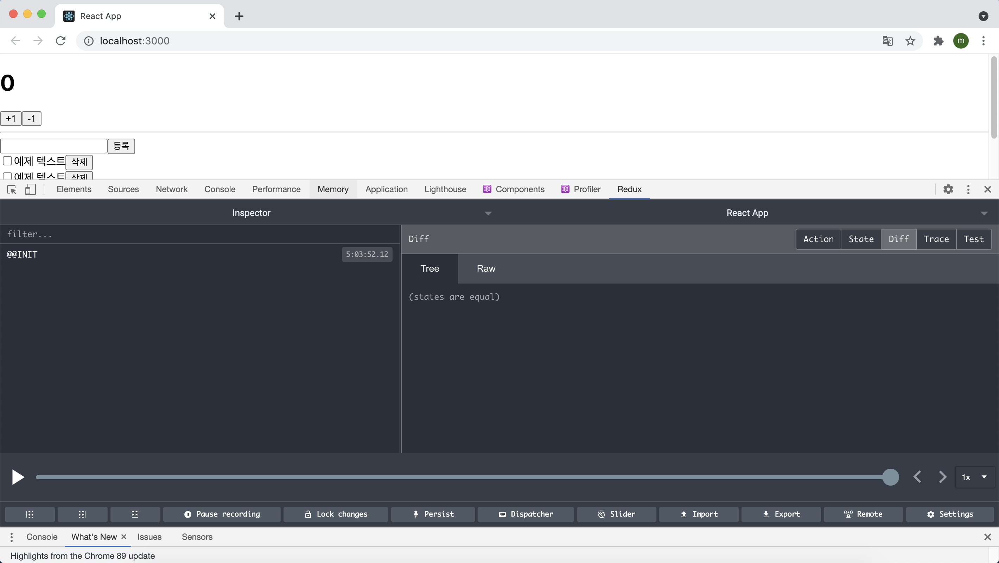
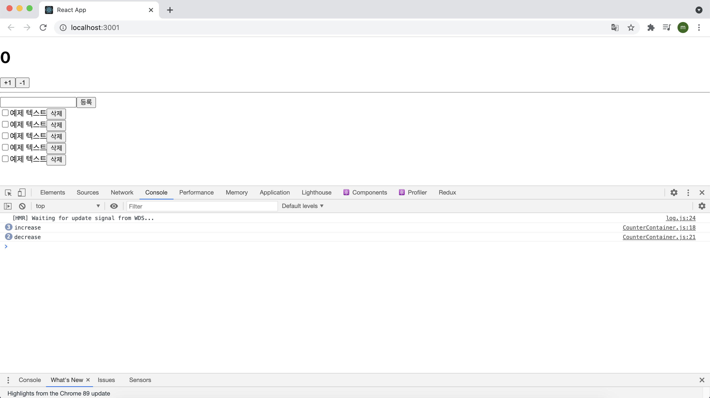
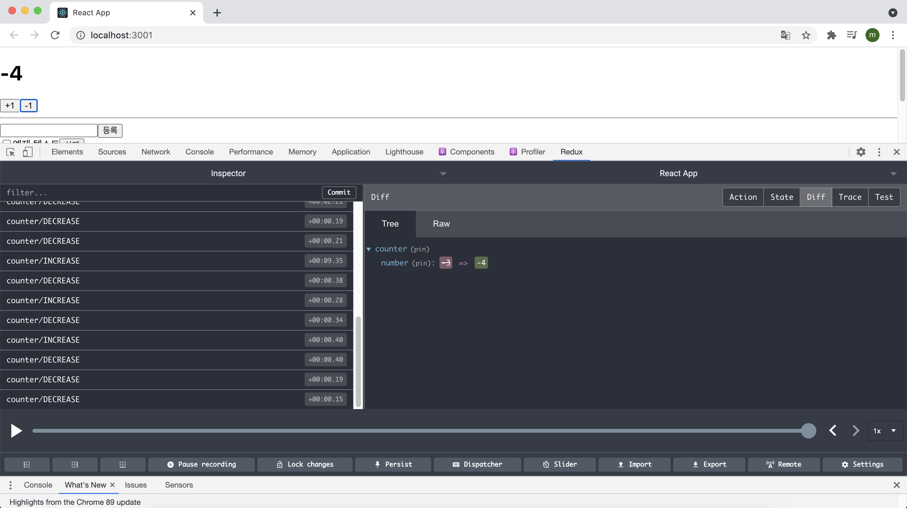
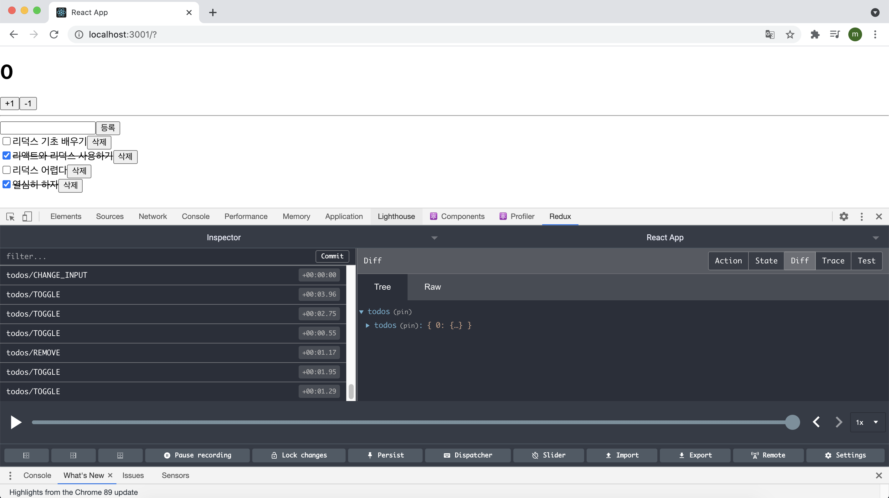

# 리덕스를 사용하여 리액트 애플리케이션 상태 관리하기

소규모 프로젝트에서는 컴포넌트가 가진 state를 사용하는 것만으로도 충분하지만, 프로젝트의 규모가 커짐에 따라 상태 관리가 번거로워질 수도 있다.

리덕스를 사용하면, 상태 업데이트에 관한 로직을 모듈로 따로 분리하여 컴포넌트 파일과 별개로 관리할 수 있으므로 코드를 유지 보수하는 데 도움이 된다. 또한, 여러 컴포넌트에서 동일한 상태를 공유해야 할 때 매우 유용하며, 실제 업데이트가 필요한 컴포넌트만 리렌더링되도록 쉽게 최적화해 줄 수 있다.

앞서 바닐라 자바스크립트 환경에서 리덕스를 사용할 때 스토어의 내장 함수인 store.dispatch와 store.subscribe 함수를 사용했는데 리액트 애플리케이션에서 리덕스를 사용할 때는 store 인스턴스를 직접 사용하기 보다는 주로 react-redux라는 라이브러리에서 제공하는 유틸 함수(connect)와 컴포넌트(Provider)를 사용하여 리덕스 관련 작업을 처리한다. 

이번 실습은 다음과 같은 흐름으로 진행된다.

> 프로젝트 준비 → 프레젠테이셔널 컴포넌트 작성 → 리덕스 관련 코드 작성 → 컨테이너 컴포넌트 작성 → 더 편하게 사용하는 방법 알아보기 → connect 대신 Hooks 사용하기

## 17.1 작업 환경 설정

프로젝트를 생성하고 해당 프로젝트에 리덕스를 적용해준다.

`$ yarn create react-app react-redux-tutorial`

`$ yarn add redux react-redux`

## 17.2 UI 준비

리액트 프로젝트에서 리덕스를 사용할 때 가장 많이 사용하는 패턴은 프레젠테이셔널 컴포넌트와 컨테이너 컴포넌트를 분리하는 것이다(Container-Presenter Pattern). 프레젠테이셔널 컴포넌트는 상태 관리가 이루어지지 않고, 그저 props를 받아와서 화면에 UI를 보여주기만 하는 컴포넌트를 뜻한다.  이와 달리 컨테이너 컴포넌트는 리덕스와 연동되어 있는 컴포넌트로, 리덕스로부터 상태를 받아오기도 하고 리덕스 스토어에 액션을 디스패치 하기도 한다.

이런 패턴을 사용하는 것이 필수 사항은 아니지만 이 패턴을 사용하면 코드의 재사용성도 높아지고, 관심사의 분리가 이루어져 UI를 작성할 때 좀 더 집중할 수 있다.


UI와 관련된 컴포넌트는 src/components 경로에 저장하고, 리덕스와 연동된 컨테이너 컴포넌트는 src/containers 경로에 작성한다.

#### 17.2.1 카운터 컴포넌트

숫자를 더하고 뺄 수 있는 카운터 컴포넌트를 만들어보자. 

```react
import React from "react";

const Counter = ({ number, onIncrease, onDecrease }) => {
  return (
    <div>
      <h1>{number}</h1>
      <div>
        <button onClick={onIncrease}>+1</button>
        <button onClick={onDecrease}>-1</button>
      </div>
    </div>
  );
};

export default Counter;
```

이제 이 컴포넌트를 App 컴포넌트에서 렌더링 시킨다.

```react
import React from "react";
import Counter from "./components/Counter";

function App() {
  return <Counter number={0} />;
}

export default App;
```

개발 서버를 실행시켜 브라우저를 확인해보면 아래와 같이 카운터 컴포넌트가 나타난 것을 확인할 수 있다.



#### 17.2.2 할 일 목록 컴포넌트

이번에는 할 일을 추가하고, 체크하고, 삭제할 수 있는 Todo 컴포넌트를 만들어보자.

```react
import React from "react";

const TodoItem = ({ todo, onToggle, onRemove }) => {
  return (
    <div>
      <input type="checkbox" />
      <span>예제 텍스트</span>
      <button>삭제</button>
    </div>
  );
};

const Todos = ({ input, todos, onChange, onInsert, onToggle, onRemove }) => {
  const onSubmit = (e) => {
    e.preventDefatul();
  };

  return (
    <div>
      <form onSubmit={onSubmit}>
        <input />
        <button type="submit">등록</button>
      </form>
      <div>
        <TodoItem />
        <TodoItem />
        <TodoItem />
        <TodoItem />
        <TodoItem />
      </div>
    </div>
  );
};

export default Todos;
```

파일 하나에 두개의 컴포넌트를 선언해줬지만 두 개의 파일로 분리해줘도 무방하다. 위 컴포넌트에서 받아 오는 props는 추후에 사용할 예정이다.

이제 App 컴포넌트에 Counter 컴포넌트 아래에 hr태그를 사용해서 구분선을 만들어 준 다음 렌더링 시켜준다.

```react
import React from "react";
import Counter from "./components/Counter";
import Todos from "./components/Todos";

function App() {
  return (
    <div>
      <Counter number={0} />
      <hr />
      <Todos />
    </div>
  );
}

export default App;
```

저장한 후 브라우저를 확인하면 아래와 같이 출력된 것을 확인할 수 있다.



## 17.3 리덕스 관련 코드 작성

이제 프로젝트에 리덕스를 사용해보자. 리덕스를 사용할 때는 액션 타입, 액션 생성 함수, 리듀서 코드를 작성해야 하는데 이 코드들을 각각 다른 파일에 작성하는 방법도 있고, 기능별로 묶어서 파일 하나에 작성하는 방법도 있다.


위 그림은 가장 일반적인 구조로 actions, constants, reducers라는 세 개의 디렉터리를 만들고 그 안에 기능별로 파일을 하나씩 만드는 방식이다. 코드를 종류에 따라 다른 파일에 작성하여 정리할 수 있어서 편리하지만, 새로운 액션을 만들 때마다 세 종류의 파일을 모두 수정해야 하기 때문에 불편하기도 하다. 이 방식은 리액트 공식 문서에서도 사용되므로 가장 기본적이라할 수 있지만, 불편할 수도 있는 구조다.


위 그림은 액션 타입, 액션 생성 함수, 리듀서 함수를 기능별로 파일 하나에 몰아서 다 작성하는 방식이다. 이러한 방식을 Ducks 패턴이라고 부르며, 앞서 설명한 일반적인 구조로 리덕스를 작성하는데 불편함을 느낀 사람들이 자주 사용한다.

리덕스 관련 코드에 대한 디렉터리 구조는 정해진 방법이 없기 때문에 마음대로 작성해도 되지만, 위 두 가지 방법이 주로 사용된다. 이 프로젝트에서는 두 번째로 소개한 방식인 Ducks 패턴으로 코드를 작성해볼 예정이다.

#### 17.3.1 counter 모듈 작성

Ducks 패턴을 사용하여 액션 타입, 액션 생성 함수, 리듀서를 작성한 코드를 **모듈**이라고 한다.

먼저 counter 모듈을 작성해보자.

modules 디렉터리 안에 counter.js 파일을 만들고 아래와 같이 액션 타입을 정의해준다.

```react
// 액션 타입 정의
const INCREASE = "counter/INCREASE";
const DECREASE = "counter/DECREASE";
```

액션 타입은 대문자로 정의하고, 문자열 내용은 **'모듈 이름/액션 이름'**과 같은 형태로 작성한다. 문자열 안에 모듈 이름을 넣음으로써 나중에 프로젝트가 커졌을 때 액션의 이름이 충돌되지 않게 해준다.

```react
// 액션 타입 정의
const INCREASE = "counter/INCREASE";
const DECREASE = "counter/DECREASE";

// 액션 생성 함수
export const increase = () => ({ type: INCREASE });
export const decrease = () => ({ type: DECREASE });
```

그 다음은 액션 생성 함수를 만들어줘야 한다. 더 필요하거나 추가할 값이 없으니  위와 같이 만들어 주면 된다. export 키워드를 사용해서 추후에 이 함수를 다른 파일에서 불러와 사용할 수 있게끔 만들어 줬다.

```react
// 액션 타입 정의
const INCREASE = "counter/INCREASE";
const DECREASE = "counter/DECREASE";

// 액션 생성 함수
export const increase = () => ({ type: INCREASE });
export const decrease = () => ({ type: DECREASE });

// 초기 상태 지정
const initialState = {
  number: 0,
};

// 리듀서 함수
function counter(state = initialState, action) {
  switch (action.type) {
    case INCREASE:
      return {
        number: state.number + 1,
      };
    case DECREASE:
      return {
        number: state.number - 1,
      };
    default:
      return state;
  }
}

export default counter;
```

이제 위와 같이 counter 모듈의 초기 상태와 리듀서 함수를 작성해주면 된다.

이 모듈의 초기 상태에는 number 값을 설정해주었으며, 리듀서 함수에는 현재 상태를 참조하여 새로운 객체를 생성해서 반환하는 코드를 작성해주었다. 마지막으로 export default 키워드를 사용해서 함수를 내보내 주었다.

조금 전에 만든 액션 생성 함수는 export로 내보내 주었고, 이번에 만든 리듀서는 export default로 내보내 주었는데 두 방식의 차이점은 **export는 여러 개 내보낼 수 있지만 export default는 단 한 개만 내보낼 수 있다는 것**이다. 불러오는 방식도 아래와 같이 다르다.

```react
import counter from "./counter";
import {increase, decrease} from "./counter";
// 한꺼번에 불러오고 싶을 때
import counter, {increase, decrease} from "./counter";
```

#### 17.3.2 todos 모듈

```react
// 액션 타입 정의
const CHANGE_INPUT = "todos/CHANGE_INPUT"; // 인풋 값 변경
const INSERT = "todos/INSERT"; // 새로운 todo 등록
const TOGGLE = "todos/TOGGLE"; // todo를 체크/체크 해제
const REMOVE = "todos/REMOVE"; // todo를 제거

// 액션 생성 함수
export const changeInput = (input) => ({
  type: CHANGE_INPUT,
  input,
});

let id = 3; // insert가 호출될 때마다 1씩 더해진다.
export const insert = (text) => ({
  type: INSERT,
  todo: {
    id: id++,
    text,
    done: false,
  },
});

export const toggle = (id) => ({
  type: TOGGLE,
  id,
});

export const remove = (id) => ({
  type: REMOVE,
  id,
});

// 초기 상태
const initialState = {
  input: "",
  todos: [
    {
      id: 1,
      text: "리덕스 기초 배우기",
      done: true,
    },
    {
      id: 2,
      text: "리액트와 리덕스 사용하기",
      done: false,
    },
  ],
};

// 리듀서 함수
function todos(state = initialState, action) {
  switch (action.type) {
    case CHANGE_INPUT:
      return {
        ...state,
        input: action.input,
      };
    case INSERT:
      return {
        ...state,
        todos: state.todos.concat(action.todo),
      };
    case TOGGLE:
      return {
        ...state,
        totos: state.todos.map((todo) =>
          todo.id === action.id ? { ...todos, done: !todo.done } : todo
        ),
      };
    case REMOVE:
      return {
        ...state,
        todos: state.todos.filter((todo) => todo.id !== action.id),
      };
    default:
      return state;
  }
}

export default todos;
```

counter 모듈을 작성할 때와 마찬가지로 todos 모듈에도 액션 타입 정의, 액션 함수 생성, 리듀서 함수 생성 작업을 해준다. counter 모듈과 다르게 약간은 복잡한데 살펴보면 액션 생성 함수 중 insert 함수는 액션 객체를 만들 때 파라미터 외에 사전에 이미 선언되어 있는 id라는 값에도 의존한다. 이 액션 생성 함수는 호출될 때마다 id 값에 1씩 더해 준다. 이 id 값은 각 todo 객체가 들고 있게 될 고윳값이 된다. id 값이 3인 이유는 초기 상태를 작성할 때 todo 객체 두 개를 사전에 미리 넣어두었기 때문이다.

업데이트 방식 또한 조금은 까다로워 졌는데 객체에 한 개 이상의 값이 들어가므로 불변성을 유지해 주어야 하기 때문이다. spread연산자를 활용하고 배열 내장 함수들을 사용해서 구현했다.

#### 17.3.3 루트 리듀서 만들기

이번 프로젝트에서는 리듀서르 여러 개 만들었다. 나중에 createStore 함수를 사용하여 스토어를 만들 때는 리듀서를 하나만 사용해야 하기 때문에 기존에 만들었던 리듀서를 하나로 합쳐주어야 한다. 이 작업은 리덕스에서 제공하는 **combineReducers**라는 유틸 함수를 사용해 쉽게 처리할 수 있다.

modules 디렉터리 안에 index.js 파일을 만들고 그 안에 아래와 같은 코드를 작성해준다.

```react
import { combineReducers } from "redux";
import counter from "./counter";
import todos from "./todos";

const routeReducer = combineReducers({
  counter,
  todos,
});

export default routeReducer;
```

파일 이름을 index.js로 설정해 주면 나중에 불러올 때 아래와 같이 디렉터리 이름까지만 입력하여 불러올 수 있다.

```react
import rootReducer from "./modules";
```

## 17.4 리액트 애플리케이션에 리덕스 적용

스토어를 만들고 리덕스를 적용하는 작업은 src 디렉터리의 index.js에서 이루어 진다. 

#### 17.4.1 스토어 만들고 Provider 컴포넌트로 프로젝트에 리덕스 적용

```react
import React from "react";
import ReactDOM from "react-dom";
import "./index.css";
import App from "./App";
import { Provider } from "react-redux";
import { createStore } from "redux";
import rootReducer from "./modules";

const store = createStore(rootReducer);

ReactDOM.render(
  <Provider store={store}>
    <App />
  </Provider>,
  document.getElementById("root")
);
```

우선 store를 만들어 주고 리액트 컴포넌트에서 스토어를 사용할 수 있도록 App 컴포넌트를 react-redux에서 제공하는 Provider 컴포넌트로 감싸 준다. 이 컴포넌트를 사용할 때는 store를 props로 전달해 주어야 한다.

#### 17.4.2 Redux DevTools의 설치 및 적용

Redux DevTools는 리덕스 개발자 도구이며, 크롬 확장 프로그램으로 설치하여 사용할 수 있다. 크롬 웹스토어에서 Redux DevTools를 검색해서 설치를 한 다음 리덕스 스토어를 만드는 과정에서 다음과 같이 적용을 해 줄 수 있다.

```react
const store = createStore(
  rootReducer,
  window.__REDUX_DEVTOOLS_EXTENSION__ && window.__REDUX_DEVTOOLS_EXTENSION__()
);
```

하지만 패키지를 설치하여 적용하면 코드가 훨씬 깔끔해진다.(패키지를 설치하여 사용한다고 해도 크롬 확장 프로그램은 설치를 해야 한다.)

`$ yarn add redux-devtools-extension` 으로 패키지를 설치해 준다.

그런 다음 다음과 같이 적용하면 된다.

```react
import React from "react";
import ReactDOM from "react-dom";
import "./index.css";
import App from "./App";
import { Provider } from "react-redux";
import { composeWithDevTools } from "redux-devtools-extension";
import { createStore } from "redux";
import rootReducer from "./modules";

const store = createStore(rootReducer, composeWithDevTools());

ReactDOM.render(
  <Provider store={store}>
    <App />
  </Provider>,
  document.getElementById("root")
);
```

이제 브라우저에서 개발자 도구를 실행한 후 Redux 탭을 눌러보면 아래와 같이 리덕스 개발자 도구가 잘 나타나는 것을 확인할 수 있다.



## 17.5 컨테이너 컴포넌트 만들기

이제는 컴포넌트에서 **리덕스 스토어에 접근하여 원하는 상태를 받아 오고, 또 액션도 디스패치해 줄 차례**다. 리덕스 스토어와 연동된 컴포넌트를 컨테이너 컴포넌트라고 부른다.

#### 17.5.1 CounterContainer 만들기

src 디렉터리에 containers 디렉터리를 생성하고, 그 안에 CounterContainer를 만든다.

```react
import React from "react";
import Counter from "../components/Counter";

const CounterContainer = () => {
  return <Counter />;
};

export default CounterContainer;
```

위 컴포넌트를 리덕스와 연동하려면 react-redux에서 제공하는 **connect**함수를 사용해햐 한다. 이 함수는 다음과 같이 사용한다.

```react
connect(mapStateToProps, mapDispatchToProps)(연동할 컴포넌트)
```

여기서 mapStateToProps는 **리덕스 스토어 안의 상태를 컴포넌트의 props로 넘겨주기 위해 설정하는 함수**이고, mapDispatchToProps는 **액션 생성 함수를 컴포넌트의 props로 넘겨주기 위해 사용하는 함수**다.

이렇게 connect 함수를 호출하고 나면 또 다른 함수를 반환한다. 반환된 함수에 컴포넌트를 파라미터로 넣어주면 리덕스와 연동된 컴포넌트가 만들어진다.

다시 말해 다음과 같은 형태로 나타난다.

```react
const makeContainer = connect(mapStateToProps, mapDispatchToProps);
makeContainer(타깃 컴포넌트)
```

이제 CounterContainer 컴포넌트에서 connect를 사용해보자.

```jsx
import React from "react";
import { connect } from "react-redux";
import Counter from "../components/Counter";

const CounterContainer = ({ number, increase, decrease }) => {
  return (
    <Counter number={number} onIncrease={increase} onDecrease={decrease} />
  );
};

const mapStateToProps = (state) => ({
  number: state.counter.number,
});

const mapDispatchToProps = (dispatch) => ({
  // 임시 함수
  increase: () => {
    console.log("increase");
  },
  decrease: () => {
    console.log("decrease");
  },
});

export default connect(mapStateToProps, mapDispatchToProps)(CounterContainer);
```

**mapStateToProps와 mapDispatchToProps에서 반환하는 객체 내부의 값들은 타깃 컴포넌트(CounterContainer)의 props로 전달**된다. mapStateToProps는 state를 파라미터로 받아오며, **이 값은 현재 스토어가 지니고 있는 상태를 가리킨다.** mapDispatchToProps의 경우 store의 내장 함수 dispatch를 파라미터로 받아온다. 현재 mapDispatchToProps에서는 진행 절차를 설명하기 위해 임시로 console.log를 사용했다.

App컴포넌트에서 렌더링하고 있는 Counter 컴포넌트를 CounterContainer로 바꿔주고 화면을 확인한 후 +1, -1버튼을 눌러보면 콘솔에 increase와 decrease가 찍히는 것을 확인할 수 있다.



이제 액션 생성 함수를 불러와서 액션 객체를 만들고 디스패치 해보자.

```react
import React from "react";
import { connect } from "react-redux";
import Counter from "../components/Counter";
import { decrease, increase } from "../modules/counter";

const CounterContainer = ({ number, increase, decrease }) => {
  return (
    <Counter number={number} onIncrease={increase} onDecrease={decrease} />
  );
};

const mapStateToProps = (state) => ({
  number: state.counter.number,
});

const mapDispatchToProps = (dispatch) => ({
  // 임시 함수
  increase: () => {
    dispatch(increase());
  },
  decrease: () => {
    dispatch(decrease());
  },
});

export default connect(mapStateToProps, mapDispatchToProps)(CounterContainer);
```

이제 다시 버튼을 눌러보면 숫자가 정상적으로 변하는 것을 확인할 수 있다. 리덕스 개발자 도구를 통해 state의 변화와 액션의 디스패치 또한 정상적으로 이루어 지는 것을 확인할 수 있다.



connect를 사용할 때는 일반적으로 위 코드와 같이 mapStateToProps와 mapDispatchToProps를 미리 선언해놓고 사용한다. 하지만 connect 함수 내부에 익명 함수 형태로 선언해도 문제가 되지 않는다. 이렇게 작성하는 경우가 오히려 코드가 더 깔끔해지는 경우도 있다.

```react
import React from "react";
import { connect } from "react-redux";
import Counter from "../components/Counter";
import { decrease, increase } from "../modules/counter";

const CounterContainer = ({ number, increase, decrease }) => {
  return (
    <Counter number={number} onIncrease={increase} onDecrease={decrease} />
  );
};

export default connect(
  (state) => ({
    number: state.counter.number,
  }),
  (dispatch) => ({
    increase: () => dispatch(increase()),
    decrease: () => dispatch(decrease()),
  })
)(CounterContainer);
```

컴포넌트에서 액션을 디스패치하기 위해 각 액션 생성 함수를 호출하고 dispatch로 감싸는 작업이 조금 번거로울 수도 있다. 특히 액션 생성 함수의 개수가 많아진다면 더더욱 그럴 것이다. 이와 같은 경우에는 리덕스에서 제공하는 bindActionCreators 유틸 함수를 사용하면 간편하게 사용할 수 있다.

```react
import React from "react";
import { connect } from "react-redux";
import { bindActionCreators } from "redux";
import Counter from "../components/Counter";
import { decrease, increase } from "../modules/counter";

const CounterContainer = ({ number, increase, decrease }) => {
  return (
    <Counter number={number} onIncrease={increase} onDecrease={decrease} />
  );
};

export default connect(
  (state) => ({
    number: state.counter.number,
  }),
  (dispatch) =>
    bindActionCreators(
      {
        increase,
        decrease,
      },
      dispatch
    )
)(CounterContainer);
```

저장 후 브라우저를 확인해보면 이전과 똑같이 기능하는 것을 확인할 수 있다. 이것보다 더 편리한 방법이 있는데 바로 mapDispatchToProps에 해당하는 파라미터를 함수 형태가 아닌 액션 생성 함수로 이루어진 객체 형태로 넣어 주는 것이다.

```react
import React from "react";
import { connect } from "react-redux";
import Counter from "../components/Counter";
import { decrease, increase } from "../modules/counter";

const CounterContainer = ({ number, increase, decrease }) => {
  return (
    <Counter number={number} onIncrease={increase} onDecrease={decrease} />
  );
};

export default connect(
  (state) => ({
    number: state.counter.number,
  }),
  {
    increase,
    decrease,
  }
)(CounterContainer);
```

이렇게 액션 생성 함수로 이루어진 객체를 connect의 mapDispatchToProps의 파라미터가 들어갈 자리에 객체 형태로 넣어주면 connect 함수가 내부적으로 bindActionCreators 작업을 대신해 준다.

#### 17.5.2 TodosContainer 만들기

CounterContainer를 만들 때 배웠던 connect 함수를 사용하고, mapDispatchToProps를 짧고 간단하게 쓰는 방법을 이용해서 코드를 만들어보자.

```react
import React from "react";
import { connect } from "react-redux";
import { changeInput, insert, toggle, remove } from "../modules/todos";
import Todos from "../components/Todos";

const TodosContainer = ({
  input,
  todos,
  changeInput,
  insert,
  toggle,
  remove,
}) => {
  return (
    <Todos
      input={input}
      todos={todos}
      onChange={changeInput}
      onInsert={insert}
      onToggle={toggle}
      onRemove={remove}
    />
  );
};

export default connect(
  // 객체 비구조화 할당을 통해 todos를 분리하여
  // state.todos.input 대신 todos.input 사용
  ({ todos }) => ({
    input: todos.input,
    todos: todos.todos,
  }),
  {
    changeInput,
    insert,
    toggle,
    remove,
  }
)(TodosContainer);
```

이전에 todos 모듈에서 작성했던 액션 생성 함수와 상태 안에 있던 값을 컴포넌트의 props로 전달해 주었다. 그런 다음 App 컴포넌트의 Todos를 TodosContainer로 교체해 준다. 그리고 Todos 컴포넌트에서 받아오 props를 사용하도록 만들어보자.

```react
import React from "react";

const TodoItem = ({ todo, onToggle, onRemove }) => {
  return (
    <div>
      <input
        type="checkbox"
        onClick={() => onToggle(todo.id)}
        checked={todo.done}
        readOnly={true}
      />
      <span style={{ textDecoration: todo.done ? "line-through" : "none" }}>
        {todo.text}
      </span>
      <button onClick={() => onRemove(todo.id)}>삭제</button>
    </div>
  );
};

const Todos = ({
  input, // 인풋에 입력되는 텍스트
  todos, // 할 일 목록이 들어 있는 객체
  onChangeInput,
  onInsert,
  onToggle,
  onRemove,
}) => {
  const onSubmit = (e) => {
    e.preventDefault();
    onInsert(input);
    onChangeInput(""); // 등록 후 인풋 초기화
  };
  const onChange = (e) => onChangeInput(e.target.value);

  return (
    <div>
      <form onSubmit={onSubmit}>
        <input value={input} onChange={onChange} />
        <button type="submit">등록</button>
      </form>
      <div>
        {todos.map((todo) => (
          <TodoItem
            todo={todo}
            key={todo.id}
            onToggle={onToggle}
            onRemove={onRemove}
          />
        ))}
      </div>
    </div>
  );
};

export default Todos;
```

저장한 후 브라우저에서 삭제, 추가, 체크 등등 모든 기능을 확인해보니 정상적으로 기능하고 있는 것을 확인할 수 있다.



## 17.6 리덕스 더 편하게 사용하기

액션 생성 함수, 리듀서를 작성할 때 react-redux 라이브러리와 immer 라이브러리를 활용하면 리덕스를 훨씬 더 편하게 사용할 수 있다.

#### 17.6.1 redux-actions

redux-actions를 사용하면 액션 생성 함수를 더 짧은 코드로 작성할 수 있다. 그리고 리듀서를 작성할 때도 switch/case 문이 아닌 handleActions라는 함수를 이용해서 각 액션마다 업데이트 함수를 설정하는 형식으로 작성할 수 있다.

우선 라이브러리를 설치하고 (` $ yarn add redux-actions`) counter 모듈에 적용시켜보자.

counter 모듈에 작성된 액션 생성 함수를 createAction이란 함수를 사용하여 만들어 준다.

```jsx
import { createAction } from "redux-actions";

// 액션 타입 정의
const INCREASE = "counter/INCREASE";
const DECREASE = "counter/DECREASE";

// 액션 생성 함수
export const increase = createAction(INCREASE);
export const decrease = createAction(DECREASE);

(...)
```

createAction을 사용하면 매번 객체를 직접 만들어 줄 필요 없이 더욱 간단하게 액션 생성 함수를 선언할 수 있다. 

이번에는 리듀서 함수도 더 간단하고 가독성 높게 작성해보자. 이번에는 handleAction이란 함수를 사용한다.

```react
import { createAction, handleActions } from "redux-actions";

// 액션 타입 정의
const INCREASE = "counter/INCREASE";
const DECREASE = "counter/DECREASE";

// 액션 생성 함수
export const increase = createAction(INCREASE);
export const decrease = createAction(DECREASE);

// 초기 상태 지정
const initialState = {
  number: 0,
};

// 리듀서 함수
const counter = handleActions(
  {
    [INCREASE]: (state, action) => ({ number: state.number + 1 }),
    [DECREASE]: (state, action) => ({ number: state.number - 1 }),
  },
  initialState
);
export default counter;
```

handleActions 함수의 첫 번째 파라미터에는 각 액션에 대한 업데이트 함수를 넣어주고, 두 번째 파라미터에는 초기 상태를 넣어 준다.

todos 모듈에도 같은 작업을 해보자. 먼저 액션 생성 함수를 교체해 줄 텐데, 조금 다른 점은 각 액션 생성 함수에서 파라미터를 필요로 한다는 점이다.

createAction으로 액션을 만들면 액션에 필요한 추가 데이터는 payload라는 이름을 사용한다. 예를 들면 다음과 같다.

```jsx
const MY_ACTION = 'sample/MY_ACTION';
const myAction = createAction(MY_ACTION);
const action = myAction('hello world');
/*
결과:
{ type: sample/MY_ACTION, payload:'hello world'}
*/
```

액션 생성 함수에서 받아 온 파라미터를 그대로 payload에 넣는 것이 아니라 변형을 주어서 넣고 싶다면, createAction의 두 번째 함수에 payload를 정의하는 함수를 따로 선언해서 넣어 주면 된다.

```jsx
const MY_ACTION = 'sample/MY_ACTION';
const myAction = createAction(MY_ACTION, text => `${text}!`);
const action = myAction('hello world');
/*
결과:
{ type: sample/MY_ACTION, payload:'hello world!'}
*/
```

이제 todos 모듈을 아래와 같이 작성해 준다.

```jsx
import { createAction } from "redux-actions";

// 액션 타입 정의
const CHANGE_INPUT = "todos/CHANGE_INPUT"; // 인풋 값 변경
const INSERT = "todos/INSERT"; // 새로운 todo 등록
const TOGGLE = "todos/TOGGLE"; // todo를 체크/체크 해제
const REMOVE = "todos/REMOVE"; // todo를 제거

// 액션 생성 함수
export const changeInput = createAction(CHANGE_INPUT, (input) => input);

let id = 3; // insert가 호출될 때마다 1씩 더해진다.
export const insert = createAction(INSERT, (text) => ({
  id: id++,
  text,
  done: false,
}));

export const toggle = createAction(TOGGLE, (id) => id);

export const remove = createAction(REMOVE, (id) => id);
```

insert의 경우 todo 객체를 액션 객체 안에 넣어 주어야 하기 때문 두 번째 파라미터에 text를 넣으면 todo 객체가 반환되는 함수를 넣어 주었다. 나머지 함수에는 input => input 혹은 id => id 와 같은 형태로 파라미터를 그대로 반환하는 함수를 넣었다. 이 작업은 필수가 아니다. 생략해도 똑같이 작동하지만, 여기서 이 함수를 넣어 줌으로써 코드를 보았을 때 이 액션 생성 함수의 파라미터로 어떤 값이 필요한지 쉽게 파악할 수 있다.

액션 생성 함수를 다 작성했으면 handleActions로 리듀서를 재작성 해보자. createAction으로 만든 액션 생성 함수는 파라미터로 받아 온 값을 객체 안에 넣을 때 원하는 이름으로 넣는 것이 아니라 action.id, action.todo와 같이 action.payload라는 이름을 공통적으로 넣어 주게 된다. 그렇기 때문에 기존의 업데이트 로직에서도 모두 action.payload 값을 조회하여 업데이트하도록 구현해 주어야 한다.

```jsx
import { createAction, handleActions } from "redux-actions";

// 액션 타입 정의
const CHANGE_INPUT = "todos/CHANGE_INPUT"; // 인풋 값 변경
const INSERT = "todos/INSERT"; // 새로운 todo 등록
const TOGGLE = "todos/TOGGLE"; // todo를 체크/체크 해제
const REMOVE = "todos/REMOVE"; // todo를 제거

// 액션 생성 함수
export const changeInput = createAction(CHANGE_INPUT, (input) => input);

let id = 3; // insert가 호출될 때마다 1씩 더해진다.
export const insert = createAction(INSERT, (text) => ({
  id: id++,
  text,
  done: false,
}));

export const toggle = createAction(TOGGLE, (id) => id);

export const remove = createAction(REMOVE, (id) => id);

// 초기 상태
const initialState = {
  input: "",
  todos: [
    {
      id: 1,
      text: "리덕스 기초 배우기",
      done: true,
    },
    {
      id: 2,
      text: "리액트와 리덕스 사용하기",
      done: false,
    },
  ],
};

// 리듀서 함수
const todos = handleActions(
  {
    [CHANGE_INPUT]: (state, action) => ({ ...state, input: action.payload }),
    [INSERT]: (state, action) => ({
      ...state,
      todos: action.todos.concat(action.payload),
    }),
    [TOGGLE]: (state, action) => ({
      ...state,
      todos: state.todos.map((todo) =>
        todo.id === action.payload ? { ...todo, done: !todo.done } : todo
      ),
    }),
    [REMOVE]: (state, action) => ({
      ...state,
      todos: state.todos.filter((todo) => todo.id !== action.payload),
    }),
  },
  initialState
);

export default todos;
```

위 코드를 보게 되면 모든 추가 데이터 값을 action.payload로 사용하기 때문에 나중에 리듀서 코드를 다시 볼 때 헷갈릴 수 있다. 객체 비구조화 할당 문법으로 action 값의 payload 이름을 새로 설정해 주면 action.payload가 정확이 어떤 값을 의미하는지 더 쉽게 파악할 수 있다.

```jsx
import { createAction, handleActions } from "redux-actions";

// 액션 타입 정의
const CHANGE_INPUT = "todos/CHANGE_INPUT"; // 인풋 값 변경
const INSERT = "todos/INSERT"; // 새로운 todo 등록
const TOGGLE = "todos/TOGGLE"; // todo를 체크/체크 해제
const REMOVE = "todos/REMOVE"; // todo를 제거

// 액션 생성 함수
export const changeInput = createAction(CHANGE_INPUT, (input) => input);

let id = 3; // insert가 호출될 때마다 1씩 더해진다.
export const insert = createAction(INSERT, (text) => ({
  id: id++,
  text,
  done: false,
}));

export const toggle = createAction(TOGGLE, (id) => id);

export const remove = createAction(REMOVE, (id) => id);

// 초기 상태
const initialState = {
  input: "",
  todos: [
    {
      id: 1,
      text: "리덕스 기초 배우기",
      done: true,
    },
    {
      id: 2,
      text: "리액트와 리덕스 사용하기",
      done: false,
    },
  ],
};

// 리듀서 함수
const todos = handleActions(
  {
    [CHANGE_INPUT]: (state, { payload: input }) => ({ ...state, input }),
    [INSERT]: (state, { payload: todo }) => ({
      ...state,
      todos: state.todos.concat(todo),
    }),
    [TOGGLE]: (state, { payload: id }) => ({
      ...state,
      todos: state.todos.map((todo) =>
        todo.id === id ? { ...todo, done: !todo.done } : todo
      ),
    }),
    [REMOVE]: (state, { payload: id }) => ({
      ...state,
      todos: state.todos.filter((todo) => todo.id !== id),
    }),
  },
  initialState
);

export default todos;
```

이렇게 작성하면 코드의 가독성이 훨씬 좋아진다.

#### 17.6.2 immer

리듀서에서 상태를 업데이트할 때는 불변성을 지켜야 하기 때문에 앞에서는 spread 연산자와 배열의 내장 함수를 활용했다. 그러나 모듈의 상태가 복잡해질수록 불변성을 지키기가 까다로워진다. 따라서 모듈의 상태를 설계할 때는 객체의 깊이가 너무 깊어지지 않도록 주의해야 한다. 깊은 객체와 깊지 않은 객체를 한번 비교 해보자

```react
const deepObject = {
  modal: {
		open: false,
    content: {
      title: '알림',
      body: '성공적으로 처리되었습니다.',
      buttons: {
				confirm: '확인',
        cancel: '취소',
      }
    }
  },
  waiting: false,
  settings: {
    theme: 'dark',
    zoonLevel: 5,
  }
};

const shallowObject = {
	modal: {
		open: false,
    title: '알림',
    body: '성공적으로 처리되었습니다.',
    confirm: '확인',
    cancel: '취소',
  },
  waiting: false,
  theme: 'dark',
  zoomLevel: 5,
};
```

객체의 깊이가 깊지 않을수록 추후 불변성을 지켜 가면서 값을 업데이트할 때 수월하다. 하지만 상황에 따라 상태 값들을 하나의 객체 안에 묶어서 넣는 것이 코드의 가독성을 높이는 데 유리하며, 나중에 컴포넌트에 리덕스를 연동할 때도 더욱 편하다.

객체의 구조가 복잡해지거나 객체로 이루어진 배열을 다룰 경우, immer를 사용하면 훨씬 편리하게 상태를 관리할 수 있다. immer를 설치하고 적용해보자.

counter 모듈처럼 간단한 리듀서에 immer를 적용하면 오히려 코드가 더 길어질 수 있기 때문에 todos 모듈에 적용해보도록 하자.

```react
import { createAction, handleActions } from "redux-actions";
import produce from "immer";

// 액션 타입 정의
const CHANGE_INPUT = "todos/CHANGE_INPUT"; // 인풋 값 변경
const INSERT = "todos/INSERT"; // 새로운 todo 등록
const TOGGLE = "todos/TOGGLE"; // todo를 체크/체크 해제
const REMOVE = "todos/REMOVE"; // todo를 제거

// 액션 생성 함수
export const changeInput = createAction(CHANGE_INPUT, (input) => input);

let id = 3; // insert가 호출될 때마다 1씩 더해진다.
export const insert = createAction(INSERT, (text) => ({
  id: id++,
  text,
  done: false,
}));

export const toggle = createAction(TOGGLE, (id) => id);

export const remove = createAction(REMOVE, (id) => id);

// 초기 상태
const initialState = {
  input: "",
  todos: [
    {
      id: 1,
      text: "리덕스 기초 배우기",
      done: true,
    },
    {
      id: 2,
      text: "리액트와 리덕스 사용하기",
      done: false,
    },
  ],
};

// 리듀서 함수
const todos = handleActions(
  {
    [CHANGE_INPUT]: (state, { payload: input }) =>
      produce(state, (draft) => {
        draft.input = input;
      }),
    [INSERT]: (state, { payload: todo }) =>
      produce(state, (draft) => {
        draft.todos.push(todo);
      }),
    [TOGGLE]: (state, { payload: id }) =>
      produce(state, (draft) => {
        const todo = draft.todos.find((todo) => todo.id === id);
        todo.done = !todo.done;
      }),
    [REMOVE]: (state, { payload: id }) =>
      produce(state, (draft) => {
        const index = draft.todos.findIndex((todo) => todo.id === id);
        draft.todos.splice(index, 1);
      }),
  },
  initialState
);

export default todos;
```

immer를 사용한다고 해서 모든 업데이트 함수에 immer를 적용할 필요는 없다. 일반 자바스크립트로 처리하는 것이 더 편할 때는 immer를 적용하지 않아도 된다. 예를 들어 위 코드에서 TOGGLE을 제외한 업데이트 함수들은 immer를 사용하지 않는 코드가 오히려 더 짧기 떄문에 이전 형태를 유지하는 것도 무방하다.


