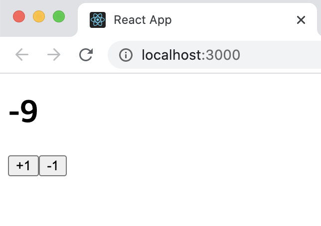
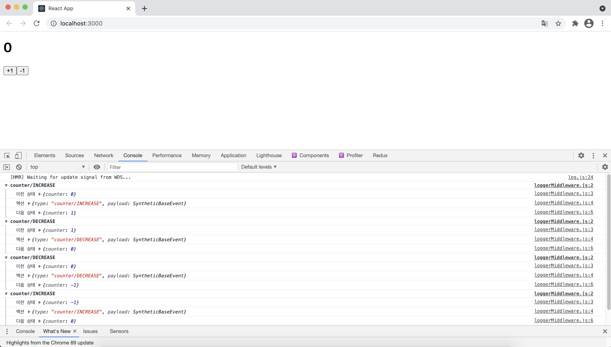
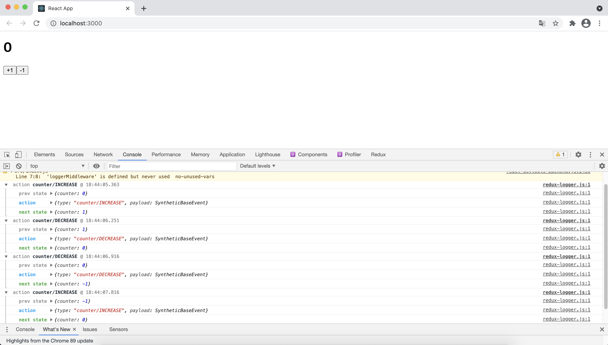
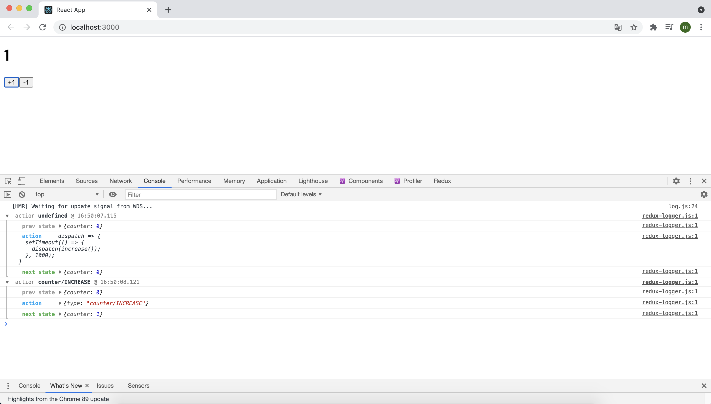
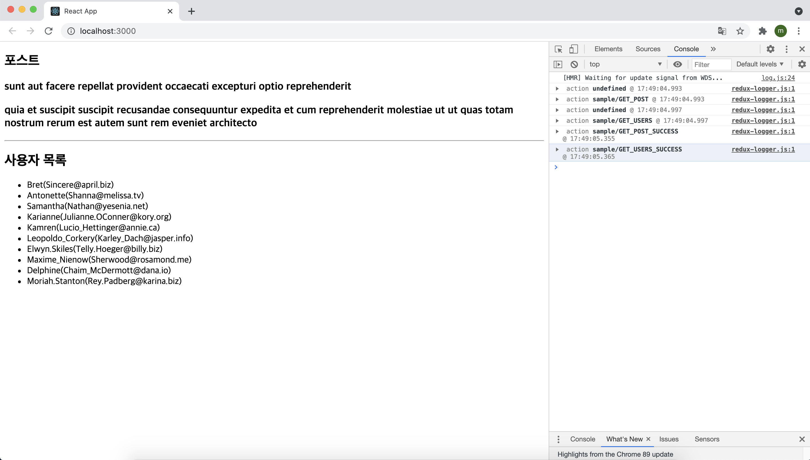
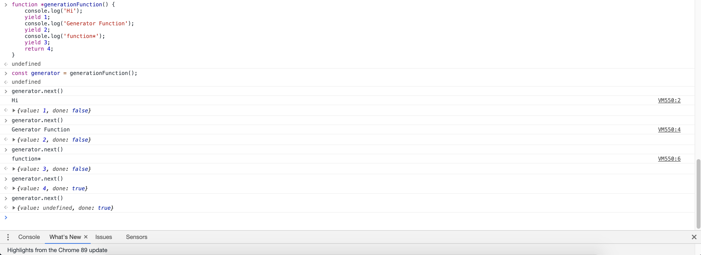
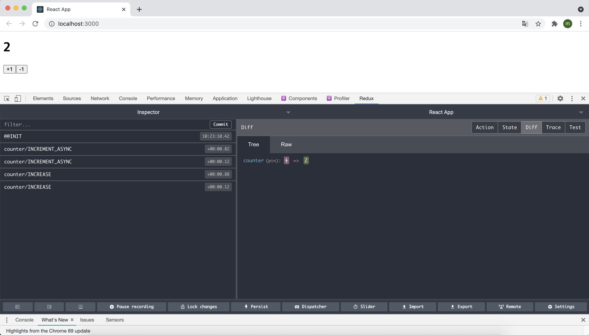
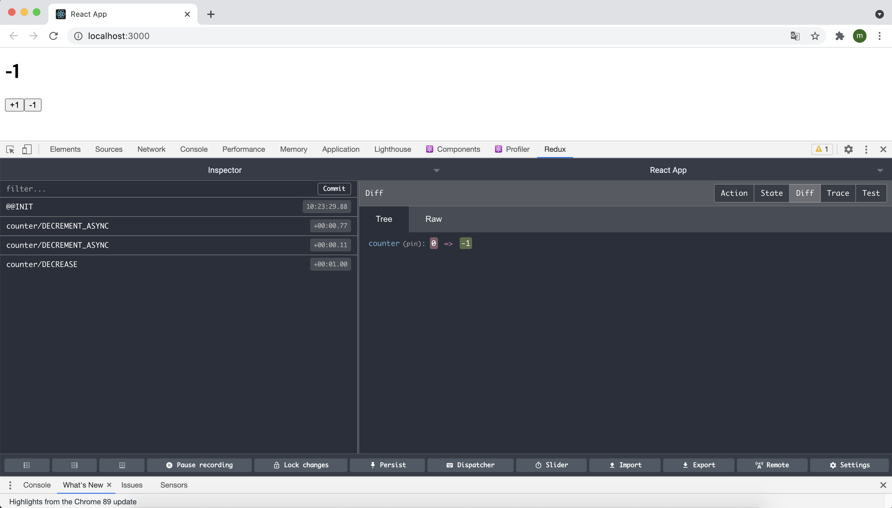

# 18장 리덕스 미들웨어를 통한 비동기 작업 관리

리액트 웹 애플리케이션에서 API 서버를 연동할 때는 API 요청에 대한 상태도 잘 관리해야 한다. 예를 들어 요청이 시작되었을 때는 로딩 중임을, 요청이 성공하거나 실패했을 떄는 로딩이 끝났음을 명시해야 한다. 요청이 성공하면 서버에서 받아 온 응답에 대한 상태를 관리하고, 요청이 실패하면 서버에서 반환하 에러에 대한 상태를 관리해야 한다,

리액트 프로젝트에서 리덕스를 사용하고 있으며 이러한 비동기 작업을 관리해야 한다면, '미들웨어(middleware)'를 사용하여 매우 효율적이고 편하게 상태 관리를 할 수 있다. 이 장에서는 리덕스 미들웨어의 개념을 이해하고, 미들웨어를 사용하여 비동기 작업을 처리하는 방법에 대해 알아보도록 하자.

이번 실습은 다음과 같은 흐름으로 진행된다.

> 작업 환경 준비 → 미들웨어 직접 만들기 → redux-logger 사용하기→ 미들웨어를 사용한 비동기 작업 관리

## 18.1 작업 환경 준비

먼저 리덕스를 적용한 간단한 리액트 프로젝트를 만들어보자. 이 프로젝트를 통해 리덕스 미들웨어에 대해 알아볼 예정이다.

` $ yarn create react-app learn-redux-middleware`

다음으로 리덕스를 사용하여 카운터를 구현하는데 이에 필요한 라이브러리들을 설치해준다.

` $ yarn add redux react-redux redux-actions`

이제 리덕스를 위한 counter 모듈과 루트 리듀서, CounterContainer 컴포넌트를 작성해 준다.

```jsx
// counter 모듈
import { createAction, handleActions } from "redux-actions";

const INCREASE = "counter/INCREASE";
const DECREASE = "counter/DECREASE";

export const increase = createAction(INCREASE);
export const decrease = createAction(DECREASE);

const initialState = 0; // 상태는 꼭 객체일 필요는 없다.

const counter = handleActions(
  {
    [INCREASE]: (state) => state + 1,
    [DECREASE]: (state) => state - 1,
  },
  initialState
);

export default counter;
```

```jsx
// 루트 리듀서(modules/index.js)
import { combineReducers } from "redux";
import counter from "./couter";

const rootReducer = combineReducers({
  counter,
});

export default rootReducer;
```

```jsx
// Provider 적용(src/index.js)
import React from "react";
import ReactDOM from "react-dom";
import App from "./App";
import { createStore } from "redux";
import { Provider } from "react-redux";
import rootReducer from "./modules";

const store = createStore(rootReducer);

ReactDOM.render(
  <Provider store={store}>
    <App />
  </Provider>,
  document.getElementById("root")
);
```

```jsx
// 카운터 컴포넌트(components/Counter.js)
import React from "react";

const Counter = ({ onIncrease, onDecrease, number }) => {
  return (
    <div>
      <h1>{number}</h1>
      <button onClick={onIncrease}>+1</button>
      <button onClick={onDecrease}>-1</button>
    </div>
  );
};

export default Counter;
```

```jsx
// CounterContainer 컴포넌트
import React from "react";
import { connect } from "react-redux";
import Counter from "../components/Counter";
import { increase, decrease } from "../modules/couter";

const CounterContainer = ({ number, increase, decrease }) => {
  return (
    <Counter number={number} onIncrease={increase} onDecrease={decrease} />
  );
};

export default connect(
  (state) => ({
    number: state.counter,
  }),
  { increase, decrease }
)(CounterContainer);
```

다 작성한 뒤  App 컴포넌트 안에서 CounterContainer를 렌더링시켜주면 아래와 같이 나오는 것을 확인해볼 수 있다. 



이제 모든 준비가 끝났고 본격적으로 리덕스 미들웨어를 배워보자!

## 18.2 미들웨어란?

리덕스 미들웨어는 **액션을 디스패치했을 때 리듀서에서 이를 처리하기에 앞서 사전에 지정된 작업들을 실행**한다. 즉, 미들웨어는 액션과 리듀서 사이의 중간자라고 볼 수 있다.


리듀서가 액션을 처리하기 전에 미들웨어가 할 수 있는 작업은 여러 가지가 있다.

- 전달받은 액션을 단순히 콘솔에 기록하기
- 전달받은 액션 정보를 기반으로 액션을 아예 취소
- 다른 종류의 액션을 추가로 디스패치

등 많은 작업들을 할 수가 있다.

#### 18.2.1 미들웨어 만들기

실제 프로젝트를 작업할 때 미들웨어를 직접 만들어서 사용할 일은 그리 많지 않다. 다른 개발자가 만들어 놓은 미들웨어를 사용하면 되기 때문이다. 하지만 **미들웨어가 어떻게 작동하는지 이해하려면 직접 만들어보는 것이 가장 효과적이다**. 간단한 미들웨어를 직접 만들어 보면 미들웨어의 작동 방식을 제대로 이해할 수 있다. 원하는 미들웨어를 찾을 수 없을 때는 상황에 따라 직접 만들거나 기존 미들웨어들을 커스터마이징하여 사용할 수도 있다.

여기서는 액션이 디스패치될 때마다 액션의 정보와 애견이 디스패치되기 전후의 상태를 콘솔에 보여 주는 로딩 미들웨어를 작성해보도록 하자.

Src 디렉터리에 lib 디렉터리를 생성하고, 그 안에 LoggerMiddleware.js 파일을 만든다.

```jsx
const loggerMiddleware = store => next => action => {
  // 미들웨어 기본 구조
};

export default loggerMiddleware;
```

위 코드에서 미들웨어의 구조를 볼 수 있다. 화살표 함수를 연달아서 사용했는데, 일반 function 키워드로 풀어서 쓰면 다음과 같다.

```jsx
const loggerMiddleware = function(store){
  return function(next) {
    return function(action) {
      // 미들웨어 기본 구조
		}
	}
}
```

**미들웨어는 결국 함수를 반환하는 함수를 반환하는 함수다.** 여기에 있는 함수에서 파라미터로 받아 오는 store는 리덕스 스토어 인스턴스를, action은 디스패치된 액션을 가리킨다. next 파라미터는 함수 형태이며, store.dispatch와 비슷한 역할을 한다. 하지만 큰 차이점이 있는데, **next(action)을 호출하면 그다음 처리해야 할 미들웨어에게 액션을 넘겨주고, 만약 그다음 미들웨어가 없다면 리듀서에게 액션을 넘겨준다는 것이다.**


미들웨어 내부에서 store.dispatch를 사용하면 첫 번째 미들웨어부터 다시 처리한다. 만약 미들웨어에서 next를 사용하지 않으면 액션이 리듀서에게 전달되지 않는다. 즉, 액션이 무시되는 것이다.

이제 미들웨어를 마저 구현해보자. 이번에 만들 미들웨어는 다음 정보를 순차적으로 콘솔에 보여준다.

1. 이전 상태
2. 액션 정보
3. 새로워진 상태

```jsx
const loggerMiddleware = (store) => (next) => (action) => {
  console.group(action && action.type); // 액션 타입으로 log를 그룹화함
  console.log('이전 상태', store.getState());
  console.log('액션', action);
  next(action); // 다음 미들웨어 혹은 리듀서에게 전달
  console.log('다음 상태', store.getState()); //업데이트된 상태
  console.groupEnd(); // 그룹 끝
};

export default loggerMiddleware;
```

이제 만든 미들웨어를 스토어에 적용해 준다. **미들웨어는 스토어를 생성하는 과정에서 적용한다.**

```jsx
import React from "react";
import ReactDOM from "react-dom";
import App from "./App";
import { applyMiddleware, createStore } from "redux";
import { Provider } from "react-redux";
import rootReducer from "./modules";
import loggerMiddleware from "./lib/loggerMiddleware";

const store = createStore(rootReducer, applyMiddleware(loggerMiddleware));

ReactDOM.render(
  <Provider store={store}>
    <App />
  </Provider>,
  document.getElementById("root")
);
```

이제 개발자 도구에서 콘솔을 열고 카운터의 버튼을 눌러보면 아래와 같이 액션 정보가 업데이트 되기 전후의 상태가 나타나는 것을 확인할 수 있다.



미들웨어에서는 여러 종류의 작업을 처리할 수 있다. 

- 특정 조건에 따라 액션을 무시하게 할 수도 있고
- 특정 조건에 따라 액션 정보를 가로채서 변경한 후 리듀서에게 전달해 줄 수도 있다.
- 아니면 특정 액션에 기반하여 새로운 액션을 여러 번 디스패치할 수도 있다.

#### 18.2.2 redux-logger 사용하기

이번에는 오픈 소스 커뮤니티에 이미 올라와 있는 redux-logger 미들웨어를 설치하고 사용해보자. 방금 만든 loggerMiddleware보다 훨씬 더 잘 만들어진 라이브러리이며, 브라우저 콘솔에 나타나는 형식도 훨씬 깔끔하다.

우선 명령어를 사용하여 redux-logger를 설치해준다.

` $ yarn add redux-logger`

그런 다음 index.js를 다음과 같이 수정한다.

```jsx
import React from "react";
import ReactDOM from "react-dom";
import App from "./App";
import { applyMiddleware, createStore } from "redux";
import { Provider } from "react-redux";
import rootReducer from "./modules";
import loggerMiddleware from "./lib/loggerMiddleware";
import { createLogger } from "redux-logger";

const logger = createLogger();
const store = createStore(rootReducer, applyMiddleware(logger));

ReactDOM.render(
  <Provider store={store}>
    <App />
  </Provider>,
  document.getElementById("root")
);
```

이제 브라우저를 열어 카운터 버튼을 다시 눌러보면 아래처럼 콘솔에 색상도 입혀지고, 액션 디스패치 시간도 나타난다. 리덕스에서 미들웨어를 사용할 때는 이렇게 이미 완성된 미들웨어를 라이브러리로 설치해서 사용하는 경우가 많다.



## 18.3 비동기 작업을 처리하는 미들웨어 사용

이제 오픈 소스 커뮤니티에 공개된 미들웨어를 사용하여 리덕스를 사용하고 있는 프로젝트에서 비동기 작업을 더욱 효율적으로 관리해보자.

비동기 작업을 처리할 때 도움을 주는 미들웨어는 정말 다양하다. 여기서 다룰 미들웨어는 다음과 같다.

- redux-thunk : 비동기 작업을 처리할 때 가장 많이 사용하는 미들웨어다. 객체가 아닌 함수 형태의 액션을 디스패치할 수 있게 해준다.
- redux-saga : 다음으로 가장 많이 사용되는 비동기 작업 관련 미들웨어 라이브러리다. 특정 액션이 디스패치 되었을 때 정해진 로직에 따라 다른 액션을 디스패치 시키는 규칙을 작성하여 비동기 작업을 처리할 수 있게 해준다.

#### 18.3.1 redux-thunk

redux-thunk는 리덕스를 사용하는 프로젝트에서 비동기 작업을 처리할 때 가장 기본적으로 사용하는 미들웨어다. 리덕스의 창시자인 댄 아브라모프가 만들었으며, 리덕스 공식 메뉴얼에서도 이 미들웨어를 사용하여 비동기 작업을 다루는 예시를 보여준다.

**Thunk란?**

Thunk는 특정 작업을 나중에 할 수 있도록 미루기 위해 함수 형태로 감싼 것을 의미한다. 예를 들어 주어진 파라미터에 1을 더하는 함수를 만들고 싶다면 다음과 같이 작성할 것이다.

```jsx
const addOne = x => x + 1;
addOne(1); // 2
```

이 코드를 실행하면 addOne을 했을 때 바로 1 + 1이 연산된다. 그런데 이 연산 작업을 나중에 하도록 미루고 싶다면 어떻게 해야 할까?

```jsx
const addOne = x => x + 1;
function addOneThunk(x) {
  const thunk = () => addOne(x);
  return thunk;
}

const fn = addOneThunk(1);
setTimeout(() => {
  const value = fn();// fn이 실행되는 시점에 연산
  console.log(value);
}, 1000);
```

이렇게 하면 특정 작업을 나중에 하도록 미룰 수 있다.

만약 addOneThunk를 화살표 함수로만 사용한다면 다음과 같이 구현할 수 있다.

```jsx
const addOne = x => x + 1;
const addOneThunk = (x) => () => addOne(x);

const fn = addOneThunk(1);
setTimeout(() => {
  const value = fn();// fn이 실행되는 시점에 연산
  console.log(value);
}, 1000);
```

redux-thunk 라이브러리를 사용하면 thunk 함수를 만들어서 디스패치할 수 있다. 그러면 리덕스 미들웨어가 그 함수를 전달받아 store의 dispatch와 getState를 파라미터로 넣어서 호출해 준다. 다음은 redux-thunk에서 사용할 수 있는 예시다.

```jsx
const sampleThunk = () => (dispatch, getState) => {
  // 현재 상태를 참조할 수 있고
  // 새 액션을 디스패할 수도 있다.
};
```

**미들웨어 적용하기**

redux-thunk 미들웨어를 설치하고 프로젝트에 적용해 보자.

` $ yarn add redux-thunk`

명령어로 라이브러리를 설치해 주고 스토어를 만들 때 redux-thunk를 적용하자.

```jsx
import React from "react";
import ReactDOM from "react-dom";
import App from "./App";
import { applyMiddleware, createStore } from "redux";
import { Provider } from "react-redux";
import rootReducer from "./modules";
import { createLogger } from "redux-logger";
import ReduxThunk from "redux-thunk";

const logger = createLogger();
const store = createStore(rootReducer, applyMiddleware(logger, ReduxThunk));

ReactDOM.render(
  <Provider store={store}>
    <App />
  </Provider>,
  document.getElementById("root")
);
```

**Thunk 생성 함수 만들기**

redux-thunk는 액션 생성 함수에서 일반 액션 객체를 반환하는 대신에 함수를 반환한다. increaseAsync와 decreaseAsync 함수를 만들어 카운터 값을 비동기적으로 한번 변경해보자.

```jsx
import { createAction, handleActions } from "redux-actions";

const INCREASE = "counter/INCREASE";
const DECREASE = "counter/DECREASE";

export const increase = createAction(INCREASE);
export const decrease = createAction(DECREASE);

export const increaseAsync = () => (dispatch) => {
  setTimeout(() => {
    dispatch(increase());
  }, 1000);
};

export const decreaseAsync = () => (dispatch) => {
  setTimeout(() => {
    dispatch(decrease());
  }, 1000);
};

const initialState = 0; // 상태는 꼭 객체일 필요는 없다.

const counter = handleActions(
  {
    [INCREASE]: (state) => state + 1,
    [DECREASE]: (state) => state - 1,
  },
  initialState
);

export default counter;
```

이와 같이 리덕스 모듈을 수정해 주고 CounterContainer 컴포넌트에서 호출하던 액션 생성 함수도 아래와 같이 변경해 준다.

```jsx
import React from "react";
import { connect } from "react-redux";
import Counter from "../components/Counter";
import { increaseAsync, decreaseAsync } from "../modules/couter";

const CounterContainer = ({ number, increaseAsync, decreaseAsync }) => {
  return (
    <Counter
      number={number}
      onIncrease={increaseAsync}
      onDecrease={decreaseAsync}
    />
  );
};

export default connect(
  (state) => ({
    number: state.counter,
  }),
  { increaseAsync, decreaseAsync }
)(CounterContainer);
```

저장 후 출력해 보면 아래의 개발자 도구의 액션 기록에서 보이듯이 버튼을 누르고 1초가 지난 후에 숫자가 증가하는 것을 확인할 수 있다.  



처음 디스패치 되는 액션은 함수 형태이고 두 번째 액션은 객체 형태다.

**웹 요청 비동기 작업 처리하기**

이번에는 thunk의 속성을 활용하여 웹 요청 비동기 작업을 처리하는 방법에 대해 알아보자. 웹 요청을 연습하기 위해 JSONPlaceholder에서 제공하는 가짜 API를 사용해보자. 사용할 API는 다음과 같다.

>  #포스트 읽기(:id는 1~100 사이 숫자)
>
> GET https://jsonplaceholder.typicode.com/posts/:id
>
> #모든 사용자 정보 불러오기
>
> GET https://jsonplaceholder.typicode.com/users

API를 호출할 때는 주로 Promise 기반 웹 클라이언트인 axios를 사용한다. ` $ yarn add axios` 명령어를 통해 해당라이브 러리를 설치해 준다.

이제 API를 모두 함수화 하자. 각 API를 호출하는 함수를 따로 작성하면, 나중에 사용할 때 가독성도 좋고 유지 보수도 쉬워진다. 다른 파일에서 불러와 사용할 수 있도록 export를 사용하여 내보내 주자.

```jsx
import axios from "axios";

export const getPost = (id) =>
  axios.get(`https://jsonplaceholder.typicode.com/posts/${id}`);

export const getUsers = (id) =>
  axios.get(` https://jsonplaceholder.typicode.com/users`);
```

이제 새로운 리듀서를 만들 차례다. 위 API를 사용하여 데이터를 받아와서 상태를 관리할 sample이라는 리듀서를 생성해보자.

```jsx
import { handleActions } from "redux-actions";
import * as api from "../lib/api";

// 액션 타입을 선언한다.
// 한 요청당 세 개를 만들어야 한다.

const GET_POST = "sample/GET_POST";
const GET_POST_SUCCESS = "sample/GET_POST_SUCCESS";
const GET_POST_FAILURE = "sample/GET_POST_FAILURE";

const GET_USERS = "sample/GET_USERS";
const GET_USERS_SUCCESS = "sample/GET_USERS_SUCCESS";
const GET_USERS_FAILURE = "sample/GET_USERS_FAILURE";

// thunk 함수를 생성한다.
// thunk 함수 내부에서는 시작할 때, 성공했을 때, 실패했을 때 다른 액션을 디스패치한다.

export const getPost = (id) => async (dispatch) => {
  dispatch({ type: GET_POST }); // 요청을 시작한 것을 알림
  try {
    const response = await api.getPost(id);
    dispatch({ type: GET_POST_SUCCESS, payload: response.data }); // 요청 성공
  } catch (e) {
    dispatch({ type: GET_POST_FAILURE, payload: e, error: true }); // 에러 발생
    throw e; // 나중에 컴포넌트단에서 에러를 조회할 수 있게 해줌
  }
};

export const getUsers = (id) => async (dispatch) => {
  dispatch({ type: GET_USERS }); // 요청을 시작한 것을 알림
  try {
    const response = await api.getUsers(id);
    dispatch({ type: GET_USERS_SUCCESS, payload: response.data }); // 요청 성공
  } catch (e) {
    dispatch({ type: GET_USERS_FAILURE, payload: e, error: true }); // 에러 발생
    throw e; // 나중에 컴포넌트단에서 에러를 조회할 수 있게 해줌
  }
};

// 초기 상태를 선언한다.
// 요청의 로딩 중 상태는 loading이라는 객체에서 관리한다.

const initialState = {
  loading: {
    GET_POST: false,
    GET_USERS: false,
  },
  post: null,
  users: null,
};

const sample = handleActions(
  {
    [GET_POST]: (state) => ({
      ...state,
      loading: {
        ...state.loading,
        GET_POST: true, // 요청 시작
      },
    }),
    [GET_POST_SUCCESS]: (state, action) => ({
      ...state,
      loading: {
        ...state.loading,
        GET_POST: false, // 요청 완료
      },
      post: action.payload,
    }),
    [GET_POST_FAILURE]: (state, action) => ({
      ...state,
      loading: {
        ...state.loading,
        GET_POST: false, // 요청 완료
      },
    }),
    [GET_USERS]: (state) => ({
      ...state,
      loading: {
        ...state.loading,
        GET_USERS: true, // 요청 시작
      },
    }),
    [GET_USERS_SUCCESS]: (state, action) => ({
      ...state,
      loading: {
        ...state.loading,
        GET_USERS: false, // 요청 완료
      },
      post: action.payload,
    }),
    [GET_USERS_FAILURE]: (state, action) => ({
      ...state,
      loading: {
        ...state.loading,
        GET_USERS: false, // 요청 완료
      },
    }),
  },
  initialState
);

export default sample;
```

코드에서 반복되는 로직이 꽤나 많은 것을 확인할 수 있다. 우선 컨테이너 컴포넌트를 사용하여 데이터 요청을 성공적으로 처리하고, 나중에 반복되는 로직을 따로 분리하여 재사용하는 형태로 코드를 리팩토링해보도록 하고 다 작성한 리듀서를 루트 리듀서에 포함시키자.

```jsx
import { combineReducers } from "redux";
import counter from "./couter";
import sample from "./sample";

const rootReducer = combineReducers({
  counter,
  sample,
});

export default rootReducer;
```

우선 데이터를 렌더링할 프레젠테이셔널 컴포넌트부터 작성해준다. 이 컴포넌트를 작성하려면 **먼저 API를 통해 전달받은 데이터의 형식이 어떤 구조인지 파악해야 한다.**

내가 받게 될 데이터의 형태는 아래와 같다.

> // post
>
> {
>   "userId": 3,
>   "id": 24,
>   "title": "autem hic labore sunt dolores incidunt",
>   "body": "enim et ex nulla\nomnis voluptas quia qui\nvoluptatem consequatur numquam aliquam sunt\ntotam recusandae id dignissimos aut sed asperiores deserunt"
> }
>
> // users
>
>   {
>     "id": 1,
>     "name": "Leanne Graham",
>     "username": "Bret",
>     "email": "Sincere@april.biz",
>     "address": {
>       "street": "Kulas Light",
>       "suite": "Apt. 556",
>       "city": "Gwenborough",
>       "zipcode": "92998-3874",
>       "geo": {
>         "lat": "-37.3159",
>         "lng": "81.1496"
>       }
>     },
>     "phone": "1-770-736-8031 x56442",
>     "website": "hildegard.org",
>     "company": {
>       "name": "Romaguera-Crona",
>       "catchPhrase": "Multi-layered client-server neural-net",
>       "bs": "harness real-time e-markets"
>     }
>   },
>   {
>     "id": 2,
>     "name": "Ervin Howell",
>     "username": "Antonette",
>     "email": "Shanna@melissa.tv",
>     "address": {
>       "street": "Victor Plains",
>       "suite": "Suite 879",
>       "city": "Wisokyburgh",
>       "zipcode": "90566-7771",
>       "geo": {
>         "lat": "-43.9509",
>         "lng": "-34.4618"
>       }
>     },
>     "phone": "010-692-6593 x09125",
>     "website": "anastasia.net",
>     "company": {
>       "name": "Deckow-Crist",
>       "catchPhrase": "Proactive didactic contingency",
>       "bs": "synergize scalable supply-chains"
>     }
> },
>
>  (...) 
>
> ]

이번에 만들 컴포넌트는 post의 경우 title과 body만 보여 주고, user의 경우 username과 email만 보여줄 예정이다.

Sample 컴포넌트를 아래와 같이 작성해준다.

```jsx
import React from "react";

const Sample = ({ loadingPost, loadingUsers, post, users }) => {
  return (
    <div>
      <section>
        <h1>포스트</h1>
        {loadingPost && "로딩 중...."}
        {!loadingPost && post && (
          <div>
            <h3>{post.title}</h3>
            <h3>{post.body}</h3>
          </div>
        )}
      </section>
      <hr />
      <section>
        <h1>사용자 목록</h1>
        {loadingUsers && "로딩 중...."}
        {!loadingUsers && users && (
          <ul>
            {users.map((user) => (
              <li key={user.id}>
                {user.username}({user.email})
              </li>
            ))}
          </ul>
        )}
      </section>
    </div>
  );
};

export default Sample;
```

**데이터를 불러와서 렌더링해 줄 때는 유효성 검사를 해 주는 것이 중요하다.** 예를 들어 post && 를 사용하면 post 객체가 유효할 때만 그 내부의 post.title 혹은 post.body 값을 보여 준다. 만약 데이터가 없는 상태라면 post.title을 조회하려고 할 때 자바스크립트 오류가 발생하니 반드시 유효성 검사를 해주어야 한다.

users도 마찬가지로 데이터가 배열 형태로 들어올 것을 기대하고 map 함수를 사용하고 있다. 하지만 유효성 검사를 하지 않으면 null 값에 대해 map 함수를 호출하고, 결국 map 함수가 존재하지 않아 오류가 발생한다.

이제 컨테이너 컴포넌트를 만들어 보자.

```jsx
import React from "react";
import { connect } from "react-redux";
import Sample from "../components/Sample";
import { getPost, getUsers } from "../modules/sample";

const { useEffect } = React;
const SampleContainer = ({
  getPost,
  getUsers,
  post,
  users,
  loadingPost,
  loadingUsers,
}) => {
  useEffect(() => {
    getPost(1);
    getUsers(1);
  }, [getPost, getUsers]);
  return (
    <Sample
      post={post}
      users={users}
      loadingPost={loadingPost}
      loadingUsers={loadingUsers}
    />
  );
};

export default connect(
  ({ sample }) => ({
    post: sample.post,
    users: sample.users,
    loadingPost: sample.loadingPost.GET_POST,
    loadingUsers: sample.loadingUsers.GET_USERS,
  }),
  {
    getPost,
    getUsers,
  }
)(SampleContainer);
```

이제 App 컴포넌트에서 CounterContainer 대신 SampleContainer를 렌더링 한 다음 브라우저를 열어 데이터가 잘 로딩되었는지, 액션이 어떤 순서로 발생하는지를 확인할 수 있다.



**리팩토링**

API를 요청해야 할 때마다 17줄 정도 되는 thunk 함수를 작성하는 것과 로딩 상태를 리듀서에서 관리하는 작업은 귀찮을 뿐 아니라 코드도 길어지게 만든다. 그러므로 반복되는 로직을 따로 분리하여 코드의 양을 줄여보자.

Thunk 함수를 처리해주는 파일 createRequestThunk.js 를 만들어 아래와 같이 작성해 준다.

```jsx
export default function createRequestThunk(type, request) {
  // 성공 및 실패 액션 타입을 정의
  const SUCCESS = `${type}_SUCCESS`;
  const FAILURE = `${type}_FAILURE`;

  return (parmas) => async (dispatch) => {
    dispatch({ type }); // 시작됨
    try {
      const response = await request(params);
      dispatch({
        type: SUCCESS,
        payload: response.data,
      }); // 성공
    } catch (e) {
      dispatch({
        type: FAILURE,
        payload: e,
        error: true,
      });
      throw e;
    }
  };
}

// 사용법 : createRequestThunk('GET_USERS', api.getUsers);
```

액션 타입과 API를 요청하는 함수를 파라미터로 넣어 주면 나머지 작업을 대신 처리해 준다. 이 함수를 사용해서 기존의 thunk 함수의 코드를 리팩토링 해보자.

```jsx
import { handleActions } from "redux-actions";
import * as api from "../lib/api";
import createRequestThunk from "../lib/createRequestThunk";

// 액션 타입을 선언한다.
// 한 요청당 세 개를 만들어야 한다.

const GET_POST = "sample/GET_POST";
const GET_POST_SUCCESS = "sample/GET_POST_SUCCESS";
const GET_POST_FAILURE = "sample/GET_POST_FAILURE";

const GET_USERS = "sample/GET_USERS";
const GET_USERS_SUCCESS = "sample/GET_USERS_SUCCESS";
const GET_USERS_FAILURE = "sample/GET_USERS_FAILURE";

// thunk 함수를 생성한다.
// thunk 함수 내부에서는 시작할 때, 성공했을 때, 실패했을 때 다른 액션을 디스패치한다.

export const getPost = createRequestThunk(GET_POST, api.getPost);

export const getUsers = createRequestThunk(GET_USERS, api.getUsers);

// 초기 상태를 선언한다.
// 요청의 로딩 중 상태는 loading이라는 객체에서 관리한다.

const initialState = {
  loading: {
    GET_POST: false,
    GET_USERS: false,
  },
  post: null,
  users: null,
};

const sample = handleActions(
  {
    (...)
  }
);

export default sample;
```

리팩토링 후 실행시켜보면 이전과 똑같이 작동하는 것을 확인할 수 있다. 

이번에는 요청의 로딩 상태를 관리하느 작업을 개선해보자. 기존에는 리듀서 내부에서 각 요청에 관련된 액션이 디스패치될 때마다 로딩 상태를 변경해줬다. 이 작업을 로딩 상태만 관리하는 리덕스 모듈을 따로 생성하여 처리해보자.

```jsx
import { createAction, handleActions } from "redux-actions";

const START_LOADING = "loading/START_LOADING";
const FINISH_LOADING = "loading/FINISH_LOADING";

/* 
요청을 위한 액션 타입을 payload로 설정한다. (예: "sample/GET_POST")
*/

export const startLoading = createAction(
  START_LOADING,
  (requestType) => requestType
);

export const finishLoading = createAction(
  FINISH_LOADING,
  (requestType) => requestType
);

const initialState = {};

const loading = handleActions(
  {
    [START_LOADING]: (state, action) => ({
      ...state,
      [action.payload]: true,
    }),
    [FINISH_LOADING]: (state, action) => ({
      ...state,
      [action.payload]: false,
    }),
  },
  initialState
);

export default loading;
```

> 이것은 요청이 시작될 때 디스패치할 액션이다.
>
> {
>
> ​	type: 'loading/START_LOADING',
>
> ​	payload: 'sample/GET_POST'
>
> }

위 액션이 디스패치되면 loading 리듀서가 관리하고 있는 상태에서 sample/GET_POST 값을 true로 설정해 준다. 만약 기존 상태에 sample/GET_POST 필드가 존재하지 않으면 새로 값을 설정해 준다. 그리고 요청이 끝나면 다음 액션을 디스패치 해야 한다.

> {
>
> ​	type: 'loading/FINISH_LOADING',
>
> ​	payload: 'sample/GET_POST'
>
> }

그러면 기존에 true로 설정했던 값을 다시 false로 전환해 준다. 이제 loading 리듀서를 루트 리듀서에 포함시키고

loading 리덕스 모듈에서 만든 액션 생성 함수는 앞에서 만든 createRequestThunk에서 사용해주자.

```jsx
import { startLoading, finishLoading } from "../modules/loading";

export default function createRequestThunk(type, request) {
  // 성공 및 실패 액션 타입을 정의
  const SUCCESS = `${type}_SUCCESS`;
  const FAILURE = `${type}_FAILURE`;

  return (params) => async (dispatch) => {
    dispatch({ type }); // 시작됨
    dispatch(startLoading(type));
    try {
      const response = await request(params);
      dispatch({
        type: SUCCESS,
        payload: response.data,
      }); // 성공
      dispatch(finishLoading(type));
    } catch (e) {
      dispatch({
        type: FAILURE,
        payload: e,
        error: true,
      }); // 에러 발생
      dispatch(startLoading(type));
      throw e;
    }
  };
}

// 사용법 : createRequestThunk('GET_USERS', api.getUsers);
```

그러면 이제 SampleContainer에서 로딩 상태를 다음과 같이 조회할 수 있다.

```jsx
import React from "react";
import { connect } from "react-redux";
import Sample from "../components/Sample";
import { getPost, getUsers } from "../modules/sample";

const { useEffect } = React;
const SampleContainer = ({
  getPost,
  getUsers,
  post,
  users,
  loadingPost,
  loadingUsers,
}) => {
  useEffect(() => {
    getPost(1);
    getUsers(1);
  }, [getPost, getUsers]);
  return (
    <Sample
      post={post}
      users={users}
      loadingPost={loadingPost}
      loadingUsers={loadingUsers}
    />
  );
};

export default connect(
  ({ sample, loading }) => ({
    post: sample.post,
    users: sample.users,
    loadingPost: loading["sample/GET_POST"],
    loadingUsers: loading["sample/GET_USERS"],
  }),
  {
    getPost,
    getUsers,
  }
)(SampleContainer);
```

이제 sample 리듀서에서 불필요한 코드를 지우고 실행시켜보자.

```jsx
import { handleActions } from "redux-actions";
import * as api from "../lib/api";
import createRequestThunk from "../lib/createRequestThunk";

// 액션 타입을 선언한다.
// 한 요청당 세 개를 만들어야 한다.

const GET_POST = "sample/GET_POST";
const GET_POST_SUCCESS = "sample/GET_POST_SUCCESS";
// const GET_POST_FAILURE = "sample/GET_POST_FAILURE";

const GET_USERS = "sample/GET_USERS";
const GET_USERS_SUCCESS = "sample/GET_USERS_SUCCESS";
// const GET_USERS_FAILURE = "sample/GET_USERS_FAILURE";

// thunk 함수를 생성한다.
// thunk 함수 내부에서는 시작할 때, 성공했을 때, 실패했을 때 다른 액션을 디스패치한다.

export const getPost = createRequestThunk(GET_POST, api.getPost);

export const getUsers = createRequestThunk(GET_USERS, api.getUsers);

// 초기 상태를 선언한다.
// 요청의 로딩 중 상태는 loading이라는 객체에서 관리한다.

const initialState = {
  loading: {
    GET_POST: false,
    GET_USERS: false,
  },
  post: null,
  users: null,
};

const sample = handleActions(
  {
    [GET_POST_SUCCESS]: (state, action) => ({
      ...state,
      post: action.payload,
    }),
    [GET_USERS_SUCCESS]: (state, action) => ({
      ...state,
      users: action.payload,
    }),
  },
  initialState
);

export default sample;
```

문제없이 실행되는 것을 확인할 수 있다.

이렇게 불필요하고 반복적인 코드들을 지움으로써 코드가 훨씬 깔끔해졌다. 이제 sample 리듀서에서는 로딩 중에 대한 상태를 관리할 필요가 없다. 단지 성공했을 때의 케이스만 잘 관리해 주면 된다. 추가로 실패했을 때의 케이스를 관리하고 싶다면 _FAILURE가 붙은 액션을 리듀서에서 처리해 주면 된다. 혹은 컨테이너 컴포넌트에서 try/catch 구문을 사용하여 에러 값을 조회할 수도 있다.

```jsx
useEffect(() => {
    // useEffect에 파라미터로 넣는 함수는 async로 할 수 없기 때문에
    // 그 내부에서 async 함수를 선언하고 호출해 준다.
    try {
      getPost(1);
      getUsers(1);
    } catch (e) {
      console.log(e); // 에러 조회
    }
  }, [getPost, getUsers]);
```

redux-thunk를 처음 쓸 때는 비록 작성해야 할 코드가 많아서 불편할 수 있지만, 유용한 함수와 리듀서를 만들어서 상태를 관리한다면 매우 깔끔한 코드로 기능을 구현할 수 있다.

#### redux-saga

이번에는 redux-saga를 통해 비동기 작업을 관리하는 방법을 알아보도록 하자.

redux-thunk **함수 형태의 액션을 디스패치하여 미들웨어에서 해당 함수에 스토어의 dispatch 와 getState를 파라미터로 넣어서 사용하는 원리다.** 그래서 구현한 thunk 함수 내부에서 원하는 API 요청도 하고, 다른 액션을 디스패치하거나 현재 상태를 조회하기도 했다. 대부분의 경우에 이전 절에서 배운 redux-thunk로도 충분히 구현할 수 있다.

이번에 배울 redux-saga는 좀 더 까다로운 상황에서 유용하다. 예를 들어 다음과 같은 상황에서는 redux-saga를 사용하는 것이 유리하다.

- 기존 요청을 취소 처리해야 할 때(불필요한 중복 요청 방지)
- 특정 액션이 발생했을 때 다른 액션을 발생시키거나, API 요청 등 리덕스와 관계없는 코드를 실행할 때
- 웹소켓을 사용할 때 
- API 요청 실패 시 재요청해야 할 때

**제너레이터 함수 이해하기**

Redux-saga에서는 ES6의 제너레이터 함수라는 문법을 사용한다. 보통 일반적인 상황에서는 많이 사용되지 않기 때문에 초반에 진입 장벽이 있을 수 있다. 우선 제네레이터 함수 문법에 대해 알아보자. 이 문법의 핵심 기능은 함수를 작성할 때 함수를 특정 구간에 멈춰 놓을 수도 있고, 원할 때 다시 돌아가게 할 수도 있다는 것이다.

다음과 같은 함수가 있다고 가정해보자.

```jsx
function weirdFunction() {
	return 1;
  return 2;
  return 3;
  return 4;
  return 5;
}
```

하나의 함수에서 값을 여러 개 반환하는 것은 불가능하기 때문에 이 코드는 오류가 있는 코드다. 정확히는 항상 맨 위의 값인 1을 반환하게 된다.

하지만 제너레이터 함수를 사용하면 함수에서 값을 순차적으로 반환할 수 있다. 심지어 함수의 흐름을 도중에 멈춰 놓았다가 다시 이어서 진행시킬 수도 있다.

다음은 개발자 도구 콘솔에서 제너테이터 함수를 실행시켜 본 결과다.



제너레이터 함수를 만들 때는 **function * **키워드를 사용한다. 함수를 작성한 뒤 제너레이터 함수를 호출하고 generator.next()를 입력하면 위와 같은 결과들이 출력되는 것을 확인할 수 있다.

제너레이터가 처음 만들어지면 함수의 흐름은 멈춰 있는 상태다. next()가 호출되면 다음 yield가 있는 곳까지 호출하고 다시 함수가 멈춘다. 제너레이터 함수를 사용하면 함수를 도중에 멈출 수도 있고, 순차적으로 여러 값을 반환시킬 수도 있다. next 함수에 파라미터를 넣으면 제너레이터 함수에서 yield를 사용하여 해당 값을 조회할 수도 있다.

redux-saga는 제너레이터 함수 문법을 기반으로 비동기 작업을 관리해 준다. 좀 더 이해하기 쉽게 설명하면, redux-saga는 우리가 디스패치하는 액션을 모니터링해서 그에 따라 필요한 작업을 따로 수행할 수 있는 미들웨어다.

```jsx
function *watchGenerator() {
	console.log('모니터링 중...');
  let prevAction = null;
  while(true) {
		const action = yield;
    console.log('이전 액션: ', prevAction);
    prevAction = action;
    if(action.type === 'HELLO') {
			cnosole.log('안녕하세요!');
    }
  }
}

const watch = watchGenerator();

watch.next();
// 모니터링 중...
// {value: undefined, done: false}
watch.next({type: 'TEST'});
// 이전 액션: null
// {value: undefined, done: false}
watch.next({type: 'HELLO'});
// 이전 액션: {type: 'TEST'}
// 안녕하세요!
// {value: undefined, done: false}
```

redux-saga는 위와 비슷한 원리로 작동한다. 제너레이터 함수의 작동 방식만 기본적으로 파악하고 있으면, redux-saga에서 제공하는 여러 유용한 유틸 함수를 사용하여 액션을 쉽게 처리할 수 있다.

**비동기 카운터 만들기**

`$ yarn add redux-saga` 명령어를 통해 라이브러리를 설치하고 counter 리덕스 모듈을 열어서 기존 thunk 함수를 제거하고, INCREMENT_ASYNC와 DECREMENT_ASYNC라는 액션 타입을 선언해 준다.

```jsx
import { createAction, handleActions } from "redux-actions";
import { delay, put, takeEvery, takeLatest } from "redux-saga/effects";

const INCREASE = "counter/INCREASE";
const DECREASE = "counter/DECREASE";

const INCREMENT_ASYNC = "counter/INCREMENT_ASYNC";
const DECREMENT_ASYNC = "counter/DECREMENT_ASYNC";

export const increase = createAction(INCREASE);
export const decrease = createAction(DECREASE);

// 마우스 클릭 이벤트가 payload 안에 들어가지 않도록
// () => undefined를 두 번째 파라미터로 넣어 준다.
export const increaseAsync = createAction(INCREMENT_ASYNC, () => undefined);
export const decreaseAsync = createAction(DECREMENT_ASYNC, () => undefined);

function* increaseSaga() {
  yield delay(1000); // 1초를 기다린다.
  yield put(increase()); // 특정 액션을 디스패치한다.
}

function* decreaseSaga() {
  yield delay(1000); // 1초를 기다리고
  yield put(decrease()); // 특정 액션 디스패치
}

export function* counterSaga() {
  // takeEvery는 들어오는 모든 액션에 대해 특정 작업을 처리해 준다.
  yield takeEvery(INCREMENT_ASYNC, increaseSaga);
  // takeLatest는 기존에 진행 중이던 작업이 있다면 취소 처리하고
  // 가장 마지막으로 실행된 작업만 수행한다.
  yield takeLatest(DECREMENT_ASYNC, decreaseSaga);
}

const initialState = 0; // 상태는 꼭 객체일 필요는 없다.

const counter = handleActions(
  {
    [INCREASE]: (state) => state + 1,
    [DECREASE]: (state) => state - 1,
  },
  initialState
);

export default counter;
```

그리고 추후 다른 리듀서에서도 사가를 만들어 등록할 것이기 때문에 루트 리듀서를 만들었던 것처럼 루스 사가를 만들어 주어야 한다.

 ```jsx
import { combineReducers } from "redux";
import counter, { counterSaga } from "./couter";
import sample from "./sample";
import loading from "./loading";
import { all } from "redux-saga/effects";

const rootReducer = combineReducers({
  counter,
  sample,
  loading,
});

export function* rootSage() {
  // all 함수는 여러 사가를 합쳐 주는 역할을 한다.
  yield all([counterSaga()]);
}

export default rootReducer;
 ```

이제 스토어에 redux-saga 미들웨어를 적용해 주자.

```jsx
import React from "react";
import ReactDOM from "react-dom";
import App from "./App";
import { applyMiddleware, createStore } from "redux";
import { Provider } from "react-redux";
import rootReducer, { rootSaga } from "./modules";
import { createLogger } from "redux-logger";
import ReduxThunk from "redux-thunk";
import creaseSagaMiddleware from "redux-saga";

const logger = createLogger();
const sagaMiddleware = creaseSagaMiddleware();
const store = createStore(
  rootReducer,
  applyMiddleware(logger, ReduxThunk, sagaMiddleware)
);
sagaMiddleware.run(rootSaga);

ReactDOM.render(
  <Provider store={store}>
    <App />
  </Provider>,
  document.getElementById("root")
);
```

스토어에 미들웨어를 적용했다면 CounterContainer 컴포넌트를 App 컴포넌트에 렌더링하여 잘 작동하는지 확인해 보자. Counter 리덕스 모듈이 변경되기는 했지만, 컨테이너 컴포넌트에서 수정해야 할 것은 없다. 왜냐면 기존에 사용 중이던 thunk 함수와 똑같은 이름으로 액션 생성 함수를 만들었기 때문이다.

리덕스 개발자 도구를 설치하고 +1 버튼을 빠르게 두 번 누르게 되면 아래와 같은 결과가 나타나게 된다.



INCREASE_ASYNC 액션이 두 번 디스패치 되고 이에 따라 INCREASE 액션도 두 번 디스패치 된다. takeEvery를 사용하여 increaseSaga를 등록했으므로 디스패치되는 모든 INCREASE_ASYNC 액션에 대해 1초 후 INCREASE 액션을 발생시킨다. 

페이지를 새로고침 하고 이번에는  -1 버튼을 두 번 누르게 되면 다음과 같은 결과가 나타나게 된다.



+1 버튼을 눌렀을 때와 다르게 DECREASE_ASYNC 액션이 두 번 디스패치 되었음에도 불구하고 DECREASE 액션은 단 한번 디스패치되었다. 이는 조금 전에 decreaseSaga를 등록할 때 takeLatest를 사용했기 때문이다. 여러 액션이 중첩되어 디스패치되었을 때는 기존의 것들은 무시하고 가장 마지막 액션만 제대로 처리한다.

