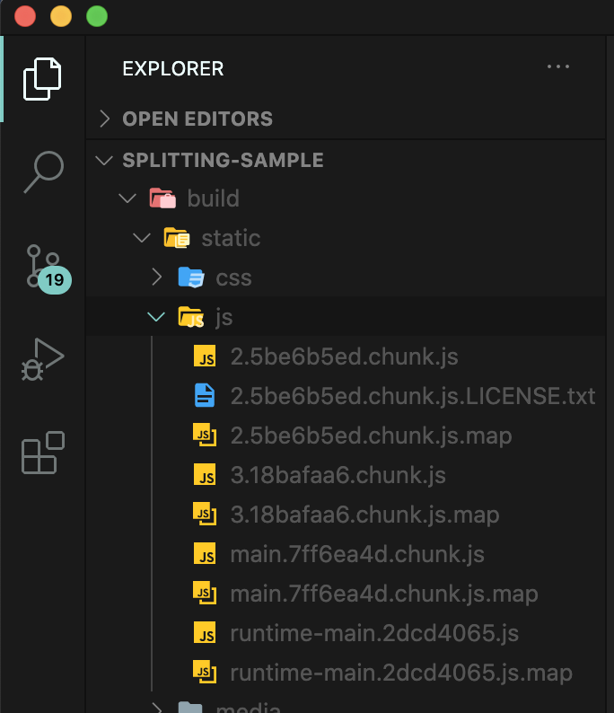
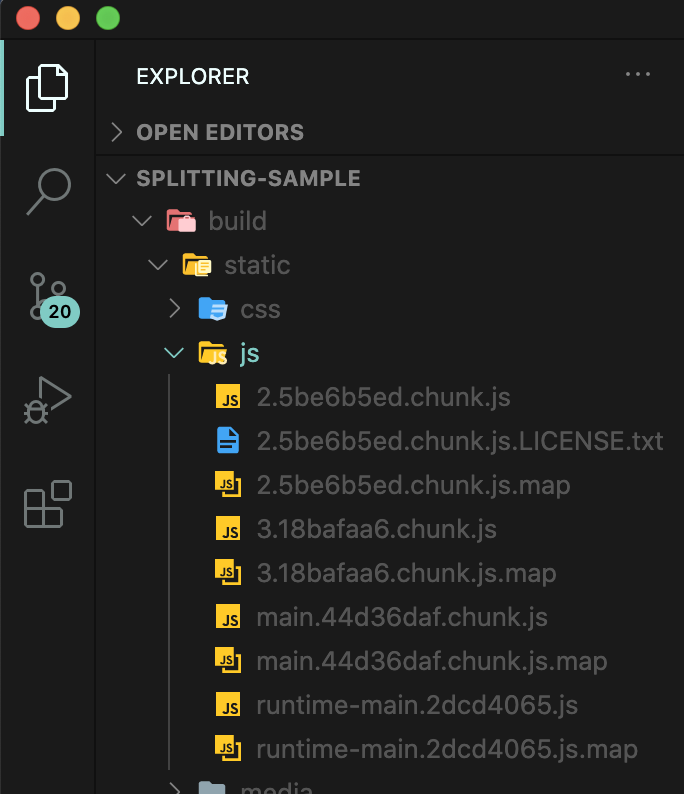
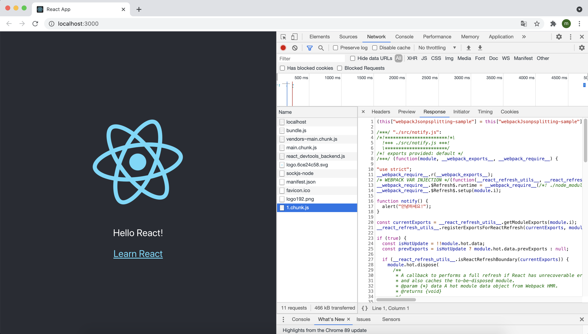
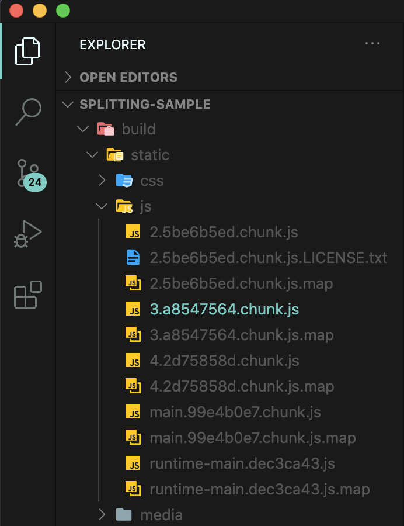
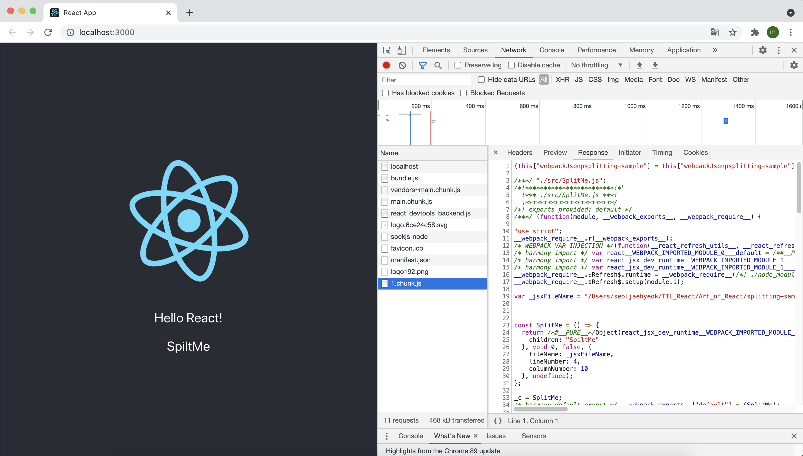
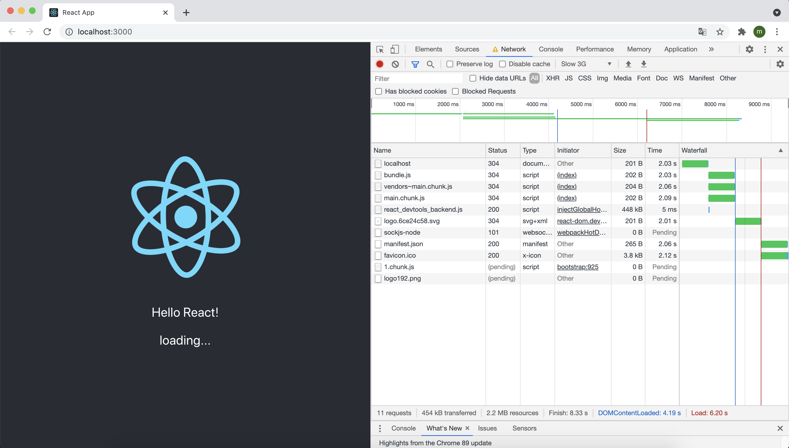
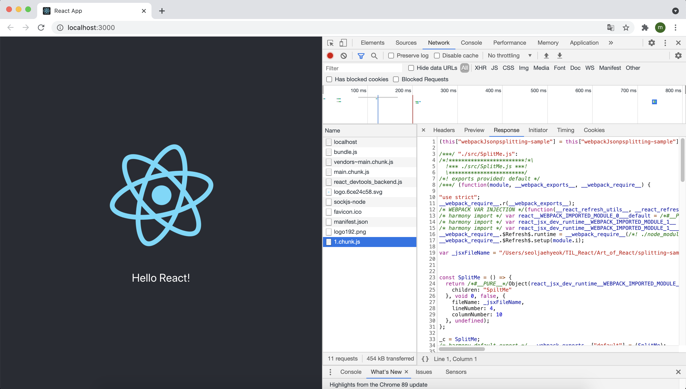

# 19장 코드 스플리팅

리액트 프로젝트를 완성하여 사용자에게 제공할 때는 빌드 작업을 거쳐서 배포해야 한다. 빌드 작업을 통해 프로젝트에서 사용되는 자바스크립트 파일 안에서 불필요한 주석, 경고 메시지, 공백 등을 제거하여 파일 크기를 최소화하기도 하고, 브라우저에서 JSX 문법이나 다른 최신 자바스크립트 문법이 원할하게 실행되도록 코드의 트랜스파일 작업도 할 수 있다. 만약 프로젝트 내에 이미지와 같은 정적 파일이 있다면 해당 파일을 위한 경로도 설정되지요.

이 작업은 웹팩이라는 도구가 담당합니다. 웹팩에서 별도의 설정을 하지 않으면 프로젝트에서 사용 중인 모든 자바스크립트 파일이 하나의 파일로 합쳐지고, 모든 CSS 파일도 하나의 파일로 합쳐진다.

CRA로 프로젝트를 빌드할 경우 최소 두개 이상의 자바스크립트 파일이 생성되는데 CRA의 기본 웹팩 설정에는 SplitChunks라는 기능이 적용되어 node_modules에서 불러온 파일, 일정 크기 이상의 파일, 여러 파일 간에 공유된 파일을 자동으로 따로 분리시켜서 캐싱의 효과를 제대로 누릴 수 있게 해 준다.

`$ yarn create react-app splitting-sample`

프로젝트 디렉터리 안에 있는 build/static 디렉터리를 열어 보면 자바스크립트 파일 여러 개가 만들어 진 것을 볼 수 있다.



파일 이름을 보면 '2.5be6b5ed.chunk.js' 같은 해시값이 포함되어 있다. 이 값은 빌드하는 과정에서 해당 파일의 내용에 따라 생성되며, 이를 통해 브라우저가 새로 파일을 받아야 할지 받지 말아야 할지를 알 수 있다. 

현재 2로 시작하는 파일에는 React, ReactDOM 등 node_modules에서 불러온 라이브러리 관련 코드가 들어 있고, main으로 시작하는 파일에는 직접 프로젝트에 작성하는 App 같은 컴포넌트에 대한 코드가 들어 있다. 2로 시작하는 파일은 코드는 엄청나게 긴 반면, main으로 시작하는 파일은 코드가 매우 짧다. 

조금 전 언급했던 SplitChunks라는 웹팩 기능을 통해 자주 바뀌지 않는 코드들이 2로 시작하는 파일에 들어 있기 때문에 캐싱의 이점을 더 오래 누릴 수 있다. 

이제 App 컴포넌트에서 Hello React를 출력해주는 코드를 넣어주고 

```jsx
import logo from "./logo.svg";
import "./App.css";

function App() {
  return (
    <div className="App">
      <header className="App-header">
        
        <p>Hello React!</p>
        <a
          className="App-link"
          href="https://reactjs.org"
          target="_blank"
          rel="noopener noreferrer"
        >
          Learn React
        </a>
      </header>
    </div>
  );
}

export default App;
```

다시 yarn build를 해보면 아래와 같이 기존에 node_modules에서 불러온 라이브러리가 들어 있던 2로 시작하는 파일의 이름은 바뀌지 않았고, 작성하는 컴포넌트 관련 코드가 들어 있던 main으로 시작하는 파일의 이름은 바뀐 것을 확인할 수 있다.



이렇게 파일을 분리하는 작업을 코드 스플리팅이라고 한다. **프로젝트에 기본 탑재된 SplitChunks 기능을 통한 코드 스플리팅은 단순히 효율적인 캐싱 효과만 있을 뿐이다.** 예를 들어 페이지 A, B, C로 구성된 SPA를 개발한다고 가정해보자. 사용자가 A 페이지에 방문했다면 B 페이지와 C 페이지에서 사용하는 컴포넌트 정보는 필요하지 않다. 사용자가 실제로 B 혹은 C 페이지로 이동하려고 할 때만 필요하다.

하지만 리액트 프로젝트에 별도로 설정하지 않으면 A, B, C 컴포넌트에 대한 코드가 모두 한 파일(main)에 저장되어 버린다. 만약 애플리케이션의 규모가 커지면 지금 당장 필요하지 않은 컴포넌트 정보도 모두 불러오면서 파일 크기가 매우 커진다. 그러면 로딩이 오래 걸리기 때문에 사용자 경험도 안 좋아지고 트래픽도 많이 나오게 된다.

이러한 문제점을 해결해 줄 수 있는 방법이 바로 코드 비동기 로딩이다. 이 또한 코드 스플리팅 방법 중 하나다. 코드 비동기 로딩을 통해 자바스크립트 함수, 객체, 혹은 컴포넌트를 처음에는 불러오지 않고 필요한 시점에 불러와서 사용할 수 있다.

이번 실습은 다음과 같은 흐름으로 진행된다.

> 자바스크립트 함수 비동기 로딩 → React.lazy와 Suspense를 통한 컴포넌트 비동기 렌더링 → Loadable Components를 통한 컴포넌트 비동기 렌더링

## 19.1 자바스크립트 함수 비동기 로딩

컴포넌트 코드를 스플리팅하기에 앞서 일반 자바스크립트 함수를 스플리팅 해보자. src 디렉터리에 notify.js 파일을 생성하여 아래와 같은 함수를 작성했다.

```jsx
export default function notify() {
  alert("안녕하세요!");
}
```

Hello React! 문구를 누르면 notify 함수가 실행되도록 App 컴포넌트를 수정해줬다.

```jsx
import logo from "./logo.svg";
import "./App.css";
import notify from "./notify";

function App() {
  const onClick = () => {
    notify();
  };

  return (
    <div className="App">
      <header className="App-header">
        
        <p onClick={onClick}>Hello React!</p>
        <a
          className="App-link"
          href="https://reactjs.org"
          target="_blank"
          rel="noopener noreferrer"
        >
          Learn React
        </a>
      </header>
    </div>
  );
}

export default App;
```

이렇게 작성하고 빌드하면 notify 코드가 main 파일 안에 들어가게 된다. 하지만 다음과 같이 import를 상단에서 하지 않고 import() 함수 형태로 메서드 안에서 사용하면, 파일을 따로 분리시켜서 저장한다. 그리고 실제 함수가 필요한 지점에 파일을 불러와서 함수를 사용할 수 있다.

```jsx
import logo from "./logo.svg";
import "./App.css";

function App() {
  const onClick = () => {
    import("./notify").then((result) => result.default());
  };

  return (
    <div className="App">
      <header className="App-header">
        
        <p onClick={onClick}>Hello React!</p>
        <a
          className="App-link"
          href="https://reactjs.org"
          target="_blank"
          rel="noopener noreferrer"
        >
          Learn React
        </a>
      </header>
    </div>
  );
}

export default App;
```

import를 함수로 사용하면 Promise를 반환한다. 이렇게 import를 함수로 사용하는 문법은 아직 표준 자바스크립트가 아니지만, stage-3 단계에 있는 dynamic import 라는 문법이다. 현재는 웹팩에서 지원하고 있으므로 별도의 설정 없이 프로젝트에서 바로 사용할 수 있다. 이 함수를 통해 모듈을 불러올 때 모듈에서 default로 내보낸 것은 result.default를 참조해야 사용할 수 있다.

브라우저를 열고 개발자 도구의 Network 탭을 누른 다음, Hello React!를 클릭해보면 



Hello React!를 클릭하는 시점에 새로운 자바스크립트 파일을 불러올 것이다. 불러온 파일의 내용을 확인해 보면 notify에 관련된 코드가 들어 있다.

이제 다시 yarn build를 하면 



이제 3으로 시작하는 파일 안에 notify 관련 코드가 들어간다.

## 19.2 React.lazy와 Suspense를 통한 컴포넌트 코드 스플리팅

코드 스플리팅을 위해 리액트에 내장된 기능으로 유팅 함수인 React.lazy와 컴포넌트인 Suspense가 있다. 이 기능은 리액트 16.6 버전부터 도입되었다. 이전 버전에서는 import 함수를 통해 불러온 다음, 컴포넌트 자체를 state에 넣는 방식으로 구현해야 한다.

#### 19.2.1 state를 사용한 코드 스플리팅

React.lazy를 사용하기에 앞서, React.lazy 없이 컴포넌트의 코드를 스플리팅한다면 어떻게 해야 하는지 알아보자. 먼저 코드 스플리팅을 할 간단한 컴포넌트를 만들자.

```jsx
import React from "react";

const SplitMe = () => {
  return <div>SpiltMe</div>;
};

export default SplitMe;
```

그런 다음 App 컴포넌트를 클래스형 컴포넌트로 전환해 준다. 그리고 handleClick 메서드를 만들고, 그 내부에서 SplitMe 컴포넌트를 불러와 state에 넣어 준다. 또한 render 함수에서는 state 안에 있는 SplitMe가 유효하다면 SplitMe 컴포넌트를 렌더링 해주어야 한다.

```jsx
import logo from "./logo.svg";
import "./App.css";
import SplitMe from "./SplitMe";

class App extends Component {
  state = {
    SpiltMe: null,
  };

  handleClick = async () => {
    const loadedModule = await import("./SplitMe");
    this.setState({
      SpiltMe: loadedModule.default,
    });
  };

  render() {
    return (
      <div className="App">
        <header className="App-header">
          
          <p onClick={onClick}>Hello React!</p>
          {SplitMe && <SplitMe />}
        </header>
      </div>
    );
  }
}

export default App;
```

이제 브라우저의 개발자 도구에서 Network 탭을 열고 Hello React!를 클릭하면 SplitMe 컴포넌트의 코드 스플리팅이 잘 이루어져 있는 것을 확인할 수 있다.



state를 사용하여 컴포넌트 코드 스플리팅을 하는 것이 그렇게 어렵지는 않지만, 매번 state를 선언해 주어야 한다는 점이 조금 불편하다.

#### 19.2.2 React.lazy와 Suspense 사용하기

React.lazy와 Suspense를 사용하면 코드 스플리팅을 하기 위해 state를 따로 선언하지 않고도 정말 간편하게 컴포넌트 코드 스플리팅을 할 수 있다. 

React.lazy는 **컴포넌트를 렌더링하는 시점에서 비동기적으로 로딩할 수 있게 해 주는 유틸 함수다.**

```jsx
const SplitMe = React.lazy(() => import('./SplitMe'));
```

Suspense는 리액트 내장 컴포넌트로서 코드 스플리팅된 컴포넌트를 로딩하도록 발동시킬 수 있고, 로딩이 끝나지 않았을 때 보여 줄 UI를 설정할 수 있다. 사용법은 아래와 같다.

```jsx
import React, { Suspense } from "react";

(...)
<Suspense fallback={<div>loading...</div>}>
  <SplitMe />
</Suspense>
```

Suspense에서 fallback props를 통해 로딩 중에 보여 줄 JSX를 지정할 수 있다. 이제 프로젝트에 적용해보도록 하자.

```jsx
import React, { Suspense, useState } from "react";
import logo from "./logo.svg";
import "./App.css";

const SplitMe = React.lazy(() => import("./SplitMe"));

const App = () => {
  const [visible, setVisible] = useState(false);
  const onClick = () => {
    setVisible(true);
  };
  return (
    <div className="App">
      <header className="App-header">
        
        <p onClick={onClick}>Hello React!</p>
        <Suspense fallback={<div>loading...</div>}>
          {visible && <SplitMe />}
        </Suspense>
      </header>
    </div>
  );
};

export default App;
```

단순히 SplitMe 컴포넌트의 가시성을 의미하는 visible이라는 상태만 업데이트하여 코드 스플리팅된 컴포넌트를 보여주었다. 개발자 도구의 Network 탭의 Online을 클릭해서 네트워크 속도를 느리게 설정한 뒤 Hello React!를 클릭하면 아래와 같이 loading... 이라는 문구가 나타나는 것을 확인할 수 있다.



#### 19.2.3 Loadable Components를 통한 코드 스플리팅

Loadable Components는 코드 스플리팅을 편하게 하도록 도와주는 서드파티 라이브러리다. 이 라이브러리의 이점은 서버 사이드 렌더링을 지원한다는 것이다. 또한 렌더링하기 전에 필요할 때 스플리팅된 파일을 미리 불러올 수 있는 기능도 있다.

서버 사이드 렌더링이란 **웹서비스의 초기 로딩 속도 개선, 캐싱 및 검색 엔진 최적화를 가능하게 해 주는 기술이다.** 서버 사이드 렌더링을 사용하면 웹 서비스의 초기 렌더링을 사용자의 브라우저가 아닌 서버 쪽에서 처리한다. 사용자는 서버에서 렌더링한 html 결과물을 받아 와서 그대로 사용하기 때문에 초기 로딩 속도도 개선되고, 검색 엔진에서 크롤링할 때도 문제가 없다. 이에 대한 자세한 내용은 다음 장에서 알아보도록 하고 여기서는 서버 사이드 렌더링 없이 Loadable Components의 기본적인 사용법만 알아보자.

먼저 `$ yarn add @loadable/component` 명령어로 라이브러리를 설치해 준다.

사용법은 React.lazy와 꽤 비슷하나 Suspense를 사용할 필요는 없다.

```jsx
import React, { useState } from "react";
import logo from "./logo.svg";
import "./App.css";
import loadable from "@loadable/component";

const SplitMe = loadable(() => import("./SplitMe"));

const App = () => {
  const [visible, setVisible] = useState(false);
  const onClick = () => {
    setVisible(true);
  };
  return (
    <div className="App">
      <header className="App-header">
        
        <p onClick={onClick}>Hello React!</p>
        {visible && <SplitMe />}
      </header>
    </div>
  );
};

export default App;
```

로딩 중에 다른 UI를 보여 주고 싶다면 loadable을 사용하는 부분을 다음과 같이 수정하면 된다.

```jsx
const SplitMe = loadable(() => import("./SplitMe"), {
  fallback: <div>loading...</div>,
});
```

이번에는 컴포넌트를 미리 불러오는(preload) 방법을 알아보자. 코드를 다음과 같이 수정한다.

```jsx
import React, { useState } from "react";
import logo from "./logo.svg";
import "./App.css";
import loadable from "@loadable/component";

const SplitMe = loadable(() => import("./SplitMe"), {
  fallback: <div>loading...</div>,
});

const App = () => {
  const [visible, setVisible] = useState(false);
  const onClick = () => {
    setVisible(true);
  };
  const onMouseOver = () => {
    SplitMe.preload();
  };
  return (
    <div className="App">
      <header className="App-header">
        
        <p onClick={onClick} onMouseOver={onMouseOver}>
          Hello React!
        </p>
        {visible && <SplitMe />}
      </header>
    </div>
  );
};

export default App;
```

저장한 후 결과를 보게 되면 마우스 커서를 Hello React! 위에 올리기만 해도 로딩이 시작된다. 그리고 클릭했을 때 렌더링이 된다. 개발자 도구를 확인해 보면 마우스 커서를 올리는 시점에 파일이 불러와 지는 것을 확인할 수 있다.



이런 기능을 구현하면 나중에 사용자에게 더 좋은 사용자 경험을 제공할 수 있다. Loadable Components는 미리 불러오는 기능 외에도 타임아웃, 로딩 UI 딜레이, 서버 사이드 렌더링 호환 등 다양한 기능을 제공한다. 자세한 사항은 [공식 문서](https://www.smooth-code.com/open-source/loadable-components/docs/delay/)에서 확인할 수 있다.

## 19.3 정리

이 장에서는 코드 스플리팅이 무엇인지, 컴포넌트를 어떻게 분리된 파일로 저장하고 또 비동기적으로 불러와서 사용하는지를 알아봤다. 서버 사이드 렌더링을 할 계획이 없다고 React.lazy와 Suspense로 구현하고 계획이 있다면 Loadable Components를 사용해야 한다. 리액트 공식 문서에서도 서버 사이드 렌더링을 할 경우 Loadable Components를 사용하도록 권장하고 있다.

React.lazy와 Suspense의 경우 지금 당장은 서버 사이드 렌더링을 지원하지 않지만 추후에는 지원될 수도 있으니, 이 기능을 배우고 사용하는 시점에 [공식 문서](https://reactjs.org/docs/code-splitting.html#reactlazy)를 확인해 보자.

