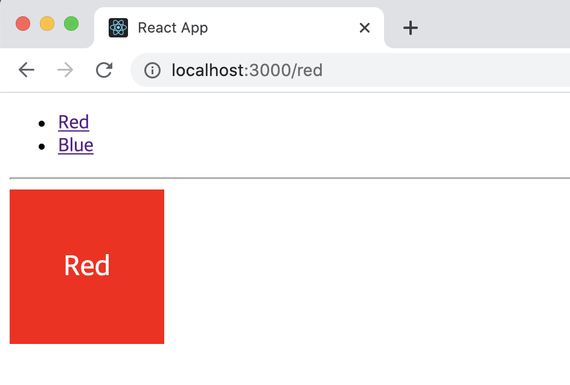
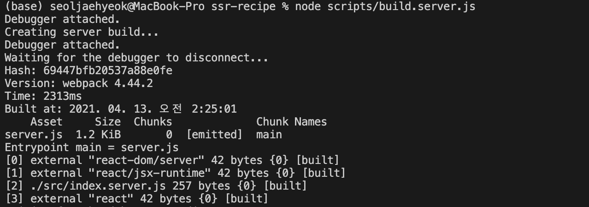
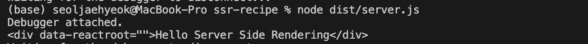
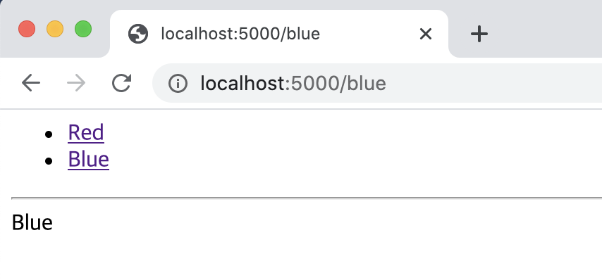
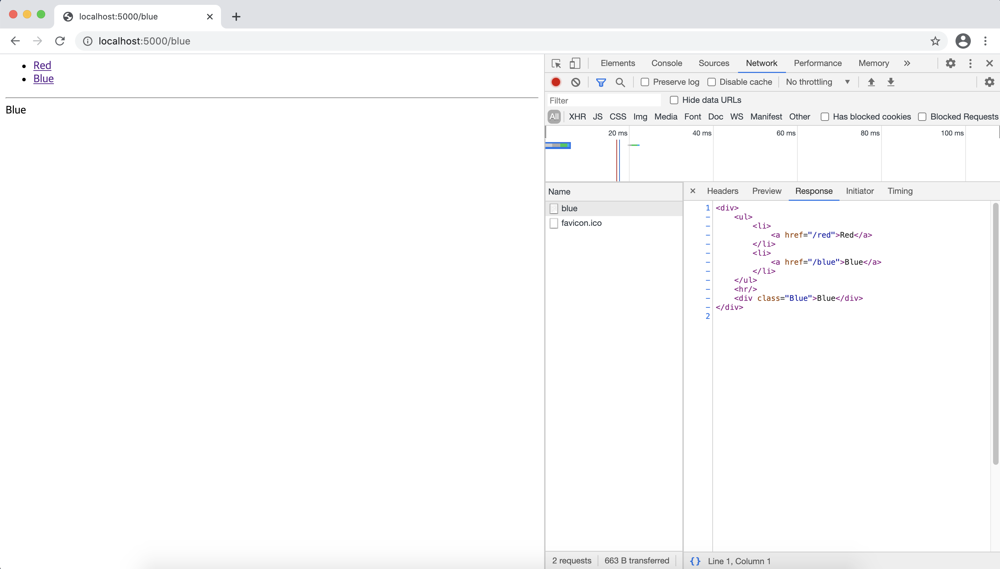
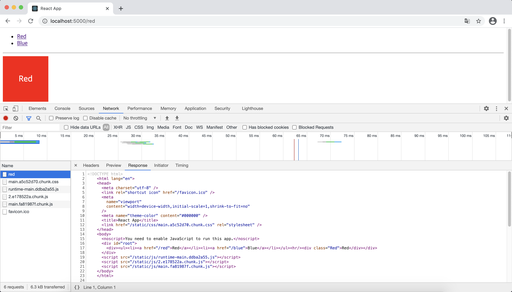
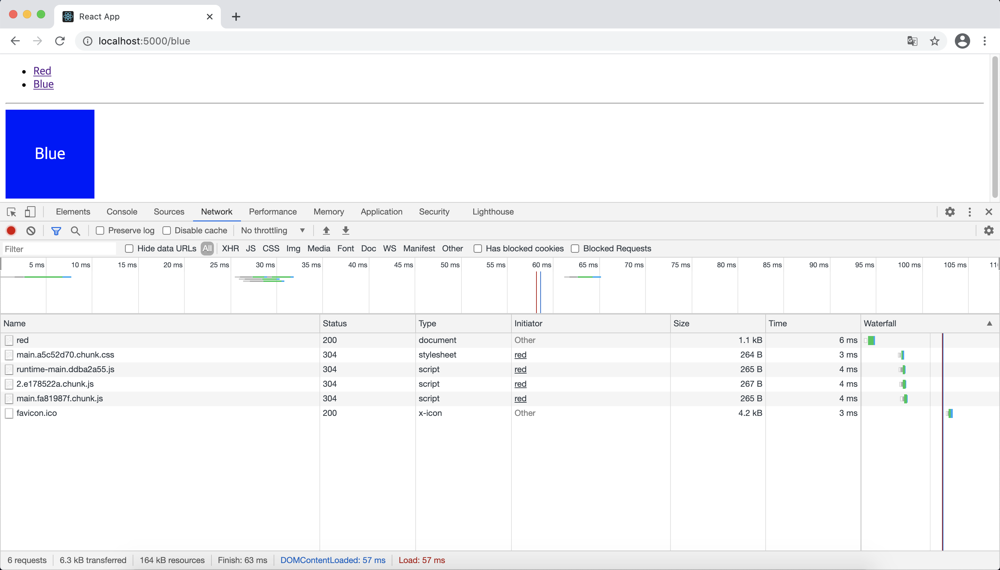
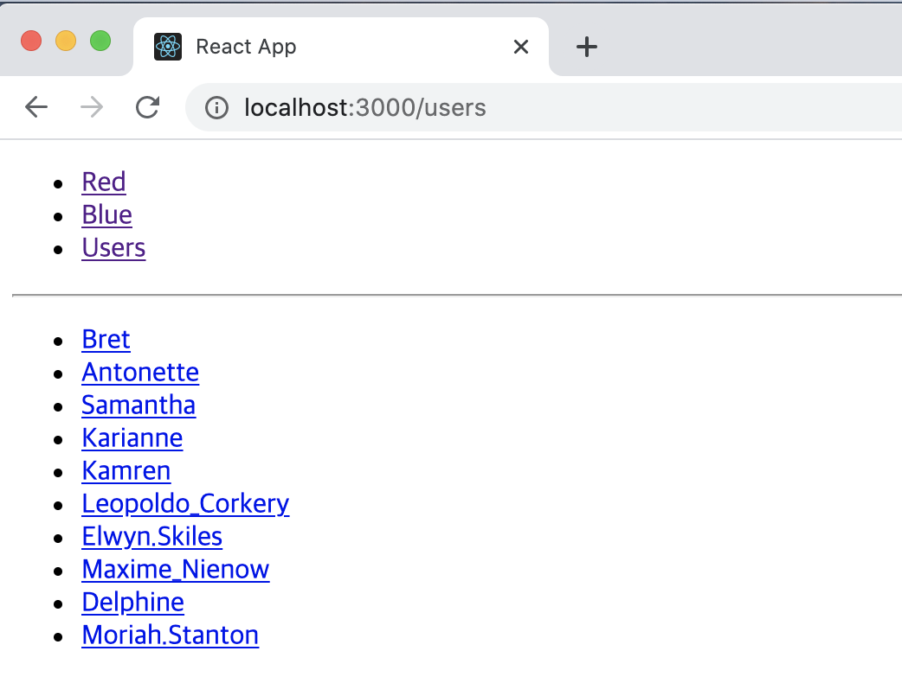

# 서버 사이드 렌더링

## 20.1 서버 사이드 렌더링의 이해

**서버 사이드 렌더링은 UI를 서버에서 렌더링하는 것을 의미한다.** 앞에서 만든 리액트 프로젝트는 기본적으로 클라이언트 사이드 렌더링을 하고 있다. 클라이언트 사이드 렌더링은 UI 렌더링을 브라우저에서 모두 처리하는 것이다. 즉, 자바스크립트를 실행해야 우리가 만든 화면이 사용자에게 보이게 된다.

#### 20.1.1 서버 사이드 렌더링의 장점

서버 사이드 렌더링의 장점으로는 

일단 구글, 네이버, 다음 등의 검색 엔진이 우리가 만든 웹 애플리케이션의 페이지를 원활하게 수집할 수 있다. 리액트로 만든 SPA는 검색 엔진 크롤러 봇처럼 자바스크립트가 실행되지 않는 환경에서는 페이지가 제대로 나타나지 않는다. 따라서 서버에서 클라이언트 대신 렌더링을 해 주면 페이지의 내용을 제대로 수집해 갈 수 있다. 구글 검색 엔진은 다른 검색 엔진과 달리 검색 엔진에서 자바스크립트를 실행하는 기능이 탑재되어 있으므로 제대로 페이지를 크롤링해 갈 때도 있지만, 모든 페이지에 대해 자바스크립트를 실행해 주지는 않는다. 따라서 **웹 서비스의 검색 엔진 최적화를 위해서라면 서버 사이드 렌더링을 구현해 주는 것이 좋다.**	

또한 **서버 사이드 렌더링을 통해 초기 렌더링 성능을 개선할 수 있다.** 예를 들어 서버 사이드 렌더링이 구현되지 않은 웹페이지에 사용자가 방문하면, 자바 스크립트가 로딩되고 실행될 때까지 사용자는 비어 있는 페이지를 보며 대기해야 한다. 여기에 API까지 호출해야 한다면 사용자의 대기 시간은 더더욱 길어진다. 반면 서버 사이드 렌더링을 구현한 웹 페이지라면 자바스크립트 파일 다운도르가 완료되지 않은 시점에서도 html상에 사용자가 볼 수 있는 컨텐츠가 있기 때문에 대기 시간이 최소화되고, 이로 인해 사용자 경험도 향상된다.

#### 20.1.2 서버 사이드 렌더링 단점

**서버 사이드 렌더링은 결국 원래 브라우저가 해야 할 일을 서버가 대신 처리하는 것이므로 서버 리소스가 사용된다는 단점이 있다.** 갑자기 수많은 사용자가 동시에 웹 페이지에 접속하면 서버에 과부하가 발생할 수 있다. 따라서 **사용자가 많은 서비스라면 캐싱과 로드 밸런싱을 통해 성능을 최적화해 주어야 한다.**	

또한 서버 사이드 렌더링을 하면 프로젝트의 구조가 좀 더 복잡해질 수 있고, 데이터 미리 불러오기, 코드 스플리팅과 호환 등 고려해야 할 사항이 더 많아져서 개발이 어려워질 수도 있다.

#### 20.1.3 서버 사이드 렌더링과 코드 스플리팅 충돌

서버 사이드 렌더링과 코드 스플리팅을 함께 적용하면 작업이 꽤나 까다로울 수 있다. 별도의 호환 작업 없이 두 기술을 함께 적용하면, 다음과 같은 흐름으로 작동하면 페이지에 깜빡임이 발생한다.


1. 서버 사이드 렌더링된 결과물이 브라우저에 나타남
2. 자바스크립트 파일 로딩 시작
3. 자바스크립트가 실행되면서 아직 불러오지 않은 컴포넌트를 null로 렌더링
4. 페이지에서 코드 스플리팅된 컴포넌트들이 사라짐
5. 코드 스플리팅된 컴포넌트들이 로딩된 이후 제대로 나타남

이 책에서는 이 문제를 다음과 같은 방법으로 해결한다. Loadable Components 라이브러리에서 제공하는 기능을 써서 서버 사이드 렌더링 후 필요한 파일의 경로를 추출하여 렌더링 결과에 스크립트/스타일 태그를 삽입해 주는 방법이다.

실습은 다음과 같은 흐름으로 진행된다.

> 프로젝트 준비하기 → 서버 사이드 렌더링 구현하기 → 데이터 로딩하기 → 코드 스플리팅하기

## 20.2 프로젝트 준비하기

먼저 CRA를 통해 ssr-recipe 프로젝트를 만들고 그 안에 react-router-dom 라이브러리를 설치해 준다.

#### 20.2.1 컴포넌트 만들기

components 디렉터리를 만들어 간단한 컴포넌트 3개를 만들어 준다.

```jsx
import React from "react";
import "./Red.css";

const Red = () => {
  return <div className="Red">Red</div>;
};

export default Red;
```

```css
.Red {
  background: red;
  font-size: 1.5rem;
  color: white;
  width: 128px;
  height: 128px;
  display: flex;
  align-items: center;
  justify-content: center;
}
```

```jsx
import React from "react";
import "./Blue.css";

const Blue = () => {
  return <div className="Blue">Blue</div>;
};

export default Blue;
```

```css
.Blue {
  background: blue;
  font-size: 1.5rem;
  color: white;
  width: 128px;
  height: 128px;
  display: flex;
  align-items: center;
  justify-content: center;
}
```

```jsx
import React from "react";
import { Link } from "react-router-dom";

const Menu = () => {
  return (
    <ul>
      <li>
        <Link to="./red">Red</Link>
      </li>
      <li>
        <Link to="./blue">Blue</Link>
      </li>
    </ul>
  );
};

export default Menu;
```

단순하게 빨간색, 파란색 박스를 보여 주는 컴포넌트와 각 링크로 이동할 수 있게 해 주는 메뉴 컴포넌트를 만들었다. 

#### 20.2.2 페이지 컴포넌트 만들기

이번에는 각 라우트를 위한 페이지 컴포넌트를 만들어보자. 이 컴포넌트들은 pages 디렉터리를 만들어 작성해보도록 하자.

```jsx
import React from "react";
import Red from "../components/Red";

const RedPage = () => {
  return <Red />;
};

export default RedPage;
```

```jsx
import React from "react";
import Red from "../components/Red";

const RedPage = () => {
  return <Red />;
};

export default RedPage;
```

페이지 컴포넌트 만든 다음 App 컴포넌트에서 라우트 설정을 해주자.

```jsx
import React from "react";
import { Route } from "react-router-dom";
import RedPage from "./pages/RedPage";
import BluePage from "./pages/BluePage";
import Menu from "./components/Menu";

function App() {
  return (
    <div>
      <Menu />
      <hr />
      <Route path="./red" component={RedPage} />
      <Route path="./blue" component={BluePage} />
    </div>
  );
}

export default App;
```

다음으로 BrowserRouter를 사용하여 프로젝트에 리액트 라우터를 적용하자.

```jsx
import React from "react";
import ReactDOM from "react-dom";
import { BrowserRouter } from "react-router-dom";
import App from "./App";

ReactDOM.render(
  <BrowserRouter>
    <App />
  </BrowserRouter>,
  document.getElementById("root")
);
```

코드를 모두 저장한 후 `yarn start`를 통해 개발 서버를 실행시켜 주면 다음과 같은 화면이 잘 나타나는 것을 확인할 수 있다.



이제 본격적으로 서버 사이드 렌더링을 구현해 보도록 하자.

## 20.3 서버 사이드 렌더링 구현하기

서버 사이드 렌더링을 구현하려면 웹팩 설정을 커스터마이징 해줘야 한다.** CRA로 만든 프로젝트에서는 웹팩 관련 설정이 기본적으로 모두 숨겨져 있으니 `$ yarn eject` 명령어를 실행하여 밖으로 꺼내 준다.**

`  git add . `

` git commit -m "Commit before eject"`

` $ yarn eject`

#### 20.3.1 서버 사이드 렌더링용 엔트리 만들기

엔트리는 웹팩에서 프로젝트를 불러올 때 가장 먼저 불러오는 파일이다. 예를 들어 현재 작성 중인 리액트 프로젝트에서는 index.js를 엔트리 파일로 사용한다. 이 파일부터 시작해서 내부에 필요한 다른 컴포넌트와 모듈을 불러오고 있다. 서버 사이드 렌더링 할 때는 서버를 위한 엔트리 파일을 따로 생성해야 한다.src 디렉터리에 index.server.js라는 파일을 생성하자.

```jsx
import React from "react";
import ReactDOMServer from "react-dom/server";

const html = ReactDOMServer.renderToString(
  <div>Hello Server Side Rendering</div>
);

console.log(html);
```

지금은 일단 가장 기본적인 코드만 작성했다. **서버에서 리액트 컴포넌트를 렌더링할 때는 ReactDOMServer의 renderToString이라는 함수를 사용한다. ** 이 함수에 JSX를 넣어서 호출하면 렌더링 결과를 문자열로 반환한다.

#### 20.3.2 서버 사이드 렌더링 전용 웹팩 환경 설정 작성

**작성한 엔트리 파일을 웹패긍로 불러와서 빌드하려면 서버 전용 환경 설정을 만들어 주어야 한다.** 먼저 config 경로의 paths.js 파일을 열어서 스크롤을 맨 아래로 내린 후 module.exports 부분에 다음과 같이 두 줄을 추가한다.

```jsx
(...)
module.exports = {
  dotenv: resolveApp(".env"),
  appPath: resolveApp("."),
  appBuild: resolveApp(buildPath),
  appPublic: resolveApp("public"),
  appHtml: resolveApp("public/index.html"),
  appIndexJs: resolveModule(resolveApp, "src/index"),
  appPackageJson: resolveApp("package.json"),
  appSrc: resolveApp("src"),
  appTsConfig: resolveApp("tsconfig.json"),
  appJsConfig: resolveApp("jsconfig.json"),
  yarnLockFile: resolveApp("yarn.lock"),
  testsSetup: resolveModule(resolveApp, "src/setupTests"),
  proxySetup: resolveApp("src/setupProxy.js"),
  appNodeModules: resolveApp("node_modules"),
  swSrc: resolveModule(resolveApp, "src/service-worker"),
  ssrIndexJs: resolveApp("src/index.server.js"), // 서버 사이드 렌더링 엔트리
  ssrBuild: resolveApp("dist"), // 웹팩 처리 후 저장 경로
  publicUrlOrPath,
};

module.exports.moduleFileExtensions = moduleFileExtensions;
```

ssrIndexJs는 불러올 파일의 경로이고, ssrBuild는 웹팩으로 처리한 뒤 결과물을 저장할 경로다. 

다음으로 웹팩 환경 설정 파일을 작성한다. Config 디렉터리에 webpack.config.server.js 파일을 생성해준다.

```jsx
const paths = require("./paths");

module.exports = {
  mode: "production", // 프로덕션 모드로 설정하여 최적화 옵션들을 활성화
  entry: paths.ssrIndexJs, // 엔트리 경로
  target: "node", // node 환경에서 실행될 것이라는 점을 명시
  output: {
    path: paths.ssrBuild, // 빌드 경로
    filename: "server.js", // 파일 이름
    chunkFilename: "js/[name].chunk.js", // 청크 파일 이름
    publicPath: paths.publicUrlOrPath, // 정적 파일이 제공될 경로
  },
};
```

웹팩 기본 설정을 작성했다. 빌드할 때 어떤 파일에서 시작해 파일들을 불러오는지, 또 어디에 결과물을 저장할지를 정해 주었다.

다음으로 로더를 설정한다. 웹팩의 로더는 파일을 불러올 때 확장자에 맞게 필요한 처리를 해준다. 예를 들어 자바스크립트는 babel을 사용하여 트랜스파일링을 해주고, CSS는 모든 CSS 코드를 결합해 주고, 이미지 파일은 파일을 다른 경로에 따로 저장하고 그 파일에 대한 경로를 자바스크립트에서 참조할 수 있게 해 준다.

서버 사이드 렌더링을 할 때 CSS 혹은 이미지 파일은 그다지 중요하지 않다. 그렇다고 완전히 무시할 수는 없는데 가끔 자바스크립트 내부에서 파일에 대한 경로가 필요하거나 CSS Module 처럼 로컨 className을 참조해야 할 수도 있기 때문이다. 그래서 해당 파일을 로더에서 별도로 설정하여 처리하지만 따로 결과물에 포함되지 않도록 구현할 수 있다.

```jsx
const paths = require("./paths");
const getCSSModuleLocalIdent = require("react-dev-utils/getCSSModuleLocalIdent");

const cssRegex = /\.css$/;
const cssModuleRegex = /\.module\.css$/;
const sassRegex = /\.(scss|sass)$/;
const sassModuleRegex = /\.module\.(scss|sass)$/;

const env = getClientEnvironment(paths.publicUrlOrPath.slice(0, -1));

module.exports = {
  mode: "production", // 프로덕션 모드로 설정하여 최적화 옵션들을 활성화
  entry: paths.ssrIndexJs, // 엔트리 경로
  target: "node", // node 환경에서 실행될 것이라는 점을 명시
  output: {
    path: paths.ssrBuild, // 빌드 경로
    filename: "server.js", // 파일 이름
    chunkFilename: "js/[name].chunk.js", // 청크 파일 이름
    publicPath: paths.publicUrlOrPath, // 정적 파일이 제공될 경로
  },
  module: {
    rules: [
      {
        oneOf: [
          // 자바스크립트를 위한 처리
          // 기존 webpack.config.js 를 참고하여 작성
          {
            test: /\.(js|mjs|jsx|ts|tsx)$/,
            include: paths.appSrc,
            loader: require.resolve("babel-loader"),
            options: {
              customize: require.resolve(
                "babel-preset-react-app/webpack-overrides"
              ),
              presets: [
                [
                  require.resolve("babel-preset-react-app"),
                  {
                    runtime: "automatic",
                  },
                ],
              ],
              plugins: [
                [
                  require.resolve("babel-plugin-named-asset-import"),
                  {
                    loaderMap: {
                      svg: {
                        ReactComponent:
                          "@svgr/webpack?-svgo,+titleProp,+ref![path]",
                      },
                    },
                  },
                ],
              ],
              cacheDirectory: true,
              cacheCompression: false,
              compact: false,
            },
          },
          // CSS 를 위한 처리
          {
            test: cssRegex,
            exclude: cssModuleRegex,
            //  exportOnlyLocals: true 옵션을 설정해야 실제 css 파일을 생성하지 않습니다.
            loader: require.resolve("css-loader"),
            options: {
              importLoaders: 1,
              modules: {
                exportOnlyLocals: true,
              },
            },
          },
          // CSS Module 을 위한 처리
          {
            test: cssModuleRegex,
            loader: require.resolve("css-loader"),
            options: {
              importLoaders: 1,
              modules: {
                exportOnlyLocals: true,
                getLocalIdent: getCSSModuleLocalIdent,
              },
            },
          },
          // Sass 를 위한 처리
          {
            test: sassRegex,
            exclude: sassModuleRegex,
            use: [
              {
                loader: require.resolve("css-loader"),
                options: {
                  importLoaders: 3,
                  modules: {
                    exportOnlyLocals: true,
                  },
                },
              },
              require.resolve("sass-loader"),
            ],
          },
          // Sass + CSS Module 을 위한 처리
          {
            test: sassRegex,
            exclude: sassModuleRegex,
            use: [
              {
                loader: require.resolve("css-loader"),
                options: {
                  importLoaders: 3,
                  modules: {
                    exportOnlyLocals: true,
                    getLocalIdent: getCSSModuleLocalIdent,
                  },
                },
              },
              require.resolve("sass-loader"),
            ],
          },
          // url-loader 를 위한 설정
          {
            test: [/\.bmp$/, /\.gif$/, /\.jpe?g$/, /\.png$/],
            loader: require.resolve("url-loader"),
            options: {
              emitFile: false, // 파일을 따로 저장하지 않는 옵션
              limit: 10000, // 원래는 9.76KB가 넘어가면 파일로 저장하는데
              // emitFile 값이 false 일땐 경로만 준비하고 파일은 저장하지 않습니다.
              name: "static/media/[name].[hash:8].[ext]",
            },
          },
          // 위에서 설정된 확장자를 제외한 파일들은
          // file-loader 를 사용합니다.
          {
            loader: require.resolve("file-loader"),
            exclude: [/\.(js|mjs|jsx|ts|tsx)$/, /\.html$/, /\.json$/],
            options: {
              emitFile: false, // 파일을 따로 저장하지 않는 옵션
              name: "static/media/[name].[hash:8].[ext]",
            },
          },
        ],
      },
    ],
  },
};
```

이제 코드에서 node_modules 내부의 라이브러리를 불러올 수 있게 설정한다.

```jsx
const paths = require("./paths");
const getCSSModuleLocalIdent = require("react-dev-utils/getCSSModuleLocalIdent");

const cssRegex = /\.css$/;
const cssModuleRegex = /\.module\.css$/;
const sassRegex = /\.(scss|sass)$/;
const sassModuleRegex = /\.module\.(scss|sass)$/;

const env = getClientEnvironment(paths.publicUrlOrPath.slice(0, -1));

module.exports = {
  mode: "production", // 프로덕션 모드로 설정하여 최적화 옵션들을 활성화
  entry: paths.ssrIndexJs, // 엔트리 경로
  target: "node", // node 환경에서 실행될 것이라는 점을 명시
  output: {
    path: paths.ssrBuild, // 빌드 경로
    filename: "server.js", // 파일 이름
    chunkFilename: "js/[name].chunk.js", // 청크 파일 이름
    publicPath: paths.publicUrlOrPath, // 정적 파일이 제공될 경로
  },
  module: {
    rules: [
      {
        oneOf: [
          (...)
    ],
  },
  resolve: {
    modules: ['node_modules']
  }
};
```

이렇게 했을 때 react, react-dom/server 같은 라이브러리를 import 구문으로 불러오면 node_modules에서 찾아 사용한다. 라이브러리를 불러오면 빌드할 때 결과물 파일 안에 해당 라이브러리 관련 코드가 함께 번들링된다.

**브라우저에서 사용할 때는 결과물 파일에 리액트 라이브러리와 우리의 애플리케이션에 관한 코드가 공존해야 하는데** 서버에서는 굳이 결과물 파일 안에 리액트 라이브러리가 들어 있지 않아도 된다. **node_modules를 통해 바로 불러와서 사용할 수 있기 때문이다.**

따라서 서버를 위해 번들링할 때는 node_modules에서 불러오는 것을 제외하고 번들링하는 것이 좋다. 이를 위해 webpack-node-externals라는 라이브러리를 사용해야 한다.

` $ yarn add webpack-node-externals`

다음으로 이 라이브러리를 webpack.config.server.js의 상단에 불러와서 설정에 적용한다.

```jsx
const paths = require("./paths");
const getCSSModuleLocalIdent = require("react-dev-utils/getCSSModuleLocalIdent");
const nodeExternals = require("webpack-node-externals");
const webpack = require("webpack");
const getClientEnvironment = require("./env");

const cssRegex = /\.css$/;
const cssModuleRegex = /\.module\.css$/;
const sassRegex = /\.(scss|sass)$/;
const sassModuleRegex = /\.module\.(scss|sass)$/;

const env = getClientEnvironment(paths.publicUrlOrPath.slice(0, -1));

module.exports = {
  mode: "production", // 프로덕션 모드로 설정하여 최적화 옵션들을 활성화
  entry: paths.ssrIndexJs, // 엔트리 경로
  target: "node", // node 환경에서 실행될 것이라는 점을 명시
  output: {
    path: paths.ssrBuild, // 빌드 경로
    filename: "server.js", // 파일 이름
    chunkFilename: "js/[name].chunk.js", // 청크 파일 이름
    publicPath: paths.publicUrlOrPath, // 정적 파일이 제공될 경로
  },
  module: {
    rules: [
      {
        oneOf: [
          (...)
    ],
  },
  resolve: {
    modules: ["node_modules"],
  },
  externals: [
    nodeExternals({
      allowlist: [/@babel/],
    }),
  ],
};
```

환경변수를 주입하면, 프로젝트 내에서 process.env.NODE_ENV 값을 참조하여 현재 개발 환경인지 아닌지를 알 수 있다.

#### 20.3.3 빌드 스크립트 작성하기

이번에는 방금 만든 환경 설정을 사용하여 웹팩으로 프로젝트를 빌드하는 스크립트를 작성해 보자. scripts 경로를 열어 보면 build.js라는 파일이 있다. 이 스크립트는 클라이언트에서 사용할 빌드 파일을 만드는 작업을 한다. 이 스크립트와 비슷한 형식으로 서버에서 사용할 빌드 파일을 만드는 build.server.js 스크립트를 작성해 보자.

```jsx
process.env.BABEL_ENV = "production";
process.env.NODE_ENV = "production";

process.on("unhandledRejection", (err) => {
  throw err;
});

require("../config/env");
const fs = require("fs-extra");
const webpack = require("webpack");
const config = require("../config/webpack.config.server");
const paths = require("../config/paths");

function build() {
  console.log("Creating server build...");
  fs.emptyDirSync(paths.ssrBuild);
  let compiler = webpack(config);
  return new Promise((resolve, reject) => {
    compiler.run((err, stats) => {
      if (err) {
        console.log(err);
        return;
      }
      console.log(stats.toString());
    });
  });
}

build();
```

코드를 다 작성한 뒤에는 다음 명령어를 실행하여 빌드가 잘되는지 확인해보자.

` $ node scripts/build.server.js`



성공적으로 실행된 것을 확인할 수 있다. 

다음으로

`$ node dist/server.js` 명령어를 실행 하면 테스트 삼아 만들었던 JSX가 문자열 형태로 잘 렌더링 되는 것을 확인할 수 있다.



하지만 매번 빌드하고 실행할 때마다 파일 경로를 입력하는 것이 번거로울 수 있으니, package.json에서 스크립트를 생성하여 더 편하게 명령어를 입력할 수 있도록 하자.

```jsx
"scripts": {
    "start": "node scripts/start.js",
    "build": "node scripts/build.js",
    "test": "node scripts/test.js",
    "start:server": "node dist/server.js",
    "build:server": "node scripts/build.server.js"
  },
```

이렇게 스크립트를 만들면 다음 명령어로 서버를 빌드하고 시작할 수 있다.

`$ yarn start:server`

`$ yarn build:server`

#### 20.3.4 서버 코드 작성하기

서버 사이드 렌더링을 처리할 서버를 작성해 보자. Express라는 Node.js 웹 프레임워크를 사용하여 웹 서버를 만들어 보도록 하자. 이 과정은 꼭 Express가 아니어도 상관없고 Koa, Hapi 또는 connect 라이브러리를 사용하면 구현할 수 있다. Express를 사용하는 이유는 사용률이 가장 놓고, 추후 정적 파일들을 호스팅할 때도 쉽게 구현할 수 있기 때문이다.

` $ yarn add express` 를 통해 Express를 설치하자.

그런 다음 index.server.js 코드를 아래와 같이 작성해 준다.

```jsx
import React from "react";
import ReactDOMServer from "react-dom/server";
import express from "express";
import { StaticRouter } from "react-router-dom";
import App from "./App";

const app = express();

//서버 사이드 렌더링을 처리할 핸들러 함수
const serverRender = (req, res, next) => {
  //이 함수는 404가 떠야 하는 상황에 404를 띄우지 않고 서버 사이드 렌더링을 해준다.
  const context = {};
  const jsx = (
    <StaticRouter location={req.url} context={context}>
      <App />
    </StaticRouter>
  );
  const root = ReactDOMServer.renderToString(jsx); // 렌더링을 하고
  res.send(root); // 클라이언트에게 결과물을 응답
};

app.use(serverRender);

// 5000 포트로 서버를 가동
app.listen(5000, () => {
  console.log("Running on http://localhost:5000");
});
```

이 과정에서 리액트 라우터 안에 들어 있는 StaticRouter라는 컴포넌트가 사용되었다. 이 라우터 컴포넌트는 주로 서버 사이드 렌더링 용도로 사용되는 라우터다. props로 넣어 주는 location 값에 따라 라우팅해 준다. 지금은 req.url이라는 값을 넣어 주었는데 여기서 req 객체는 요청에 대한 정보를 지니고 있다.

StaticRouter에 context라는 props도 넣어 주었다. 이 값을 사용하여 나중에 렌더링한 컴포넌트에 따라 HTTP 상태 코드를 설정해 줄 수 있다.

지금 당장 JS 파일과 CSS 파일을 불러 오는 것은 생략하고, 리액트 서버 사이드 렌더링을 통해 만들어진 결과만 보여주도록 처리했다. 서버를 다시 빌드하고 실행해 보자.

`$ yarn build:server`

`$ yarn start:server`

이제 브라우저로 http://localhost:5000/ 경로에 들어가면 아래와 같은 화면이 잘 나타나는 것을 확인할 수 있다.



지금은 CSS를 불러오지 않기 때문에 스타일이 적용되어 있지 않아도 괜찮다. 브라우저에서 자바스크립트도 실행되지 않기 떄문에, 현재 브라우저에 나타난 정보는 모두 서버 사이드에서 렌더링된 것으로 간주할 수 있다.

만약 자바스크립트를 로딩하면 현재 브라우저에 보이는 데이터가 서버에서 렌더링된 것인지, 클라이언트에서 렌더링된 것인지 분간하기 어려울 것이다. 서버 사이드 렌더링이 정말 제대로 이루어졌는지 확인하기 위해 개발자 도구의 Network 탭을 열고 새로고침 해보자.



우측에 Response를 누르게 되면 컴포넌트 렌더링 결과가 문자열로 잘 전달되고 있는 것을 확인할 수 있다.

#### 20.3.5 정적 파일 제공

이번에는 Express에 내장되어 있는 static 미들웨어를 사용하여 서버를 통해 build에 있는 JS, CSS 정적 파일들에 접근할 수 있도록 만들어 보자.

```jsx
import React from "react";
import ReactDOMServer from "react-dom/server";
import express from "express";
import { StaticRouter } from "react-router-dom";
import App from "./App";
import path from "path";

const app = express();

//서버 사이드 렌더링을 처리할 핸들러 함수
const serverRender = (req, res, next) => {
 (...)
};

const serve = express.static(path.resolve("./build"), {
  index: false, // "/" 경로에서 index.html을 보여주지 않도록 설정
});

app.use(serve); // 순서가 중요하다. serverRender 전에 위치해야 한다.
app.use(serverRender);

// 5000 포트로 서버를 가동
app.listen(5000, () => {
  console.log("Running on http://localhost:5000");
});
```

그다음에는 JS와 CSS 파일을 불러오도록 html에 코드를 삽입해 주어야 한다. 불러와야 하는 파일 이름은 매번 빌드할 때마다 바뀌기 때문에 빌드하고 나서 만들어지는 asset-manifest.json 파일을 참고하여 불러오도록 작성한다.

한번 `yarn build ` 명령어를 실행한 다음, build 디렉터리의 asset-manifest.json을 열어보면 아래와 같은 코드들이 들어가 있는 것을 확인할 수 있다.

```jsx
{
  "files": {
    "main.css": "/static/css/main.a5c52d70.chunk.css",
    "main.js": "/static/js/main.fa81987f.chunk.js",
    "main.js.map": "/static/js/main.fa81987f.chunk.js.map",
    "runtime-main.js": "/static/js/runtime-main.ddba2a55.js",
    "runtime-main.js.map": "/static/js/runtime-main.ddba2a55.js.map",
    "static/js/2.e178522a.chunk.js": "/static/js/2.e178522a.chunk.js",
    "static/js/2.e178522a.chunk.js.map": "/static/js/2.e178522a.chunk.js.map",
    "index.html": "/index.html",
    "static/css/main.a5c52d70.chunk.css.map": "/static/css/main.a5c52d70.chunk.css.map",
    "static/js/2.e178522a.chunk.js.LICENSE.txt": "/static/js/2.e178522a.chunk.js.LICENSE.txt"
  },
  "entrypoints": [
    "static/js/runtime-main.ddba2a55.js",
    "static/js/2.e178522a.chunk.js",
    "static/css/main.a5c52d70.chunk.css",
    "static/js/main.fa81987f.chunk.js"
  ]
}
```

위 코드에서 main.css, main.js, runtime-main.js, static/js/2.e178522a.chunk.js 파일을 html 내부에 삽입해 주어야 한다.

```jsx
import React from "react";
import ReactDOMServer from "react-dom/server";
import express from "express";
import { StaticRouter } from "react-router-dom";
import App from "./App";
import path from "path";
import fs from "fs";

// asset-manifest.json에서 파일 경로들을 조회합니다.
const manifest = JSON.parse(
  fs.readFileSync(path.resolve("./build/asset-manifest.json"), "utf8")
);

const chunks = Object.keys(manifest.files)
  .filter((key) => /chunk\.js$/.exec(key)) // chunk.js로 끝나는 키를 찾아서
  .map((key) => `<script src="${manifest.files[key]}"></script>`) // 스크립트 태그로 변환하고
  .join(""); // 합침

function createPage(root, tags) {
  return `<!DOCTYPE html>
    <html lang="en">
    <head>
      <meta charset="utf-8" />
      <link rel="shortcut icon" href="/favicon.ico" />
      <meta
        name="viewport"
        content="width=device-width,initial-scale=1,shrink-to-fit=no"
      />
      <meta name="theme-color" content="#000000" />
      <title>React App</title>
      <link href="${manifest.files["main.css"]}" rel="stylesheet" />
    </head>
    <body>
      <noscript>You need to enable JavaScript to run this app.</noscript>
      <div id="root">
        ${root}
      </div>
      <script src="${manifest.files["runtime-main.js"]}"></script>
      ${chunks}
      <script src="${manifest.files["main.js"]}"></script>
    </body>
    </html>
      `;
}

const app = express();

// 서버사이드 렌더링을 처리 할 핸들러 함수입니다.
const serverRender = async (req, res, next) => {
  // 이 함수는 404가 떠야 하는 상황에 404를 띄우지 않고 서버사이드 렌더링을 해줍니다.

  const context = {};

  const jsx = (
    <StaticRouter location={req.url} context={context}>
      <App />
    </StaticRouter>
  );

  const root = ReactDOMServer.renderToString(jsx); // 렌더링을 하고
  res.send(createPage(root)); // 클라이언트에게 결과물을 응답합니다.
};

const serve = express.static(path.resolve("./build"), {
  index: false, // "/" 경로에서 index.html 을 보여주지 않도록 설정
});

app.use(serve); // 순서가 중요합니다. serverRender 전에 위치해야 합니다.
app.use(serverRender);

// 5000포트로 서버를 가동합니다.
app.listen(5000, () => {
  console.log("Running on http://localhost:5000");
});
```

이제 서버를 빌드하고 다시 시작해보자.

http://localhost:5000 페이지에 들어가 CSS도 함께 적용되는지 확인하고, 개발자 도구의 Network 탭에서 서버 사이드 렌더링이 잘되었는지 확인 해보면 아래와 같이 정상적으로 이루어진 것을 확인할 수 있다.



**만약 여기서 Blue 링크를 눌러 이동한다고 하면 서버 사이드 렌더링이 아니라 클라이언트 렌더링이 되어야 한다.** 즉, 다른 링크를 클릭하여 다른 페이지로 이동할 때 네트워크 요청이 추가로 발생하지 않아야 한다.



위 이미지를 보게 되면 처음 Red 파일을 네트워크 요청을 통해 받아온 것이 확인되고, Blue 링크를 클릭하여 다른 페이지로 들어갔을 때는 추가 네트워크 요청이 이루어지지 않는 것을 확인할 수 있다. 즉, 정상적으로 클라이언트 렌더링이 발생한 것이다.

서버 사이드 렌더링을 구현하면 이렇게 첫 번째 렌더링은 서버를 통해 하지만, 그 이후에는 브라우저에서 처리한다.

## 20.4 데이터 로딩

데이터 로딩은 서버 사이드 렌더링을 구현할 때 해결하기가 매우 까다로운 문제 중 하나다. 데이터를 로딩한다는 것은 API 요청을 의미하는데 예를 들어 페이지에서 필요로 하는 데이터가 있다면 API를 요청해서 응답을 받아 와야 한다. **일반적인 브라우저 환경에서는 API를 요청하고 응답을 받아 와서 리액트 state 혹은 리덕스 스토어에 넣으면 자동으로 리렌더링하니까 큰 걱정은 없다.**

**하지만 서버의 경우 문자열 형태로 렌더링하는 것이므로 state나 리덕스 스토어의 상태가 바뀐다고 해서 자동으로 리렌더링되지 않는다.** 그 대신 우리가 renderToString 함수를 한번 더 호출해 주어야 한다. 게다가 서버에서는 componentDidMount 같은 라이프사이클 API도 사용할 수 없다.

서버 사이드 렌더링 시 데이터 로딩을 해결하는 방법 또한 다양하다. 다양한 방법 중 정말 깔끔하고 편한 방법을 이 책에서 소개해준다. 이 책에서는 redux-thunk 혹은 redux-saga 미들웨어를 사용하여 API를 호출하는 환경에서 서버 사이드 렌더링을 하는 방법을 알아보자.

#### 20.4.1 redux-thunk 코드 준비

우선 redux-thunk를 사용하여 API 호출 후 데이터를 가져오는 코드를 작성해보자.

액션 타입, 액션 생성 함수, 리듀서 코드를 한 파일에 넣어서 관리하는 Ducks 패턴을 사용해서 리덕스 모듈을 작성해보겠다. src 디렉터리에 modules 디렉터리를 만들고 아래와 같이 작성해 준다.

```jsx
import axios from "axios";

// 액션 타입 정의
const GET_USERS_PENDING = "users/GET_USERS_PENDING";
const GET_USERS_SUCCESS = "users/GET_USERS_SUCCESS";
const GET_USERS_FAILURE = "users/GET_USERS_FAILURE";

// 액션 생성 함수
const getUsersPending = () => ({ type: GET_USERS_PENDING });
const getUsersSuccess = (payload) => ({ type: GET_USERS_SUCCESS, payload });
const getUsersFailure = (payload) => ({
  type: GET_USERS_FAILURE,
  error: true,
  payload,
});

// redux-thunk 함수
export const getUsers = () => async (dispatch) => {
  try {
    dispatch(getUsersPending());
    const response = await axios.get(
      "https://jsonplaceholder.typicode.com/users"
    );
    dispatch(getUsersSuccess(response));
  } catch (e) {
    dispatch(getUsersFailure(e));
    throw e;
  }
};

// 초기 상태 지정
const initialState = {
  users: null,
  user: null,
  loading: {
    users: false,
    users: false,
  },
  error: {
    users: null,
    user: null,
  },
};

// 리듀서 함수
function users(state = initialState, action) {
  switch (action.type) {
    case GET_USERS_PENDING:
      return { ...state, loading: { ...state.loading, users: true } };
    case GET_USERS_SUCCESS:
      return {
        ...state,
        loading: { ...state.loading, users: false },
        users: action.payload.data,
      };
    case GET_USERS_FAILURE:
      return {
        ...state,
        loading: { ...state.loading, users: false },
        error: { ...state.error, users: action.payload },
      };
    default:
      return state;
  }
}

export default users;
```

이 모듈에서는 JSONPlaceholder에서 제공하는 다음 API를 호출하여 테스트용 데이터를 조회한다.

- https://jsonplaceholder.typicode.com/users

이 API는 사용자들에 대한 정보를 응답한다.

현재 작성한 모듈은 getUsers라는 thunk 함수를 만들고, 이와 관련된 액션 GET_USERS_PENDING, GET_USERS_SUCCESS,  GET_USERS_FAILURE를 사용하여 상태 관리를 해 주고 있다.

모듈의 상태에는 loading과 error라는 객체가 들어있는데 로딩 상태와 에러 상태를 이렇게 객체로 만들어준 이유는 추후 redux-saga를 사용한 서버 사이드 렌더링 방법을 연습할 때 단 하나의 사용자 정보를 가져오는 다른 API를 호출할 것이기 때문이다. 

즉, 이 모듈에서 관리하는 API는 한 개 이상이므로 loadingUsers, loadingUser와 같이 각 값에 하나하나 이름을 지어 주는 대신에 loading이라는 객체에 넣어 준 것이다.

모듈을 다 작성한 뒤 루트 리듀서를 만들고 Provider 컴포넌트를 사용해서 프로젝트에 리덕스를 적용하자.

#### 20.4.2 Users, UsersContainer 컴포넌트 준비

이제 사용자에 대한 정보를 보여 줄 컴포넌트를 준비하자. components 디렉터리에 Users 컴포넌트를 아래와 같이 작성해 준다.

```jsx
import React from "react";
import { Link } from "react-router-dom";

const Users = ({ users }) => {
  if (!users) return null; // users가 유효하지 않다면 아무것도 보여주지 않음
  return (
    <div>
      <ul>
        {users.map((user) => (
          <li key={user.id}>
            <Link to={`/users/${user.id}`}>{user.username}</Link>
          </li>
        ))}
      </ul>
    </div>
  );
};

export default Users;
```

다음으로 src 디렉터리에 containers 디렉터리를 만들고, 그 안에 UsersContainer 컴포넌트를 작성해 준다.

```jsx
import React, { useEffect } from "react";
import Users from "../components/Users";

const UsersContainer = ({ users, getUsers }) => {
  // 컴포넌트가 마운트 되고 나서 호출
  useEffect(() => {
    if (users) return; // users가 이미 유효하다면 요청하지 않음
    getUsers();
  }, [getUsers, users]);
};

export default connect(
  // 익명 함수 형태로 connect 안에서 mapStateToProps 함수 바로 구현
  (state) => ({
    users: state.users.users,
  }),
  {
    // mapDispatchToProps 따로 정의하지 않고 액션 생성 함수로 이루어진 객체 넣어 주기
    // 이렇게 하면 connect 함수가 내부적으로 bindActionCreators 작업을 대신 해준다.
    getUsers,
  }
)(UsersContainer);
```

**서버 사이드 렌더링을 할 때는 이미 있는 정보를 재요청하지 않게 처리하는 작업이 중요하다.** 이 작업을 하지 않으면 서버 사이드 렌더링 후 브라우저에서 페이지를 확인할 때 이미 데이터를 가지고 있음에도 불구하고 불필요한 API를 호출하게 된다. 그러면 트래픽도 낭비되고 사용자 경험도 저하된다.

컨테이너 컴포넌트를 모두 작성했으면 이 컴포넌트를 보여 줄 페이지 컴포넌트를 만들고, 라우트 설정을 해 준다.

```jsx
import React from "react";
import UsersContainer from "../containers/UsersContainer";

const UserPage = () => {
  return <UsersContainer />;
};

export default UserPage;
```

```jsx
import React from "react";
import { Route } from "react-router-dom";
import RedPage from "./pages/RedPage";
import BluePage from "./pages/BluePage";
import Menu from "./components/Menu";
import UserPage from "./pages/UsersPage";

function App() {
  return (
    <div>
      <Menu />
      <hr />
      <Route path="/red" component={RedPage} />
      <Route path="/blue" component={BluePage} />
      <Route path="/users" component={UserPage} />
    </div>
  );
}

export default App;
```

브라우저에서 /users 경로로 쉽게 이동할 수 있도록 Menu 컴포넌트에도 Users 링크를 추가해 준다.

```jsx
import React from "react";
import { Link } from "react-router-dom";

const Menu = () => {
  return (
    <ul>
      <li>
        <Link to="/red">Red</Link>
      </li>
      <li>
        <Link to="/blue">Blue</Link>
      </li>
      <li>
        <Link to="/users">Users</Link>
      </li>
    </ul>
  );
};

export default Menu;
```

아직 데이터 로딩에 대한 서버 사이드 렌더링 구현이 끝나지 않았지만, 리액트 개발 서버에서 방금 구현한 데이터 로딩 기능이 잘 작동하는지 확인해 보도록 하자.

`yarn start` 명령어를 사용해 개발 서버를 구동하고, 브라우저에서 5000 포트가 아닌 3000 포트 주소로 접속한다. 그런 다음 Users 링크를 누르면 아래와 같이 /users 경로로 이동하고 데이터 로딩도 정상적으로 이뤄지는 것을 확인할 수 있다.



