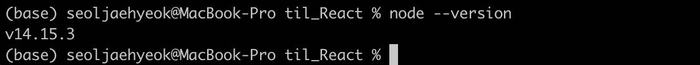
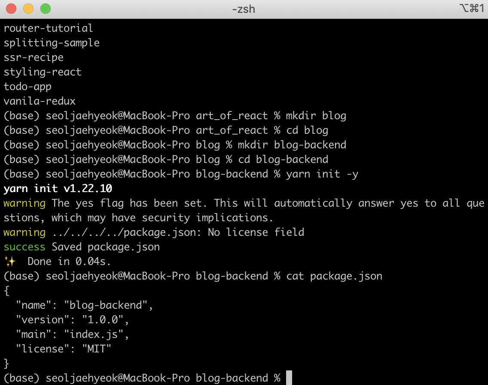
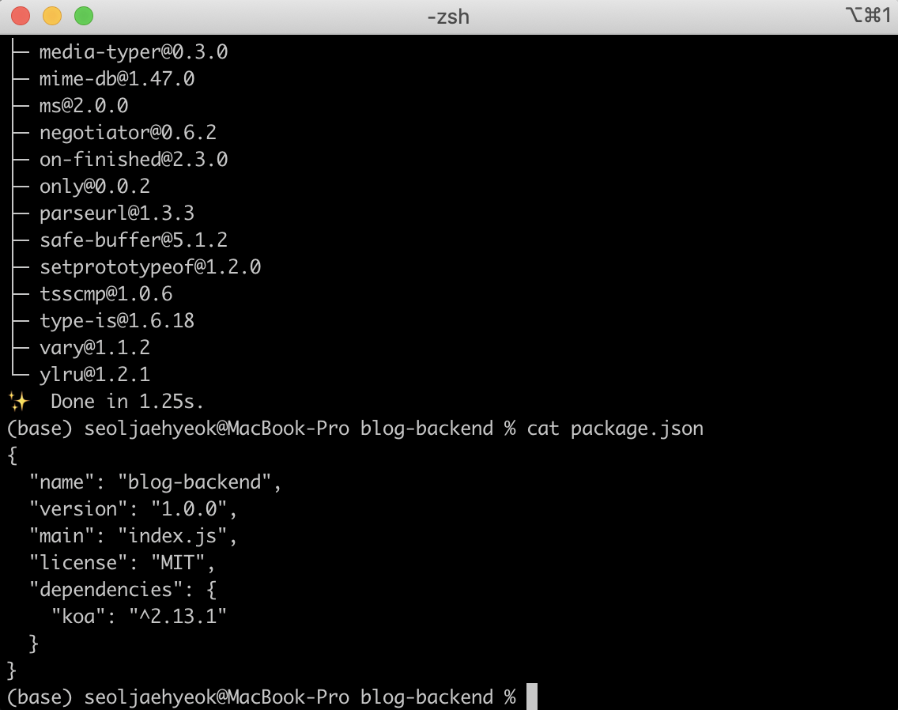
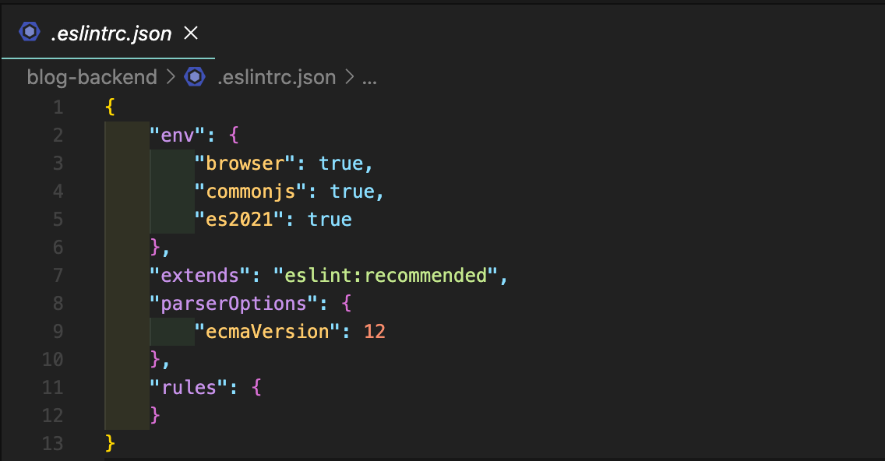

지금까지 리액트의 기본 개념을 대부분 다뤄 보았다. 웹 애플리케이션을 만들 때는 리액트 같은 프런트엔드 기술만으로 필요한 기능을 구현할 수 없는 경우가 흔하다. 데이터를 여러 사람과 공유하려면 저장할 공간이 필요하기 때문이다.

## 21.1 소개

#### 21.1.1 백엔드

서버를 만들어 데이터를 여러 사람과 공유할 때 데이터를 무작정 담지 않는다. 데이터를 담을 때는 여러 가지 규칙이 필요하다.

예를 들어 특정 데이터를 등록할 때 사용자 인증 정보가 필요할 수도 있고, 등록할 데이터를 어떻게 검증할지, 데이터의 종류가 다양하다면 어떻게 구분할지 등을 고려해야 한다. 

데이터를 조회할 때도 마찬가지다. 어떤 종류의 데이터를 몇 개씩 보여 줄지, 그리고 또 어떻게 보여 줄지 등에 관한 로직을 만드는 것을 서버 프로그래밍 또는 백엔드 프로그래밍이라고 한다.

백엔드 프로그래밍은 여러 언어로 작성할 수 있으나 여기서는 자바스크립트로 서버를 구현할 수 있는 Node.js를 사용해보도록 하자.

#### 21.1.2 Node.js

처음에는 자바스크립트를 웹 브라우저에서만 사용했다. 시간이 지나며 자바스크립트는 계속해서 발전했고 구글이 크롬을 소개하면서 V8이라는 자바스크립트 엔진도 공개했다. 이 자바스크립트 엔진을 기반으로 웹 브라우저뿐만 아니라 서버에서도 자바스크립트를 사용할 수 있는 런타임을 개발 했는데, 이게 바로 Node.js다.

#### 21.1.3 Koa

Node.js 환경에서 웹 서버를 구축할 때는 보통 Express, Hapi, Koa 등의 웹 프레임워크를 사용한다. 20장에서 SSR 서버를 구현할 때 Express를 사용했는데 21장에서는 Koa라는 프레임 워크를 사용해보도록 하자.

Koa는 Express의 기존 개발 팀이 개발한 프레임워크다. 

Express는 미들웨어, 라우팅, 템플릿, 파일 호스팅 등과 같은 다양한 기능이 자체적으로 내장되어 있는 반면, Koa는 미들웨어 기능만 갖추고 있으며 나머지는 다른 라이브러리를 적용하여 사용한다. 즉, Koa는 우리가 필요한 기능들만 붙여서 서버를 만들 수 있기 때문에 Express보다 훨씬 가볍다.

추가로 Koa는 async/await 문법을 정식으로 지원하기 때문에 비동기 작업을 더 편하게 관리할 수 있다.

이번 Node.js 기초 실습은 다음 흐름으로 진행된다.

> 작업 환경 준비  → Koa 서버 띄우기 → 미들웨어 알아보기 → koa-router를 통한 백엔드 라우팅 → 라우트 모듈화하기

## 21.2 작업 환경 준비

#### 21.2.1 Node 설치 확인

Node.js 개발을 하기 위해서는 당연히 Node.js 런타임이 설치되어 있어야 한다. 이미 1장에서 설치했기 때문에 제대로 설치되어 있는지 아래 명령어로 확인만 해보자.

` node --version`



#### 21.2.2 프로젝트 생성

이번에 만들 백엔드 프로젝트는 이 책에서 다루는 마지막 프로젝트인 블로그 서비스와 연돌할 서버다. Blog 디렉터리를 만들고, 그 내부에 blog-backend 디렉터리를 만들자. 해당 디렉터리에서 `yarn init -y` 명령어를 실행해 패키지 정보를 만들어 준다.

위 작업을 다 하면 디렉터리에 package.json 파일이 생성된다. 다음 명령어를 실행하여 해당 파일이 잘 만들어졌는지 확인해 보자.



이제 우리에게 필요한 Koa 웹 프레임워크를 설치해 보자.

`$ yarn add koa`

설치한 뒤 다시 한 번 package.json을 열어 보면 아래와 같이 koa가 dependencies에 추가 되어 있는 것을 확인할 수 있다.



#### 21.2.3 ESLint 와 Prettier 설정

서버 파일을 작성하기 전 ESLint와 Prettier를 프로젝트에 적용하자. 이는 자바스크립트 문법을 검사하고 깔끔한 코드를 작성하기 위해서다.

두 기능을 VSCode에서 사용하려면 VSCode 마켓에서 Prettier-Code formatter와 ESLint 확장 프로그램을 설치해 둔 상태여야 한다. 

먼저 ESLint를 설치한다.

`$ yarn add --dev eslint`

`$ yarn run aslant --init`

> ❗️ yarn add 명령어를 사용할 때 --dev는 개발용 의존 모듈로 설치한다는 의미다. 이렇게 설치하면 package.json에서 devDependencies 쪽에 모듈의 버전 정보가 입력된다.

설치를 하고 나면 프로젝트 리덱터리에 다음과 같은 파일이 생성된다.



이제 Prettier 설정을 하자. 먼저 Blog-backend 디렉터리에 아래와 같은 파일(**.prettierrc**)을 만든다.

```jsx
{
  "singleQuote": true,
  "semi": true,
  "useTabs": false,
  "tabWidth": 2,
  "trailingComma": "all",
  "printWidth": 80
}
```

다음으로 Prettier에서 관리하는 코드 스타일은 ESLint에서 관리하지 않도록 eslint-config-prettier를 설치하여 적용해 준다.

`$ yarn add aslant-config-prettier`

설치 후 다음 설정 파일을 만들면 된다.

```jsx
{
  "env": {
    "node": true,
    "commonjs": true,
    "es6": true
  },
  "extends": ["eslint:recommended", "prettier"],
  "globals": {
    "Atomics": "readonly",
    "SharedArrayBuffer": "readonly"
  },
  "parserOptions": {
    "ecmaVersion": 2018
  },
  "rules": {}
}
```

## 21.3 Koa 기본 사용법


