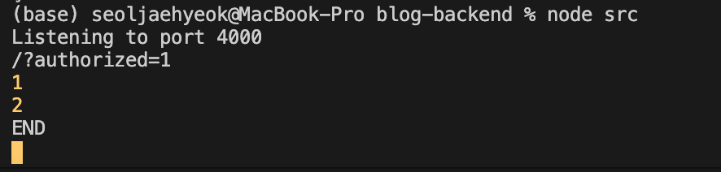
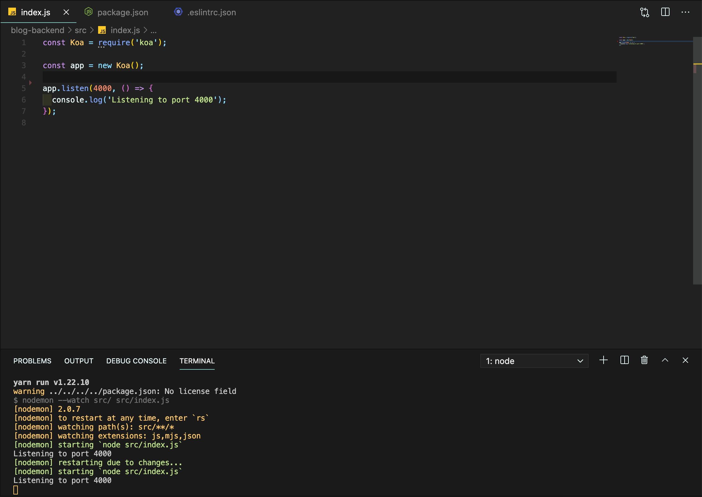
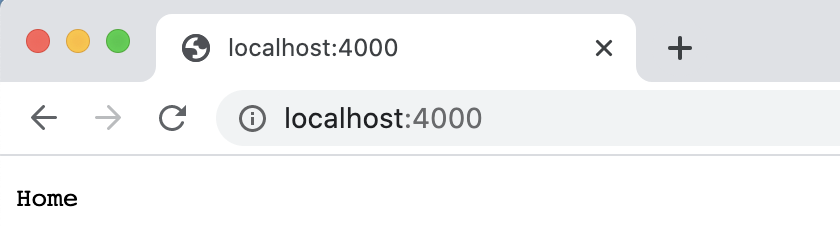
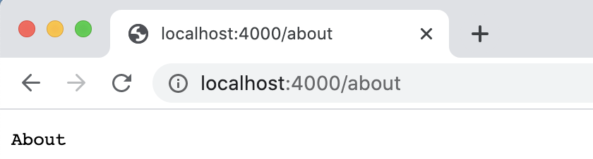
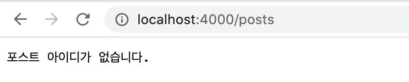
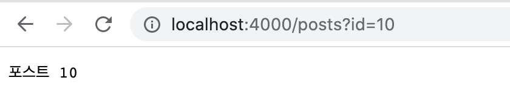

지금까지 리액트의 기본 개념을 대부분 다뤄 보았다. 웹 애플리케이션을 만들 때는 리액트 같은 프런트엔드 기술만으로 필요한 기능을 구현할 수 없는 경우가 흔하다. 데이터를 여러 사람과 공유하려면 저장할 공간이 필요하기 때문이다.

## 21.1 소개

#### 21.1.1 백엔드

서버를 만들어 데이터를 여러 사람과 공유할 때 데이터를 무작정 담지 않는다. 데이터를 담을 때는 여러 가지 규칙이 필요하다.

예를 들어 특정 데이터를 등록할 때 사용자 인증 정보가 필요할 수도 있고, 등록할 데이터를 어떻게 검증할지, 데이터의 종류가 다양하다면 어떻게 구분할지 등을 고려해야 한다. 

데이터를 조회할 때도 마찬가지다. 어떤 종류의 데이터를 몇 개씩 보여 줄지, 그리고 또 어떻게 보여 줄지 등에 관한 로직을 만드는 것을 서버 프로그래밍 또는 백엔드 프로그래밍이라고 한다.

백엔드 프로그래밍은 여러 언어로 작성할 수 있으나 여기서는 자바스크립트로 서버를 구현할 수 있는 Node.js를 사용해보도록 하자.

#### 21.1.2 Node.js

처음에는 자바스크립트를 웹 브라우저에서만 사용했다. 시간이 지나며 자바스크립트는 계속해서 발전했고 구글이 크롬을 소개하면서 V8이라는 자바스크립트 엔진도 공개했다. 이 자바스크립트 엔진을 기반으로 웹 브라우저뿐만 아니라 서버에서도 자바스크립트를 사용할 수 있는 런타임을 개발 했는데, 이게 바로 Node.js다.

#### 21.1.3 Koa

Node.js 환경에서 웹 서버를 구축할 때는 보통 Express, Hapi, Koa 등의 웹 프레임워크를 사용한다. 20장에서 SSR 서버를 구현할 때 Express를 사용했는데 21장에서는 Koa라는 프레임 워크를 사용해보도록 하자.

Koa는 Express의 기존 개발 팀이 개발한 프레임워크다. 

Express는 미들웨어, 라우팅, 템플릿, 파일 호스팅 등과 같은 다양한 기능이 자체적으로 내장되어 있는 반면, Koa는 미들웨어 기능만 갖추고 있으며 나머지는 다른 라이브러리를 적용하여 사용한다. 즉, Koa는 우리가 필요한 기능들만 붙여서 서버를 만들 수 있기 때문에 Express보다 훨씬 가볍다.

추가로 Koa는 async/await 문법을 정식으로 지원하기 때문에 비동기 작업을 더 편하게 관리할 수 있다.

이번 Node.js 기초 실습은 다음 흐름으로 진행된다.

> 작업 환경 준비  → Koa 서버 띄우기 → 미들웨어 알아보기 → koa-router를 통한 백엔드 라우팅 → 라우트 모듈화하기

## 21.2 작업 환경 준비

#### 21.2.1 Node 설치 확인

Node.js 개발을 하기 위해서는 당연히 Node.js 런타임이 설치되어 있어야 한다. 이미 1장에서 설치했기 때문에 제대로 설치되어 있는지 아래 명령어로 확인만 해보자.

` node --version`


#### 21.2.2 프로젝트 생성

이번에 만들 백엔드 프로젝트는 이 책에서 다루는 마지막 프로젝트인 블로그 서비스와 연돌할 서버다. Blog 디렉터리를 만들고, 그 내부에 blog-backend 디렉터리를 만들자. 해당 디렉터리에서 `yarn init -y` 명령어를 실행해 패키지 정보를 만들어 준다.

위 작업을 다 하면 디렉터리에 package.json 파일이 생성된다. 다음 명령어를 실행하여 해당 파일이 잘 만들어졌는지 확인해 보자.


이제 우리에게 필요한 Koa 웹 프레임워크를 설치해 보자.

`$ yarn add koa`

설치한 뒤 다시 한 번 package.json을 열어 보면 아래와 같이 koa가 dependencies에 추가 되어 있는 것을 확인할 수 있다.


#### 21.2.3 ESLint 와 Prettier 설정

서버 파일을 작성하기 전 ESLint와 Prettier를 프로젝트에 적용하자. 이는 자바스크립트 문법을 검사하고 깔끔한 코드를 작성하기 위해서다.

두 기능을 VSCode에서 사용하려면 VSCode 마켓에서 Prettier-Code formatter와 ESLint 확장 프로그램을 설치해 둔 상태여야 한다. 

먼저 ESLint를 설치한다.

`$ yarn add --dev eslint`

`$ yarn run aslant --init`

> ❗️ yarn add 명령어를 사용할 때 --dev는 개발용 의존 모듈로 설치한다는 의미다. 이렇게 설치하면 package.json에서 devDependencies 쪽에 모듈의 버전 정보가 입력된다.

설치를 하고 나면 프로젝트 리덱터리에 다음과 같은 파일이 생성된다.


이제 Prettier 설정을 하자. 먼저 Blog-backend 디렉터리에 아래와 같은 파일(**.prettierrc**)을 만든다.

```jsx
{
  "singleQuote": true,
  "semi": true,
  "useTabs": false,
  "tabWidth": 2,
  "trailingComma": "all",
  "printWidth": 80
}
```

다음으로 Prettier에서 관리하는 코드 스타일은 ESLint에서 관리하지 않도록 eslint-config-prettier를 설치하여 적용해 준다.

`$ yarn add aslant-config-prettier`

설치 후 다음 설정 파일을 만들면 된다.

```jsx
{
  "env": {
    "node": true,
    "commonjs": true,
    "es6": true
  },
  "extends": ["eslint:recommended", "prettier"],
  "globals": {
    "Atomics": "readonly",
    "SharedArrayBuffer": "readonly"
  },
  "parserOptions": {
    "ecmaVersion": 2018
  },
  "rules": {}
}
```

## 21.3 Koa 기본 사용법

#### 21.3.1 서버 띄우기

먼저 서버를 여는 방법부터 알아보자. index.js 파일에 다음 코드를 입력해 준다.

```jsx
const Koa = require('koa');

const app = new Koa();

app.use((ctx) => {
  ctx.body = 'hello world';
});

app.listen(4000, () => {
  console.log('Listening to port 4000');
});
```

서버를 포트 4000번으로 열고, 서버에 접속하면 'hello world'라는 텍스트를 반환하도록 설정했다.

서버를 한번 실행 해보면 아래와 같이 나오는 것을 확인할 수 있다.


원래 node를 통해 자바스크립트 파일을 실행할 때는 `$ node src/index.js` 와 같이 전체 경로를 입력하는 것이 맞지만, index.js 파일은 예외로 디렉터리까지만 입력해도 실행할 수 있다. 쉽게 말해 Index.js파일은 해당 디렉터리를 대표하는 파일이라고 생각하면 된다.

이제 웹 브라우저로 http://localhost:4000/에 접속해 보면 아래와 같이 정상적으로 hello world가 출력되는 것을 확인할 수 있다.


#### 21.3.2 미들웨어

Koa 애플리케이션은 미들웨어의 배열로 구성되어 있는데 조금 전 코드에서 app.use 함수를 사용했다. 이 함수는 미들웨어 함수를 애플리케이션에 등록한다.

미들웨어 함수는 다음과 같은 구조로 이루어져 있다.

```jsx
(ctx,next) => {
  
}
```

Koa의 미들웨어 함수는 두 개의 파라미터를 받는다. 첫 번째 파라미터는 조금 전에도 사용한 ctx라는 값이고, 두 번째 파라미터는 next라는 값이다.

ctx는 Context의 줄임말로 웹 요청과 응답에 관한 정보를 지니고 있다. next는 현재 처리중인 미들웨어의 다음 미들웨어를 호출하는 함수다. 미들웨어를 등록하고 next함수를 호출하지 않으면, 그다음 미들웨어를 처리하지 않는다.

만약 미들웨어에서 next를 사용하지 않으면 ctx => {}와 같은 형태로 파라미터에 next를 설정하지 않아도 괜찮다. 주로 다음 미들웨어를 처리할 필요가 없는 라우트 미들웨어를 나중에 설정할 때 이러한 구조로 next를 생략하여 미들웨어를 작성한다.

미들웨어는 app.use를 사용하여 등록되는 순서대로 처리된다. 다음과 같이 현재 요청을 받은 주소와 우리가 정해 준 숫자를 기록하는 두 개의 미들웨어를 작성해 보자.

```jsx
const Koa = require('koa');

const app = new Koa();

app.use((ctx, next) => {
  console.log(ctx.url);
  console.log(1);
  next();
});

app.use((ctx, next) => {
  console.log(2);
  next();
});

app.use((ctx) => {
  ctx.body = 'hello world';
});

app.listen(4000, () => {
  console.log('Listening to port 4000');
});
```

실행 중인 서버를 종료하고 다시 실행하게 되면 터미널에 아래와 같은 결과가 나타나는 것을 확인할 수 있다.


크롬 브라우저는 사용자가 웹 페이지에 들어가면 해당 사이트의 아이콘 파일인 /favicon.ico 파일을 서버에 요청하기 때문에 결과에  / 경로도 나타나고 /favicon.ico 경로도 나타나게 된다.

이번에는 첫 번째 미들웨어에서 호출하던 next()를 주석으로 처리하면 어떤 결과가 나오는지 알아보자.

```jsx
const Koa = require('koa');

const app = new Koa();

app.use((ctx, next) => {
  console.log(ctx.url);
  console.log(1);
  // next();
});

app.use((ctx, next) => {
  console.log(2);
  next();
});

app.use((ctx) => {
  ctx.body = 'hello world';
});

app.listen(4000, () => {
  console.log('Listening to port 4000');
});
```

위와 같이 첫 번째 미들웨어를 실행한 다음 next를 호출하지 않았으니 그 아래에 있는 미들웨어들은 모두 무시 되었다.

 

이러한 속성을 사용해서 조건부로 다음 미들웨어 처리를 무시하게 만들 수 있다. 아래 코드는 authorized=1이라는 쿼리 파라미터가 포함되어 있으면 이후 미들웨어를 처리해 주고, 그렇지 않으면 이후 미들웨어를 처리하지 않는 코드다.

```jsx
const Koa = require('koa');

const app = new Koa();

app.use((ctx, next) => {
  console.log(ctx.url);
  console.log(1);
  if (ctx.query.authorized !== '1') {
    ctx.status = 401; // Unauthorized
    return;
  }
  next();
});

app.use((ctx, next) => {
  console.log(2);
  next();
});

app.use((ctx) => {
  ctx.body = 'hello world';
});

app.listen(4000, () => {
  console.log('Listening to port 4000');
});
```

쿼리 파라미터는 문자열이기에 비교할 때는 꼭 문자열 형태로 비교해야 한다. 서버를 재시작한 뒤 아래 링크에 들어가면 다음과 같은 결과가 나타나게 된다.

- http://localhost:4000/
- http://localhost:4000/?authorized=1


지금은 단순히 주소의 쿼리 파라미터를 사용하여 조건부로 처리했지만, 나중에는 웹 요청의 쿠키 혹은 헤더를 통해 처리할 수도 있다.

**21.3.2.1 next 함수는 Promise를 반환**

**next 함수를 호출하면 Promise를 반환한다**. 이는 Koa가 Express와 차별화되는 부분이다.

Next 함수가 반환하는 Promise는 다음에 처리해야 할 미들웨어가 끝나야 완료된다. 다음과 같이 next 함수 호출 이후에 then을 사용하여 Promise가 끝난 다음 콘솔에 END를 기록하도록 수정해보자.

```jsx
const Koa = require('koa');

const app = new Koa();

app.use((ctx, next) => {
  console.log(ctx.url);
  console.log(1);
  if (ctx.query.authorized !== '1') {
    ctx.status = 401; // Unauthorized
    return;
  }
  next().then(() => {
    console.log('END');
  });
});

app.use((ctx, next) => {
  console.log(2);
  next();
});

app.use((ctx) => {
  ctx.body = 'hello world';
});

app.listen(4000, () => {
  console.log('Listening to port 4000');
});
```

저장한 후 서버를 재시작하고 http://localhost:4000/?authorized=1 주소로 들어가 보면 아래와 같이 첫 번째 미들웨어 다음에 처리해야 미들웨어 (console.log(2))가 끝난 뒤에 Promise를 반환하고 그런 다음 END를 출력하는 것을 확인할 수 있다.



**20.3.2.2 async/await 사용**

Koa는 async/await를 정식으로 지원하기 때문에 해당 문법을 아주 편안하게 사용할 수 있다. 기존 코드를 async/await를 사용하는 형태로 한번 수정해보자.

> SSR을 할 때 사용하던 Express도 async/await 문법을 사요할 수 있지만, 오류를 처리하는 부분이 제대로 작동하지 않을 수 있다. 백엔드 개발을 하면서 예상치 못한 에러를 제대로 잡아내려면 express-async-errors라는 라이브러리를 따로 사용해야 한다.

```jsx
const Koa = require('koa');

const app = new Koa();

app.use(async (ctx, next) => {
  console.log(ctx.url);
  console.log(1);
  if (ctx.query.authorized !== '1') {
    ctx.status = 401; // Unauthorized
    return;
  }
  await next();
  console.log('END');
});

app.use((ctx, next) => {
  console.log(2);
  next();
});

app.use((ctx) => {
  ctx.body = 'hello world';
});

app.listen(4000, () => {
  console.log('Listening to port 4000');
});
```

서버를 재시작한 뒤  http://localhost:4000/?authorized=1 주소로 들어가보면 이전과 똑같이 작동하는 것을 확인할 수 있다.

## 21.4 nodemon 사용하기

서버 코드를 변경할 때마다 서버를 재시작하는 것은 꽤나 번거로울 수 있다. nodemon이라는 도구를 사용하면 코드를 변경할 때마다 자동으로 서버를 재시작해 준다. 

우선 이 도구를 개발용 의존 모듈로 설치를 해준다.

`$ yarn add --dev nodemon`

그 다음 package.json에 scripts를 다음과 같이 입력해 준다.

```jsx
{
  "name": "blog-backend",
  "version": "1.0.0",
  "main": "index.js",
  "license": "MIT",
  "dependencies": {
    "eslint-config-prettier": "^8.2.0",
    "koa": "^2.13.1"
  },
  "devDependencies": {
    "eslint": "^7.24.0",
    "nodemon": "^2.0.7"
  },
  "scripts": {
    "start": "node src",
    "start:dev": "nodemon --watch src/ src/index.js"
  }
}
```

Start 스크립트에는 서버를 시작하는 명령어를 넣고, start:dev 스크립트에는 nodemon을 통해 서버를 실행해 주는 명령어를 넣었다. 여기서 nodemon은 src 디렉터리를 주시하고 있다가 해당 디렉터리 내부의 어떤 파일이 변경되면, 이를 감지하여 src/index.js 파일을 재시작해 준다.

이제부터는 다음 명령어를 사용해 서버를 시작할 수 있다.

`$ yarn start # 재시작이 필요 없을 때`

`$ yarn start:dev # 재시작이 필요할 때`

기존에 실행중이던 서버를 종료한 뒤 yarn start:dev 명령어를 통해 서버를 실행하고 index.js 파일의 기존 미들웨어를 모두 제거하면 nodemon이 src 디렉터리을 주시하고 있다가 변경사항이 확인되면 이를 감지하여 src/index.js 파일을 재시작해 주는 것을 확인할 수 있다.



## 21.5 koa-router 사용하기

앞에서 리액트를 배울 때 웹 브라우저의 라우팅을 돕는 리액트 라우터 라이브러리를 사용해 봤다. Koa를 사용할 때도 다른 주소로 요청이 들어올 경우 다른 작업을 처리할 수 있도록 라우터를 사용해야 한다. Koa 자체에 이 기능이 내장되어 있지 않으므로 koa-router 모듈을 설치해야 한다.

#### 21.5.1 기본 사용법

Index.js에서 라우터를 불러와 적용하는 방법을 알아보자

```jsx
const Koa = require('koa');
const Router = require('koa-router');

const app = new Koa();
const router = new Router();

// 라우터 설정
router.get('/', (ctx) => {
  ctx.body = 'Home';
});
router.get('/about', (ctx) => {
  ctx.body = 'About';
});

// app 인스턴스에 라우터 적용
app.use(router.routes()).use(router.allowedMethods());

app.listen(4000, () => {
  console.log('Listening to port 4000');
});
```

koa-router를 불러온 뒤 이를 사용하여 Router 인스턴스를 만들었다. 그리고 '/' 경로로 들어오면 'Home'을 띄우고 '/about' 경로로 들어오면 'About' 텍스트가 나타나도록 설정했다.

이처럼 **라우트를 설정할 때 router.get의 첫 번째 파라미터에는 라우트의 경로를 넣고, 두 번째 파라미터에는 해당 라우트에 적용할 미들웨어 함수를 넣는다. ** 여기서 get 키워드는 해당 라우트에서 사용할 HTTP 메서드를 의미한다. get 대신에 post, put, delete 등을 넣을 수 있다.

코드를 저장하고  http://localhost:4000/와  http://localhost:4000/about 페이지를 들어가보면 아래와 같이 내가 설정한 텍스트들이 나타나는 것을 확인할 수 있다.





#### 21.5.2 라우트 파라미터와 쿼리

이번에는 라우트의 파라미터와 쿼리를 읽는 방법을 알아보도록 하자. **라우터의 파라미터를 설정할 때는 /about/:name 형식으로 콜론을 사용**하여 라우트 경로를 설정하는데 리액트 라우터에서 설정했을 때와 비슷한 것을 알 수 있다. 또 **파라미터가 있을 수도 있고 없을 수도 있다면 /about/:name?** 과 같이 파라미터 이름 뒤에 ?를 사용한다. 이렇게 **설정한 파라미터는 함수의 ctx.params 객체에서 조회**할 수 있다.

URL 쿼리의 경우, 예를 들어 **/posts/?id=10 같은 형식으로 요청했다면 해당 값 ctx.query에서 조회**할 수 있다. 쿼리 문자열을 자동으로 객체 형태로 파싱해 주므로 별도로 파싱 함수를 돌릴 필요가 없다(문자열 형태의 쿼리 문자열을 조회해야 할 때는 ctx.querystring을 사용한다.).

파라미터와 쿼리를 사용하는 라우트를 다음과 같이 만들어 보자.

```jsx
const Koa = require('koa');
const Router = require('koa-router');

const app = new Koa();
const router = new Router();

// 라우터 설정
router.get('/', (ctx) => {
  ctx.body = 'Home';
});

router.get('/about/name:?', (ctx) => {
  const { name } = ctx.params;
  // name의 존재 유무에 따라 다른 결과 출력
  ctx.body = name ? `${name}의 소개` : '소개';
});

router.get('/posts', (ctx) => {
  const { id } = ctx.query;
  ctx.body = id ? `포스트 ${id}` : '포스트 아이디가 없습니다.';
});
router.get('/about', (ctx) => {
  ctx.body = 'About';
});

// app 인스턴스에 라우터 적용
app.use(router.routes()).use(router.allowedMethods());

app.listen(4000, () => {
  console.log('Listening to port 4000');
});
```

코드를 저장한 다음 아래의 주소로 들어가 보자.

- http://localhost:4000/about/seoljaehyeok
- http://localhost:4000/posts
- http://localhost:4000/posts?id=10

들어가보면 아래와 같이 내가 설정한 값들이 화면에 나오는 것을 확인할 수 있다.






파라미터와 쿼리는 둘 다 주소를 통해 특정 값을 받아 올 때 사용하지만, 용도가 서로 조금씩 다르다. 정해진 규칙은 따로 없지만, **일반적으로 파라미터는 처리할 작업의 카테고리를 받아 오거나, 고유 ID 혹은 이름으로 특정 데이터를 조회할 때 사용**한다. 반면, **쿼리는 옵션에 관련된 정보를 받아 온다**. 예를 들어 여러 항목을 리스팅하는 API라면, 어떤 조건을 만족하는 항목을 보여 줄지 또는 어떤 기준으로 정렬할지를 정해야 할 때 쿼리를 사용한다. 

#### 21.5.3 REST API

웹 애플리케이션을 만들려면 데이터베이스에 정보를 입력하고 읽어 와야 한다. 그런데 웹 브라우저에서 데이터 베이스에 직접 접속하여 데이터를 변경한다면 보안상 문제가 있을 수 있다. 그렇기에 REST API를 만들어서 사용한다.


클라이언트가 서버에 자신이 데이터를 조회, 생성, 삭제, 업데이트하겠다고 요청하면, 서버에 필요한 로직에 따라 데이터베이스에 접근하여 작업을 처리한다. 

REST API는 요청 종류에 따라 다른 HTTP 메서드를 사용한다. HTTP 메서드에는 여러 종류가 있지만 주로 사용하는 메서드는 다음과 같다.

| 메서드 | 설명                                                         |
| ------ | ------------------------------------------------------------ |
| GET    | 데이터를 조회할 때 사용한다.                                 |
| POST   | 데이터를 등록할 때 사용한다. 인증 작업을 거칠 때 사용하기도 한다. |
| DELETE | 데이터를 지울 때 사용한다.                                   |
| PUT    | 데이터를 새 정보로 통째로 교체할 때 사용한다.                |
| PATCH  | 데이터의 특정 필드를 수정할 때 사용한다.                     |

메서드의 종류에 따라 get, post, delete, put, patch를 사용하여 라우터에서 각 메서드의 요청을 처리한다. 21.5.2 절에서 작성한 라우트에는 router.get이라고 작성을 했었다. 여기서 get이 바로 HTTP 메서드 GET이 된다.

REST API를 설계할 때는 API 주소와 메서드에 따라 어떤 역할을 하는지 쉽게 파악할 수 있도록 작성해야 한다. 블로그 포스트용 REST API를 예시로 살펴보면 다음과 같다.

| 종류                                 | 기능                                                       |
| ------------------------------------ | ---------------------------------------------------------- |
| POST/posts                           | 포스트 작성                                                |
| GET/posts                            | 포스트 목록 조회                                           |
| GET/posts/:id                        | 특정 포스트 조회                                           |
| DELETE/posts/:id                     | 특정 포스트 삭제                                           |
| PATCH/posts/:id                      | 특정 포스트 업데이트(구현 방식에 따라 PUT으로도 사용 가능) |
| POST/posts/:id/comments              | 특정 포스트에 덧글 등록                                    |
| GET/posts/:id/comments               | 특정 포스트의 덧글 목록 조회                               |
| DELETE/posts/:id/comments/:commentId | 특정 포스트의 특정 덧글 삭제                               |


