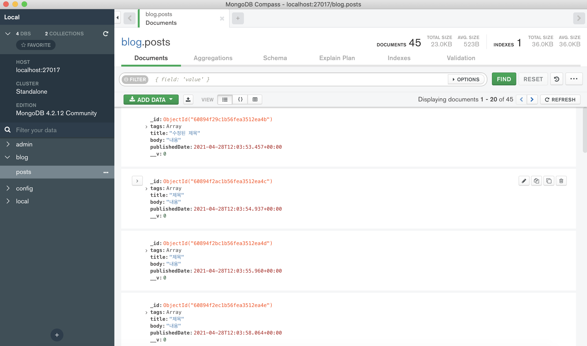

이 장에서는 우리가 만들 Node.js 서버와 MongoDB를 연동할 수 있도록 MongoDB 기초 지식을 알아 본다. 그리고 mongoose를 이용하여 서버에서 직접 데이터를 추가, 조회, 삭제, 수정 하는 방법 또한 알아본다.

이번 실습은 다음과 같은 흐름으로 진행된다.

> MongoDB 기본 지식 알아보기 → 작업 환경 설정하기 → mongoose로 데이터베이스 연결하기 → esm로 ES 모듈 import/export 문법 사용하기 → 스키마와 모델 이해하기 → REST API 구현하기 → 페이지네이션 구현하기

## 22.1 소개

서버를 개발할 때 데이터베이스를 사용하면 웹 서비스에서 사용되는 데이터를 저장하고, 효율적으로 조회하거나 수정할 수 있다. 기존에는 MySQL, OracleDB, PostgreSQL 같은 RDBMS(관계형 데이터베이스)를 자주 사용했다.

그런데 관계형 데이터베이스는 몇 가지 한계가 있다.

첫 번째는 **데이터 스키마가 고정적이라는 것**이다. 여기서 스키마란 **데이터베이스에 어떤 형식의 데이터를 넣을지에 대한 정보** 를 뜻한다. 예를 들어 회원 정보 스키마라면 계정명, 이메일, 이름 등이 될 것이다. 새로 등록하는 데이터 형식이 기존에 있던 데이터들과 다르다면 기존 데이터를 모두 수정해야 새 데이터를 등록할 수 있다. 그래서 데이터양이 많을 때는 데이터베이스의 스키마를 변경하는 작업이 매우 번거로워질 수 있다.

두 번째는 **확장성**이다. RDBMS는 저장하고 처리해야 할 데이터양이 늘어나면 여러 컴퓨터에 분산시키는 것이 아니라, 해당 데이터베이스 서버의 성능을 업그레이드 하는 방식으로 확장해 주어야 했다.

MongoDB는 이런 한계를 극복한 문서 지향적 NoSQL 데이터베이스다. 이 데이터베이스에 등록하는 데이터들은 유동적인 스키마를 지닐 수 있다. **종류가 같은 데이터라고 하더라도, 새로 등록해야 할 데이터 형식이 바뀐다고 하더라도 기존 데이터까지 수정할 필요는 없다.** 서버의 데이터양이 늘어나도 한 컴퓨터에서만 처리하는 것이 아니라 여러 컴퓨터로 분산하여 처리할 수 있도록 확장하기 쉽게 설계되어 있다.

물론 MongoDB가 무조건 RDBMS보다 좋은 것은 아니다. 예를 들어 데이터의 구조가 자주 바뀐다면 MongoDB가 유리하지만, 까다로운 조건으로 데이터를 필터링해야 하거나 ACID 특성을 지켜야 한다면 RDBMS가 더 유리할 수 있다.

> ❗️ACID 특성이란 원자성(Atomicity), 일관성(Consistency), 고립성(Isolation), 지속성(Durability)의 앞 글자를 따서 만든 용어로, 데이터베이스 트랜잭션이 안전하게 처리되는 것을 보장하기 위한 성질을 의미

앞으로 구현하게 될 서버는 RDBMS로도 만들 수 있고, MongoDB로도 만들 수 있다. MongoDB를 사용하는 이유는 조금만 배워도 유용하게 활용할 수 있기 때문이다. 

#### 22.1.1 문서란?

여기서 말하는 *'문서(documents)'* 는 RDBMS의 *레코드('record')* 와 개념이 비슷하다. 문서의 데이터 구조는 한 개 이상의 키-값 쌍으로 되어 있다.

아래는 MongoDB에서 사용하는 문서 예시다.

```jsx
{
	"_id": ObjectId("55099803df3f4948bd2f98391"),
  "username": "milkboy",
  "name": { first: "J.H", last: "Seol"}
}
```

문서는 BSON(바이너리 형태의 JSON) 형태로 저장된다. 그렇기 때문에 나중에 JSON 형태의 객체를 데이터베이스에 저장할 때, 큰 공수를 들이지 않고도 데이터를 데이터베이스에 등록할 수 있어 매우 편하다.

새로운 문서를 만들면 _id라는 고윳값을 자동으로 생성하는데, 이 값은 시간, 머신 아이디, 프로세스 아이디, 순차 번호로 되어 있어 값의 고유함을 보장한다.

여러 문서가 들어 있는 곳을 *컬렉션*이라고 한다. 기존 RDBMS에서는 테이블 개념을 사용하므로 각 테이블마다 같은 스키마를 가지고 있어야 한다. 새로 등록해야 할 데이터가 다른 스키마를 가지고 있다면, 기존 데이터들의 스키마도 모두 바꾸어 주어야 한다.

반면 MongoDB는 다른 스키마를 가지고 있는 문서들이 한 컬렉션에서 공존할 수 있다. 다음 예시를 한번 보자.

```jsx
{
  "_id": ObjectId("594948a081ad6e0ea526f3f5"),
  "username": "milkboy"
},
{
  "_id": ObjectId("594948fca1ad6q4ed5f7f1c4"),
  "username": "milkboy2",
  "phone": "010-9996-3326"
}
```

처음에는 데이터에 전화번호가 필요 없었는데, 나중에 필요해졌다고 가정해 보자. RDBMS에서는 한 테이블의 모든 데이터가 같은 스키마를 가져야 하기 때문에, 기존 데이터 전체를 일일이 수정해야 한다. 하지만 MongoDB에서는 컬렉션 안의 데이터가 같은 스키마를 가질 필요가 없으므로 그냥 넣어 주면 된다.

#### 22.1.2 MongoDB 구조

MongoDB 구조는 다음과 같다. 서버 하나에 데이터베이스를 여러 개 가지고 있을 수 있다. 각 데이터베이스에는 여러 개의 컬렉션이 있으며, 컬렉션 내부에는 문서들이 들어 있다.


#### 22.1.3 스키마 디자인

MongoDB에서 스키마를 디자인하는 방식은 기존 RDBMS에서 스키마를 디자인하는 방식과 완전히 다르다. RDBMS에서 블로그용 데이터 스키마를 설계한다면 각 포스트, 댓글마다 테이블을 만들어 필요에 따라 *JOIN* 해서 사용하는 것이 일반적이다.

RDBMS에서 데이터베이스를 설계한다면 그 구조는 다음과 유사하다.


하지만 NoSQL에서는 그냥 모든 것을 문서 하나에 넣는다. 문서 예시의 형식을 한번 보게 되면

```javascript
{
  _id: ObjectId,
  title: String,
  body: String,
  username: String,
  createdDate: Date,  
  comments: [
    {
      _id: ObjectId,
      text: String,
      createdDateL Date,
    },
  ],
};
```

이런 상황에서 보통 MongoDB는 댓글을 포스트 문서 내부에 넣는다. 문서 내부에 또 다른 문서가 위치할 수 있는데, 이를 *서브다큐먼트(subdocument)*라고 한다. 서브다큐먼트 또한 일반 문서를 다루는 것처럼 쿼리할 수 있다.

문서 하나에는 최대 16MB만큼 데이터를 넣을 수 있는데 100자 댓글 데이터라면 대략 0.24KB를 차지한다. 16MB는 16,384KB이니 문서 하나에 댓글 데이터를 약 68000개 넣을 수 있는 것이다. 

서브 다큐먼트에서 이 용량을 초과할 가능성이 있다면 컬렉션을 분리시키는 것이 좋다.

## 22.2 MongoDB 서버 준비

#### 22.2.1 설치

MongoDB 서버를 사용하려면 우선 설치를 해야 한다.

**macOS**

macOS 사용사는 Homebrew를 이용하여 간편하게 설치할 수 있다.

`$ brew tap mongdb/brew`

`$ brew install mongodb-community@4.2`

`$ brew services start mongodb-community@4.2`

위 명령어를 입력하게 되면 설치할 수 있다.

(본인은 macOS를 사용중이므로 따로 윈도우 및 리눅스 환경에서의 설치법은 다루지 않겠다)

#### 22.2.2 MongoDB 작동 확인

MongoDB가 성공적으로 설치되었고 제대로  가동 중인지 확인하려면, 터미널에서 mongo를 입력하면 터미널 기반의 MongoDB 클라이언트가 실행되는 것을 확인할 수 있다.


> ❗️
>
> 처음 mongo 명령어를 터미널에 실행하니 zsh: command not found: mongo 오류가 발생했었다.
>
> 이를 해결하기 위해 경로를 따로 설정을 해주는 작업을 거쳤는데
>
> .zshrc 파일 내에 들어가 **export PATH="$PATH:/usr/local/Cellar/mongodb-community@4.2/4.2.12/bin"** 
>
> 위 문장을 추가를 해줘서 해당 명령어의 경로를 저 위치로 설정을 해주니 해결이 됐다.

## 22.3 mongoose의 설치 및 적용

mongooose는 Node.js 환경에서 사용하는 MongoDB 기반 ODM(Object Data Modelling) 라이브러리다. 이 라이브러리는 데이터베이스 문서들을 자바스크립트 객체처럼 사용할 수 있게 해 준다.

우선 백엔드 프로젝트 디렉터리에서 아래 명령어를 입력해 라이브러리들을 설치해 준다.

`$ yarn add mongoose dotenv`

dotenv는 환경변수들을 파일에 넣고 사용할 수 있게 하는 개발 도구다. mongoose를 사용하여 MongoDB에 접속할 때, 서버에 주소나 계정 및 비밀번호가 필요할 경우도 있다. 이렇게 **민감하거나 환경별로 달라질 수 있는 값은 코드 안에 직접 작성하지 않고, 환경변수로 설정하는 것이 좋다.** 프로젝트를 깃허브, 깃랩 등의 서비스에 올릴 때는 .gitignore를 작성하여 환경변수가 들어 있는 파일은 제외시켜 주어야 한다.

#### 22.3.1 .env 환경변수 파일 생성

환경번수에는 서버에서 사용할 포트와 MongoDB 주소를 넣어 주도록 하자. 프로젝트의 루트 경로에 .env 파일을 만들고 아래와 같이 입력해 준다.

```jsx
PORT=4000
MONGO_URI=mongodb://localhost:27017/blog
```

여기서 blog는 우리가 사용할 데이터베이스 이름이다. 지정한 데이터베이스가 서버에 없다면 자동으로 만들어 주므로 사전에 직접 생성할 필요는 없다.

다음으로 src/index.js 파일의 맨 위에 다음과 같이 dotenv를 불러와서 config()함수를 호출해 준다. Node.js에서 환경변수는 process.env 값을 조회할 수 있다.

```jsx
require('dotenv').config();
const Koa = require('koa');
const Router = require('koa-router');
const bodyParser = require('koa-bodyparser');

// 비구조화 할당을 통해 process.env 내부 값에 대한 레퍼런스 만들기
const { PORT } = process.env;

const api = require('./api');

const app = new Koa();
const router = new Router();

// 라우터 설정
router.use('/api', api.routes()); // api 라우트 적용

// 라우터 적용 전에 bodyParser 적용
app.use(bodyParser());

// app 인스턴스에 라우터 적용
app.use(router.routes()).use(router.allowedMethods());

// PORT가 지정되어 있지 않다면 4000을 사용
const port = PORT || 4000;
app.listen(port, () => {
  console.log('Listening to port %d', port);
});
```

.env 파일에서 PORT를 4001로 변경한 뒤 서버를 재시작 해보면 (nodemon에서는 .env 파일을 변경할 때는 자동으로 재시작 하지 않으므로 직접 재시작 해야 한다.)


위와 같이 바뀐 포트로 실행이 되는 것으 확인할 수 있다.

#### 22.3.2 mongoose로 서버와 데이터베이스 연결

이 mongoose를 이용하여 서버와 데이터베이스를 연결해보자. 연결할 때는 mongoose의 connect 함수를 사용한다.

```jsx
require('dotenv').config();
const Koa = require('koa');
const Router = require('koa-router');
const bodyParser = require('koa-bodyparser');
const mongoose = require('mongoose');

// 비구조화 할당을 통해 process.env 내부 값에 대한 레퍼런스 만들기
const { PORT, MONGO_URI } = process.env;

mongoose
  .connect(MONGO_URI, {
    useNewUrlParser: true,
    useFindAndModify: false,
    useUnifiedTopology: true,
  })
  .then(() => {
    console.log('Connected to MongoDB');
  })
  .catch((e) => {
    console.log(e);
  });

(...)
```

코드를 저장한 뒤 터미널을 보면 아래와 같은 문구가 나오는데 이는 데이터베이스가 성공적으로 연결된 것이고 mongoose를 사용할 준비가 끝난다.


> ❗️
>
> 책에 서술된대로 입력하니 
>
> Warning: Current Server Discovery and Monitoring engine is deprecated, and will be removed in a future version. To use the new Server Discover and Monitoring engine, pass option { useUnifiedTopology: true } to the MongoClient constructor.
>
> 위와 같은 경고문이 나왔다.  이는 현재 서버 검색 및 모니터링 엔진은 더이상 사용되지 않으면 이후 버전에서 제거된다는 뜻이기에 
>
>  useUnifiedTopology: true 이 옵션을 MongoClient 생성자에게 전달해주면서 해결했다.

## 22.4 esm으로 ES 모듈 import/export 문법 사용하기

기존 리액트 프로젝트에서 사용해 오던 ES 모듈 import/export 문법은 Node.js에서 아직 정식으로 지원되지 않는다. Node.js에 해당 기능이 구현되어 있기는 하지만 아직 실험적인 단계이기 때문에 기본 옵션으로는 사용할 수 없으며, 확장자를 .mjs로 사용하고 node를 실행할 때 --experimental-modules라는 옵션을 넣어 주어야 한다.

Node.js에서 import/export 문법을 꼭 사용해야 할 필요는 없지만, 이 문법을 사용하면 VSC에서 자동 완성을 통해 모듈을 자동으로 쉽게 불러올 수 있고 코드도 더욱 깔끔해진다. 그래서 esm이라는 라이브러리를 이용해 해당 문법을 사용해보도록 하자.

먼저 `$ yarn add esm` 으로 라이브러리를 설치해 주고 기존 src/index.js 파일의 이름을 main.js로 변경하고, index.js 파일을 새로 생성해서 다음과 같이 입력해 준다.

```jsx
// 이 파일에서만 no-global-assgin ESLint 옵션을 비활성화 한다.
// eslint-disable no-global-assign

require = require('esm')(module /*, option */);
module.exports = require('./main.js');
```

그런 다음 package.json에서 만들었던 스크립트를 조금 수정해 준다.

```jsx
{
  (...)
  "scripts": {
    "start": "node -r esm src",
    "start:dev": "nodemon --watch src/ -r esm src/index.js"
  }
}

```

ESLint에서 import/export 구문을 사용해도 오류로 간주하지 않도록 다음과 같이 .eslintrc.json에서 soureType 값을 "module"로 설정해 준다.

```jsx
{
  "env": {
    "node": true,
    "commonjs": true,
    "es6": true
  },
  "extends": ["eslint:recommended", "prettier"],
  "globals": {
    "Atomics": "readonly",
    "SharedArrayBuffer": "readonly"
  },
  "parserOptions": {
    "ecmaVersion": 2018,
    "soureType": "module"
  },
  "rules": {}
}

```

이제 프로젝트에서 import/export 구문을 자유롭게 사용할 수 있다. 

기존에 실행 중이던 서버는 종료하고, 다시 `yarn start:dev` 명령어를 입력하고 새로운 스크립트로 서버를 구동한다.

#### 22.4.1 기존 코드 ES Module 형태로 바꾸기

먼저 api/posts/posts.ctrl.js 파일을 열어 exports 코드를 export const로 모두 변환해 준다.

```jsx
(...)
export const write = (ctx) => {
  (...)
};

export const list = (ctx) => {
  ctx.body = posts;
};

export const read = (ctx) => {
  (...)
};

export const remove = (ctx) => {
  (...)
};

export const replace = (ctx) => {
	(...)
};

export const update = (ctx) => {
  (...)
};
```

다음 src/api/posts/index.js 파일 수정하자.

```jsx
import Router from 'koa-router';
import * as postsCtrl from './posts.ctrl';

const posts = new Router();

posts.get('/', postsCtrl.list);
posts.post('/', postsCtrl.write);
posts.get('/:id', postsCtrl.read);
posts.delete('/:id', postsCtrl.remove);
posts.put('/:id', postsCtrl.replace);
posts.patch('/:id', postsCtrl.update);
export default posts;
```

이제 다음 두 파일을 수정하자.

```jsx
import Router from 'koa-router';
import posts from './posts';

const api = new Router();

api.use('/posts', posts.routes());

// 라우터를 내보낸다.
export default api;
```

```jsx
require('dotenv').config();
import Koa from 'koa';
import Router from 'koa-router';
import bodyParser from 'koa-bodyparser';
import mongoose from 'mongoose';

import api from './api';

// 비구조화 할당을 통해 process.env 내부 값에 대한 레퍼런스 만들기
const { PORT, MONGO_URI } = process.env;

(...)
```

이제 Postman으로 http://localhost:4000/api/posts에 요청을 보내면 우리가 만든 서버가 오류 발생으로 종료되지 않고 잘 작동하는 것을 확인할 수 있다.

이제 마지막으로 프로젝트 루트 디렉터리에 jsconfig.json을 작성해 준다.

```jsx
{
  "compilerOptions": {
    "target": "es6",
    "module": "es2015"
  },
  "include": ["src/**/*"]
}
```

이 파일을 위 코드와 같이 작성해 주면 나중에 자동 완성을 통해 모듈을 불러올 수 있다. Src 디렉터리에 sample.js라는 파일을 작성하고, api를 입력했을 때 자동 완성할 수 있는 인텔리센스창이 뜨는지 확인해 보자.


이 상태에서 엔터를 누르면 import가 잘 될 것이다. 확인이 됐으면 sample.js는 삭제해 준다.

## 22.5 데이터베이스의 스키마와 모델

mongoose에는 스키마와 모델이라는 개념이 있는데, 이 둘은 혼동하기 쉽다. 스키마는 컬렉션에 들어가는 문서 내부의 각 필드가 어떤 형식으로 되어 있는 지 정의하는 객체다. 이와 달리 모델은 스키마를 사용하여 만드는 인스턴스로, 데이터베이스에서 실제 작업을 처리할 수 있는 함수들을 지니고 있는 객체다.


#### 22.5.1 스키마 생성

모델을 만들려면 사전에 스키마를 만들어 주어야 한다. 우리는 블로그 포스트에 대한 스키마를 준비할 텐데, 어떤 데이터가 필요할지 한 번 생각해보자.

- 제목
- 내용
- 태그
- 작성일

포스트 하나에 이렇게 총 네 가지 정보가 필요하다. 각 정보에 대한 필드 이름과 데이터 타입을 설정하여 스키마를 만든다.

| 필드 이름     | 데이터 타입 | 설명      |
| ------------- | ----------- | --------- |
| title         | 문자열      | 제목      |
| body          | 문자열      | 내용      |
| tags          | 문자열 배열 | 태그 목록 |
| publishedDate | 날짜        | 작성 날짜 |

이렇게 네 가지 필드가 있는 스키마를 만들어 보자. 스키마와 모델에 관련된 코드는 src/models 디렉터리에 작성한다. 이렇게 디렉터리를 따로 만들어서 관리하면 나중에 유지 보수를 좀 더 편하게 할 수 있다. models 디렉터리를 만들고, 그 안에 post.js 파일을 만들어 아래와 같이 작성해 준다.

```jsx
import mongoose from 'mongoose';

const { Schema } = mongoose;

const PostSchema = new Schema({
  title: String,
  body: String,
  tags: [String], // 문자열로 이루어진 배열
  publishedDate: {
    type: Date,
    default: Date.now, // 현재 날짜를 기본값으로 지정
  },
});
```

스키마를 만들 때는 mongoose 모듈의 Schema를 사용하여 정의한다. 그리고 각 필드 이름과 필드의 데이터 타입 정보가 들어 있는 객체를 작성한다. 필드의 기본값으로는 default 값을 설정해 주면 된다.

Schema에서 기본적으로 지원하는 타입을 다음과 같다.

| 타입                            | 설명                                         |
| ------------------------------- | -------------------------------------------- |
| String                          | 문자열                                       |
| Number                          | 숫자                                         |
| Date                            | 날짜                                         |
| Buffer                          | 파일을 담을 수 있는 버퍼                     |
| Boolean                         | True 또는 false 값                           |
| Mixed(Schema.Types.Mixed)       | 어떤 데이터도 넣을 수 있는 형식              |
| ObjectId(Schema.Types.ObjectId) | 객체 아이디, 주로 다른 객체를 참조할 때 사용 |
| Array                           | 배열 형태의 값으로 []로 감싸서 사용          |

우리가 만들 프로젝트에는 필요하지 않지만, 이 스키마를 활용하여 좀 더 복잡한 방식의 데이터도 저장할 수 있다.

```jsx
const AuthorSchema = new Schema({
  name: String,
  email: String,
});
const BookSchema = new Schema({
  title: String,
  description: String,
  authors: [AuthorSchema],
  meta: {
    likes:Number,
  },
  extra: Schema.Types.Mixed
});
```

위 코드에서 authors 부분에 [AuthorSchema]를 넣어 주었는데 이는 Author 스키마로 이루어진 여러 개의 객체가 들어 있는 배열을 의미한다. 이렇게 스키마 내부에 다른 스키마를 내장시킬 수도 있다.

#### 22.5.2 모델 생성

모델을 만들 때는 mongoose.model 함수를 사용한다. post.js 파일 맨 하단에 다음 코드를 입력해 준다.

```jsx
import mongoose from 'mongoose';

const { Schema } = mongoose;

const PostSchema = new Schema({
  title: String,
  body: String,
  tags: [String], // 문자열로 이루어진 배열
  publishedDate: {
    type: Date,
    default: Date.now, // 현재 날짜를 기본값으로 지정
  },
});

const Post = mongoose.model('Post', PostSchema);
export default Post;
```

모델 인스턴스를 만들고, export default를 통해 내보내 주었다. 여기서 사용한 model() 함수는 기본적으로 두 개의 파라미터가 필요하다. 첫 번째 파라미터는 스키마 이름이고, 두 번째 파라미터는 스키마 객체다. 데이터베이스는 스키마 이름을 정해 주면 그 이름의 복수 형태로 데이터베이스에 컬렉션 이름을 만든다.

예를 들어 스키마 이름을 Post로 설정하면, 실제 데이터베이스에 만드는 컬렉션 이름은 posts다. BookInfo로 입력하면 bookinfos를 만든다.

MongoDB에서 컬렉션 이름을 만들 때, 권장되는 컨벤션은 구분자를 사용하지 않고 복수 형태로 사용하는 것이다. 이 컨벤션을 따르고 싶지 않다면, 다음 코드 처럼 세 번쨰 파라미터에 원하는 이름을 입력하면 된다.

```jsx
mongoose.model('Post', PostSchema, 'custom_book_collection');
```

이 경우 첫 번째 파라미터로 넣어 준 이름은 나중에 다른 스키마에서 현재 스키마를 참조해야 하는 상황에서 사용한다.

## 22.6 MongoDB Compass의 설치 및 사용

MongoDB Compass는 MongDB를 위한 GUI 프로그램으로, 데이터베이스를 쉽게 조회하고 수정할 수 있다.

Windows의 경우 MongoDB를 설치할 때 같이 설치되지만, macOS나 리눅스의 경우 직접 설치해야 하므로 [링크](https://www.mongodb.com/download-center/compass) 에서 설치해 준다.


설치를 완료하면 위와 같은 화면이 나오는데 Hostname과 Port 부분에 localhost와 27017이 기본값으로 들어가 있는 것을 확인할 수 있다. 하단의 Connect를 누르면 아래와 같은 화면이 나타난다.


추후 데이터베이스에 데이터를 등록하고 나면 이 프로그램을 통해 데이터를 쉽게 조회할 수 있다.

## 22.7 데이터 생성과 조회

22장에서는 REST API를 학습하면서 임시적으로 자바스크립트 배열을 사용해 기능을 구현했다. 자바스크립트 배열 데이터는 시스템 메모리 쪽에 위치하기 때문에 서버를 재시작하면 초기화된다. 이번에는 배열 대신 MongoDB에 데이터를 등록하여 데이터를 보존해 보도록 하자.

#### 22.7.1 데이터 생성

기존에 작성했던 로직을 모두 새로 작성할 것이므로 posts.ctrl.js에서 기존 코드를 모두 지우고 다음 코드를 입력한다.

```jsx
import Post from '../../models/post';

export const write = (ctx) => {};

export const list = (ctx) => {};

export const read = (ctx) => {};

export const remove = (ctx) => {};

export const update = (ctx) => {};
```

기존 PUT 메서드에 연결했던 replace는 구현하지 않을 것이므로 해당 함수는 제거했다. 이에 따라 posts.js 라우트의 PUT 메서드를 설정한 부분도 제거해 준다.

```jsx
import Router from 'koa-router';
import * as postsCtrl from './posts.ctrl';

const posts = new Router();

posts.get('/', postsCtrl.list);
posts.post('/', postsCtrl.write);
posts.get('/:id', postsCtrl.read);
posts.delete('/:id', postsCtrl.remove);
posts.patch('/:id', postsCtrl.update);

export default posts;
```

먼저 블로그 포스트를 작성하는 API인 write를 구현해 보자.

```jsx
/* 
  POST /api/posts
  {
    title: '제목',
    body: '내용',
    tags: ['태그 1', '태그 2']
  }
*/
export const write = async (ctx) => {
  const { title, body, tags } = ctx.request.body;
  const post = new Post({
    title,
    body,
    tags,
  });

  try {
    await post.save();
    ctx.body = post;
  } catch (e) {
    ctx.throw(500, e);
  }
};
```

포스트의 인스턴스를 만들 때는 new 키워드를 사용한다. 그리고 생성자 함수의 파라미터에 정보를 지닌 객체를 넣는다. 

인스턴스를 만들면 바로 데이터베이스에 저장되는 것은 아니다. Save() 함수를 실행시켜야 비로소 데이터베이스에 저장이 된다. 이 함수의 반환 값은 Promise이므로 async/await 문법으로 데이터베이스 저장 요청을 완료할 때까지 await를 사용하여 대기할 수 있다. **await를 사용하려면 async 키워드 또한 넣어줘야 하고 try/catch 문으로 오류를 처리해야 한다.**

코드를 다 작성했으면 Postman으로 다음 정보를 요청해 보자.

```jsx
Post http://localhost:4000/api/posts
{
  "title": "제목",
  "body": "내용",
  "tags": ["태그 1", "태그 2"]
}
```


Send 버튼을 여러 번 누르게 되면 응답에 나타나는 _id 값이 계속해서 바뀌는 것을 확인할 수 있다.

다음으로 MongoDB Compass의 좌측 상단의 새로고침 버튼을 누르면 blog 데이터베이스가 나타날 것이다. blog 데이터베이스를 선택한 뒤 posts를 누르게 되면 방금 등록(POST)한 데이터들이 잘 나타나는 것을 확인할 수 있다.


#### 22.7.2 데이터 조회

이제 API를 사용하여 데이터를 조회해 보자. 데이터를 조회할 때는 모델 인스턴스의 find() 함수를 사용한다. posts.ctrl.js의 list 함수를 다음과 같이 작성해 준다.

```jsx
/*
  GET /api/posts
*/
export const list = (ctx) => {
  try {
    const posts = await.Post.find().exec();
    ctx.body = posts;
  } catch (e) {
    ctx.throw(500, e);
  }
};
```

**find() 함수를 호출한 후에는 exec()를 붙여 주어야 서버에 쿼리를 요청한다.** 데이터를 조회할 때 특정 조건을 설정하고, 불러오는 제한도 설정할 수 있는데 이 부분은 추후 페이지네이션 기능을 구현할 때 알아보도록 하자. 코드를 저장한 후 서버를 재시작 하고 Postman으로 다음 요청을 보내준다.

GET http://localhost:4000/api/posts


위와 같이 내가 등록한 여러 포스트가 들어 있는 배열이 정상적으로 응답하는 것을 확인할 수 있다.

#### 22.7.3 특정 포스트 조회

이번에는 read 함수를 통해 특정 포스트를 id로 찾아서 조회하는 기능을 구현해 보도록 하자. 특정 id를 가진 데이터를 조회할 때는 findById() 함수를 사용한다.

```jsx
/*
  GET /api/posts/:id
*/
export const read = async (ctx) => {
  const {id} = ctx.params;
  try {
    const post = await Post.findById(id).exec();
    if(!post) {
      ctx.status = 404; // Not Found
      return;
    }
    ctx.body = post;
  } catch (e) {
    ctx.throw(500, e);
  }
};
```

코드를 저장하고 Postman을 사용하여 다음요청을 전송하는데 URL에서 id 부분에 넣는 파라미터 안에는 이전에 포스트 목록을 조회했을 때 나왔던 id 중 하나를 복사해 넣어 준다. 

GET http://localhost:4000/api/posts/60894f1ac1b56fea3512ea4a


만약 id가 존재하지 않는다면 Status 부분에 404 Error가 발생할 것이다. 그리고 만약 문자열을 몇 개 제거하고 요청하면 500 오류가 발생하는데 이는 전달받은 id가 ObjectId 형태가 아니어서 발생하는 서버 오류다. 이 부분은 나중에 검증하는 작업을 통해 개선시킬 수 있다.


## 22.8 데이터 삭제와 수정

## 22.8.1 데이터 삭제

이번에는 데이터를 삭제해 보자. 데이터를 삭제할 때는 여러 종류의 함수를 사용할 수 있다.

- remove() : 특정 조건을 만족하는 데이터를 모두 지운다.
- findByIdAndRemove(): id를 찾아서 지운다.
- findOneAndRemove(): 특정 조건을 만족하는 데이터 하나를 찾아서 제거한다.

여기서는 위 함수 중 findByIdAndRemove()를 사용하여 데이터를 제거해 보도록 하자.

```jsx
/*
  DELETE /api/posts/:id
 */
export const remove = async (ctx) => {
  const { id } = ctx.params;
  try {
    await Post.findByIdAndRemove(id).exec();
    ctx.status = 204; // No Content (성공하기는 했지만 응당합 데이터는 없음)
  } catch (e) {
    ctx.throw(500, e);
  }
};
```

코드를 저장한 후 방금 GET 요청을 헀던 주소에 DELETE 요청을 하면 아래와 같이 데이터가 삭제가 된 것을 확인할 수 있다.


다시 또 똑같은 주소로 GET 요청을 하게 되면 404 오류가 발생하면서 'Not Found' 라는 문구가 나타나는 것을 확인할 수 있다.


#### 22.8.2 데이터 수정

마지막으로 update 함수를 구현해 보자. 데이터를 업데이트할 때는 findByIdAndUpdate() 함수를 사용한다. 이 함수를 사용할 때는 세 가지 파라미터를 넣어 주어야 한다. 첫 번째 파라미터는 id, 두 번째 파라미터는 업데이트 내용, 세 번째 파라미터는 업데이트의 옵션이다.

```jsx
export const update = async (ctx) => {
  const { id } = ctx.params;
  try {
    const post = await Post.findByIdAndUpdate(id, ctx.request.body, {
      new: true, // 이 값을 설정하면 업데이트된 데이터를 반환한다.
      // false일 때는 업데이트되기 전의 데이터를 반환한다.
    }).exec();
    if (!post) {
      ctx.status = 404;
      return;
    }
    ctx.body = post;
  } catch (e) {
    ctx.throw(500, e);
  }
};
```

조금 전 GET 요청을 햇던 id를 가진 포스트는 현재 삭제가 되었으니, 다시 GET api/posts 요청을 해서 유효한 id 값을 복사하고 해당 id를 가진 포스트를 업데이트 해보자. PATCH 메서드는 데이터의 일부만 업데이트해도 되므로, body에는 title만 넣어 보자.

PATCH http://localhost:4000/api/posts/60894f29c1b56fea3512ea4b


결과를 보면 title이 업데이트된 것을 확인할 수 있다. 

## 22.9 요청 검증

#### 22.9.1 ObjectId 검증

앞서 read API를 실행할 때,  id가 올바른 ObjectId 형식이 아니면 500 오류가 발생한 것을 확인할 수 있었다. 500 오류는 보통 서버에서 처리하지 않아 내부적으로 문제가 생겼을 때 발생한다.

잘못된 id를 전달했다면 클라이언트가 요청을 잘못 보낸 것이니 400 Bad Request 오류를 띄워 주는 것이 맞다. 그러려면 id 값이 올바른 ObjectId인지 확인을 해야 하는데 이를 검증하는 방법은 다음과 같다.

```jsx
import mongoose from "mongoose";

const { ObjecdId } = mongoose.Types;
ObjecdId.isValid(id);
```

지금 ObjectId를 컴증해야 하는 API는 read, remove, update 이렇게 세 가지다. 모든 함수에서 검증 코드를 일일이 삽입한다면 똑같은 코드가 중복된다. 

코드를 중복해 넣지 않고, 한 번만 구현한 다음 여러 라우트에 쉽게 적용하는 방법이 있는데 바로 미들웨어를 만드는 것이다. posts.ctrl.js의 코드 상단에 아래와 같은 미들웨어를 작성하자.

```jsx
import Post from '../../models/post';
import mongoose from 'mongoose';

const { ObjectId } = mongoose.Types;

export const checkObjectId = (ctx, next) => {
  const { id } = ctx.params;
  if (!ObjectId.isValid(id)) {
    ctx.status = 400; // Bad Request
    return;
  }
  return next();
};
```

그리고 src/api/posts/index.js에서 ObjectId 검증이 필요한 부분에 방금 만든 미들웨어를 추가해 준다.

```jsx
import Router from 'koa-router';
import * as postsCtrl from './posts.ctrl';

const posts = new Router();

posts.get('/', postsCtrl.list);
posts.post('/', postsCtrl.write);
posts.get('/:id', postCtrl.checkObjectId, postsCtrl.read);
posts.delete('/:id', postCtrl.checkObjectId, postsCtrl.remove);
posts.patch('/:id', postCtrl.checkObjectId, postsCtrl.update);

export default posts;
```

이제 코드를 저장하고 GET /api/posts/:id 요청을 할 때 milkboy와 같이 일반 ObjectId의 문자열 길이가 다른 잘못된 id를 넣어보면 500 대신 400 Bad Request라는 에러가 발생하는 것을 확인할 수 있다.


#### 22.9.2 Request body 검증

이제 write, update API에서 전달받은 요청 내용을 검증하는 방법을 알아보자. 포스트를 작성할 때 서버는 title, body, tag 값을 모두 전달받아야 하고 클라이언트가 값을 빼먹었을 때는 400 오류를 발생해야 한다. 지금은 따로 처리하지 않았기 떄문에 요청 내용을 비운 상태에서 write API를 실행해도 요청이 성공하여 비어 있는 포스트가 등록된다.

객체를 검증하기 위해 각 값을 if 문으로 비교하는 방법도 있지만, 여기서는 이를 수월하게 해 주는 라이브러리인 [Joi](https://github.com/hapijs/joi) 를 설치하여 사용해보자.

`$ yarn add joi`

그다음 write 함수에서 Joi를 사용하여 요청 내용을 검증한다.

```jsx
import Post from '../../models/post';
import mongoose from 'mongoose';
import Joi from 'joi';

(...)
/* 
  POST /api/posts
  {
    title: '제목',
    body: '내용',
    tags: ['태그 1', '태그 2']
  }
*/
export const write = async (ctx) => {
  const schema = Joi.object().keys()({
    // 객체가 다음 필드를 가지고 있음을 검증
    title: Joi.string().required(), // required()가 있으면 필수 항목
    body: Joi.string().required(),
    tags: Joi.array().items(Joi.string()).required(), // 문자열로 이루어진 배열
  });

  // 검증하고 나서 검증 실패인 경우 에러 처리
  const result = schema.validate(ctx.request.body);
  if (result.error) {
    ctx.status = 400; // Bad Request
    ctx.body = result.error;
    return;
  }

  const { title, body, tags } = ctx.request.body;
  const post = new Post({
    title,
    body,
    tags,
  });

  try {
    await post.save();
    ctx.body = post;
  } catch (e) {
    ctx.throw(500, e);
  }
};
(...)
```

설정을 마치고 write API를 호출할 때 Request Body에 필요한 필드가 빠져있다면 400 오류를 응답하게 된다. 응답 내용에는 에러를 함꼐 반환한다. 


Write API를 수정한 뒤에 update API의 경우도 마찬가지로 Joi를 사용하여 ctx.request.body를 검증해 준다. write API에서 한 것과 비슷하지만 여기서는 required()가 없다.

```jsx
export const update = async (ctx) => {
  const { id } = ctx.params;
  // write에서 사용한 schema와 비슷하나 required()가 없다.
  const schema = Joi.object().keys({
    // 객체가 다음 필드를 가지고 있음을 검증
    title: Joi.string(), // required()가 있으면 필수 항목
    body: Joi.string(),
    tags: Joi.array().items(Joi.string()), // 문자열로 이루어진 배열
  });

  // 검증하고 나서 검증 실패인 경우 에러 처리
  const result = schema.validate(ctx.request.body);
  if (result.error) {
    ctx.status = 400; // Bad Request
    ctx.body = result.error;
    return;
  }

  try {
    const post = await Post.findByIdAndUpdate(id, ctx.request.body, {
      new: true, // 이 값을 설정하면 업데이트된 데이터를 반환한다.
      // false일 때는 업데이트되기 전의 데이터를 반환한다.
    }).exec();
    if (!post) {
      ctx.status = 404;
      return;
    }
    ctx.body = post;
  } catch (e) {
    ctx.throw(500, e);
  }
};
```

이렇게 수정하면 다음과 같이 문자열을 전달해야 하는 title 값에 숫자를 넣을 경우 에러가 나타날 것이다.

PATCH http://localhost:4000/api/posts/60894f29c1b56fea3512ea4b


## 22.10 페이지네이션 구현

블로그에서 포스트 목록을 볼 때 한 페이지에 보이는 포스트의 개수는 10~20개 정도가 적당하다. 지금 만든 list API는 현재 작성된 모든 포스트를 불러오는데 만약 포스트가 수 백 개라면 로딩 속도가 느려질 수 있다. 또 포스트 목록을 볼 때 포스트 전체 내용을 보여 줄 필요는 없고, 처음 200자 정도만 보여 주면 적당하다. 불필요하게 모든 내용을 보여 주면 역시 로딩 속도가 지연되고, 트래픽도 낭비될 것이다.

따라서 list API에서 페이지네이션 기능을 구현해서 위와 같은 문제들을 개선시켜보도록 하자.

#### 22.10.1 가짜 데이터 생성

페이지네이션 기능을 구현하려면 우선 데이터가 충분히 있어야된다. 수작업으로 직접 등록을 해도 좋지만, 좀 더 편하게 데이터를 채우기 위해 가짜 데이터를 생성하는 스크립트를 작성해 보자.

src디렉터리에 createFakeData.js 파일을 만들고 아래와 같이 입력해 준다.

```jsx
import Post from './models/post';

export default function createFageData() {
  // 0, 1, 2 ... 39로 이루어진 배열을 생성한 후 포스트 데이터로 변환
  const post = [...Array(40).keys()].map((i) => ({
    title: `Post #${i}`,
    body:
      'Lorem ipsum dolor sit amet, consectetur adipiscing elit, sed do eiusmod tempor incididunt ut labore et dolore magna aliqua. Ut enim ad minim veniam, quis nostrud exercitation ullamco laboris nisi ut aliquip ex ea commodo consequat. Duis aute irure dolor in reprehenderit in voluptate velit esse cillum dolore eu fugiat nulla pariatur. Excepteur sint occaecat cupidatat non proident, sunt in culpa qui officia deserunt mollit anim id est laborum.',
    tags: ['가짜', '데이터'],
  }));

  Post.insertMany(posts, (err, docs) => {
    console.log(docs);
  });
}

```

그 다음 main.js에서 방금 만든 함수를 불러와 한번 호출해 준다.

```jsx
require('dotenv').config();
import Koa from 'koa';
import Router from 'koa-router';
import bodyParser from 'koa-bodyparser';
import mongoose from 'mongoose';

import api from './api';
import createFakeData from './createFakeData';

// 비구조화 할당을 통해 process.env 내부 값에 대한 레퍼런스 만들기
const { PORT, MONGO_URI } = process.env;

mongoose
  .connect(MONGO_URI, {
    useNewUrlParser: true,
    useFindAndModify: false,
    useUnifiedTopology: true,
  })
  .then(() => {
    console.log('Connected to MongoDB');
    createFakeData();
  })
  .catch((e) => {
    console.log(e);
  });

(...)
```

코드를 저장하고 서버가 재시작되면 터미널에 아래와 같이 출력이 되고  Compass를 통해 데이터가 잘 등록되었는지 확인해 줬다.




DB에 데이터가 잘 등록되었으면 createFakeData를 호출하는 코드를 main.js에서 지워 준다.

#### 22.10.2 포스트를 역순으로 불러오기

페이지 기능을 구현하기에 앞서 포스트를 역순으로 불러오는 방법을 알아보자. 현재 list API 에서는 포스트가 작성된 순서대로 나열이 된다. 블로그에 방문한 사람에게 가장 최근 작성된 포스트를 먼저 보여주는 것이 더 좋기 때문에 list API에서 exec()를 하기 전에 sort() 구문을 넣어 역순으로 정렬을 시켜준다.

Sort() 함수의 파라미터는 { key : 1 } 형식으로 넣는데 key는 정렬할 필드를 설정하는 부분이며, 오른쪽 값을 1로 설정하면 오름차순으로, -1로 설정하면 내림차순으로 정령한다. 

```jsx
/*
  GET /api/posts
*/
export const list = async (ctx) => {
  try {
    const posts = await Post.find().sort({ _id: -1 }).exec();
    ctx.body = posts;
  } catch (e) {
    ctx.throw(500, e);
  }
};
```

코드를 저장한 뒤 list API를 다시 호출하면 가장 마지막으로 등록된 포스트가 맨 위에 나타난 것을 확인할 수 있다.


#### 22.10.3 보이는 개수 제한

이번에는 한 번에 보이는 개수를 제한해 보자. 개수를 제한할 때는 limit() 함수를 사용하고, 파라미터에는 제한할 숫자를 넣으면 된다. 예를 들어 10개로 제한한다고 하면 limit(10)을 입력한다.

```jsx
/*
  GET /api/posts
*/
export const list = async (ctx) => {
  try {
    const posts = await Post.find().sort({ _id: -1 }).limit(10).exec();
    ctx.body = posts;
  } catch (e) {
    ctx.throw(500, e);
  }
};
```

이렇게 작성하면 가장 최근 작성된 열 개의 포스트만 불러오게 된다.

#### 22.10.4 페이지 기능 구현

페이지의 기능을 구현하려면 앞 절에서 배운 limit 함수를 사용해야 하고, 추가로 skip 함수도 사용해야 한다.

skip이란 표현에는 '넘긴가'라는 의미가 있다. skip 함수에 파라미터로 10을 넣어 주면, 처음 열 개를 제외하고 그다음 데이터 10개를 불러온다. 20을 넣어준다면 처음 20개를 제외하고 그다음 데이터 10개를 불러오게 될 것이다.

skip함수의 파라미터에는 (page - 1)*10을 넣어 주면 된다. 1페이지에는 처음 열개를 불러오고 2페이지에는 그다음 열 개를 불러오게 된다. Page 값은 query에서 받아 오도록 설정해 준다. 이 값이 없으면 page 값을 1로 간주하여 코드를 작성해 보자.

```jsx
/*
  GET /api/posts
*/
export const list = async (ctx) => {
  // query는 문자열이기에 숫자로 변환
  // 값이 주어지지 않으면 1을 default로 설정
  const page = parseInt(ctx.query.page || '1', 10);

  if (page < 1) {
    ctx.status = 400;
    return;
  }

  try {
    const posts = await Post.find()
      .sort({ _id: -1 })
      .limit(10)
      .skip((page - 1) * 10)
      .exec();
    ctx.body = posts;
  } catch (e) {
    ctx.throw(500, e);
  }
};
```

이렇게 하면 http://localhost:4000/api/hosts?page=2 와 같은 형식으로 페이지를 지정하여 조회할 수 있다.

#### 22.10.5 마지막 페이지 번호 알려 주기

마지막 페이지의 번호를 알려면 응답 내용의 형식을 바꾸어 새로운 필드를 설정하는 방법, Response 헤더 중 Link를 설정하는 방법, 커스텀 헤더를 설정하는 방법으로 이 정보를 알려 줄 수도 있다.

이 중 커스텀 헤더를 설정하는 방법으로 구현해보도록 하자.

```jsx
/*
  GET /api/posts
*/
export const list = async (ctx) => {
  // query는 문자열이기에 숫자로 변환
  // 값이 주어지지 않으면 1을 default로 설정
  const page = parseInt(ctx.query.page || '1', 10);

  if (page < 1) {
    ctx.status = 400;
    return;
  }

  try {
    const posts = await Post.find()
      .sort({ _id: -1 })
      .limit(10)
      .skip((page - 1) * 10)
      .exec();
    const postCount = await Post.countDocuments().exec();
    ctx.set('Last-Page', Math.ceil(postCount / 10));
    ctx.body = posts;
  } catch (e) {
    ctx.throw(500, e);
  }
};
```

Last-Page라는 커스텀 헤더를 설정했다. Postman으로 GET 요청을 다시 보내 확인해 보면 아래와 같이 Last-Page 헤더 값이 설정된 것을 확인할 수 있다.


#### 22.10.6 내용 길이 제한

이제 body의 길이가 200자 이상이면 뒤에 "..."을 붙이고 문자열을 자르는 기능을 구현해 보자. Find()를 통해 조회한 ㄷ이터는 mongoose 문서 인스턴스의 형태이므로 데이터를 바로 변형할 수 없다. 그 대신 toJSON() 함수를 실행하여 JSON 형태로 변환한 뒤 필요한 변형을 일으켜 주어야 한다.

```jsx
/*
  GET /api/posts
*/
export const list = async (ctx) => {
  // query는 문자열이기에 숫자로 변환
  // 값이 주어지지 않으면 1을 default로 설정
  const page = parseInt(ctx.query.page || '1', 10);

  if (page < 1) {
    ctx.status = 400;
    return;
  }

  try {
    const posts = await Post.find()
      .sort({ _id: -1 })
      .limit(10)
      .skip((page - 1) * 10)
      .exec();
    const postCount = await Post.countDocuments().exec();
    ctx.set('Last-Page', Math.ceil(postCount / 10));
    ctx.body = posts
      .map((post) => post.toJSON())
      .map((post) => ({
        ...post,
        body:
          post.body.length < 200 ? post.body : `${post.body.slice(0, 200)}...`,
      }));
  } catch (e) {
    ctx.throw(500, e);
  }
};
```

또 다른 방법으로 데이터를 조회할 때 lean() 함수를 사용하는 방법도 있다. 이 함수를 사용하면 데이터를 처음부터 JSON 형태로 조회할 수 있다.

```jsx
/*
  GET /api/posts
*/
export const list = async (ctx) => {
  // query는 문자열이기에 숫자로 변환
  // 값이 주어지지 않으면 1을 default로 설정
  const page = parseInt(ctx.query.page || '1', 10);

  if (page < 1) {
    ctx.status = 400;
    return;
  }

  try {
    const posts = await Post.find()
      .sort({ _id: -1 })
      .limit(10)
      .skip((page - 1) * 10)
      .lean()
      .exec();
    const postCount = await Post.countDocuments().exec();
    ctx.set('Last-Page', Math.ceil(postCount / 10));
    ctx.body = posts.map((post) => ({
      ...post,
      body:
        post.body.length < 200 ? post.body : `${post.body.slice(0, 200)}...`,
    }));
  } catch (e) {
    ctx.throw(500, e);
  }
};
```

코드를 저장한 뒤 Postman으로 list API를 호출하면 body길이가 200자로 제한된 것을 볼 수 있다.


## 22.11 정리

이 장에서는 REST API에 MongoDB를 연동하는 방법을 배우고, 쿼리를 작성하여 페이지네이션 기능까지 구현해 봤다. MongoDB는 이 책에서 다룬 것 외에 더욱 다양하고 복잡한 쿼리도 설정할 수 있다.

백엔드는 결국 여러 가지 조건에 따라 클라이언트에서 전달받은 데이터를 등록하고 조회하고 수정하는 것이다. 현재 만든 백엔드 서버에는 한 종류의 데이터 모델과 REST API밖에 없지만, 프로젝트 규모에 따라 더욱 많은 종류의 모델과 API를 관리할 수도 있따.