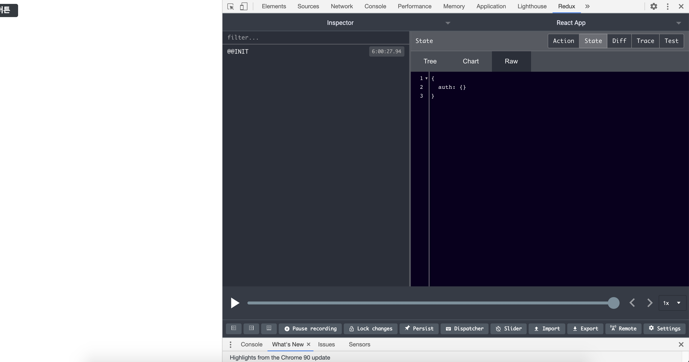

이 장에서는 리액트 프로젝트를 생성하여 지금까지 만든 서버에 연동해 보도록 할 예정이다.

프로젝트를 시작하기 전에 앞으로 어떤 기능을 개발하는지 간단하게 알아보도록 하자.

1. 회원가입/로그인 기능
2. 글쓰기 기능
3. 블로그 포스트의 목록을 보여 주는 기능과 포스트를 읽는 기능
4. 포스트를 수정하거나 삭제할 수 있는 기능

이 프로젝트는 총 네 개의 챕터에 걸쳐서 진행되면 이번 장의 실습은 다음과 같은 흐름으로 진행된다.

> 작업 환경 준비하기 → 회원 인증 UI 구현 → 회원 인증 리덕스 연동 → 헤더 컴포넌트 만들기 → 로그인 유지 및 로그아웃

## 24.1 작업 환경 준비

새 리액트 프로젝트를 생성할 건데 기존에 blog-backend 디렉터리가 있는 blog 디렉터리에 blog-frontend라는 디렉터리를 만들어 준다.

`$ yarn create react-app blog-frontend`

Blog-backend 디렉터리와 Bloc-frontend 디렉터리를 하나의 작업 영역(Code Space)로 취급해서 저장을 하면 그냥 blog 디렉터리를 열었을 때보다 작업 영역을 통해 두 프로젝트를 열었을 때 자동 import 기능이 더욱 완벽하게 작동한다.

#### 24.1.1 설정 파일 만들기

우리가 만든 프로젝트에 필요한 설정 파일을 만들어보자. 먼저 프로젝트의 코드 스타일을 정리해 주는 Prettier의 설정파일을 만든다.

```jsx
{
  "singleQuote": true,
  "semi": true,
  "useTabs": false,
  "tabWidth": 2,
  "trailingComma": "all",
  "printWidth": 80
}

```

그리고 프로젝트에서 자동 import 기능이 제대로 작동할 수 있게 jsconfig.json 파일을 생성해 아래와 같이 작성해 준다.

```jsx
{
	"compilerOptions": {
    "target": "es6"
  }
}
```

#### 24.1.2 라우터 적용

프로젝트를 처음 만들고 나서 설계를 시작할 때 가장 먼저 무엇을 하면 좋을까? 

**바로 리액트 라우터를 프로젝트에 설치하고 적용하는 것이다.** 앞으로 만들게 될 주요 페이지의 라우트 컴포넌트를 미리 만들어보자. 이렇게 먼저 틀을 갖춰 놓고 하나하나 개발을 해 나가는 것이 좋다.

우선 react-router-dom 라이브러리를 설치해 준다.

`$ yarn add react-router-dom`

다음으로 총 다섯 개의 페이지를 만들게 된다. 라우트와 관련된 컴포넌트들은 src/pages 디렉터리에서 관리해 줄 예정이다.

앞으로 만들게 될 라우트 컴포넌트는 아래와 같다.

- LoginPage.js - 로그인
- RegisterPage.js - 회원가입
- WritePage.js - 글쓰기
- PostPage.js - 포스트 읽기
- PostListPage.js - 포스트 목록

```jsx
import React from 'react';

const LoginPage = () => {
  return <div>로그인 페이지</div>;
};

export default LoginPage;
```

```jsx
import React from 'react';

const RegisterPage = () => {
  return <div>회원 가입 페이지</div>;
};

export default RegisterPage;
```

```jsx
import React from 'react';

const WritePage = () => {
  return <div>글쓰기 페이지</div>;
};

export default WritePage;
```

```jsx
import React from 'react';

const Postpage = () => {
  return <div>포스트 읽기</div>;
};

export default Postpage;
```

```jsx
import React from 'react';

const PostListPage = () => {
  return <div>포스트 리스트 페이지</div>;
};

export default PostListPage;
```

위와 같이 라우트 컴포넌트 다섯 개를 모두 만들어 준 뒤 프로젝트 엔트리 파일인 index.js에서 BrowserRouter로 App 컴포넌트를 감싸 준다.

```jsx
import React from 'react';
import ReactDOM from 'react-dom';
import { BrowserRouter } from 'react-router-dom';
import App from './App';

ReactDOM.render(
  <BrowserRouter>
    <App />
  </BrowserRouter>,
  document.getElementById('root'),
);
```

이제 App 컴포넌트에서 Route 컴포넌트를 사용하여 각 라우트의 경로를 지정해 준다.

```jsx
import React from 'react';
import { Route } from 'react-router-dom';
import LoginPage from './pages/LoginPage';
import PostListPage from './pages/PostListPage';
import Postpage from './pages/PostPage';
import RegisterPage from './pages/RegisterPage';
import WritePage from './pages/WritePage';

function App() {
  return (
    <>
      <Route component={LoginPage} path="/login" />
      <Route component={RegisterPage} path="/register" />
      <Route component={WritePage} path="/wrtie" />
      <Route component={Postpage} path="/@:username/:postId" />
      <Route component={PostListPage} path={['/@:username', '/']} exact />
    </>
  );
}

export default App;
```

위 라우트 중 PostListPage를 보면 path에 배열을 넣어 준 것을 확인할 수 있다. 이렇게 배열을 넣어 주면 한 라우트 컴포넌트에 여러 개의 경로를 쉽게 설정할 수 있다. 만약 배열을 사용하지 않고 나타낸다면 아래와 같이 나타낼 수 있다.

```jsx
<Route component={PostListPage} path="/" exact />
<Route component={PostListPage} path="/@:username" exact />
```

추가로 path에 ` '/@:username'` 이라고 입력했는데 이 경로는 http://localhost:3000/@milkboy 같은 경로에서 milkboy를 username 파라미터로 읽을 수 있게 해 준다. 

Route 지정을 마치고 yarn start를 입력한 후 아래 경로로 들어가 알맞은 컴포넌트가 뜨는지 확인해 보면 전부 잘 작동하는 것을 확인할 수 있다.

- http://localhost:3000/
- http://localhost:3000/@tester
- http://localhost:3000/login
- http://localhost:3000/write
- http://localhost:3000/register
- http://localhost:3000/@tester/1234

#### 24.1.3 스타일 설정

이번 프로젝트에서는 styped-components를 사용하여 스타일링을 할 예정이다. 먼저 styled-components를 설치하고 나중에 색상을 사용할 때 쉽게 뽑아서 쓸 수 있도록 색상 팔레트 파일을 만들어 준다.

src/lib/styles 디렉터리를 만들고, 그 안에 palette.js라는 파일을 아래와 같이 작성해 준다.

```jsx
// source: https://yeun.github.io/open-color/

const palette = {
  gray: [
    '#f8f9fa',
    '#f1f3f5',
    '#e9ecef',
    '#dee2e6',
    '#ced4da',
    '#adb5bd',
    '#868e96',
    '#495057',
    '#343a40',
    '#212529',
  ],
  cyan: [
    '#e3fafc',
    '#c5f6fa',
    '#99e9f2',
    '#66d9e8',
    '#3bc9db',
    '#22b8cf',
    '#15aabf',
    '#1098ad',
    '#0c8599',
    '#0b7285',
  ],
};

export default palette;
```

이렇게 따로 palette를 만들어서 사용하는 방법 외에도 open-color라는 라이브러리를 설치해서 사용하는 방법도 있지만 palette를 따로 만들어 사용하게 되면 필요한 색상만 골라서 사용할 수 있고 자동 import가 좀 더 제대로 작동하기 때문에 더욱 편하게 색상을 이용할 수 있다.

#### 24.1.4 Button 컴포넌트 만들기

먼저 검정색 버튼을 스타일링 해보자. 이 버튼 컴포넌트는 다양한 곳에서 재사용할 예정이므로 src 디렉터리에 components/common 디렉터리를 생성하고 그 안에 이 컴포넌트를 만들어 주겠다.

```jsx
import React from 'react';
import styled from 'styled-components';
import palette from '../../lib/styles/palette';

const StyledButton = styled.button`
  border: none;
  border-radius: 4px;
  font-size: 1rem;
  font-weight: bold;
  padding: 0.25rem 1rem;
  color: white;
  outline: none;
  cursor: pointer;

  background: ${palette.gray[8]};
  &:hover {
    background: ${palette.gray[6]};
  }
`;

const Button = (props) => <StyledButton {...props} />;

export default Button;
```

사실 이 컴포넌트에서 StyledButton을 바로 내보내도 상관없다. 하지만 굳이 Button 컴포넌트를 만들어서 그 안에 StyledButton을 렌더링해 준 이유는 추후 이 컴포넌트를 사용할 때 자동 import가 되게 하기 위해서다. styled-components로 만든 컴포넌트를 바로 내보내면 자동 Import가 제대로 작동하지 않는다.

Button 컴포넌트를 만드는 과정에서 {...props}를 StyledButton을 설정해 주었는데 이는 Button이 받아 오는 모든 Props를 StyledButton에 전달한다는 의미다. 

컴포넌트를 다 만들었다면 이제 PostListPage 컴포넌트에서 렌더링 해 준다.

```jsx
import React from 'react';
import Button from '../components/common/Button';

const PostListPage = () => {
  return (
    <div>
      <Button>버튼</Button>
    </div>
  );
};

export default PostListPage;
```

버튼이 잘 만들어졌으니 이제 프로젝트의 글로벌 스타일을 수정해 준다. index.css를 열어 다음과 같이 수정해 주자.

```jsx
body {
  margin: 0;
  padding: 0;
  font-family: -apple-system, BlinkMacSystemFont, 'Segoe UI', 'Roboto', 'Oxygen',
    'Ubuntu', 'Cantarell', 'Fira Sans', 'Droid Sans', 'Helvetica Neue',
    sans-serif;
  -webkit-font-smoothing: antialiased;
  -moz-osx-font-smoothing: grayscale;
  box-sizing: border-box; /* 엘리먼트의 box-sizing 값을 border-box로 설정 */
  min-height: 100%;
}

#root {
  min-height: 100%;
}

/* 추후 회원인증 페이지에서
 배경화면을 페이지의 전체 영역에 채우기 위한 용도 */
html {
  height: 100%;
}

/* 링크에 색상 및 밑줄 없애기 */
a {
  color: inherit;
  text-decoration: none;
}

* {
  box-sizing: inherit; /* 모든 엘리먼트의 box-sizing 값을 border-box로 설정 */
}

code {
  font-family: source-code-pro, Menlo, Monaco, Consolas, 'Courier New',
    monospace;
}
```

#### 24.1.5 리덕스 적용

이제 프로젝트에 리덕스를 적용해보자. 추후 비동기 작업을 관리하는 과정에서 redux-saga를 사용할 텐데, 지금 당장은 미들웨어는 신경쓰지 않고 리덕스 스토어를 생성하고 Provider 컴포넌트를 통해 프로젝트에 리덕스를 적용하기만 해보자.

먼저 리덕스에 필요한 라이브러리들을 설치해 준다.

`$ yarn add redux react-redux redux-actions immersions redux-devtools-extension`

이번 프로젝트에서 리덕스를 사용하는데 immer는 꼭 필요하지는 않지만 immer를 사용하여 불변성을 좀 더 편하게 관리하려 한다. 

라이브러리를 설치했다면 첫 번째 리덕스 모듈을 만들어 준다. 이 프로젝트에서는 Ducks 패턴을 사용하여 액션 타입, 액션 생성 함수, 리듀서가 하나의 파일에 다 정의되어 있는 리덕스 모듈을 작성할 것이다. 

Src/modules 디렉터리를 만들고 그 안에 auth.js라는 모듈을 생성해 준다. 세부 기능은 추후에 작성하기로 하고 일단 리듀서의 틀만 만들어서 내보내 준다.

```jsx
import { createAction, handleActions } from 'redux-actions';

const SAMPLE_ACTION = 'auth/SAMPLE_ACTION';

export const sampleAction = createAction(SAMPLE_ACTION);

const initialState = {};

const auth = handleActions(
  {
    [SAMPLE_ACTION]: (state, action) => state,
  },
  initialState,
);

export default auth;
```

다음으로 루트 리듀서(src/modules/index.js)를 만들어 준다. 지금은 리듀서가 하나밖에 없지만 추후에 여러 개의 리듀서를 만들 예정이다. 

```jsx
import { combineReducers } from 'redux';
import auth from './auth';

const rootReducer = combineReducers({
  auth,
});

export default rootReducer;
```

루트 리듀서를 만든 후에는 프로젝트의 엔트리 파일 index.js에서 스토어를 생성하고, Provider를 통해 리액트 프로젝트에 리덕스를 적용해 준다.

```jsx
import React from 'react';
import ReactDOM from 'react-dom';
import { Provider } from 'react-redux';
import { BrowserRouter } from 'react-router-dom';
import { createStore } from 'redux';
import { composeWithDevTools } from 'redux-devtools-extension';
import App from './App';
import rootReducer from './modules/index';

const store = createStore(rootReducer, composeWithDevTools());

ReactDOM.render(
  <Provider store={store}>
    <BrowserRouter>
      <App />
    </BrowserRouter>
  </Provider>,
  document.getElementById('root'),
);
```

리덕스를 적용한 뒤에 개발자 도구의 Redux 탭을 열어 auth 객체가 존재하는지 확인해 준다.




이제 프로젝트의 작업 환경 설정을 모두 마쳤고 본격적으로 기능 구현을 해보도록 하자.

