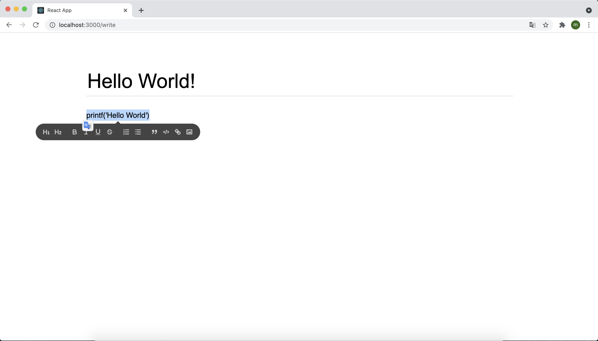
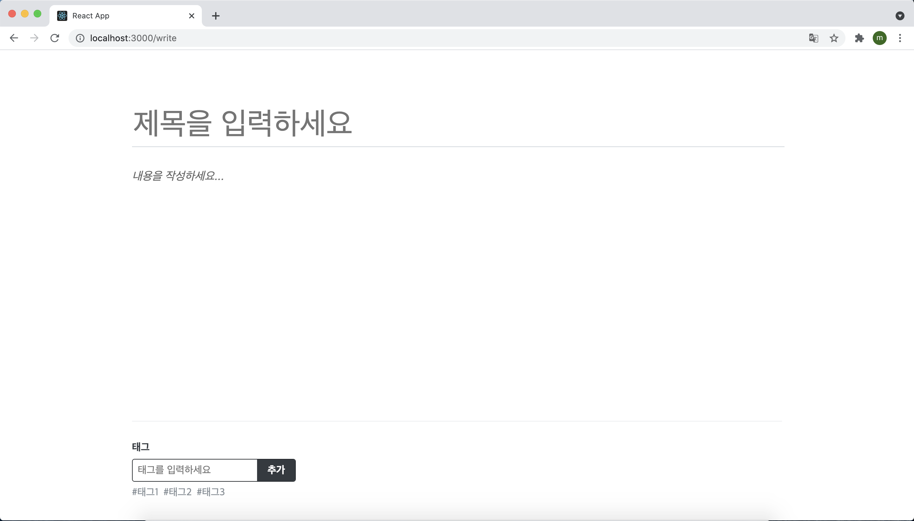
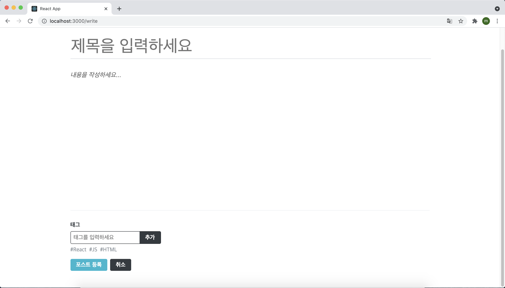

이번에는 글쓰기 페이지 기능을 구현할 차례다. 글쓰기에 관련된 컴포넌트들은 write라는 이름으로 분류할 예정이다.

이번 실습은 다음과 같은 흐름으로 진행된다.

> 에디터 UI 구현하기 -> 에디터 하단 UI 구현하기 -> 리덕스로 글쓰기 상태 관리하기 -> API 연동하기

## 25.1 에디터 UI 구현

글을 작성하는 에디터는 Quill이라는 라이브러리를 사용하여 구현하도록 하자. 먼저 yarn을 이용하여 해당 라이브러리를 설치해 준다.

`$ yarn add quill`

다음으로 components/write 디렉터리에 Editor 컴포넌트를 만들어 준다. 이 컴포넌트에서는 제목과 내용을 입력할 수 있다. 제목은 input을 사용하고, 내용은 Quill 에디터를 사용할 예정이다.

```jsx
import React, { useEffect, useRef } from 'react';
import Quill from 'quill';
import 'quill/dist/quill.bubble.css';
import styled from 'styled-components';
import palette from '../../lib/styles/palette';
import Responsive from '../common/Responsive';

const EditorBlock = styled.div`
  /* 페이지 위 아래 여백 지정 */
  padding-top: 5rem;
  padding-bottom: 5rem;
`;

const TitleInput = styled.input`
  font-size: 3rem;
  outline: none;
  padding-bottom: 0.5rem;
  border: none;
  border-bottom: 1px solid ${palette.gray[4]};
  margin-bottom: 2rem;
  width: 100%;
`;

const QuillWrapper = styled.div`
  /* 최소 크기 지정 및 padding 제거 */
  .ql-editor {
    padding: 0;
    min-height: 320px;
    font-size: 1.125rem;
    line-height: 1.5;
  }
  .ql-editor.ql-blank::before {
    left: 0px;
  }
`;

const Editor = () => {
  const quillElement = useRef(null); // Quill을 적용할 DivElement를 설정
  const quillInstance = useRef(null); // Quill을 적용할 Instance를 설정

  useEffect(() => {
    quillInstance.current = new Quill(quillElement.current, {
      theme: 'bubble',
      placeholder: '내용을 작성하세요...',
      modules: {
        // 더 많은 옵션
        // https://quilljs.com/docs/modules/toolbar/
        toolbar: [
          [{ header: '1' }, { header: '2' }],
          ['bold', 'italic', 'underline', 'strike'],
          [{ list: 'ordered' }, { list: 'bullet' }],
          ['blockquote', 'code-block', 'link', 'image'],
        ],
      },
    });
  }, []);
  return (
    <EditorBlock>
      <TitleInput placeholder="제목을 입력하세요" />
      <QuillWrapper>
        <div ref={quillElement} />
      </QuillWrapper>
    </EditorBlock>
  );
};

export default Editor;
```

Editor 컴포넌트를 WritePage에 렌더링하고 /write 주소로 들어가 보면

```jsx
import React from 'react';
import Responsive from '../components/common/Responsive';
import Editor from '../components/write/Editor';

const WritePage = () => {
  return (
    <Responsive>
      <Editor />
    </Responsive>
  );
};

export default WritePage;
```



위와 같은 화면이 나타나고 텍스트를 드래그하면 스타일을 변경할 수도 있다. Editor 컴포넌트에서 사용되는 값을 추후 리덕스에서도 관리할 수 있도록 props를 설정해 주어야 한다.

## 25.2 에디터 하단 컴포넌트 UI 구현하기

에디터 하단에 태그를 추가하는 컴포넌트와 포스트 작성을 완료하거나 취소하는 버튼을 만들어 보자.

#### 25.2.1 TagBox 만들기

태그를 추가하는 컴포넌트 TagBox를 아래와 같이 작성해 준다.

```jsx
import React from 'react';
import styled from 'styled-components';
import palette from '../../lib/styles/palette';

const TagBoxBlock = styled.div`
  width: 100%;
  border-top: 1px solid ${palette.gray[2]};
  padding-top: 2rem;

  h4 {
    color: ${palette.gray[8]};
    margin-top: 0;
    margin-bottom: 0.5rem;
  }
`;

const TagForm = styled.form`
  border-radius: 4px;
  overflow: hidden;
  display: flex;
  width: 256px;
  border: 1px solid ${palette.gray[9]}; /* 스타일 초기화 */
  input,
  button {
    outline: none;
    border: none;
    font-size: 1rem;
  }

  input {
    padding: 0.5rem;
    flex: 1;
    min-width: 0;
  }

  button {
    cursor: pointer;
    padding-right: 1rem;
    padding-left: 1rem;
    border: none;
    background: ${palette.gray[8]};
    color: white;
    font-weight: bold;
    &:hover {
      background: ${palette.gray[6]};
    }
  }
`;

const Tag = styled.div`
  margin-right: 0.5rem;
  color: ${palette.gray[6]};
  cursor: pointer;
  &:hover {
    opacity: 0.5;
  }
`;

const TagListBlock = styled.div`
  display: flex;
  margin-top: 0.5rem;
`;

// React memo를 사용하여 tag 값이 바뀔 때만 리렌더링되도록 처리
const TagItem = React.memo(({ tag }) => <Tag>#{tag}</Tag>);

// React memo를 사용하여 tags 값이 바뀔 때만 리렌더링되도록 처리
const TagList = React.memo(({ tags }) => (
  <TagListBlock>
    {tags.map((tag) => (
      <TagItem key={tag} tag={tag} />
    ))}
  </TagListBlock>
));

const TagBox = () => {
  return (
    <TagBoxBlock>
      <h4>태그</h4>
      <TagForm>
        <input placeholder="태그를 입력하세요" />
        <button type="submit">추가</button>
      </TagForm>
      <TagList tags={['태그1', '태그2', '태그3']} />
    </TagBoxBlock>
  );
};

export default TagBox;
```

TagBox 컴포넌트에서 모든 작업을 하지는 않는다. 이 컴포넌트를 만들 때 TagItem, TagList라는 두 개의 컴포넌트를 추가로 만들었는데 이렇게 컴포넌트를 분리시킨 이유는 렌더링을 최적화하기 위해서이다. 현재 TagBox 컴포넌트는 두 가지 상황에서 렌더링을 한다. 첫 번째는 input이 바뀔 때이고, 두 번째는 태그 목록이 바뀔 때다.

하지만 위 코드처럼 TagList와 TagItem 컴포넌트를 분리시켜 주면 input 값이 바뀌어도 TagList 컴포넌트가 리렌더링되지 않는다. 그리고 태그 목록에 변화가 생겨도 이미 렌더링 중인 TagItem들은 리렌더링되지 않고, 실제로 추가되거나 삭제되는 태그에만 영향을 미치게 된다.

컴포넌트를 분리하기만 하면 최적화가 되는 것은 아니다. 추가로 React.memo를 사용하여 컴포넌트들을 감싸 주면, 해당 컴포넌트가 받아 오는 props가 실제로 바뀌었을 때만 리렌더링을 해 준다. shouldComponentUpdate를 구현하고 모든 props를 비교해 보는 것과 동일하다.

이제 WritePage에서 Editor 하단에 렌더링해 준다.

```jsx
import React from 'react';
import Responsive from '../components/common/Responsive';
import Editor from '../components/write/Editor';
import TagBox from '../components/write/TagBox';

const WritePage = () => {
  return (
    <Responsive>
      <Editor />
      <TagBox />
    </Responsive>
  );
};

export default WritePage;
```



이제 TagBox 컴포넌트에 Hooks를 사용하여 태그를 추가하고 제거하는 기능을 구현해보도록 하자.

```jsx
import React, { useCallback, useState } from 'react';
import styled from 'styled-components';
import palette from '../../lib/styles/palette';

const TagBoxBlock = styled.div`
  width: 100%;
  border-top: 1px solid ${palette.gray[2]};
  padding-top: 2rem;

  h4 {
    color: ${palette.gray[8]};
    margin-top: 0;
    margin-bottom: 0.5rem;
  }
`;

const TagForm = styled.form`
  border-radius: 4px;
  overflow: hidden;
  display: flex;
  width: 256px;
  border: 1px solid ${palette.gray[9]}; /* 스타일 초기화 */
  input,
  button {
    outline: none;
    border: none;
    font-size: 1rem;
  }

  input {
    padding: 0.5rem;
    flex: 1;
    min-width: 0;
  }

  button {
    cursor: pointer;
    padding-right: 1rem;
    padding-left: 1rem;
    border: none;
    background: ${palette.gray[8]};
    color: white;
    font-weight: bold;
    &:hover {
      background: ${palette.gray[6]};
    }
  }
`;

const Tag = styled.div`
  margin-right: 0.5rem;
  color: ${palette.gray[6]};
  cursor: pointer;
  &:hover {
    opacity: 0.5;
  }
`;

const TagListBlock = styled.div`
  display: flex;
  margin-top: 0.5rem;
`;

// React memo를 사용하여 tag 값이 바뀔 때만 리렌더링되도록 처리
const TagItem = React.memo(({ tag, onRemove }) => (
  <Tag onClick={() => onRemove(tag)}>#{tag}</Tag>
));

// React memo를 사용하여 tags 값이 바뀔 때만 리렌더링되도록 처리
const TagList = React.memo(({ tags, onRemove }) => (
  <TagListBlock>
    {tags.map((tag) => (
      <TagItem key={tag} tag={tag} onRemove={onRemove} />
    ))}
  </TagListBlock>
));

const TagBox = () => {
  const [input, setInput] = useState('');
  const [localTags, setLocalTags] = useState([]);

  const insertTag = useCallback(
    (tag) => {
      if (!tag) return; // 공백이라면 추가하지 않음
      if (localTags.includes(tag)) return; // 이미 존재한다면 추가하지 않음
      setLocalTags([...localTags, tag]);
    },
    [localTags],
  );

  const onRemove = useCallback(
    (tag) => {
      setLocalTags(localTags.filter((t) => t !== tag));
    },
    [localTags],
  );

  const onChange = useCallback((e) => {
    setInput(e.target.value);
  }, []);

  const onSubmit = useCallback(
    (e) => {
      e.preventDefault();
      insertTag(input.trim()); // 앞뒤 공백을 없앤 후 등록
      setInput(''); // input 초기화
    },
    [input, insertTag],
  );
  return (
    <TagBoxBlock>
      <h4>태그</h4>
      <TagForm onSubmit={onSubmit}>
        <input
          placeholder="태그를 입력하세요"
          value={input}
          onChange={onChange}
        />
        <button type="submit">추가</button>
      </TagForm>
      <TagList tags={localTags} onRemove={onRemove} />
    </TagBoxBlock>
  );
};

export default TagBox;
```


저장한 후 태그를 추가 및 삭제를 하게 되면 정상적으로 작동하는 것을 확인할 수 있다. 태그 삭제는 추가된 태그를 클릭하면 삭제되도록 만들었다.

**WriteActionButtons 만들기**

WriteActionButtons 컴포넌트는 포스트 작성 및 취소를 할 수 있는 컴포넌트다. 이 컴포넌트에 두 개의 버튼을 만들고 onPublish, onCancel이라는 props를 받아 와서 사용해보도록 하자.

```jsx
import React from 'react';
import styled from 'styled-components';
import Button from '../common/Button';

const WriteActionButtonsBlock = styled.div`
  margin-top: 1rem;
  margin-bottom: 3rem;
  button + button {
    margin-left: 0.5rem;
  }
`;

/* TagBox에서 사용하는 버튼과 일치하는 높이로 설정한 후 서로 간의 여백 지정 */
const StyledButton = styled(Button)`
  height: 2.125rem;
  & + & {
    margin-left: 0.5rem;
  }
`;

const WriteActionButtons = ({ onCancel, onPublish }) => {
  return (
    <WriteActionButtonsBlock>
      <StyledButton cyan onClick={onPublish}>
        포스트 등록
      </StyledButton>
      <StyledButton onClick={onCancel}>취소</StyledButton>
    </WriteActionButtonsBlock>
  );
};

export default WriteActionButtons;
```

다 작성한 뒤 WritePage에 렌더링 시킨 후 결과를 보면 아래와 같은 결과가 나타난다.



이제 UI는 모두 완성이 됐다.