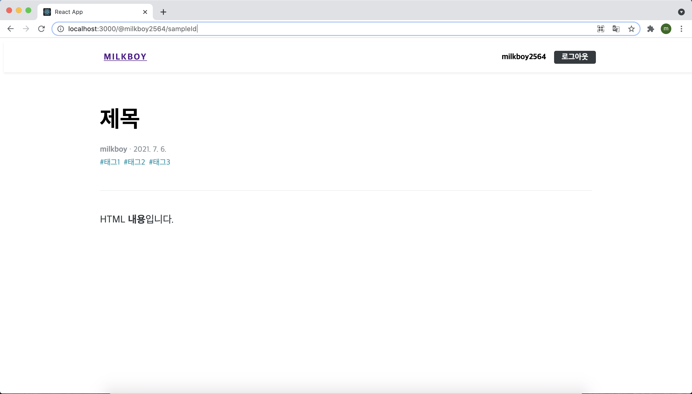
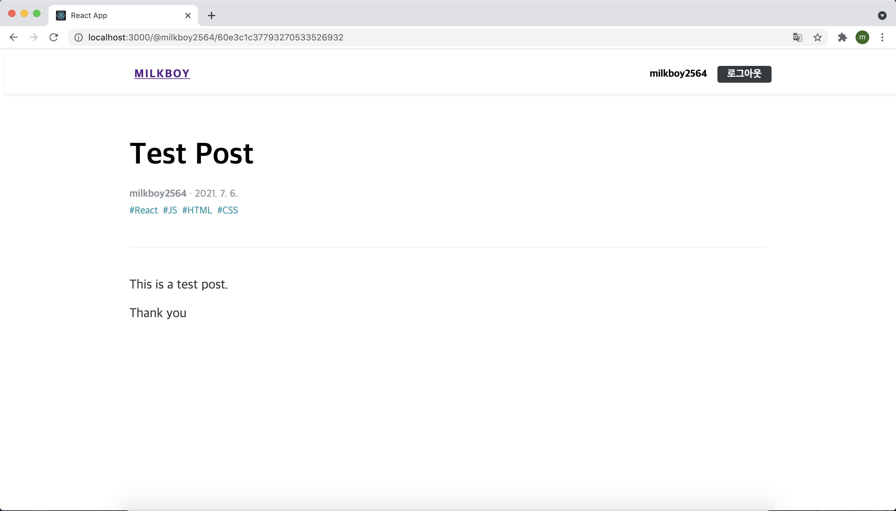
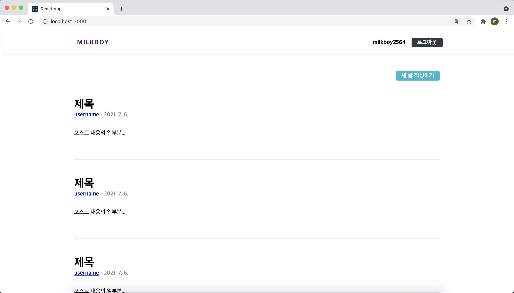
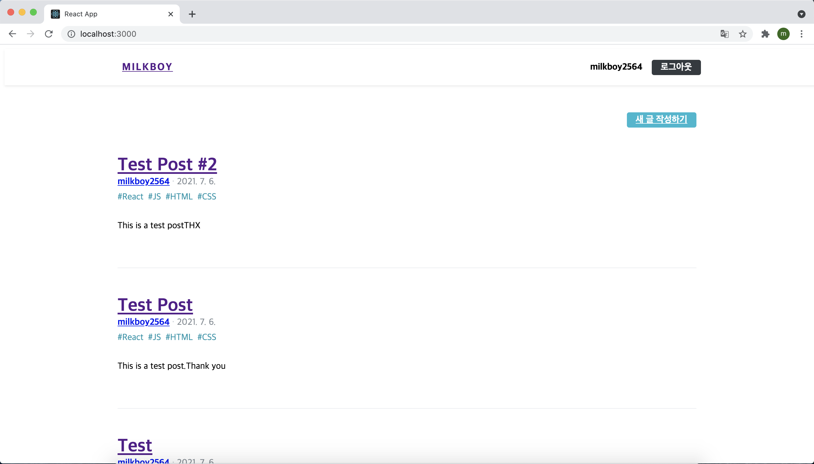

# 26장 포스트 조회 기능

지금까지 회원 인증 시스템과 글쓰기 기능의 구현을 완료했다. 이번 장에서는 포스트를 조회할 수 있는 기능을 구현해 보자. 포스트 조회 기능은 두 가지가 있따. 첫 번째로 포스트 하나를 읽는 포스트 읽기 기능이고, 두 번째는 여러 포스트를 조회하는 포스트 목록 기능이다.

이번 실습은 다음과 같은 흐름으로 진행된다.

>포스트 읽기 UI 준비  → 포스트 읽기 API 연동 → 포스트 목록 UI 준비 → 포스트 목록 API 연동 → HTML 필터링 → 페이지네이션 구현

## 26.1 포스트 읽기 페이지 구현

#### 26.1.1 PostViewer UI

서버에서 데이터를 받아 오기 전 먼저 UI를 완성하자. 구현할 UI는 다음과 같은 정보를 보여 준다.

1. 포스트 제목 
2. 작성자 계정명
3. 작성된 시간
4. 태그
5. 제목
6. 내용

PostViewer라는 컴포넌트를 만들어 이 정보들을 보여주도록 하자. Components/post  디렉터리를 만들고, 그 안에 PostViewer 컴포넌트를 다음과 같이 작성해 준다.

```jsx
import React from 'react';
import styled from 'styled-components';
import palette from '../../lib/styles/palette';
import Responsive from '../common/Responsive';

const PostViewerBlock = styled(Responsive)`
  margin-top: 4rem;
`;

const PostHead = styled.div`
  border-bottom: 1px solid ${palette.gray[2]};
  padding-bottom: 3rem;
  margin-bottom: 3rem;
  h1 {
    font-size: 3rem;
    line-height: 1.5;
    margin: 0;
  }
`;

const SubInfo = styled.div`
  margin-top: 1rem;
  color: ${palette.gray[6]};

  /* span 사이에 가운뎃점 문자 보여 주기 */
  span + span:before {
    color: ${palette.gray[5]};
    padding-left: 0.25rem;
    padding-right: 0.25rem;
    content: '\\B7'; /* 가운뎃점 문자 */
  }
`;

const Tags = styled.div`
  margin-top: 0.5rem;
  .tag {
    display: inline-block;
    color: ${palette.cyan[7]};
    text-decoration: none;
    margin-right: 0.5rem;
    &:hover {
      color: ${palette.cyan[6]};
    }
  }
`;

const PostContent = styled.div`
  font-size: 1.3125rem;
  color: ${palette.gray[8]};
`;

const PostViewer = () => {
  return (
    <PostViewerBlock>
      <PostHead>
        <h1>제목</h1>
        <SubInfo>
          <span>
            <b>milkboy</b>
          </span>
          <span>{new Date().toLocaleDateString()}</span>
        </SubInfo>
        <Tags>
          <div className="tag">#태그1</div>
          <div className="tag">#태그2</div>
          <div className="tag">#태그3</div>
        </Tags>
      </PostHead>
      <PostContent
        dangerouslySetInnerHTML={{ __html: '<p>HTML <b>내용</b>입니다.</p>' }}
      />
    </PostViewerBlock>
  );
};

export default PostViewer;
```

코드를 보면 PostContent에 dangerousSetInnerHTML이라는 값을 설정해 줬다. 리액트에서는 <div>{html}</div>와 같이 HTML을 그대로 렌더링하는 형태로 JSX를 작성하면 HTML 태그가 적용되지 않고 일반 텍스트 형태로 나타나 버린다. 따라서 HTML을 적용하고 싶다면 dangerousSetInnerHTML이라는 props를 설정해 주어야 한다.

다 만들었으면 해당 컴포넌트를 PostPage에 렌더링 시켜준다.

```jsx
import React from 'react';
import PostViewer from '../components/post/PostViewer';
import HeaderContainer from '../containers/common/HeaderContainer';

const Postpage = () => {
  return (
    <>
      <HeaderContainer />
      <PostViewer />
    </>
  );
};

export default Postpage;
```

브라우저에서 `http://localhost:3000/@milkboy2564/sampleId 주소로 들어가보면 아래와 같이 내가 작성한 UI가 나타나게 된다.



#### 26.1.2 API 연동

우선 lib/api/posts.js 파일을 열어 포스트를 읽게 해 주는 readPost라는 함수를 추가해 준다.

```jsx
import client from './client';

export const writePost = ({ title, body, tags }) =>
  client.post('/api/posts', { title, body, tags });

export const readPost = (id) => client.get(`/api/posts/${id}`);
```

다음으로 post 리덕스 모듈을 작성한다.

```jsx
import { createAction, handleActions } from 'redux-actions';
import createRequestSaga, {
  createRequestActionTypes,
} from '../lib/createRequestSaga';
import * as postsAPI from '../lib/api/posts';
import { takeLatest } from 'redux-saga/effects';

const [
  READ_POST,
  READ_POST_SUCCESS,
  READ_POST_FAILURE,
] = createRequestActionTypes('post/READ_POST');
const UNLOAD_POST = 'post/UNLOAD_POST'; // 포스트 페이지에서 벗어날 때 데이터 비우기

export const readPost = createAction(READ_POST, (id) => id);
export const unloadPost = createAction(UNLOAD_POST);

const readPostSaga = createRequestSaga(READ_POST, postsAPI.readPost);
export function* postSaga() {
  yield takeLatest(READ_POST, readPostSaga);
}

const initialState = {
  post: null,
  error: null,
};

const post = handleActions(
  {
    [READ_POST_SUCCESS]: (state, { payload: post }) => ({
      ...state,
      post,
    }),
    [READ_POST_FAILURE]: (state, { payload: error }) => ({
      ...state,
      error,
    }),
    [UNLOAD_POST]: () => initialState,
  },
  initialState,
);

export default post;
```

이 리덕스 모듈에는 포스트를 불러오는 READ_POST 액션 말고도 UNLOAD_POST 액션이 존재하는데 이 액션의 용도는 포스트 페이지를 벗어날 때 리덕스 상태의 데이터를 비우는 것이다. 만약 포스트 페이지를 벗어날 때 데이터를 비우지 않으면, 나중에 사용자가 특정 포스트를 읽은 뒤 목록으로 돌아가서 또 다른 포스트를 읽을 때 아주 짧은 시간 동안 이전에 불러왔던 포스트가 나타나는 깜빡임 현상이 발생한다.

리덕스 모듈을 작성하고 루트 리듀서와 루트 사가에 등록해 준다.

```jsx
import { combineReducers } from 'redux';
import { all } from 'redux-saga/effects';
import auth, { authSaga } from './auth';
import loading from './loading';
import user, { userSaga } from './user';
import write, { writeSaga } from './write';
import post, { postSaga } from './post';

const rootReducer = combineReducers({
  auth,
  loading,
  user,
  write,
  post,
});

export function* rootSaga() {
  yield all([authSaga(), userSaga(), writeSaga(), postSaga()]);
}

export default rootReducer;
```

다음으로 PostViewer를 위한 컨테이너 컴포넌트를 작성한다.

```jsx
import React, { useEffect } from 'react';
import { useSelector, useDispatch } from 'react-redux';
import { withRouter } from 'react-router-dom';
import PostViewer from '../../components/post/PostViewer';
import { readPost, unloadPost } from '../../modules/post';

const PostViewerContainer = ({ match }) => {
  // 처음 마운트될 때 포스트 읽기 API 요청
  const { postId } = match.params;
  const dispatch = useDispatch();
  const { post, error, loading } = useSelector(({ post, loading }) => ({
    post: post.post,
    error: post.error,
    loading: loading['post/READ_POST'],
  }));

  useEffect(() => {
    dispatch(readPost(postId));
    //언마운트될 때 리덕스에서 포스트 데이터 없애기
    return () => {
      dispatch(unloadPost());
    };
  }, [dispatch, postId]);

  return <PostViewer post={post} loading={loading} error={error} />;
};

export default withRouter(PostViewerContainer);
```

컴포넌트를 모두 수정한 뒤 write 페이지에서 새로운 글을 작성하면 아래 그림처럼 내가 작성한 결과가 화면에 잘 나타나는 것을 확인할 수 있다.



## 26.2 포스트 목록 페이지

여러 개의 포스트를 보여 주는 포스트 목록 페이지를 구현해 보자.

#### 26.2.1 PosiList UI

PostList 컴포넌트는 포스트들을 배열로 받아 와서 렌더링 해 준다. 또한 사용자가 로그인 중이라면 페이지 상단 우측에 작성하기 버튼을 보여 준다.

```jsx
import React from 'react';
import styled from 'styled-components';
import palette from '../../lib/styles/palette';
import Button from '../common/Button';
import Responsive from '../common/Responsive';

const PostListBlock = styled(Responsive)`
  margin-top: 3rem;
`;

const WritePostButtonWrapper = styled.div`
  display: flex;
  justify-content: flex-end;
  margin-bottom: 3rem;
`;

const PostItemBlock = styled.div`
  padding-top: 3rem;
  padding-bottom: 3rem;
  /* 맨 위 포스트는 패딩 없음 */
  &:first-child {
    padding-top: 0;
  }
  & + & {
    border-top: 1px solid ${palette.gray[2]};
  }

  h2 {
    font-size: 2rem;
    margin-bottom: 0;
    margin-top: 0;
    &:hover {
      color: ${palette.gray[6]};
    }
  }
  p {
    margin-top: 2rem;
  }
`;

const SubInfo = styled.div`
  /* margin-top: 1rem; */
  color: ${palette.gray[6]};

  /* span 사이에 가운뎃점 문자 보여 주기 */
  span + span:before {
    color: ${palette.gray[4]};
    padding-left: 0.25rem;
    padding-right: 0.25rem;
    content: '\\B7'; /* 가운뎃점 문자*/
  }
`;

const Tags = styled.div`
  margin-top: 0.5rem;
  .tag {
    display: inline-block;
    color: ${palette.cyan[7]};
    text-decoration: none;
    margin-right: 0.5rem;
    &:hover {
      color: ${palette.cyan[6]};
    }
  }
`;

const PostItem = () => {
  return (
    <PostItemBlock>
      <h2>제목</h2>
      <SubInfo>
        <span>
          <b>username</b>
        </span>
        <span>{new Date().toLocaleDateString()}</span>
      </SubInfo>
      <Tags>
        <div className="tag">#태그1</div>
        <div className="tag">#태그2</div>
        <div className="tag">#태그3</div>
      </Tags>
    </PostItemBlock>
  );
};

const PostList = () => {
  return (
    <PostListBlock>
      <WritePostButtonWrapper>
        <Button cyan to="/write">
          새 글 작성하기
        </Button>
      </WritePostButtonWrapper>
      <div>
        <PostItem />
        <PostItem />
        <PostItem />
      </div>
    </PostListBlock>
  );
};

export default PostList;
```

이 컴포넌트에서 사용된 SubInfo 컴포넌트와 Tags 컴포넌트는 PostViewer 컴포넌트에서 사용한 코드와 같다. 한 가지 차이점이라면 SubInfo 컴포넌트의 경우 margin-top이 없다는 것이다.

이렇게 똑같은 코드를 두 번 선언하는 대신, SubInfo 컴포넌트와 Tags 컴포넌트를 common 디렉터리에 따로 분리시켜서 재사용해보자. 또한 분리시킬 때 계정명이 나타나는 부분과 각 태그가 나타나는 부분에 Link를 사용하여 클릭시 이동할 주소를 설정해주도록 하자.

```jsx
import React from 'react';
import styled from 'styled-components';
import { Link } from 'react-router-dom';
import palette from '../../lib/styles/palette';

const SubInfoBlock = styled.div`
  ${(props) =>
    props.hasMarginTop &&
    css`
      margin-top: 1rem;
    `}
  color: ${palette.gray[6]};

  /* span 사이에 가운뎃점 문자 보여 주기 */
  span + span:before {
    color: ${palette.gray[4]};
    padding-left: 0.25rem;
    padding-right: 0.25rem;
    content: '\\B7'; /* 가운뎃점 문자*/
  }
`;

const SubInfo = ({ username, publishedDate, hasMarginTop }) => {
  return (
    <SubInfoBlock hasMarginTop={hasMarginTop}>
      <span>
        <b>
          <Link to={`/@${username}`}>{username}</Link>
        </b>
      </span>
      <span>{new Date(publishedDate).toLocaleDateString()}</span>
    </SubInfoBlock>
  );
};

export default SubInfo;
```

SubInfo 컴포넌트는 hasMarinTop 값이 true면 상단 여백을 주고, 그렇지 않으면 여백이 없다. 그리고 username과 publishedDate를 props로 받아 와서 보여 주도록 설정했다.

```jsx
import React from 'react';
import styled from 'styled-components';
import palette from '../../lib/styles/palette';
import { Link } from 'react-router-dom';

const TagsBlock = styled.div`
  margin-top: 0.5rem;
  .tag {
    display: inline-block;
    color: ${palette.cyan[7]};
    text-decoration: none;
    margin-right: 0.5rem;
    &:hover {
      color: ${palette.cyan[6]};
    }
  }
`;

const Tags = ({ tags }) => {
  return (
    <TagsBlock>
      {tags.map((tag) => {
        <Link className="tag" to={`/?tag={tag}`} key={tag}>
          #{tag}
        </Link>;
      })}
    </TagsBlock>
  );
};

export default Tags;
```

Tags 컴포넌트는 tags 값을 props로 받아 와서 태그 목록을 렌더링해 준다. 각 태그 항목을 Link 컴포넌트로 작성했으며, 클릭했을 때 이동 경로는 `/?tag=태그` 로 설정했다.

SubInfo와 Tags 컴포넌트를 분리시켜줬으니 PostViewer 컴포넌트와 PostList 컴포넌트 안에 있는 기존의 SubInfo와 Tags 컴포넌트도 변경해 준다.

```jsx
import React from 'react';
import styled from 'styled-components';
import palette from '../../lib/styles/palette';
import Button from '../common/Button';
import Responsive from '../common/Responsive';
import SubInfo from '../common/SubInfo';

const PostListBlock = styled(Responsive)`
  margin-top: 3rem;
`;

const WritePostButtonWrapper = styled.div`
  display: flex;
  justify-content: flex-end;
  margin-bottom: 3rem;
`;

const PostItemBlock = styled.div`
  padding-top: 3rem;
  padding-bottom: 3rem;
  /* 맨 위 포스트는 패딩 없음 */
  &:first-child {
    padding-top: 0;
  }
  & + & {
    border-top: 1px solid ${palette.gray[2]};
  }

  h2 {
    font-size: 2rem;
    margin-bottom: 0;
    margin-top: 0;
    &:hover {
      color: ${palette.gray[6]};
    }
  }
  p {
    margin-top: 2rem;
  }
`;

const PostItem = () => {
  return (
    <PostItemBlock>
      <h2>제목</h2>
      <SubInfo username="username" publishedDate={new Date()} />
      <Tags tags={['태그 1', '태그 2', '태그 3']} />
      <p>포스트 내용의 일부분...</p>
    </PostItemBlock>
  );
};

const PostList = () => {
  return (
    <PostListBlock>
      <WritePostButtonWrapper>
        <Button cyan to="/write">
          새 글 작성하기
        </Button>
      </WritePostButtonWrapper>
      <div>
        <PostItem />
        <PostItem />
        <PostItem />
      </div>
    </PostListBlock>
  );
};

export default PostList;
```

컴포넌트를 위와 같이 수정한 뒤 PostListPage 컴포넌트에서 PostList를 렌더링하면 아래와 같이 작성한 컴포넌트가 잘 나타나는 것을 확인할 수 있다.



이번에는 PostViewer 컴포넌트에서 분리시킨 SubInfo와 Tags 컴포넌트를 사용해보자.

```jsx
import React from 'react';
import styled from 'styled-components';
import palette from '../../lib/styles/palette';
import Responsive from '../common/Responsive';
import SubInfo from '../common/SubInfo';
import Tags from '../common/Tags';

const PostViewerBlock = styled(Responsive)`
  margin-top: 4rem;
`;

const PostHead = styled.div`
  border-bottom: 1px solid ${palette.gray[2]};
  padding-bottom: 3rem;
  margin-bottom: 3rem;
  h1 {
    font-size: 3rem;
    line-height: 1.5;
    margin: 0;
  }
`;

const PostContent = styled.div`
  font-size: 1.3125rem;
  color: ${palette.gray[8]};
`;

const PostViewer = ({ post, error, loading }) => {
  // 에러 발생 시
  if (error) {
    if (error.response && error.response.status === 404) {
      return <PostViewerBlock>존재하지 않는 포스트입니다.</PostViewerBlock>;
    }
    return <PostViewerBlock>Error Occurred!</PostViewerBlock>;
  }

  //로딩 중이거나 아직 포스트 데이터가 없을 때
  if (loading || !post) {
    return null;
  }

  const { title, body, user, publishedDate, tags } = post;
  return (
    <PostViewerBlock>
      <PostHead>
        <h1>{title}</h1>
        <SubInfo
          username={user.username}
          publishedDate={publishedDate}
          hasMarginTop
        />
        <Tags tags={tags} />
      </PostHead>
      <PostContent dangerouslySetInnerHTML={{ __html: body }} />
    </PostViewerBlock>
  );
};

export default PostViewer;
```

이렇게 재사용 가능한 컴포넌트는 따로 분리하여 사용하면, 코드의 양도 줄일 수 있고 유지 보수를 할 때도 용이하게 할 수 있다.

#### 26.2.2 포스트 목록 조회 API 연동

PostList 컴포넌트에서 실제 데이터를 보여줄 수 있도록 API를 연동해보도록 하자. 여기서 사용할 list API는 username, page, tag 값을 쿼리 값으로 넣어서 사용한다. API를 사용할 때 파라미터로 무자열들을 받아 와서 직접 조합해도 되지만, 여기서는 qs 라이브러리를 사용하여 쿼리 값을 생성한다. 이 라이브러리를 사용하면 쿼리 값을 더 편리하게 생성하고 JSON으로 변환할 수 있다.

```jsx
import client from './client';
import qs from 'qs';

export const writePost = ({ title, body, tags }) =>
  client.post('/api/posts', { title, body, tags });

export const readPost = (id) => client.get(`/api/posts/${id}`);

export const listPosts = ({ page, username, tag }) => {
  const queryString = qs.stringify({
    page,
    username,
    tag,
  });
  return client.get(`/api/posts?${queryString}`);
};
```

listPosts API를 호출할 때 파라미터로 값을 넣어 주면 /api/posts/?username=tester&page=2와 같이 주소를 만들어서 호출한다.

이제 위 요청의 상태를 관리하는 리덕스 모듈을 만들자.

```jsx
import { createAction, handleActions } from 'redux-actions';
import createRequestSaga, {
  createRequestActionTypes,
} from '../lib/createRequestSaga';
import * as postsAPI from '../lib/api/posts';
import { takeLatest } from 'redux-saga/effects';

const [
  LIST_POSTS,
  LIST_POSTS_SUCCESS,
  LIST_POSTS_FAILURE,
] = createRequestActionTypes('posts/LIST_POSTS');

export const listPosts = createAction(
  LIST_POSTS,
  ({ tag, username, page }) => ({ tag, username, page }),
);

const listPostsSaga = createRequestSaga(LIST_POSTS, postsAPI.listPosts);
export function* postsSaga() {
  yield takeLatest(LIST_POSTS, listPostsSaga);
}

const initialState = {
  posts: null,
  error: null,
};

const posts = handleActions(
  {
    [LIST_POSTS_SUCCESS]: (state, { payload: posts }) => ({
      ...state,
      posts,
    }),
    [LIST_POSTS_FAILURE]: (state, { payload: error }) => ({
      ...state,
      error,
    }),
  },
  initialState,
);

export default posts;
```

다 작성한 후에 루트 리듀서와 루트 사가에 방금 만든 리듀서와 사가를 등록해 주고 이제 container를 만들 차례다.

PostListContainer 컴포넌트를 만들어 주는데 이 컴포넌트는 주소에 있는 쿼리 파라미터를 추출하여 만들었던 listPosts API를 호출해 준다.

```jsx
import React, { useEffect } from 'react';
import qs from 'qs';
import { useDispatch, useSelector } from 'react-redux';
import { listPosts } from '../../modules/posts';
import PostList from '../../components/post/PostList';
import { withRouter } from 'react-router-dom';

const PostListContainer = ({ location, match }) => {
  const dispatch = useDispatch();
  const { posts, error, loading, user } = useSelector(
    ({ posts, loading, user }) => ({
      posts: posts.posts,
      error: posts.error,
      loading: loading['posts/LIST_POSTS'],
      user: user.user,
    }),
  );
  useEffect(() => {
    const { username } = match.params;
    const { tag, page } = qs.parse(location.search, {
      ignoreQueryPrefix: true,
    });
    dispatch(listPosts({ tag, username, page }));
  }, [dispatch, location.search]);

  return (
    <PostList
      loading={loading}
      error={error}
      posts={posts}
      showWriteButton={user}
    />
  );
};

export default withRouter(PostListContainer);
```

PostList 컴포넌트를 사용할 때 showWriteButon props를 현재 로그인 중인 사용자의 정보를 지니고 있는 user 객체로 설정해 주었다. 이렇게 하면 user 객체가 유효할 때, 즉 사용자가 로그인 중일 때만 포스트를 작성하는 버튼이 나타난다.

컨테이너 컴포넌트를 완성한 후, PostListPage 컴포넌트에서 PostList를 PostListContainer로 변경해 준다. 그런 다음 PostList에서 받아 온 props에 따라 결과물을 보여주게 만들어 준다.

```jsx
import React from 'react';
import styled from 'styled-components';
import palette from '../../lib/styles/palette';
import Button from '../common/Button';
import Responsive from '../common/Responsive';
import { Link } from 'react-router-dom';
import SubInfo from '../common/SubInfo';
import Tags from '../common/Tags';

const PostListBlock = styled(Responsive)`
  margin-top: 3rem;
`;

const WritePostButtonWrapper = styled.div`
  display: flex;
  justify-content: flex-end;
  margin-bottom: 3rem;
`;

const PostItemBlock = styled.div`
  padding-top: 3rem;
  padding-bottom: 3rem;
  /* 맨 위 포스트는 패딩 없음 */
  &:first-child {
    padding-top: 0;
  }
  & + & {
    border-top: 1px solid ${palette.gray[2]};
  }

  h2 {
    font-size: 2rem;
    margin-bottom: 0;
    margin-top: 0;
    &:hover {
      color: ${palette.gray[6]};
    }
  }
  p {
    margin-top: 2rem;
  }
`;

const PostItem = ({ post }) => {
  const { publishedDate, user, tags, title, body, _id } = post;
  return (
    <PostItemBlock>
      <h2>
        <Link to={`/@${user.username}/${_id}`}>{title}</Link>
      </h2>
      <SubInfo username={user.username} publishedDate={publishedDate} />
      <Tags tags={tags} />
      <p>{body}</p>
    </PostItemBlock>
  );
};

const PostList = ({ posts, loading, error, showWriteButton }) => {
  if (error) {
    return <PostListBlock>Error Occurred!</PostListBlock>;
  }
  return (
    <PostListBlock>
      <WritePostButtonWrapper>
        {showWriteButton && (
          <Button cyan to="/write">
            새 글 작성하기
          </Button>
        )}
      </WritePostButtonWrapper>
      {/* 로딩 중이 아니고, 포스트 배열이 존재할 때만 보여 줌 */}
      {!loading && posts && (
        <div>
          {posts.map((post) => (
            <PostItem post={post} key={post._id} />
          ))}
        </div>
      )}
    </PostListBlock>
  );
};

export default PostList;
```

여기까지 완성하게 되면 아래와 같은 화면이 나타난다.


위 이미지를 보면 내용이 나타내는 부분에 HTML 태그가 그대로 나타나는 것을 확인할 수 있다. 이 태그를 없애는 작업은 서버 쪽에서 해 주어야 한다. 클라이언트에서 처리하는 방법도 있지만, 현재는 포스트 리스팅을 할 때 body의 글자 수를 200자로 제한하는 기능이 있다. 이 때문에 완성된 HTML이 아니라 HTML의 일부분만 전달되어 HTML 태그를 없애는 작업이 잘 이루어지지 않을 가능성이 있다.

#### 26.2.3 HTML 필터링

Sanitize-html이라는 라이브러리를 사용하여 HTML을 필터링해 주도록 하자. 이 라이브러리는 HTML을 작성하고 보여 주어야 하는 서비스에서 매우 유용하다. 단순히 HTML을 제거하는 기능뿐만 아니라 특정 HTML만 허용하는 기능도 있기 때문에 글쓰기 API에서 사용하면 손쉽게 악성 스크립트 삽입을 막을 수 있다.

백엔드 프로젝트 디렉터리에서 sanitize-html을 설치해준다.

이어서 백엔드 프로젝트의 posts.ctrl.js 파일을 아래처럼 수정해주어야 한다.

```jsx
(...)
 
// html을 없애고 내용이 너무 길면 200자로 제한하는 함수
const removeHtmlAndShorten = (body) => {
  const filtered = sanitizeHtml(body, {
    allowedTags: [],
  });
  return filtered.length < 200 ? filtered : `${filtered.slice(0, 200)}...`;
};
/*
  GET /api/posts?username=&tag=&page=
*/
export const list = async (ctx) => {
  // query 는 문자열이기 때문에 숫자로 변환해주어야합니다.
  // 값이 주어지지 않았다면 1 을 기본으로 사용합니다.
  const page = parseInt(ctx.query.page || '1', 10);

  if (page < 1) {
    ctx.status = 400;
    return;
  }

  const { tag, username } = ctx.query;
  // tag, username 값이 유효하면 객체 안에 넣고, 그렇지 않으면 넣지 않음
  const query = {
    ...(username ? { 'user.username': username } : {}),
    ...(tag ? { tags: tag } : {}),
  };

  try {
    const posts = await Post.find(query)
      .sort({ _id: -1 })
      .limit(10)
      .skip((page - 1) * 10)
      .lean()
      .exec();
    const postCount = await Post.countDocuments(query).exec();
    ctx.set('Last-Page', Math.ceil(postCount / 10));
    ctx.body = posts.map((post) => ({
      ...post,
      body: removeHtmlAndShorten(post.body),
    }));
  } catch (e) {
    ctx.throw(500, e);
  }
};

(...)
```

기존에는 문자열 길이만 제한했는데, 이번에는 HTML을 제거하고 문자열 길이를 200자로 제한했다. 이 작업을 위해 새로운 함수도 만들었다.

그다음에 수정해야 할 API는 포스트의 작성 및 수정에 관한 것이다. 포스트를 작성하고 수정할 때는 모든 HTML을 제거하는 것이 아니라, 악성 스크립트가 주입되는 것을 방지하기 위해 특정 태그들만 허용해 준다.

Sanitize-html은 HTML의 특정 태그와 특정 속성만 허용할 수 있다. 먼저 코드의 상단에 sanitizeOptions라는 객체를 선언한다.

```jsx
import Post from '../../models/post';
import mongoose from 'mongoose';
import Joi from 'joi';
import sanitizeHtml from 'sanitize-html';

const { ObjectId } = mongoose.Types;

const sanitizeOptions = {
  allowedTags: [
    'h1',
    'h2',
    'b',
    'i',
    'u',
    's',
    'p',
    'ul',
    'ol',
    'li',
    'blockquote',
    'a',
    'img',
  ],
  allowedAttributes: {
    a: ['href', 'name', 'target'],
    img: ['src'],
    li: ['class'],
  },
  allowedSchemes: ['data', 'http'],
};

(...)
```

sanitizeOptions 객체는 HTML을 필터링할 때 허용할 것을 설정해 준다. 더 자세한 설정은 [공식 메뉴얼](https://www.npmjs.com/package/sanitize-html) 을 참고하자. 

이제 write, update 함수를 업데이트 하자.

```jsx
(...)
 
/*
  POST /api/posts
  {
    title: '제목',
    body: '내용',
    tags: ['태그1', '태그2']
  }
*/
export const write = async (ctx) => {
  const schema = Joi.object().keys({
    // 객체가 다음 필드를 가지고 있음을 검증
    title: Joi.string().required(), // required() 가 있으면 필수 항목
    body: Joi.string().required(),
    tags: Joi.array().items(Joi.string()).required(), // 문자열로 이루어진 배열
  });

  // 검증 후, 검증 실패시 에러처리
  const result = schema.validate(ctx.request.body);
  if (result.error) {
    ctx.status = 400; // Bad Request
    ctx.body = result.error;
    return;
  }

  const { title, body, tags } = ctx.request.body;
  const post = new Post({
    title,
    body: sanitizeHtml(body, sanitizeOption),
    tags,
    user: ctx.state.user,
  });
  try {
    await post.save();
    ctx.body = post;
  } catch (e) {
    ctx.throw(500, e);
  }
};

(...)
```

이어서 update 함수도 수정해 준다.

```jsx
(...)
 
/*
  PATCH /api/posts/:id
  {
    title: '수정',
    body: '수정 내용',
    tags: ['수정', '태그']
  }
*/
export const update = async (ctx) => {
  const { id } = ctx.params;
  // write 에서 사용한 schema 와 비슷한데, required() 가 없습니다.
  const schema = Joi.object().keys({
    title: Joi.string(),
    body: Joi.string(),
    tags: Joi.array().items(Joi.string()),
  });

  // 검증 후, 검증 실패시 에러처리
  const result = schema.validate(ctx.request.body);
  if (result.error) {
    ctx.status = 400; // Bad Request
    ctx.body = result.error;
    return;
  }

  const nextData = { ...ctx.request.body }; // 객체를 복사하고
  // body 값이 주어졌으면 HTML 필터링
  if (nextData.body) {
    nextData.body = sanitizeHtml(nextData.body, sanitizeOption);
  }

  try {
    const post = await Post.findByIdAndUpdate(id, nextData, {
      new: true, // 이 값을 설정하면 업데이트된 데이터를 반환합니다.
      // false 일 때에는 업데이트 되기 전의 데이터를 반환합니다.
    }).exec();
    if (!post) {
      ctx.status = 404;
      return;
    }
    ctx.body = post;
  } catch (e) {
    ctx.throw(500, e);
  }
};
```

코드를 모두 수정한 뒤 브라우저에 들어가면 HTML 태그가 제거된 상태로 포스트 목록이 나타나는 것을 확인할 수 있다.



이전에는 p태그와 b태그가 보였는데 더 이상 보이지 않는다.

