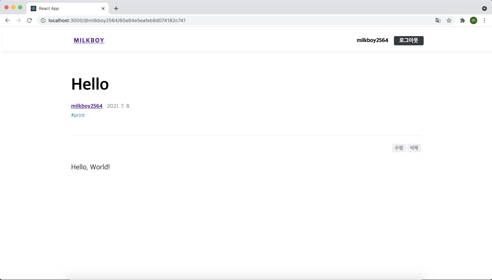
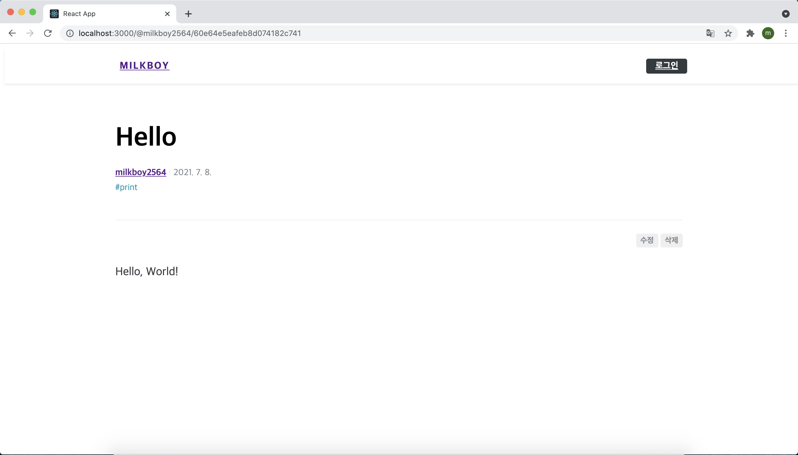
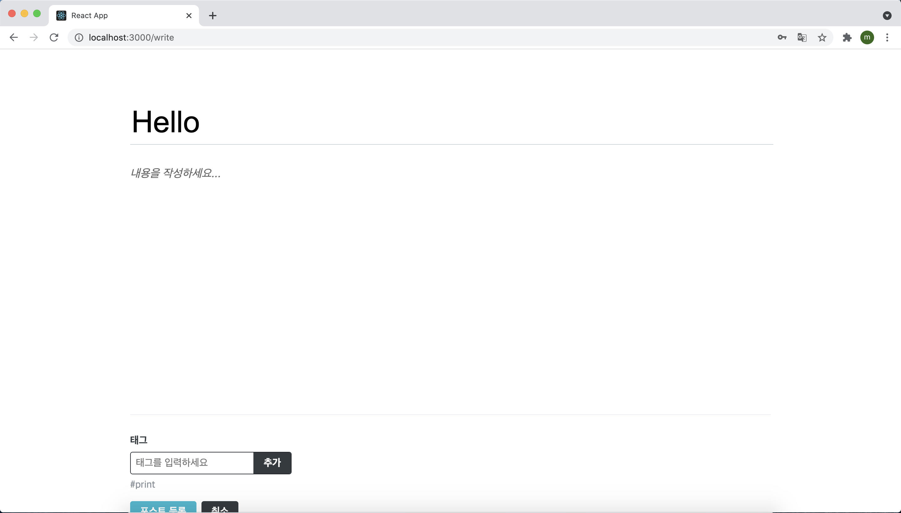
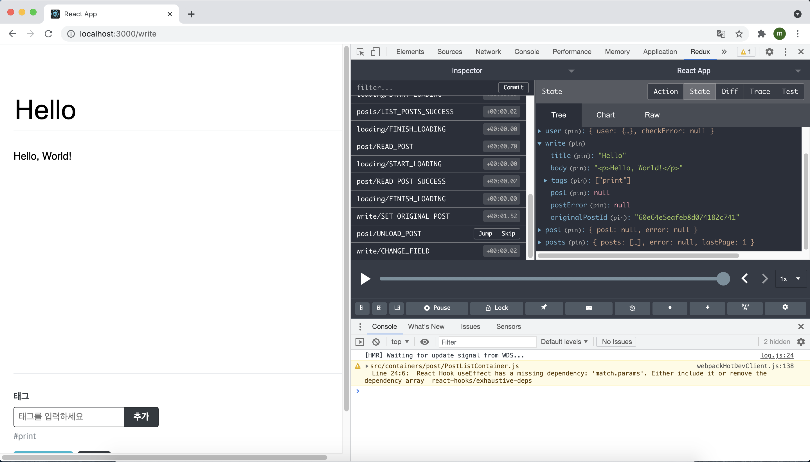

# 27장 수정/삭제 기능 구현 및 마무리

포스트를 수정하고 삭제하는 기능은 다음과 같은 흐름으로 진행된다.

> 포스트 수정 기능 구현 → 포스트 삭제 기능 구현 → react-helmet-async로 meta 태그 설정 → 프로젝트 마무리


## 27.1 포스트 수정

#### 27.1.1 PostActionButtons 컴포넌트

포스트 수정/삭제를 하려면 포스트를 읽는 화면에서 포스트 작성자에게만 포스트 상간에 수정 버튼과 삭제 버튼이 나타나도록 해야한다. 이번에는 기존에 재사용했던 Button 컴포넌트와 스타일이 다르기 때문에 재사용하지 않고 새로운 컴포넌트를 만들어 줘야 한다.

```jsx
import React from 'react';
import styled from 'styled-components';
import palette from '../../lib/styles/palette';

const PostActionButtonBlock = styled.div`
  display: flex;
  justify-content: flex-end;
  margin-top: -1.5rem;
  margin-bottom: 2rem;
`;

const ActionButton = styled.button`
  padding: 0.25rem 0.5rem;
  border-radius: 4px;
  color: ${palette.gray[6]};
  font-weight: bold;
  border: none;
  outline: none;
  font-size: 0.875rem;
  cursor: pointer;
  &:hover {
    background: ${palette.gray[1]};
    color: ${palette.cyan[7]};
  }
  & + & {
    margin-left: 0.25rem;
  }
`;

const PostActionButtons = () => {
  return (
    <PostActionButtonBlock>
      <ActionButton>수정</ActionButton>
      <ActionButton>삭제</ActionButton>
    </PostActionButtonBlock>
  );
};

export default PostActionButtons;
```

이제 PostActionButtons 컴포넌트를 PostViewer의 PostHead 하단에서 보여주어야 한다. 그런데 이 컴포넌트를 PostViewer에 직접 렌더링하면, 나중에 PostActionButtons에 onEdit, onRemove 등의 props를 전달할 때 무조건 PostViewer를 거쳐서 전달해야 한다. 정작 PostViewer 내부에서는 사용하지 않지만 내부의 컴포넌트에서 필요하기 때문에 한 번 거쳐 전달하는 것은 불편할 수 있다.

```jsx
// PostViewerContainer에서 렌더링할 때:
<PostViewer (...) onEdit={onEdit} onRemove={onRemove} />
// PostViewer에서 렌더링할 때:
<PostViewer onEdit={onEdit} onRemove={onRemove} />
```


이 방법이 틀린 것은 아니지만, 자칫하면 컴포넌트가 받아 오는 props가 너무 많아져서 관리하기 어려워질 수 있다.

이렇게 컴포넌트를 거쳐서 props를 전달하는 것이 싫다면 두 가지 방법을 고려할 수 있다.

1. PostActionButtons의 컨테이너 컴포넌트를 만들고 PostViewer 내부에서 바로 렌더링 하는 방법
2. props를 JSX 형태로 받아와서 렌더링 하는 방법

두 번째 방법의 경우 아래와 같은 형태로 구현할 수 있다.

```jsx
<PostViewer
	post={post}
	loading={loading}
	error={error}
	actionButtons={<PostActionButtons onEdit={onEdit} onRemove={onRemove} />}
```

여기서는 두 번째 방법으로 구현하도록 해보자. 왜냐하면 두 번째 방법은 굳이 컨테이너 컴포넌트를 만들지 않고 기존 PostViewerContainer 컴포넌트에서 필요한 로직을 작성하면 되기 때문이다.

먼저 PostViewer에서 받는 props와 해당 props를 사용하는 코드를 아래와 같이 추가해주고

```jsx
(...)
 
const PostViewer = ({ post, error, loading, actionButtons}) => {
  // 에러 발생 시
  if (error) {
    if (error.response && error.response.status === 404) {
      return <PostViewerBlock>존재하지 않는 포스트입니다.</PostViewerBlock>;
    }
    return <PostViewerBlock>Error Occurred!</PostViewerBlock>;
  }

  //로딩 중이거나 아직 포스트 데이터가 없을 때
  if (loading || !post) {
    return null;
  }

  const { title, body, user, publishedDate, tags } = post;
  return (
    <PostViewerBlock>
      <PostHead>
        <h1>{title}</h1>
        <SubInfo
          username={user.username}
          publishedDate={publishedDate}
          hasMarginTop
        />
        <Tags tags={tags} />
      </PostHead>
      {actionButtons}
      <PostContent dangerouslySetInnerHTML={{ __html: body }} />
    </PostViewerBlock>
  );
};

export default PostViewer;
```

그런 다음 PostViewerContainer에서 PostActionButtons를 불러온 후 PostViewer의 actionButtons props를 통해 렌더링해 준다.

```jsx
import React, { useEffect } from 'react';
import { useSelector, useDispatch } from 'react-redux';
import { withRouter } from 'react-router-dom';
import PostViewer from '../../components/post/PostViewer';
import { readPost, unloadPost } from '../../modules/post';
import PostActionButtons from '../../components/post/PostActionButtons';

const PostViewerContainer = ({ match }) => {
  // 처음 마운트될 때 포스트 읽기 API 요청
  const { postId } = match.params;
  const dispatch = useDispatch();
  const { post, error, loading } = useSelector(({ post, loading }) => ({
    post: post.post,
    error: post.error,
    loading: loading['post/READ_POST'],
  }));

  useEffect(() => {
    dispatch(readPost(postId));
    //언마운트될 때 리덕스에서 포스트 데이터 없애기
    return () => {
      dispatch(unloadPost());
    };
  }, [dispatch, postId]);

  return (
    <PostViewer
      post={post}
      loading={loading}
      error={error}
      actionButtons={<PostActionButtons />}
    />
  );
};

export default withRouter(PostViewerContainer);
```

저장한 후 포스트 페이지를 열어 보면 아래와 같이 수정/삭제 버튼이 나타난 것을 확인할 수 있다.



하지만 아래 보이는 이미지처럼 지금은 로그인된 사용자가 아닌 다른 사용자의 포스트를 볼 때도 이 버튼이 나타날것이다. 이 부분은 조건에 따라 버튼을 숨기는 로직으로 처리해 줄 수 있다.



#### 27.1.2 수정 버튼 클릭 시 글쓰기 페이지로 이동

이제 수정 버튼을 클릭하면 글쓰기 페이지로 이동하고, 현재 보고 있는 포스트가 나타나도록 구현해보자.

우선 write 리덕스 모듈에 SET_ORIGINAL_POST라는 액션을 만든다. 이 액션은 현재 보고 있는 포스트 정보를 write 모듈에서 관리하는 상태에 넣는다.

```jsx
(...)

const SET_ORIGINAL_POST = 'write/SET_ORIGINAL_POST';

(...)

export const setOriginalPost = createAction(SET_ORIGINAL_POST, (post) => post);

(...)
 
const write = handleActions(
  {
    [INITIALIZE]: (state) => initialState, // initialState를 넣으면 초기 상태로 바뀜
    [CHANGE_FIELD]: (state, { payload: { key, value } }) => ({
      ...state,
      [key]: value, // 특정 key 값을 업데이트
    }),
    [WRITE_POST]: (state) => ({
      ...state,
      // post와 postError를 초기화
      post: null,
      postError: null,
    }),
    [WRITE_POST_SUCCESS]: (state, { payload: post }) => ({
      ...state,
      post,
    }),
    [WRITE_POST_FAILURE]: (state, { payload: postError }) => ({
      ...state,
      postError,
    }),
    [SET_ORIGINAL_POST]: (state, { payload: post }) => ({
      ...state,
      title: post.title,
      body: post.body,
      tags: post.tags,
      originalPostId: post._id,
    }),
  },
  initialState,
);

export default write;
```

액션을 추가한 뒤 PostViewerContainer를 다음과 같이 수정한다.

```jsx
import React, { useEffect } from 'react';
import { useSelector, useDispatch } from 'react-redux';
import { withRouter } from 'react-router-dom';
import PostViewer from '../../components/post/PostViewer';
import { readPost, unloadPost } from '../../modules/post';
import PostActionButtons from '../../components/post/PostActionButtons';
import { setOriginalPost } from '../../modules/write';

const PostViewerContainer = ({ match, history }) => {
  // 처음 마운트될 때 포스트 읽기 API 요청
  const { postId } = match.params;
  const dispatch = useDispatch();
  const { post, error, loading, user } = useSelector(
    ({ post, loading, user }) => ({
      post: post.post,
      error: post.error,
      loading: loading['post/READ_POST'],
      user: user.user,
    }),
  );

  useEffect(() => {
    dispatch(readPost(postId));
    //언마운트될 때 리덕스에서 포스트 데이터 없애기
    return () => {
      dispatch(unloadPost());
    };
  }, [dispatch, postId]);

  const onEdit = () => {
    dispatch(setOriginalPost(post));
    history.push('/write');
  };

  const ownPost = (user && user._id) === (post && post.user._id);
  return (
    <PostViewer
      post={post}
      loading={loading}
      error={error}
      actionButtons={ownPost && <PostActionButtons onEdit={onEdit} />}
    />
  );
};

export default withRouter(PostViewerContainer);
```

기존에는 PostActionButtons가 무조건 나타났는데, 현재 사용자가 보고 있는 포스트가 자신의 포스트일 때만 PostActionButtons가 나타나게 설정했다. 그리고 onEdit 함수를 구현하여 PostActionButtons에 전달해 주었다.

이제 수정 버튼이 클릭되면 props로 전달받은 onEdit를 호출하도록 PostActionButtons를 수정해 준다.

```jsx
(...)
 
const PostActionButtons = ({ onEdit }) => {
  return (
    <PostActionButtonBlock>
      <ActionButton onClick={onEdit}>수정</ActionButton>
      <ActionButton>삭제</ActionButton>
    </PostActionButtonBlock>
  );
};

export default PostActionButtons;
```

컴포넌트를 저장하고 수정 버튼을 누르면 글쓰기 페이지로 이동한다. 이동하면 아래 이미지처럼 제목, 태그만 자동으로 입력되어 있고 내용은 공백으로 나타나게 된다.



내용의 초깃값도 설정되도록 Editor 컴포넌트를 수정해보자.

```jsx
import React, { useEffect, useRef } from 'react';
import Quill from 'quill';
import 'quill/dist/quill.bubble.css';
import styled from 'styled-components';
import palette from '../../lib/styles/palette';
import Responsive from '../common/Responsive';

const EditorBlock = styled.div`
  /* 페이지 위 아래 여백 지정 */
  padding-top: 5rem;
  padding-bottom: 5rem;
`;

const TitleInput = styled.input`
  font-size: 3rem;
  outline: none;
  padding-bottom: 0.5rem;
  border: none;
  border-bottom: 1px solid ${palette.gray[4]};
  margin-bottom: 2rem;
  width: 100%;
`;

const QuillWrapper = styled.div`
  /* 최소 크기 지정 및 padding 제거 */
  .ql-editor {
    padding: 0;
    min-height: 320px;
    font-size: 1.125rem;
    line-height: 1.5;
  }
  .ql-editor.ql-blank::before {
    left: 0px;
  }
`;

const Editor = ({ title, body, onChangeField }) => {
  const quillElement = useRef(null); // Quill을 적용할 DivElement를 설정
  const quillInstance = useRef(null); // Quill을 적용할 Instance를 설정

  useEffect(() => {
    quillInstance.current = new Quill(quillElement.current, {
      theme: 'bubble',
      placeholder: '내용을 작성하세요...',
      modules: {
        // 더 많은 옵션
        // https://quilljs.com/docs/modules/toolbar/
        toolbar: [
          [{ header: '1' }, { header: '2' }],
          ['bold', 'italic', 'underline', 'strike'],
          [{ list: 'ordered' }, { list: 'bullet' }],
          ['blockquote', 'code-block', 'link', 'image'],
        ],
      },
    });

    // quill에 text-change 이벤트 핸들러 등록
    const quill = quillInstance.current;
    quill.on('text-change', (delta, oldDelta, source) => {
      if (source === 'user') {
        onChangeField({ key: 'body', value: quill.root.innerHTML });
      }
    });
  }, [onChangeField]);

  const mounted = useRef(false);
  useEffect(() => {
    if (mounted.current) return;
    mounted.current = true;
    quillInstance.current.root.innerHTML = body;
  }, [body]);

  const onChangeTitle = (e) => {
    onChangeField({ key: 'title', value: e.target.value });
  };
  return (
    <EditorBlock>
      <TitleInput
        placeholder="제목을 입력하세요"
        onChange={onChangeTitle}
        value={title}
      />
      <QuillWrapper>
        <div ref={quillElement} />
      </QuillWrapper>
    </EditorBlock>
  );
};

export default Editor;
```

Editor 컴포넌트에서 받아 오는 body 값은 Quill 에디터에서 내용을 입력할 때마다 변경된다. body가 변경될 때마다 방금 작성한 useEffect에 등록한 함수가 호출된다. 하지만 컴포넌트가 화면에 마운트되고 나서 단 한 번만 useEffect에 등록한 작업이 실행되도록 설정해 주어야 한다. 따라서 useRef를 사용하여 mount 상태에 따라 작업을 처리하도록 설정해줬다.

이 상황에서 useEffect의 두 번째 파라미터에 비어 있는 배열을 넣으면 똑같은 동작을 구현할 수 있지만 ESLint 규칙은 useEffect에서 사용하는 모든 외부 값을 두 번째 파라미터에 넣는 배열 안에 포함시킬 것을 권장하고 있으므로 이렇게 처리했다.

또 다른 방법으로는 해당 줄만 ESLint 규칙을 비활성화할 수도 있다.

```jsx
useEffect(() => {
	quillInstance.current.root.innerHTML = body;
}, []); /* eslint-disable-line */
```

이제 다시 수정 버튼을 누르게 되면 에디터에 제목, 내용, 태그가 전부 잘 나타나는 것을 확인할 수 있다.



리덕스 스토어의 write 상태에 값도 제대로 들어가 있는 것을 볼 수 있다.

이제 write 상태에 originalPostId 값이 주어졌다면 포스트 작성 API 대신 수정 API를 사용하는 기능을 구현해보자.

먼저 updatePost API를 작성해 준다.

```jsx
(...)

export const updatePost = ({ id, title, body, tags }) =>
  client.patch(`/api/posts/${id}`, { title, body, tags });
```

그리고 write 리덕스 모듈에서 UPDATE_POST 액션과 updatePostSaga를 만든다.

```jsx
import { createAction, handleActions } from 'redux-actions';
import createRequestSaga, {
  createRequestActionTypes,
} from '../lib/createRequestSaga';
import * as postsAPI from '../lib/api/posts';
import { takeLatest } from 'redux-saga/effects';

(...)
 
const [
  UPDATE_POST,
  UPDATE_POST_SUCCESS,
  UPDATE_POST_FAILURE,
] = createRequestActionTypes('write/UPDATE_POST');

(...)
 
export const updatePost = createAction(
  UPDATE_POST,
  ({ id, title, body, tags }) => ({
    id,
    title,
    body,
    tags,
  }),
);

// 사가 생성
const writePostSaga = createRequestSaga(WRITE_POST, postsAPI.writePost);
const updatePostSaga = createRequestSaga(UPDATE_POST, postsAPI.updatePost);

export function* writeSaga() {
  yield takeLatest(WRITE_POST, writePostSaga);
  yield takeLatest(UPDATE_POST, updatePostSaga);
}

(...)

const write = handleActions(
  {
    (...)
    [UPDATE_POST_SUCCESS]: (state, { payload: post }) => ({
      ...state,
      post,
    }),
    [UPDATE_POST_FAILURE]: (state, { payload: postError }) => ({
      ...state,
      postError,
    }),
  },
  initialState,
);

export default write;
```

Write 모듈에서 포스트 수정을 위한 코드를 작성한 후에는 WriteActionButtonsContainer와 WriteActionButtons 컴포넌트를 수정해 준다.

```jsx
import React, { useEffect } from 'react';
import { useSelector, useDispatch } from 'react-redux';
import { withRouter } from 'react-router-dom';
import WriteActionButtons from '../../components/write/WriteActionButtons';
import { updatePost } from '../../lib/api/posts';
import { writePost } from '../../modules/write';

const WriteActionButtonsContainer = ({ history }) => {
  const dispatch = useDispatch();
  const { title, body, tags, post, postError, origianlPostId } = useSelector(
    ({ write }) => ({
      title: write.title,
      body: write.body,
      tags: write.tags,
      post: write.post,
      postError: write.postError,
      origianlPostId: write.origianlPostId,
    }),
  );

  // 포스트 등록
  const onPublish = () => {
    if (origianlPostId) {
      dispatch(updatePost({ title, body, tags, id: origianlPostId }));
      return;
    }
    dispatch(
      writePost({
        title,
        body,
        tags,
      }),
    );
  };

(...)

  return (
    <WriteActionButtons
      onPublish={onPublish}
      onCancel={onCancel}
      isEdit={!!origianlPostId}
    />
  );
};

export default withRouter(WriteActionButtonsContainer);
```

WriteActionButtonsContainer 컴포넌트에서는 originalPostId 값이 존재하면 writePost 대신 updatePost 액션 생성 함수를 사용하도록 수정했다. 그리고 isEdit라는 props를 전달하며 originalPostId 값의 유무에 따라 버튼 이름을 포스트 수정 또는 포스트 등록으로 설정해 주었다. 이어서 프레젠테이셔널 컴포넌트도 수정해 준다.

```jsx
(...)
 
const WriteActionButtons = ({ onCancel, onPublish, isEdit }) => {
  return (
    <WriteActionButtonsBlock>
      <StyledButton cyan onClick={onPublish}>
        포스트 {isEdit ? '수정' : '등록'}
      </StyledButton>
      <StyledButton onClick={onCancel}>취소</StyledButton>
    </WriteActionButtonsBlock>
  );
};

export default WriteActionButtons;
```

## 27.2 포스트 삭제

포스트 삭제 기능은 삭제 버튼을 누를 때 포스트를 바로 삭제하는 것이 아니라, 사용자의 확인을 한 번 더 요청하고 나서 삭제하는걸 구현해보자. 이렇게 하는 이유는 사용자가 실수로 삭제하는 것을 방지하기 위해서다.

사용자에게 한 번 더 확인을 요청하기 위해 모달 컴포넌트를 만들어 준다. 모달(modal) 이란 페이지에 나타난 내용 위에 새 레이어로 어떠한 창을 보여 주는 것을 말한다.

이 프로젝트에서는 모달 컴포넌트를 포스트 읽기 페이지에서만 사용하지만, 컴포넌트의 재사용성을 고려하여 common 디렉터리에 만들어보도록 하자.

```jsx
import React from 'react';
import styled from 'styled-components';
import Button from './Button';

const FullScreen = styled.div`
  position: fixed;
  z-index: 30;
  top: 0;
  left: 0;
  width: 100%;
  height: 100%;
  background: rgba(0, 0, 0, 0.25);
  display: flex;
  justify-content: center;
  align-items: center;
`;

const AskModalBlock = styled.div`
  width: 320px;
  background: white;
  padding: 1.5rem;
  border-radius: 4px;
  box-shadow: 0px 0px 8px rgba(0, 0, 0, 0.125);
  h2 {
    margin-top: 0;
    margin-bottom: 1rem;
  }
  p {
    margin-bottom: 3rem;
  }
  .buttons {
    display: flex;
    justify-content: flex-end;
  }
`;

const StyledButton = styled(Button)`
  height: 2rem;
  & + & {
    margin-left: 0.75rem;
  }
`;

const AskModal = ({
  visible,
  title,
  description,
  confirmText = '확인',
  cancelText = '취소',
  onConfirm,
  onCancel,
}) => {
  if (!visible) return null;
  return (
    <FullScreen>
      <AskModalBlock>
        <h2>{title}</h2>
        <p>{description}</p>
        <div className="buttons">
          <StyledButton onClick={onCancel}>{cancelText}</StyledButton>
          <StyledButton cyan onClick={onConfirm}>
            {confirmText}
          </StyledButton>
        </div>
      </AskModalBlock>
    </FullScreen>
  );
};

export default AskModal;
```

