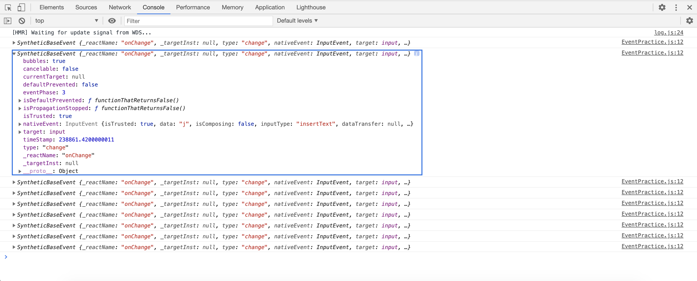
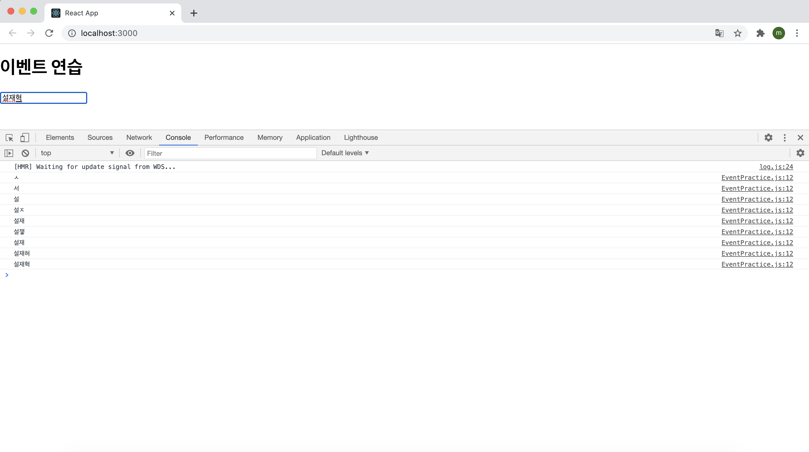

# 2021.03.08

## 4.1 리액트의 이벤트 시스템

리액트의 이벤트 시스템은 웹 브라우저의 HTML 이벤트와 인터페이스가 동일하기 때문에 사용법이 비슷하다. 3장에서 작성한 코드를 다시 살펴보자

```react
import React, { useState } from "react";

const Say = () => {
  const [message, setMessage] = useState("");
  const onClickEnter = () => setMessage("안녕하세요!");
  const onClickLeave = () => setMessage("안녕히가세요!");

  const [color, setColor] = useState("black");
  return (
    <div>
      <button onClick={onClickEnter}>입장</button>
      <button onClick={onClickLeave}>퇴장</button>
      <h1 style={{ color }}>{message}</h1>
      <button style={{ color: "red" }} onClick={() => setColor("red")}>
        빨간색
      </button>
      <button style={{ color: "green" }} onClick={() => setColor("green")}>
        초록색
      </button>
      <button style={{ color: "blue" }} onClick={() => setColor("blue")}>
        파란색
      </button>
    </div>
  );
};

export default Say;
```

사용법은 HTML에서 이벤트 작성하는 것과 비슷하지만 몇가지 주의사항이 있다

#### 4.1.1 이벤트를 사용할 때 주의 사항

1. 이벤트 이름은 카멜 표기법으로 작성한다.

2. 이벤트에 실행할 자바스크립트 코드를 전달하는 것이 아니라, 함수 형태의 값을 전달한다.

   - HTML에서 이벤트 설정할 때는 큰따옴표 안에 실행할 코드를 넣었지만, 리액트에서는 함수 형태의 객체를 전달한다. 화살표 함수 문법으로 바로 만들어서 전달해도 되고, 렌더링 외부에 미리 만들어서 전달해도 된다.

3. DOM 요소에만 이벤트를 설정할 수 있다.

   - 즉 div, button, input, form, span 등의 DOM 요소에는 이벤트를 설정할 수 있지만, 우리가 직접 만든 컴포넌트에는 이벤트를 자체적으로 설정할 수 없다.

   - 예를 들어 아래와 같이 MyComponent에 onClick 값을 설정한다면 MyComponent를 클릭할 때 doSomething 함수를 실행하는 것이 아니라, 그냥 이름이 onClick인 props를 MyComponent에게 전달해줄 뿐이다.

     ```react
     <MyComponent onClick={doSomething} />
     ```

   - 따라서 컴포넌트에 자체적으로 이벤트를 설정할 수 는 없다. 하지만 전달받은 props를 컴포넌트 내부의 DOM 이벤트로 설정할 수는 있다.

     ```react
     <div onClick={this.props.onClick}>
     	{/*(...)*/}
     </div>
     ```

#### 4.1.2 이벤트 종류

리액트에서 지원하는 이벤트 종류는 아래와 같다.

> 💬
>
> - Clipboard
> - Touch
> - Composition
> - UI
> - Keyboard
> - Wheel
> - Focus
> - Media
> - Form
> - Image
> - Mouse
> - Animation
> - Selection
> - Transition

## 4.2 예제로 이벤트 핸들링 익히기

앞으로 실습할 각 단계는 다음과 같다.

> 컴포넌트 생성 및 불러오기 → onChange 이벤트 핸들링하기 → 임의 메서드 만들기 → input 여러 개 다루기 → onKeyPress 이벤트 핸들링하기

#### 4.2.1 컴포넌트 생성 및 불러오기

먼저 클래스형 컴포넌트로 연습할 컴포넌트를 생성했다.

```react
import React, { Component } from "react";

class EventPractice extends Component {
  render() {
    return (
    	<div>
      	<h1>
        	이벤트 연습
        </h1>
      </div>
    )
  }
}

export default EventPractice;
```

#### 4.2.2 onChange 이벤트 핸들링하기

EventPractice 컴포넌트에 input 요소를 렌더링하는 코드와 해당 요소의 onChange 이벤트를 설정하는 코드를 작성한다.

```react
import React, { Component } from "react";

class EventPractice extends Component {
  render() {
    return (
    	<div>
      	<h1>이벤트 연습</h1>
        <input 
          type="text"
          name="message"
          placeholder="아무거나 입력하세요."
          onChange={
          	(e) => console.log(e)  
          }
         />
      </div>
    )
  }
}

export default EventPractice;
```

그런 다음 콘솔을 열고 인풋에 아무거나 입력해보면 콘솔에 이벤트객체가 나타나는 것을 볼 수 있다.



```react
onChange={
  (e) => console.log(e);
}
```

위 코드에서 콘솔에 기록되는 e 객체는 SyntheticEvent로 웹 브라우저의 네이티브 이벤트를 감싸는 객체다. 네이티브 이벤트와 인터페이스가 같으므로 순수 자바스크립트에서 HTML 이벤트를 다룰 때와 동일하게 사용하면 된다.

SyntheticEvent는 네이티브 이벤트와 달리 이벤트가 끝나고 초기화가 되므로 정보를 참조할 수 없다. 예를 들어, 0.5초 뒤에 e 객체를 참조하면 e 객체 내부의 모든 값이 비워지게 된다.

만약 비동기적으로 이벤트 객체를 참조할 일이 있다면 e.persist() 함수를 호출해야 한다.

예를 들어 onChange 이벤트가 발생할 때, 앞으로 변할 인풋 값인 e.target.value를 콘솔에 기록해 보면

```react
onChange={
  (e) => console.log(e.target.value);
}
```

코드를 위와 같이 수정해주고 콘솔을 보게 되면



위 처럼 값이 바뀔 때마다 바뀌는 값을 콘솔에 출력하는 것을 볼 수 있다.

아래 코드는 앞서 배운 state에 input 값을 담는 코드다.

```react
import React, { Component } from "react";

class EventPractice extends Component {
  state = {
    message: "",
  };

  render() {
    return (
      <div>
        <h1>이벤트 연습</h1>
        <input
          type="text"
          name="message"
          placeholder="아무거나 입력하세요."
          value={this.state.message}
          onChange={(e) => {
            this.setState({
              message: e.target.value,
            });
          }}
        />
        <button
          onClick={() => {
            alert(this.state.message);
            this.setState({
              message: "",
            });
          }}
        >
          확인
        </button>
      </div>
    );
  }
}

export default EventPractice;
```

Input 태그를 보게 되면 인풋에 값을 입력할 때마다 onChange함수가 실행 되서  state값을 업데이트 해주는 것을 볼 수 있다. 내가 입력한 값이 state에 잘 들어갔는지 확인을 해보기 위해 그 아래 button 태그는 버튼을 누를 때 발생하는 onClick 함수 내에서 해당하는 state인 message를 alert로 출력해주고 state를 초기화 하는 setState함수를 실행하고 있다. 실행 결과 내가 입력한 값이 메세지 박스에 제대로 출력 되는 것을 확인할 수 있었다.

#### 4.2.3 임의 메서드 만들기

4.1.1의 주의 사항에서 "이벤트를 실행할 자바스크립트 코드를 전달하는 것이 아니라, 함수 형태의 값을 전달한다." 라고 했었다. 그렇기에 이벤트를 처리할 때 렌더링을 하는 동시에 함수를 만들어서 전달을 해줬다. 이 방법 대신 함수를 미리 준비해서 전달하는 방법도 있는데 성능상으로는 차이가 거의 없지만 가독성의 측면에서는 훨씬 좋은 코드를 작성할 수 있다. BUT, 상황에 따라서는 렌더링 메서드 내부에서 함수를 만드는 것이 더 편한 경우도 있다.

위에 작성한 코드에서 함수를 따로 빼네서 임의 메서드를 만들어보면 아래 코드처럼 변경이 된다.

```react
import React, { Component } from "react";

class EventPractice extends Component {
  state = {
    message: "",
  };
	
	constructor(props) {
    super(props);
    this.handleChange = this.handelChange.bind(this);
    this.handleClick = this.handelClick.bind(this);
  }
	
	handleChange(e) {
    this.setState({
      message: e.target.value,
    });
  }	

	handleClick() {
    alert(this.state.message);
    this.setState({
			message: ''
    });
  }

  render() {
    return (
      <div>
        <h1>이벤트 연습</h1>
        <input
          type="text"
          name="message"
          placeholder="아무거나 입력하세요."
          value={this.state.message}
          onChange={this.handleChange}
        />
        <button onClick={this.handelClick}>확인</button>
      </div>
    );
  }
}

export default EventPractice;
```

함수를 따로 빼서 작성을 하니 가독성이 훨씬 좋아진 것을 확인할 수 있다.

함수가 호출될 때 this는 호출부에 따라 결정되므로 , 클래스의 임의 메서드가 특정 HTML 요소의 이벤트로 등록되는 과정에서 메서드와 this의 관계가 끊어져 버린다. 이 때문에 임의 메서드가 이벤트로 등록되어도 this를 컴포넌트 자신으로 제대로 가리키기 위해서는 메서드를 this와 바인딩하는 작업이 필요하다. 만약 바인딩하지 않는 경우라면 this가 undefined를 가리키게 된다. 위 코드에서는 constructor 함수에서 함수를 바인딩하는 작업이 이루어지고 있다.

메서드 바인딩은 생성자 메서드(constructor)에서 하는게 정석이지만 불편하다고 느낄 수 있다. 왜냐면 새 메서드를 만들 때마다 constructor도 수정해야하기 때문이다. 이를 간단히 해결하는 방법은 바벨의 transform-class-properties 문법을 사용하여 화살표 함수 형태로 메서드를 정의하는 것이다.

```react
import React, { Component } from "react";

class EventPractice extends Component {
  state = {
    message: "",
  };
	
	handleChange = (e) => {
    this.setState({
      message: e.target.value,
    });
  }	

	handleClick = () => {
    alert(this.state.message);
    this.setState({
			message: ''
    });
  }

  render() {
    return (
      <div>
        <h1>이벤트 연습</h1>
        <input
          type="text"
          name="message"
          placeholder="아무거나 입력하세요."
          value={this.state.message}
          onChange={this.handleChange}
        />
        <button onClick={this.handelClick}>확인</button>
      </div>
    );
  }
}

export default EventPractice;
```

위처럼 작성하면 더욱 간단하게 메서드를 정의할 수 있다.

#### 4.2.4 input 여러 개 다루기

만약 input을 여러개 다뤄야되는 상황이면 어떻게 처리해야 할까? 임의 메서드를 여러개 만드는 것도 방법이 될 수 있지만 그보다는 event객체를 활용하면 쉽게 만들 수 있다.

방법은 event.target.value의 값을 사용하면 된다. onChange 이벤트 핸들러에서 e.target.name은 해당 input의 name을 가리킨다. 위 코드에서 name은 message이다. 이 값을 사용하여 state를 설정하면 쉽게 해결할 수 있다. 아래 코드를 통해 살펴보자.

```react
import React, { Component } from "react";

class EventPractice extends Component {
  state = {
    username: "",
    message: "",
  };

  handleChange = (e) => {
    this.setState({
      [e.target.name]: e.target.value,
    });
  };

  handleClick = () => {
    alert(this.state.username + ":" + this.state.message);
    this.setState({
      username: "",
      message: "",
    });
  };

  render() {
    return (
      <div>
        <h1>이벤트 연습</h1>
        <input
          type="text"
          name="username"
          placeholder="사용자명"
          value={this.state.username}
          onChange={this.handleChange}
        />
        <input
          type="text"
          name="message"
          placeholder="아무거나 입력하세요."
          value={this.state.message}
          onChange={this.handleChange}
        />
        <button onClick={this.handleClick}>확인</button>
      </div>
    );
  }
}

export default EventPractice;
```

name값이 username인 input을 추가로 렌더링 해줬고, state에도 username이라는 값을 추가해줬다. 그리고 handleChange함수도 살짝 변경시켜줬다. 위 코드의 핵심은 바로 handleChange 함수의 변경사항인데 살펴보게 되면 

```react
handleChange = (e) => {
  this.setState({
    [e.target.name]: e.target.value,
  })
}
```

객체 안에서 key를 [ ]로 감싸주게 되면 그 안에 넣은 레퍼런스가 실제 가리키는 값이 key값으로 사용이 된다. 예를 들어 보자면

```react
const name = "milkboy";
const Object = {
  [name]: "Handsome"
}
console.log(Object);
```

위 코드처럼 객체 내의 name의 값에 [ ]를 감싸주게 되면 name의 실제 값인 "milkboy"가 key로 사용이 된다는 소리다. 객체를 출력해보면

```react
{
  "milkboy":"Handsome"
}
```

이 출력되는 것을 확인할 수 있다.

#### 4.2.5 onKeyPress 이벤트 핸들링

이번에는 키를 눌렀을 때 발생하는 KeyPress 이벤트를 처리하는 방법을 알아보도록 하자. message 입력하는 input에서 Enter를 누르면 handleClick 메서드를 호출하도록 코드를 작성해보면

```react
import React, { Component } from "react";

class EventPractice extends Component {
  state = {
    username: "",
    message: "",
  };

  handleChange = (e) => {
    console.log(e);
    this.setState({
      [e.target.name]: e.target.value,
    });
  };

  handleClick = () => {
    alert(this.state.username + ":" + this.state.message);
    this.setState({
      username: "",
      message: "",
    });
  };

  handleKeyPress = (e) => {
    if (e.key === "Enter") {
      this.handleClick();
    }
  };

  render() {
    return (
      <div>
        <h1>이벤트 연습</h1>
        <input
          type="text"
          name="username"
          placeholder="사용자명"
          value={this.state.username}
          onChange={this.handleChange}
        />
        <input
          type="text"
          name="message"
          placeholder="아무거나 입력하세요."
          value={this.state.message}
          onChange={this.handleChange}
          onKeyPress={this.handleKeyPress}
        />
        <button onClick={this.handleClick}>확인</button>
      </div>
    );
  }
}

export default EventPractice;
```

두 번째 텍스트 인풋에서 값을 입력하고 Enter를 handleClick 메서드가 실행이 되는 것을 확인할 수 있다.

## 4.3 함수형 컴포넌트로 구현해 보기

위에서는 클래스형 컴포넌트로 코드를 구현했다면 함수형 컴포넌트로도 똑같은 기능을 하는 코드를 구현할 수 있다. 아래는 함수형 컴포넌트로 구현한 코드다.

```react
import React, { useState } from "react";

const EventPractice = () => {
  const [message, setMessage] = useState("");
  const [username, setUsername] = useState("");

  const onChangeMessage = (e) => {
    setMessage(e.target.value);
  };
  const onChangeUsername = (e) => {
    setUsername(e.target.value);
  };
  const handleClick = () => {
    alert(username + ":" + message);
    setMessage("");
    setUsername("");
  };
  const onKeyPress = (e) => {
    if (e.key === "Enter") {
      handleClick();
    }
  };

  return (
    <div>
      <h1>이벤트 연습</h1>
      <input
        type="text"
        name="username"
        placeholder="사용자명"
        value={username}
        onChange={onChangeUsername}
      />
      <input
        type="text"
        name="message"
        placeholder="아무거나 입력하세요."
        value={message}
        onChange={onChangeMessage}
        onKeyPress={onKeyPress}
      />
      <button onClick={handleClick}>확인</button>
    </div>
  );
};

export default EventPractice;
```

위 코드에서는 e.target.name을 사용하지 않고 onChange 관련 함수 두 개를 따로 만들어줬다. input이 두 개밖에 없다면 이렇게 작성해도 크게 문제되지는 않지만 input의 개수가 많아진다면 e.target.name을 활용하는 것이 더 좋을 수도 있다.

useState를 통해 사용하는 상태에 문자열이 아닌 개체를 넣어서 코드를 수정할 수도 있다. 코드를 아래와 같이 수정해보면

```react
import React, { useState } from "react";

const EventPractice = () => {
  const [form, setForm] = useState({
    username: "",
    message: "",
  });
  const { username, message } = form;

  const onChange = (e) => {
    const nextForm = {
      ...form, // 기존의 form 내용을 이 자리에 복사한 뒤
      [e.target.name]: e.target.value, // 원하는 값을 덮어 씌우기
    };
    setForm(nextForm);
  };
  const handleClick = () => {
    alert(username + ":" + message);
    setForm({
      username: "",
      message: "",
    });
  };
  const onKeyPress = (e) => {
    if (e.key === "Enter") {
      handleClick();
    }
  };

  return (
    <div>
      <h1>이벤트 연습</h1>
      <input
        type="text"
        name="username"
        placeholder="사용자명"
        value={username}
        onChange={onChange}
      />
      <input
        type="text"
        name="message"
        placeholder="아무거나 입력하세요."
        value={message}
        onChange={onChange}
        onKeyPress={onKeyPress}
      />
      <button onClick={handleClick}>확인</button>
    </div>
  );
};

export default EventPractice;
```

문제없이 실행되는 것을 확인할 수 있다. 이처럼 e.target.name을 활용하려면, 위와 같이 useState를 쓸 때 인풋 값들이 들어 있는 form 객체를 사용해주면 된다.

## 4.4 정리

리액트에서 이벤트를 다루는 것은 순수 자바스크립트 또는 jQuery를 사용한 웹 애플리케이션에서 이벤트를 다루는 것과 비슷하다. 

리액트의 장점 중 하나는 자바스크립트에 익숙하다면 쉽게 활용할 수 있다는 것이다. 따라서 기존 HTML DOM Event를 알고 있다면 리액트의 컴포넌트 이벤트도 쉽게 다룰 수 있을 것이다. => 기본이 중요하다

4장에서는 클래스형 컴포넌트로도 구현해보고 함수형 컴포넌트로도 구현해봤다. 클래스형 컴포넌트에서 할 수 있는 대부분의 작업은 함수형 컴포넌트에서도 구현할 수 있다. 또한 함수형 컴포넌트에서 여러 개의 인풋 상태를 관리하기 위해 useState에서 form 객체를 사용하는 방법도 배웠는데 추후에 배울 Hooks를 공부하면서 더욱 쉽게 구현할 수 있는 방법 또한 배울 예정이다.