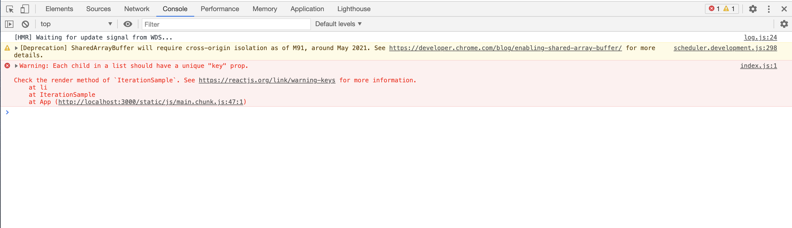
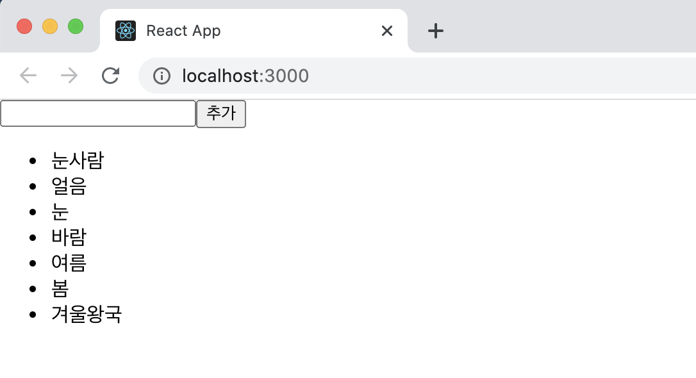
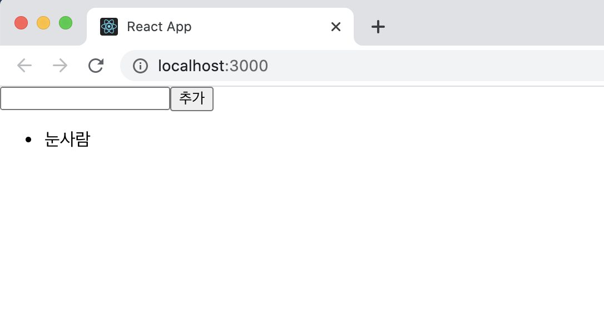

# 컴포넌트 반복

설명을 위해 예제코드를 작성했다.

```react
import React from "react";

const IterationSample = () => {
  return (
  	<ul>
    	<li>눈사람</li>
      <li>얼음</li>
      <li>눈</li>
      <li>바람</li>
    </ul>
  )
}

export default IterationSample;
```

코드에서 <li> 코드가 반복되는 것을 확인할 수 있다. 지금은 크게 문제될 것이 없지만 코드가 좀 더 복잡해지면 코드양이 늘어나면서 파일 용량도 쓸데없이 커지게 된다. 

따라서 반복적인 코드를 효율적으로 작성할 수 있는 방법에 대해서 알아보도록 하겠다.

## 6.1 자바스크립트 배열의 map() 함수

자바스크립트 배열 객체의 내장 함수인 map 함수를 사용하여 반복되는 컴포넌트를 렌더링할 수 있다. 

map함수는 파라미터로 전달된 함수를 사용해서 배열 내 각 요소를 원하는 규칠에 따라 변환한 후 그 결과로 새로운 배열을 생성한다.

#### 6.1.1 문법

```react
arr.map(callback, [thisArg])
```

위 함수의 파라미터는 다음과 같다

1. Callback : 새로운 배열의 요소를 생성하는 함수로 파라미터는 다음 세 가지다.
   - currentValue : 현재 처리하고 있는 요소
   - index : 현재 처리하고 있는 요소의 index 값
   - array : 현재 처리하고 있는 원본 배열
2. thisArg(선택항목 = optional) : callback 함수 내부에서 사용할 this 레퍼런스

##### 6.1.2 예제

```javascript
var numbers = [1,2,3,4,5]

var processed = numbers.map(function(num) {
  return num * num;
})

console.log(processed);
```

위 코드를 출력해보면 [1,4,9,16,25] 가 출력되는 것을 확인할 수 있다.

이를 ES6 문법으로 고쳐서 작성해본다면

```react
const numbers = [1,2,3,4,5];

const processed = numbers.map(num => num * num);

console.log(processed);
```

이처럼 작성해도 같은 결과가 출력된다.

## 6.2 데이터 배열을 컴포넌트 배열로 변환하기

6.1절에서는 기존 배열에 있는 값들을 제곱하여 새로운 배열을 생성했다. 똑같은 원리로 기존 배열로 컴포넌트로 구성된 배열을 생성할 수 있다.

#### 6.2.1 컴포넌트 수정하기

IterationSample 컴포넌트를 아래와 같이 수정을 했다.

```react
import React from "react";

const IterationSample = () => {
  const names = ["눈사람", "얼음", "눈", "바람"];
  const nameList = names.map((name) => <li>{name}</li>);

  return <ul>{nameList}</ul>;
};

export default IterationSample;
```

화면에는 원하는대로 렌더링이 되어 나타나지만 콘솔창을 열어 확인해보면 아래와 같은 경고 메세지가 나온다.



"key" prop이 없다는 경고메세진데 여기서 key란 무엇일까?

## 6.3 key

리액트에서 key는 컴포넌트 배열을 렌더링했을 때 어떤 원소에 변동이 있었는지 알아내려고 사용한다. 예를 들어 유동적인 데이터를 다룰 때는 원소를 새로 생성할 수도, 제거할 수도, 수정할 수도 있다. key가 없을 때는 Virtual DOM을 비교하는 과정에서 리스트를 순차적으로 비교하면서 변화를 감지한다.

하지만 key가 없다면 이 값을 사용하여 어떤 변화가 일어났는지 더욱 빠르게 알아낼 수가 있다.

#### 6.3.1 key 설정

key 값을 설정할 때는 map 함수의 인자로 전달되는 함수 내부에서 컴포넌트 props를 설정하듯이 설정하면 된다.

여기서 key 값은 언제나 유일해야 하며, 따라서 데이터가 가진 고윳값을 key 값으로 설정해야한다.

예를 들어 다음과 같이 게시판의 게시물을 렌더링한다면 게시물 번호를 key 값으로 설정해야 한다.

```react
const articleList = articles.map(article => (
		<Article 
      title={article.title}
      write={article.writer}
      key={article.id}
	)
);
```

하지만 앞서 만들었던 예제 컴포넌트에는 이런 고유 번호가 없다. 이때는 map 함수에 전달되는 콜백 함수의 인수인 index 값을 사용하면 된다.

IterationSample 컴포넌트를 다음과 같이 수정했다.

```react
import React from "react";

const IterationSample = () => {
  const names = ["눈사람", "얼음", "눈", "바람"];
  const nameList = names.map((name,index) => <li key={index}>{name}</li>);

  return <ul>{nameList}</ul>;
};

export default IterationSample;
```

위와 같이 바꾸면 더 이상 콘솔에서 경고 메세지를 표시하지 않는다. 

index를 key로 사용하면 배열이 변경될 때 효율적으로 리렌더링하지 못하기 때문에 고유한 값이 없을 경우에만 index 값을 key로 사용해야한다. 

## 6.4 응용

지금까지 배운 개념들을 응용하여 고정된 배열을 렌더링하는 것이 아닌, 동적인 배열을 렌더링하는 것을 구현해보도록 하자.

위에서 index 값을 key로 사용하면 리렌더링이 비효율적이라고 배웠는데, 이러한 상황에서 어떻게 고윳값을 만들 수 있는지도 알아보도록 하자.

이 실습의 흐름은 다음과 같다.

> 초기 상태 설정하기 → 데이터 추가 기능 구현하기 → 데이터 제거 기능 구현하기

#### 6.4.1 초기 상태 설정하기

IterationSample 컴포넌트에서 useState를 사용하여 상태를 설정했다. 세 가지 상태를 사용하는데 하나는 데이터 배열이고, 다른 하나는 텍스트를 입력할 수 있는 input의 상태이다. 마지막 하나는 데이터 배열에서 새로운 항목을 추가할 때 사용할 고유한 id를 위한 상태이다.

배열을 설정할 때 객체형태로 이루어진 배열을 만들고 해당 객체에는 문자열과 고유 id 값이 있도록 생성했다.

```react
import React, {useState} from "react";

const IterationSample = () => {
  const [names, setNames] = useState([
    {id:1, text:'눈사람'},
    {id:2, text:'얼음'},
    {id:3, text:'눈'},
    {id:4, text:'바람'},
  ]);
  const [inputText, setInputText] = useState('');
  const [nextId, setNextId] = useState(5);

  const nameList = names.map(name => <li key={name.id}>{name.text}</li>);

  return <ul>{nameList}</ul>;
};

export default IterationSample;
```

이번에는 map 함수를 사용할 때 key 값을 index 대신 name.id 값으로 지정했다. 코드를 저장하고 실행해보면 콘솔에는 사용하지 않은 것들에 대한 주의 메세지가 뜨지만 이전과 같은 결과가 출력되는 것을 볼 수 있다.

#### 6.4.2 데이터 추가 기능 구현하기

```react
import React, { useState } from "react";

const IterationSample = () => {
  const [names, setNames] = useState([
    { id: 1, text: "눈사람" },
    { id: 2, text: "얼음" },
    { id: 3, text: "눈" },
    { id: 4, text: "바람" },
  ]);
  const [inputText, setInputText] = useState("");
  const [nextId, setNextId] = useState(5); // 새로운 항목을 추가할 때 사용할 id

  const nameList = names.map((name) => <li key={name.id}>{name.text}</li>);

  const onChange = (e) => setInputText(e.target.value);
  const onClick = () => {
    const nextNames = names.concat({
      id: nextId,
      text: inputText,
    });
    setNextId(nextId + 1); // nextId 값에 1을 더해준다.
    setNames(nextNames); // names 값을 업데이트 한다.
    setInputText(""); // inputText를 비운다.
  };
  return (
    <>
      <input value={inputText} onChange={onChange} />
      <button onClick={onClick}>추가</button>
      <ul>{nameList}</ul>
    </>
  );
};

export default IterationSample;
```

새로운 이름을 등록할 수 있는 기능을 구현하기 위해 ul 태그 상단에 input과 button을 렌더링 하고 input의 상태를 관리한다.

그런 다음 버튼을 클릭했을 때 호출할 onClick 함수를 선언하여 작성하는데 onClick 함수에서 배열의 내장 함수 concat을 사용하여 새로운 항목을 추가한 배열을 만들고, setNames를 통해 상태를 업데이트 했다.

배열의 새 항목을 추가할 때 배열의 push 함수를 사용하지 않고 concat을 사용했는데 push 함수는 기존 배열 자체를 변경해 주는 반면, concat은 새로운 배열을 만들어 준다는 차이점이 있다.

리액트에서 상태를 업데이트할 때는 기존 상태를 그대로 두면서 새로운 값을 상태로 설정해야 한다. 이를 불변성 유지라고 하는데 불변성 유지를 해줘야 나중에 리액트 컴포넌트의 성능을 최적화할 수 있다. 이는 추후에 자세히 알아보도록 하자.

버튼을 눌러 새로운 항목을 추가할 때마다 id 값이 1씩 증가하도록 하고 클릭될 때마다 기존의 input 내용을 비우는 것도 구현했다.

브라우저를 열어 결과를 확인해보면 아래와 같이 정상 작동하는 것을 확인할 수 있다.



#### 6.4.3 데이터 제거 기능 구현하기

이번에는 각 항목을 더블클릭했을 때 해당 항목이 화면에서 사라지는 기능을 구현해보도록 하자.

추가할 때와 마찬가지로 불변성을 유지하면서 업데이트를 해줘야하는 이를 위해 배열의 내장 함수 filter를 사용한다.

filter함수는 배열에서 특정 조건에 만족하는 원소들만 새로운 배열로 만들어 return 하는 함수다. 아래 예시를 보면

```javascript
const numbers = [1,2,3,4,5,6];
const biggerThanThree = numbers.filter(number => number > 3);
//결과 [4,5,6]
```

이 filter 함수를 응용하여 3만 없애고 싶다면 다음과 같이 작성할 수 있다.

```react
const numbers = [1,2,3,4,5,6];
const withoutThree = numbers.filter(number => number !== 3);
//결과 [1,2,4,5,6]
```

이제 이 filter 함수를 이용하여 제거 기능을 구현해보도록 하자. 

HTML 요소를 더블클릭할 때 사용하는 이벤트 이름은 onDoubleClick이다. onRemove라는 함수를 만들어서 각 li 요소에 이벤트 등록을 했다.

```react
import React, { useState } from "react";

const IterationSample = () => {
  const [names, setNames] = useState([
    { id: 1, text: "눈사람" },
    { id: 2, text: "얼음" },
    { id: 3, text: "눈" },
    { id: 4, text: "바람" },
  ]);
  const [inputText, setInputText] = useState("");
  const [nextId, setNextId] = useState(5); // 새로운 항목을 추가할 때 사용할 id

  const onChange = (e) => setInputText(e.target.value);
  const onClick = () => {
    const nextNames = names.concat({
      id: nextId,
      text: inputText,
    });
    setNextId(nextId + 1); // nextId 값에 1을 더해준다.
    setNames(nextNames); // names 값을 업데이트 한다.
    setInputText(""); // inputText를 비운다.
  };
  const onRemove = (id) => {
    const remainNames = names.filter((name) => name.id !== id); // 삭제하려는 id와배열요소의 id를 비교해서 일치하지 않는(삭제하지 않으려는 names) 새로운 배열 리턴
    setNames(remainNames); // names 값 없데이트
  };

  const nameList = names.map((name) => (
    <li key={name.id} onDoubleClick={() => onRemove(name.id)}>
      {name.text}
    </li>
  ));
  return (
    <>
      <input value={inputText} onChange={onChange} />
      <button onClick={onClick}>추가</button>
      <ul>{nameList}</ul>
    </>
  );
};

export default IterationSample;
```

저장하고 실행해보면 브라우저에 다음과 같이 제거 기능이 잘 작동하는 것을 확인할 수 있다.



## 6.5 정리

이 장에서는 반복되는 데이터를 렌더링하는 방법(map 함수 이용)을 배우고, 이를 응용하여 유동적인 배열을 다루어 봤다.

컴포넌트 배열을 렌더링할 때는 항상 key 값 설정에 유의해야 한다. 또 key 값은 언제나 유일해야하고 만약 중복이 된다면 렌더링 과정에서 오류가 발생한다.

상태 안에서 배열을 변형하 때는 배열에 직접 접근하여 수정하는 것이 아니라, concat, filter 등의 배열 내장 함수를 사용하여 새로운 배열을 만든 후 이를 새로운 상태로 설정해 주어야 한다.