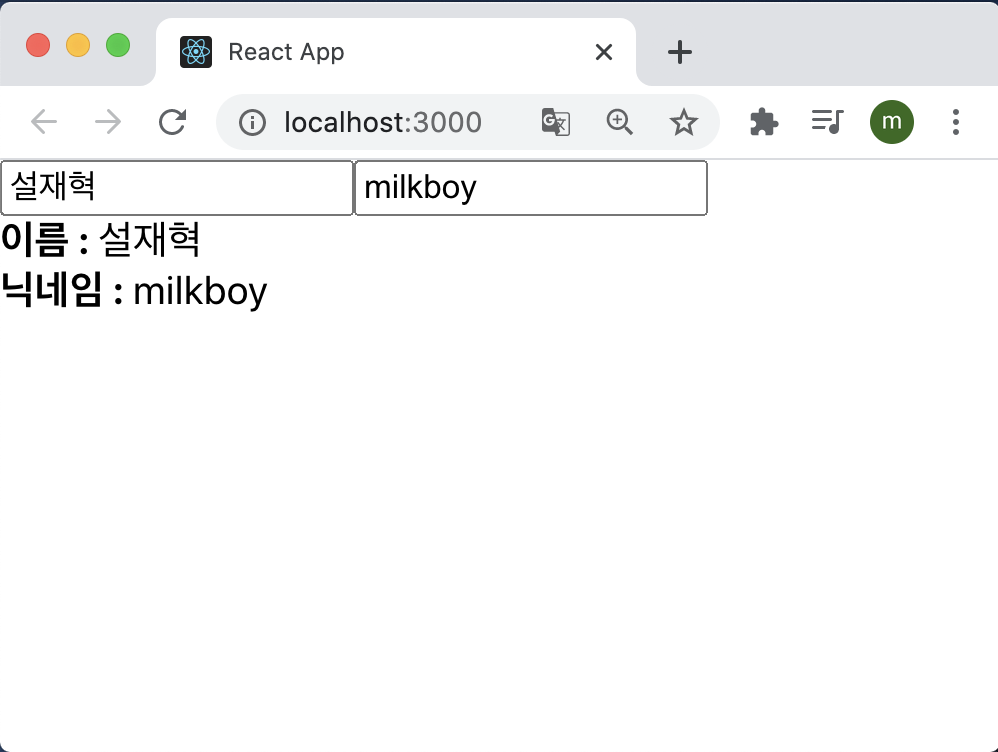
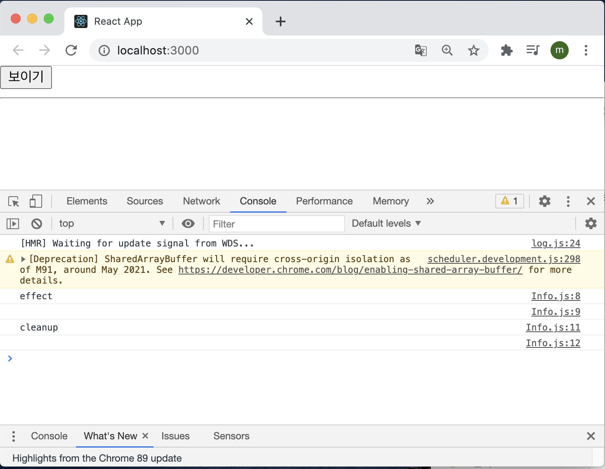
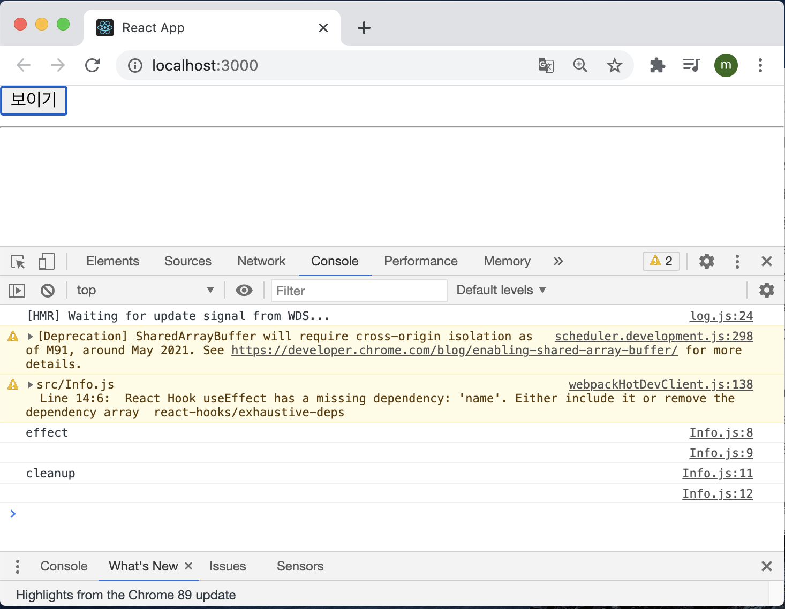
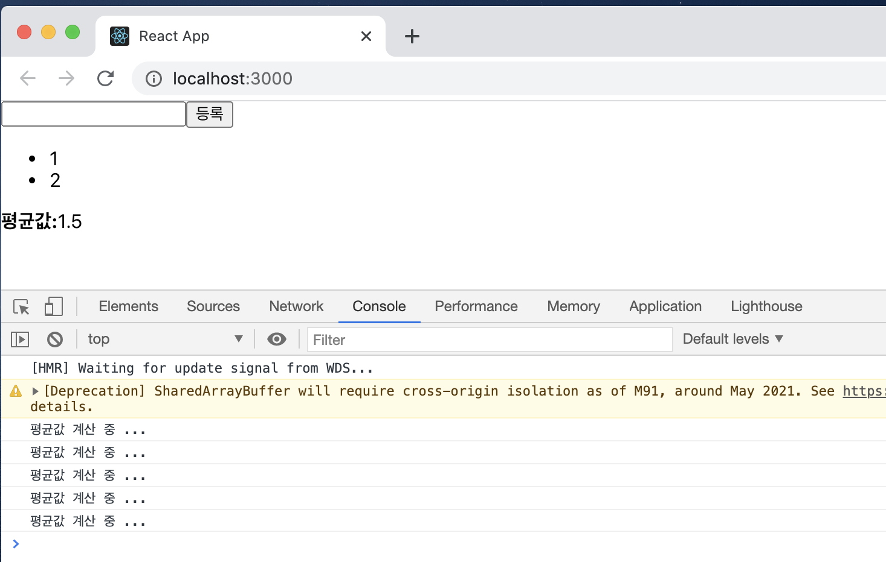
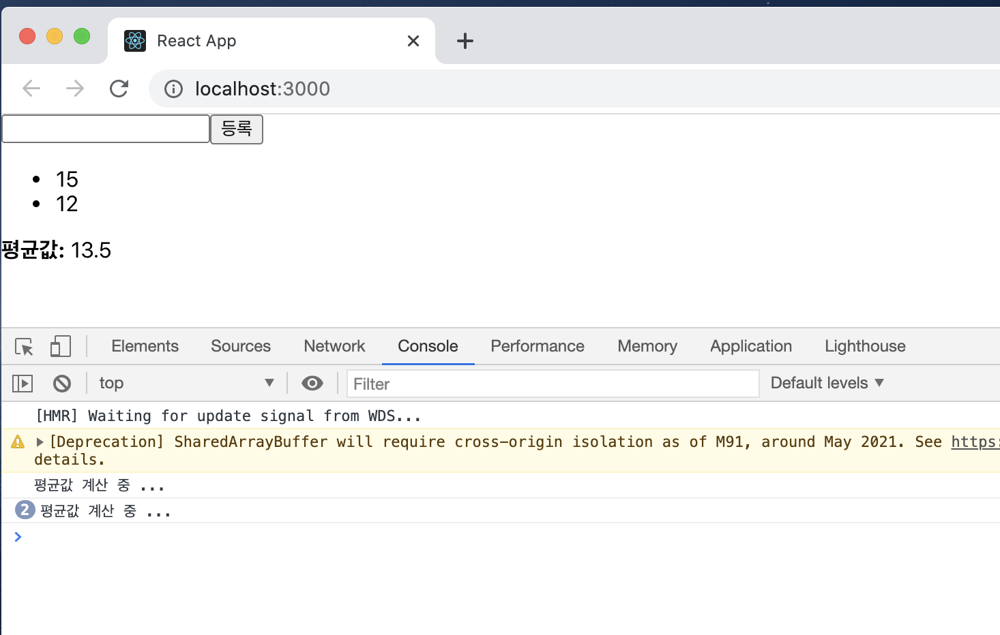

# Hooks

Hooks는 v16.8에 새로 도입된 기능으로 함수형 컴포넌트에서도 상태 관리를 할 수 있는 useState, 렌더링 직후 작업을 설정하는 useState 등의 기능을 제공하여 기존의 함수형 컴포넌트로 할 수 없었던 다양한 작업을 할 수 있게 해준다.

이번 실습은 다음과 같은 흐름으로 진행된다.

> 리액트 내장 Hooks 사용하기 → 커스텀 Hooks 만들기

실습을 진행하기에 앞서 create-react-app을 사용하여 새로운 프로젝트를 만들었다.

> $ yarn create react-app hooks-tutorial

## 8.1 useState

useState는 가장 기본적인 Hook이며, 함수형 컴포넌트에서도 가변적인 상태를 지닐 수 있게 해준다. 

useState 기능을 사용해서 숫자 카운터를 구현해보도록 하자. src 디렉토리에 Counter.js 파일을 생성하고 다음과 같이 입력했다.

```jsx
import reactDom from "react-dom";
import React, { useState } from "react";

const Counter = () => {
  const [value, setValue] = useState(0);

  return (
    <div>
      <p> 현재 카운터의 값은 {value}입니다.</p>
      <button onClick = {() => setValue(value + 1)}>+1</button>
      <button onClick = {() => setValue(value - 1)}>-1</button>
    </div>
  );
}

export default Counter;
```

useState는 코드 상단에서 import 구문을 통해 불러오고 다음과 같이 사용한다.

```jsx
const [value, setValue] = useState(0);
```

useState 함수의 파라미터에는 상태의 기본값을 넣어 준다(여기서는 0). 이 말은 결국 카운터의 기본값을 0으로 설정하겠다는 의미다.

이 함수가 호출되면 배열을 반환하는데 그 배열의 첫 번째 원소는 상태 값, 두 번째 원소는 상태를 설정하는 함수다. 이 함수에 파라미터를 넣어서 호출하면 전달받은 파라미터로 값이 바뀌고 컴포넌트가 정상적으로 리렌더링된다.

App 컴포넌트에 모든 내용을 지우고 Counter 컴포넌트를 렌더링 시켜 버튼을 누르게 되면 원하는 기능이 잘 작동하는 것을 확인할 수 있다.

#### 8.1.1 useState 여러 번 사용하기

하나의 useState 함수는 하나의 상태 값만 관리할 수 있다. 컴포넌트에서 관리해야할 상태값이 여러 개라면 useState를 여러 번 사용하면 된다.

Info 컴포넌트를 생성해서 실습해보도록 하자.

```jsx
import React from "react";

const Info = () => {
  const [name, setName] = useState("");
  const [nickname, setNickname] = useState("");

  const onChangeName = (e) => {
    setName(e.target.value);
  };

  const onChangeNickname = (e) => {
    setNickname(e.target.value);
  };

  return (
    <div>
      <div>
        <input value={name} onChange={onChangeName} />
        <input valur={nickname} onChange={onChangeNickname} />
      </div>
      <div>
        <div>
          <b>이름 : </b>
          {name}
        </div>
        <div>
          <b>닉네임 : </b>
          {nickname}
        </div>
      </div>
    </div>
  );
};

export default Info;
```

결과를 확인해보면 관리할 상태가 여러 개인 경우에도 useState를 통해 쉽게 관리를 할 수 있다.



## 8.2 useEffect

useEffect는 컴포넌트가 렌더링될 때마다 특정 작업을 수행하도록 설정할 수 있는 Hooks이다. 클래스형 컴포넌트의 componentDidMount와 componentDidUpdate를 합친 형태로 봐도 무방하다.

기존에 만들었던 Info 컴포넌트에 useEffect를 적용해보도록 하자.

```jsx
import React, { useEffect, useState } from "react";

const Info = () => {
  const [name, setName] = useState("");
  const [nickname, setNickname] = useState("");

  useEffect(() => {
    console.log("렌더링이 완료됐습니다.");
    console.log({ name, nickname });
  });

  const onChangeName = (e) => {
    setName(e.target.value);
  };

  const onChangeNickname = (e) => {
    setNickname(e.target.value);
  };

  return (
    <div>
      <div>
        <input value={name} onChange={onChangeName} />
        <input valur={nickname} onChange={onChangeNickname} />
      </div>
      <div>
        <div>
          <b>이름 : </b>
          {name}
        </div>
        <div>
          <b>닉네임 : </b>
          {nickname}
        </div>
      </div>
    </div>
  );
};

export default Info;
```

브라우저를 열어 개발자 도구의 콘솔창에서 인풋의 내용을 변경하게 되면 다음과 같은 결과가 출력되는 것을 확인할 수 있다.


input에 값을 입력 받을 때마다 컴포넌트를 리렌더링 시키는 것을 확인 할 수 있다.

#### 8.2.1 마운트될 때만 실행하고 싶을 때

useEffect에서 설정한 함수를 컴포넌트가 화면에 맨 처음 렌더링될 때만 실행하고, 업데이트 될 때는 실행하지 않으려면 함수의 두 번째 파라미터로 비어 있는 배열을 넣어 주면 된다.

```jsx
useEffect(() => {
  console.log('마운트될 때만 실행됩니다.');
}, []);
```

브라우저의 결과를 확인하게 되면 처음 마운트될 때만 실행이 되고 업데이트될 때는 리렌더링을 하지 않는 것을 확인할 수 있다.


#### 8.2.2 특정 값이 업데이트될 때만 실행하고 싶을 때

useEffect를 사용할 때, 특정 값이 변경될 때만 호출하고 싶은 경우가 생길 수 있다.  클래스형 컴포넌트에서는 그런 경우 다음과 같은 방법으로 작성할 것이다.

```jsx
componentDidUpdate(prevProps, prevState) {
  if(prevProps.value !== this.props.value) {
    doSomething();
  }
}
```

위 코드는 props 안에 들어 있는 value 값이 바뀔 때만 특정 작업을 수행한다. 이런 작업을 useEffect에서 해야 한다면 어떻게 해야 할까?

바로 useEffect의 두 번째 파라미터로 전달되는 배열 안에 검사하고 싶은 값을 넣어 주면 된다.

```jsx
useEffect(() => {
  console.log(name);
}, [name]);
```

배열 안에는 useState를 통해 관리하고 있는 상태를 넣어 줘도 되고, props로 전달받은 값을 넣어줘도 된다. 브라우저와 콘솔창을 확인하게 되면 다음과 같은 결과가 나오게 된다.


위 결과처럼 특정한 값(name)이 변경할 때만 값을 추적해 useEffect를 실행하고 추적할 값으로 설정하지 않은 값(nickname)이 변경될 때는 useEffect를 실행하지 않는 것을 확인할 수 있다.

#### 8.2.3 뒷정리하기

useEffect는 기본적으로 렌더링되고 난 직후마다 실행되며, 두 번째 파라미터 배열에 무엇을 넣는지에 따라 실행되는 조건이 달라진다.

컴포넌트가 언마운트되기 전이나 업데이트되기 직전에 어떠한 작업을 수행하고 싶다면 useEffect에서 뒷정리(cleanup)함수를 반환해줘야한다. Info 컴포넌트의 useEffect 부분을 다음과 같이 수정해보자.

```jsx
useEffect(() => {
  console.log("effect");
  console.log(name);
  return () => {
    console.log("cleanup");
    console.log(name);
  };
}, [name]);
```

이제 App 컴포넌트에서 Info 컴포넌트의 가시성을 바꿀 수 있게 설정해보자.

```jsx
import { useState } from "react";
import "./App.css";
import Info from "./Info";

const App = () => {
  const [visible, setVisible] = useState(false);
  return (
    <div>
      <button
        onClick={() => {
          setVisible(true);
        }}
      >
        {visible ? "숨기기" : "보이기"}
      </button>
      <hr />
      {visible && <Info />}
    </div>
  );
};

export default App;
```

작성한 뒤 보이기/숨기기 버튼을 누르고 콘솔창을 보게 되면 아래와 같은 화면이 나타난다.

컴포넌트가 나타날 때 콘솔에 effect가 나타나고, 사라질 때 cleanup이 나타난다.



그런 다음 input에 이름을 적어 보고 콘솔에 결과를 확인하게 되면 아래와 같은 결과가 나타나는 것을 확인할 수 있다.


렌더링될 때마다 뒷정리하는 함수가 계속 나타나는 것을 확인할 수 있다. 그리고 뒷정리 함수가 호출될 때는 업데이트 되기 직전의 값을 보여준다.

오직 언마운트될 때만 뒷정리 함수를 호출하고 싶다면 useEffect 함수의 두 번째 파라미터에 비어 있는 배열을 넣으면 된다.

```jsx
useEffcet(() => {
  console.log('effect');
  console.log(name);
  return () => {
    console.log('cleanup');
    console.log(name);
  };
}, []);
```

결과를 확인해보면


보이기 버튼을 눌렀을 때 useEffect가 실행이 되고 input에 값을 입력하면 실행되지 않는 모습을 볼 수 있다. 

만약 숨기기 버튼을 누른다면 그제서야 아래와 같이 뒷정리 함수를 호출하는 모습을 볼 수 있다.



## 8.3 useReducer

useReducer는 useState보다 더 다양한 컴포넌트 상황에 따라 다양한 상태를 다른 값으로 업데이트해 주고 싶을 때 사용하는 Hooks이다.

리듀서(reducer)라는 개념은 리덕스를 다룰때 더 자세히 알아보도록하자. 리듀서는 현재 상태, 그리고 업데이트를 위해 필요한 정보를 담은 액션(action) 값을 전달받아 새로운 상태를 반환하는 함수다. 리듀서 함수에서 새로운 상태를 만들 때는 반드시 불변성을 지켜줘야한다.

```jsx
function reducer(state, action) {
  return {....}; // 불변성을 지키면서 업데이트한 새로운 상태를 반환한다. 
}
```

액션 값은 주로 다음과 같은 형태로 이루어져 있다.

```jsx
{
  type: 'INCREMENT',
  // 다른 값들이 필요하다면 추가로 들어감
}
```

리덕스에서 사용하는 액션 객체에는 어떤 액션인지 알려주는 type 필드가 꼭 있어야 하지만, useReducer에서 사용하는 액션 객체는 반드시 type을 지니고 있을 필요가 없다. 심지어 객체가 아니라 문자열이나 숫자여도 상관없다.

#### 8.3.1 카운터 구현하기

useReducer를 사용하여 Counter 컴포넌트를 다시 구현해보자.

```jsx
import React, { useReducer } from "react";

function reducer(state, action) {
  // action.type에 따라 다른 작업 수행
  switch (action.type) {
    case "INCREMENT":
      return { value: state.value + 1 };
    case "DECREMENT":
      return { value: state.value - 1 };
    default:
      // 아무것도 해당되지 않을 때 기존 상태 반환
      return state;
  }
}

const Counter = () => {
  const [state, dispatch] = useReducer(reducer, { value: 0 });

  return (
    <div>
      <p> 현재 카운터의 값은 {state.value}입니다.</p>
      <button onClick={() => dispatch({ type: "INCREMENT" })}>+1</button>
      <button onClick={() => dispatch({ type: "DECREMENT" })}>-1</button>
    </div>
  );
};

export default Counter;
```

useReducer의 첫 번째 파라미터에는 리듀서 함수를 넣고, 두 번째 파라미터에는 해당 리듀서의 기본값을 넣어 준다. 이 Hook을 사용하면 state 값과 dispatch 함수를 받아 오는데 여기서 state는 현재 가리키고 있는 상태고, dispatch는 액션을 발생시키는 함수다. dispatch(action)과 같은 형태로, 함수 안에 파라미터로 액션 값을 넣어 주면 리듀서 함수가 호출되는 구조다.

useReducer를 사용했을 때의 가장 큰 장점은 컴포넌트 업데이트 로직을 컴포넌트 바깥으로 빼낼 수 있다는 점이다.

Counter 컴포넌트를 App 컴포넌트에 다시 렌더링 해주고 브라우저에서 결과를 보게 되면 이전과 같이 잘 작동하는 것을 확인 할 수 있다

#### 8.3.2 인풋 상태 관리하기

이번에는 useReducer를 사용하여 info 컴포넌트에서 인풋 상태를 관리해보도록 하자. 기존에는 인풋이 여러 개여서 useState를 여러 번 사용했는데 useReducer를 사용하면 기존에 클래스형 컴포넌트에서 input 태그에 name 값을 할당하고, e.target.name을 참조하여 setState를 해준 것과 유사한 방식으로 작업을 처리할 수 있다.

Info 컴포넌트를 아래와 같이 수정해줬다.

```jsx
import React, { useReducer } from "react";

function reducer(state, action) {
  return {
    ...state,
    [action.name]: action.value,
  };
}

const Info = () => {
  const [state, dispatch] = useReducer(reducer, {
    name: "",
    nicname: "",
  });
  const { name, nickname } = state;

  const onChange = (e) => {
    dispatch(e.target);
  };

  return (
    <div>
      <div>
        <input name="name" value={name} onChange={onChange} />
        <input name="nickname" value={nickname} onChange={onChange} />
      </div>
      <div>
        <div>
          <b>이름 : </b>
          {name}
        </div>
        <div>
          <b>닉네임 : </b>
          {nickname}
        </div>
      </div>
    </div>
  );
};

export default Info;
```

useReducer에서의 액션은 그 어떤 값도 사용 가능하다. 그래서 이번에는 이벤트 객체가 지니고 있는 e.target 값 자체를 액션 값으로 사용했다. 이런 식으로 인풋을 관리하면 아무리 인풋의 개수가 많아져도 코드를 짧고 깔끔하게 유지할 수 있다.

App 컴포넌트에 렌더링시켜 결과를 확인해보면 정상적으로 작동되는 것을 확인할 수 있다.

## 8.4 useMemo

useMemo를 사용하면 함수형 컴포넌트 내부에서 발생하는 연산을 최적화할 수 있다. 이를 알아보기 위해 리스트에 숫자를 추가하면 추가된 숫자들의 평균을 보여 주는 함수형 컴포넌트를 작성해보자.

```jsx
import React, { useState } from "react";

const getAverage = (numbers) => {
  console.log("평균값 계산 중 ...");
  if (numbers.length === 0) return 0;
  const sum = numbers.reduce((a, b) => a + b);
  return sum / numbers.length;
};

const Average = () => {
  const [list, setList] = useState([]);
  const [number, setNumber] = useState("");

  const onChange = (e) => {
    setNumber(e.target.value);
  };

  const onInsert = (e) => {
    const nextList = list.concat(parseInt(number));
    setList(nextList);
    setNumber("");
  };

  return (
    <div>
      <input value={number} onChange={onChange} />
      <button onClick={onInsert}>등록</button>
      <ul>
        {list.map((value, index) => (
          <li key={index}>{value}</li>
        ))}
      </ul>
      <div>
        <b>평균값:</b>
        {getAverage(list)}
      </div>
    </div>
  );
};

export default Average;
```

위와 같이 작성하고 App 컴포넌트에 렌더링 시켜 브라우저의 결과를 확인해보면 아래와 같이 정상적으로 작동되는 것을 확인할 수 있다.



그런데 수자를 등록할 때뿐만 아니라 인풋 내용이 수정될 때도 우리가 만든 getAverage 함수가 호출되는 것을 확인할 수 있었다. 인풋 내용이 바뀔 때는 평균값을 다시 계산할 필요가 없는데, 이렇게 렌더링할 때마다 계산하는 것은 낭비다.

useMemo Hook을 사용하면 이러한 작업을 최적화할 수 있다. 렌더링하는 과정에서 특정 값이 바뀌었을 때만 연산을 실행하고, 원하는 값이 바뀌지 않았다면 이전에 연산했던 결과를 다시 사용하는 방식이다. 

코드를 아래와 같이 수정해보자

```jsx
import React, { useMemo, useState } from "react";

const getAverage = (numbers) => {
  console.log("평균값 계산 중 ...");
  if (numbers.length === 0) return 0;
  const sum = numbers.reduce((a, b) => a + b);
  return sum / numbers.length;
};

const Average = () => {
  const [list, setList] = useState([]);
  const [number, setNumber] = useState("");

  const onChange = (e) => {
    setNumber(e.target.value);
  };

  const onInsert = (e) => {
    const nextList = list.concat(parseInt(number));
    setList(nextList);
    setNumber("");
  };

  const avg = useMemo(() => getAverage(list), [list]);

  return (
    <div>
      <input value={number} onChange={onChange} />
      <button onClick={onInsert}>등록</button>
      <ul>
        {list.map((value, index) => (
          <li key={index}>{value}</li>
        ))}
      </ul>
      <div>
        <b>평균값:</b> {avg}
      </div>
    </div>
  );
};

export default Average;
```

저장하고 실행결과를 보게 되면 아래와 같이 list 배열의 내용이 바뀔 때만 getAverage 함수가 호출되는 것을 확인할 수 있다.



## 8.5 useCallback

useCallback은 useMemo와 상당히 비슷한 함수다. 주로 렌더링 성능을 최적화해야 하는 상황에서 사용하는데 이 Hook을 사용하면 만들어 놨던 함수를 재사용할 수 있다.

방금 구현한 Average 컴포넌트를 보면 onChange와 onInsert라는 함수를 선언해줬다. 이렇게 선언하면 컴폰너트가 리렌더링될 때마다 새로 만들어진 함수를 사용하게 된다. 대부분의 경우 이러한 방식은 문제없지만, 컴포넌트의 렌더링이 자주 발생하거나 렌더링해야 할 컴포넌트의 개수가 많아지면 이 부분을 최적화해 주는 것이 좋다.

useCallback을 이용해서 Average 컴포넌트를 최적화해보자.

```jsx
import React, { useCallback, useMemo, useState } from "react";

const getAverage = (numbers) => {
  console.log("평균값 계산 중 ...");
  if (numbers.length === 0) return 0;
  const sum = numbers.reduce((a, b) => a + b);
  return sum / numbers.length;
};

const Average = () => {
  const [list, setList] = useState([]);
  const [number, setNumber] = useState("");

  const onChange = useCallback((e) => {
    setNumber(e.target.value);
  }, []); // 컴포넌트가 처음 렌더링 될 때만 함수 생성

  const onInsert = useCallback(() => {
    const nextList = list.concat(parseInt(number));
    setList(nextList);
    setNumber("");
  }, [number, list]); // number or list가 바뀌었을 때만 함수 생성

  const avg = useMemo(() => getAverage(list), [list]);

  return (
    <div>
      <input value={number} onChange={onChange} />
      <button onClick={onInsert}>등록</button>
      <ul>
        {list.map((value, index) => (
          <li key={index}>{value}</li>
        ))}
      </ul>
      <div>
        <b>평균값:</b> {avg}
      </div>
    </div>
  );
};

export default Average;
```

useCallback의 첫 번째 파라미터에는 생성하고 싶은 함수를 넣고, 두 번째 파라미터에는 배열을 넣으면 된다. 이 배열에는 어떤 값이 바뀌었을 때 함수를 새로 생성해야 하는지 명시해야 한다.

onChange처럼 비어 있는 배열을 넣게 되면 컴포넌트가 렌더링될 때 만들었던 함수를 계속해서 재사용하게 되며 onInsert처럼 배열 안에 number와 list를 넣게 되면 인풋 내용이 바뀌거나 새로운 항목이 추가될 때 새로 만들어진 함수를 사용하게 된다.

함수 내부에서 상태 값에 의존해야 할 때는 그 값을 반드시 두 번째 파라미터 안에 포함시켜 주어야 한다. 예를 들어 onChange의 경우 기존의 값을 조회하지 않고 바로 설정만 하기 때문에 배열이 비어 있어도 상관없지만, onInsert는 기존의 number와 list를 조회해서 nextList를 생성하기 때문에 배열 안에 number와 list를 꼭 넣어 주어야 한다.

## 8.6 useRef

useRef는 함수형 컴포넌트에서 ref를 쉽게 사용할 수 있도록 해준다. Average 컴포넌트에서 등록 버튼을 눌럿을 때 포커스가 인풋 쪽으로 넘어가도록 코드를 작성해보자.

```jsx
import React, { useCallback, useMemo, useState, useRef } from "react";

const getAverage = (numbers) => {
  console.log("평균값 계산 중 ...");
  if (numbers.length === 0) return 0;
  const sum = numbers.reduce((a, b) => a + b);
  return sum / numbers.length;
};

const Average = () => {
  const [list, setList] = useState([]);
  const [number, setNumber] = useState("");
  const inputEl = useRef(null);

  const onChange = useCallback((e) => {
    setNumber(e.target.value);
  }, []); // 컴포넌트가 처음 렌더링 될 때만 함수 생성

  const onInsert = useCallback(() => {
    const nextList = list.concat(parseInt(number));
    setList(nextList);
    setNumber("");
    inputEl.current.focus();
  }, [number, list]); // number or list가 바뀌었을 때만 함수 생성

  const avg = useMemo(() => getAverage(list), [list]);

  return (
    <div>
      <input value={number} onChange={onChange} ref={inputEl} />
      <button onClick={onInsert}>등록</button>
      <ul>
        {list.map((value, index) => (
          <li key={index}>{value}</li>
        ))}
      </ul>
      <div>
        <b>평균값:</b> {avg}
      </div>
    </div>
  );
};

export default Average;
```

useRef를 사용하여 ref를 설정하면 useRef를 통해 만든 객체 안의 current 값이 실제 엘리먼트를 가리킨다.

#### 8.6.1 로컬 변수 사용하기

추가로 컴포넌트 로컬 변수를 사용해야 할 때도 useRef를 활용할 수 있다. 여기서 로컬 변수란 렌더링과 상관없이 바뀔 수 있는 값을 의미한다. 클래스 형태로 작성된 컴포넌트의 경우에는 로컬 변수를 사용해야 할 때 다음과 같이 작성할 수 있다.

```jsx
import React, { Component } from "react";

class MyComponent extends Component {
  id = 1
	setId = (n) => {
    this.id = n;
  }
  printId = () => {
    console.log(this.id);
  }
  
  render() {
    return (
    	<div>
      	MyComponent
      </div>
    );
  }
}

export default MyComponent;
```

위와 같은 코드를 함수형 컴포넌트로 작성하면 아래와 같은 코드로 작성할 수 있다.

```jsx
import React, { useRef } from "react";

const RefSample = () => {
  const id = useRef(1);
  const setId = (n) => {
    id.current = n;
  }
  const printId = () => {
    console.log(id.current);
  }
  
  return (
    <div>
      MyComponent
    </div>
  ); 
}

export default RefSample;
```

이렇게 ref 안의 값이 바뀌어도 컴포넌트가 렌더링되지 않는다는 점에는 주의해야 한다. 렌더링과 관련되지 않은 값을 관리할 때만 이러한 방식으로 코딩을 해야 한다.

## 8.7 커스텀 Hooks 만들기

여러 컴포넌트에서 비슷한 기능을 공유할 경우, 이를 여러분만의 Hook으로 작성하여 로직을 재사용할 수 있다.

기존에 Info 컴포넌트에서 여러 개의 인풋을 관리하기 위해 useReducer로 작성했던 로직을 useInputs라는 Hook으로 따로 분리해보자.

```jsx
import { useReducer } from "react";

function reducer(state, action) {
  return {
    ...state,
    [action.name]: action.value,
  };
}

export default function useInputs(initialForm) {
  const [state, dispatch] = useReducer(reducer, initialForm);
  const onChange = (e) => {
    dispatch(e.target);
  };
  return [state, onChange];
}
```

이 Hook을 Info 컴포넌트에 적용시키면 아래와 같이 적용할 수 있고 결과 또한 정상적으로 출력되는 것을 확인할 수 있다.

```jsx
import React, { useReducer } from "react";
import useInputs from "./useInputs";

const Info = () => {
  const [state, onChange] = useInputs({
    name: "",
    nickname: "",
  });
  const { name, nickname } = state;

  return (
    <div>
      <div>
        <input name="name" value={name} onChange={onChange} />
        <input name="nickname" value={nickname} onChange={onChange} />
      </div>
      <div>
        <div>
          <b>이름 : </b>
          {name}
        </div>
        <div>
          <b>닉네임 : </b>
          {nickname}
        </div>
      </div>
    </div>
  );
};

export default Info;
```

나만의 Hook을 만들어 사용하면 위에서 작성한 Info 컴포넌트의 코드보다 훨씬 깔끔한 코드를 작성할 수 있다.

## 8.8 다른 Hooks

내가 만들었던 useInputs과 같은 커스텀 Hooks처럼 다른 개발자가 만든 Hooks도 라이브러리로 설치하여 사용할 수 있다.

다른 개발자가 만든 다양한 Hooks 리스트는 다음 링크에서 확인할 수 있다.

- [1]: (Https://nikgraf.github.io/react-hooks/)

- [ 2 ]: (Https://github.com/rehooks/awesome-react-hooks)

- [3 ]: (https://www.npmjs.com/package/react)

## 8.9 정리

리액트에서 Hooks 패턴을 사용하면 클래스형 컴포넌트를 작성하지 않고도 대부분의 기능을 구현할 수 있다. 이러한 기능이 리액트에 릴리즈되었다고 해서 기존의 setState를 사용하는 방식이 잘못된 것은 아니다. 물론 useState 혹은 useReducer를 통해 구현할 수 있더라 하더라도 말이다.

리액트 메뉴얼에 따르면, 기존의 클래스형 컴포넌트는 앞으로도 계속해서 지원될 예정이라고 한다. 그렇기 때문에 만약 유지 보수하고 있는 프로젝트에서 클래스형 컴포넌트를 사용하고 있다면, 이를 굳이 함수형 컴포넌트와 Hooks를 사용하는 형태로 전환할 필요는 없다. 다만, 매뉴얼에서는 새로 작성하는 컴포넌트의 경우 함수형 컴포넌트와 Hooks를 사용할 것을 권장하고 있다.