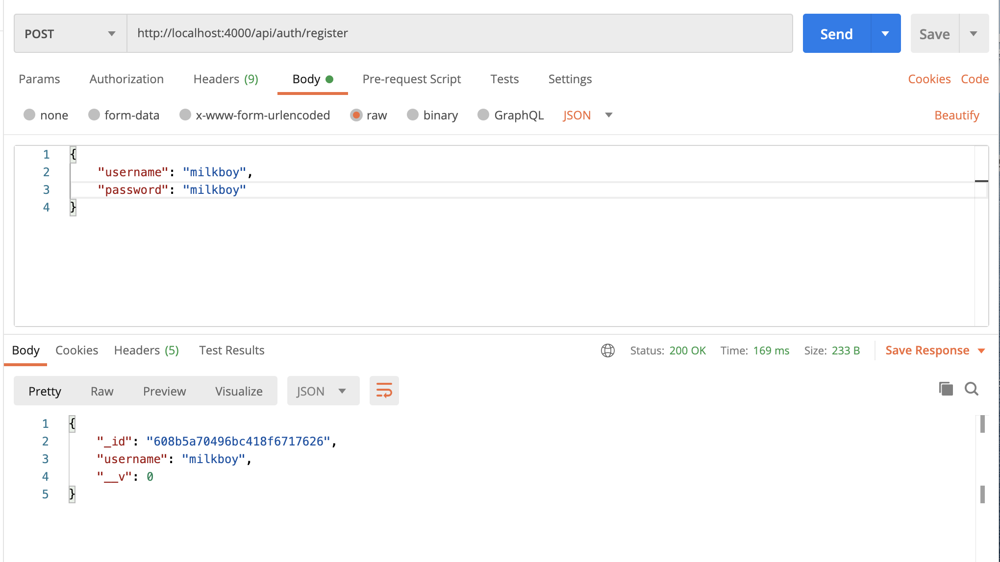
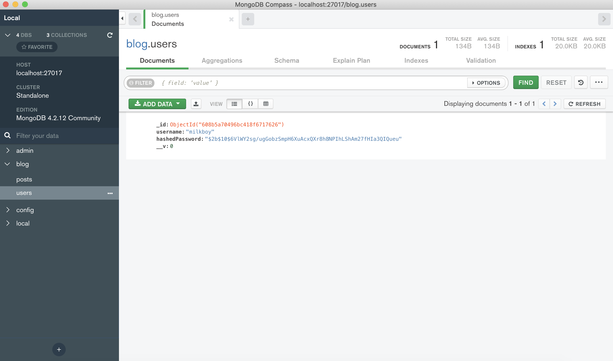
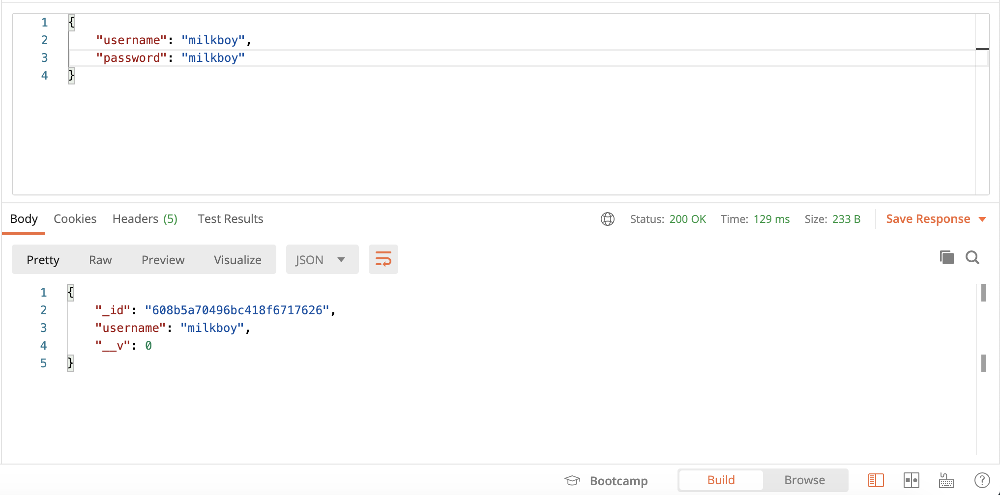
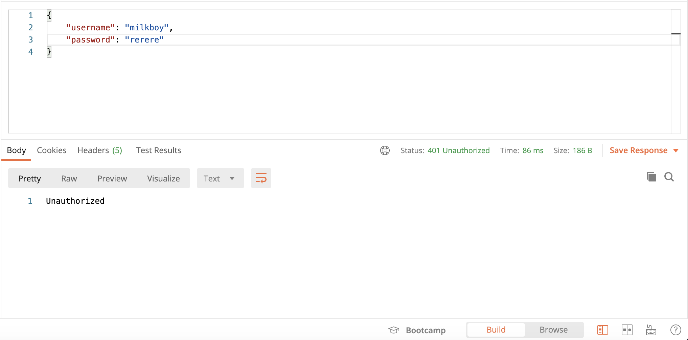
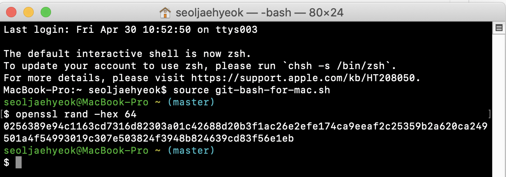
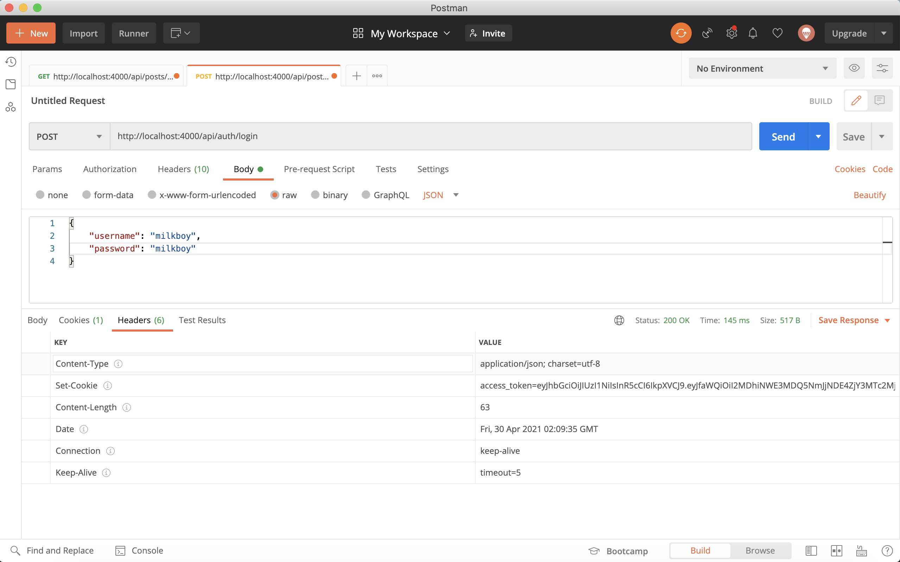
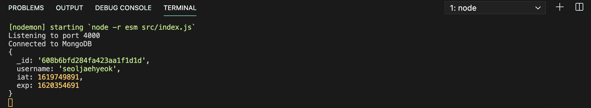
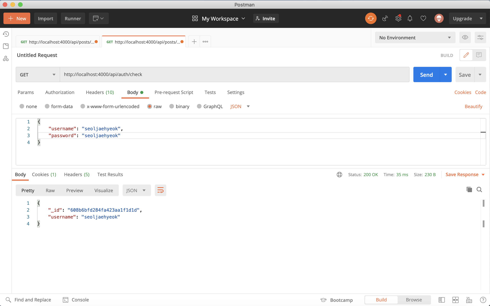

# JWT를 통한 회원 인증 시스템 구현하기

## 23.1 JWT의 이해

이 장에서는 우리가 만든 서버에 회원 인증 시스템을 구현해 보자. 이 시스템을 구현하기 위해 JWT라는 기술을 사용한다. JWT는 JSON Web Token의 약자로, 데이터가 JSON으로 이루어져 있는 토큰을 의미한다. 두 개체가 서로 안전하게 정보를 주고 받을 수 있도록 웹 표준으로 정의된 기술이다.

#### 23.1.1 세션 기반 인증과 토큰 기반 인증의 차이

사용자의 로그인 상태를 서버에서 처리하는 데 사용할 수 있는 대표적인 두 가지 인증방식이 있다. 하나는 세션을 기반으로 인증하는 것이고, 다른 하나는 토큰을 기반으로 인증하는 것이다. 두 방식의 차이점에 대해서 알아보도록 하자.

**세션 기반 인증 시스템**

세션을 기반으로 인증 시스템을 만든다는 것은 어떤 의미일까? 한마디로 말하면, 서버가 사용자가 로그인 중임을 기억하고 있다는 뜻이다.


세션 기반 인증 시스템에서 사용자가 로그인을 하면, 서버는 세션 저장소에 사용자의 정보를 조회하고 세션 id를 발급한다. 발급된 id는 주로 브라우저의 쿠키에 저장한다. 그다음에 사용자가 다른 요청을 보낼 때마다 서버는 세션 저장소에서 세션을 조회한 후 로그인 여부를 결정하여 작업을 처리하고 응답을 한다. 세션 저장소는 주로 메모리, 디스크, DB 등을 사용한다.

세션 기반 인증의 단점은 서버를 확장하기가 번거로울 수 있다는 점이다. 만약 서버의 인스턴스가 여러 개가 된다면, 모든 서버끼리 같은 세션을 공유해야 하므로 세션 전용 데이터베이스를 만들어야 할 뿐 아니라 신경 써야 할 것도 많다.

**토큰 기반 인증 시스템**

토큰은 로그인 이후 서버가 만들어 주는 문자열이다. 해당 문자열 안에는 사용자의 로그인 정보가 들어 있고, 해당 정보가 서버에서 발급되었음을 증명하는 서명이 들어 있다.

서명 데이터는 해싱 알고리즘을 통해 만들어지는데, 주로 HMAC SHA256 혹은 RSA SHA 256알고리즘이 사용된다.


**서버에서 만들어 준 토큰은 서명이 있기 때문에 무결성이 보장**된다. 여기서 무결성이란 정보가 변경되거나 위조되지 않았음을 의미하는 성질이다. 사용자가 로그인을 하면 서버에서 사용자에게 해당 사용자의 정보를 지니고 있는 토큰을 발급해 주고, 추후 사용자가 다른 API를 요청하게 될 때 발급받은 토큰과 함께 요청하게 된다. 그러면 서버는 해당 토큰이 유효한지 검사하고, 결과에 따라 작업을 처리하고 응답한다.

토큰 기반 인증시스템의 장점은 서버에서 사용자 로그인 정보를 기억하기 위해 사용하는 리소스가 적다는 것이다. 사용자 쪽에서 로그인 상태를 지닌 토큰을 가지고 있으므로 서버의 확장성이 매우 높다. 서버의 인스턴스가 여러 개로 늘어나도 서버끼리 사용자의 로그인 상태를 공유하고 있을 필요가 없다.

여기서는 두 가지 시스템 중 토큰 기반 인증 시스템을 사용할 예정이다. 실습은 다음과 같은 흐름으로 진행된다.

> User 스키마/모델 만들기 → 회원 인증 API 만들기 → 토큰 발급 및 검증하기 → posts API에 회원 인증 시스템 도입하기 → username/tags로 포스트 필터링 하기

## 23.2 User 스키마/모델 만들기

User 스키마와 모델을 작성하여 사용자의 정보를 MongoDB에 담고 조회해 보자. 앞으로 만들 사용자 스키마에는 사용자 계정명과 비밀번호가 필요하다.

비밀번호를 데이터베이스에 저장할 때 플레인 텍스트로 저장하면 보안상 매우 위험하다. 따라서 단방향 해싱 함수를 지원해 주는 bcrypt라는 라이브러리를 사용하여 비밀번호를 안전하게 저장해줘야 한다.

우선 User model을 만들고 스키마를 작성한다.

```jsx
import mongoose, { Schema } from 'mongoose';

const UserSchema = new Schema({
  username: String,
  hashedPassword: String,
});

const User = mongoose.model('User', UserSchema);
export default User;
```

다음으로 해시를 만드는 함수와 해시를 검증하는 함수를 만들텐데 먼저 bcrypt를 설치해 준다.

`$ yarn add bcrypt`

#### 23.2.1 모델 메서드 만들기

모델 메서드는 모델에서 사용할 수 있는 함수를 의미하며, 두 가지 종류가 있다. 첫 번째는 인스턴스 메서드로, 몯레을 통해 만든 문서 인스턴스에서 사용할 수 있는 함수를 의미한다.

두 번째는 스태틱 메서드로, 모델에서 바로 사용할 수 있는 함수를 의미한다.

**인스턴스 메서드 만들기**

이제 모델에서 사용할 두 개의 인스턴스 메서드를 만들어 보자. 첫 번째 메서드는 setPassword다. 이 메서드를 통해 비밀번호를 파라미터로 받아서 계정의 hashedPassword 값을 설정해 준다. 

두 번째 메서드는 checkPassword다. 이 메서드는 파라미터로 받은 비밀번호가 해당 계정의 비밀번호와 일치하는지 검증해 준다.

```jsx
import mongoose, { Schema } from 'mongoose';
import bcrypt from 'bcrypt';

const UserSchema = new Schema({
  username: String,
  hashedPassword: String,
});

UserSchema.methods.setPassword = async function (password) {
  const hash = bcrypt.hash(password, this.hashedPassword);
  this.hashedPassword = hash;
};

UserSchema.methods.checkPassword = async function (password) {
  const result = await bcrypt.compare(password, this.hashedPassword);
  return result; // True of False
};

const User = mongoose.model('User', UserSchema);
export default User;
```

인스턴스 메서드를 작성할 때는 화살표 함수가 아닌 function 키워드를 사용하여 구현해야 한다. 함수 내부에서 this에 접근해야 하기 때문인데 여기서 this는 문서 인스턴스를 가리킨다. 화살표 함수를 사용하게 되면 this는 문서 인스턴스를 가리키지 못하게 된다.

#### 23.2.2 스태틱 메서드 만들기

이번에는 스태틱 메서드를 만들어 보자. findByUsername이라는 메서드를 작성할텐데 이 메서드는 username으로 데이터를 찾을 수 있게 해 준다.

```jsx
import mongoose, { Schema } from 'mongoose';
import bcrypt from 'bcrypt';

const UserSchema = new Schema({
  username: String,
  hashedPassword: String,
});

UserSchema.methods.setPassword = async function (password) {
  const hash = bcrypt.hash(password, this.hashedPassword);
  this.hashedPassword = hash;
};

UserSchema.methods.checkPassword = async function (password) {
  const result = await bcrypt.compare(password, this.hashedPassword);
  return result; // True of False
};

UserSchema.statics.findByUsername = function (username) {
  return this.findOne({ username });
};

const User = mongoose.model('User', UserSchema);
export default User;
```

스태틱 함수에서의 this는 모델을 가리킨다. 여기서는 User를 가리키고 있다.

## 23.3 회원 인증 API 만들기

회원 인증 API를 구현하기 위해 먼저 새로운 라우트 auth를 정의 해줘야 한다. Api 디렉터리에 auth 디렉터리를 생성하고 그 안에 auth.ctrl.js를 아래와 같이 작성한다.

```jsx
export const register = async (ctx) => {
  // 회원 가입
};

export const login = async (ctx) => {
  // 로그인
};

export const check = async (ctx) => {
  // 로그인 상태 확인
};

export const logout = async (ctx) => {
  // 로그아웃
};
```

이번 라우트에서는 총 네 개의 API를 만들것이다. 위와 같이 함수의 틀만 잡아주고, auth 디렉터리에 index.js 파일을 만들어서 auth 라우터를 생성해 준다.

```jsx
import Router from 'koa-router';
import * as authCtrl from './auth.ctrl';

const auth = new Router();

auth.post('/register', authCtrl.register);
auth.post('/login', authCtrl.login);
auth.get('/check', authCtrl.check);
auth.post('/logout', authCtrl.logout);

export default auth;
```

그런 다음 auth 라우터를 api 라우터에 적용해 준다.

```jsx
import Router from 'koa-router';
import auth from './auth';
import posts from './posts';

const api = new Router();

api.use('/posts', posts.routes());
api.use('/auth', auth.routes());

// 라우터를 내보낸다.
export default api;
```

API 라우트의 구조는 다 잡았고 이제 기능을 하나씩 구현해 보자.

#### 23.3.1 회원가입 구현하기

auth.ctrl.js 파일의 register 함수를 아래와 같이 작성해 준다.

```jsx
import Joi from 'joi';
import User from '../../models/user';

/*
  POST /api/auth/register
  {
    username: 'milkboy',
    password: '123456good',
  }
*/
export const register = async (ctx) => {
  // Request Body 검증
  const schema = Joi.Object().keys({
    username: Joi.string().alphanum().min(3).max(20).required(),
    password: Joi.string().required(),
  });
  const result = schema.validate(ctx.request.body);
  if(result.error) {
    ctx.status = 400;
    ctx.body = result.error;
    return;
  }

  const {username, password} = ctx.request.body;
  try {
    // username이 이미 존재하는지 솩인
    const exists = await User.findByUsername(username);
    if(exists) {
      ctx.status = 409; // Conflict
      return;
    }

    const user = new User({
      username,
    })
    await user.setPassword(password); // 비밀번호 설정
    await user.save(); // 데이터베이스에 저장

    // 응답할 데이터에서 hasedPassword 필드 제거
    const data = user.toJSON();
    delete data.hashedPassword;
    ctx.body = data;
  } catch(e) {
    ctx.throw(500, e);
  }
};
```

회원가입 할 때 중복되는 계정이 생성되지 않도록 기존에 해당 username이 존재하는지 확인했다. 이 작업은 findByUsername 스태틱 메서드를 사용해 처리했다. 그리고 비밀번호를 설정하는 과정에서는 setPassword 인스턴스 함수를 사용했다. 

이렇게 스태틱 또는 인스턴스 함수에서 해야 하는 작업들은 이 API 함수 내부에서 직접 구현해도 상관없지만, 이렇게 메서드들을 만들어서 사용하면 가독성도 좋고 추후 유지 보수를 할 때도 도움이 된다.

함수의 마지막 부분에서는 hashedPassword 필드가 응답되지 않도록 데이터를 JSON으로 변환한 후 delete를 통해 해당 필드를 지워줬다. 앞으로 비슷한 작업을 자주 하게 되므로 이 작업을 serialize라는 인스턴스 함수로 따로 만들어 주자.

```jsx
UserSchema.methods.serialize = function () {
  const data = this.toJSON();
  delete data.hashedPassword;
  return data;
};
```

이제 기존의 코드를 user.serialize()로 대체시켜 준다.

```jsx
export const register = async (ctx) => {
 		(...)
     
    const user = new User({
      username,
    });
    await user.setPassword(password); // 비밀번호 설정
    await user.save(); // 데이터베이스에 저장

    // 응답할 데이터에서 hasedPassword 필드 제거
    ctx.body = user.serialize();
  } catch (e) {
    ctx.throw(500, e);
  }
};

(...)
```

이제 이 API의 작동을 확인하기 위해 POST 요청을 보내면 아래와 같은 응답이 나타나게 된다.



Compass를 통해 보면 데이터베이스에 실제로 데이터가 잘 생성된 것을 확인할 수 있다.



이제 같은 username으로 다시 요청을 보내게 되면 중복 요청이므로 Conflict 에러가 발생할 것이다.

#### 23.3.2 로그인 구현

로그인 기능을 구현하기 위해 login 함수를 아래와 같이 정의한다.

```jsx
export const login = async (ctx) => {
  // 로그인
  const { username, password } = ctx.request.body;

  // username, password가 없으면 에러 처리
  if (!username || !password) {
    ctx.status = 401; // Unauthorized
    return;
  }

  try {
    const user = await user.findByUsername(username);
    // 계정이 존재하지 않으면 에러 처리
    if (!user) {
      ctx.status = 401;
      return;
    }

    const valid = await user.checkPassword(password);
    // 잘못된 비밀번호
    if (!valid) {
      ctx.status = 401;
      return;
    }
    ctx.body = user.serialize();
  } catch (e) {
    ctx.throw(500, e);
  }
};
```

이 API에서는 username과 password가 제대로 전달되지 않으면 에러로 처리한다. 그리고 findByUsername을 통해 사용자 데이터를 찾고, 만약 사용자 데이터가 없으면 역시 에러로 처리한다. 계정이 유효하다면 checkPassword를 통해 비밀번호를 검사하고 성공했을 때는 계정 정보를 응답한다.

Postman으로 조금 전 생성해던 계정 정보로 로그인 API를 요청해보자.



위와 같이 해당 사용자의 정보를 응답하는 것을 확인할 수 있다. 만약 틀린 비밀번호로 요청했다면, 401Unauthorized 에러가 발생할 것이다.



## 23.4 토큰 발급 및 검증

이제 클라이언트에서 사용자 로그인 정보를 지니고 있을 수 있도록 서버에서 토큰을 발급해 주자. JWT 토큰을 만들기 위해서는 jsonwebtoken이라는 모듈을 설치해야 한다.

`$ yarn add jsonwebtoken`

#### 23.4.1 비밀키 설정하기

.env 파일을 열어서 JWT 토큰을 만들 때 사용할 비밀키를 만든다. 이 비밀키는 문자열로 아무거나 입력하면 된다. 

터미널에 `openssl rand -hex 64` 명령어를 입력하면 아래와 같이 랜덤 문자열을 만들어 준다. 이 값을 복사해 .env 파일에 JWT_SECRET 값으로 설정해 준다.



이 비밀키는 나중에 JWT 토큰의 서명을 만드는 과정에서 사용된다. 비밀키는 외부에 공개되면 절대로 안된다. 공개되는 순간, 누구든지 JWT 토큰을 발급할 수 있기 때문이다.

#### 23.4.2 토큰 발급

비밀키를 설정했으니 토큰을 발급할 차례다. User 모델 파일에서 generateToken이라는 인스턴스 메서드를 만들어 준다.

```jsx
import mongoose, { Schema } from 'mongoose';
import bcrypt from 'bcrypt';
import jwt from "jsonwebtoken";

(...)

UserSchema.methods.generateToken = function() {
  const token = jwt.sign(
    // 첫 번째 파라미터에는 토큰 안에 집어넣고 싶은 데이터를 넣는다.
    {
      _id: this.id,
      username: this.username
    },
    process.env.JWT_SESCRET, // 두 번째 파라미터에는 JWT 암호를 넣는다.
    {
      expiresIn: '7d', // 7일 동안 유효
    }
  );
  return token;
}
```

이제 회원가입과 로그인에 성공했을 때 토큰을 사용자에게 전달해 주자. 사용자가 브라우저에서 토큰을 사용할 때는 주로 두 가지 방법을 사용한다. 첫 번째는 브라우저의 localStorage 혹은 sessionStorage에 담아서 사용하는 방법이고, 두 번째는 브라우저의 쿠키에 담아서 사용하는 방법이다.

브라우저의 localStorage 혹은 sessionStorage에 토큰을 담으면 매우 사용하기가 편리하고 구현도 쉽다. 하지만 누군가 페이지에 악성 스크립트를 삽입한다면 쉽게 토큰을 탈취할 수 있다(이러한 공격을 XSS(Cross Site Scripting)라고 부른다).

쿠키에 담아도 같은 문제가 발생할 수 있지만, httpOnly라는 속성을 활성화하면 자바스크립트를 통해 쿠키를 조회할 수 없으므로 악성 스크립트로부터 안전하다. 그 대신 CSRF(Cross Site Request Forgery)라는 공격에 취약해질 수 있다. 이 공격은 토큰을 쿠키에 담으면 사용자가 서버로 요청할 때마다 무조건 토큰이 함께 전달되는 점을 이용해서 사용자가 모르게 원하지 않는 API요청을 하게 만든다. 예를 들어 사용자가 자신도 모르는 상황에서 어떠한 글을 작성하거나 삭제하거나, 또는 탈퇴하게 만들 수 있다.

단, CSRF는 CSRF 토큰 사용 및 Referer 검증 등의 방식으로 제대로 막을 수 있는 반면, XSS는 보안장치를 적용해 놓아도 개발자가 놓칠 수 있는 다양한 취약점을 통해 공격을 받을 수 있다. 여기서는 토큰을 쿠키에 담아서 사용해보도록 하자.

Login 함수를 아래와 같이 수정해 준다.

```jsx
export const login = async (ctx) => {
  // 로그인
  const { username, password } = ctx.request.body;

  // username, password가 없으면 에러 처리
  if (!username || !password) {
    ctx.status = 401; // Unauthorized
    return;
  }

  try {
    const user = await User.findByUsername(username);
    // 계정이 존재하지 않으면 에러 처리
    if (!user) {
      ctx.status = 401;
      return;
    }

    const valid = await user.checkPassword(password);
    // 잘못된 비밀번호
    if (!valid) {
      ctx.status = 401;
      return;
    }
    ctx.body = user.serialize();

    const token = user.generateToken();
    ctx.cookies.set('access_token', token, {
      maxAge: 1000 * 60 * 60 * 24 * 7, // 7일
      httpOnly: true,
    });
  } catch (e) {
    ctx.throw(500, e);
  }
};
```

Postman으로 다시 한번 login 요청을 하면 response의 header 부분에 Set-Cookie라는 헤더가 보일 것이다.



#### 23.4.3 토큰 검증하기

이번에는 사용자의 토큰을 확인한 후 검증하는 작업을 해 볼텐데, 이 작업을 미들웨어를 통해 처리해 보도록 하자. 

src 디렉터리에 lib라는 디렉터리를 만들고, 그 안에 jwtMiddleware.js라는 파일을 생성해서 다음과 같이 입력해 준다.

```jsx
import jwt from 'jsonwebtoken';

const jwtMiddleware = (ctx, next) => {
  const token = ctx.cookies.get('access_token');
  if (!token) return next(); // 토큰이 없음
  try {
    const decoded = jwt.verify(token, pocess.env.JWT_SECRET);
    console.log(decoded);
    return next();
  } catch (e) {
    // 토큰 검증 실패
    return next();
  }
};

export default jwtMiddleware;
```

미들웨어를 만든 뒤 main.js에서 app에 미들웨어를 적용해 준다. **jwtMiddleware를 적용하는 작업은 app에 router 미들웨어를 적용하기 전에 이루어져야 한다(즉, 코드가 더욱 상단에 위치해야 한다).** 

```jsx
require('dotenv').config();
import Koa from 'koa';
import Router from 'koa-router';
import bodyParser from 'koa-bodyparser';
import mongoose from 'mongoose';

import api from './api';
import jwtMiddleware from './lib/jwtMiddleware';

(...)

const app = new Koa();
const router = new Router();

// 라우터 설정
router.use('/api', api.routes()); // api 라우트 적용

// 라우터 적용 전에 bodyParser 적용
app.use(bodyParser());
app.use(jwtMiddleware);

// app 인스턴스에 라우터 적용
app.use(router.routes()).use(router.allowedMethods());

(...)
```

미들웨어를 적용한 뒤 Postman으로 http://localhost:4000/api/auth/check 경로에 GET 요청을 해보자. 

Not Found 에러가 뜰 텐데, 이는 아직 API를 구현하지 않았기 때문이다. 터미널을 확인해 보면 현재 토큰이 해석된 결과가 터미널에 나타날 것이다.



이렇게 해석된 결과를 이후 미들웨어에서 사용할 수 있게 하려면 ctx의 state 안에 넣어 주면 된다. jwtMiddleware를 다음과 같이 수정해 주자.

```jsx
import jwt from 'jsonwebtoken';

const jwtMiddleware = (ctx, next) => {
  const token = ctx.cookies.get('access_token');
  if (!token) return next(); // 토큰이 없음
  try {
    const decoded = jwt.verify(token, process.env.JWT_SECRET);
    ctx.state.user = {
      _id: decoded._id,
      username: decoded.username,
    };
    console.log(decoded);
    return next();
  } catch (e) {
    // 토큰 검증 실패
    return next();
  }
};

export default jwtMiddleware;
```

콘솔에 토큰 정보를 출력하는 코드는 이후 토큰이 만료되기 전에 재발급해 주는 기능을 구현하고 나서 지우겠다. 

이제 check 함수를 다음과 같이 구현해 보자.

```jsx
export const check = async (ctx) => {
  // 로그인 상태 확인
  const {user} = ctx.state;
  if(!user) {
    // 로그인 중 아님
    ctx.status = 401; // Unauthorized
    return;
  } 
  ctx.body = user;
};
```



#### 23.4.4 토큰 재발급

