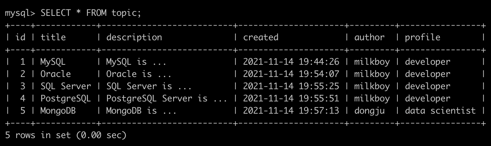
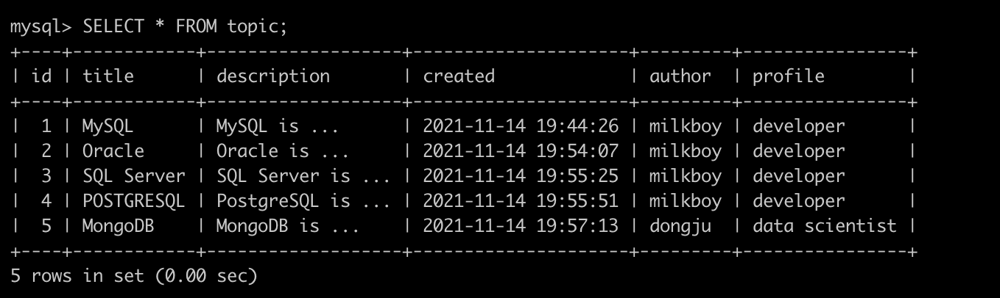

Database의 본질은 Create,  Read, Update, Delete 즉, CRUD라고 부르는 것이다.

- Create
- Read
- Update
- Delete

----

데이터를 저장하기 위한 수단으로는 대표적으로 File, Spreadsheet, Database가 있다.

Spreadsheet는 File에서는 가능하지 못한 데이터의 구조화 및 가공을 가능하게 하는 수단이다.

Database는 Spreadsheet에서는 가능하지 못한 프로그래밍 언어를 통한 CRUD를 가능하게 하고 이는 곧 자동화를 할 수 있게 하는 수단이 된다.

즉, File과 Spreadsheet는 Database로 가는 길목에 존재하는 데이터 저장 수단이다.

- Database: SQL 이라는 컴퓨터 언어를 사용해 데이터 제어 가능
- Spreadsheet: 사용자의 클릭을 통해 데이터 제어 가능

데이터 베이스의 데이터들을 앱, 웹을 사용해 다른 이들에게도 보여줄 수 있음

----

# 1. MySQL

테이블(Table): 데이터들이 저장되어 있는 표. 엑셀의 스트레트시트와 비슷한 구조를 지니고 있음

스키마(Schema) == 데이터베이스(Databse): 테이블들을 그룹핑(Grouping)하기 위한 일종의 디렉터리. 즉, 서로 연관된 데이터들을 그룹핑하기 위한 용도

데이터베이스 서버(Database Server): 그룹핑된 데이터들로 나누어진 여러 스키마들이 저장되어 있는 공간. Ex)MySQL, Oracel, MongoDB 등

### 1. 터미널을 통해 MySQL 서버에 접속하는 방법

1. Terminal에 `/usr/local/mysql/bin` 을 입력한다.

   

2. `./mysql -u[사용자명] -p` 명령어를 입력하고 비밀번호를 입력한 다음 접속을 한다.

   

### 2. 데이터베이스(스키마) 생성 및 삭제

1. 데이터베이스를 생성할 때는 `CREATE DATABASES;` 또는 `CREATE SCHEMA;`  명령어를 사용하여 생성한다. 

   대소문자 구분은 안하는 것 같은데 대문자를 사용하는 것이 일반적인 것 같다.

2. 데이터베이스를 삭제할 때는 `DROP DATABASES;` 또는 `DROP SCHEMA;` 명령어를 사용한다.

### 3. 데이터베이스 목록 조회

1. 현재 데이터베이스 서버(MySQL)에 존재하는 데이터베이스의 목록을 조회하고 싶으면 `SHOW DATABASES;` 또는 `SHOW SCHEMA;` 명령어를 사용한다.

### 4. 데이터베이스 사용

1. 존재하는 데이터베이스를 사용하려면 `USE [데이터베이스 명];` 명령어를 사용하면 된다.

2. `Database changed` 문구가 보인다면 이제부터 작업하는 모든 명령은 현재 사용 중인 데이터베이스(여기서는 `milkboy`)에 있는 테이블을 대상으로 명령을 실행하게 된다.

### 5. Table

1. 테이블은 데이터가 저장된 표를 말한다. 관계형 데이터베이스 뿐만 아니라 대부분의 데이터베이스를 다루기 위해서는 정확히는 테이블을 다루기 위해서는 SQL이라는 언어를 사용한다.
2. 테이블의 가로축은 row, record, 행이라고 부른다. 이는 곧 데이터 그 자체를 뜻하고 row의 개수는 저장된 데이터의 개수를 뜻한다.
3. 테이블의 세로축을 column, 또는 열이라고 부른다. 이는 곧 데이터의 종류 혹은 데이터의 구조를 뜻한다.

### 6 . Table의 생성

최종적으로 테이블의 column을 만들기 위한 코드를 보게 되면 아래와 같다.

하나하나 살펴보며 column 및 데이터베이스를 어떻게 구성하는지를 살펴보도록 하자.

먼저 데이터베이스와 스프레드시트의 가장 큰 차이점은 데이터베이스는 각 column의 데이터 타입을 지정해야 한다는 것이다. 스프레드시트의 경우 하나의 column에 여러 데이터 타입이 들어와도 아무런 문제가 발생하지 않는다. 이는 데이터의 갯수가 적을 때는 편리할 수 있지만 데이터의 갯수가 아주 많을 때는   문제가 될 수 있다.

따라서 각 column의 데이터의 타입을 하나의 타입으로 규제함으로써 데이터의 통일성을 부여할 수 있고 만약 다른 데이터 타입이 들어오게 되면 에러를 발생시킬 수도 있다. 

이렇게 column의 데이터 타입을 강제하게 되면 데이터를 추출할 때 데이터 타입을 신경쓸 필요가 없다. 

> ❗️
>
> 참고 사이트 : [TechOnTheNet](https://www.techonthenet.com/mysql/datatypes.php), MySQL 뿐만 아니라 Oracle, MariaDB, PostgreSQL 등 많은 데이터베이스 서버들에 대한 정보를 찾을 수 있다.

#### 1. id column

참고로 `;` 없이 엔터를 치게 되면 명령어를 실행하는 것이 아니라 줄바꿈을 한다. 

위 명령어를 해석하자면

 **' `id` column을 만드는데 데이터 타입은 11글자까지 보여지는 정수형으로 하고 공백을 허용하지 않으며 값이 자동으로 1씩 증가하는 컬럼을 만들어라'**

로 해석할 수 있다.

눈 여겨 봐야 할 것은 `NOT NULL` 인데 만약 딱히 공백이어도 문제가 없을 것 같은 column은(ex: 재산목록..?, 갑자기 생각나는게..) `NULL` 을 적어 공백을 허용하도록 하는 것이다. 하지만 꼭 입력되어야 하는 데이터라면 `NOT NULL` 을 입력하여 데이터를 입력받는 것이다.

또한 `AUTO_INCREMENT` 명령어를 사용하게 되면 자동으로 1씩 증가 되기 때문에 모든 `id` 은 중복되지 않게 된다. 즉, 중복되지 않는 식별자를 가지게 되는 것이다. 이는 곧 삭제나 수정 등의 작업을 하기 위해 꼭 필요한 작업이다.

#### 2. 기타 다른 column

위 명령어들을 해석해보면

'`title` column을 만드는데 공백을 허용하지 않고 데이터 타입은 문자열이면서 최대 100글자까지 입력을 받는다. '

'`description` column을 만드는데 공백을 허용하고 데이터 타입은 문자열이면서  최대 65,535글자까지 입력을 받는다.'

'`created` column을 만드는데 공백을 허용하지 않고 데이터 타입은 현재(데이터가 생성된) 날짜와 시간이다. '

'`author` column을 만드는데 공백을 허용하고 데이터 타입은 문자열이면서 최대 15글자까지 입력을 받는다. '

'`profile` column을 만드는데 공백을 허용하고 데이터 타입은 문자열이면서 최대 200글자까지 입력을 받는다. '

`PRIMARY KEY(id)` 는 메인 키를 설정하는 명령어다.

> 💬
>
>  `PRIMARY KEY` 를 설정하는 것은 크게 중복과 성능에 관련이 있는데 중복에 관하여 이야기를 해보면
>
> **데이터베이스에게 `PRIMARY KEY` 로 설정한 column은 중복이 되면 안된다고 알리는 것이다.** 
>
> 위의 예에서 `id` 는 각각의 데이터를 식별하기 위한 식별자로써의 역할을 하는 column이기 때문에 중복이 되면 안된다. 그렇기 때문에 `PRIMARY KEY(id)` 를 해줌으로써 id가 중복이 되지 않는 유일한 값이 되고 이는 id column의 역할인 각각의 데이터를 찾기 위한 용도를 정확하게 수행할 수 있게 만들어 준다.

----

# 2. CRUD

### 2.1 Create

[Reference](https://www.w3schools.com/sql/sql_insert.asp)

`CREATE` 를 하기 위해서는 SQL 문법의 `INSERT` 문법을 사용해야 한다.

위 명령어의 `INTO` 다음에는 `table` 의 이름이 들어가고 `()` 사이의 column명이 차례대로 들어간다.

`VALUES` 에는 위에서 입력한 column명의 **순서에 맞게** 데이터를 추가해주어야 한다. 그렇지 않으면 데이터 타입이 일치하지 않는 오류가 발생하거나 데이터 타입이 일치한다면 내가 원하지 않는 데이터가 column에 들어갈 수 있기 때문에 순서를 일치시켜서 column과 데이터를 매핑해주어야 한다.

`id` 컬럼은 `AUTO_INCREMENT` 가 적용되어 있기 때문에 따로 데이터를 삽입해주지 않아도 데이터베이스에서 자동으로 값을 1씩 증가시켜주기 때문에 따로 값을 추가할 필요가 없다.

추가로 `NOW()` 함수는 현재 시간을 나타내는 함수다. 즉, 위의 `NOW()` 함수는 현재 시간을 작성 시간(`create`)을 데이터로 추가해주는 명령어다.

- 값이 정상적으로 추가되었는지를 확인하기 위해  `SELECT * FROM topic;` 명령어를 입력하게 되면 아래와 같이 `topic` 테이블의 모든 데이터들을 가지고 올 수 있다.

같은 방법으로 다른 데이터들을 추가하여 결과를 보면 아래와 같이 모든 데이터가 잘 저장이 된 것을 확인할 수 있다.

### 2.2 READ

[Reference](https://dev.mysql.com/doc/refman/8.0/en/select.html)

- 테이블 내의 존재하는 모든 행을 읽어오려면 바로 위에서 봤던 것처럼 `SELECT * FROM [테이블 명];` 명령어를 입력해주면 된다.

- 원하는 컬럼만을 읽어오기를 원한다면 `SELECT 컬럼명 FROM [테이블 명];` 명령어를 입력해주면 된다.

  

  

- 만약 원하는 행만을 출력하기를 원한다면 `WHERE` 를 사용하면 된다. 주의해야할 것은 `WHERE` 는 `FROM` 이후에 적어야 문법적인 에러가 발생하지 않는다.

  1) author가 milkboy인 row만 가져오기

  

  2) title이 MongoDB인 행만 가져오기

  

  

- 스프레드시트와 마찬가지로 SQL 또한 정렬 기능을 제공한다. 정렬은 `ORDER BY` 문법을 사용한다. `ORDER BY` 문법은 `WHERE` 뒤에 작성해야 한다. 내림차순으로 정렬할 때는 `DESC` 옵션을 사용한다. 

  1) author가 milkboy인 row를 내림차순으로 정렬

  

  

- 보여지는 데이터의 개수를 조절하기 위해서는 `LIMIT` 옵션을 사용한다. 예를 들어, 데이터가 1억개가 있다고 하면 `SELECT * FROM [테이블명]` 을 하게 되면 컴퓨터가 멈추게 되는 현상이 발생할 수 있다. 그렇기 때문에 `SQL` 은 보여지는 데이터의 개수를 조절하여 읽어올 수 있는 기능인 `LIMIT` 기능을 제공한다.

  1) author가 milkboy인 데이터를 내림차순으로 정렬하고 2개만 읽어오기

  

`SELECT` 는 `SQL` 을 사용하면서 가장 많이 사용하게될 문법이기 때문에 정확하고 깊게 이해하는 것이 중요하다. 필요에 따라 많은 종류의 옵션들을 공부해야 한다는 것을 인지하자.

### 2.3 UPDATE

[Reference](https://dev.mysql.com/doc/refman/8.0/en/update.html)

- 만약 테이블 내의 존재하는 row의 어떤 column 값을 바꾸고 싶은 경우 `UPDATE` 문법을 사용하면 된다.

  1) 먼저 현재 테이블 안에 존재하는 모든 데이터를 출력해보자.

  

  2) 위 데이터 중에서 `PostgreSQL Server is ...` 은 원래 `PostgreSQL is ...` 이 되어야 한다. 잘못 입력된 것이다. 이를 고치기 위해서는 `UPDATE` 문법을 통해 테이블 내의 컬럼 값을 수정해주어야 한다.

  값을 수정하기에 앞서 아주 아주 중요한 점이 있다. 아래 예제를 보자.

  

  여기서 `SET` 옵션 뒤에는 수정하기 위한 `col_name=value`으로 이루어진 값이 들어온다. 하나만 하기 아쉬우니 `title` 컬럼의 값도 모두 대문자로 바꿔줬다. 그리고 중요한 것이 바로 `WHERE` 문을 통해 바꾸어줄 row를 특정해주는 것이다. 

  여기서 `WHERE id=4;` 를 통해 `id` 값이 4인 row의 `description` 과 `title` 컬럼을 바꾸어 주겠다고 말해주는 것이다.

  그렇게 바꾼 결과를 보게 되면

  

  의도한대로 `id` 값이 4인 row의 `PostgreSQL Server is ...` 값을 `PostgreSQL is ...`로 변경해주었고 `title` 컬럼의 값도 대문자로 변경이 된 것을 확인할 수 있다.

  만약 `WHERE` 옵션의 값을 설정해주지 않았다면 모든 row의 `description` 값이 `PostgreSQL is ...` 이 되고 `title` 의 값이 `POSTGRESQL` 이 되었을 것이다. 

  이게 만약 엄청난 양의 데이터를 저장하고 있는 데이터베이스에서 발생한 일이라면 그야말로 파국이다. 그런 불상사가 발생하지 않기 위해서라도 **`UPDATE` 문법을 사용할 때는 꼭 `WHERE` 옵션을 사용하여 수정할 row를 정해주는 것이 필요하다.**

### 2.4 DELETE

[Reference](https://dev.mysql.com/doc/refman/8.0/en/delete.html)

`DELETE` 문법은 간단하다 `DELETE FROM [테이블명]` 을 해주면 된다.

하지만 여기서도 가장 중요한 점이 있다. `UPDATE` 와 마찬가지로  `WHERE` 옵션을 통해 삭제해야할 row를 정해주어야 한다는 것이다. 만약 `WHERE` 옵션을 사용하지 않는다면 모든 행이 삭제되기 때문에 무조건 `WHERE` 옵션을 사용해서 삭제할 row를 특정해주어야 한다.

> ❗️❗️❗️❗️
>
> 이고잉님께서 `DELETE` 옵션을 사용할 일이 아마 없을테지만 만약 사용하게되었는데 `WHERE` 옵션을 사용하지 않는다면 인생이 바뀔 수도 있다고 하셨다,,, 제발 나한테는 그럴 일이 없길

1) id값이 2인 row를 삭제하는 경우

2) 삭제하고 난 후

