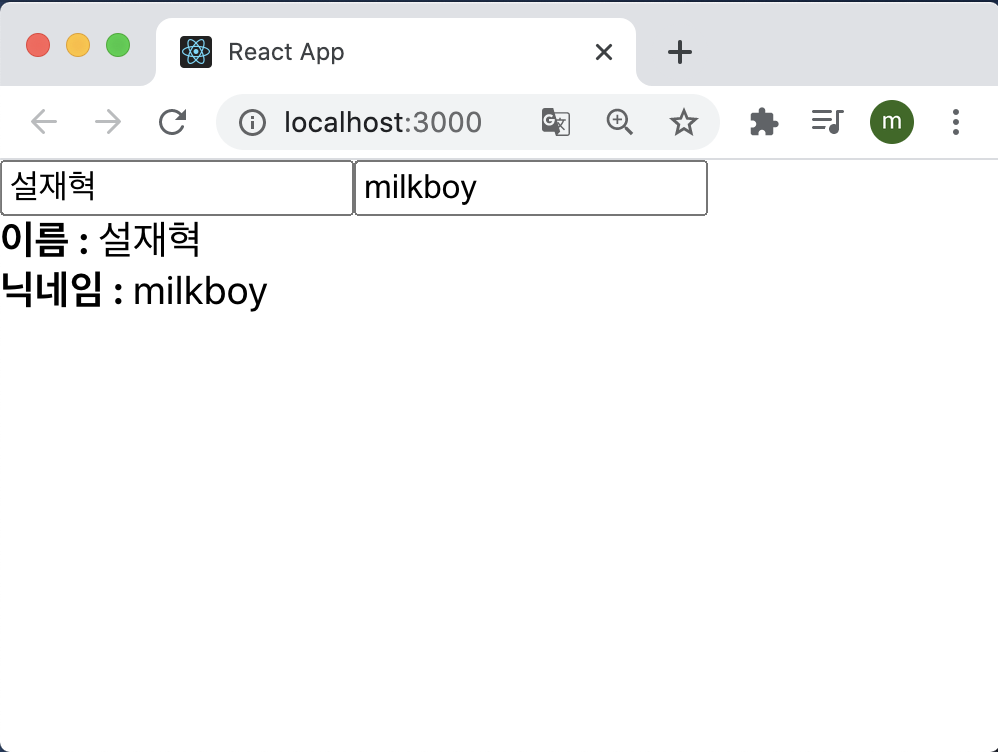
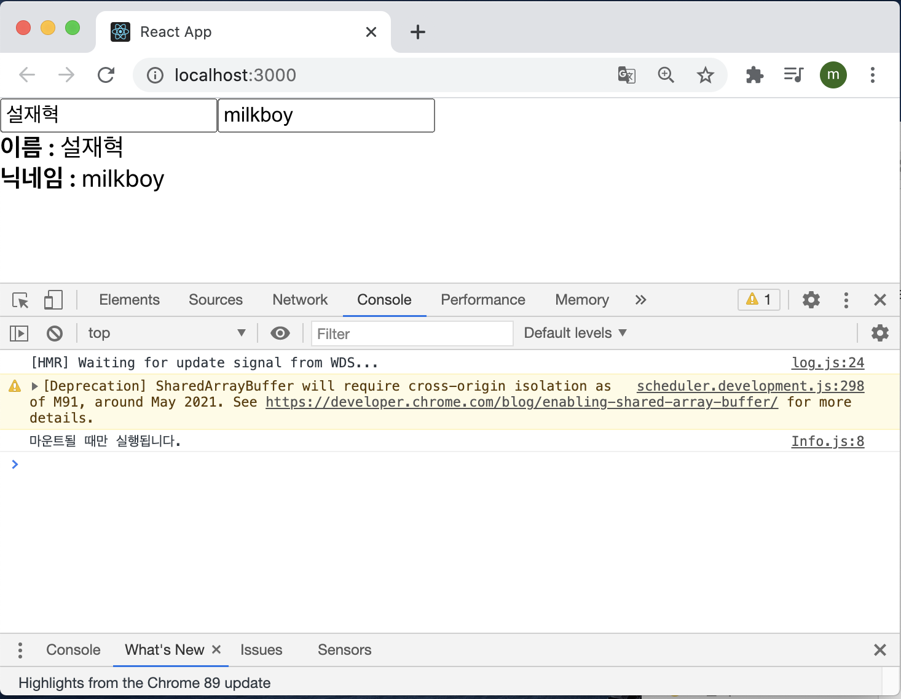
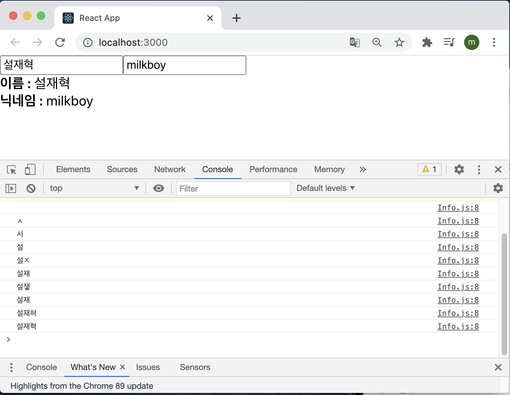
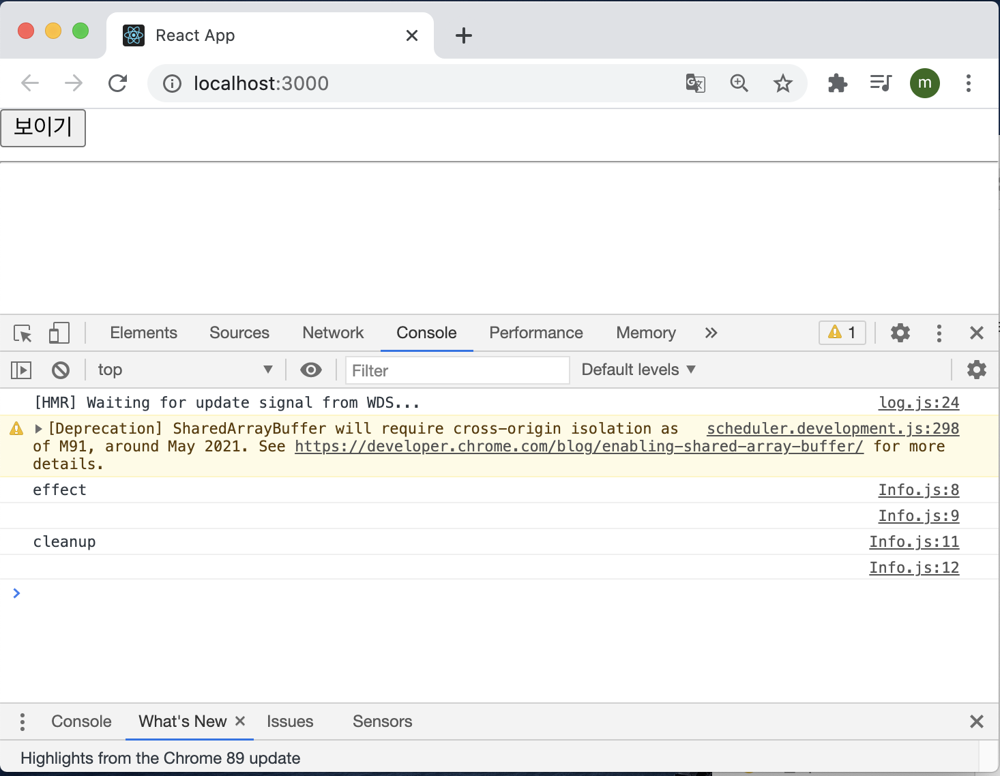
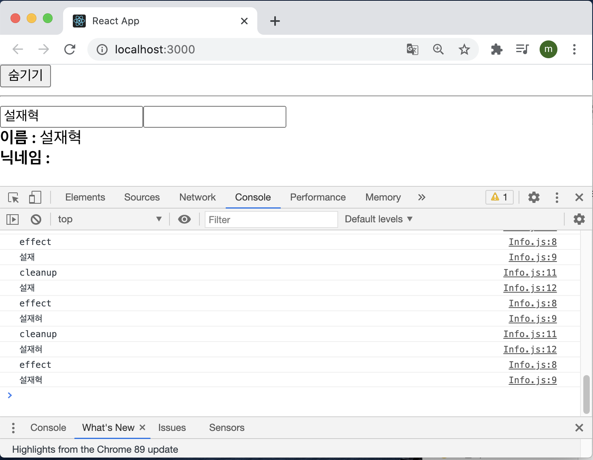
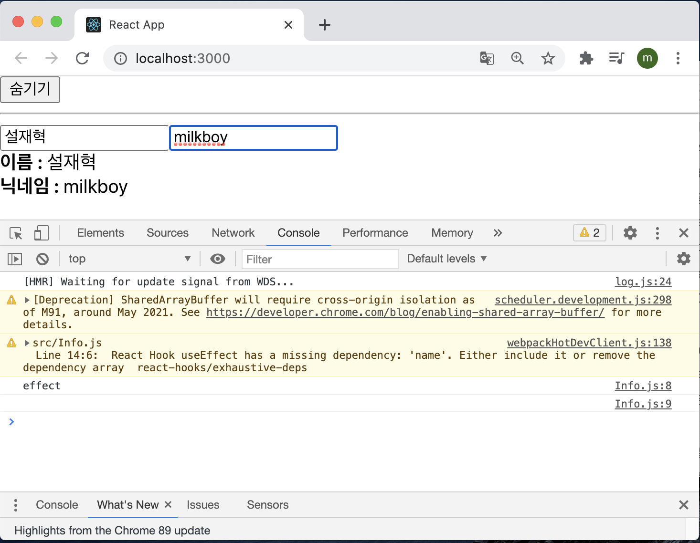
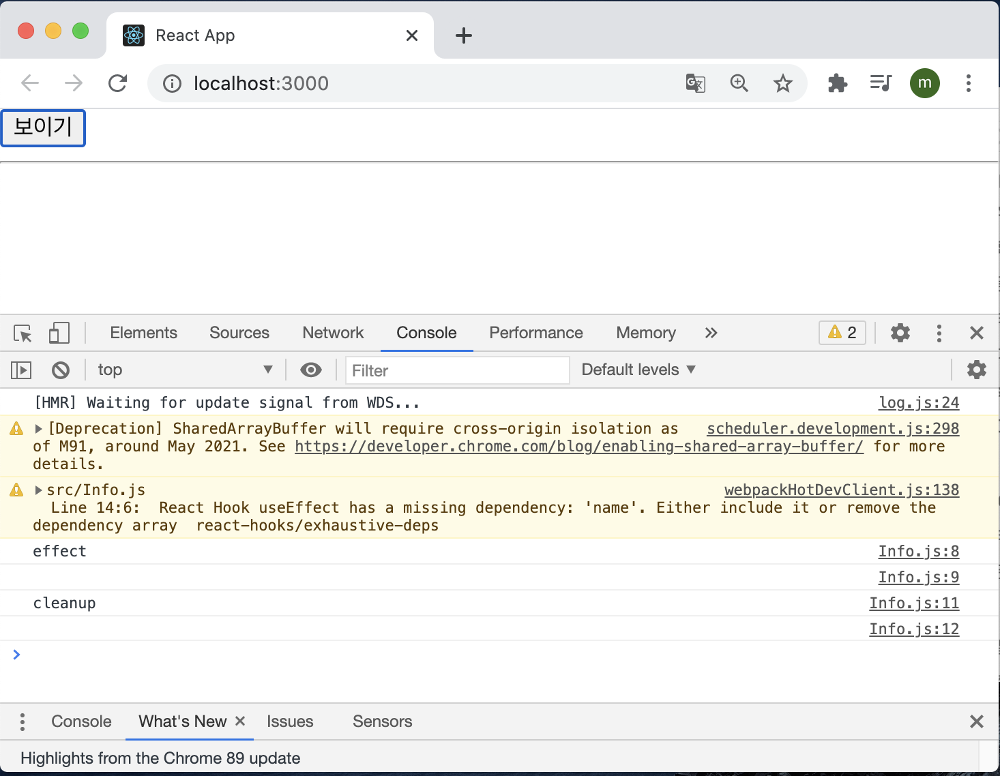

# Hooks

Hooks는 v16.8에 새로 도입된 기능으로 함수형 컴포넌트에서도 상태 관리를 할 수 있는 useState, 렌더링 직후 작업을 설정하는 useState 등의 기능을 제공하여 기존의 함수형 컴포넌트로 할 수 없었던 다양한 작업을 할 수 있게 해준다.

이번 실습은 다음과 같은 흐름으로 진행된다.

> 리액트 내장 Hooks 사용하기 → 커스텀 Hooks 만들기

실습을 진행하기에 앞서 create-react-app을 사용하여 새로운 프로젝트를 만들었다.

> $ yarn create react-app hooks-tutorial

## 8.1 useState

useState는 가장 기본적인 Hook이며, 함수형 컴포넌트에서도 가변적인 상태를 지닐 수 있게 해준다. 

useState 기능을 사용해서 숫자 카운터를 구현해보도록 하자. src 디렉토리에 Counter.js 파일을 생성하고 다음과 같이 입력했다.

```react
import reactDom from "react-dom";
import React, { useState } from "react";

const Counter = () => {
  const [value, setValue] = useState(0);

  return (
    <div>
      <p> 현재 카운터의 값은 {value}입니다.</p>
      <button onClick = {() => setValue(value + 1)}>+1</button>
      <button onClick = {() => setValue(value - 1)}>-1</button>
    </div>
  );
}

export default Counter;
```

useState는 코드 상단에서 import 구문을 통해 불러오고 다음과 같이 사용한다.

```react
const [value, setValue] = useState(0);
```

useState 함수의 파라미터에는 상태의 기본값을 넣어 준다(여기서는 0). 이 말은 결국 카운터의 기본값을 0으로 설정하겠다는 의미다.

이 함수가 호출되면 배열을 반환하는데 그 배열의 첫 번째 원소는 상태 값, 두 번째 원소는 상태를 설정하는 함수다. 이 함수에 파라미터를 넣어서 호출하면 전달받은 파라미터로 값이 바뀌고 컴포넌트가 정상적으로 리렌더링된다.

App 컴포넌트에 모든 내용을 지우고 Counter 컴포넌트를 렌더링 시켜 버튼을 누르게 되면 원하는 기능이 잘 작동하는 것을 확인할 수 있다.

#### 8.1.1 useState 여러 번 사용하기

하나의 useState 함수는 하나의 상태 값만 관리할 수 있다. 컴포넌트에서 관리해야할 상태값이 여러 개라면 useState를 여러 번 사용하면 된다.

Info 컴포넌트를 생성해서 실습해보도록 하자.

```react
import React from "react";

const Info = () => {
  const [name, setName] = useState("");
  const [nickname, setNickname] = useState("");

  const onChangeName = (e) => {
    setName(e.target.value);
  };

  const onChangeNickname = (e) => {
    setNickname(e.target.value);
  };

  return (
    <div>
      <div>
        <input value={name} onChange={onChangeName} />
        <input valur={nickname} onChange={onChangeNickname} />
      </div>
      <div>
        <div>
          <b>이름 : </b>
          {name}
        </div>
        <div>
          <b>닉네임 : </b>
          {nickname}
        </div>
      </div>
    </div>
  );
};

export default Info;
```

결과를 확인해보면 관리할 상태가 여러 개인 경우에도 useState를 통해 쉽게 관리를 할 수 있다.



## 8.2 useEffect

useEffect는 컴포넌트가 렌더링될 때마다 특정 작업을 수행하도록 설정할 수 있는 Hooks이다. 클래스형 컴포넌트의 componentDidMount와 componentDidUpdate를 합친 형태로 봐도 무방하다.

기존에 만들었던 Info 컴포넌트에 useEffect를 적용해보도록 하자.

```react
import React, { useEffect, useState } from "react";

const Info = () => {
  const [name, setName] = useState("");
  const [nickname, setNickname] = useState("");

  useEffect(() => {
    console.log("렌더링이 완료됐습니다.");
    console.log({ name, nickname });
  });

  const onChangeName = (e) => {
    setName(e.target.value);
  };

  const onChangeNickname = (e) => {
    setNickname(e.target.value);
  };

  return (
    <div>
      <div>
        <input value={name} onChange={onChangeName} />
        <input valur={nickname} onChange={onChangeNickname} />
      </div>
      <div>
        <div>
          <b>이름 : </b>
          {name}
        </div>
        <div>
          <b>닉네임 : </b>
          {nickname}
        </div>
      </div>
    </div>
  );
};

export default Info;
```

브라우저를 열어 개발자 도구의 콘솔창에서 인풋의 내용을 변경하게 되면 다음과 같은 결과가 출력되는 것을 확인할 수 있다.


input에 값을 입력 받을 때마다 컴포넌트를 리렌더링 시키는 것을 확인 할 수 있다.

#### 8.2.1 마운트될 때만 실행하고 싶을 때

useEffect에서 설정한 함수를 컴포넌트가 화면에 맨 처음 렌더링될 때만 실행하고, 업데이트 될 때는 실행하지 않으려면 함수의 두 번째 파라미터로 비어 있는 배열을 넣어 주면 된다.

```react
useEffect(() => {
  console.log('마운트될 때만 실행됩니다.');
}, []);
```

브라우저의 결과를 확인하게 되면 처음 마운트될 때만 실행이 되고 업데이트될 때는 리렌더링을 하지 않는 것을 확인할 수 있다.



#### 8.2.2 특정 값이 업데이트될 때만 실행하고 싶을 때

useEffect를 사용할 때, 특정 값이 변경될 때만 호출하고 싶은 경우가 생길 수 있다.  클래스형 컴포넌트에서는 그런 경우 다음과 같은 방법으로 작성할 것이다.

```react
componentDidUpdate(prevProps, prevState) {
  if(prevProps.value !== this.props.value) {
    doSomething();
  }
}
```

위 코드는 props 안에 들어 있는 value 값이 바뀔 때만 특정 작업을 수행한다. 이런 작업을 useEffect에서 해야 한다면 어떻게 해야 할까?

바로 useEffect의 두 번째 파라미터로 전달되는 배열 안에 검사하고 싶은 값을 넣어 주면 된다.

```react
useEffect(() => {
  console.log(name);
}, [name]);
```

배열 안에는 useState를 통해 관리하고 있는 상태를 넣어 줘도 되고, props로 전달받은 값을 넣어줘도 된다. 브라우저와 콘솔창을 확인하게 되면 다음과 같은 결과가 나오게 된다.



위 결과처럼 특정한 값(name)이 변경할 때만 값을 추적해 useEffect를 실행하고 추적할 값으로 설정하지 않은 값(nickname)이 변경될 때는 useEffect를 실행하지 않는 것을 확인할 수 있다.

#### 8.2.3 뒷정리하기

useEffect는 기본적으로 렌더링되고 난 직후마다 실행되며, 두 번째 파라미터 배열에 무엇을 넣는지에 따라 실행되는 조건이 달라진다.

컴포넌트가 언마운트되기 전이나 업데이트되기 직전에 어떠한 작업을 수행하고 싶다면 useEffect에서 뒷정리(cleanup)함수를 반환해줘야한다. Info 컴포넌트의 useEffect 부분을 다음과 같이 수정해보자.

```react
useEffect(() => {
  console.log("effect");
  console.log(name);
  return () => {
    console.log("cleanup");
    console.log(name);
  };
}, [name]);
```

이제 App 컴포넌트에서 Info 컴포넌트의 가시성을 바꿀 수 있게 설정해보자.

```react
import { useState } from "react";
import "./App.css";
import Info from "./Info";

const App = () => {
  const [visible, setVisible] = useState(false);
  return (
    <div>
      <button
        onClick={() => {
          setVisible(true);
        }}
      >
        {visible ? "숨기기" : "보이기"}
      </button>
      <hr />
      {visible && <Info />}
    </div>
  );
};

export default App;
```

작성한 뒤 보이기/숨기기 버튼을 누르고 콘솔창을 보게 되면 아래와 같은 화면이 나타난다.

컴포넌트가 나타날 때 콘솔에 effect가 나타나고, 사라질 때 cleanup이 나타난다.



그런 다음 input에 이름을 적어 보고 콘솔에 결과를 확인하게 되면 아래와 같은 결과가 나타나는 것을 확인할 수 있다.



렌더링될 때마다 뒷정리하는 함수가 계속 나타나는 것을 확인할 수 있다. 그리고 뒷정리 함수가 호출될 때는 업데이트 되기 직전의 값을 보여준다.

오직 언마운트될 때만 뒷정리 함수를 호출하고 싶다면 useEffect 함수의 두 번째 파라미터에 비어 있는 배열을 넣으면 된다.

```react
useEffcet(() => {
  console.log('effect');
  console.log(name);
  return () => {
    console.log('cleanup');
    console.log(name);
  };
}, []);
```

결과를 확인해보면



보이기 버튼을 눌렀을 때 useEffect가 실행이 되고 input에 값을 입력하면 실행되지 않는 모습을 볼 수 있다. 

만약 숨기기 버튼을 누른다면 그제서야 아래와 같이 뒷정리 함수를 호출하는 모습을 볼 수 있다.



