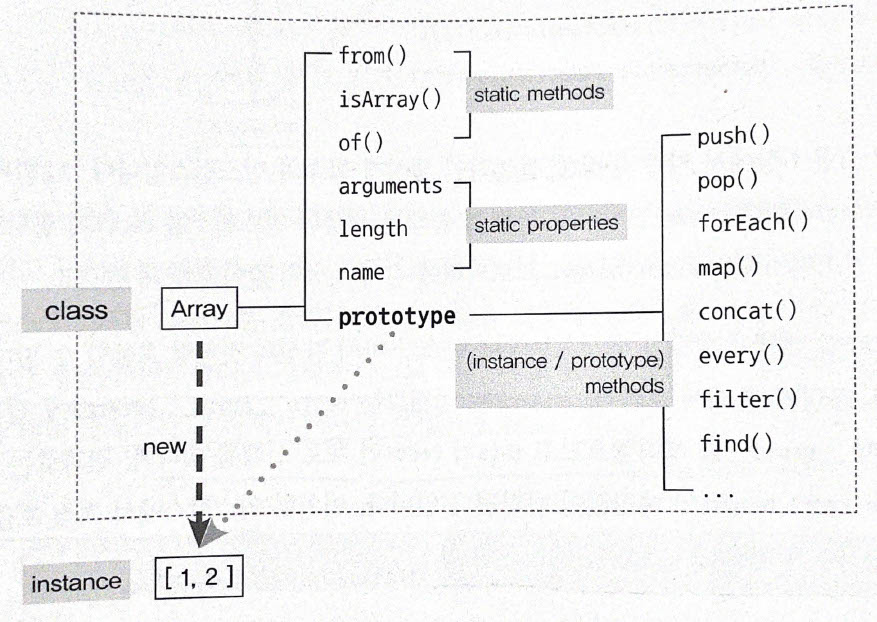
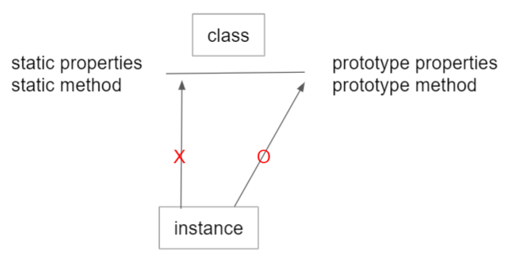

# Class

앞 장에서도 말했듯 자바스크립트는 프로토타입 기반 언어라서 '상속'의 개념이 존재하지 않는다. 따라서 클래스와 비슷하게 동작하게끔 흉내내는 여러 기법들이 탄생했으며, 이들 중 몇 가지는 널리 알려져 있다. 이러한 니즈에 따라 ES6에는 클래스 문법이 추가됐다. 하지만 ES6의 클래스에서도 일정 부분은 프로토타입을 활용하고 있기 때문에, ES5 체제 하에서 클래스를 흉내내기 위한 구현 방식을 학습하는 것은 여전히 큰 의미가 있다고 할 수 있다.

### 1. 클래스와 인스턴스의 개념 이해

객체지향 프로그래밍에서 거의 반드시 등장하는 제 1요소인 클래스라는 단어의 의미는 일반적으로 쓰이는 의미와 거의 흡사하다. 영어사전에서 class는 '계급, 집단, 집합' 등으로 번역하는데 프로그래밍 언어적으로도 이와 동일한 개념으로 접근하면 된다.

프로그래밍 언어에서의 클래스를 다루기에 앞서 일반적인 개념부터 명확하게 하고 넘어가보자. 예를 들어, 어떤 가게에 다양한 음식이 한 개씩 있다고 했을 때, '음식'이라는 범주 안에는 고기, 채소, 과일 등등 다양한 것들이 들어갈 수 있다. 이들 역시 다시 하위에 각 분류에 속하는 대상들을 나열할 수 있을 것이다. 과일 범주 아래에는 배, 사과, 바나나, 감, 오렌지 등등이 포함될 것이다. 여기서 가게에 있는 배, 사과, 바나나 등은 직접 만질 수 있고 볼 수 있고 먹을 수 있는 구체적이고 실존하는 사물에 해당한다. 반면, 음식이나 과일은 어떤 사물들의 공통 속성을 모아 정의한 것일 뿐 직접 만질 수도 볼 수도 없는 추상적인 개념이다. 

한편 음식은 과일과의 관계에서 상위(superior)의 개념이고, 과일은 음식과의 개념에서 하위(subordinate)의 개념이다. 이를 프로그래밍에서는 상위 클래스(superclass) / 하위 클래스(subclass)로 표현한다. 그렇다면 이렇게 두 가지의 분류가 아닌 또 다른 분류가 있을 경우 클래스 간의 관계는 어떻게 될까?

클래스의 상하관계는 상위 개념에서 하위 개념으로 갈수록 더욱 구체적인 개념이 추가된다. 예를 들어 최상위 클래스인 음식 클래스는 '먹을 수 있다' 정도라면 하위 클래스인 과일 클래스는 '먹을 수 있다 + 나무에서 열린다', 그 하위의 클래스인 귤류 클래스는 '먹을 수 있다 + 나무에서 열린다 + 말랑한 껍질 속에 달고 신맛이 나는 과육이 들어있다' 가 된다. 이처럼 클래스는 하위로 갈수록 상위 클래스의 속성을 상속하면서 더욱 구체적인 요건이 추가 또는 변경이 된다. **하지만 하위 클래스가 아무리 구체화되더라도 이들은 결국 추상적인 개념일 뿐이다.**

한편 감귤, 자몽, 천혜향 등은 음식에 속해 먹을 수 있고, 과일에 속해 나무에서 열리며, 귤류에 속에 말랑한 껍질 속에 달고 신맛이 나는 과육이 들어있는 구체적인 개체들이다. 즉, 앞의 클래스들의 속성을 지니는, 실제로 먹을 수 있고 만질 수 있는 실존하는 개체이다. 이처럼 어떤 클래스의 속성을 지니는 실존하는 개체를 일컬어 인스턴스(instance)라고 한다. 사전에는 인스턴스를 '사례'라고 번역하고 있다. 풀어쓰면 '어떤 조건에 부합하는 구체적인 예시'정도로 해석할 수 있을 것이다. 여기서 조건이 곧 클래스를 의미한다고 보면, 어떤 클래스에 속한 개체는 그 클래스의 조건을 모두 만족하므로 그 클래스의 구체적인 예시 즉, 인스턴스가 될 것이다.

프로그래밍 언어에서의 클래스는 현실세계에서의 클래스와 마찬가지로 '공통 요소를 지니는 집단을 분류하기 위한 개념'이라는 측면에서는 일치하지만 인스턴스들로부터 공통점을 발견해서 클래스를 정의하는 현실과 달디, 클래스가 먼저 정의돼야만 그로부터 공통적인 요소를 지니는 개체들을 생성할 수 있다. 나아가 현실세계에서의 클래스는 추상적인 개념이지만, 프로그래밍 언어에서의 클래스는 사용하기에 따라 추상적인 대상일 수도 있고 구체적인 개체가 될 수도 있다.

### 2. 자바스크립트의 클래스

생성자 함수 `Array` 를 `new` 연산자와 함께 호출하면 인스턴스가 생성된다. 이때 `Array` 를 일종의 클래스라고 하면, `Array` 의 `prototype` 객체 내부 요소들이 인스턴스에 '상속' 된다고 볼 수 있다. 엄밀히는 상속이 아닌 프로토타입 체이닝에 의한 참조지만 결과적으로는 동일하게 동작하므로 이렇게 이해해도 무방할 것이다. 한편 `Array` 내부 프로퍼티 중 `prototype` 프로퍼티를 제외한 나머지는 인스턴스에 상속되지 않는다.

인스턴스에 상속되는지(인스턴스가 참조하는지) 여부에 따라 스태틱 멤버(static member) 와 인스턴스 멤버(instance member)로 나뉜다. 이 분류는 다른 언어의 클래스 구성요소에 대한 정의를 차용한 것으로서 클래스 입장에서 사용 대상에 따라 구분한 것이다.그런데 여느 클래스 기반 언어와 달리 자바스크립트에서는 인스턴스에서도 직접 메서드를 정의할 수 있기 때문에 '인스턴스 메서드'라는 명칭은 프로토타입에 정의한 메서드를 지칭하는 것인지 인스턴스에 정의한 메서드를 지칭하는 것인지에 대해 도리어 혼란은 야기한다. 따라서 이 명칭 대신 자바스크립트의 특징을 살려 프로토타입 메서드(prototype method) 라고 부르는 것이 더 좋을 것이다.



예제를 통해 클래스 관정에서 바라본 프로토타입 시스텝을 좀 더 살펴보자.

```javascript
var Rectangle = function(width, height) {																				# 생성자
  this.width = width;
  this.height = height;
};
Rectangle.prototype.getArea = function() {																			# 프로토타입 메서드
  return this.width * this.height;
};
Rectangle.isRectangle = function(instance) {																		# 스태틱 메서드
  return (
    instance instanceof Rectangle && instance.width > 0 && instance.height > 0
  );
};

var rect1 = new Rectangle(3, 4);
console.log(rect1.getArea()); // 12 (O)
console.log(rect1.isRectangle(rect1)); // Error (X)
console.log(Rectangle.isRectangle(rect1)); // true
```

위 예제는 6장에서 자주 등장한 전형적인 생성자 함수와 인스턴스다. 12번째 줄에서 `Rectangle` 함수를 `new` 연산자와 함께 호출해서 생성된 인스턴스를 `rect1` 에 할당했다. 이 인스턴스에는 `width`, `height` 프로퍼티에 각각 3, 4가 할당돼 있을 것이다.

프로토타입 객체에 할당한 메서드는 인스턴스가 마치 자신의 것처럼 호출할 수 있다고 했으니까 13번째 줄에서 호출한 `getArea` 는 실제로는 `rect1.__proto__.getArea` 에 접근하는데, 이때 `__proto__` 를 생략했으므로 `this` 가 `rect1` 인 채로 실행될 테니까, 결과로는 `rect1.width * rect1.height` 의 계산 값이 반환될 것이다. 이처럼 **인스턴스에서 직접 호출할 수 있는 메서드가 바로 프로토타입 메서드다.**

한편 14번째 줄은 `rect1` 인스턴스에서 `isRectangle` 메서드에 접근하고자 한다. 우선 `rect1` 에 해당 메서드가 있는지 검색했는데 없고, `rect1.__proto__` 에서도 없으며 `rect1.__proto__.__proto__(=Object.prototype)` 에도 없으므로 `undefined` 를 반환하라는 명령이므로 함수가 아니어서 실행할 수 없다는 의미릐 `Uncaught TypeErrof: not a function` 에러가 발생한다. 이렇게 **인스턴스에서 직접 접근할 수 없는 메서드를 스태틱 메서드라고 한다.** 스태틱 메서드는 15번째 줄처럼 생성자 함수를 `this` 로 사용해야만 호출할 수 있다.



추가로 7-1절의 마지막에 "프로그래밍 언어에서의 클래스는 사용하기에 따라 추상적일 수도 있고 구체적인 개체가 될 수도 있다" 고 했다. 일반적인 사용 방식, 즉 구체적인 인스턴스가 사용할 메서드를 정의한 '틀' 역할을 담당하는 목적을 가질 때 클래스는 추상적인 개념이지만, 클래스 자체를 `this` 로 취급해서 직접 접근해야만 하는 스태틱 메서드를 호출할 때의 클래스는 그 자체가 하나의 개체로서 취급된다.

### 3. 클래스 상속

#### 7-3-1 기본 구현

클래스 상속은 객체지향에서 가장 중요한 요소 중 하나다. 이 때문에 ES5까지의 자바스크립트 커뮤니티에서는 클래스 상속을 다른 객체지향 언어에 익숙한 개발자들에게 최대한 친숙한 형태로 흉내 내는 것이 주요한 관심사였다. 그렇기에 이번 절에서는 프로토타입 체인을 활용하여 클래스 상속을 구현하고 전통적인 객체지향 언어에서 추구하는 클래스의 형태와 비슷하게 발전시키는 것을 목표로 다가가자. 

**7-2** 6-2-4절의 Grade 생성자 함수 및 인스턴스

```javascript
var Grade = function() {
  var args = Array.prototype.slice.call(arguments);
  for (var i = 0; i < args.length; i++) {
    this[i] = args[i];
  }
  this.length = args.length;
};
Grade.prototype = [];
var g = new Grade(100, 80);
```


