# 1. Data Type

자바스크립트의 데이터 타입은 크게 두 가지의 형태가 있다.

1. 기본형(원시형): primitive type
2. 참조형: reference type

#### 기본형의 종류

숫자(number), 불리언(boolean), null, undefined, Symbol(ES6에서 추가)

#### 참조형의 종류

객체(Object), 배열(Array), 함수(Function), 날짜(Date), 정규표현식(RegExp) 등과 ES6에서 추가된 Map, WeakMap, Set, WeakSet 등이 있다.

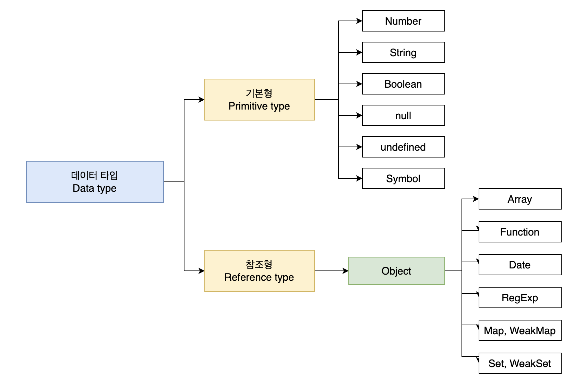

#### 어떤 기준으로 기본형과 참조형을 분류할까?

기본형과 참조형 모두 주솟값을 복제를 하긴 하지만 **기본형은 값이 담긴 주솟값을 바로 복제**하는 반면 참조형은 **값이 담긴 주솟값들로 이루어진 묶음을 가리키는 주솟값을 복제**한다.

또한 기본형은 불변성(Immutablity)를 띈다. 언뜻 헷갈릴 수 있는 개념이다. 왜냐하면 기본형인 숫자 10을 변수 a에 할당한 후에 a의 값을 15로 바꿔도 문제 없이 변하기 때문이다. 여기서 "변하지 않는다"의 의미는 무엇일까?

----

#### 메모리와 데이터

컴퓨터는 모든 데이터를 0 또는 1로 기억한다. 0 또는 1로 표현할 수 있는 하나의 메모리 조각을 비트(bit)라고 한다. **각 비트는 고유한 식별자(unique identifier)를 통해 위치를 확인할 수 있다.** 하지만 이렇게 비트 단위로 위치를 확인하는 것은 매우 비효율적이므로 몇 개씩 묶어 하나의 단위로 여긴다면 표현할 수 있는 값도 늘어나면서 검색시간도 줄일 수 있다.

한편 많은 비트를 한 단위로 묶으면 검색 시간도 줄이고 표현할 수 있는 데이터의 개수도 늘어나지만 동시에 낭비되는 데이터가 생기기도 한다. 차라리 자주 사용하지 않을 데이터를 표현하기 위해 빈 공간을 남겨놓기보단 표현 가능한 개수에 어느 정도 제약이 따르더라도 크게 문제 되지 않을 적정한 공간을 묶는 폇이 낫다. 

이런 고민의 결과로 바이트(byte)라는 단위가 생겼다. 바이트는 8개의 비트로 구성돼 있고 1비트마다 0 또는 1 두 가지의 값을 표현할 수 있으므로 1바이트는 총 256개(2<sup>8</sup>)개의 값을 표현할 수 있다. 나아가 2바이트는 총 16개의 비트로 구성돼 있으므로 65536개(2<sup>16</sup>)개의 값을 표현할 수 있다.

C/C++, 자바의 경우 메모리의 낭비를 최소화하기 위해 데이터 타입별로 할당할 메모리 영역을 미리 정의해 둔다. 예를 들어 2바이트 크기의 정수형 타입(short)는 -32768~32767까지의 숫자만 허용하는데 이 범위를 벗어나는 숫자를 입력하면 오류가 나거나 잘못된 값(쓰레기 값)이 저장된다. 이 문제를 해결하기 위해 사용자는 직접 4바이트 크기의 정수형 데이터 타입(int)로 형변환을 해줘야한다.

반면 메모리 용량이 과거보다 월등히 커진 상황에서 등장한 자바스크립트는 상대적으로 메모리 관리에 대한 압박에서 자유로웠다. 그렇기 때문에 메모리 공간을 좀 더 여유롭게 할당했다. 숫자의 경우 정수형인지 부동소수형인지를 구분하지 않고 64비트 즉, 8바이트의 메모리 공간을 미리 확보해뒀다.

앞서 각 비트는 고유한 식별자를 지니고 있고 이를 통해 각 비트의 위치를 확인할 수 있다고 했다. 바이트 역시 비트의 식별자로 위치를 확인할 수 있다. **모든 데이터는 바이트 단위의 식별자, 정확하게는 메모리 주솟값을 통해 서로를 구분하고 연결할 수 있다.**

먼저 변수(variable)와 식별자(identifier)를 명확하게 구분해야할 필요가 있다. **변수**는 말 그대로 '변할 수 있는 수'를 뜻한다. '수'라는 것이 반드시 숫자를 의미하는 것은 아니기에 컴퓨터 용어로 변수를 사용할 때는 '**변할 수 있는 무언가**'로 해석할 수 있다. 여기서 **'무언가'란 바로 '데이터'**를 뜻한다. 숫자뿐만 아니라 문자열, 객체, 배열 모두 데이터다. **식별자**는 어떤 데이터를 식별하는데 사용하는 이름 즉, **변수명**을 말한다.

----

#### 변수 선언과 데이터 할당

```javascript
var a;
```

위 예제를 말로 풀어쓰면 "**변할 수 있는 데이터를 만든다. 이 데이터의 식별자는 a로 한다.**"로 해석할 수 있다. 변할 수 있는 데이터니 선언할 때는 `undefined` 여도 나중에 다른 값으로 바꾸면 된다. 이렇게 보면 변수란 결국 **변경 가능한 데이터가 담길 수 있는 공간 또는 그릇** 이라고 이해하면 될 것 같다.

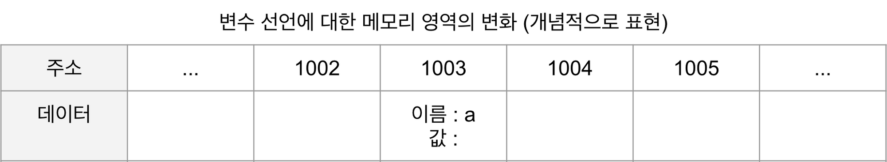

위 그림은 예제의 명령을 받아 메모리 영역에서 어떤 작업을 수행하는지를 표현한 그림이다.

명령을 받은 컴퓨터는 메모리 공간에서 비어있는 공간을 확보한다. 위 그림에서는 임의로 1003번으로 정했다. 이 공간의 이름(식별자)를 `a` 라고 지정한다. 여기까지가 변수 선언 과정이다. 이후에 만약 사용자가 `a` 에 접근하고자 하면 컴퓨터는 메모리에서 `a` 라는 이름을 가진 주소를 검색해서 해당 공간에 담긴 데이터를 반환하게 될 것이다.

```javascript
var a; // 변수 a 선언
a = 'abc'; // 변수 a에 데이터 할당

var a = 'abc'; // 변수 선언과 할당을 한 문장으로 표현
```

위 예제처럼 선언과 할당을 나누어서 하든 한 줄에 하든 자바스크립트 엔진은 같은 동작을 수행한다. 할당하는 과정을 생각해보면 직관적으로 봤을때  `a` 라는 이름을 가진 주소를 검색해 다음 그 위치에 데이터를 할당하면 될 것 같다.

하지만 실제로 해당 위치에 'abc'를 직접 저장하지 않는다. 즉, **데이터를 저장하기 위한 별도의 공간을 다시 확보해서 데이터('abc')를 저장하고 확보한 별도의 공간의 주소를 변수영역에 저장하는 식으로 이뤄진다.** 이해를 돕기 위해 데이터의 성질에 따라 '변수 영역', '데이터 영역'으로 구분지어 이해해보자.

데이터 할당의 전체 흐름은 다음과 같다.

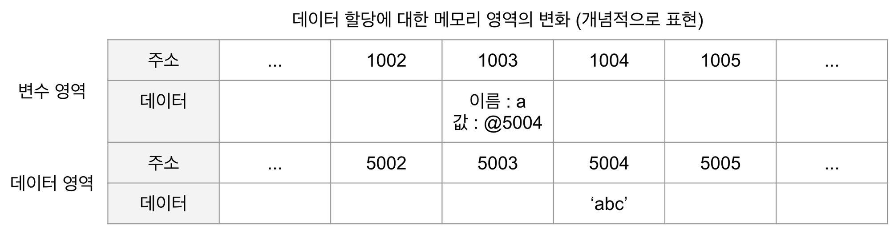

1. 변수 영역에서 빈 공간(@1003)을 확보한다.
2. 확보한 공간의 식별자를 a로 지정한다.
3. 데이터 영역의 빈 공간(@5004)에 문자열 'abc'를 저장한다.
4. 변수 영역에서 a라는 식별자를 검색한다.
5. 앞서 지정한 문자열의 주소(@5004)를 @1003의 공간에 대입한다.

여기서 드는 의문이 한가지 있다. 왜 변수 영역에 값을 직접 대입하지 않고 한 단계를 더 거쳐서 데이터를 위한 공간을 마련하고 해당 공간의 주소값을 변수 영역에 지정하는 것일까?

이는 데이터 변환을 자유롭게 할 수 있게 함과 동시에 메모리를 더욱 효율적으로 관리하기 위한 고민의 결과라고 볼 수 있다. 앞서 자바스크립트는 숫자형 데이터에 대해 64비트의 공간을 확보한다고 했다. 반면 문자열은 특별히 정해진 규격이 없는데 한 글자마다 영어는 1바이트, 한글은 2바이트 등으로 각각 필요한 메모리 용량이 가변적이며 전체 글자 수 역시 가변적이기 때문이다.

만약 미리 확보한 공간 내에서만 데이터 변환을 할 수 있다면 변환한 데이터를 다시 저장하기 위해서 '확보된 공간을 변환된 데이터 크기에 맞게 늘리는 작업'이 선행되어야 할 것이다. 확보된 공간이 메모리 상의 가장 마지막에 있었다면 뒤쪽으로 늘리기만 하면 되므로 어렵지 않지만 중간에 있는 데이터를 늘려야 하는 상황이 온다면 해당 공간보다 뒤에 저장된 데이터들을 전부 뒤로 옮기고, 이동시긴 주소를 각 식별자에 다시 연결하는 작업을 해야 한다.

**결국 효율적으로 문자열 데이터의 변환을 처리하려면 변수와 데이터를 별도의 공간에 나누어 저장하는 것이 최적이다.**

예를 들어, 문자열 'abc'의 마지막에 'def'를 추가하려고 하면 컴퓨터는 'abc'가 저장된 공간에 'abcdef'를 할당하는 대신 'abcdef'라는 문자열을 **새로** 만들어 별도의 공간에 저장하고, 그 주소를 변수 공간에 연결한다. 반대로 'abc'에서 'c'를 제거하라고 명령해도 'ab'를 새로 만들어 저장한다. 정리하면 기존 문자열의 어떤 변환을 가하든 상관없이 무조건 새로 만들어 별도의 공간에 저장한다.

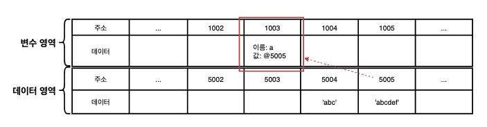

> ❗️
>
> 그렇다면 새로운 공간의 새로운 데이터를 만들어 변수가 가리키게 한다면 원래의 데이터는 어떻게 되는 것일까? 
>
> -> 만약 기존의 데이터(@5004)는 자신의 주소를 저장하는 변수가 하나도 없게 되면 가비지 컬렉터(GC)에 수거 대상이 된다. 그렇지 않고 메모리 상에 계속 남겨져 있으면 메모리 낭비가 되기 때문이다.

다른 예로 500개의 변수를 생성해서 모든 변수의 숫자 5를 할당한다고 상상해보자. 각 변수를 별개로 인식하려면 500개의 변수 공간을 확보하는 것은 불가피하다. 그런데 각 변수 공간마다 매번 숫자 5를 할당하려고 하면 숫자형은 8바이트가 필요하니 총 4000바이트가 필요하게 될 것이다. 그 대신 5를 별도의 공간에 한 번만 저장하고 각 변수 공간에서 해당 공간의 주소만 입력한다고 하면 사용되는 메모리를 확연하게 줄일 수 있다. 예를 들어 각 주소 공간의 크기가 2바이트라고 하면 1008바이트(2*500+8)만 이용하면 된다. 이처럼 **변수 영역과 데이터 영역을 분리하면 중복된 데이터에 대한 처리 효율이 높아진다.**

----

#### 기본형 데이터와 참조형 데이터

변수(variable)과 상수(constant)를 구분하는 성질을 '변경 가능성'이다. 쉽게 말해 바꿀 수 있으면 변수, 바꿀 수 없으면 상수다. 불변값과 상수를 같은 개념으로 생각하기 쉬운데 이 둘을 명확하게 구분할 필요가 있다. 

변수와 상수를 구분 짓는 변경 가능성의 대상은 **변수 영역** 메모리다. 한 번 데이터 할당이 이뤄진 변수 공간에 다른 데이터를 재할당할 수 있는지 여부가 관건이다. 반면 불변성 여부를 구불할 때의 변경 가능성의 대상은 **데이터 영역** 메모리다.

기본형 데이터인 숫자, 문자열, boolean, null, undefined, Symbol은 모두 불변값이다. 

```javascript
var a = 'abc';
a = a + 'def';

var b = 5;
var c = 5;
b = 7;
```

위 예제를 보면 변수 `a` 에 문자열 'abc'를 할당했다가 뒤에 'def'를 추가하면 기존의 'abc'가 'abcdef'로 바뀌는 것이 아니라 새로운 무자열 'abcdef'를 만들어 그 주소를 변수 `a` 에 저장한다. 즉, 'abc'와 'abcdef'는 완절히 별개의 데이터다.

4번째 줄에서는 변수 `b` 에 숫자 5를 할당한다. 그러면 컴퓨터는 일단 데이터 영역에서 5를 찾고, 없으면 그제서야 5를 위한 데이터 공간을 하나 만들어 저장한다. 그리고 그 주소를 `b`에 저저장장한다. 5번째 줄에서 다시 같은 수인 5를 변수 `c` 에 할당하려고 한다. 이때 컴퓨터는 데이터 영역에서 5를 찾고 4번째 줄에서 만들어 놓은 값이 있으니 그 주소를 재활용한다.

6번째 줄에서 변수 `b`의 값을 7로 바꾸려고 한다. 그러면 기존에 저장된 5자체를 7로 바꾸는 것이 아니라 기존에 저장했던 7이 데이터 영역에 있는지 확인한 후 있으면 재활용하고, 없으면 새로 만들어 `b`에 저장한다. 결국 5와 7 모두 다른 값으로 변경할 수 없다.

이처럼 문자열 값도 한 번 만든 값을 바꿀 수 없고, 숫자 값도 다른 값으로 변경할 수 없다. **변경은 새로 만드는 동작을 통해서만 이루어진다.** 이것이 바로 불변값의 성질이다. **한 번 만들어진 값은 가비지 컬렉팅을 당하지 않는 이상 영원히 변하지 않는다.**

앞서 기본형 데이터는 모두 불변값이라고 했다. 그렇다면 참조형 데이터는 모두 가변값일까?

기본적인 성질은 가변값인 경우가 많지만 설정에 따라 변경 불가능한 경우도 있고, 아예 불변값으로 활용하는 방안도 있다. 불변값으로 활용하는 예외적인 방안은 추후에 다루도록 하고 우선 참조형 데이터를 변수에 할당하는 과정부터 알아보자.

```javascript
var obj1 = {
  a: 1,
  b: 'bbb',
};
```

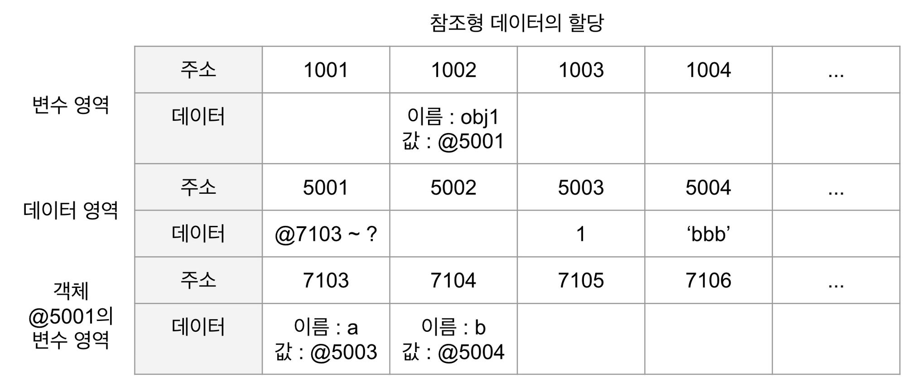

1. 컴퓨터는 우선 변수 영역의 빈공간(@1002)를 확보하고, 그 주소의 이름은 `obj1` 으로 지정한다.
2. 임의의 데이터 저장 공간(@5001)이 데이터를 저장하려고 보니 여러 개의 프로퍼티로 이뤄진 데이터 그룹이다. 이 그룹 내부의 프로퍼티들을 저장하기 위해 별도의 변수 영역을 마련하고, 그 영역의 주소(@7103~?)를 @5001에 저장한다.
3. @7103 및 @7104에 각각 `a` 와 `b`라는 프로퍼티 이름을 지정한다.
4. 데이터 영역에서 숫자 1을 검색한다. 검색 결과가 없으므로 임의로 @5003에 저장하고, 이 주소를 @7103에 저장한다. 문자열 'bbb' 역시 임의로 @5004에 저장하고, 이 주소를 @7104에 저장한다.

> ❗️
>
> 객체의 프로퍼티들을 저장하기 위한 메모리 영역은 크기가 정해져 있지 않고 필요한 시점에 동적으로 확보한다.

기본형 데이터와의 차이는 '객체의 변수(프로퍼티) 영역'이 별도로 존재한다는 점이다. 그림을 보면 객체가 별도로 할애한 공간은 변수 영역일 뿐 '데이터 영역'은 모두 기존의 메모리 공간을 그대로 활용하고 있다. 데이터 영역에 저장된 값은 모두 불변값이다. 그러나 변수에는 다른 값을 얼마든지 대입할 수 있다. 바로 이 부분때문에 참조형 데이터는 불변(immutable)하지 않다(가변값이다)라고 하는 것이다.

```javascript
var obj1 = {
  a: 1,
  b: 'bbb',
};
obj1.a = 2;
```

5번째 줄을 보면 `obj1` 의 `a` 프로퍼티에 숫자 2를 할당하려 한다. 컴퓨터는 데이터 영역에서 숫자 2를 검색한다. 검색 결과가 없으므로 빈 공간인 @5005에 저장하고, 이 주소를 @7103에 저장한다. 

4번째 줄의 명령 전과 후에 변수 `obj1` 이 바라보고 있는 주소는 @5001로 변하지 않았다. 즉, '새로운 객체'가 만들어진 것이 아니라 기존의 객체 내부의 값만 바뀐 것이다.

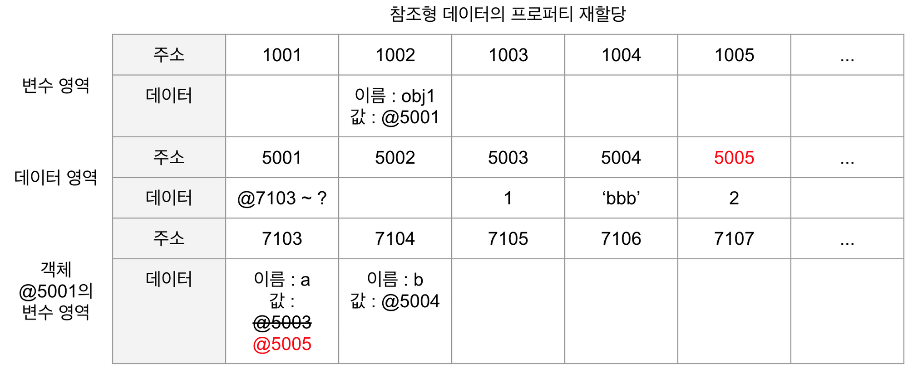

이번에는 참조형 데이터의 프로퍼티에 다시 참조형 데이터를 할당하는 경우를 살펴보자. 이런 경우는 중첩 객체(nested object)라고 한다.

```javascript
var obj = {
  x: 3,
  arr: [3, 4, 5],
};
```

1. 컴퓨터는 우선 변수 영역의 빈 공간(@1002)를 확보하고, 그 주소의 이름을 `obj` 로 지정한다.
2. 임의의 데이터 저장공간(@5001)에 데이터를 저장하는데, 이 데이터는 여러 개의 변수와 값들을 모아놓은 그룹(객체)다. 이 그룹의 각 변수들(프로퍼티)을 저장하기 위해 별도의 변수 영역을 마련하고(@7103~?), 그 영역의 주소를 @5001에 저장한다.
3. @7103에 이름 `x` 를 @7104에 이름 `arr` 을 지정한다.
4. 데이터 영역에서 숫자 3을 검색한다. 없으므로 임의로 @5002에 저장하고, 이 주소를 @7103에 저장한다.
5. @7104에 저장할 값은 배열로서 역시 데이터 그룹이다. 이 그룹 내부이 프로퍼티들을 저장하기 위해 별도의 변수 영역(@8104~?)을 마련하고, 그 영역의 주소를 @7104에 저장한다.
6. 배열의 요소가 총 3개이므로 3개의 변수 공간을 확보하고 각각 인덱스를 부여한다(0,1,2).
7. 데이터 영역에서 숫자 3을 검색해서(@5002) 그 주소를 @8104에 저장한다.
8. 데이터 영역에서 숫자 4가 없으므로 @5004에 저장하고, 이 주소를 @8105에 저장한다.
9. 데이터 영역에서 숫자 5가 없으므로 @5005에 저장하고, 이 주소를 @8106에 저장한다.

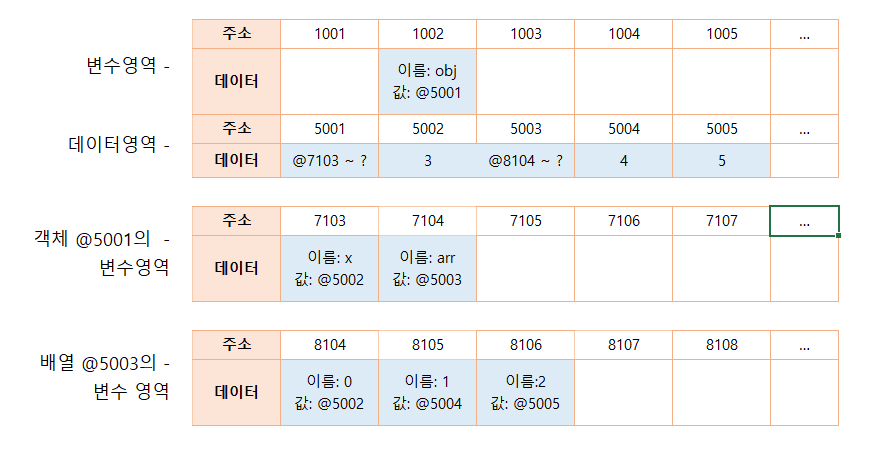

이제 `obj.arr[1]` 을 검색하고자 하면 메모리에서는 다음과 같은 검색 과정을 거친다.

1. obj 검색 1: obj라는 식별자를 가진 주소를 찾는다(@1002).
2. obj 검색 2: 값이 주소이므로 그 주소로 이동한다(@5001).
3. obj 검색 3: 값이 주소이므로 그 주소로 이동한다(@7103~?).
4. obj.arr 검색 1: arr이라는 식별자를 가진 주소를 찾는다(@7104).
5. obj.arr 검색 2: 값이 주소이므로 그 주소로 이동한다(@5003).
6. obj.arr 검색 3: 값이 주소이므로 그 주소로 이동한다(@8104~?).
7. obj.arr[1] 검색 1: 인덱스 1에 해당하는 주소를 찾는다(@8105).
8. obj.arr[1] 검색 2: 값이 주소이므로 그 주소로 이동한다(@5004).
9. obj.arr[1] 검색 3: 값이 숫자형 데이터이므로 4를 반환한다.

> @1002 -> @5001 -> @7103~? -> @7104 -> @5003 -> @8104~? -> @8105 -> @5004 -> 4반환

만약 이 상태에서 다음과 같이 재할당 명령을 내리면 어떻게 될까?

```javascript
obj.arr = 'str';
```

@5006에 문자열 'str'을 저장하고, 그 주소를 @7104에 저장한다. 그러면 @5003은 자신을 참조하는 변수가 하나도 없게 된다. 어떤 데이터에 대해 자신의 주소를 참조하는 변수의 개수를 참조 카운트라고 한다. @5003의 참조 카운트는 @7104에 @5003이 저장돼 있던 시점까지는 1이었다가 @7104에 @5006이 저장되는 순간 0이 된다. **참조 카운트가 0인 메모리 주소를 가비지 컬렉터(GC)의 수거 대상이 된다.** 

가비지 컬렉터는 런타임 환경에 따라 특정 시점이나 메모리 사용량이 포화 상태에 임박할 때마다 자동으로 수거 대상들을 수거한다. 수건되 메모리는 다시 새로운 값을 할당할 수 있는 빈 공간이 된다.

즉, @5003은 참조 카운트가 0이 됨에 따라 GC 대상이 되고, 이후 언젠가 담겨 있던 데이터인 "@8104~?" 라는 값이 사라진다. 이 과정에서 연쇄적으로 @8104~?의 각 데이터들의 참조 카운트가 0이 되고, 이들 역시 GC의 대상(아래 그림의 파란 부분)이 되어 함께 사라질 것이다.

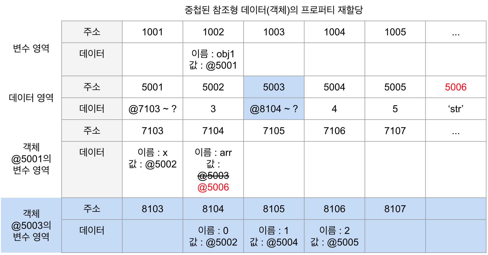

----

#### 변수 복사 비교

기본형 데이터와 가변형 데이터의 동작 방식에 대해 알아봤으니 둘의 차이에 대해 알아보자. 먼저 변수를 복사할 떄의 변화를 살펴보도록 하자.

```javascript
var a = 10;
var b = a;

var obj1 = { c: 10, d: 'ddd' };
var obj2 = obj1;
```

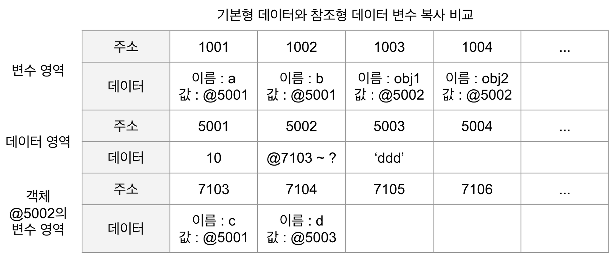

기본형 데이터의 경우 변수 영역의 빈 공간 @1001을 확보한 후 식별자를 `a` 로 지정한다. 숫자 10을 데이터 영역에서 검색하고 없으므로 빈 공간 @5001에 저장한 다음, 이 주소를 @1001에 넣는다. 이로써 기본형 데이터의 변수 선언 및 할당이 종료된다.

복사를 할 때는 변수 영역의 빈 공간@1002를 확보하고 식별자를 `b` 로 지정한다. 이제 식별자 `a` 를 검색한 다음 그 값을 찾아와야 하는데 @1001에 저장된 값인 @5001을 들고 확보해둔 @1002에 값으로 대입한다. 

다음으로 참조형 데이터의 경우 변수 영역의 빈 공간 @1003을 확보해 식별자를 `obj1` 으로 지정한다. 데이터 영역의 빈 공간 @5002를 확보하고, 데이터 그룹이 담겨야 하기 때문에 별도의 변수 영역 @7103~?를 확보해 그 주소를 저장한다. @7103에 식별자 `c` @7104에 식별자 `d` 를 입력한 다음, `c` 에 대입할 값 10을 데이터 영역에서 검색한다. @5001에 이미 저장돼 있으므로 이 주소를 @7103에 연결하고, 문자열인 'ddd' 는 데이터 영역에 빈 공간게 새로 만들어 @7104에 연결한다. 여기까지가 참조형 데이터의 변수 선언 및 할당 과정이다.

복사를 할 때는 변수 영역에 빈 공간 @1004를 확보한고 식별자를 `obj2` 로 지정한다. 이제 식별자 `obj1` 을 검색해(@1003) 그 값이 @5002를 들고, @1004에 값으로 대입한다. 

변수를 복사하는 과정은 기본형 데이터와 참조형 데이터 모두 같은 주소를 바라보게 되는 점에서 동일하다. @1001과 @1002는 모두 @5002를 바라보고 @1003과 @1004는 모두 @5002를 바라본다. 복사 과정은 동일하지만 데이터 할당 과정에서 이미 차이가 있기 때문에 변수 복사 이후의 동작에도 큰 차이가 발생한다.

```javascript
var a = 10;
var b = a;
var obj1 = { c: 10, d: 'ddd' };
var obj2 = obj1;

b = 15;
obj2.c = 20;
```

6번째 줄에서 데이터 영역에 아직 15가 없으므로 새로운 공간 @5004에 값을 저장하고, 그 주소를 든 채로 변수 영역에서 식별자가 `b` 인 주소를 찾는다. 이에 따라 @1002의 값이 @5004가 될 것이다.

7번째 줄에서는 데이터 영역에 아직 20이 없으므로 새로운 공간 @5005에 저장하고, 그 주소를 든 채로 변수 영역에서 `obj2` 를 찾고(@1004), `obj2` 의 값인 @5002가 가리키는 변수 영역에서 다시 `c` 를 찾아(@7103) 그곳에 @5005를 대입한다.

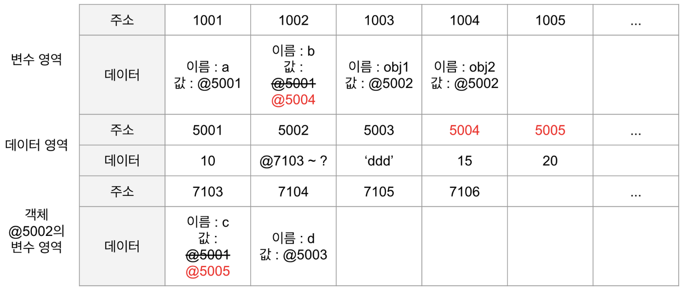

기본형 데이터를 복사한 변수 `b` 의 값을 바꿨더니 @1002의 값이 달라진 반면, 참조형 데이터를 복사한 변수 `obj2` 의 프로퍼티의 값을 바꾸었더니 @1004의 값은 달라지지 않았다. 즉, 변수 `a` 와 `b` 는 서로 다른 주소를 바라보게 됐으나, 변수 `obj1` 과 `obj2` 는 여전히 같은 객체를 바라보고 있는 상태다.

```javascript
a !== b
obj1 === obj2
```

이 결과가 바로 기본형 데이터와 참조형 데이터의 가장 큰 차이점이다. 일반적으로 '기본형은 값을 복사하고 참조형은 주소를 복사한다'고 설명하고 있지만, 사실은 어떤 데이터 타입이든 변수에 할당하기 위해서는 주솟값을 복사해야 하기 때문에, 엄밀히 따지면 자바스크립트의 모든 데이터 타입은 참조형 데이터일 수 밖에 없다. 다만 **기본형은 주솟값을 복사하는 과정이 한 번만 이루어지고, 참조형은 한 단계를 더 거치게 된다는 차이가 있는 것이다.**

위 예제에서는 변수의 값(b)을 직접 변경할 때와 값이 아닌 내부 프로퍼티(obj2.c)를 변경할 때의 결과를 비교한 것이다. 비교 대상의 조건이 다르니 서로 다르게 동작하는 것이 당연하지만 같은 조건일 때 비교하면 어떨지 확인해보자.

```javascript
var a = 10;
var b = a;
var obj1 = { c: 10, d: 'ddd' };
var obj2 = obj1;

b = 15;
obj2 = { c: 20, d: 'ddd' };
```

이번에는 b와 마찬가지로 obj2에도 새로운 객체를 할당함으로써 값을 직접 변경했다. 그러면 메모리에 데이터 영역에 새로운 공간에 새 객체가 저장되고 그 주소를 변수 영역의 `obj2` 위치에 저장할 것이다. 객체에 대한 변경임에도 값이 달라진 것이다.

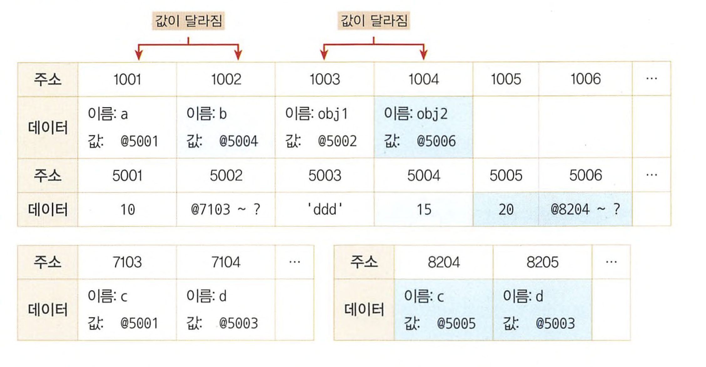

**즉, 참조형 데이터가 '가변값'이라고 설명할 때의 '가변'은 참조형 데이터 자체를 변경할 경우가 아니라 그 내부의 프로퍼티를 변경할 때만 성립한다.**

----

#### 불변객체

바로 위에서 언급했듯이 참조형 데이터의 '가변'은 데이터 자체가 아닌 내부 프로퍼티를 변경할 때만 성립한다. 데이터 자체를 변경하고자 하면(새로운 데이터를 할당하고자 하면) 기본형 데이터와 마찬가지로 **기존 데이터는 변하지 않는다.** 그렇가면 내부 프로퍼티를 변경할 필요가 있을 때마다 매번 새로운 객체를 만들어 재할당하기로 규칙을 정하거나 자동으로 새로운 객체를 만드는 도구를 활용한다면 객체 역시 불변성을 확보할 수 있을 것이다. 

그렇다면 어떤 상황에서 불변 객체가 필요할까? 값으로 전달받은 객체에 변경을 가하더라도 원본 객체는 변하지 않아야 하는 경우가 종종 발생한다. 바로 이럴 때 불변 객체가 필요하다.

```javascript
var user = {
  name: 'Jaenam',
  gender: 'male',
};

var changeName = function(user, newName) {
  var newUser = user;
  newUser.name = newName;
  return newUser;
};

var user2 = changeName(user, 'Jung');

if (user !== user2) {
  console.log('유저 정보가 변경되었습니다.');
}
console.log(user.name, user2.name); // Jung Jung
console.log(user === user2); // true
```

위 예제는 객체의 가변성으로 인한 문제점을 보여주는 예시다. 1번째 줄에서 `user` 객체를 생성하고, 12번째 줄에서 `user` 객체의 `name` 프로퍼티를 'Jung' 으로 바꾸는 함수 `changeName` 함수를 호출해서 그 결과를 `user2` 변수에 담았다.

14번째 줄에서 조건문을 통해 각각의 객체가 서로 같지 않으면 15번째 줄의 내용이 출력이 되겠지만 출력없이 통과한다. 그리고 17번째 줄에서 `user` 와 `user2` 의 `name` 프로퍼티 모두 'Jung' 을 출력하고 있고 18번째 줄에서 `user` 와 `user2` 가 서로 동일하다고 한다.

만약 14번째 줄처럼 정보가 바뀐 시점에 알림을 보내야 한다거나, 바뀌기 전의 정보와 바뀐 후의 정보의 차이를 보여줘야 하는 등의 기능을 구현하려면 `user` 와 `user2` 가 서로 다른 객체를 바라보게 만들어야 한다.

```javascript
var user = {
  name: 'Jaenam',
  gender: 'male',
};

var changeName = function(user, newName) {
  return {
    name: newName,
    gender: user.gender,
  };
};

var user2 = changeName(user, 'Jung');

if (user !== user2) {
  console.log('유저 정보가 변경되었습니다.'); // 유저 정보가 변경되었습니다.
}
console.log(user.name, user2.name); // Jaenam Jung
console.log(user === user2); // false
```

위 코드는 `user` 와 `user2` 가 서로 다른 객체를 바라보도록 수정한 코드다. 

차이를 보면 `chaneName` 함수가 새로운 객체를 반환하도록 수정을 한 것을 알 수 있다. 이제 `user` 와 `user2` 는 서로 다른 객체이므로 안전하게 변경 전과 후를 비교할 수 있다. 다만 `changeName` 함수는 새로운 객체를 만들면서 변경할 필요가 없는 기존 객체의 프로퍼티(gender)를 하드코딩으로 입력했다. 이런 식으로는 대상 객체에 정보가 많거나 변경할 정보가 많을 수록 사용자가 입력하는 수고가 늘어날 것이다. 

```javascript
# 기존 정보를 복사해서 새로운 객체를 반환하는 함수(얕은 복사)
var copyObject = function(target) {
  var result = {};
  for (var prop in target) {
    result[prop] = target[prop];
  }
  return result;
};
```

`copyObject` 는 `result` 객체에 `target` 객체의 프로퍼티들을 복사하는 함수다. 프로토타입 체이닝 상의 모든 프로퍼티를 복사한다는 점, getter/setter는 복사하지 않는 점, 얕은 복사만을 수행한다는 점이 문제가 되지만 `user` 객체에 대해서는 문제가 되지 않으니 진행하도록 하자.

```javascript
var copyObject = function(target) {
  var result = {};
  for (var prop in target) {
    result[prop] = target[prop];
  }
  return result;
};

var user = {
  name: 'Jaenam',
  gender: 'male',
};

var user2 = copyObject(user);
user2.name = 'Jung';

if (user !== user2) {
  console.log('유저 정보가 변경되었습니다.'); // 유저 정보가 변경되었습니다.
}
console.log(user.name, user2.name); // Jaenam Jung
console.log(user === user2); // false
```

`copyObject` 함수를 통해 간단하게 객체를 복사하고 내용을 수정하는데 성공했다. 협업하는 모든 개발자들이 객체 내부의 변경이 필요할 때는 `copyObject` 함수만을 사용하기로 약속하고 규칙을 지킨다는 전제하에는 `user` 객체가 곧 불변객체라고 할 수 있다.

하지만 이렇게 신뢰에만 의존하는 것 말고 시스템적으로 제약을 거는 편이 안전할 것이다. 이런 맥락에서 immutable.js baobab.js 등 많은 라이브러리가 등장해 인기를 끌고 있다. 이들은 자바스크립트 내장 객체가 아닌 라이브러리 자체에서 불변성을 지닌 별도의 데이터 타입과 그에 따른 메서드를 제공한다.

----

#### 얕은 복사와 깊은 복사

