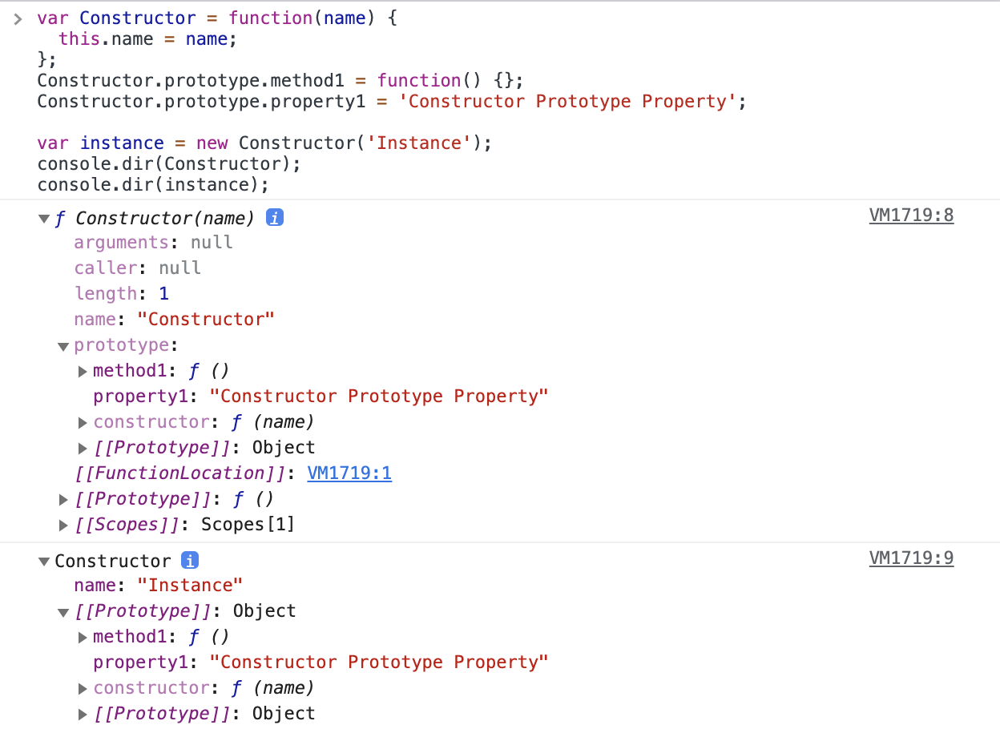
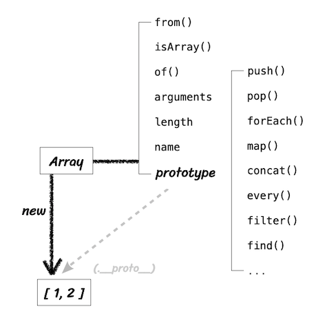
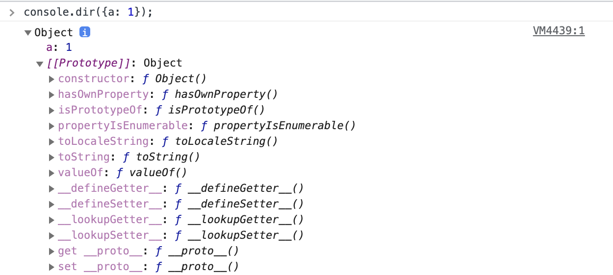
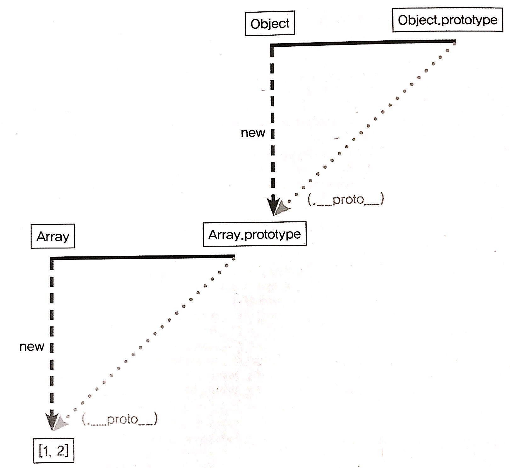
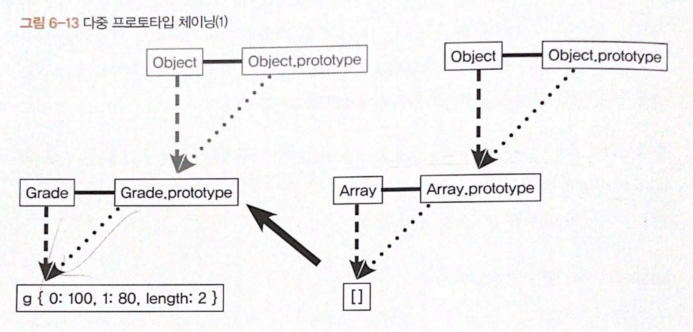
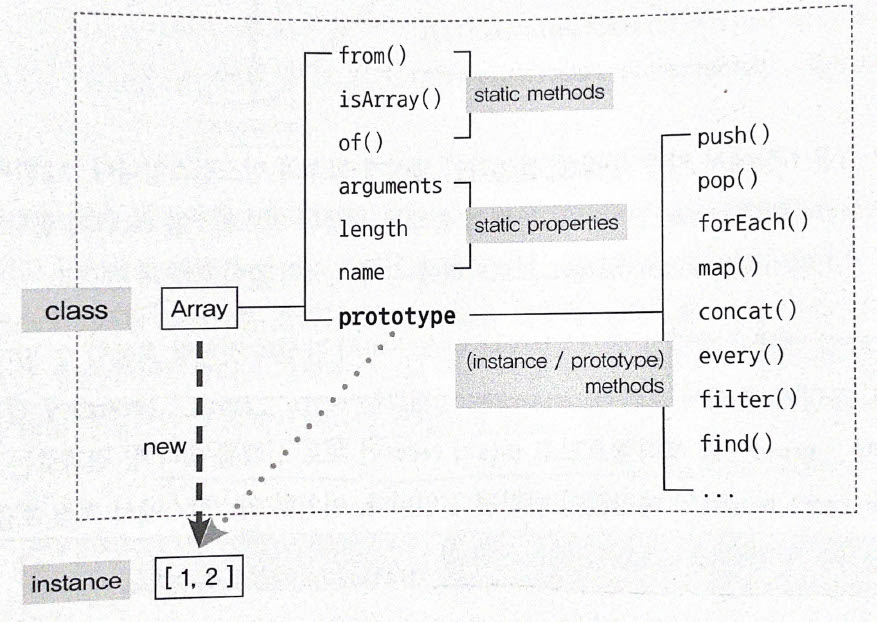
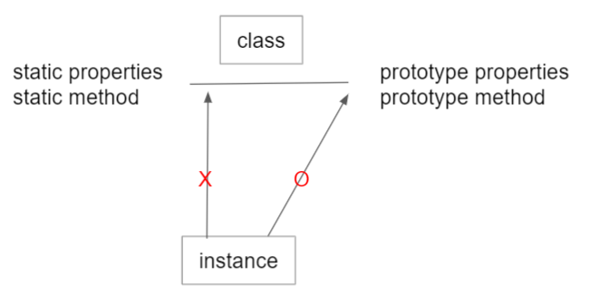

# 1. Data Type

자바스크립트의 데이터 타입은 크게 두 가지의 형태가 있다.

1. 기본형(원시형): primitive type
2. 참조형: reference type

#### 기본형의 종류

숫자(number), 불리언(boolean), null, undefined, Symbol(ES6에서 추가)

#### 참조형의 종류

객체(Object), 배열(Array), 함수(Function), 날짜(Date), 정규표현식(RegExp) 등과 ES6에서 추가된 Map, WeakMap, Set, WeakSet 등이 있다.


#### 어떤 기준으로 기본형과 참조형을 분류할까?

기본형과 참조형 모두 주솟값을 복제를 하긴 하지만 **기본형은 값이 담긴 주솟값을 바로 복제**하는 반면 참조형은 **값이 담긴 주솟값들로 이루어진 묶음을 가리키는 주솟값을 복제**한다.

또한 기본형은 불변성(Immutablity)를 띈다. 언뜻 헷갈릴 수 있는 개념이다. 왜냐하면 기본형인 숫자 10을 변수 a에 할당한 후에 a의 값을 15로 바꿔도 문제 없이 변하기 때문이다. 여기서 "변하지 않는다"의 의미는 무엇일까?

----

#### 메모리와 데이터

컴퓨터는 모든 데이터를 0 또는 1로 기억한다. 0 또는 1로 표현할 수 있는 하나의 메모리 조각을 비트(bit)라고 한다. **각 비트는 고유한 식별자(unique identifier)를 통해 위치를 확인할 수 있다.** 하지만 이렇게 비트 단위로 위치를 확인하는 것은 매우 비효율적이므로 몇 개씩 묶어 하나의 단위로 여긴다면 표현할 수 있는 값도 늘어나면서 검색시간도 줄일 수 있다.

한편 많은 비트를 한 단위로 묶으면 검색 시간도 줄이고 표현할 수 있는 데이터의 개수도 늘어나지만 동시에 낭비되는 데이터가 생기기도 한다. 차라리 자주 사용하지 않을 데이터를 표현하기 위해 빈 공간을 남겨놓기보단 표현 가능한 개수에 어느 정도 제약이 따르더라도 크게 문제 되지 않을 적정한 공간을 묶는 폇이 낫다. 

이런 고민의 결과로 바이트(byte)라는 단위가 생겼다. 바이트는 8개의 비트로 구성돼 있고 1비트마다 0 또는 1 두 가지의 값을 표현할 수 있으므로 1바이트는 총 256개(2<sup>8</sup>)개의 값을 표현할 수 있다. 나아가 2바이트는 총 16개의 비트로 구성돼 있으므로 65536개(2<sup>16</sup>)개의 값을 표현할 수 있다.

C/C++, 자바의 경우 메모리의 낭비를 최소화하기 위해 데이터 타입별로 할당할 메모리 영역을 미리 정의해 둔다. 예를 들어 2바이트 크기의 정수형 타입(short)는 -32768~32767까지의 숫자만 허용하는데 이 범위를 벗어나는 숫자를 입력하면 오류가 나거나 잘못된 값(쓰레기 값)이 저장된다. 이 문제를 해결하기 위해 사용자는 직접 4바이트 크기의 정수형 데이터 타입(int)로 형변환을 해줘야한다.

반면 메모리 용량이 과거보다 월등히 커진 상황에서 등장한 자바스크립트는 상대적으로 메모리 관리에 대한 압박에서 자유로웠다. 그렇기 때문에 메모리 공간을 좀 더 여유롭게 할당했다. 숫자의 경우 정수형인지 부동소수형인지를 구분하지 않고 64비트 즉, 8바이트의 메모리 공간을 미리 확보해뒀다.

앞서 각 비트는 고유한 식별자를 지니고 있고 이를 통해 각 비트의 위치를 확인할 수 있다고 했다. 바이트 역시 비트의 식별자로 위치를 확인할 수 있다. **모든 데이터는 바이트 단위의 식별자, 정확하게는 메모리 주솟값을 통해 서로를 구분하고 연결할 수 있다.**

먼저 변수(variable)와 식별자(identifier)를 명확하게 구분해야할 필요가 있다. **변수**는 말 그대로 '변할 수 있는 수'를 뜻한다. '수'라는 것이 반드시 숫자를 의미하는 것은 아니기에 컴퓨터 용어로 변수를 사용할 때는 '**변할 수 있는 무언가**'로 해석할 수 있다. 여기서 **'무언가'란 바로 '데이터'**를 뜻한다. 숫자뿐만 아니라 문자열, 객체, 배열 모두 데이터다. **식별자**는 어떤 데이터를 식별하는데 사용하는 이름 즉, **변수명**을 말한다.

----

#### 변수 선언과 데이터 할당

```javascript
var a;
```

위 예제를 말로 풀어쓰면 "**변할 수 있는 데이터를 만든다. 이 데이터의 식별자는 a로 한다.**"로 해석할 수 있다. 변할 수 있는 데이터니 선언할 때는 `undefined` 여도 나중에 다른 값으로 바꾸면 된다. 이렇게 보면 변수란 결국 **변경 가능한 데이터가 담길 수 있는 공간 또는 그릇** 이라고 이해하면 될 것 같다.


위 그림은 예제의 명령을 받아 메모리 영역에서 어떤 작업을 수행하는지를 표현한 그림이다.

명령을 받은 컴퓨터는 메모리 공간에서 비어있는 공간을 확보한다. 위 그림에서는 임의로 1003번으로 정했다. 이 공간의 이름(식별자)를 `a` 라고 지정한다. 여기까지가 변수 선언 과정이다. 이후에 만약 사용자가 `a` 에 접근하고자 하면 컴퓨터는 메모리에서 `a` 라는 이름을 가진 주소를 검색해서 해당 공간에 담긴 데이터를 반환하게 될 것이다.

```javascript
var a; // 변수 a 선언
a = 'abc'; // 변수 a에 데이터 할당

var a = 'abc'; // 변수 선언과 할당을 한 문장으로 표현
```

위 예제처럼 선언과 할당을 나누어서 하든 한 줄에 하든 자바스크립트 엔진은 같은 동작을 수행한다. 할당하는 과정을 생각해보면 직관적으로 봤을때  `a` 라는 이름을 가진 주소를 검색해 다음 그 위치에 데이터를 할당하면 될 것 같다.

하지만 실제로 해당 위치에 'abc'를 직접 저장하지 않는다. 즉, **데이터를 저장하기 위한 별도의 공간을 다시 확보해서 데이터('abc')를 저장하고 확보한 별도의 공간의 주소를 변수영역에 저장하는 식으로 이뤄진다.** 이해를 돕기 위해 데이터의 성질에 따라 '변수 영역', '데이터 영역'으로 구분지어 이해해보자.

데이터 할당의 전체 흐름은 다음과 같다.


1. 변수 영역에서 빈 공간(@1003)을 확보한다.
2. 확보한 공간의 식별자를 a로 지정한다.
3. 데이터 영역의 빈 공간(@5004)에 문자열 'abc'를 저장한다.
4. 변수 영역에서 a라는 식별자를 검색한다.
5. 앞서 지정한 문자열의 주소(@5004)를 @1003의 공간에 대입한다.

여기서 드는 의문이 한가지 있다. 왜 변수 영역에 값을 직접 대입하지 않고 한 단계를 더 거쳐서 데이터를 위한 공간을 마련하고 해당 공간의 주소값을 변수 영역에 지정하는 것일까?

이는 데이터 변환을 자유롭게 할 수 있게 함과 동시에 메모리를 더욱 효율적으로 관리하기 위한 고민의 결과라고 볼 수 있다. 앞서 자바스크립트는 숫자형 데이터에 대해 64비트의 공간을 확보한다고 했다. 반면 문자열은 특별히 정해진 규격이 없는데 한 글자마다 영어는 1바이트, 한글은 2바이트 등으로 각각 필요한 메모리 용량이 가변적이며 전체 글자 수 역시 가변적이기 때문이다.

만약 미리 확보한 공간 내에서만 데이터 변환을 할 수 있다면 변환한 데이터를 다시 저장하기 위해서 '확보된 공간을 변환된 데이터 크기에 맞게 늘리는 작업'이 선행되어야 할 것이다. 확보된 공간이 메모리 상의 가장 마지막에 있었다면 뒤쪽으로 늘리기만 하면 되므로 어렵지 않지만 중간에 있는 데이터를 늘려야 하는 상황이 온다면 해당 공간보다 뒤에 저장된 데이터들을 전부 뒤로 옮기고, 이동시긴 주소를 각 식별자에 다시 연결하는 작업을 해야 한다.

**결국 효율적으로 문자열 데이터의 변환을 처리하려면 변수와 데이터를 별도의 공간에 나누어 저장하는 것이 최적이다.**

예를 들어, 문자열 'abc'의 마지막에 'def'를 추가하려고 하면 컴퓨터는 'abc'가 저장된 공간에 'abcdef'를 할당하는 대신 'abcdef'라는 문자열을 **새로** 만들어 별도의 공간에 저장하고, 그 주소를 변수 공간에 연결한다. 반대로 'abc'에서 'c'를 제거하라고 명령해도 'ab'를 새로 만들어 저장한다. 정리하면 기존 문자열의 어떤 변환을 가하든 상관없이 무조건 새로 만들어 별도의 공간에 저장한다.


> ❗️
>
> 그렇다면 새로운 공간의 새로운 데이터를 만들어 변수가 가리키게 한다면 원래의 데이터는 어떻게 되는 것일까? 
>
> -> 만약 기존의 데이터(@5004)는 자신의 주소를 저장하는 변수가 하나도 없게 되면 가비지 컬렉터(GC)에 수거 대상이 된다. 그렇지 않고 메모리 상에 계속 남겨져 있으면 메모리 낭비가 되기 때문이다.

다른 예로 500개의 변수를 생성해서 모든 변수의 숫자 5를 할당한다고 상상해보자. 각 변수를 별개로 인식하려면 500개의 변수 공간을 확보하는 것은 불가피하다. 그런데 각 변수 공간마다 매번 숫자 5를 할당하려고 하면 숫자형은 8바이트가 필요하니 총 4000바이트가 필요하게 될 것이다. 그 대신 5를 별도의 공간에 한 번만 저장하고 각 변수 공간에서 해당 공간의 주소만 입력한다고 하면 사용되는 메모리를 확연하게 줄일 수 있다. 예를 들어 각 주소 공간의 크기가 2바이트라고 하면 1008바이트(2*500+8)만 이용하면 된다. 이처럼 **변수 영역과 데이터 영역을 분리하면 중복된 데이터에 대한 처리 효율이 높아진다.**

----

#### 기본형 데이터와 참조형 데이터

변수(variable)과 상수(constant)를 구분하는 성질을 '변경 가능성'이다. 쉽게 말해 바꿀 수 있으면 변수, 바꿀 수 없으면 상수다. 불변값과 상수를 같은 개념으로 생각하기 쉬운데 이 둘을 명확하게 구분할 필요가 있다. 

변수와 상수를 구분 짓는 변경 가능성의 대상은 **변수 영역** 메모리다. 한 번 데이터 할당이 이뤄진 변수 공간에 다른 데이터를 재할당할 수 있는지 여부가 관건이다. 반면 불변성 여부를 구불할 때의 변경 가능성의 대상은 **데이터 영역** 메모리다.

기본형 데이터인 숫자, 문자열, boolean, null, undefined, Symbol은 모두 불변값이다. 

```javascript
var a = 'abc';
a = a + 'def';

var b = 5;
var c = 5;
b = 7;
```

위 예제를 보면 변수 `a` 에 문자열 'abc'를 할당했다가 뒤에 'def'를 추가하면 기존의 'abc'가 'abcdef'로 바뀌는 것이 아니라 새로운 무자열 'abcdef'를 만들어 그 주소를 변수 `a` 에 저장한다. 즉, 'abc'와 'abcdef'는 완절히 별개의 데이터다.

4번째 줄에서는 변수 `b` 에 숫자 5를 할당한다. 그러면 컴퓨터는 일단 데이터 영역에서 5를 찾고, 없으면 그제서야 5를 위한 데이터 공간을 하나 만들어 저장한다. 그리고 그 주소를 `b`에 저저장장한다. 5번째 줄에서 다시 같은 수인 5를 변수 `c` 에 할당하려고 한다. 이때 컴퓨터는 데이터 영역에서 5를 찾고 4번째 줄에서 만들어 놓은 값이 있으니 그 주소를 재활용한다.

6번째 줄에서 변수 `b`의 값을 7로 바꾸려고 한다. 그러면 기존에 저장된 5자체를 7로 바꾸는 것이 아니라 기존에 저장했던 7이 데이터 영역에 있는지 확인한 후 있으면 재활용하고, 없으면 새로 만들어 `b`에 저장한다. 결국 5와 7 모두 다른 값으로 변경할 수 없다.

이처럼 문자열 값도 한 번 만든 값을 바꿀 수 없고, 숫자 값도 다른 값으로 변경할 수 없다. **변경은 새로 만드는 동작을 통해서만 이루어진다.** 이것이 바로 불변값의 성질이다. **한 번 만들어진 값은 가비지 컬렉팅을 당하지 않는 이상 영원히 변하지 않는다.**

앞서 기본형 데이터는 모두 불변값이라고 했다. 그렇다면 참조형 데이터는 모두 가변값일까?

기본적인 성질은 가변값인 경우가 많지만 설정에 따라 변경 불가능한 경우도 있고, 아예 불변값으로 활용하는 방안도 있다. 불변값으로 활용하는 예외적인 방안은 추후에 다루도록 하고 우선 참조형 데이터를 변수에 할당하는 과정부터 알아보자.

```javascript
var obj1 = {
  a: 1,
  b: 'bbb',
};
```


1. 컴퓨터는 우선 변수 영역의 빈공간(@1002)를 확보하고, 그 주소의 이름은 `obj1` 으로 지정한다.
2. 임의의 데이터 저장 공간(@5001)이 데이터를 저장하려고 보니 여러 개의 프로퍼티로 이뤄진 데이터 그룹이다. 이 그룹 내부의 프로퍼티들을 저장하기 위해 별도의 변수 영역을 마련하고, 그 영역의 주소(@7103~?)를 @5001에 저장한다.
3. @7103 및 @7104에 각각 `a` 와 `b`라는 프로퍼티 이름을 지정한다.
4. 데이터 영역에서 숫자 1을 검색한다. 검색 결과가 없으므로 임의로 @5003에 저장하고, 이 주소를 @7103에 저장한다. 문자열 'bbb' 역시 임의로 @5004에 저장하고, 이 주소를 @7104에 저장한다.

> ❗️
>
> 객체의 프로퍼티들을 저장하기 위한 메모리 영역은 크기가 정해져 있지 않고 필요한 시점에 동적으로 확보한다.

기본형 데이터와의 차이는 '객체의 변수(프로퍼티) 영역'이 별도로 존재한다는 점이다. 그림을 보면 객체가 별도로 할애한 공간은 변수 영역일 뿐 '데이터 영역'은 모두 기존의 메모리 공간을 그대로 활용하고 있다. 데이터 영역에 저장된 값은 모두 불변값이다. 그러나 변수에는 다른 값을 얼마든지 대입할 수 있다. 바로 이 부분때문에 참조형 데이터는 불변(immutable)하지 않다(가변값이다)라고 하는 것이다.

```javascript
var obj1 = {
  a: 1,
  b: 'bbb',
};
obj1.a = 2;
```

5번째 줄을 보면 `obj1` 의 `a` 프로퍼티에 숫자 2를 할당하려 한다. 컴퓨터는 데이터 영역에서 숫자 2를 검색한다. 검색 결과가 없으므로 빈 공간인 @5005에 저장하고, 이 주소를 @7103에 저장한다. 

4번째 줄의 명령 전과 후에 변수 `obj1` 이 바라보고 있는 주소는 @5001로 변하지 않았다. 즉, '새로운 객체'가 만들어진 것이 아니라 기존의 객체 내부의 값만 바뀐 것이다.


이번에는 참조형 데이터의 프로퍼티에 다시 참조형 데이터를 할당하는 경우를 살펴보자. 이런 경우는 중첩 객체(nested object)라고 한다.

```javascript
var obj = {
  x: 3,
  arr: [3, 4, 5],
};
```

1. 컴퓨터는 우선 변수 영역의 빈 공간(@1002)를 확보하고, 그 주소의 이름을 `obj` 로 지정한다.
2. 임의의 데이터 저장공간(@5001)에 데이터를 저장하는데, 이 데이터는 여러 개의 변수와 값들을 모아놓은 그룹(객체)다. 이 그룹의 각 변수들(프로퍼티)을 저장하기 위해 별도의 변수 영역을 마련하고(@7103~?), 그 영역의 주소를 @5001에 저장한다.
3. @7103에 이름 `x` 를 @7104에 이름 `arr` 을 지정한다.
4. 데이터 영역에서 숫자 3을 검색한다. 없으므로 임의로 @5002에 저장하고, 이 주소를 @7103에 저장한다.
5. @7104에 저장할 값은 배열로서 역시 데이터 그룹이다. 이 그룹 내부이 프로퍼티들을 저장하기 위해 별도의 변수 영역(@8104~?)을 마련하고, 그 영역의 주소를 @7104에 저장한다.
6. 배열의 요소가 총 3개이므로 3개의 변수 공간을 확보하고 각각 인덱스를 부여한다(0,1,2).
7. 데이터 영역에서 숫자 3을 검색해서(@5002) 그 주소를 @8104에 저장한다.
8. 데이터 영역에서 숫자 4가 없으므로 @5004에 저장하고, 이 주소를 @8105에 저장한다.
9. 데이터 영역에서 숫자 5가 없으므로 @5005에 저장하고, 이 주소를 @8106에 저장한다.


이제 `obj.arr[1]` 을 검색하고자 하면 메모리에서는 다음과 같은 검색 과정을 거친다.

1. obj 검색 1: obj라는 식별자를 가진 주소를 찾는다(@1002).
2. obj 검색 2: 값이 주소이므로 그 주소로 이동한다(@5001).
3. obj 검색 3: 값이 주소이므로 그 주소로 이동한다(@7103~?).
4. obj.arr 검색 1: arr이라는 식별자를 가진 주소를 찾는다(@7104).
5. obj.arr 검색 2: 값이 주소이므로 그 주소로 이동한다(@5003).
6. obj.arr 검색 3: 값이 주소이므로 그 주소로 이동한다(@8104~?).
7. obj.arr[1] 검색 1: 인덱스 1에 해당하는 주소를 찾는다(@8105).
8. obj.arr[1] 검색 2: 값이 주소이므로 그 주소로 이동한다(@5004).
9. obj.arr[1] 검색 3: 값이 숫자형 데이터이므로 4를 반환한다.

> @1002 -> @5001 -> @7103~? -> @7104 -> @5003 -> @8104~? -> @8105 -> @5004 -> 4반환

만약 이 상태에서 다음과 같이 재할당 명령을 내리면 어떻게 될까?

```javascript
obj.arr = 'str';
```

@5006에 문자열 'str'을 저장하고, 그 주소를 @7104에 저장한다. 그러면 @5003은 자신을 참조하는 변수가 하나도 없게 된다. 어떤 데이터에 대해 자신의 주소를 참조하는 변수의 개수를 참조 카운트라고 한다. @5003의 참조 카운트는 @7104에 @5003이 저장돼 있던 시점까지는 1이었다가 @7104에 @5006이 저장되는 순간 0이 된다. **참조 카운트가 0인 메모리 주소를 가비지 컬렉터(GC)의 수거 대상이 된다.** 

가비지 컬렉터는 런타임 환경에 따라 특정 시점이나 메모리 사용량이 포화 상태에 임박할 때마다 자동으로 수거 대상들을 수거한다. 수건되 메모리는 다시 새로운 값을 할당할 수 있는 빈 공간이 된다.

즉, @5003은 참조 카운트가 0이 됨에 따라 GC 대상이 되고, 이후 언젠가 담겨 있던 데이터인 "@8104~?" 라는 값이 사라진다. 이 과정에서 연쇄적으로 @8104~?의 각 데이터들의 참조 카운트가 0이 되고, 이들 역시 GC의 대상(아래 그림의 파란 부분)이 되어 함께 사라질 것이다.


----

#### 변수 복사 비교

기본형 데이터와 가변형 데이터의 동작 방식에 대해 알아봤으니 둘의 차이에 대해 알아보자. 먼저 변수를 복사할 떄의 변화를 살펴보도록 하자.

```javascript
var a = 10;
var b = a;

var obj1 = { c: 10, d: 'ddd' };
var obj2 = obj1;
```


기본형 데이터의 경우 변수 영역의 빈 공간 @1001을 확보한 후 식별자를 `a` 로 지정한다. 숫자 10을 데이터 영역에서 검색하고 없으므로 빈 공간 @5001에 저장한 다음, 이 주소를 @1001에 넣는다. 이로써 기본형 데이터의 변수 선언 및 할당이 종료된다.

복사를 할 때는 변수 영역의 빈 공간@1002를 확보하고 식별자를 `b` 로 지정한다. 이제 식별자 `a` 를 검색한 다음 그 값을 찾아와야 하는데 @1001에 저장된 값인 @5001을 들고 확보해둔 @1002에 값으로 대입한다. 

다음으로 참조형 데이터의 경우 변수 영역의 빈 공간 @1003을 확보해 식별자를 `obj1` 으로 지정한다. 데이터 영역의 빈 공간 @5002를 확보하고, 데이터 그룹이 담겨야 하기 때문에 별도의 변수 영역 @7103~?를 확보해 그 주소를 저장한다. @7103에 식별자 `c` @7104에 식별자 `d` 를 입력한 다음, `c` 에 대입할 값 10을 데이터 영역에서 검색한다. @5001에 이미 저장돼 있으므로 이 주소를 @7103에 연결하고, 문자열인 'ddd' 는 데이터 영역에 빈 공간게 새로 만들어 @7104에 연결한다. 여기까지가 참조형 데이터의 변수 선언 및 할당 과정이다.

복사를 할 때는 변수 영역에 빈 공간 @1004를 확보한고 식별자를 `obj2` 로 지정한다. 이제 식별자 `obj1` 을 검색해(@1003) 그 값이 @5002를 들고, @1004에 값으로 대입한다. 

변수를 복사하는 과정은 기본형 데이터와 참조형 데이터 모두 같은 주소를 바라보게 되는 점에서 동일하다. @1001과 @1002는 모두 @5002를 바라보고 @1003과 @1004는 모두 @5002를 바라본다. 복사 과정은 동일하지만 데이터 할당 과정에서 이미 차이가 있기 때문에 변수 복사 이후의 동작에도 큰 차이가 발생한다.

```javascript
var a = 10;
var b = a;
var obj1 = { c: 10, d: 'ddd' };
var obj2 = obj1;

b = 15;
obj2.c = 20;
```

6번째 줄에서 데이터 영역에 아직 15가 없으므로 새로운 공간 @5004에 값을 저장하고, 그 주소를 든 채로 변수 영역에서 식별자가 `b` 인 주소를 찾는다. 이에 따라 @1002의 값이 @5004가 될 것이다.

7번째 줄에서는 데이터 영역에 아직 20이 없으므로 새로운 공간 @5005에 저장하고, 그 주소를 든 채로 변수 영역에서 `obj2` 를 찾고(@1004), `obj2` 의 값인 @5002가 가리키는 변수 영역에서 다시 `c` 를 찾아(@7103) 그곳에 @5005를 대입한다.


기본형 데이터를 복사한 변수 `b` 의 값을 바꿨더니 @1002의 값이 달라진 반면, 참조형 데이터를 복사한 변수 `obj2` 의 프로퍼티의 값을 바꾸었더니 @1004의 값은 달라지지 않았다. 즉, 변수 `a` 와 `b` 는 서로 다른 주소를 바라보게 됐으나, 변수 `obj1` 과 `obj2` 는 여전히 같은 객체를 바라보고 있는 상태다.

```javascript
a !== b
obj1 === obj2
```

이 결과가 바로 기본형 데이터와 참조형 데이터의 가장 큰 차이점이다. 일반적으로 '기본형은 값을 복사하고 참조형은 주소를 복사한다'고 설명하고 있지만, 사실은 어떤 데이터 타입이든 변수에 할당하기 위해서는 주솟값을 복사해야 하기 때문에, 엄밀히 따지면 자바스크립트의 모든 데이터 타입은 참조형 데이터일 수 밖에 없다. 다만 **기본형은 주솟값을 복사하는 과정이 한 번만 이루어지고, 참조형은 한 단계를 더 거치게 된다는 차이가 있는 것이다.**

위 예제에서는 변수의 값(b)을 직접 변경할 때와 값이 아닌 내부 프로퍼티(obj2.c)를 변경할 때의 결과를 비교한 것이다. 비교 대상의 조건이 다르니 서로 다르게 동작하는 것이 당연하지만 같은 조건일 때 비교하면 어떨지 확인해보자.

```javascript
var a = 10;
var b = a;
var obj1 = { c: 10, d: 'ddd' };
var obj2 = obj1;

b = 15;
obj2 = { c: 20, d: 'ddd' };
```

이번에는 b와 마찬가지로 obj2에도 새로운 객체를 할당함으로써 값을 직접 변경했다. 그러면 메모리에 데이터 영역에 새로운 공간에 새 객체가 저장되고 그 주소를 변수 영역의 `obj2` 위치에 저장할 것이다. 객체에 대한 변경임에도 값이 달라진 것이다.


**즉, 참조형 데이터가 '가변값'이라고 설명할 때의 '가변'은 참조형 데이터 자체를 변경할 경우가 아니라 그 내부의 프로퍼티를 변경할 때만 성립한다.**

----

#### 불변객체

바로 위에서 언급했듯이 참조형 데이터의 '가변'은 데이터 자체가 아닌 내부 프로퍼티를 변경할 때만 성립한다. 데이터 자체를 변경하고자 하면(새로운 데이터를 할당하고자 하면) 기본형 데이터와 마찬가지로 **기존 데이터는 변하지 않는다.** 그렇가면 내부 프로퍼티를 변경할 필요가 있을 때마다 매번 새로운 객체를 만들어 재할당하기로 규칙을 정하거나 자동으로 새로운 객체를 만드는 도구를 활용한다면 객체 역시 불변성을 확보할 수 있을 것이다. 

그렇다면 어떤 상황에서 불변 객체가 필요할까? 값으로 전달받은 객체에 변경을 가하더라도 원본 객체는 변하지 않아야 하는 경우가 종종 발생한다. 바로 이럴 때 불변 객체가 필요하다.

```javascript
var user = {
  name: 'Jaenam',
  gender: 'male',
};

var changeName = function(user, newName) {
  var newUser = user;
  newUser.name = newName;
  return newUser;
};

var user2 = changeName(user, 'Jung');

if (user !== user2) {
  console.log('유저 정보가 변경되었습니다.');
}
console.log(user.name, user2.name); // Jung Jung
console.log(user === user2); // true
```

위 예제는 객체의 가변성으로 인한 문제점을 보여주는 예시다. 1번째 줄에서 `user` 객체를 생성하고, 12번째 줄에서 `user` 객체의 `name` 프로퍼티를 'Jung' 으로 바꾸는 함수 `changeName` 함수를 호출해서 그 결과를 `user2` 변수에 담았다.

14번째 줄에서 조건문을 통해 각각의 객체가 서로 같지 않으면 15번째 줄의 내용이 출력이 되겠지만 출력없이 통과한다. 그리고 17번째 줄에서 `user` 와 `user2` 의 `name` 프로퍼티 모두 'Jung' 을 출력하고 있고 18번째 줄에서 `user` 와 `user2` 가 서로 동일하다고 한다.

만약 14번째 줄처럼 정보가 바뀐 시점에 알림을 보내야 한다거나, 바뀌기 전의 정보와 바뀐 후의 정보의 차이를 보여줘야 하는 등의 기능을 구현하려면 `user` 와 `user2` 가 서로 다른 객체를 바라보게 만들어야 한다.

```javascript
var user = {
  name: 'Jaenam',
  gender: 'male',
};

var changeName = function(user, newName) {
  return {
    name: newName,
    gender: user.gender,
  };
};

var user2 = changeName(user, 'Jung');

if (user !== user2) {
  console.log('유저 정보가 변경되었습니다.'); // 유저 정보가 변경되었습니다.
}
console.log(user.name, user2.name); // Jaenam Jung
console.log(user === user2); // false
```

위 코드는 `user` 와 `user2` 가 서로 다른 객체를 바라보도록 수정한 코드다. 

차이를 보면 `chaneName` 함수가 새로운 객체를 반환하도록 수정을 한 것을 알 수 있다. 이제 `user` 와 `user2` 는 서로 다른 객체이므로 안전하게 변경 전과 후를 비교할 수 있다. 다만 `changeName` 함수는 새로운 객체를 만들면서 변경할 필요가 없는 기존 객체의 프로퍼티(gender)를 하드코딩으로 입력했다. 이런 식으로는 대상 객체에 정보가 많거나 변경할 정보가 많을 수록 사용자가 입력하는 수고가 늘어날 것이다. 

```javascript
# 기존 정보를 복사해서 새로운 객체를 반환하는 함수(얕은 복사)
var copyObject = function(target) {
  var result = {};
  for (var prop in target) {
    result[prop] = target[prop];
  }
  return result;
};
```

`copyObject` 는 `result` 객체에 `target` 객체의 프로퍼티들을 복사하는 함수다. 프로토타입 체이닝 상의 모든 프로퍼티를 복사한다는 점, getter/setter는 복사하지 않는 점, 얕은 복사만을 수행한다는 점이 문제가 되지만 `user` 객체에 대해서는 문제가 되지 않으니 진행하도록 하자.

```javascript
var copyObject = function(target) {
  var result = {};
  for (var prop in target) {
    result[prop] = target[prop];
  }
  return result;
};

var user = {
  name: 'Jaenam',
  gender: 'male',
};

var user2 = copyObject(user);
user2.name = 'Jung';

if (user !== user2) {
  console.log('유저 정보가 변경되었습니다.'); // 유저 정보가 변경되었습니다.
}
console.log(user.name, user2.name); // Jaenam Jung
console.log(user === user2); // false
```

`copyObject` 함수를 통해 간단하게 객체를 복사하고 내용을 수정하는데 성공했다. 협업하는 모든 개발자들이 객체 내부의 변경이 필요할 때는 `copyObject` 함수만을 사용하기로 약속하고 규칙을 지킨다는 전제하에는 `user` 객체가 곧 불변객체라고 할 수 있다.

하지만 이렇게 신뢰에만 의존하는 것 말고 시스템적으로 제약을 거는 편이 안전할 것이다. 이런 맥락에서 immutable.js baobab.js 등 많은 라이브러리가 등장해 인기를 끌고 있다. 이들은 자바스크립트 내장 객체가 아닌 라이브러리 자체에서 불변성을 지닌 별도의 데이터 타입과 그에 따른 메서드를 제공한다.

----

#### 얕은 복사와 깊은 복사

얕은 복사(shallow copy)는 바로 아래 단계의 값만 복사하는 방법이고, 깊은 복사(deep copy)는 내부의 모든 값들을 하나하나 찾아서 전부 복사하는 방법이다. 위 예제에서 `copyObject` 함수는 얕은 복사만을 수행하는 함수였다. **이 말은 중첩된 객체에서 참조형 데이터가 저장된 프로퍼티를 복사할 때 그 주솟값만 복사한다는 의미다.** 그러면 해당 프로퍼티에 대해 원본과 사본이 모두 동일한 참조형 데이터의 주소를 가리키게 되고 사본을 바꾸면 원본이 바뀌고, 원본을 바꾸면 사본도 바뀌게 된다.

```javascript
var copyObject = function(target) {
  var result = {};
  for (var prop in target) {
    result[prop] = target[prop];
  }
  return result;
};

var user = {
  name: 'Jaenam',
  urls: {
    portfolio: 'http://github.com/abc',
    blog: 'http://blog.com',
    facebook: 'http://facebook.com/abc',
  },
};
var user2 = copyObject(user);
user2.name = 'Jung';

console.log(user.name === user2.name); // false

user.urls.portfolio = 'http://portfolio.com';
console.log(user.urls.portfolio === user2.urls.portfolio); // true

user2.urls.blog = '';
console.log(user.urls.blog === user2.urls.blog); // true
```

위 예제에서 사본인 `user2` 의 `name` 프로퍼티를 바꿔도 `user` 의 `name` 프로퍼티는 바뀌지 않았다. 반면 14번째 줄과 17번째 줄에서는 원본과 사본 어느 쪽을 바꾸더라도 다른 한쪽의 값도 함께 바뀐 것을 확인할 수 있다. 즉 `user` 객체에 직접 속한 프로퍼티에 대해서는 복사해서 완전히 새로운 데이터가 만들어진 반면, 한 단계 더 들어간 `urls` 의 내부 프로퍼티들은 **기존의 데이터를 그대로 참조** 하는 것이다. 이런 현상을 방지하기 위해 `user.urls` 프로퍼티에 대해서도 불변객체로 만들 필요가 있다.

```javascript
# 중첩된 객체에 대한 깊은 복사
var user2 = copyObject(user);
user2.urls = copyObject(user.urls);

user.urls.portfolio = 'http://portfolio.com';
console.log(user.urls.portfolio === user2.urls.portfolio); // false

user2.urls.blog = '';
console.log(user.urls.blog === user2.urls.blog); // false
```

3번째 줄에서 `urls` 프로퍼티에 `copyObject` 함수를 실행한 결과를 새로 할당해줬다. 이제 `urls` 프로퍼티의 내부까지 복사해서 새로운 데이터가 만들어졌으므로 값이 서로 다르다는 결과를 얻을 수 있다.

그러니까 어떤 객체를 복사할 때 객체 내부의 모든 값을 복사해서 완전히 새로운 데이터를 만들고자 할 때, 객체의 프로퍼티 중에서 그 값이 **기본형 데이터일 경우에는 그대로 복사** 하면 되지만 **참조형 데이터는 다시 그 내부의 프로퍼티들을 복사** 해야 한다. 이 과정을 참조형 데이터가 있을 때마다 재귀적으로 수행해야만 비로소 깊은 복사가 되는 것이다. 이런 개념을 바탕으로 `copyObject` 함수를 고치면 아래와 같다.

```javascript
# 객체의 깊은 복사를 수행하는 범용 함수
var copyObjectDeep = function(target) {
  var result = {};
  if (typeof target === 'object' && target !== null) {
    for (var prop in target) {
      result[prop] = copyObjectDeep(target[prop]);
    }
  } else {
    result = target;
  }
  return result;
};
```

4번째 줄에서 `target` 이 객체인 경우에는 내부 프로퍼티들을 순회하며 `copyObjectDeep` 함수를 재귀적으로 호출하고, 객체가 아닌 경운에는 8번째 줄에서 `target` 을 그대로 지정하게끔 했다. 이 함수를 사용해 객체를 복사한 다음에는 원본과 사본이 서로 와전히 다른 객체를 참조하게 되어 어느 쪽의 프로퍼티를 변경하더라도 다른 쪽에 영향을 주지 않는다.

```javascript
# 결과 확인
var copyObjectDeep = function(target) {
  var result = {};
  if (typeof target === 'object' && target !== null) {
    for (var prop in target) {
      result[prop] = copyObjectDeep(target[prop]);
    }
  } else {
    result = target;
  }
  return result;
};

var obj = {
  a: 1,
  b: {
    c: null,
    d: [1, 2],
  },
};
var obj2 = copyObjectDeep(obj);

obj2.a = 3;
obj2.b.c = 4;
obj.b.d[1] = 3;

console.log(obj); // { a: 1. b: { c: null, d: [1, 3] } }
console.log(obj2); // { a: 3. b: { c: 4, d: { 0: 1, 1: 2 } } }
```

추가로 `hasOwnProperty` 메서드를 활용해 프로토타입 체이닝을 통해 상속된 프로퍼티들을 복사하지 않게끔 할 수도 있다. ES5의 getter/setter를 복사하는 방법은 ES6의 `Object.getOwnPropertyDescriptor` 또는 ES2017의 `Object.getOwnPropertyDescripotrs` 외에는 마땅한 방법이 없다.

끝으로 간단하게 깊은 복사를 처리할 수 있는 방법이 또 하나 있다. 객체를 JSON 문법으로 표현된 문자열로 전환했다가 다신 JSON 객체로 바꾸는 것이다. 이 방법은 단순하면서도 강력하다. 다만 메서드(함수)나 숨겨진 프로퍼티인 `__proto__` 나 getter/setter 등과 같이 JSON으로 변경할 수 없는 프로퍼티들은 모두 무시한다. `httpRequest` 로 받은 데이터를 저장한 객체를 복사할 때 등 순수한 정보만 다룰 때 활용하기 좋은 방법이다.

```javascript
# JSON을 활용한 간단한 깊은 복사
var copyObjectViaJSON = function(target) {
  return JSON.parse(JSON.stringify(target));
};
var obj = {
  a: 1,
  b: {
    c: null,
    d: [1, 2],
    func1: function() {
      console.log(3);
    },
  },
  func2: function() {
    console.log(4);
  },
};
var obj2 = copyObjectViaJSON(obj);

obj2.a = 3;
obj2.b.c = 4;
obj.b.d[1] = 3;

console.log(obj); // { a: 1. b: { c: null, d: [1, 3], func1: f() }, func2: f() }
console.log(obj2); // { a: 3. b: { c: 4,    d: [1, 2] } }
```

----

#### undefined와 null

자바스크립트에 '없음'을 나타내는 값은 `undefined` 와 `null` 두 가지가 있다. 두 값의 의미는 같은 것 같지만 미세하게 다르고, 사용하는 목적 또한 다르다.

`undefined` 의 경우 사용자가 명시적으로 지정할 수도 있지만 값이 존재하지 않을 때 자바스크립트 엔진이 자동으로 부여하는 경우도 있다. 사용자가 명시적으로 `undefined` 을 지정하는 경우 덧붙일 내용 없이 넘어가고, 자바스크립트 엔진이 자동으로 부여하는 경우에 대해 살펴보자.

자바스크립트 엔진은 사용자가 응당 어떤 값을 지정할 것이라고 예상되는 상황임에도 실제로는 그렇게 하지 않았을 경우 `undefined` 를 반환한다.

1. 값을 대입하지 않은 변수, 즉 데이터 영역의 메모리 주소를 지정하지 않은 식별자에 접근할 때
2. 객체 내부의 존재하지 않는 프로퍼티에 접근하려고 할 때
3. `return` 문이 없거나 호출되지 않은 함수의 실행 결과

```javascript
var a;
console.log(a); // (1) undefined. 값을 대입하지 않은 변수에 접근

var obj = { a: 1 };
console.log(obj.a); // 1
console.log(obj.b); // (2) 존재하지 않는 프로퍼티에 접근
console.log(b); // c.f) ReferenceError: b is not defined

var func = function() {};
var c = func(); // (3) 반환(return)값이 없으면 undefined를 반환한 것으로 간주.
console.log(c); // undefined
```

위 예제의 (1) 값을 대입하지 않은 경우에 대해 배열의 경우에는 조금 특이한 동작을 확인할 수 있다.

```javascript
var arr1 = [];
arr1.length = 3;
console.log(arr1); // [empty x 3]

var arr2 = new Array(3);
console.log(arr2); // [empty x 3]

var arr3 = [undefined, undefined, undefined];
console.log(arr3); // [undefined, undefined, undefined]
```

빈 배열을 만들고, 2번째 줄에서 배열의 크기를 3으로 하자 3번째 줄에서 `[empty x 3]` 이 출력됐다. 이는 배열에 3개의 빈 요소를 확보했지만 확보된 각요소에는 문자 그대로 어떤 값도, 심지어 `undefined` 조차도 할당돼 있지 않음을 의미한다.

5번째 줄에서는 `new` 연산자와 함께 `Array` 생성자 함수를 호출함으로써 배열 인스턴스를 생성했는데, 이때 배열의 크기는 3으로 지정했다. 6번째 줄에서 출력된 결과는 `arr1` 과 같다. 한편 8번째 줄에서는 리터럴 방식으로 배열을 생성하면서 각 요소에 `undefined`을 부여했다. 출력 결과는 위 두개의 결과와 다른 것을 확인할 수 있다.

이처럼 '비어있는 요소' 와 ' `undefined`을 할당한 요소'는 출력 결과부터 다르다. '비어있는 요소'는 순회와 관련된 많은 배열 메서드들의 순회 대상에서 제외된다. 

```javascript
# 빈 요소와 배열의 순회
var arr1 = [undefined, 1];
var arr2 = [];
arr2[1] = 1;

arr1.forEach(function(v, i) {
  console.log(v, i);
}); // undefined 0 / 1 1
arr2.forEach(function(v, i) {
  console.log(v, i);
}); // 1 1

arr1.map(function(v, i) {
  return v + i;
}); // [NaN, 2]
arr2.map(function(v, i) {
  return v + i;
}); // [empty, 2]

arr1.filter(function(v) {
  return !v;
}); // [undefined]
arr2.filter(function(v) {
  return !v;
}); // []

arr1.reduce(function(p, c, i) {
  return p + c + i;
}, ''); // undefined011
arr2.reduce(function(p, c, i) {
  return p + c + i;
}, ''); // 11
```

`arr1` 은 `undefined` 와 1을 직접 할당한 반면 `arr2` 는 빈 배열의 인덱스 1에 값 1을 할당했다. 이 두 배열은 배열의 각 요소를 순회하는 것을 기본으로 추가적인 기능을 수행하는 메서드들, 즉 `forEach`, `map`, `filter`, `reduce` 등에서 서로 다른 결과를 보인다. 

사용자가 직접 `undefined` 를 할당한 `arr1` 에 대해서는 일반적으로 알고 있는 대로 배열의 모든 요소를 순회해서 결과를 출력한다. 그러나 `arr2` 의 결과를 보면 각 메서드들이 비어 있는 요소에 대해서는 어떠한 처리도 하지 않고 건너뛰었음을 알 수 있다.

이러한 동작이 배열에서만 발견할 수 있는 것처럼 얘기했지만, 사실은 '배열도 객체'임을 생각하면 자연스러운 현상이다. 존재하지 않는 프로퍼티에 대해서는 순회할 수 없는 것이 당연한 것이기 때문이다. 배열은 무조건 `length` 프로퍼티의 개수만큼 빈 공간을 확보하고 각 공간에 인덱스를 이름으로 지정할 것이라고 생각하기 쉽지만, 실제로는 객체와 마찬가지로 특정 인덱스에 값을 지정할 때 비로소 빈 공간을 확보하고 인덱스를 이름으로 지정하고 데이터의 주솟값을 저장하는 등의 동작을 한다. 즉, 값이 지정되지 않은 인덱스는 '아직은 존재하지 않는 프로퍼티'에 불과한 것이다.

그렇다면 사용자가 명시적으로 부여한 경우와 비어있는 요소에 접근하려 할 때 반환되는 두 경의 `undefined` 의 의미를 구분할 수 있다. 전자의 `undefined` 는 그 자체로 값이다. `undefined` 가 '비어있음'을 의미하긴 하지만 하나의 값으로 동작하기 때문에 이때의 프로퍼티나 배열의 요소는 고유의 키값(프로퍼티의 이름)이 실존하게 되고, 따라서 순회의 대상이 될 수 있다. 한편 사용자가 아무것도 하지 않을 채로 접근했을 때 자바스크립트 엔진이 하는 수 없이 반환해주는 `undefined` 는 해당 프로퍼티 내지 배열의 키값(인덱스) 자체가 존재하지 않음을 의미한다. **값으로써 어딘가에 할당된 `undefined` 는 실존하는 데이터인 반면, 자바스크립트 엔진이 반환해주는 `undefined` 는 문자 그대로 값이 없음을 나타내는 것이다.**

그렇기 때문에 헷갈리지 않으려면 우리가 직접 `undefined` 를 할당하지 않으면 될 것이다. 같은 의미를 가진 `null` 이라는 값이 있는데 굳이 `undefined` 를 사용할 필요는 없다. '비어있음'을 명시적으로 나타내고 싶을 때는 `undefined` 가 아닌 `null` 을 사용하면 된다. 이런 규칙을 따르는 한 `undefined` 는 오직 '**값을 대입하지 않은 변수에 접근하고자 할 때 자바스크립트 엔진이 반환해주는 값**' 으로 사용할 수 있는 것이다.

추가로 `null` 을 사용할 때 한 가지 주의할 점이 있는데 바로 `typeof null` 이 `object` 인 것이다. 이는 자바스크립트 자체의 버그이기 때문에 어떤 변수의 값이 `null` 인지 여부를 판별하기 위해서는 `typeof` 대신 다른 방법을 사용해야 한다.

```javascript
var n = null;
console.log(typeof n); // object

console.log(n == undefined); // true
console.log(n == null); // true

console.log(n === undefined); // false
console.log(n === null); // true
```

4번째 줄과 같이 동등 연산자(==)로 비교할 경우 `undefined`과 `null` 이 같다고 판단한다. 따라서 어떤 변수가 실제로 `null` 인지 `undefined` 인지 동등연산자를 통해서는 알 수 없고 일치 연산자(===)를 사용해야만 정확히 판별 할 수 있다.

----

#### 정리

- 자바스크립트 데이터 타입에는 크게 기본형과 참조형이 있다. 기본적으로 기본형은 불변값 참조형은 가변값이다.
- **변수**는 변경 가능한 데이터가 담길 수 있는 공간이고, **식별자**는 그 변수의 이름을 뜻한다.
- 변수를 선언하면 컴퓨터는 우선 메모리의 빈 공간에 식별자를 저장하고, 그 공간의 값은 `undefined` 를 할당한다. 이후 그 변수에 기본형 데이터를 할당하려고 하면 별도의 공간에 데이터를 저장하고, 그 공간의 주소를 변수의 값 영역에 할당한다.
- 참조형 데이터를 할당하고자 할 경우 컴퓨터는 데이터 내부 프로퍼티들을 위한 변수 영역을 별도로 확보해서 확보된 주소를 변수에 연결하고, 다시 앞서 확보한 변수 영역에 각 프로퍼티의 식별자를 저장하고, 각 데이터를 별도의 공간에 저장해서 그 주소를 식별자들과 매칭시킨다. 이처럼 할당과정에서 기본형과 차이가 생긴 이유는 참조형 데이터가 여러 개의 프로퍼티(변수)들을 모은 '그룹'이기 때문이다. 그리고 이 차이로 인해 참조형 데이터를 '가변값'으로 여겨야만 하는 상황이 발생한다.
- 참조형 데이터를 가변값으로 여겨야 하는 상황임에도 이를 불변값으로 사용하는 방법이 없니느 않다. 이 경우 내부 프로퍼티들을 일일이 복사하면 된다(깊은 복사). 혹은 라이브러리(immutable.js, immer.js, baobab.js)들을 사용하면 된다. 불변 객체는 가장 중요한 개념 중 하나다.
- '없음'을 나타내느 값은 두 가지가 있는데, `undefined` 는 어떤 변수에 값이 존재하지 않을 경우를 의미하고, `null` 은 사용자가 명시적으로 '없음'을 표현하기 위해 대입한 값이다. 본래의 의미에 따라 사용자가 없음을 표현하기 위해 명시적으로 `undefined` 를 대입하는 것은 지양해야 한다.

----


# 2. 실행 컨텍스트

실행 컨텍스트(execution context)는 실행할 코드에 제공할 환경 정보들을 모아놓은 객체로 자바스크립트의 동적 언어로서의 성격을 잘 파악할 수 있는 개념이다. 자바 스킓트는 어떤 실행 컨텍스트가 활성화되는 시점에 선언된 변수를 위로 끌어올리고(호이스팅), 외부 환경 정보를 구성하고, `this` 값을 설정하는 등의 동작을 수행하는데, 이로 인해 다른 언어와는 다른 특이한 현상들이 발견된다.

#### 실행 컨텍스트란?

앞서 실행 컨텍스트를 **실행할 코드에 제공할 환경 정보들을 모아놓은 객체**라고 했다. 동일한 환경에 있는 코드들을 실행할 때 필요한 환경 정보들을 모아 컨텍스트를 구성하고, 이를 콜 스택(call stack)에 쌓아 올렸따가, 가장 위에 쌓여있는 컨텍스트와 관련 있는 코드들을 실행하는 식으로 전체 코드의 환경과 순서를 보장한다. 여기서 '동일한 환경', 즉 하나의 실행 컨텍스트를 구성할 수 있는 방법으로 전역공간, `eval()` , 함수 등이 있다.

위 방법 중 우리가 흔히 실행 컨텍스트를 구성하는 방법은 **함수를 실행** 하는 것 뿐이다.

```javascript
// -------------------------- (1)
var a = 1;
function outer() {
  function inner() {
    console.log(a); // undefined
    var a = 3;
  }
  inner(); // ------------ (2)
  console.log(a); // 1
}
outer(); // ---------------- (3)
console.log(a); // 1
```


위 그림과 같이 처음 자바스크립트를 실행하는 순간(1) 전역 컨텍스트가 콜 스택에 담긴다. 

> ❗️
>
> 전역 컨텍스트라는 개념은 일반적인 실행 컨텍스트와 특별히 다를 것이 없지만 굳이 찾이점을 찾으면 전역 컨텍스트가 관여하는 대상은 함수가 아닌 전역 공간이기 때문에 `arguments` 가 없다. 전역 공간을 둘러싼 외부 스코프란 존재할 수 없기 때문에 스코프체인 상에는 전역 스코프 하나만 존재한다.

최상단의 공간은 코드 내부에서 별도의 실행 명령 없이도 브라우저에서 자동으로 실행하므로 자바스크립트 파일이 열리는 순간 전역 컨텍스트가 활성화된다고 이해하면 된다.

어찌됐든 콜 스택에는 전역 컨텍스트 외에 다른 덩어리가 없으므로 전역 컨텍스트와 관련된 코드들을 순차로 진행하다 (3)에서 `outer` 함수를 호출하면 자바스크립트 엔진은 `outer` 에 대한 환경 정보를 수집해서 `outer` 실행 컨텍스트를 생성한 후 콜 스택에 담는다. 콜 스택에 맨 위에 `outer` 실행 컨텍스트가 놓인 상태가 됐으므로 전역 컨텍스트와 관련된 코드의 실행을 일시중단하고 대신 `outer` 실행 컨텍스트와 관련된 코드, 즉 `outer` 함수 내부의 코드들을 순차적으로 실행한다.

다시 (2)에서 `inner` 함수의 실행 컨텍스트가 콜 스택의 가장 위에 담기면 `outer` 컨텍스트와 관련된 코드의 실행을 중단하고 `inner` 함수 내부의 코드를 순서대로 진행할 것이다.

`inner` 함수 내부에서 `a` 변수의 값을 출력하고 나면 `inner` 함수의 실행이 종료되면서 `inner` 실행 컨텍스트가 콜 스택에서 제거된다. 그러면 아래에 있던 `outer` 실행 컨텍스트가 콜 스택의 맨 위에 위치하게 되고 중단됐던 (2)의 다음 줄부터 이어서 실행한다. 그런 다음, `outer` 함수의 실행이 종료되고 콜 스택에서 제거된 후 콜 스택에 남아 있는 전역컨텍스트의 코드들이 이어서 실행된다. 실행이 모두 끝난 후에는 전역 컨텍스트가 제거되고 콜 스택에는 아무것도 남지 않은 상태로 종료된다.

스택의 구조를 생각해보면 한 실행 컨텍스트가 콜 스택의 맨 위에 쌓이는 순간 곧 현재 실행할 코드에 관여하게 되는 시점임을 알 수 있다. 이렇게 어떤 실행 컨텍스트가 활성화될 때 자바스크립트 엔진은 해당 컨텍스트에 관련된 코드들을 실행하는 데 필요한 환경 정보들을 수집해서 실행 컨텍스트 객체에 저장한다. 이 객체는 자바스크립트 엔진이 활용할 목적으로 생성할 뿐 우리가 직접 코드를 통해 확인할 수는 없다.

- VariableEnvironment: 현재 컨텍스트 내의 식별자들에 대한 정보 + 외부 환경 정보, 선언 시점의 LexicalEnvironment의 스냅샷으로, 변경사항은 반영되지 않음
- LexicalEnvironment: 처음에는 VariableEnvironment와 같지만 변경 사항이 실시간으로 반영됨
- ThisBindings: this 식별자가 바라봐야할 대상 객체

----

#### VariableEnvironment

`VariableEnvironment` 에 담기는 내용은 `LexicalEnvironment` 와 같지만 최소 실행시의 스냅샷을 유지한다는 점이 다르다. 실행 컨텍스트를 생성할 때 `VariableEnvironment` 에 정보를 먼저 담은 다음, 이를 그대로 복사해서 `LexicalEnvironment` 를 만들고, 이후에는 `LexicalEnvironment` 를 주로 활용한다.

`VariableEnvironment` 와 `LexicalEnvironment` 내부에는 `environmentRecord` 와 `outerEnvironmentReference` 로 구성돼 있다. 

----

#### LexicalEnvironment

lexical environment에 대한 한국어 번역은 '어휘적 환경', '정적 환경'이라는 단어로 가장 많이 설명된다. '어휘적'은 lexical을 영어사전에 대입해 치환한 것으로 적절하지 않고, '정적'이라는 말은 수시로 변화는 환경 정보를 의미하는 lexical environment에 대한 적절한 번역이라고 볼 수 없다.

> ❗️
>
> 저자는 위 두개의 단어보다 '사전적인'이라는 표현이 더욱 어울리는 표현이라고 설명하고 있다. 
>
> 즉 "현재 컨텍스트 내부에는 a, b, c와 같은 식별자들이 있고 그 외부 정보는 D를 참조하도록 구성돼있다." 라는, 컨텍스트를 구성하는 환경 정보들을 사전에서 접하는 느낌으로 모아 놓은 것이라고 설명한다.

**environmentRecord와 호이스팅**

`environmentRecord` 에는 현재 컨텍스트와 관련된 코드의 식별자 정보들이 저장된다. 컨텍스트를 구성하는 함수에 지정된 매개변수 식별자, 선언한 함수가 있을 경우 그 함수 자체, `var` 로 선언된 변수의 식별자 등이 식별자에 해당한다. 컨텍스트 내부 전체를 처음부터 끝까지 쭉 훑어나가면 **순서대로** 수집한다.

변수 정보를 수집하는 과정을 모두 마쳤더라도 아직 실행 컨텍스트가 관여한 코드들은 실행되기 전의 상태다. 즉, 코드가 실행되기 전임에도 불구하고 자바스크립트 엔진은 이미 해당 환경에 속한 코드의 변수명들을 모두 알고 있게 되는 셈이다. 그렇다면 엔진의 실제 동작 방식 대신에 '**자바스크립트 엔진은 식별자들을 최상단으로 끌어올려놓은 다음 실제 코드를 실행한다**'라고 생각하더라도 코드를 해석하는 데는 문제될 것이 없을 것이다.

여기서 등장하는 것이 바로 호이스팅(hoisting)이다. 호이스팅이란 '끌어올리다'라는 의미의 hoist에 ing를 붙여 만든 동명사로, 변수 정보를 수집하는 과정을 더욱 이해하기 쉬운 방법으로 대체한 가상의 개념이다. 자바스크립트 엔진이 실제로 끌어올리지는 않지만 편의상 끌어올린 것으로 간주하자는 것이다.

**호이스팅 규칙**

앞서 `environmentRecord` 에는 매개변수의 이름, 함수 선언, 변수명 등이 담긴다고 했었다.

```javascript
function a(x) {  // 수집 대상 1(매개변수)
  console.log(x); // (1)
  var x; // 수집 대상 2(변수 선언)
  console.log(x); // (2)
  var x = 2; // 수집 대상 3(변수 선언)
  console.log(x); // (3)
}
a(1);
```

우선 호이스팅이 되지 않았을 경우 어떤 값들이 출력될지 생각해보자. 나의 생각으로는 (1)에서는 매개변수로 전달한 1이 출력되고, 2에서는 undefined 3에서는 2가 출력될 것으로 보인다. 실제로는 어떤 값들이 출력이 되고 왜 그렇게 되는지 알아보자.

위 예제처럼 인자들과 함께 함수를 호출한 경우의 동작을 살펴보면, `arguments`에 전달된 인자를 담는 것을 제외하면 아래 예제처럼 코드 내부에서 변수를 선언한 것과 다른 점이 없다. 특히 `LexicalEnvironment` 입장에서는 완전히 같다. 그러니까 인자를 함수 내부의 다른 코드보다 먼저 선언 및 할당이 이뤄진 것으로 간주할 수 있다.

```javascript
function a() {
  var x = 1; // 수집 대상 1(매개변수 선언)
  console.log(x); // (1)
  var x; // 수집 대상 2(변수 선언)
  console.log(x); // (2)
  var x = 2; // 수집 대상 3(변수 선언)
  console.log(x); // (3)
}
a();
```

이 상태에서 변수 정보를 수집하는 과정, 즉 호이스팅을 처리해 보자. `environmentRecord` 는 현재 실행될 컨텍스트의 대상 코드 내에 어떤 식별자들이 있는지에만 관심이 있고, 각 식별자에 어떤 값이 할당될 것인지는 관심이 없다. 따라서 변수를 호이스팅할 때 변수명만 끌어올리고 할당 과정은 원래 자리에 그대로 남겨둔다. 매개변수의 경우에도 마찬가지다. `environmentRecord` 는 관심사에 맞춰 수집 대상 1, 2, 3을 순서대로 끌어올리고 나면 다음과 같은 형태로 바뀐다.

```javascript
function a() {
  var x; // 수집 대상 1의 변수 선언 부분
  var x; // 수집 대상 2의 변수 선언 부분
  var x; // 수집 대상 3의 변수 선언 부분

  x = 1; // 수집 대상 1의 할당 부분
  console.log(x); // (1)
  console.log(x); // (2)
  x = 2; // 수집 대상 3의 할당 부분
  console.log(x); // (3)
}
a(1);
```

> ❗️
>
> 앞으로 코드를  위와 같이 변경하는 것은 자바스크립트 엔진의 구동 방식을 사람의 입장에서 이해해보고자 변경하는 것일뿐 실제 엔진은 이렇게 변환 과정을 거치지 않는다는 것은 주의하자.

이제 호이스팅이 끝났으니 실제 코드를 실행할 차례다(스코프체인 수집 및 `this` 할당은 추후에 논의하도록 하자.)

- 2번째 줄: 변수 `x` 를 선언한다. 이때 메모리에서는 저장할 공간을 미리 확보하고, 확보한 공간의 주솟값을 변수 `x` 에 연결해둔다.
- 3번째 줄과 4번째 줄: 다시 변수 `x` 를 선언한다. 이미 선언된 변수 `x` 가 있으므로 무시한다.
- 6번째 줄: `x` 에 1을 할당하라고 한다. 우선 숫자 1을 벼도의 메모리에 담고, `x` 와 연결된 메모리 공간에 숫자 1을 가리키는 주솟값을 입력한다.
- 7번째 줄과 8번째 줄: 각 `x` 를 출력하라고 한다. (1)과 (2) 모두 1이 출력
- 9번째 줄: `x` 에 2를 할당하라고 한다. 숫자 2를 별도의 메모리에 담고, 그 주솟값을 든 채로 `x` 와 연결된 메모리 공간으로 간다. 여기에는 숫자 1을 가리키는 주솟값이 들어있었는데, 이걸 2의 주솟값으로 대치한다. 이제 변수 `x` 는 숫자 2를 가리키게 된다.
- 10번째 줄: `x` 를 출력하라고 하니 (3)에서는 2가 출력되고, 이제 함수 내부의 모든 코드가 실행됐으므로 실행 컨텍스트가 콜 스택에서 제거된다.

앞서 나는 <u>(1) 1, (2) undefined, (3) 2</u> 가 출력될 것이라고 생각했는데, 실제로는 <u>(1) 1, (2) 1, (3) 2</u> 라는 결과가 나왔다. (2)에서 `undefined` 가 아닌 1이 출력된다는 건 호이스팅 개념을 정확히 이해하지 못하면 예측하기 어려운 결과다.

```javascript
function a() {
  console.log(b); // (1)
  var b = 'bbb'; // 수집 대상 1(변수 선언)
  console.log(b); // (2)
  function b() {} // 수집 대상 2(함수 선언)
  console.log(b); // (3)
}
a();
```

마찬가지로 위 예제의 출력결과를 예상해보면 (1) `undefined` (2) 'bbb' (3) b 함수가 출력될 것 같다. 실제로 출력되는 값을 보면

`a` 함수를 실행하는 순간 `a` 함수의 실행 컨텍스트가 생성된다. 이때 변수명과 함수 선언의 정보를 위로 끌어올린다(수집한다). 변수는 선언부와 할당부를 나누어 선언부만 끌어올리고 반면 함수 선언은 함수 전체를 끌어올린다. 수집 대상 1과 2를 순선대로 끌어올리고 나면 다음과 같은 형태로 변환된다.

```javascript
function a() {
  var b; // 수집 대상 1. 변수는 선언부만 끌어올립니다.
  function b() {} // 수집 대상 2. 함수 선언은 전체를 끌어올립니다.

  console.log(b); // (1)
  b = 'bbb'; // 변수의 할당부는 원래 자리에 남겨둡니다.
  console.log(b); // (2)
  console.log(b); // (3)
}
a();
```

해석의 편의를 위해 한 가지만 더 바꿔보자. 호이스팅이 끝난 상태에서의 함수 선언문은 함수명으로 선언한 변수에 함수를 할당한 것처럼 여길 수 있다.

```javascript
function a() {
  var b;
  var b = function b() {}; // ← 바뀐 부분

  console.log(b); // (1)
  b = 'bbb';
  console.log(b); // (2)
  console.log(b); // (3)
}
a();
```

이제 실행 컨텍스트의 내부 코드를 차례대로 실행해보면

- 2번째 줄: 변수 `b` 를 선언한다. 이때 메모리에서는 저장할 공간을 미리 확보하고, 확보한 공간의 주솟값을 변수 `b` 에 연결해 둔다.
- 3번째 줄: 다시 변수 `b` 를 선언하고 함수 `b` 를 선언된 변수 `b` 에 할당하라고 한다. 이미 선언된 변수 `b` 가 있으므로 선언 과정은 무시한다. 함수는 별도의 메모리에 담길 것이고, 그 함수가 저장된 주솟값을 `b` 와 연결된 공간에 저장한다. 이제 변수 `b` 는 함수를 가리키게 된다.
- 4번째 줄: 변수 `b` 에 할당된 함수 `b` 를 출력한다. (1)
- 6번째 줄: 변수 `b` 에 'bbb'를 할당하라고 한다. `b` 와 연결된 메모리 공간에는 함수가 저장된 주솟값이 담겨있었는데 이걸 문자열 'bbb'가 담긴 주솟값으로 덮어쓴다. 이제 변수 `b` 는 문자열 'bbb'를 가리키게 된다.
- 7번째 줄과 8번째 줄: (2)와 (3) 모두 'bbb'가 출력되고 이제 함수 내부의 모든 코드가 실행됐으므로 실행 컨텍스트가 콜 스택에서 제거된다.

호이스팅을 고려하지 않은 상태에서 예상하기로는 <u> (1) `undefined` (2) 'bbb' (3) b 함수</u> 가 나오리라 예상했지만 실제로는 <u> (1) b 함수 (2) 'bbb' (3) 'bbb'</u>

 가 출력되는 전혀 다른 결과가 나왔다.

**함수 선언문과 함수 표현식**

함수 선언문과 함수 표현식은 모두 함수를 새롭게 정의할 때 쓰이는 방식인데, 그중 함수 선언문은 `function` 정의부만 존재하고 별도의 할당 명령이 없ㅇ는 것을 의미하고, 반대로 함수 표현식은 정의한 `function` 을 별도의 변수에 할당하는 것을 말한다. 함수 선언문의 경우 반드시 함수명이 정의돼 있어야 하는 반면, 함수 표현식은 없어도 된다. 함수명을 정의한 함수 표현식을 '기명 함수 표현식', 정의하지 않은 것을 '익명 함수 표현식'이라고 부르기도 하는데, 일반적으로 함수 표현식은 익명 함수 표현식을 말한다.

```javascript
function a() {
  /* ... */
} // 함수 선언문. 함수명 a가 곧 변수명.
a(); // 실행 OK.

var b = function() {
  /* ... */
}; // (익명) 함수 표현식. 변수명 b가 곧 함수명.
b(); // 실행 OK.

var c = function d() {
  /* ... */
}; // 기명 함수 표현식. 변수명은 c, 함수명은 d.
c(); // 실행 OK.
d(); // 에러!
```

> ❗️
>
> 기명 함수 표현식은 주의할 점이 하나 있다. 바로 외부에서는 함수명으로 함수를 호출할 수 없다는 점이다. 함수명은 오직 함수 내부에서만 접근할 수 있다. 그렇다면 기명 함수 표현식에서 함수명은 어떤 용도로 쓰일까? 과거에는 기명 함수 표현식은 함수명이 잘 출력돼던 반면 익명 함수 표현식은 `undefined` 또는 `unnamed` 라는 값이 나왔었다. 이 때문에 기명 함수 표현식이 디버깅시 어떤 함수인지를 추적하기에 익명 함수 표현보다 유리한 측면이 있었다. 그러나 이제는 모든 브라우저들이 익명 함수 표현식의 변수명을 함수의 `name` 프로퍼티에 할당하고 있다.

다음으로 함수 선언문과 함수 표현식의 실질적인 차이를 살펴보자.

```javascript
console.log(sum(1, 2));
console.log(multiply(3, 4));

function sum(a, b) {
  // 함수 선언문 sum
  return a + b;
}

var multiply = function(a, b) {
  // 함수 표현식 multiply
  return a * b;
};
```

실행 컨텍스트의 `LexicalEnvironment` 는 두 가지 정보를 수집하는데, 여기서는 그중에서 `envirionmentRecord`의 정보 수집 과정에서 발생하는 호이스팅을 살펴보는 중이다. 중간 과정은 생략하고 호이스팅을 마친 최종 상태를 확인해보자.

```javascript
var sum = function sum(a, b) {
  // 함수 선언문은 전체를 호이스팅합니다.
  return a + b;
};
var multiply; // 변수는 선언부만 끌어올립니다.
console.log(sum(1, 2));
console.log(multiply(3, 4));

multiply = function(a, b) {
  // 변수의 할당부는 원래 자리에 남겨둡니다.
  return a * b;
};
```

함수 선언문은 전체를 호이스팅한 반면 함수 표현식은 변수 선언부만 호이스팅했다. 함수도 하나의 값으로 취급할 수 있다는 것이 바로 이런 점이다. 함수를 다른 변수에 값으로써 '할당'한 것이 곧 함수 표현식이다. 여기서 함수 선언문과 함수 표현식의 극적인 차이가 발생한다.

호이스팅이 끝났으니 내부의 코드를 차례대로 실행해보면

- 1번째 줄: 메모리 공간을 확보하고 확보된 공간의 주솟갑을 변수 `sum` 에 연결한다.
- 4번째 줄: 또 다른 메모리 공간을 확보하고 그 공간의 주솟값을 변수 `multiply` 에 연결한다.
- 1번째 줄(다시): `sum` 함수를 또 다른 메모리 공간에 저장하고, 그 주솟값을 앞서 선언한 변수 `sum` 의 공간에 할당한다. 이로써 변수 `sum` 은 함수 `sum` 을 바라보는 상태가 된다.
- 5번째 줄: `sum` 을 실행한다. 정상적으로 실행되어 3이 출력될 것이다.
- 6번째 줄: 현재 `multiply` 에는 값이 할당돼 있지 않다. 비어있는 대상을 함수로 여겨 실행하라고 명령한 것이다. 따라서 'multiply is not a function' 이라는 에러메세지가 출력되고 뒤의 8번째 줄은 6번째 줄의 에러로 인해 실행되지 않은 채 런타임이 종료된다.

`sum` 함수는 선언 전에 호출해도 아무 문제 없이 실행된다. 어떻게 작성해도 오류를 내지 않는다는 면에서 초급자들이 자바스크립트를 좀 더 쉽게 접근할 수 있게 해주는 측면도 있지만, 반대로 큰 혼란을 일으키는 개념이기도 하다. 함수 선언문이 혼란스러운 개념이라고 말한 이유는 선언하지 않은 함수를 실행할 수 있다는 어색함과 거부감뿐만 아니다.

예를 들어, 같은 함수를 서로 다른 사람이 다른 위치에 선언했다고 했을 경우를 생각해보자. 동일한 변수명에 서로 다른 값을 할당할 경우 나중에 할당한 값이 먼저 할당한 값을 덮어씌운다(override). 따라서 코드를 실행하는 중에 실제로 호출되는 함수는 오직 마지막에 선언된 함수뿐이다. 이렇기 때문에 예상치 못한 결과를 얻을 수 있고 에러는 발생하지 않는 끔찍한 상황이 발생할 수 있다.

만약 A와 B 모두 함수를 함수 선언문이 아닌 함수표현식으로 정의했다면 어떨까? A가 작성했던 함수는 A가 의도했던 대로 B가 작성했던 함수는 B가 의도했던대로 잘 동작했을 것이다. 그뿐만 아니라 함수를 처음 선언한 위치보다 이전에 함수를 호출했다면 바로 에러가 검출되므로 더욱 빠른 타이밍에 손쉽게 디버깅을 할 수도 있을 것이다. 정리하면 함수 선언문보다 함수 표현식으로 함수를 선언하는 것이 더 안전한 방법이다.

원할한 협업을 위해서는 전역공간에 함수를 선언하거나 동명의 함수를 중복 선언하는 경우는 없어야만 한다. 그러나 만에 하나 전역공간에 동명의 함수가 여렇 존재하는 상황이라 하더라도 모든 함수가 함수 표현식으로 정의돼 있다면 위와 같은 문제는 일어나지 않을 것이다.

**스코프, 스코프 체인, outerEnvironmentReference**

스코프(scope)란 식별자에 대한 유효범위다. 어떤 경계 A의 외부에서 선언한 변수는 A의 외부뿐 아니라 A의 내부에서도 접근이 가능하지만, A의 내부에서 선언한 변수는 오직 A의 내부에서만 접근할 수 있다. 이러한 스코프의 개념은 대부분의 언어에 존재한다. 다만 ES5까지의 자바스크립트는 특이하게도 전역공간을 제외하면 **오직 함수에 의해서만** 스코프가 생성된다. 

> ❗️
>
> ES6에서는 블록에 의해서도 스코프 경계가 발생하게 함으로써 다른 언어와 훨씬 비슷해졌다. 다만 이러한 블록은 var로 선언한 변수에 대해서는 작용하지 않고 오직 새로 생긴 let과 const, class, strict mode에서의 함수 선언 등에 대해서만 범위로서의 역할을 수행한다. ES6에서는 둘을 구분하기 위해 함수 스코프, 블록 스코프라는 용어를 사용한다.

어쨋든 이러한 '식별자의 유효범위'를 안에서부터 바깥으로 차례로 검색해나가는 것을 스코프 체인(scope chain)이라고 한다. 그리고 이를 가능케 하는 것이 바로 `LexicalEnvironment` 의 두 번째 수집 자료인 `outerEnvironmentReference` 다.

**스코프체인**

`outerEnvironmentReference` 는 현재 호출된 함수가 선언될 당시의 `LexicalEnvironment` 를 참조한다. 여기서 '선언될 당시'라는 말에 주목해야 한다. '선언하다'라는 행위가 실제로 일어날 시점이란 콜 스택 상테서 어떤 실행 컨텍스트가 활성화된 상태일 때뿐이다. 어떤 함수를 선언(정의)하는 행위 자체도 하나의 코드에 지나지 않으며, 모든 코드는 실행 컨텍스트가 활성화 상태일 때 실행되기 때문이다.

예를 들어, A 함수 내부에 B 함수를 선언하고 다시 B 함수 내부에 C 함수를 선언한 경우, 함수 C의 `outerEnvironmentReference` 는 함수 B의 `LexicalEnvironment` 를 참조한다. 함수 B의 `LexicalEnvironment` 에 있는 `outerEnvironmentReference` 는 다시 함수 B가 선언되던 때(A)의 `LexicalEnvironment` 를 참조할 것이다. 이처럼 `outerEnvironmentReference` 는 연결리스트 형태를 띈다. 

'선언 시점의 `LexicalEnvironment` '를 계속 찾아 올라가면 마지막엔 전역 컨텍스트의 `LexicalEnvironment` 가 있을 것이다. 또한 각 `outerEnvironmentReference` 는 오직 자신이 선언된 시점의 `LexicalEnvironment` 만 참조하고 있으므로 가장 가까운 요소부터 차례대로만 접근할 수 있고 다른 순서로 접근하는 것은 불가능할 것이다. 이런 구조적 특성 덕분에 여러 스코프에서 동일한 식별자를 선언한 경우에는 **무조건 스코프 체인 상에서 가장 먼저 발견된 식별자에만 접근 가능** 하게 된다.

다음 예제의 흐름에 따라 좀 더 구체적으로 알아보자.

```javascript
var a = 1;
var outer = function() {
  var inner = function() {
    console.log(a);
    var a = 3;
  };
  inner();
  console.log(a);
};
outer();
console.log(a);
```

- 시작: 전역 컨텍스트가 활성화된다. 전역 컨텍스트의 `environmentRecord` 에 `{ a, outer }` 식별자를 저장한다. 전역 컨텍스트는 선언 시점이 없으므로 전역 컨텍스트의 `outerEnvironmentReference` 에는 아무것도 담기지 않는다(`this` : 전역 객체).
- 1번째 줄과 2번째 줄: 전역 스코프에 있는 변수 `a` 에 1을, `outer` 함수에 함수를 할당한다.
- 10번째 줄: `outer` 함수를 호출한다. 이에 따라 전역 컨텍스트의 코드는 10번째 줄에서 임시중단되고, `outer` 실행 컨텍스트가 활성화되어 2번째 줄로 이동한다.
- 2번째 줄: `outer` 실행 컨텍스트의 `environmentRecord` 에 `{ inner }` 식별자를 저장한다. `outerEnvironmentReference` 에는 `outer` 함수가 선언될 당시의 `LexicalEnvironment` 가 담긴다. `outer` 함수는 전역 공간에서 선언됐으므로 전역 컨텍스트의 `LexicalEnvironment` 를 참조복사한다. 이를 `[ GLOBAL, { a, outer } ]` 라고 표기하자. 첫 번째는 실행 컨텍스트의 이름 두 번째는 `environmentRecord`  객체다(`this`: 전역 객체).
- 3번째 줄: `outer` 스코프에 있는 변수 `inner` 에 함수를 할당한다.
- 7번째 줄: `inner` 함수를 호출한다. 이에 따라 `outer` 실행 컨텍스트의 코드는 7번째 줄에서 임시중단되고, `inner` 실행 컨텍스트가 활성화되어 3번째 줄로 이동한다.
- 3번재 줄: `inner` 실행 컨텍스트의 `environmentRecord` 에 `{ a }` 식별자를 저장한다. `outerEnvironmentReference` 에는 `inner` 함수가 선언될 당시의 `LexicalEnvironment` 가 담긴다. `inner` 함수는 `outer` 함수 내부에서 선언됐으므로 `outer` 함수의 `LexicalEnvironment`, 즉 `[ outer, { inner } ]` 를 참조복사한다(`this` : 전역 객체).
- 4번째 줄: 식별자 `a` 에 접근하고자 한다. 현재 활성화 상태인 `inner` 컨텍스트의 `environmentRecord` 에서 `a` 를 검색한다. `a` 가 발견됐는데 여기에는 아직 할당된 값이 없다(`undefined` 출력).
- 5번째 줄: `inner` 스코프에 있는 변수 `a` 에 3을 할당한다.
- 6번째 줄: `inner` 함수 실행이 종료된다. `inner` 실행 컨텍스트가 콜 스택에서 제거되고, 바로 아래의 `outer` 실행 컨텍스트가 다시 활성화되면서, 앞서 중단했던 7번째 줄의 다음으로 이동한다.
- 8번째 줄: 식별자 `a` 에 접근하고자 한다. 이때 자바스크립트 엔진은 활성화된 실행 컨텍스트의 `LexicalEnvironment` 에 접근한다. 첫 번째 `environmentRecord` 에 `a` 가 있는지 찾아보고, 없으면 `outerEnvironmentReference` 에서 참조하는 `LexicalEnvironment` 의 `environmentRecord` 로 넘어가는 식으로 계속해서 검색한다. 예제어서는 두 번째, 즉 전역 `LexicalEnvironment` 에 `a` 가 있으니 그 `a` 에 저장된 값 1을 반환한다(1 출력).
- 9번째 줄: `outer` 함수의 실행이 종료된다. `outer` 실행 컨텍스트가 콜 스택에서 제거되고, 바로 아래의 전역 컨텍스트가 다시 활성화되면서, 앞서 중단했던 10번째 줄의 다음으로 이동한다. 
- 11번째 줄: 식별자 `a` 에 접근하고자 한다. 현재 활성화 상태인 전역 컨텍스트의 `environmentRecord` 에서 `a` 를 검색한다. 바로 `a` 를 찾을수 있으므로 1을 출력하고 모든 코드의 실행이 완료된다. 전역 컨텍스트가 콜 스택에서 제거되고 런타임이 종료된다.


위 코드를 보면 '전역 컨텍스트 -> outer 컨텍스트 -> inner 컨텍스트' 순으로 점차 규모가 작아지는 반면 스코프 체인을 타고 접근 가능한 변수의 수는 늘어난다. 전역 공간에서는 전역 스코프에서 생성된 변수에만 접근할 수 있다. `outer` 함수 내부에서는 `outer` 및 전역 스코프에서 생성된 변수에 접근할 수 있지만 `inner` 스코프 내부에서 생성된 변수에는 접근하지 못한다. `inner` 함수 내부에서는 `inner` , `outer`, 전역 스코프 모두에 접근할 수 있다.

한편 스코프 체인 상에 있는 변수라고 해서 무조건 접근 가능한 것은 아니다. 위 코드 상의 식별자 `a` 는 전역 공간에서도 선언했고 `inner` 함수 내부에서도 선언했다. `inner` 함수 내부에서 접근하려고 하면 무조건 스코프 체인 상의 첫 번째 인자, 즉 `inner` 스코프의 `LexicalEnvironment` 부터 검색할 수밖에 없다. `inner` 스코프의 `LexicalEnvironment` 에 `a` 가 존재하므로 스코프 체인 검색을 더 진행하지 않고 즉시 `inner`  `LexicalEnvironment` 상의 `a` 를 반환하게 된다. 즉, `inner` 함수 내부에서 `a` 변수를 선언했기 떄문에 전역 공간에서 선언한 동일한 이름의 `a` 변수에는 접근할 수 없는 셈이다. 이를 **변수 은닉화(variable shadowing)** 라고 한다.

**전역 변수와 지역 변수**

위 예제에서 전역 변수는 전역 스코프에서 선언한 `a` 와 `outer` 둘이다. 지역 변수는 `outer` 함수 내부에서 선언한 `inner` 와 `inner` 함수 내부에서 선언한 `a` 둘이다. 즉 전역 공간에서 선언한 변수는 전역변수이고, 함수 내부에서 선언한 변수는 무조건 지역변수다.

----

#### this

실행 컨텍스트의 `thisBinding`에는 `this` 로 지정된 객체가 저장된다. 실행 컨텍스트 활성화 당시에 `this` 가 지정되지 않은 경우 `this` 에는 전역 객체가 저장된다. 그밖에는 함수를 호출하는 방법에 따라 `this` 에 저장되는 대상이 다르다. 이에 대해서는 뒤에서 자세히 다루도록 하자.

----

#### 정리

- 실행 컨텍스트는 실행할 코드에 제공할 환경 정보들을 모아놓은 객체다. 실행 컨텍스트는 전역 공간에서 자동으로 생성되는 전역 컨텍스트와 `eval` 및 함수 실행에 의한 컨텍스트 등이 있따. 실행 컨텍스트 객체는 활성화 되는 시점에 `VariableEnvironment` , `LexicalEnvironment`, `ThisBinding`의 세 가지 정보를 수집한다.
- 실행 컨텍스트를 생성할 때는 `VariableEnvironment` 와 `LexicalEnvironment` 가 동일한 내용으로 구성되지만 `LexicalEnvironment` 는 함수 실행 도중에 변경되는 사항이 즉시 반영되는 반면 `VariableEnvironment` 는 초기 상태를 유지한다. `VariableEnvironment` 와 `LexicalEnvironment` 는 매개변수명, 변수의 식별자, 선언한 함수의 함수명 등을 수집하는 `environmentRecord` 와 바로 직전 컨텍스트의 `LexicalEnvironment` 정보를 참조하는 `outerEnvironmentReference` 로 구성돼 있다.
- 호이스팅은 코드 해석을 좀 더 수월하게 하기 위해 `environmentRecord` 의 수집과정을 추상화한 개념으로, 실행 컨텍스트가 관여하는 코드 집단의 최상단으로 이들을 '끌어올린다'고 해석하는 것이다. 변수 선언과 값 할당이 동시에 이뤄진 문장은 '선언부'만을 호이스팅하고, 할당 과정은 원래 자리에 남아있게 되는데, 여기서 함수 선언문과 함수 표현식의 차이가 발생한다.
- 스코프는 변수의 유효범위를 말한다. `outerEnvironmentReference` 는 해당 함수가 선언된 위치의 `LexicalEnvironment` 를 참조한다. 코드 상에서 어떤 변수에 접근하려고 하면 현재 컨텍스트의 `LexicalEnvironment` 를 탐색해서 발견되고 그 값을 반횐하고, 발견하지 못한 경우 다시 `outerEnvironmentReference` 에 담긴(참조하는) `LexicalEnvironment`를 탐색하는 과정을 거친다. 전역 컨텍스트의 `LexicalEnvironment`까지 탐색해도 해당 변수를 찾지 못하면 `undefined` 를 반환한다.
- 전역 컨텍스트의 `LexicalEnvironment` 에 담긴 변수를 전역변수라고 하고, 그 밖의 함수에 의해 생성된 실행 컨텍스트의 변수들을 모두 지역변수라고 한다. 안전한 코드 구성을 위해 가급적 전역변수의 사용은 최소화 하는 것이 좋다.
- `this` 에는 실행 컨텍스트를 활성화하는 당시에 지정된 `this` 가 저장된다. 함수를 호출하는 방법에 따라 그 값이 달라지는데, 지정되지 않은 경우에는 전역 객체가 저장된다.

----


# 3. This

다른 대부분의 객체지향 언어에서 `this` 는 클래스로 생성한 인스턴스 객체를 의미한다. 클래스에서만 사용할 수 있기 때문에 혼란의 여지가 없거나 많지 않다. 그러나 자바스크립트에서 `this` 는 어디에서나 사용할 수 있다. 상황에 따라 `this` 가 바라보는 대상이 달라지는데, 어떤 이유로 그렇게 되는지를 파악하기 힘든 경우도 있고 예상과 다르게 엉뚱항 대상을 바라보는 경우도 있다.

함수와 객체(메서드)의 구분이 느슨한 자바스크립트에서 `this` 는 실질적으로 이 둘을 구분하는 거의 유일한 기능이다.

#### 상황에 따라 달라지는 this

자바스크립트에서 `this` 는 기본적으로 실행 컨텍스트가 생성될 때 함께 결정된다. 실행 컨텍스트는 함수를 호출할 때 생성되므로, 바꿔 말해 `this` 는 **함수를 호출할 때 결정된다**고 할 수 있다. 즉, 함수를 어떤 방식으로 호출하느냐에 따라 값이 달라지는 것이다.

**1. 전역 공간에서의 this**

전역 공간에서 `this` 는 전역 객체를 가리킨다. 개념상 전역 컨텍스트를 생성하는 주체가 바로 전역 객체이기 때문이다. 전역 객체는 자바스크립트 런타임 환경에 따라 다른 이름과 정보를 가지고 있다. 브라우저 환경에서 전역객체는 `window` 이고 Node.js 환경에서는 `global` 이다.

```javascript
# 전역 공간에서의 this(브라우저 환경)
console.log(this); // { alert: f(), atob: f(), blur: f(), btoa: f(), ... }
console.log(window); // { alert: f(), atob: f(), blur: f(), btoa: f(), ... }
console.log(this === window); // true
```

```javascript
# 전역 공간에서의 this(Node.js 환경)
console.log(this); // { process: { title: 'node', version: 'v10.13.0',... } }
console.log(global); // { process: { title: 'node', version: 'v10.13.0',... } }
console.log(this === global); // true
```

`this` 를 알아보기에 앞서 전역 공간에서만 발생하는 특이한 성질 하나를 살펴보고 넘어가보자. 전역변수를 선언하면 자바스크립트 엔진은 이를 전역객체의 프로퍼티로도 할당한다. 변수이면서 객체의 프로퍼티이기도 한 것이다. 

```javascript
var a = 1;
console.log(a); // 1
console.log(window.a); // 1
console.log(this.a); // 1
```

전역 공간에서 선언한 변수 `a` 에 1을 할당했을 뿐인데 `window.a` 와 `this.a`  모두 1이 출력되는 것을 확인할 수 있다. 전역공간에서의 `this` 는 전역객체를 의미하므로 두 값이 같은 값을 출력하는 것은 당연하지만, 그 값이 1인 것은 의아하다. 그 이유는 **자바스크립트의 모든 변수는 실은 특정 객체의 프로퍼티**로서 동작하기 때문이다. 사용자가 `var` 연산자를 이용해 변수를 선언하더라도 실제 자바스크립트 엔진은 어떤 특정 객체의 프로퍼티로 인식하는 것이다. 여기서 특정 객체란 바로 실행 컨텍스트의 `LexicalEnvironment`를 말한다. 실행 컨텍스트는 변수를 수집해서 `LexicalEnvironment` 의 프로퍼티로 저장한다. 이후 어떤 변수를 호출하면 `LexicalEnvironment` 를 조회해서 일치하는 프로퍼티가 있을 경우 그 값을 반환한다. 전역 컨텍스트의 경우 `LexicalEnvironment` 는 전역객체를 그대로 참조한다.

> ❗️
>
> 더 정확하게는 `GlobalEnv`가 전역 객체를 참조하는데 전역 컨텍스트의 `LexicalEnvironment` 가 `GlobalEnv` 를 참조한다.

앞에서 '전역변수를 선언하면 자동으로 전역객체의 프로퍼티로도 할당한다'고 했는데 정확히 표현하면 '**전역변수를 선언하면 자바스크립트 엔진은 이를 전역객체의 프로퍼티로 할당한다**' 가 될 것이다. 그렇다면 `window.a`나 `this.a` 가 1이 나오는 이유는 설명이 가능한데, `a`를 직접 호출할 때도 1이 나오는 까닭은 무엇일까? 이는 변수 `a` 에 접근하고자 하면 스코프 체인에서 `a` 를 검색하다가 가장 마지막에 도달하는 전역 스코프의 `LexicalEnvironment` , 즉 전역객체에서 해당 프로퍼티 `a` 를 발견해서 그 값을 반환하기 때문이다. 원리는 이렇지만 단순하게 (`window.` )이 생략된 것이라고 봐도 무방하다.

그렇다면 전역 공간에서는 `var` 로 변수를 선언하는 대신 `window` 의 프로퍼티에 직접 할당하더라도 결과적으로 `var` 로 선언한 것과 똑같이 동작할 것이다. 그리고 실제로 대부분의 경우네느 이 말이 맞다.

```javascript
var a = 1;
window.b = 2;
console.log(a, window.a, this.a); // 1 1 1
console.log(b, window.b, this.b); // 2 2 2

window.a = 3;
b = 4;
console.log(a, window.a, this.a); // 3 3 3
console.log(b, window.b, this.b); // 4 4 4
```

그런데 전역변수 선언과 전역객체의 프로퍼티 할당 사이에 전혀 다른 경우도 있다. 바로 '삭제' 명령에 대해 그렇다.

```javascript
var a = 1;
delete window.a; // false
console.log(a, window.a, this.a); // 1 1 1

var b = 2;
delete b; // false
console.log(b, window.b, this.b); // 2 2 2

window.c = 3;
delete window.c; // true
console.log(c, window.c, this.c); // Uncaught ReferenceError: c is not defined

window.d = 4;
delete d; // true
console.log(d, window.d, this.d); // Uncaught ReferenceError: d is not defined
```

예제를 살펴보면 처음부터 전역객체의 프로퍼티로 할당한 경우에는 삭제가 되는 반면 전역변수로 선언한 경우에는 삭제가 되지 않는 것을 확인할 수 있다. 이는 사용자가 의도치 않게 삭제하는 것을 방지하는 차원에서 나름의 방어 전략이라고 해석하면 된다. 즉 전역변수를 선언하면 자바스크립트 엔진이 이를 자동으로 전역객체의 프로퍼티로 할당하면서 추가적으로 해당 프로퍼티의 `configurable` 속성(변경 및 삭제 가능성)을 `false` 로 정의하는 것이다.

이처럼 `var` 로 선언한 전역변수와 전역객체의 프로퍼티는 호이스팅 여부 및 `configurable` 여부에서 차이를 보인다.

**2. 메서드로서 호출할 때 그 메서드 내부에서의 this**

**함수 vs. 메서드**

어떤 함수를 실행하는 방법은 여러 가지가 있는데, 가장 일반적인 방법 두 가지는 함수로서 호출하는 경우와 메서드로서 호출하는 경우다. 프로그래밍 언어에서 함수와 메서드는 미리 정의한 동작을 수행하는 코드 뭉치로, 이 둘을 구분하는 유일한 차이는 **독립성**에 있다. 함수는 그 자체로 독립적인 기능을 수행하는 반면, 메서드는 자신을 호출한 대상 객체에 관한 동작을 수행한다. 자바스크립트는 상황별로 `this` 키워드에 다른 값을 부여하게 함으로써 이를 구현했다.

자바스크립트가 익숙하지 않은 사람들은 흔히 메서드를 '객체의 프로퍼티에 할당된 함수'로 이해하곤 한다. 이는 반은 맞고 맞은 틀리다. 어떤 함수를 객체의 프로퍼티에 할당한다고 해서 그 자체로 무조건 메서드가 되는 것이 아니라 **객체의 메서드로서 호출할 때만 메서드로서 동작**하고, **그렇지 않으면 함수로 동작**한다.

```javascript
var func = function(x) {
  console.log(this, x);
};
func(1); // Window { ... } 1

var obj = {
  method: func,
};
obj.method(2); // { method: f } 2
```

1번째 줄에서 `func` 라는 변수에 익명함수를 할당했다. 4번째 줄에서 `func` 를 호출했더니 `this`로 전역객체 `Window`가 출력된다. 6번째 줄에서 `obj` 라는 변수에 객체를 할당하는데, 그 객체의 `method` 프로퍼티에 앞에서 만든 `func` 함수를 할당했다. 이제 9번째 줄에서 `obj` 의 `method` 를 호출했더니, 이번에는 `this` 가 `obj` 로 출력된다. `obj` 의 `method` 프로퍼티에 할당한 값과 `func` 변수에 할당한 값은 모두 1번째 줄에서 선언한 함수를 참조한다. 즉 원래의 익명함수는 그대로인데 이를 변수에 담아 호출한 경우와 `obj` 객체의 프로퍼티에 할당해서 호출한 경우에 `this` 가 달라지는 것이다.

그렇다면 함수로서의 호출과 메서드로서의 호출은 어떻게 구분하면 될까? 이는 함수 앞에 점(.)이 있는지 여부만으로 간단하게 구분할 수 있다. 위 예제의 4번째 줄은 앞에 점이 없으니 함수로서 호출한 것이고, 9번째 줄은 `method` 앞에 점이 있으니 메서드로서 호출한 것이다. 

```javascript
var obj = {
  method: function(x) {
    console.log(this, x);
  },
};
obj.method(1); // { method: f } 1
obj['method'](2); // { method: f } 2
```

또한 이와 같이 대괄표 표기법으로 호출을 해도 메서드로서 호출을 한 것이다.

다시 말해 점 표기법이든 대괄호 표기법이든, 어떤 함수를 호출할 떄 그 함수 이름(프로퍼티명) 앞에 객체가 명시돼 있는 경우에는 메서드로 호출한 것익고, 그렇지 않은 경우는 함수로 호출한 것이다.

**메서드 내부에서의 this**

`this` 에는 호출한 주체에 대한 정보가 담긴다. 어떤 함수를 메서드로서 호출하는 경우 호출 주체는 바로 함수명(프로퍼티명) 앞의 객체다. 점 표기법의 경우 마지막 점 앞에 명시된 객체가 곧 `this`가 되는 것이다.

```javascript
var obj = {
  methodA: function() {
    console.log(this);
  },
  inner: {
    methodB: function() {
      console.log(this);
    },
  },
};
obj.methodA(); // { methodA: f, inner: {...} }    ( === obj)
obj['methodA'](); // { methodA: f, inner: {...} } ( === obj)

obj.inner.methodB(); // { methodB: f }            ( === obj.inner)
obj.inner['methodB'](); // { methodB: f }         ( === obj.inner)
obj['inner'].methodB(); // { methodB: f }         ( === obj.inner)
obj['inner']['methodB'](); // { methodB: f }      ( === obj.inner)
```

**3. 함수로서 호출할 때 그 함수 내부에서의 this**

**함수 내부에서의 this**

어떤 함수를 함수로서 호출할 경우에는 `this` 가 지정되지 않는다. `this` 에는 호출한 주체에 대한 정보가 담긴다고 했었다. 그런데 함수로서 호출하는 것은 호출 주체(객체지향언어에서의 객체)를 명시하지 않고 개발자가 코드에 직접 관여해서 실행한 것이기 때문에 호출 주체의 정보를 알 수 없는 것이다. 2장에서 실행 컨텍스트를 활성화할 당시에 `this` 가 지정되지 않은 경우 `this` 는 전역객체를 바라본다고 했다. 따라서 함수에서의 `this` 는 전역 객체를 가리킨다. 

**메서드 내부함수에서의 this**

메서드 내부에서 정의하고 실행한 함수에서의 `this` 는 자바스크립트 초심자들이 `this` 에 관해 가장 자주 혼란을 느끼는 지점 중 하나다. '설계상의 오류'로 인해 실제 동작과 다르게 예측하곤 한다. `this` 라는 단어 자체가 주는 느낌 그대로 코드를 바라보면 예상과 다른 결과가 나온다.

그러나 앞서 어떤 함수를 메서드로서 호출할 때와 함수로서 호출할 때 `this` 가 무엇을 가리키고 있는지를 알아봤기때문에 내부 함수 역시 이를 함수로서 호출했는지 메서드로서 호출했는지만 파악하면 `this` 의 값을 정확히 맞출 수 있다. 

```javascript
var obj1 = {
  outer: function() {
    console.log(this); // (1)
    var innerFunc = function() {
      console.log(this); // (2) (3)
    };
    innerFunc();

    var obj2 = {
      innerMethod: innerFunc,
    };
    obj2.innerMethod();
  },
};
obj1.outer();
```

위 예제에서 각 `console,log()` 가 출력하는 this가 무엇인지를 생각해보면 (1) `obj1`, (2) `Window` (3) `obj2` 인 것을 쉽게 알 수 있다. 

그렇다면 왜 그렇게 되지 코드의 흐름 따라 분석해보자.

- 1번째 줄: 객체를 생성하는데, 이때 객체 내부에는 `outer` 라는 프로퍼티가 있으며, 여기에는 익명함수가 연결된다. 이렇게 생성한 객체를 변수 `obj1` 에 연결한다.
- 15번째 줄: `obj1.outer` 를 호출한다.
- 2번째 줄: `obj1.outer` 함수의 실행 컨텍스트가 생성되면서 호이스팅하고, 스코프 체인 정보를 수집하고 `this` 를 바인딩한다. 이 함수는 호출할 때 함수명인 `outer` 앞에 점(.)이 있으므로 메서드로서 호출한 것이다. 따라서 `this` 에는 마지막 점 앞의 객체인 `obj1` 이 바인딩된다.
- 3번째 줄: `obj1` 의 객체 정보가 출력된다.
- 4번째 줄: 호이스팅된 변수 `innerFunc` 는 `outer` 스코프 내에서만 접근할 수 있는 지역변수다. 이 지역변수에 익명함수를 할당한다.
- 7번째 줄: `innerFunc` 를 호출한다.
- 4번째 줄: `innerFunc` 의 실행 컨텍스트가 생성되면서 호이스팅, 스코프 체인 수집, `this` 바인딩 등을 수행한다. 이 함수를 호출할 때는 함수명 앞에 점(.)이 없다. 즉 함수로서 호출한 것이므로 `this` 가 지정되지 않았고, 따라서 자동으로 스코프 체인상의 최상위 객체인 전역객체(Window)가 바인딩된다.
- 5번째 줄: `Window` 객체 정보가 출력된다.
- 9번째 줄: 호이스팅된 변수 `obj2` 역시 `outer` 스코프 내에서만 접근할 수 있는 지역변수다. 여기에는 다시 객체를 할당하는데, 그 객체에는 `innerMethod` 라는 프로퍼티가 있으며, 여기에는 앞서 정의된 변수 `innerFunc` 와 연결된 익명 함수가 연결된다.
- 12번째 줄: `obj2.innerMethod` 를 호출한다.
- 9번째 줄: `obj2.innerMethod` 함수의 실행 컨텍스트가 생성된다. 이 함수는 호출할 때 함수명인 `innerMethod` 앞에 점(.)이 있으므로 메서드로서 호출한 것이다. 따라서 `this` 에는 마지막 점 앞의 객체인 `obj2` 가 바인딩 된다.
- 5번째 줄: `obj2` 객체 정보가 출력된다.

7번째 줄에서는 `outer` 메서드 내부에 있는 함수(`innerFunc`)를 함수로서 호출했다. 반면 12번째 줄에서는 같은 함수(`innerFunc`)를 메서드로서 호출했다. 같은 함수임에도 7번째 줄에 의해 바인딩되는 `this` 와 12번째 줄에 의해 바인딩되는 `this` 의 대상이 서로 달라진 것이다.

그러니까 `this` 바인딩에 관해서는 함수를 실행하는 당시의 주변 환경(메서드 내부인지, 함수 내부인지 등)은 중요하지 않고, 오직 해당 함수를 호출하는 구문 앞에 점 또는 대괄호 표기가 있는지 없는지가 관건인 것이다.

**메서드 내부 함수에서의 this를 우회하는 방법**

이렇게 하면 `this` 에 대한 구분은 명확히 할 수 있지만, 그 결과 `this` 라는 단어가 주는 인상과는 사뭇 달라져 버렸다. 호출 주체가 없을 떄는 자동으로 전역객체를 바인딩하지 않고 호출 당시 주변 환경의 `this` 를 그대로 상속받아 사용할 수 있다면 좋을 것이다. 그게 훨씬 자연스러울뿐더러 자바스크립트 설계상 이렇게 동작하는 편이 스코프 체인과의 일관성을 지키는 설득력 있는 방식이었다. 변수를 검색하면 우선 가장 가까운 스코프의 `LexicalEnvironment` 를 찾고 없으면 상위 스코프를 탐색하듯이, `this` 역시 현재 컨텍스트에 바인딩된 대상이 없으면 직전 컨텍스트의 `this` 를 바라보도록 말이다.

아쉽게도 ES5까지는 자체적으로 내부함수에 `this` 를 상속할 방법이 없지만 다행히 이를 우회할 방법이 없지는 않다. 그중 대표적인 방법은 바로 변수를 활용하는 것이다.

```javascript
var obj = {
  outer: function() {
    console.log(this); // (1) { outer: f }
    var innerFunc1 = function() {
      console.log(this); // (2) Window { ... }
    };
    innerFunc1();

    var self = this;
    var innerFunc2 = function() {
      console.log(self); // (3) { outer: f }
    };
    innerFunc2();
  },
};
obj.outer();
```

위 예제의 `innerFunc1` 내부에서 `this` 는 전역객체를 가리킨다. 한편 `outer` 스코프에서 `self` 라는 변수에 `this` 를 저장한 상태에서 호출한 `innerFunc2` 같은 경우에는 `self` 에는 객체 `obj` 가 출력된다. 이는 그저 상위 스코프의  `this`를 저장해서 내부함수에 활용하려는 수단일 뿐이다. 그렇기에 의미만 통한다면 변수명을 무엇으로 정해도 무관하다.

**this를 바인딩하지 않는 함수**

ES6에서는 함수 내부에서 `this` 가 전역객체를 바라보는 문제를 보완하고자, `this` 를 바인딩하지 않는 화살표 함수를 새로 도입했다. 화살표 함수는 실행 컨텍스트를 생성할 때  `this` 바인딩 과정 자체가 빠지게 되어, 상위 스코프의 `this` 를 그대로 활용할 수 있다. 내부함수를 화살표 함수로 바꾸면 위에서 말한 우회를 할 필요가 없어진다.

```javascript
var obj = {
  outer: function() {
    console.log(this); // (1) { outer: f }
    var innerFunc = () => {
      console.log(this); // (2) { outer: f }
    };
    innerFunc();
  },
};
obj.outer();
```

그 밖에도 `call` , `apply` 등의 메서드를 활용해 함수를 호출할 때 명시적으로 `this` 를 지정하는 방법도 있는데 추후에 살펴보도록 하자.

**4. 콜백 함수 호출 시 그 함수 내부에서의 this**

함수 A의 제어권을 다른 함수(또는 메서드) B에게 넘겨주는 경우 함수 A를 콜백 함수라고 한다. 이떄 함수 A는 함수 B의 내부 로직에 따라 실행되며, `this` 역시 함수 B 내부 로직에서 정한 규칙에 따라 값이 결정된다. 콜백 함수도 함수이기 때문에 기본적으로 `this` 가 전역객체를 참조하지만, 제어권을 받은 함수에서 콜백 함수에 별도의 `this` 가 될 대상을 지정한 경우에는 그 대상을 참조하게 된다.

다음은 대표적인 콜백 함수다. 각각 어떤 값이 출력이 되는지 코드 흐름을 따라 살펴보자.

```javascript
setTimeout(function() {
  console.log(this);
}, 300); // (1)

[1, 2, 3, 4, 5].forEach(function(x) {
  // (2)
  console.log(this, x);
});

document.body.innerHTML += '<button id="a">클릭</button>';
document.body.querySelector('#a').addEventListener('click', function(e) {
  // (3)
  console.log(this, e);
});
```

(1): `setTimeout` 함수는 300ms 만큼 시간 지연을 한 뒤 콜백 함수를 실행하라는 명령이다. 0.3초 뒤에 전역객체가 출력된다.

(2): `forEach` 메서드는 배열의 각 요소를 앞에서부터 차례로 하나씩 꺼내어 그 값을 콜백 함수의 첫 번째 인자로 삼아 함수를 실행하라는 명령이다. 전역객체와 배열의 각 요소가 총 5회 출력된다.

(3): `addEventListener` 는 지정한 HTML 엘리먼트에 'click' 이벤트가 발생할 때마다 그 이벤트 정보를 콜백 함수의 첫 번째 인자로 삼아 함수를 실행하라는 명령이다. 버튼을 클릭하면 앞서 지정한 엘리먼트와 클릭 이벤트에 관한 정보가 담긴 객체가 출력된다.

(1)의 `setTimeout` 함수와 (2)의 `forEach` 메서드는 그 내부에서 콜백 함수를 호출할 때 대상이 될 `this` 를 지정하지 않았다. 따라서 콜백 함수 내부에서의 `this` 는 전역객체를 참조한다. 한편 (3)의 `addEventListener` 메서드는 콜백 함수를 호출할 때 자신의 `this` 를 상속하도록 정의돼 있다. 그러니까 메서드명의 점(.) 앞부분이 곧 `this`가 되는 것이다.

이처럼 콜백 함수에서의 `this` 는 제어권을 가지는 함수(메서드)가 콜백 함수에서의 `this`를 무엇으로 할지를 결정하며, 특별히 정의하지 않은 경우에는 기본적으로 함수와 마찬가지로 전역객체를 바라본다.

**5. 생성자 함수 내부에서의 this**

생성자 함수는 어떤 공통된 성질을 지니는 객체들을 생성하는 데 사용하는 함수다. 객체지향 언어에서는 생성자를 클래스, 클래스를 통해 만든 객체를 인스턴스라고 한다. 

프로그래밍적으로 '생성자'는 **구체적인 인스턴스를 만들기 위한** 일종의 틀이다. 이 틀에는 해당 클래스의 공통 속성들이 미리 준비돼 있고, 여기에 구체적인 인스턴스의 개성을 더해 개별 인스턴스를 만들 수 있는 것이다.

자바스크립트는 함수에 생성자로서의 역할을 함께 부여했다. `new` 명령어와 함께 함수를 호출하면 해당 함수가 생성자로서 동작하게 된다. 그리고 어떤 함수가 생성자 함수로서 호출된 경우 내부에서의 `this` 는 곧 새로 만들 만들 구체적인 인스턴스 자신이 된다.

생성자 함수를 호출(`new` 명령어와 함께 함수를 호출)하면 우선 생성자의 `prototype` 프로퍼티를 참조하는 `__proto__` 라는 프로퍼티가 있는 객체(인스턴스)를 만들고, 미리 준비된 공통 속성 및 개성을 해당 객체(this)에 부여한다. 이렇게 해서 구체적인 인스턴스가 만들어진다.

```javascript
var Cat = function(name, age) {
  this.bark = '야옹';
  this.name = name;
  this.age = age;
};
var choco = new Cat('초코', 7);
var nabi = new Cat('나비', 5);
console.log(choco, nabi);

/* 결과
Cat { bark: '야옹', name: '초코', age: 7 }
Cat { bark: '야옹', name: '나비', age: 5 }
*/
```

`Cat` 이란 변수에 익명 함수를 할당했다. 이 함수 내부에서는 `this`에 접근해서 `bark`, `name`, `age` 프로퍼티에 각각 값을 대입한다. 6번째 줄과 7번째 줄에서는 `new` 명령어와 함께 `Cat` 함수를 호출해서 변수 `choco`, `nabi` 에 각각 할당했다. 8번째 줄에서 `choco`, `nabi` 를 출력해보니 각각 `Cat` 클래스의 인스턴스 객체가 출력된다. 즉 6번째 줄에서 실행한 생성자 함수 내부에서의 `this` 는 `choco` 인스턴스를, 7번째 줄에서 실행한 생성자 함수 내부에서의 `this` 는 `nabi` 인스턴스를 가리킴을 알 수 있다.

#### 2. 명시적으로 this를 바인딩하는 방법

앞 절에서 상황별로 `this` 에 어떤 값이 바인딩되는지를 살펴봤지만 이러한 규칙을 깨고 `this` 에 별도의 대상을 바인딩하는 방법도 있다. 

**1. call 메서드**

```javascript
Function.prototype.call(thisArg[, arg1[, arg2[, ...]]])
```

`call` 메서드는 메서드의 호출 주체인 함수를 즉시 실행하도록 하는 명령이다. 이때 `call` 메서드의 첫 번째 인자를 `this` 로 바인딩하고, 이후의 인자들을 호출할 함수의 매개변수로 한다. 함수를 그냥 실행하면 `this` 는 전역객체를 참조하지만 `call` 메서드를 이용하면 임의의 객체를 `this` 로 지정할 수 있다.

```javascript
var func = function(a, b, c) {
  console.log(this, a, b, c);
};

func(1, 2, 3); // Window{ ... } 1 2 3
func.call({ x: 1 }, 4, 5, 6); // { x: 1 } 4 5 6
```

메서드에 대해서도 마찬가지로 객체의 메서드를 그냥 호출하면 `this` 는 객체를 참조하지만 `call` 메서드를 이용하면 임의의 객체를 `this` 로 지정할 수 있다.

```javascript
var obj = {
  a: 1,
  method: function(x, y) {
    console.log(this.a, x, y);
  },
};

obj.method(2, 3); // 1 2 3
obj.method.call({ a: 4 }, 5, 6); // 4 5 6
```

**2. apply 메서드**

```javascript
Function.prototype.apply(thisArg[, argArray])
```

`apply` 메서드는 `call` 메서드와 기능적으로는 완전히 동일하다. `call` 메서드는 첫 번째 인자를 제외한 나머지 모든 인자들을 호출할 함수의 매개변수로 지정하는 반면, `apply` 메서드는 두 번째 인자를 배열로 받아 그 배열의 요소들을 호출할 함수의 매개변수로 지정한다는 점에서만 차이가 있다.

```javascript
var func = function(a, b, c) {
  console.log(this, a, b, c);
};
func.apply({ x: 1 }, [4, 5, 6]); // { x: 1 } 4 5 6

var obj = {
  a: 1,
  method: function(x, y) {
    console.log(this.a, x, y);
  },
};
obj.method.apply({ a: 4 }, [5, 6]); // 4 5 6
```

**3. call / apply 메서드 활용**

**유사배열객체에 배열 메서드를 적용**

```javascript
var obj = {
  0: 'a',
  1: 'b',
  2: 'c',
  length: 3,
};
Array.prototype.push.call(obj, 'd');
console.log(obj); // { 0: 'a', 1: 'b', 2: 'c', 3: 'd', length: 4 }

var arr = Array.prototype.slice.call(obj);
console.log(arr); // [ 'a', 'b', 'c', 'd' ]
```

객체에는 배열 메서드를 직접 사용할 수 없다. 그러나 **키가 0 또는 양의 정수인 프로퍼티가 존재**하고 `length` **프로퍼티의 값이 0 또는 양의 정수**인 객체, 즉 배열의 구조와 유사한 객체의 경우(유사배열객체) `call` 또는 `apply` 메서드를 이용해 배열 메서드를 차용할 수 있다. 7번째 줄에서는 배열 메서드인 `push` 를 객체 `obj` 에 적용해 프로퍼티 3에 'd'를 추가했다. 9번째 줄에서는 `slice` 메서드를 적용해 객체를 배열로 전환했다. `slice` 메서드는 원래 시작 인덱스값과 마지막 인덱스값을 받아 시작값부터 마지막값의 앞부분까지의 배열 요소를 추출하는 메서드인데, 매개변수를 아무것도 넘기지 않을 경우에는 그냥 원본 배열의 얕은 복사본을 반환한다. 그러니까 `call` 메서드를 이용해 원본인 유사배열객체의 얕은 복사를 수행한 것인데, `slice` 메서드가 배열 메서드이기 때문에 복사본은 배열로 반환하게 된 것이다.

함수 내부에서 접근할 수 있는 `arguments` 객체도 유사배열객체이므로 위의 방법으로 배열로 전환해서 활용할 수 있다. `querySelectorAll`, `getElementsByClassName` 등의 `Node` 선택자로 선택한 결과인 `NodeList` 도 마찬가지다.

```javascript
function a() {
  var argv = Array.prototype.slice.call(arguments);
  argv.forEach(function(arg) {
    console.log(arg);
  });
}
a(1, 2, 3);

document.body.innerHTML = '<div>a</div><div>b</div><div>c</div>';
var nodeList = document.querySelectorAll('div');
var nodeArr = Array.prototype.slice.call(nodeList);
nodeArr.forEach(function(node) {
  console.log(node);
});
```

그 밖에도 유사배열객체는 `call/apply` 메서드를 이용해 모든 배열 메서드를 적용할 수 있다. 배열처럼 인덱스와 `length` 프로퍼티를 지니는 문자열에 대해서도 마찬가지다. 단, 문자열의 경우 `length` 프로퍼티가 읽기 전용이기 때문에 원본 문자열에 변경을 가하는 메서드(`push`,`pop`,`shift`,`unshift`,`splice` 등)는 에러를 던지며, `concat` 처럼 대상이 반드시 배열이어야 하는 경우에는 에러는 나지 않지만 제대로 된 결과를 얻을 수 없다.

```javascript
var str = 'abc def';

Array.prototype.push.call(str, ', pushed string');
// Error: Cannot assign to read only property 'length' of object [object String]

Array.prototype.concat.call(str, 'string'); // [String {"abc def"}, "string"]

Array.prototype.every.call(str, function(char) {
  return char !== ' ';
}); // false

Array.prototype.some.call(str, function(char) {
  return char === ' ';
}); // true

var newArr = Array.prototype.map.call(str, function(char) {
  return char + '!';
});
console.log(newArr); // ['a!', 'b!', 'c!', ' !', 'd!', 'e!', 'f!']

var newStr = Array.prototype.reduce.apply(str, [
  function(string, char, i) {
    return string + char + i;
  },
  '',
]);
console.log(newStr); // "a0b1c2 3d4e5f6"
```

사실 `call/apply` 를 활용해 형변환하는 것은 '`this` 를 원하는 값으로 지정해서 호출한다.'라는 본래의 메서드의 의도와는 다소 동떨어진 활용법일 수 있다. `slice` 메서드는 오직 배열 형태로 '복사'하기 위해 차용됐을 뿐이니, 어떤 의도로 사용했는지를 파악하기가 쉽지 않다.

이에 ES6에서는 유사배열객체 또는 순회 가능한 모든 종류의 데이터 타입을 배열로 전환하는 `Array.from` 메서드를 새로 도입했다.

```javascript
var obj = {
  0: 'a',
  1: 'b',
  2: 'c',
  length: 3,
};
var arr = Array.from(obj);
console.log(arr); // ['a', 'b', 'c']
```

**생성자 내부에서 다른 생성자를 호출**

생성자 내부에서 다른 생성자와 공통된 내용이 있을 경우 `call` 또는 `apply` 를 이용해 다른 생성자를 호출하면 간단하게 반복을 줄일 수 있다.

```javascript
function Person(name, gender) {
  this.name = name;
  this.gender = gender;
}
function Student(name, gender, school) {
  Person.call(this, name, gender);
  this.school = school;
}
function Employee(name, gender, company) {
  Person.apply(this, [name, gender]);
  this.company = company;
}
var by = new Student('보영', 'female', '단국대');
var jn = new Employee('재난', 'male', '구골');

console.log(by) // Student {name: "보영", gender: "female", school: "단국대"}
console.log(jn) // Employee {name: "재난", gender: "male", company: "구골"}
```

위 예제는 `Student` , `Employee` 생성자 함수 내부에서 `Person` 생성자 함수를 호출해서 인스턴스의 속성을 정의하도록 구현했다. 

**여러 인수를 묶어 하나의 배열로 전달하고 싶을 때 - apply 활용**

여러 개의 인수를 받는 메서드에게 하나의 배열로 인수들을 전달하고 싶을 때 `apply` 메서드를 사용하면 좋다. 예를 들어, 배열에서 최대/최솟값을 구해야할 경우 `apply` 를 사용하지 않는 다면 다음과 같이 구현할 수밖에 없을 것이다.

```javascript
var numbers = [10, 20, 3, 16, 45];
var max = (min = numbers[0]);
numbers.forEach(function(number) {
  if (number > max) {
    max = number;
  }
  if (number < min) {
    min = number;
  }
});
console.log(max, min); // 45 3
```

코드가 불필요하게 길고 가독성도 떨어진다. 이보다는 `Math.max/Math.min` 메서드에 `apply` 를 적용하면 훨씬 간단해진다.

```javascript
var numbers = [10, 20, 3, 16, 45];
var max = Math.max.apply(null, numbers);
var min = Math.min.apply(null, numbers);
console.log(max, min); // 45 3
```

참고로 ES6에서는 Spread Operator를 이용하면 `apply` 를 적용하는 것보다 더욱 간편하게 작성할 수 있다.

```javascript
const numbers = [10, 20, 3, 16, 45];
const max = Math.max(...numbers);
const min = Math.min(...numbers);
console.log(max, min); // 45 3
```

`call/apply` 메서드는 명식적으로 별도의 `this` 를 바인딩하면서 함수 또는 메서드를 실행하는 훌륭한 방법이지만 오히려 이로 인해 `this` 를 예측하기 어렵게 만들어 코드 해석을 방해한다는 단점이 있다. 

**4. bind 메서드**

```javascript
Function.prototype.bind(thisArg[, arg1[, [arg2, ...]]])
```

`bind` 메서드는 ES5에서 추가된 기능으로, `call` 과 비슷하지만 즉시 호출하지는 않고 `this` 및 인수들을 바탕으로 새로운 함수를 반환하기만 하는 메서드다. 다시 새로운 함수를 호출할 때 인수를 넘기면 그 인수들은 기존 `bind` 메서드를 호출할 때 전달했던 인수들의 뒤에 이어서 등록된다. 즉 `bind` 메서드는 함수에 `this` 를 미리 적용하는 것과 부분 적용 함수를 구현하는 두 가지 목적을 모두 지닌다. 

```javascript
var func = function(a, b, c, d) {
  console.log(this, a, b, c, d);
};
func(1, 2, 3, 4); // Window{ ... } 1 2 3 4

var bindFunc1 = func.bind({ x: 1 });
bindFunc1(5, 6, 7, 8); // { x: 1 } 5 6 7 8

var bindFunc2 = func.bind({ x: 1 }, 4, 5);
bindFunc2(6, 7); // { x: 1 } 4 5 6 7
bindFunc2(8, 9); // { x: 1 } 4 5 8 9
```

6번째 줄에서 `bindFunc1` 변수에는 `func` 에 `this` 를  `{ x: 1 }`로 지정한 새로운 함수가 담긴다. 이제 7번째 줄에서 `bindFunc1` 을 호출하면 원하는 결과를 얻을 수 있게 된다. 한편 9번째 줄의 `bindFunc2` 변수에는 `func`에 `this`를 `{ x: 1 }` 로 지정하고, 앞에서부터 두 개의 인수를 각각 4, 5로 지정한 새로운 함수를 담았다. 이후 10번째 줄에서 매개변수로 6, 7을 넘기면 `this` 값이 바뀐 것을 제외하고는 최고 `func` 함수에 4, 5, 6, 7을 넘긴 것과 같은 동작을 한다. 11번째 줄도 마찬가지다. 6번째 줄의 `bind` 는 `this` 만을 지정한 것이고, 9번째 줄의 `bind` 는 `this` 지정과 함께 부분 적용 함수를 구현한 것이다.

**name 프로퍼티**

`bind` 메서드를 적용해서 새로 만든 함수는 한 가지 독특한 성질이 있다. 바로 `name` 프로퍼티에 동사 `bind` 의 수동태인 `bound` 라는 접두어가 붙는다는 점이다. 어떤 함수의 `name` 프로퍼티가 `bound xxx` 라면 이는 곧 함수명이 `xxx` 인 원본 함수에 `bind` 메서드를 적용한 새로운 함수라는 의미가 되므로 기존의 `call` 이나 `apply` 보다 코드를 추적하기에 더 수월해진 면이 있다.

```javascript
var func = function(a, b, c, d) {
  console.log(this, a, b, c, d);
};
var bindFunc = func.bind({ x: 1 }, 4, 5);
console.log(func.name); // func
console.log(bindFunc.name); // bound func
```

**상위 컨텍스트의 this를 내부함수나 콜백 함수에 전달하기**

앞서 메서드의 내부 함수에서 메서드의 `this` 를 그대로 바라보게 하기 위한 방법으로 `self` 등의 변수를 활용한 우회법을 설명했는데, `call`, `apply`, `bind` 메서드를 이용하면 더욱 깔끔하게 처리할 수 있다.

```javascript
var obj = {
  outer: function() {
    console.log(this);
    var innerFunc = function() {
      console.log(this);
    };
    innerFunc.call(this);
  },
};
obj.outer();
```

```javascript
var obj = {
  outer: function() {
    console.log(this);
    var innerFunc = function() {
      console.log(this);
    }.bind(this);
    innerFunc();
  },
};
obj.outer();
```

또한 콜백 함수를 인자로 받는 함수나 메서드 중에서 기본적으로 콜백 함수 내에서의 `this` 에 관여하는 함수 또는 메서드(setTimeout, addEventListener 등)에 대해서도 `bind` 메서드를 이용하면 `this` 값을 사용자의 입맛에 맞게 바꿀 수 있다.

```javascript
var obj = {
  logThis: function() {
    console.log(this);
  },
  logThisLater1: function() {
    setTimeout(this.logThis, 500);
  },
  logThisLater2: function() {
    setTimeout(this.logThis.bind(this), 1000);
  },
};
obj.logThisLater1(); // Window { ... }
obj.logThisLater2(); // obj { logThis: f, ... }
```

**5. 화살표 함수의 예외사항**

ES6에서 새롭게 도입된 화살표 함수는 실행 컨텍스트 생성시 `this`를 바인딩하는 과정이 제외됐다. 즉 이 함수 내부에는 `this` 가 아예 없으며, 접근하고자 하면 스코프체인상 가장 가까운 `this` 에 접근하게 된다.

```javascript
var obj = {
  outer: function() {
    console.log(this);
    var innerFunc = () => {
      console.log(this);
    };
    innerFunc();
  },
};
obj.outer();
```

이렇게 하면 별도의 변수로 `this` 를 우회하거나 `call/apply/bind` 를 적용할 필요가 없어 더욱 간결하고 편리하다.

**6. 별도의 인자로 this를 받는 경우(콜백 함수 내에서의 this)**

콜백 함수를 인자로 받는 메서드 중 일부는 추가로 `this`로 지정할 객체(`thisArg`) 를 인자로 지정할 수 있는 경우가 있다. 이러한 메서드의 `thisArg` 값을 지정하면 콜백 함수 내부에서의 `this` 값을 원하는 대로 변경할 수 있다. 이런 형태는 여러 내부 요소에 대해 같은 동작을 반복 수행해야 하는 **배열 메서드**에 많이 포진돼 있으며, 같은 이유로 ES6에서 새로 등장한 `Set`, `Map` 등의 메서드에서도 일부 존재한다. 그중 대표적인 배열 메서드인 `forEach` 의 예를 살펴보자.

```javascript
var report = {
  sum: 0,
  count: 0,
  add: function() {
    var args = Array.prototype.slice.call(arguments);
    args.forEach(function(entry) {
      this.sum += entry;
      ++this.count;
    }, this);
  },
  average: function() {
    return this.sum / this.count;
  },
};
report.add(60, 85, 95);
console.log(report.sum, report.count, report.average()); // 240 3 80
```

`report` 객체에는 `sum`, `count` 프로퍼티가 있고, `add`, `average` 메서드가 있다. 5번째 줄에서 `add` 메서드는 `arguments` 를 배열로 변환해서 `args` 변수에 담고, 6번째 줄에서는 이 배열을 순회하면서 콜백 함수를 실행하는데, 이때 콜백 함수 내부에서의 `this` 는 `forEach` 함수의 두 번째 인자로 전달해준 `this`(9번째 줄)가 바인딩된다. 11번째 줄의 `average` 는 `sum` 프로퍼티를 `count` 프로퍼티로 나눈 결과를 반환하는 메서드다.

15번째 줄에서 60, 85, 95를 인자로 삼아 `add` 메서드를 호출하면 이 세 인자를 배열로 만들어 `forEach` 메서드가 실행된다. 콜백 함수 내부에서의 `this` 는 `add` 메서드에서의 `this` 가 전달된 상태이므로 `add` 메서드의 `this(report)` 를 그대로 가리키고 있다. 따라서 배열의 세 요소를 순회하면서 `report.sum` 값 및 `report.count` 값이 차례로 바뀌고, 순회를 마친 결과 `report.sum`에는 240이, `report.count` 에는 3이 담기게 된다.

배열의 `forEach` 를 예로 들었지만, 이 밖에도 `thisArg` 를 인자로 받는 메서드는 꽤 많이 있다. 이들에 대한 문법을 나열하면 다음과 같다.

```javascript
Array.prototype.forEach(callback[, thisArg])
Array.prototype.map(callback[, thisArg])
Array.prototype.filter(callback[, thisArg])
Array.prototype.some(callback[, thisArg])
Array.prototype.every(callback[, thisArg])
Array.prototype.find(callback[, thisArg])
Array.prototype.findIndex(callback[, thisArg])
Array.prototype.flatMap(callback[, thisArg])
Array.prototype.from(arrayLike[, callback[, thisArg]])
Set.prototype.forEach(callback[, thisArg])
Map.prototype.forEach(callback[, thisArg])
```

----

#### 3. 정리

다음 규칙은 명시적 `this` 바인딩이 없는 한 늘 성립한다. 

- 전역공간에서의 `this` 는 전역객체(브라우저에서는 `Windo`, Node.js에서는 `global`)를 참조한다.
- 어떤 함수를 메서드로서 호출한 경우 `this` 는 메서드 호출 주체(메서드명 앞의 객체)를 참조한다.
- 어떤 함수를 함수로서 호출한 경우 `this` 는 전역객체를  참조한다. 메서드의 내부함수에서도 마찬가지다.
- 콜백 함수 내부에서의 `this` 는 해당 콜백 함수의 제어권을 넘겨받은 함수가 정의한 바에 따르며, 정의하지 않은 경우에는 전역객체를 참조한다.
- 생성자 함수에서의 `this` 는 생성될 인스턴스를 참조한다.

다음은 명시적 `this` 바인딩이다. 위 규칙에 부합하지 않는 경우에는 다음 내용을 바탕으로 `this` 를 예측할 수 있다.

- `call`, `apply` 메서드는 `this` 를 명시적으로 지정하면서 함수 또는 메서드를 호출한다.
- `bind` 메서드는 `this` 및 함수에 넘길 인수를 일부 지정해서 새로운 함수를 만든다.
- 요소를 순회하면서 콜백 함수를 반복 호출하는 내용의 일부 메서드는 별도의 인자를 `this` 로 받기도 한다.

----


# 4. 콜백 함수

#### 콜백함수란?

콜백 함수(Callback Function)은 다른 코드의 인자로 넘겨주는 함수를 말한다. 콜백 함수를 넘겨받은 코든느 이 콜백 함수를 필요에 따라 적절한 시점에 실행할 것이다. 

콜백함수는 **제어권**과 관련이 깊다. callback은 '부르다', '호출하다'의 call과 '뒤돌아오다','되돌다'의 의미인 back의 합성어로 '되돌아 호출해달라'는 명령이다. 어떤 함수 X를 호출하면서 '특정 조건일 때 함수 Y를 실행해서 나에게 알려달라'는 요청을 함께 보내는 것이다. 이 요청을 받은 함수 X의 입장에서는 해당 조건이 갖춰졌는지 여부를 스스로 판단하고 Y를 직접 호출한다.

이처럼 콜백 함수는 다른 코드(함수 또는 메서드)에게 인자를 넘겨줌으로써 그 제어권도 함께 위임한 함수다. 콜백 함수를 위임받은 코드는 자체적인 내부 로직에 의해 이 콜백 함수를 적절한 시점에 실행할 것이다.

----

#### 제어권

**1. 호출 시점**

```javascript
var count = 0;
var timer = setInterval(function() {
  console.log(count);
  if (++count > 4) clearInterval(timer);
}, 300);
```

1번째 줄에서 `count` 변수를 선언하고 0을 할당했다. 2번째 줄에서는 `timer` 변수를 선언하고 여기에 `setInterval` 을 실행한 결과를 할당했다. `setInterval` 을 호출할 때 두 개의 매개 변수를 전달했는데, 그 중 첫 번째는 익명 함수이고, 두 번째는 300이라는 숫자다. `setInterval` 의 구조를 살펴보면 아래와 같다.

```javascript
var intervalID = scope.setInterval(func, delay[, param1, param2, ...])
```

우선 `scope` 에는 `Window` 객체 또는 `Worker` 의 인스턴스가 들어올 수 있다. 두 객체 모두 `setInterval` 메서드를 제공하기 때문인데, 일반적인 브라우저 환경에서는 `window` 를 생략해서 함수처럼 사용 가능할 것이다. 매개변수로는 `func`, `delay` 값을 반드시 전달해야 하고, 세 번째 매개변수부터는 선택적이다. `func` 는 함수고, `delay` 는 밀리초 단위의 숫자이며, 나머지(`param1`, `param2`, ...)는 `func` 함수를 실행할 때 매개변수로 전달할 인자다. `func` 에 넘겨준 함수는 매 `delay` 마다 실행되며, 그 결과 어떠한 값도 리턴하지 않는다. `setInterval` 를 실행하면 반복적으로 실행되는 내용 자체를 특정할 수 있는 고유한 `ID` 값이 반환된다. 이를 변수에 담는 이유는 반복 실행되는 중간에 종료(`clearInterval` )할 수 있게 하기 위함이다.

위 예제를 좀 더 쉽게 수정해서 살펴보도록 하자.

```javascript
var count = 0;
var cbFunc = function() {
  console.log(count);
  if (++count > 4) clearInterval(timer);
};
var timer = setInterval(cbFunc, 300);

// -- 실행 결과 --
// 0  (0.3초)
// 1  (0.6초)
// 2  (0.9초)
// 3  (1.2초)
// 4  (1.5초)
```

`timer` 변수에 `setInterval` 의 `ID` 값이 담긴다. `setInterval` 에 전달할 첫 번째 인자인 `cbFunc` 함수(이 함수가 곧 콜백 함수)는 0.3초마다 자동으로 실행될 것이다. 콜백 함수 내부에서는 `count` 값을 출력하고, `count` 를 1만큼 증가시킨 다음, 그 값이 4보다 크면 반복 실행을 종료하라고 한다.


이 코드를 실행하면 콘솔창에는 0.3초에 한 번씩 숫자가 0부터 1씩 증가하며 출력되다가 4가 출력된 이후 종료된다. `setInterval` 이라고 하는 '다른 코드'의 첫 번째 인자로서 `cbFunc` 함수를 넘겨주자 제어권을 넘겨받은 `setInterval` 이 스스로의 판단에 따라 적절한 시점(0.3초마다) 이 익명 함수를 실행했다. 이처럼 콜백 함수의 제어권을 넘겨받은 코드는 콜백 함수 호출 시점에 대한 제어권을 가진다.

**2. 인자**

```javascript
var newArr = [10, 20, 30].map(function(currentValue, index) {
  console.log(currentValue, index);
  return currentValue + 5;
});
console.log(newArr);

// -- 실행 결과 --
// 10 0
// 20 1
// 30 2
// [15, 25, 35]
```

1번째 줄에서 `newArr` 변수를 선언하고 우항의 결과를 할당했다. 5번째 줄에서 그 결과를 확인하고자 한다. 1번째 줄의 우항은 배열 [10, 20, 30]에 `map` 메서드를 호출하고 있다. 이때 첫 번째 매개변수로 익명 함수를 전달한다. 우선 `map` 메서드의 경우 다음과 같은 구조로 이뤄져 있다.

```javascript
Array.prototype.map(callback[, thisArg])
callback: function(currentValue, index, array)
```

`map` 메서드는 첫 번째 인자로 `callback` 함수를 받고, 생략 가능한 두 번째 인자로 콜백 함수 내부에서 `this` 로 인식할 대상을 특정할 수 있다. `thisArg` 를 생략할 경우에는 일반적인 함수와 마찬가지로 전역객체가 바인딩된다. `map` 메서드는 메서드의 대상이 되는 배열의 모든 요소들을 처음부터 끝까지 하나씩 꺼내어 콜백 함수를 반복 호출하고, 콜백 함수의 실행 결과들을 모아 새로운 배열을 만든다. 콜백 함수의 첫 번째 인자에는 배열의 요소 중 현재 값이, 두 번째 인자에는 현재값의 인덱스가, 세 번째 인자에는 `map` 메서드의 대상이 되는 배열 자체가 담긴다.

이를 바탕으로 위 예제를 살펴보자. 배열 [10, 20, 30]의 각 요소를 처음부터 하나씩 꺼내어 콜백 함수를 실행한다. 우석 첫 번째(인덱스 0)에 대한 콜백함수는 `currentValue` 에 10이, `index` 에는 0이 담긴 채 실행되고 각 값을 출력한 다음, 15(10+5)를 반환할 것이다. 두 번째 인덱스에 대한 콜백 함수는 `currentValue` 에 20이 `index` 에 1이 담긴 채로 실행되고 25를 반환할 것이다. 세 번째 요소도 마찬가지로 콜백함수를 실행하고 나면 이제 [15, 25, 35] 라는 새로운 배열이 만들어져서 변수 `newArr` 에 담기고 , 이 값이 5번째 줄에서 출력될 것이다.

제이쿼리의 메서드들은 기본적은 첫 번째 인자에 `index`, 두 번째 인자에 `currentValue` 가 온다. 만약 `map` 메서드를 제이쿼리의 방식처럼 순서를 바꾸어 사용해보면 어떨까?

```javascript
var newArr2 = [10, 20, 30].map(function(index, currentValue) {
  console.log(index, currentValue);
  return currentValue + 5;
});
console.log(newArr2);

// -- 실행 결과 --
// 10 0
// 20 1
// 30 2
// [5, 6, 7]
```

'index', 'currentValue' 처럼 단어로 접근하기 때문에 순서를 바꾸더라도 각 단어의 의미가 바뀌지 않으니까 문제 없을 것이라고 생각하기 쉽지만, 저 단어들은 사용자가 명명한 것일 뿐이다. 컴퓨터는 그저 첫 번째, 두 번째의 **순서**에 의해서만 각각을 구분하고 인식할 것이다. 그렇기에 우리가 첫 번쨰 인자의 이름을 'index'로 하건 'currentValue'로 하건 'potato'로 하건 상관없이 그 냥 순회 중인 배열 중 현재 요소의 값을 배정하는 것이다.

`map` 메서드를 호출해서 원하는 배열을 얻으려면 `map` 메서드에서 정의된 규칙에 따라 함수를 작성해야 한다. `map` 메서드에 정의된 규칙에는 콜백 함수의 인자로 넘어올 값들 및 그 순서도 포함돼 있다. 콜백 함수를 호출하는 주체가 사용자가 아닌 `map` 메서드이므로 `map` 메서드가 콜백 함수를 호출할 때 인자에 어떤 값들을 어떤 순서로 넘길 것인지가 전적으로 `map` 메서드에게 달려있는 것이다. 이처럼 **콜백 함수의 제어권을 넘겨받은 코드는 콜백 함수를 호출할 때 인자에 어떤 값들을 어떤 순서로 넘길 것인지에 대한 제어권도 가진다.**

**3. this**

앞서 "콜백 함수도 함수이기 때문에 기본적으로 `this` 가 전역객체를 참조하지만, 제어권을 넘겨받을 코드에서 콜백 함수에 별도의 `this` 가 될 대상을 지정한 경우에는 그 대상을 참조한다."고 말했었다. 별도의 `this` 를 지정하는 방식 및 제어권에 대한 이해를 높이기 위해 `map` 메서드를 직접 구현해보자.

```javascript
Array.prototype.map = function(callback, thisArg) {
  var mappedArr = [];
  for (var i = 0; i < this.length; i++) {
    var mappedValue = callback.call(thisArg || window, this[i], i, this);
    mappedArr[i] = mappedValue;
  }
  return mappedArr;
};
```

메서드 구현의 핵심은 `call/apply` 메서드에 있다. `this` 에는 `thisArg` 값이 있을 경우에는 그 값을, 없을 경우에는 전역객체를 지정하고, 첫 번째 인자에는 메서드의 `this` 가 배열을 가리킬 것이므로 배열의 i번째 요소 값 값을, 두 번째 요소에는 i 값을, 세 번째 인자에는 배열 자체를 지정해 호출한다. 그 별과 변수 `mappedValue` 에 담겨 i번째 인자에 할당된다.

이제 `this` 에 다른 값이 담기는 이유를 정확하게 알 수 있다. 바로 제어권을 넘겨받을 코드에서 `call/apply` 메서드에 첫 번째 인자에 콜백 함수 내부에서의 `this` 가 될 대상을 명시적으로 바인딩하기 때문이다.

```javascript
setTimeout(function() {
  console.log(this);
}, 300); // (1) Window { ... }

[1, 2, 3, 4, 5].forEach(function(x) {
  console.log(this); // (2) Window { ... }
});

document.body.innerHTML += '<button id="a">클릭</button>';
document.body.querySelector('#a').addEventListener(
  'click',
  function(e) {
    console.log(this, e); // (3) <button id="a">클릭</button>
  } // MouseEvent { isTrusted: true, ... }
);
```

위 예제는 3장에 나왔던 코드와 동일한 코드다. 각각 콜백 함수 내에서의 `this` 를 살펴보면, 우선 (1)의 `setTimeout` 은 내부에서 콜백 함수를 호출할 때 `call` 메서드의 첫 번째 인자에 전역객체를 넘기기 때문에 콜백 함수 내부에서의 `this` 가 전역객체를 가리킨다. (2)의 `forEach` 는 '별도의 인자로 `this` 를 받은 경우'에 해당 하지만 별도의 인자로 `this` 를 넘겨주지 않았기 때문에 전역객체를 가리키게 된다. (3)의 `addEventListener` 는 내부에서 콜백 함수를 호출할 때 `call` 메서드의 첫 번째 인자에 `addEventListener` 메서드의 `this` 를 그대로 넘기도록 정의돼 있기 때문에 콜백 함수 내부에서의 `this` 가 `addEventListener` 를 호출한 주체인 HTML 엘리먼트를 가리키게 된다.

----

#### 콜백 함수는 함수다

콜백 함수는 함수다. 당연한 소리라고 생각할 수 있지만 이 의미를 곰곰이 생각해볼 필요가 있다. **콜백 함수로 어떤 객체의 메서드를 전달하더라도 그 메서드는 메서드가 아닌 함수로서 호출된다.**

```javascript
# 메서드를 콜백 함수로 전달한 경우
var obj = {
  vals: [1, 2, 3],
  logValues: function(v, i) {
    console.log(this, v, i);
  },
};
obj.logValues(1, 2); // { vals: [1, 2, 3], logValues: f } 1 2
[4, 5, 6].forEach(obj.logValues); // Window { ... } 4 0
// Window { ... } 5 1
// Window { ... } 6 2
```

`obj` 객체의 `logvalues` 는 메서드로 정의됐다. 8번째 줄에서 메서드 앞에 점이 있으니 메서드로서 호출한 것이다. 따라서 `this` 는 `obj` 를 가리키고, 인자로 넘어온 1,2가 출력된다.

한편 9번째 줄에서는 이 메서드를 `forEach` 함수의 콜백 함수로서 전달했다. `obj` 를 `this`로 하는 메서드를 그대로 전달한 것이 아니라, `obj.logvalues` 가 가리키는 함수만 전달한 것이다. 이 함수는 메서드로서 호출할 때가 아닌 한 `obj` 와 직접적인 연관이 없어질 것이다. `forEach` 에 의해 콜백이 함수로서 호출되고, 별도로 `this` 를 지정하는 인자를 지정하지 않았으므로 함수 내부에서의 `this` 는 전역객체를 바라보게 된다.

그러니까 어떤 함수의 인자에 객체의 메서드를 전달하더라도 이는 결국 메서드가 아닌 함수일 뿐이다.

----

#### 콜백 함수 내부의 this에 다른 값 바인딩하기

위에서 객체 내부의 메서드를 콜백 함수로 전달하면 해당 객체를 `this` 로 바라볼 수 없게 된다고 말했다. 그럼에도 콜백 함수 내부에서 `this` 가 객체를 바라보게 하고 싶다면 어떻게 해야 할까? 

별도의 인자로 `this` 를 받는 함수의 경우에는 여기에 원하는 값을 넣어주면 되지만 그렇지 않은 경우에는 `this` 의 제어권도 넘겨주게 되므로 사용자가 임의로 값을 바꿀 수 없다. 그래서 전통적으로 `this` 를 다른 변수에 담아 콜백 함수로 활용할 함수에서는 `this` 대신 그 변수를 사용하게 하고, 이를 클로저로 만드는 방식이 많이 쓰였다.

```javascript
var obj1 = {
  name: 'obj1',
  func: function() {
    var self = this;
    return function() {
      console.log(self.name);
    };
  },
};
var callback = obj1.func();
setTimeout(callback, 1000);
```

`obj1.func` 메서드 내부에서 `self` 변수에 `this` 를 담고, 익명 함수를 선언과 동시에 반환했다. 이제 10번째 줄에서 `obj1.func` 를 호출하면 앞서 선언한 내부함수가 반환되어 `callback` 변수에 담긴다. 11번째 줄에서 이 `callback` 을 `setTimeout` 함수에 인자로 전달하면 1초 뒤 `callback` 이 실행되면서 `obj1` 을 출력할 것이다.

이 방식은 실제로 `this` 를 사용하지 않을뿐더러 번거롭기 그지 없다. 차라리 `this` 를 사용하지 않는 것이 더 나을 것 같다.

```javascript
var obj1 = {
  name: 'obj1',
  func: function() {
    console.log(obj1.name);
  },
};
setTimeout(obj1.func, 1000);
```

위 예제는 앞선 예제에서 `this` 를 사용하지 않았을 때의 결과다. 훨씬 간결하고 직관적이지만 작성한 함수를 `this`를 이용해 다양한 상황에 재활용할 수  없게 되어버렸다. 앞선 예제에서 만들었떤 함수를 다른 객체에 재활용하는 상황을 살펴보자.

```javascript
var obj1 = {
  name: 'obj1',
  func: function() {
    console.log(obj1.name);
  },
};
var obj2 = {
  name: 'obj2',
  func: obj1.func,
};
var callback2 = obj2.func();
setTimeout(callback2, 1500);

var obj3 = { name: 'obj3' };
var callback3 = obj1.func.call(obj3);
setTimeout(callback3, 2000);
```

위 예제의 `callback2` 에는 (`obj1` 의 `func` 를 복사한) `obj2` 의 `func` 를 실행한 결과를 담아 이를 콜백으로 사용했다. `callback3` 의 경우 `obj1` 의 `func` 를 실행하면서 `this` 를 `obj3` 가 되도록 지정해 이를 콜백으로 사용했다. 실행시켜보면 실행 시점으로부터 1.5초 뒤에 'obj2'가, 실행 시점으로부터 2초 뒤에 'obj3'가 출력된다. 이처럼 번거롭기는 하지만 `this` 를 우회적으로나마 활용함으로써 다양한 상황에서 원하는 객체를 바라보는 콜백 함수를 만들 수 있게 됐다.

반면 다른 예제의 경우 처음부터 바라볼 객체를 명시적으로 `obj1` 으로 지정했기 때문에 어떤 방법으로도 다른 객체를 바라보게끔 할 수가 없었다. 이런 문제점 때문에 불편할뿐 아니라 메모리를 낭비하는 측면이 있음에도 전통적인 방식이 널리 통용될 수밖에 없었던 측면도 있다. 

다행히 이제는 전통적인 방식의 아쉬움을 보완하는 훌륭한 방법이 있다. 바로 ES5에서 등장한 `bind` 메서드를 이용하는 방법이다.

```javascript
var obj1 = {
  name: 'obj1',
  func: function() {
    console.log(this.name);
  },
};
setTimeout(obj1.func.bind(obj1), 1000);

var obj2 = { name: 'obj2' };
setTimeout(obj1.func.bind(obj2), 1500);
```

----

#### 콜백 지옥과 비동기 제어

콜백 지옥(callback hell)은 콜백 함수를 익명 함수로 전달하는 과정이 반복되어 코드의 들여쓰기 수준이 감당하기 힘들 정도로 깊어지는 현상으로, 자바스크립트에서 흔히 발생하는 문제다. 주로 이벤트 처리나 서버 통신과 같이 비동기적인 작업을 수행하기 위해 이런 형태가 자주 등장하는데, 가독성이 떨어질뿐더러 코드를 수정하기도 어렵다.

비동기(asynchronous)는 동기(synchronous)의 반대말이다. 동기적인 코드는 현재 실행 중인 코드가 완료된 후에야 다음 코드를 실행하는 방식이다. 반대로 비동기적인 코드는 현재 실행 중인 코드의 완료 여부와 무관하게 즉시 다음 코드로 넘어간다. CPU의 계산에 의해 **즉시** 처리가 가능한 대부분의 코드는 동기적인 코드다. 계산식이 복잡해서 CPU가 계산하는 데 시간이 많이 필요한 경우라 하더라도 이는 동기적인 코드다. 반면 사용자의 요청에 의해 특정 시간이 경과되기 전까지 어떤 함수의 실행을 보류한다거나(`setTimeout`), 사용자의 직접적인 개입이 있을 때 비로소 어떤 함수를 실행하도록 대기한다거나(`addEventListener`), 웹브라우저 자체가 아닌 별도의 대상에 무언가를 요청하고 그에 대한 응답이 왔을 때 비로소 어떤 함수를 실행하도록 대기하는 등(`XMLHttpRequest`), **별도의 요청, 실행 대기, 보류**등과 관련된 코드는 비동기적인 코드다.

현대의 자바스크립트는 웹의 복잡도가 높아진 만큼 비동기적인 코드의 비중이 이전보다 훨씬 늘어난 상황이다. 그와 동시에 콜백 지옥에 빠지기도 훨씬 쉬워진 셈이다. 간단한 예제를 통해 콜백지옥에 대해 살펴보자.

```javascript
setTimeout(
  function(name) {
    var coffeeList = name;
    console.log(coffeeList);

    setTimeout(
      function(name) {
        coffeeList += ', ' + name;
        console.log(coffeeList);

        setTimeout(
          function(name) {
            coffeeList += ', ' + name;
            console.log(coffeeList);

            setTimeout(
              function(name) {
                coffeeList += ', ' + name;
                console.log(coffeeList);
              },
              500,
              '카페라떼'
            );
          },
          500,
          '카페모카'
        );
      },
      500,
      '아메리카노'
    );
  },
  500,
  '에스프레소'
);
```

위 예제는 0.5초 주기마다 커피 목록을 수집하고 출력한다. 각 콜백은 커피 이름을 전달하고 목록에 이름을 추가한다. 목적 달성에는 지장이 없지만 들여쓰기 수준이 과도하게 깊어졌을뿐더러 값이 전달되는 순서가 '아래에서 위로' 향하고 있어 어색함이 느껴진다.

가독성 문제와 어색함을 동시에 해결하는 가장 간단한(?) 방법은 익명의 콜백 함수를 모두 기명함수로 전환하는 것이다.

```javascript
var coffeeList = '';

var addEspresso = function(name) {
  coffeeList = name;
  console.log(coffeeList);
  setTimeout(addAmericano, 500, '아메리카노');
};
var addAmericano = function(name) {
  coffeeList += ', ' + name;
  console.log(coffeeList);
  setTimeout(addMocha, 500, '카페모카');
};
var addMocha = function(name) {
  coffeeList += ', ' + name;
  console.log(coffeeList);
  setTimeout(addLatte, 500, '카페라떼');
};
var addLatte = function(name) {
  coffeeList += ', ' + name;
  console.log(coffeeList);
};

setTimeout(addEspresso, 500, '에스프레소');
```

이 방식은 코드의 가독성을 높일뿐 아니라 함수 선언과 함수 호출만 구분할 수 있다면 위에서부터 아래로 순서대로 읽어내려가는 데 어려움이 없다. 또한 변수를 최상단으로 끌어올림으로써 외부에 노출되게 됐지만 전체를 즉시 실행 함수 등으로 감싸면 간단히 해결될 문제다.

그렇지만 일회성 함수를 전부 변수에 할당하는 것을 선호하지 않는 개발자들도 있을 것이다. 코드명을 일일이 따라다녀야 하므로 오히려 헷갈릴 소지가 있기도 하다. 지난 십 수년간 자바스크립트는 비동기적인 일련의 작업을 동기적으로, 혹은 동기적인 것처럼 보이게끔 처리해주는 장치를 마련하고자 끊임없이 노력해왔다. ES6에서는 `Promise, Generator` 등이 도입됐고, ES2017에서는 `async/await` 가 도입됐다. 이들을 이용해 위 코드를 수정해보도록 하자.

```javascript
new Promise(function(resolve) {
  setTimeout(function() {
    var name = '에스프레소';
    console.log(name);
    resolve(name);
  }, 500);
})
  .then(function(prevName) {
    return new Promise(function(resolve) {
      setTimeout(function() {
        var name = prevName + ', 아메리카노';
        console.log(name);
        resolve(name);
      }, 500);
    });
  })
  .then(function(prevName) {
    return new Promise(function(resolve) {
      setTimeout(function() {
        var name = prevName + ', 카페모카';
        console.log(name);
        resolve(name);
      }, 500);
    });
  })
  .then(function(prevName) {
    return new Promise(function(resolve) {
      setTimeout(function() {
        var name = prevName + ', 카페라떼';
        console.log(name);
        resolve(name);
      }, 500);
    });
  });
```

첫 번째로 `Promise` 를 활용한 방식이다. `new` 연산자와 함께 호출한 `Promise` 의 인자로 넘겨주는 콜백 함수는 호출할 때 바로 실행되지만 그 내부의 `resolve` 또는 `reject` 함수를 호출하는 구문이 있을 경우 둘 중 하나가 실행되기 전까지는 다음(`then`) 또는 오류 구문(`catch`)으로 넘어가지 않는다. 따라서 **비동기 작업이 완료될 때 비로소 `resolve` 또는 `reject` 를 호출하는 방법으로 비동기 작업의 동기적 표현이 가능하다.**

```javascript
var addCoffee = function(name) {
  return function(prevName) {
    return new Promise(function(resolve) {
      setTimeout(function() {
        var newName = prevName ? prevName + ', ' + name : name;
        console.log(newName);
        resolve(newName);
      }, 500);
    });
  };
};
addCoffee('에스프레소')()
  .then(addCoffee('아메리카노'))
  .then(addCoffee('카페모카'))
  .then(addCoffee('카페라떼'));
```

위 예제는 앞선 예젤의 반복적인 수행을 함수화해서 더욱 짧게 표현한 것이다. 2번째 및 3번째 줄에서 클로저가 등장했는데, 이는 추후에 자세히 살펴보도록 하자.

```javascript
var addCoffee = function(prevName, name) {
  setTimeout(function() {
    coffeeMaker.next(prevName ? prevName + ', ' + name : name);
  }, 500);
};
var coffeeGenerator = function*() {
  var espresso = yield addCoffee('', '에스프레소');
  console.log(espresso);
  var americano = yield addCoffee(espresso, '아메리카노');
  console.log(americano);
  var mocha = yield addCoffee(americano, '카페모카');
  console.log(mocha);
  var latte = yield addCoffee(mocha, '카페라떼');
  console.log(latte);
};
var coffeeMaker = coffeeGenerator();
coffeeMaker.next();
```

위 예제는 `Generator` 를 이용해서 비동기적인 작업을 수행했다. 6번째 줄의 '*'이 붙은 함수가 바로 `Generator` 함수다. `Generator` 함수를 실행하면 `Iterator` 가 반환되는데, `Iterator` 는 `next` 라는 메서드를 가지고 있다. 이 `next` 메서드를 호출하면 `Generator` 함수 내부에서 가장 먼저 등장하는 `yield` 에서 함수의  실행을 멈춘다. 이후 다시 `next` 메서드를 호출하면 앞서 멈췄던 부분부터 시작해서 그다음에 등장하는 `yield` 에서 함수의 실행을 멈춘다. 그러니까 **비동기 작업이 완료되는 시점마다 `next` 메서드를 호출한다면 `Generator` 함수 내부의 소스가 위에서부터 아래로 순차적으로 진행될 것이다.**

```javascript
var addCoffee = function(name) {
  return new Promise(function(resolve) {
    setTimeout(function() {
      resolve(name);
    }, 500);
  });
};
var coffeeMaker = async function() {
  var coffeeList = '';
  var _addCoffee = async function(name) {
    coffeeList += (coffeeList ? ',' : '') + (await addCoffee(name));
  };
  await _addCoffee('에스프레소');
  console.log(coffeeList);
  await _addCoffee('아메리카노');
  console.log(coffeeList);
  await _addCoffee('카페모카');
  console.log(coffeeList);
  await _addCoffee('카페라떼');
  console.log(coffeeList);
};
coffeeMaker();
```

한편 ES2017에서는 가독성이 뛰어나면서 작성법도 간단한 새로운 기능이 추가됐는데, 바로 `async/await` 다. 비동기 작업을 수행하고자 하는 함수 앞에 `async` 를 표기하고, 함수 내부에서 실질적인 비동기 작업이 필요한 위치마다 `await` 를 표기하는 것만으로 뒤의 내용을 `Promise` 로 자동 전환하고, 해당 내용이 `resolve` 된 이후에야 다음으로 진행한다. 즉, `Promise` 의 `then` 과 흡사한 효과를 얻을 수 있다.

----

#### 정리

- 콜백 함수는 다른 코드에 인자로 넘겨줌으로써 그 제어권도 함께 위임한 함수다.
- 제어권을 넘겨받은 코드는 다음과 같은 제어권을 가진다.
  - 콜백 함수를 호출하는 시점을 스스로 판단해서 실행한다.
  - 콜백 함수를 호출할 때 인자로 넘겨줄 값들 및 그 순서가 정해져 있다. 이 순서를 따르지 않고 코드를 작성하면 엉뚱한 결과를 얻게 된다.
  - 콜백 함수의 `this` 가 무엇을 바라보도록 할지가 정해져 있는 경우도 있다. 정하지 않은 경우에는 전역객체를 바라본다. 사용자 임의로 `this` 를 바꾸고 싶을 경우 `bind` 메서드를 활용하면 된다.
- 어떤 함수에 인자로 메서드를 전달하더라도 이는 결국 함수로서 실행된다.
- 비동기 제어를 위해 콜백 함수를 사용하다 보면 콜백 지옥에 빠지기 쉽다. 최근 ECMASript 에는 `Promise`, `Generator`, `async/await` 등 콜백 지옥을 빠져나갈 수 있는 많은 방법들이 생겼다.

----


# 5. 클로저

#### 클로저의 의미 및 원리 이해

클로저(Closure)는 함수형 프로그래밍 언어에서 등장하는 보편적인 특성이다. 자바스크립트 고유의 개념이 아니라 ECMAScript 명세에서도 클로저의 정의를 다루지 않고 있고, 다양한 문헌에서도 제각각 클로저를 다르게 정의 또는 설명하고 있다. 클로저를 한 문장으로 요약해서 설명하는 부분들을 소개하면 아래와 같다.

> - 자신을 내포하는 함수의 컨텍스트에 접근할 수 있는 함수
> - 함수가 특정 스코프에 접근할 수 있도록 의도적으로 그 스코프에서 정의하는 것
> - 함수를 선언할때 만들어지는 유효범위가 사라진 후에도 호출할 수 있는 함수
> - 이미 생명 주기상 끝난 외부 함수의 변수를 참조하는 함수
> - 자유변수가 있는 함수와 자유변수를 알 수 있는 환경의 결합
> - 로컬 변수를 참조하고 있는 함수 내의 함수
> - 자신이 생성될 떄의 스코프에서 알 수 있었던 변수들 중 언젠가 자신이 실행될 때 사용할 변수들만을 기억하여 유지시키는 함수

MDN에서는 클로저에 대해 "A closure is the combination of a function and the lexical environment within which that function was declared" 라고 소개한다. 직역하면 "클로저는 함수와 그 함수가 선언될 당시의 lexical Environment의 상호관계에 따른 현상" 정도로 설명하고 있다.

'선언될 당시의 lexical environment'는 2장에서 소개한 실행 컨텍스트의 구성 요소 중 하나인 `outerEnvironmentReference` 에 의해 변수의 유효범위인 스코프가 결정되고 스코프 체인이 가능해진다고 했다. 어떤 컨텍스트 A에서 선언한 내부함수 B의 실행 컨텍스트가 활성화된 시점에는 B의 `outerEnvironmentReference` 가 참조하는 대상인 `LexicalEnvironment` 에도 접근이 가능할 것이다. A에서는 B에서 선언한 변수에 접근할 수 없지만 B에서는 A에서 선언한 변수에 접근 가능하다.

여기서 'combination'의 의미를 파악할 수 있다. 내부함수 B가 A의 `LexicalEnvironment` 를 언제나 사용하는 것은 아니다. 내부함수에서 외부 변수를 참조하지 않는 경우라면 combination이라고 할 수 없다. 내부함수에서 외부 변수를 참조하는 경우에 한해서만 combination, 즉 '선언될 당시의 `LexicalEnvironment` 와의 상호관계'가 의미가 있을 것이다.

지금까지 파악한 내용에 따르면 클로저란 "어떤 함수에서 선언한 변수를 참조하는 내부함수에서만 발생하는 현상"이라고 볼 수 있다. 예제를 통해 개념을 좀 더 명확히 해보자. 

```javascript
var outer = function() {
  var a = 1;
  var inner = function() {
    console.log(++a);
  };
  inner();
};
outer();
```

위 예제는 외부함수에 변수를 선언하고 내부함수에서 해당 변수를 참조하는 형태의 간단한 코드다. `outer` 함수에서 변수 `a` 를 선언했고, `outer` 의 내부함수인 `inner` 함수에서 `a` 의 값을 1만큼 증가시킨 다음 출력한다. `inner` 함수 내부에서는 `a`를 선언하지 않았기 때문에 `environmentRecord` 에서 값을 찾지 못하므로 `outerEnvironmentReference`에 지정된 상위 컨텍스트인 `outer` 의 `LexicalEnvironment`에 접근해서 다시 `a` 를 찾는다. 4번째 줄에서는 2가 출력된다. `outer` 함수의 실행 컨텍스트가 종료되면 `LexicalEnvironment` 에 저장된 식별자들(a, inner)에 대한 참조를 지운다. 그러면 각 주소에 저장돼 있던 값들은 자신을 참조하는 변수가 하나도 없게 되므로 가비지 컬렉터의 수집 대상이 될 것이다.


위 그림은 예제의 콜스택 및 실행 컨텍스트를 도식화한 것이다. `VariablbeEnvironment` 및 `ThisBinding` 은 생략했다. 별다른 특별한 현상을 보이지 않는다. 예제코드를 조금 바꿔보도록 하자.

```javascript
var outer = function() {
  var a = 1;
  var inner = function() {
    return ++a;
  };
  return inner();
};
var outer2 = outer();
console.log(outer2); // 2
```

이번에도 `inner` 함수 내부에서 외부변수인 `a` 를 사용했다. 그런데 6번째 줄에서는 `inner` 함수를 실행한 결과를 리턴하고 있으므로 결과적으로 `outer` 함수의 실행 컨텍스트가 종료된 시점에는 `a` 변수를 참조하는 대상이 없어진다. 예제 5-1과 마찬가지로 `a`, `inner` 변수의 값들은 언젠가 가비지 컬렉터에 의해 소멸할 것이다. 이 역시 일반적인 함수 및 내부 함수에서의 동작과 차이가 없다.

앞선 두 예제는 `outer` 함수의 실행 컨텍스트가 종료되기 이전에 `inner` 함수의 실행 컨텍스트가 종료돼 있으며, 이후 별도로 `inner` 함수를 호출할 수 없다는 공통점이 있다. 그렇다면 `outer` 함수의 실행 컨텍스트가 종료된 이후에도 `inner` 함수를 호출할 수 있게 만들면 어떻게 될까?

```javascript
var outer = function() {
  var a = 1;
  var inner = function() {
    return ++a;
  };
  return inner;
};
var outer2 = outer();
console.log(outer2()); // 2
console.log(outer2()); // 3
```

이번에는 6번째 줄에서 `inner` 함수의 실행 결과가 아닌 `inner` 함수 자체를 반환했다. 그러면 `outer` 함수의 실행 컨텍스트가 종료될 때(8번째 줄) `outer2` 변수는 `outer` 의 실행 결과인 `inner` 함수를 참조하게 될 것이다. 이후 9번째 줄에서 `outer2` 를 호출하면 앞서 반환된 함수인 `inner` 가 실행될 것이다.

`inner` 함수의 실행 컨텍스트의 `environmentRecord` 에는 수집할 정보가 없다. `outerEnvironmentReference` 에는 `inner` 함수가 선언된 위치의 `LexicalEnvironment` 가 참조복사된다. `inner` 함수는 `outer` 함수 내부에서 선언됐으므로, `outer` 함수의 `LexicalEnvironment` 가 담길 것이다. 이제 스코프 체이닝에 따라 `outer` 에서 선언한 변수 `a` 에 접근해서 1만큼 증가시킨 후 그 값인 2를 반환하고, `inner` 함수의 실행 컨텍스트가 종료된다. 10번째 줄에서 다시 `outer2` 를 호출하면 같은 방식으로 `a` 의 값을 1 증가시키고 3을 반환한다.

*그런데 이상한 점이 있다. `inner` 함수의 실행 시점에는 `outer` 함수는 이미 실행이 종료된 상태인데 `outer` 함수의 `LexicalEnvironment` 에 어떻게 접근할 수 있는 것일까? 이는 가비지 컬렉터의 동작방식 때문이다. 가비지 컬렉터는 어떤 값을 참조하는 변수가 하나라도 있다면 그 값은 수집 대상에 포함시키지 않는다. 위 예제의 `outer` 함수는 실행 종료 시점에 `inner` 함수를 반환한다. 외부함수인 `outer` 의 실행이 종료되더라도 내부함수인 `inner` 함수는 언젠가 `outer2` 를 실행함으로써 호출될 가능성이 열린 것이다. 언젠가 `inner` 함수의 실행 컨텍스트가 활성화되면 `outerEnvironmentReference` 가 `outer` 함수의 `LexicalEnvironment` 를 필요로 할 것이므로 수집 대상에서 제외된다. 그 덕에 `inner` 함수가 이 변수에 접근할 수 있는 것이다.*


클로저는 어떤 함수에서 선언한 변수를 참조하는 내부함수에서만 발생하는 현상이라고 언급했었다. 예제 5-1과 5-2에서는 일반적인 함수의 경우와 마찬가지로 `outer` 의 `LexicalEnvironment` 에 속하는 변수가 모두 가비지 컬렉팅 대상에 포함된 반면, 위 예제의 경우 변수 `a` 가 대상에서 제외됐다. **이처럼 함수의 실행 컨텍스트가 종료된 후에도 `LexicalEnvironment` 가 가비지 컬렉터의 수집 대상에서 제외되는 경우는 위 예제와 같이 지역변수를 참조하는 내부함수가 외부로 전달된 경우가 유일하다.** 그러니까 "어떤 함수에서 선언한 변수를 참조하는 내부함수에서만 발생하는 현상"이란 "외부 함수의 `LexicalEnvironment` 가 가비지 컬렉팅되지 않는 현상"을 말하는 것이다.

이를 바탕으로 정의를 다시 고쳐보면 이렇다. **클로저란 어떤 함수 A에서 선언한 변수 `a`를 참조하는 내부함수 B를 외부로 전달할 경우 A의 실행 컨텍스트가 종료된 이후에도 변수 `a`가 사라지지 않는 현상**을 말한다. 앞서 살펴본 클로저의 정의들 중 다음 세 표현이 클로저의 정의에 가장 근접하다.

> - 함수를 선언할 때 만들어지는 유효 범위가 사라진 후에도 호출할 수 있는 함수
> - 이미 생명 주기가 끝난 외부 함수의 변수를 참조하는 함수
> - 자신이 생성될 때의 스코프에서 알 수 있었던 변수들 중 언젠가 자신이 실행될 때 사용할 변수들만을 기억하여 유지시키는 함수

여기서 한가지 주의할 점이 있다. 바로 '외부로의 전달'이 곧 `return` 만을 의미하는 것은 아니라는 점이다.

```javascript
// (1) setInterval/setTimeout
(function() {
  var a = 0;
  var intervalId = null;
  var inner = function() {
    if (++a >= 10) {
      clearInterval(intervalId);
    }
    console.log(a);
  };
  intervalId = setInterval(inner, 1000);
})();
```

```javascript
// (2) eventListener
(function() {
  var count = 0;
  var button = document.createElement('button');
  button.innerText = 'click';
  button.addEventListener('click', function() {
    console.log(++count, 'times clicked');
  });
  document.body.appendChild(button);
})();
```

위 두 예제 모두 `return` 없이도 클로저가 발생하는 다양한 경우에 속한다. (1)은 별도의 외부객체인 `window` 메서드(`setTimeout` 또는 `setInterval`)에 전달한 콜백 함수 내부에서 지역변수를 참조한다. (2)는 별도의 외부객체인 DOM의 메서드(`addEventListener`)에 등록할 `handler` 함수 내부에서 지역변수를 참조한다. 두 상황 모두 지역변수를 참조하는 내부함수를 외부에 전달했기 때문에 클로저다.

---

#### 클로저와 메모리 관리

클로저는 객체지향과 함수형 모두를 아우르는 중요한 개념이다. 메모리 소모 또는 누수의 위험은 클로저의 본질적인 특성일 뿐 오히려 이러한 특성을 정확히 이해하고 활용하도록 해야 한다. '메모리 누수'라는 표현은 개발자의 의도와 달리 어떤 값의 참조 카운트가 0이 되지 않아 GC의 수거 대상이 되지 않는 경우에는 맞는 표현이지만 개발자가 의도적으로 참조 카운트를 0이 되지 않게 설계한 경우는 '누수'라고 할 수 없다. 그렇기 때문에 의도대로 설계한 '메모리 소모'에 대한 관리법을 잘 파악해서 적용하는 것이 중요하다.

클로저는 어떤 필요에 의해 의도적으로 함수의 지역변수를 메모리를 소모하도록 함으로써 발생한다. 그렇다면 그 필요성이 사라진 시점에는 더는 메모리를 소모하지 않게 해주면 된다. 참조 카운트를 0으로 만들면 언젠가 GC의 수거 대상이 되고, 이때 메모리가 회수될 것이기 때문이다. 그렇다면 참조 카운트를 0으로 만드는 방법은 무엇일까? 바로 식별자에 참조형이 아닌 기본형 데이터(보통 `null`,  `undefined`)를 할당하면 된다. 다음은 위에서 본 예제들에 메모리 해제 코드를 추가한 것이다.

```javascript
// (1) return에 의한 클로저의 메모리 해제
var outer = (function() {
  var a = 1;
  var inner = function() {
    return ++a;
  };
  return inner;
})();
console.log(outer());
console.log(outer());
outer = null; // outer 식별자의 inner 함수 참조를 끊음
```

```javascript
// (2) setInterval에 의한 클로저의 메모리 해제
(function() {
  var a = 0;
  var intervalId = null;
  var inner = function() {
    if (++a >= 10) {
      clearInterval(intervalId);
      inner = null; // inner 식별자의 함수 참조를 끊음
    }
    console.log(a);
  };
  intervalId = setInterval(inner, 1000);
})();
```

```javascript
// (3) eventListener에 의한 클로저의 메모리 해제
(function() {
  var count = 0;
  var button = document.createElement('button');
  button.innerText = 'click';

  var clickHandler = function() {
    console.log(++count, 'times clicked');
    if (count >= 10) {
      button.removeEventListener('click', clickHandler);
      clickHandler = null; // clickHandler 식별자의 함수 참조를 끊음
    }
  };
  button.addEventListener('click', clickHandler);
  document.body.appendChild(button);
})();
```

----

#### 클로저 활용 사례

**1. 콜백 함수 내부에서 외부 데이터를 사용하고자 할 때**

다음은 대표적인 콜백 함수 중 하나인 이벤트 리스너에 관한 예시다. 클로저의 '외부 데이터'에 주목하면서 흐름을 따라가보자.

```javascript
var fruits = ['apple', 'banana', 'peach'];
var $ul = document.createElement('ul'); // (공통 코드)

fruits.forEach(function(fruit) {
  // (A)
  var $li = document.createElement('li');
  $li.innerText = fruit;
  $li.addEventListener('click', function() {
    // (B)
    alert('your choice is ' + fruit);
  });
  $ul.appendChild($li);
});
document.body.appendChild($ul);
```

위 예제에서는 `fruits` 변수를 순회하면 `li` 를 만들고, 각 `li` 를 클릭하면 해당 리스너에 기억된 콜백 함수를 실행하게 했다. 4번째 줄의 `forEach` 메서드에 넘겨준 익명의 콜백 함수(A)는 그 내부에서 외부 변수를 사용하지 않고 있으므로 클로저가 없지만, 7번째 줄의 `addEventListener` 에 넘겨준 콜백 함수(B)에는 `fruit` 라는 외부 변수를 참조하고 있으므로 클로저가 있다. (A)는 `fruits` 의 개수만큼 실행되며, 그때마자 새로운 실행 컨텍스트가 활성화될 것이다. A의 실행 종료 여부와 무관하게 클릭 이벤트에 의해 각 컨텍스트의 (B)가 실행될 때는 (B)의 `outerEnvironmentReference` 가 (A)의 `LexicalEnvironment` 를 참조하게 될 것이다. 따라서 최소한 (B) 함수가 참조할 예정인 변수 `fruit`에 대해서는 (A)가 종료된 후에도 GC 대상에서 제외되어 계속 참조가 가능할 것이다. 

그런데 (B) 함수의 쓰임새가 콜백 함수에 국한되지 않는 경우라면 반복을 줄이기 위해 (B)를 외부로 분리하는 편이 좋아보인다. 즉, `fruit`를 인자로 받아 출력하는 형태로 말이다.

```javascript
var fruits = ['apple', 'banana', 'peach'];
var $ul = document.createElement('ul');

var alertFruit = function(fruit) {
  alert('your choice is ' + fruit);
};
fruits.forEach(function(fruit) {
  var $li = document.createElement('li');
  $li.innerText = fruit;
  $li.addEventListener('click', alertFruit);
  $ul.appendChild($li);
});
document.body.appendChild($ul);
alertFruit(fruits[1]);
```

위 예제는 공통 함수로 쓰고자 콜백 함수를 외부로 꺼내어 `alertFruit` 라는 변수에 담았다. 이제 `alertFruit`을 직접 실행할 수 있다. 또한 14번째 줄에서는 정상적으로 'banana'에 대한 얼럿이 실행된다. 그런데 각 `li` 를 클릭하면 클릭한 대상의 과일명이 아닌 `[object MouseEvent]` 라는 값이 출력된다. 콜백 함수의 인자에 대한 제어권을 `addEventListener` 가 가진 상태이며, `addEventListener` 는 콜백 함수를 호출할 때 첫 번째 인자에 '이벤트 객체'를 주입하기 때문이다. 이 문제는 `bind` 를 사용하면 쉽게 해결할 수 있다. 

```javascript
var fruits = ['apple', 'banana', 'peach'];
var $ul = document.createElement('ul');

var alertFruit = function(fruit) {
  alert('your choice is ' + fruit);
};
fruits.forEach(function(fruit) {
  var $li = document.createElement('li');
  $li.innerText = fruit;
  $li.addEventListener('click', alertFruit.bind(null, fruit));
  $ul.appendChild($li);
});
document.body.appendChild($ul);
```

다만 이렇게 하면 이벤트 객체가 인자로 넘어오는 순서가 바뀌는 점 및 함수 내부에서의 `this` 가 원래의 그것과 달라지는 점은 감안해야 한다. 

> ❗️
>
> `bind` 메서드의 첫 번째 인자가 바로 새로 바인딩할 `this` 인데, 이 값을 생략할 수 없기 때문에 일반적으로 원래의 `this` 를 유지하도록 할 수 없는 경우가 많다. 위 예제에서는 두 번째 인자에 이벤트 객체가 넘어올 것이다.

이런 변경사항이 발생하지 않게끔 하면서 이슈를 해결하기 위해서는 `bind` 메서드가 아닌 다른 방식으로 풀어내야 한다. 여기서  다른 방식이란 '고차함수'를 활용하는 것이다.

```javascript
var fruits = ['apple', 'banana', 'peach'];
var $ul = document.createElement('ul');

var alertFruitBuilder = function(fruit) {
  return function() {
    alert('your choice is ' + fruit);
  };
};
fruits.forEach(function(fruit) {
  var $li = document.createElement('li');
  $li.innerText = fruit;
  $li.addEventListener('click', alertFruitBuilder(fruit));
  $ul.appendChild($li);
});
document.body.appendChild($ul);
```

`alertFruit` 대신 `alertFruiltBuilder` 라는 함수를 작성했다. 이 함수 내부에서는 다시 익명 함수를 반환하는데, 이 익명함수가 바로 기존의 `alertFruit` 함수다. `addEventListener` 의 콜백 함수 위치에  `alertFruitBuilder` 를 호출하면서 인자로 `fruit` 값을 전달했다. 그러면 이 함수의 실행 결과가 다시 함수가 되며, 이렇게 반환된 함수를 리스너에 콜백 함수로써 전달할 것이다. 이후 언젠가 클릭 이벤트가 발생하면 비로소 이 함수의 실행 컨텍스트가 열리면서 `alertFruitBuilder` 의 인자로 넘어온 `fruit` 를 `outerEnvironmentReference` 에 의해 참조할 수 있을 것이다. 즉 `alertFruitBuilder` 의 실행 결과로 반환된 함수에는 클로저가 존재한다.

지금까지 콜백 함수를 내부함수로 선언하여 외부변수를 참조하기 위한 세 가지 방법을 살펴봤다. 첫 번째는 콜백 함수를 내부함수로 선언해서 외부변수를 직접 참조하는 방법으로, 클로저를 사용한 방법이었고 두 번째로 `bind` 를 활용했는데, `bind` 메서드로 값을 직접 넘겨준 덕분에 클로저가 발생하게 되지 않은 반면 여러 가지 제약사항이 따르게 됐다. 마지막은 콜백 함수를 고차 함수로 바꿔서 클로저를 적극적으로 활용한 방식이었다.

**2. 접근 권한 제어(정보 은닉)**

정보 은닉은 어떤 모듈로 내부 로직에 대해 외부로의 노출을 최소화해서 모듈 간의 결합도를 낮추고 유연성을 높이고자 하는 현대 프로그래밍 언어의 중요한 개념 중 하나다. 흔히 접근 권한에는 `public`, `private`, `protected` 의 세 종류가 있다. 각 단어는 의미 그대로 외부에서 접근 가능한 것, 내부에서만 사용하여 외부로 노출되지 않는 것을 말한다.

자바스크립트는 기본적으로 변수 자체에 이러한 접근 권한을 직접 부여하도록 설계되어 있지 않다. 하지만 접근 제어가 불가능한 것만은 아니다. 클로저를 이용하면 함수 차원에서 `public` 한 값과 `private` 한 값을 구분하는 것이 가능하다. 

```javascript
var outer = function() {
  var a = 1;
  var inner = function() {
    return ++a;
  };
  return inner;
};
var outer2 = outer();
console.log(outer2()); // 2
console.log(outer2()); // 3
```

`outer` 함수를 종료할 때 `inner` 함수를 반환함으로써 `outer` 함수의 지역변수인 `a` 의 값을 외부에서도 읽을 수 있게 됐다. 이처럼 클로저를 활용하면 `return` 을 활용해서 외부 스코프에서 함수 내부의 변수들 중 선택적으로 일부의 변수에 대한 접근 권한을 부여할 수 있다. 

closure라는 단어는 사전적으로 '닫혀있음', '폐쇄성', '완결성' 정도의 의미를 가진다. 이 폐쇄성에 주목해보면 위 예제를 조금 다르게 받아들일 수 있다. `outer` 함수는 외부(전역 스코프)로부터 철저하게 격리된 닫힌 공간이다. 외부에서는 외부 공간에 노출돼 있는 `outer` 라는 변수를 통해 `outer` 함수를 실행할 수 있지만, `outer` 함수 내부에는 어떠한 개입도 할 수 없다. 외부에서는 오직 `outer` 함수가 `return` 한 정보에만 접근할 수 있다. `return` 값이 외부에 정보를 제공하는 유일한 수단인 것이다.

그러니까 외부에 제공하고자 하는 정보들은 모아서 `return` 하고, 내부에서만 사용할 정보들은 `return` 하지 않는 것으로 접근 권한 제어가 가능한 것이다. `return` 한 변수들은 공개 멤버가 되고, 그렇지 않은 변수들은 비공개 멤버가 되는 것이다.

이번에는 간단한 게임을 만들면서 접근 권한을 제어해 보자. 친구들과 즐길 보드 게임을 만들고자 한다. 자동자 경주 게임으로, 규칙은 다음과 같다.

> - 각 턴마다 주사위를 굴려 나온 숫자(km)만큼 이동한다.
> - 차량별로 연료량(fuel)과 연비(power)는 무작위로 생성된다.
> - 남은 연료가 이동할 거리에 필요한 연료보다 부족하면 이동하지 못한다.
> - 모든 유저가 이동할 수 없는 턴에 게임이 종료된다.
> - 게임 종료 시점에 가장 멀리 이동해 있는 사람이 승리

위 규칙에 따라 간단하게 자동차 객체를 만들어 준다.

```javascript
var car = {
  fuel: Math.ceil(Math.random() * 10 + 10), // 연료(L)
  power: Math.ceil(Math.random() * 3 + 2), // 연비(km/L)
  moved: 0, // 총 이동거리
  run: function() {
    var km = Math.ceil(Math.random() * 6);
    var wasteFuel = km / this.power;
    if (this.fuel < wasteFuel) {
      console.log('이동불가');
      return;
    }
    this.fuel -= wasteFuel;
    this.moved += km;
    console.log(km + 'km 이동 (총 ' + this.moved + 'km)');
  },
};
```

`car` 변수에 객체를 직접 할당했다. `fuel` 과 `power` 는 무작위로 생성하고, `moved` 라는 프로퍼티에 총 이동거리를 부여했으며, `run` 메서드를 실행할 때마다 `car` 객체의 `fuel`, `moved` 값이 변하게 했다. 이런 `car` 객체를 사람 수만큼 생성해서 각자의 턴에 `run` 을 실행하면 게임을 즐길 수 있을 것이다.

모두가 `run` 메서드만 호출한다는 가정하에는 이 정도만으로도 충분하다. 하지만 만약 게임 참가자가 `car` 객체를 마음대로 본인에게 유리하게 바꾼다면 일방적인 게임이 되고 말 것이다. 이렇게 값을 바꾸지 못하도록 방어할 필요가 있을 것 같다. 여기서 바로 클로저를 활용하면 된다. 즉, 객체가 아닌 함수로 만들고, 필요한 멤버만을 `return` 하는 것이다.

```javascript
var createCar = function() {
  var fuel = Math.ceil(Math.random() * 10 + 10); // 연료(L)
  var power = Math.ceil(Math.random() * 3 + 2); // 연비(km / L)
  var moved = 0; // 총 이동거리
  return {
    get moved() {
      return moved;
    },
    run: function() {
      var km = Math.ceil(Math.random() * 6);
      var wasteFuel = km / power;
      if (fuel < wasteFuel) {
        console.log('이동불가');
        return;
      }
      fuel -= wasteFuel;
      moved += km;
      console.log(km + 'km 이동 (총 ' + moved + 'km). 남은 연료: ' + fuel);
    },
  };
};
var car = createCar();
```

이번에는 `createCar` 라는 함수를 실행하게 함으로써 객체를 생성하게 했다. `fuel`, `power` 변수는 비공개 멤버로 지정해 외부에서의 접근을 제한했고, `moved` 변수는 `getter` 만을 부여함으로써 읽기 전용 속성을 부여했다. 이제 외부에서는 오직 `run` 메서드를 실행하는 것과 현재의 `moved` 값을 확인하는 두 가지 동작만 할 수 있다. 다음과 같이 값을 변경하려는 시도는 실패하게 될 것이다.

```javascript
car.run()								// 3km 이동 (총 3km). 남은 연료: 17.4
console.log(car.moved)  // 3
console.log(car.fuel)  	// undefined
console.log(car.power)  // undefined

car.fuel = 1000;
console.log(car.fuel)		// 1000
car.run(); 							// 1km 이동 (총 4km). 남은 연료: 17.2

...
```

비록 `run` 메서드를 다른 내용으로 덮어씌우는 어뷰징은 여전히 가능한 상태지만 앞서의 코드보다는 훨씬 안정적인 코드가 됐다. 이런 어뷰징까지 막기 위해서는 객체를 `return` 하기 전에 미리 변경할 수 없게끔 조치를 하면 된다.

```javascript
var createCar = function() {
  var fuel = Math.ceil(Math.random() * 10 + 10); // 연료(L)
  var power = Math.ceil(Math.random() * 3 + 2); // 연비(km / L)
  var moved = 0; // 총 이동거리
  var publicMembers = {
    get moved() {
      return moved;
    },
    run: function() {
      var km = Math.ceil(Math.random() * 6);
      var wasteFuel = km / power;
      if (fuel < wasteFuel) {
        console.log('이동불가');
        return;
      }
      fuel -= wasteFuel;
      moved += km;
      console.log(km + 'km 이동 (총 ' + moved + 'km). 남은 연료: ' + fuel);
    },
  };
  Object.freeze(publicMembers);
  return publicMembers;
};
var car = createCar();
```

정리하자면 클로저를 활용해 접근권한을 제어하는 방법은 다음과 같다.

1. 함수에서 지역 변수 및 내부함수 등을 생성한다.

2. 외부에 접근권한을 주고자 하는 대상들로 구성된 참조형 데이터(대상이 여럿일 때는 객체 또는 배열, 하나일 때는 함수)를 return 한다.

   -> return한 변수들은 공개 멤버가 되고, 그렇지 않은 변수들은 비공개 멤버가 된다.

**3. 부분 적용 함수**

부분 적용 함수란 n개의 인자를 받는 함수에 미리 m개의 인자만 넘겨 기억시켰다가, 나중에 (n-m)개의 인자를 넘기면 비로소 원래 함수의 실행 결과를 얻을 수 있게끔 하는 함수다. `this` 를 바인딩해야 하는 점을 제외하면서 앞서 살펴본 `bind` 메서드의 실행 결과가 바로 부분 적용 함수다. 

```javascript
var add = function() {
  var result = 0;
  for (var i = 0; i < arguments.length; i++) {
    result += arguments[i];
  }
  return result;
};
var addPartial = add.bind(null, 1, 2, 3, 4, 5);
console.log(addPartial(6, 7, 8, 9, 10)); // 55
```

위 예제의 `addPartial` 함수는 인자 5개를 미리 적용하고, 추후 추가적으로 인자들을 전달하면 모든 인자를 모아 원래의 함수가 실행되는 부분 적용 함수다.  `add` 함수는 `this` 를 사용하지 않으므로 `bind` 메서드만드로도 문제 없이 구현됐다. 그러나 `this` 의 값을 변경할 수 밖에 없기 때문에 메서드에서는 사용할 수 없을 것이다. `this` 에 관여하지 않는 별도의 부분 적용 함수가 있다면 범용성 측면에서 더욱 좋을 것이다.

```javascript
var partial = function() {
  var originalPartialArgs = arguments;
  var func = originalPartialArgs[0];
  if (typeof func !== 'function') {
    throw new Error('첫 번째 인자가 함수가 아닙니다.');
  }
  return function() {
    var partialArgs = Array.prototype.slice.call(originalPartialArgs, 1);
    var restArgs = Array.prototype.slice.call(arguments);
    return func.apply(this, partialArgs.concat(restArgs));
  };
};

var add = function() {
  var result = 0;
  for (var i = 0; i < arguments.length; i++) {
    result += arguments[i];
  }
  return result;
};
var addPartial = partial(add, 1, 2, 3, 4, 5);
console.log(addPartial(6, 7, 8, 9, 10)); // 55

var dog = {
  name: '강아지',
  greet: partial(function(prefix, suffix) {
    return prefix + this.name + suffix;
  }, '왈왈, '),
};
dog.greet('입니다!'); // 왈왈, 강아지입니다.
```

위 예제는 간단히 구현한 부분 적용 함수다. 첫 번째 인자에는 원본 함수를, 두 번째 인자 이후부터는 미리 적용할 인자들을 전달하고, 반환할 함수(부분 적용 함수)에서는 다시 나머지 인자들을 받아 이들을 한데 모아(`concat`) 원본 함수를 호출(`apply`)한다. 또한 실행 시점의 `this` 를 그대로 반영함으로써 `this`에는 아무런 영향을 주지 않게 됐다.

보통의 경우 부분 적용 함수는 이 정도로 충분하다. 원하는 만큼의 인자를 미리 넘겨놓고, 나중에 추가할 인자를 전달해서 실행하는 목적에는 정확히 부합하기 때문이다.  다만 부분 적용 함수에 넘길 인자를 반드시 앞에서부터 차례로 전달할 수 밖에 없는 점이 아쉽다. 인자들을 원하는 위치에 미리 넣어놓고 나중에는 빈 자리에 인자를 채워넣어 실행할 수 있다면 더 좋을 것 같다.

```javascript
Object.defineProperty(window, '_', {
  value: 'EMPTY_SPACE',
  writable: false,
  configurable: false,
  enumerable: false,
});

var partial2 = function() {
  var originalPartialArgs = arguments;
  var func = originalPartialArgs[0];
  if (typeof func !== 'function') {
    throw new Error('첫 번째 인자가 함수가 아닙니다.');
  }
  return function() {
    var partialArgs = Array.prototype.slice.call(originalPartialArgs, 1);
    var restArgs = Array.prototype.slice.call(arguments);
    for (var i = 0; i < partialArgs.length; i++) {
      if (partialArgs[i] === _) {
        partialArgs[i] = restArgs.shift();
      }
    }
    return func.apply(this, partialArgs.concat(restArgs));
  };
};

var add = function() {
  var result = 0;
  for (var i = 0; i < arguments.length; i++) {
    result += arguments[i];
  }
  return result;
};
var addPartial = partial2(add, 1, 2, _, 4, 5, _, _, 8, 9);
console.log(addPartial(3, 6, 7, 10)); // 55

var dog = {
  name: '강아지',
  greet: partial2(function(prefix, suffix) {
    return prefix + this.name + suffix;
  }, '왈왈, '),
};
dog.greet(' 배고파요!'); // 왈왈, 강아지 배고파요!
```

이번에는 '비워놓음'을 표시하기 위해 미리 전역객체의 `_` 라는 프로퍼티를 준비하면서 삭제 변경 등의 접근에 대한 방어 차원에서 여러 가지 프로퍼티 속성을 설정했다. 앞서 예제와의 실질적인 변화는 17~21번째 줄에 있다. 처음에 넘겨준 인자들 중 `_` 로 비워놓은 공간마다 나중에 넘어온 인자들이 차례대로 끼워넣도록 구현했다. 이렇게 함으로써 부분 적용 함수를 만들 때 미리부터 실행할 함수의 모든 인자 개수를 맞춰 빈 공간을 확보하지 않아도 된다. 실행할 함수 내부 로직에만 문제가 없다면 최종 실행 시 인자 개수가 많든 적든 잘 실행될 것이다.

앞선 두 예제 모두 부분 적용 함수들은 클로저를 핵심 기법으로 사용했다. 미리 일부 인자를 넘겨두어 기억하게끔 하고 추후 필요한 시점에 기억했던 인자들까지 함께 실행하게 한다는 개념 자체가 클로저의 정의에 정확하게 부합한다.

마지막으로 디바운스(debounce)에 대해서 살펴보자. 디바운스는 짧은 시간 동안 동일한 이벤트가 많이 발생할 경우 이를 전부 처리하지 않고 처음 또는 마지막에 발생한 이벤트에 대해 한 번만 처리하는 것으로, 프런트엔드 성능 최적화에 큰 도움을 주는 기능 중 하나다. `scroll`, `wheel`, `mousemove`, `resize` 등에 적용하기 좋다. Lodash 등의 라이브러리에서는 디바운스를 꽤 복잡하게 구현해 놓았지만, 최소한의 기능(마지막에 발생한 이벤트만 처리해도 괜찮고, 어느 정도의 시간 지연이 큰 문제가 되지 않는 경우)에 대한 구현은 간단하다.

```javascript
var debounce = function(eventName, func, wait) {
  var timeoutId = null;
  return function(event) {
    var self = this;
    console.log(eventName, 'event 발생');
    clearTimeout(timeoutId);
    timeoutId = setTimeout(func.bind(self, event), wait);
  };
};

var moveHandler = function(e) {
  console.log('move event 처리');
};
var wheelHandler = function(e) {
  console.log('wheel event 처리');
};
document.body.addEventListener('mousemove', debounce('move', moveHandler, 500));
document.body.addEventListener(
  'mousewheel',
  debounce('wheel', wheelHandler, 700)
);
```

위 예제는 출력 용도로 지정한 `eventName` 과 실행할 함수(`func`), 마지막으로 발생한 이벤트인지 여부를 판단하기 위한 대기시간(`wait`)를 받는다. 내부에서는 `timeoutId` 변수를 생성하고, 클로저로 `EventListener` 에 의해 호출될 함수를 반환한다. 반환될 함수 내부에서는, 5번쨰 줄에서 `setTimeout` 을 사용하기 위해 `this` 를 별도의 변수에 담고, 6번째 줄에서 무조건 대기큐를 초기화하게 했다. 마지막으로 7번째 줄에서 `setTimeout` 으로 `wait` 시간 만큼 지연시킨 다음, 원래의 `func` 를 호출하는 형태다. 

이제 최초 event가 발생하면 7번째 줄에 의해 `timeout` 의 대기열에 '`wait` 시간 뒤에 `func` 를 실행할 것'이라는 내용이 담긴다. 그런데 `wait` 시간이 경과되기 전에 다시 동일한 `event`가 발생했다면 이번에는 6번째 줄에 의해 앞서 저장했던 대기열을 초기화하고, 다시 7번째 줄에서 새로운 대기열을 등록한다. 결국 각 이벤트가 바로 이전 이벤트로부터 `wait` 시간 이내에 발생하는 한 마지막에 발생한 이벤트만이 초기화되지 않고 무사히 실행될 것이다. 참고로 여기서 클로저로 처리되는 변수에는 `eventName`, `func`, `wait`, `timeoutId` 가 있다. 

**4. 커링 함수**

커링 함수란 여러 개의 인자를 받는 함수를 하나의 인자만 받는 함수로 나눠서 순차적으로 호출될 수 있게 체인 형태로 구성한 것을 말한다. 앞서 살펴본 부분 적용 함수와 기본적인 맥락은 일치하지만 몇 가지 차이점이 있다. 커링은 한 번에 하나의 인자만 전달하는 것을 원칙으로 한다. 또한 중간 과정상의 함수를 실행한 결과는 그다음 인자를 받기 위해 대기만 할 뿐으로, 마지막 인자가 전달되기 전까지는 원본 함수가 실행되지 않는다(부분 적용 함수는 여러 개의 인자를 전달할 수 있고, 실행 결과를 재실행할 때 원본 함수가 무조건 실행된다).

```javascript
var curry3 = function(func) {
  return function(a) {
    return function(b) {
      return func(a, b);
    };
  };
};

var getMaxWith10 = curry3(Math.max)(10);
console.log(getMaxWith10(8)); // 10
console.log(getMaxWith10(25)); // 25

var getMinWith10 = curry3(Math.min)(10);
console.log(getMinWith10(8)); // 8
console.log(getMinWith10(25)); // 10
```

부분 적용 함수와 달리 커링 함수는 필요한 상황에 직접 만들어 쓰기 용이하다. 필요한 인자 개수만큼 함수를 만들어 계속 리턴해주다가 마지막에만 리턴해주면 되기 때문이다. 다만 인자가 많아질수록 가독성이 떨어진다는 단점이 있다.

```javascript
var curry5 = function(func) {
  return function(a) {
    return function(b) {
      return function(c) {
        return function(d) {
          return function(e) {
            return func(a, b, c, d, e);
          };
        };
      };
    };
  };
};
var getMax = curry5(Math.max);
console.log(getMax(1)(2)(3)(4)(5));
```

5개의 인자만 받아서 처리했음에도 13줄이나 작성했다. 하지만 다행히 ES6에서는 화살표 함수를 써서 같은 내용을 단 한 줄로 표현할 수 있다.

```javascript
var curry 5 = func => a => b => c => d => e => func(a, b, c, d, e);
```

화살표 함수로 구현하면 커링 함수를 이해하기가 훨씬 쉬워진다. 화살표 순서에 따라 함수에 값을 차례로 넘겨주면 마지막에 `func` 가 호출될 것이라는 흐름이 한눈에 파악된다. 각 단계에서 받은 인자들은 모두 마지막 단계에서 참조할 것이므로 GC되지 않고 메모리에 쌓였다가, 마지막 호출로 실행 컨텍스트가 종료된 후에야 비로소 한꺼면에 GC의 수거 대상이 될 것이다.

이 커링 함수가 유용한 경우가 있다. 당장 필요한 정보만 받아서 전달하고 또 필요한 정보가 들어오면 전달하는 식으로 결국 마지막에 인자가 넘어갈 때까지 함수 실행을 미루는 셈이 된다. 이를 함수형 프로그래밍의 지연실행이라고 한다. 원하는 시점까지 지연시켰다가 실행하는 것이 요긴한 상황이라면 커링을 쓰기에 적합할 것이다. 혹은 프로젝트 내에서 자주 쓰이는 함수의 매개변수가 항상 비슷하고 일부만 바뀌는 경우에도 적절한 후보가 될 것이다.

```javascript
var getInformation = function(baseUrl) {
return function(path){
  	return function(id) {
      return fetch(baseUrl + path + '/' + id); 
    }
	}
};
==
var getInformation = baseUrl => path => id => fetch(baseUrl + path + '/' + id);
```

`fetch` 함수는 `url` 을 받아 해당 `url`에 HTTP 요청을 한다. 보통 REST API를 이용할 경우 `baseUrl` 은 몇 개로 고정되지만 나머지 `path` 나 `id` 값은 매우 많을 수 있다. 이런 상황에서 서버에 정보를 요청할 필요가 있을 때마다 매번 `baseUrl` 부터 전부 기입해주기보다는 공통적인 요소를 먼저 기억시켜두고 특정한 값(`id`)만으로 서버에 요청을 수행하는 함수를 만들어 두는 편이 개발 효율성이나 가독성 측면에서 좋을 것이다.

```javascript
var imageUrl = 'http://imageAddress.com/';
var productUrl = 'http://productAddress.com/';

// 이미지 타입별 요청 함수 준비
var getImage = getInformation(imageUrl);			// http://imageAddress.com/
var getEmotion = getImage('emoticon');				// http://imageAddress.com/emoticon
var getIcon = getImage('icon');								// http://imageAddress.com/icon

var getProduct = getInformation(productUrl); 	// http://procutAddress.com/
var getFruit = getProduct("fruit")						// http://procutAddress.com/fruit
var getVegetable = getProduct('vegetable');		// http://procutAddress.com/vegetable

// 실제 요청
var emoticon1 = getEmotion(100);							// http://imageAddress.com/emoticon/100
var emoticon2 = getEmotion(120);							// http://imageAddress.com/emoticon/120
var icon1 = getIcon(205);											// http://imageAddress.com/icon/205
var icon2 = getIcon(245);
var icon3 = getIcon(221);
var icon4 = getIcon(223);
var fruit1 = getFruit(300);
var fruit2 = getFruit(400);
var vegetable1 = getVegetable(456);
var vegetable2 = getVegetable(556);
```

이런 이유로 최근의 여러 프레임워크나 라이브러리 등에서 커링을 광범위하게 사용하고 있다. Redux의 미들웨어를 예로 들면 다음과 같다.

```javascript
const Logger = store => next => action => {
  console.log("dispatching", action);
  console.log("next State", store.getState());
  return next(action);
}

const thunk = store => next => action => {
  return typeof action === 'function' ? action(dispatch, store.getState()) : next(action);
};
```

위의 두 미들웨어는 공통적으로 `store`, `next`, `action` 순서로 인자를 받는다. 이 중 `store`는 프로젝트 내에서 한 번 생성된 이후로는 바뀌지 않는 속성이고 `dispatch` 의 의미를 가지는 `next` 역시 마찬가지지만, `action` 의 경우 매번 달라진다. 그러니까 `store` 와 `next` 값이 결정되면 Redux 내부에서 `logger` 또는 `thunk` 에 `store` , `next` 를 미리 넘겨서 반환된 함수를 저장시켜놓고, 이후에는 `action` 만 받아서 처리할 수 있게끔 한 것이다.

----

#### 정리

- 클로저란 어떤 함수에서 선언한 변수를 참조하는 내부함수를 외부로 전달할 경우, 함수의 실행 컨텍스트가 종료된 후에도 해당 변수가 사라지지 않는 현상을 말한다.
- 내부함수를 외부로 전달하는 방법에는 함수를 `return` 하는 경우뿐 아니라 콜백으로 전달하는 경우도 포함된다.
- 클로저는 그 본질이 메모리를 계속 차지하는 개념이므로 더는 사용하지 않게 된 클로저에 대해서는 메모리를 차지하지 않도록 관리해줄 필요가 있다.
- 클로저는 매우 다양한 곳에서 활용할 수 있는 중요한 개념이므로 확실하게 알아두어야 한다.

----

# 6. 프로토타입

자바스크립트는 프로토타입 기반 언어다. 클래스 기반 언어에서는 '상속'을 사용하지만 프로토타입 기반 언어에서는 어떤 객체를 원형(prototype)으로 삼고 이를 복제(참조)함으로써 상속과 비슷한 효과를 얻는다. 대다수의 유명 프로그래밍 언어의 상당수가 클래스 기반인 것에 비교하면 프로토타입은 꽤나 독특한 개념이다.

#### 프로토타입의 개념 이해


위 그림은 프로토타입을 설명하는 그림이다. 이 그림으로부터 전체 구조를 파악할 수 있고, 반대로 전체 구조로부터 이 그림을 도출해낼 수 있으면 된다. 위 그림 사실 아래 코드를 추상화한 것이다.

```javascript
var instance = new Constructor();
```

위 그림의 윗변(실선)의 왼쪽 꼭짓점에는 `Constructor`(생성자 함수)를, 오른쪽 꼭짓점에는 `Constructor.prototype`이라는 프로퍼티를 위치시켰다. 왼쪽 꼭짓점으로부터 아래를 향한 화살표 중간에 `new`가 있고, 화살표의 종점에는 `instance` 가 있다. 오른쪽 꼭짓점으로부터 대각선 아래로 향하는 화살표의 종점에는 `instance.__proto__` 이라는 프로퍼티를 위치시켰다. 위 코드와 그림을 번갈아 보며 흐름을 따라가 보자.

- 어떤 생성자 함수<sup>Constructor</sup>를 `new` 연산자와 함께 호출하면
- `Constructor`에서 정의된 내용을 바탕으로 새로운 인스턴스<sup>instance</sup> 가 생성된다.
- 이때 `instance`에는 `__proto__` 라는 프로퍼티가 자동으로 부여되는데
- 이 프로퍼티는 `Constructor`의 `prototype` 이라는 프로퍼티를 참조한다.

`prototype` 이라는 프로퍼티와 `__proto__` 라는 프로퍼티가 새로 등장했는데, 이 둘의 관계가 프로토타입의 핵심이다. 이를 참조하는 `__proto__`

 역시 당연히 객체다. `prototype` 객체 내부에는 인스턴스가 사용할 메서드를 저장한다. 그러면 인스턴스에서도 숨겨진 프로퍼티인 `__proto__`를 통해 이 메서드들에 접근할 수 있게 된다.

예를 들어, `Person` 이라는 생성자 함수의 `prototype`에 `getName`이라는 메서드를 지정했다고 하자.

```javascript
var Person = function(name) {
  this._name = name;
};
Person.prototype.getName = function() {
  return this._name;
};
```

이제 `Person` 의 인스턴스는 `__proto__` 프로퍼티를 통해 `getName`을 호출할 수 있다. 

```javascript
var suzi = new Person('suzi');
suzi.__proto__.getName();		// undefined
```

왜냐하면 `instance`의 `__proto__`가 `Constructor`의 `prototype`을 참조하므로 둘은 결국 같은 객체를 바라보기 때문이다.

여기서 메서드 호출의 결과로 `undefined`가 나온 것에 주목하자. 'suzi' 라는 값이 나오지 않은 것보다 '에러가 발생하지 않았다'는 점이 우선이다. 어떤 변수를 실행해 `undefined` 가 나왔다는 것은 이 변수가 '호출할 수 있는 함수'에 해당한다는 것을 의미한다. 만약 실행할 수 없는 , 즉 함수가 아닌 다른 데이터 타입이었다면 `TypeError` 가 발생했을 것이다. 그러나 에러가 발생하지 않았고 다른 값이 나왔으니까 `getName` 은 실제로 실행이 된 것이고 이로부터 `getName`은 함수라는 것이 입증됐다.

다음으로 함수 내부에서 어떤 값을 반환하는지를 살펴보자. `this.name` 값을 리턴하는 것으로 나와있다. 그렇다면 `this`에 원래 의도와는 다른 값이 할당된 것이 아닐까하는 의문을 가질 수 있다. 앞서 이미 `this` 에 어떤 값이 할당되는지를 살펴본 바 있다. 어떤 함수를 '메서드로서' 호출할 때는 메서드명 바로 앞의 객체가 곧 `this` 가 된다고 했다. 그러니까 `thomas.__proto__.getName()` 에서 `getName` 함수 내부에서의 `this` 는 곧 `thomas` 가 아니라 `thomas.__proto__` 라는 객체가 되는 것이다. 이 객체 내부에는 `name` 프로퍼티가 없으므로 '찾고자 하는 식별자가 정의돼 있지 않을 때는 `Error` 대신 `undefined` 를 반환한다'는 자바스크립트 규칙에 의해 `undefined` 를 반환한 것이다.

`__proto__` 를 빼면 `this` 가 `instance`가 되는 것이 맞지만, 이대로 메서드가 호출되고 원하는 값이 나오는 것은 조금 의아할 수 있다. 하지만 이런 것은 정상이다. 그 이유는 바로 `__proto__` 가 **생략 가능한** 프로퍼티이기 때문이다. 이는 원래부터 생략이 가능하도록 정의돼 있다. 그리고 이 정의를 바탕으로 자바스크립트의 전체 구조가 구성됐다고 봐도 과언이 아니다. **중요한 것은 `__proto__ ` 라는 프로퍼티가 생략이 가능하다는 점이다.**

`__proto__` 를 생략하지 않으면 `this` 는 `suzi.__proto__` 를 바라보게 되지만, 이를 생략하면 `suzi` 를 바라보게 된다. `suzi.__proto__` 에 있는 메서드인 `getName` 을 실행하지만 `this` 는 `suzi` 를 바라보게 할 수 있게 된 것이다. 이를 도식으로 보면 다음과 같다.


이제부터 프로토타입을 보는 순간 위 그림을 생각하고 그로부터 아래와 같은 문장을 만드는 연습을 하면 된다.

"`new` 연산자로 `Constructor` 를 호출하면 `instance` 가 만들어지는데, 이 `instance` 의 생략 가능한 프로퍼티인 `__proto__` 는 `Constructor` 의 `prototype` 을 참조한다."

프로토타입의 개념을 좀 더 상세히 설명하면 이렇다. 자바스크립트는 함수에 자동으로 객체인 `prototype` 프로퍼티를 생성해 놓는데, 해당 함수를 생성자 함수로서 사용할 경우, 즉 `new` 연산자와 함께 호출할 경우, 그로부터 생성된 인스턴스에는 숨겨진 프로퍼티인 `__proto__` 가 자동으로 생성되며, 이 프로퍼티는 생성자 함수의 `prototype` 프로퍼티를 참조한다. `__proto__` 프로퍼티는 생략 가능하도록 구현돼 있기 때문에  **생성자 함수의 `prototype` 에 어떤 메서드나 프로퍼티가 있다면 인스턴스에서도 마치 자신의 것처럼 해당 메서드나 프로퍼티에 접근할 수 있게 된다.**

```javascript
var Constructor = function(name) {
  this.name = name;
};
Constructor.prototype.method1 = function() {};
Constructor.prototype.property1 = 'Constructor Prototype Property';

var instance = new Constructor('Instance');
console.dir(Constructor);
console.dir(instance);
```

개발자 도구에서 위 코드를 실행한 결과는 다음과 같다.



8번째 줄에서는 `Constructor` 의 디렉터리 구조를 출력하라고 했다. 출력 결과의 첫 줄에는 함수라는 의미의 f와 함수 이름인 `Constructor`, 인자 `name` 이 보인다. 그 내부에는 옅은 색의 `arguments`, `caller`, `length`, `name`, `prototype`, `__proto__` 등의 프로퍼티들이 보인다.

> ❗️
>
> `[[Prototype]]`과 `__proto__ ` 는 동일한 객체다.
>
> ES5.1 명세에는 `__proto__` 가 아니라 `[[prototype]]` 이라는 명칭으로 정의돼 있다. `__proto__` 라는 프로퍼티는 사실 브라우저들이 `[[prototype]]` 을 구현한 대상에 지나지 않았다. 명세에는 또 `instance.__proto__` 와 같은 방식으로 직접 접근하는 것은 허용하지 않고 오직 `Object.getPrototypeOf(instance) / Refelect.getPrototypeOf(instance)` 를 통해서만 접근할 수 있도록 정의했었다. 하지만 이런 명세에도 불구하고 대부분의 브라우저들이 `__proto__` 에 직접 접근하는 방식을 포기하지 않았고, 결국 ES6에서 이를 브라우저에서 동작하는 레거시 코드에 대한 호환성 유지 차원에서 정식으로 인정하기에 이르렀다. 다만 어디까지나 브라우저에서의 호환성을 고려한 지원일 뿐 권장되는 방식은 아니며, 브라우저가 아닌 다른 환경에서는 얼마든지 이 방식이 지원되지 않을 가능성이 있다.
>
> 가급적  `__proto__` 를 사용하는 대신 `Object.getPrototypeOf() / Object.create()` 등을 이용하는 것이 권장된다.
>
> ❗️
>
> 위와 같은 프로퍼티의 색상 차이는 `{ enumerable: false }` 속성이 부여된 프로퍼티인지 여부에 따른다. 짙은색은 enumerable, 즉 열거 가능한 프로퍼티임을 의미하고, 옅은색은 innumerable, 즉 열거할 수 없는 프로퍼티임을 의미한다. `for`, `in` 등으로 객체의 프로퍼티 전체에 접근하고자 할 때 접근 가능 여부를 색상으로 구분지어 표기하는 것이다.

9번째 줄에서는 `instance` 의 디렉터리 구조를 출력하라고 했다. 그런데 출력 결과에는 `Constructor` 가 나온 것을 확인할 수 있다. 어떤 생성자 함수의 인스턴스는 해당 생성자 함수의 이름을 표기함으로써 해당 함수의 인스턴스임을 표기하고 있다. `Constructor` 를 열어보면 `name` 프로퍼티가 짙은 색으로 포이고, `__proto__` 프로퍼티가 보인다. 그리고 `__proto__` 프로퍼티의 안에 `method1`, `property1`, `constructor`, `__proto__` 등이 보이는 것으로 봐엇 `Constructor` 의 `prototype` 과 동일한 내용으로 구성돼 있음이 확인된다.

이번에는 대표적인 내장 함수인 `Array` 를 바탕으로 살펴보자.

```javascript
var arr = [1, 2];
console.dir(arr);
console.dir(Array);
```


왼쪽은 `arr` 변수를 출력한 결과이고, 오른쪽은 생성자 함수인 `Array` 를 출력한 결과다. 왼쪽부터 보면 첫 줄에 `Array(2)` 라고 표기되어 있다. `Array` 라는 생성자 함수를 원형으로 삼아 생성됐고, `length` 가 2임을 알 수 있다. 인덱스인 0, 1이 짙은 색상으로, `length` 가 옅은 색상으로 표기된다. `__proto__` 를 열어보니 옅은 색상의 다양한 메서드들이 길게 펼쳐진다. 여기에는 `push`, `pop`, `shift` 등 우리가 배열에서 사용하는 메서드들이 거의 모두 들어 있다.

오른쪽에는 첫 줄에 함수라는 의미의 `f` 가 표기돼 있고, 둘째 줄부터는 함수의 기본적인 프로퍼티들이 `arguments`, `caller`, `length`, `name` 등이 있다. 또한 `Array` 함수의 정적 메서드인 `from`, `isArray`, `of` 등도 보인다. `prototype` 을 열어보면 왼쪽의 `__proto__` 와 동일한 내용으로 구성돼 있다. 위 출력을 바탕으로 앞서 언급한 그림을 구체화하면 다음과 같다.



`Array` 를 `new` 연산자와 함께 호출해서 인스턴스를 생성하듯, 그냥 배열 리터럴을 생성하든, 어쨌든 `instance` 인 [1, 2]가 만들어진다. 이 인스턴스의 `__proto__` 는 `Array.prototype` 을 참조하는데, `__proto__` 가 생략가능하도록 설계되어 있기 때문에 인스턴스가 `push`, `pop`, `shift` 등의 메서드를 마치 자신의 것처럼 호출할 수 있다. 한편 `Array`의 `prototype` 프로퍼티 내부에 있지 않은 `from`, `isArray` 등의 메서드들은 인스턴스가 직접 호출할 수 없는 것들이다. 이들은  `Array` 생성자 함수에서 직접 접근해야 실행이 가능하다.

```javascript
var arr = [1, 2];
arr.forEach(() => {});	// (0)
Array.isArray(arr);			// (0) true
arr.isArray();					// (X) TypeError: arr.isArray is not a function
```

**2. constructor 프로퍼티**

생성자 함수의 프로퍼티인 `prototype` 객체 내부에는 `constructor` 라는 프로퍼티가 있다. 인스턴스의 `__proto__` 객체 내부에도 마찬가지다. 이 프로퍼티는 단어 그대로 원래의 생성자 함수(자기 자신)을 참조한다. 자신을 참조하는 프로퍼티가 굳이 왜 있어야 하는지 의문이지만, 이 역시 인스턴스와의 관계에 있어서 필요한 정보다. 인스턴스로부터 그 원형이 무엇인지를 알 수 있는 수단이기 때문이다.

```javascript
var arr = [1, 2];
Array.prototype.constructor === Array; // true
arr.__proto__.constructor === Array; // true
arr.constructor === Array; // true

var arr2 = new arr.constructor(3, 4);
console.log(arr2); // [3, 4]
```

인스턴스의 `__proto__` 가 생성자 함수의 `prototype` 프로퍼티를 참조하며, `__proto__` 가 생략 가능하기 때문에 인스턴스에서 직접 `constructor`에 접근할 수 있는 수단이 생긴 것이다. 그러기에 6번째 줄과 같은 명령도 오류 없이 동작하게 된다.

한편 `constructor` 는 읽기 전용 속성이 부여된 예외적인 경우(기본형 리터럴 변수 - `number`, `string`, `boolean`)를 제외하고는 값을 바꿀 수 있다.

```javascript
var NewConstructor = function() {
  console.log('this is new constuctor!');
};
var dataTypes = [
  1, // Number & false
  'test', // String & false
  true, // Boolean & false
  {}, // NewConstructor & false
  [], // NewConstructor & false
  function() {}, // NewConstructor & false
  /test/, // NewConstructor & false
  new Number(), // NewConstructor & false
  new String(), // NewConstructor & false
  new Boolean(), // NewConstructor & false
  new Object(), // NewConstructor & false
  new Array(), // NewConstructor & false
  new Function(), // NewConstructor & false
  new RegExp(), // NewConstructor & false
  new Date(), // NewConstructor & false
  new Error(), // NewConstructor & false
];

dataTypes.forEach(function(d) {
  d.constructor = NewConstructor;
  console.log(d.constructor.name, '&', d instanceof NewConstructor);
});
```

모든 데이터가 `d instanced NewConstructor` 명령에 대해 `false` 를 반환한다. 이로부터 `constructor`를 변경하더라도 참조하는 대상이 변경될 뿐 이미 만들어진 인스턴스의 원형이 바뀐다던가 데이터 타입이 변하는 것은 아님을 알 수 있다.

비록 어떤 인스턴스로부터 생성자 정보를 알아내느 유일한 수단인 `constructor` 가 항상 안전하지는 않지만 오히려 그렇기 떄문에 클래스 상속을 흉내 내는 등이 가능해진 측면도 있다.

```javascript
// 다양한 constructor 접근 방법
var Person = function(name) {
  this.name = name;
};
var p1 = new Person('사람1'); // Person { name: "사람1" } true
var p1Proto = Object.getPrototypeOf(p1);
var p2 = new Person.prototype.constructor('사람2'); // Person { name: "사람2" } true
var p3 = new p1Proto.constructor('사람3'); // Person { name: "사람3" } true
var p4 = new p1.__proto__.constructor('사람4'); // Person { name: "사람4" } true
var p5 = new p1.constructor('사람5'); // Person { name: "사람5" } true

[p1, p2, p3, p4, p5].forEach(function(p) {
  console.log(p, p instanceof Person);
});
```

p1부터 p5까지는 모두 `Person` 의 인스턴스다. 따라서 다음 두 공식이 성립한다. 

첫째, 다음 각 줄은 모두 동일한 대상을 가리킨다.

```javascript
[Constructor]
[instance].__proto__.constructor
[instance].constructor
Object.getPrototypeOf([instance]).construcor
[Constructor].prototype.constructor
```

둘 째, 다음 각 줄은 모두 동일한 객체(`prototype`)에 접근할 수 있다.

```javascript
[Constructor].prototype
[instance].__proto__
[instance]
Object.getPrototypeOf([instance])
```

----

#### 프로토타입 체인

**1. 메서드 오버라이드**

`prototype` 객첼ㄹ 참조하는 `__proto__` 를 생략하면 인스턴스는 `prototype` 에 정의된 프로퍼티나 메서드를 마치 자신의 것처럼 사용할 수 있다고 했다. 그런데 만약 인스턴스가 동일한 이름의 프로퍼티 또는 메서드를 가지고 있는 상황이라면 어떻게 될까?

```javascript
var Person = function(name) {
  this.name = name;
};
Person.prototype.getName = function() {
  return this.name;
};

var iu = new Person('지금');
iu.getName = function() {
  return '바로 ' + this.name;
};
console.log(iu.getName()); // 바로 지금
```

`iu.__proto__.getName` 이 아닌 `iu` 객체에 있는 `getName` 메서드가 호출됐다. 당연한 결과인 것 같지만 혼란스러울 수 있다. 여기서 일어난 현상을 메서드 오버라이드라고 한다. 원본을 제거하고 다른 대상으로 교체하는 것이 아니라 원본이 그대로 있는 상태에서 다른 대상을 그 위에 얹는 이미지를 떠올리면 정확하다.

자바스크립트 엔진이 `getName` 이라는 메서드를 찾는 방식은 가장 가까운 대상인 자신의 프로퍼티를 검색하고, 없으면 그다음으로 가까운 대상인 `__proto__` 를 검색하는 순서로 진행된다. 그러니까 `__proto__` 에 있는 메서드는 자신에게 있는 메서드보다 검색 순서에서 밀려 호출되지 않은 것이다. 

앞서 '교체'가 아니라 '얹는' 이미지라고 했는데, 이 둘을 구분할 필요가 있다. 교체하는 형태라면 원본에는 접근할 수 없는 형태가 되겠지만 얹는 형태라면 원본이 아래 유지되고 있으니 원본에 접근할 수 있는 방법도 있을 것이다. 그렇다면 메서드 오버라이딩이 이뤄져 있는 상황에서 `prototype` 에 있는 메서드에 접근하려면 어떻게 해야 될까?

```javascript
console.log(iu.__prototype__.getName());	// undefined
```

`iu.__prototype__.getName` 을 호출했더니 `undefined` 가 출력됐다. `this` 가 `prototype` 객체를 가리키는데 `prototype` 상에는 `name` 프로퍼티가 없기 때문이다. 만약 `prototype` 에 `name` 프로퍼티가 있다면 그 값을 출력할 것이다.

```javascript
Person.prototype.name = '이지금';
console.log(iu.__prototype__.getName());	// 이지금
```

원하는 메서드가 호출되고 있는게 확실해졌다. 다만 `this` 가 `prototype` 을 바라보고 있는데 이걸 인스턴스를 바라보도록 바꿔주면 될 것이다. 이는 `call` 또는 `apply` 로 해결 가능하다.

```javascript
console.log(iu.__prototype__.getName.call(iu));	// 지금
```

결론적으로 일반적으로 메서드가 오버라이딩된 경우에는 자신으로부터 가장 가까운 메서드에만 접근할 수 있지만, 그다음으로 가까운 `__proto__` 의 메서드도 우회적인 방법을 통해서 접근이 가능하다.

**2. 프로토타입 체인**

프로토타입 체인을 알아보기 앞서 객체의 내부 구조를 먼저 살펴보자.

```javascript
console.dir({ a: 1 });
```



첫 줄을 통해 `Object` 의 인스턴스임을 알 수 있고, 프로퍼티 `a` 의 값 1이 보이고, `__proto__` 내부에는 `hasOwnProperty`, `isPrototypeOf`, `toLocaleString`, `toString`, `valueOf` 등의 메서드가 보인다. 그리고 `construtor` 는 생성자 함수인 `Object` 를 가리키고 있다.

이쯤에서 다시 한 번 배열의 구조를 살펴보자.


`__proto__` 내부의 다양한 메서드들을 생략한 부분이다. 배열 리터럴의 `__proto__` 에는 `pop`, `push` 등의 배열 메서드 및 `constructor` 가 있다는 것은 앞서 말했었다. 추가로, 이 `__proto__` 안에는 또 다시 `__proto__` 가 등장한다. 열어보면 앞선 그림의 `__proto__` 객체와 동일한 내용으로 이뤄진 것을 확인할 수 있다. 이유는 무엇일까? 이는 바로 `prototype` 객체가 '객체'이기 때문이다. 기본적으로 모든 객체의 `__proto__` 에는 `Object.prototype` 이 연결된다. 그렇기에 `prototype` 객체도 예외가 아니다. 이를 그림으로 표현하면 아래와 같다.



`__proto__` 는 생략 가능하다고 했다. 그렇기 때문에 배열이 `Array.prototype` 내부의 메서드를 마치 자신의 것처럼 실행할 수 있었다. 마찬가지로 `Object.prototype` 내부의 메서드도 자신의 것처럼 실행할 수 있다. 생략 가능한 `__proto__` 를 한 번 더 따라가면 `Object.prototype` 을 참조할 수 있기 때문이다.

```javascript
// 배열에서 배열 메서드 및 객체 메서드 실행
var arr = [1, 2];
arr.push(3);
arr.hasOwnProperty(2); // true
```

어떤 데이터의 `__proto__` 프로퍼티 내부에서 다시 `__proto__` 프로퍼티가 연쇄적으로 이어진 것을 프로토타입 체인이라 하고, 이 체인을 따라가면 검색하는 것을 프로토타입 체이닝이라고 한다.

프로토타입 체이닝은 앞서 말한 메서드 오버라이드와 동일한 맥락이다. 어떤 메서드를 호출하면 자바스크립트 엔진은 데이터 자신의 프로퍼티들을 검색해서 원하는 메서드가 있으면 그 메서드를 실행하고, 없으면 `__proto__` 를 검색해서 있으면 그 메서드를 실행하고, 없으면 다시 `__proto__` 를 검색해서 실행하는 식으로 진행한다.

```javascript
var arr = [1, 2];
Array.prototype.toString.call(arr); // 1,2
Object.prototype.toString.call(arr); // [object Array]
arr.toString(); // 1,2

arr.toString = function() {
  return this.join('_');
};
arr.toString(); // 1_2
```

`arr` 변수는 배열이므로 `arr_proto__` 는 `Array.prototype` 을 참조하고 `Array.prototype.__proto__` 는 `Object.prototype` 을 참조할 것이다. `toString` 이라는 이름을 가진 메서드는 `Array.prototype` 뿐만 아니라 `Object.prototype` 에도 있다. 이 둘 중 어떤 값이 출력되는지를 확인하기 위해 우선 2, 3번째 줄에서 `Array`, `Object` 의 각 프로토타입에 있는 `toString` 메서드를 `arr` 에 적용했을 때의 출력값을 확인했다. 4번째 줄에서 `arr.toString` 을 실행했더니 결과가 `Array.prototype.toString` 을 적용한 것과 동일한 것을 확인할 수 있다. 6번째 줄에서는 `arr` 에 직접 `toString` 메서드를 부여했다. 9번째 줄에서는 `Array.prototype.toString` 이 아닌 `arr.toString` 이 바로 실행된 결과가 나왔다.

배열뿐만 아니라, 자바스크립트 데이터는 모두 아래 그림처럼 동일한 형태의 프로토타입 체인 구조를 지닌다.


**3. 객체 전용 메서드의 예외 사항**

어떤 생성자 함수이든 `prototype` 은 반드시 객체이기 때문에 `Object.prototype`이 언제나 프로토타입 최상단에 위치하게 된다. 따라서 객체에서만 사용할 메서드는 다른 여느 데이터 타입처럼 프로토타입 객체 안에 정의할 수 없다. 객체에서만 사용할 메서드를 `Object.prototype` 내부에 정의한다면 다른 데이터 타입도 해당 메서드를 사용할 수 있게 되기 때문이다.

```javascript
Object.prototype.getEntries = function() {
  var res = [];
  for (var prop in this) {
    if (this.hasOwnProperty(prop)) {
      res.push([prop, this[prop]]);
    }
  }
  return res;
};
var data = [
  ['object', { a: 1, b: 2, c: 3 }], // [["a",1], ["b", 2], ["c",3]]
  ['number', 345], // []
  ['string', 'abc'], // [["0","a"], ["1","b"], ["2","c"]]
  ['boolean', false], // []
  ['func', function() {}], // []
  ['array', [1, 2, 3]], // [["0", 1], ["1", 2], ["2", 3]]
];
data.forEach(function(datum) {
  console.log(datum[1].getEntries());
});
```

위 예제의 1번째 줄에서 객체에서만 사용할 의도로 `getEntries` 라는 메서들르 만들었다. 18번째 줄의 `forEach` 에 따라 각 데이터마다 `getEntries` 를 실행해보니 모든 데이터가 오류 없이 결과를 반환하고 있다. 원래 의도대로 라면 객체가 아닌 다른 데이터 타입에서는 오류가 발생해야 하는데, 어느 데이터 타입이건 프로토타입 체이닝을 통해 `getEntries` 메서드에 접근할 수 있으니 그렇게 동작하지 않은 것이다.

**이 같은 이유로 객체만을 대상으로  동작하는 객체 전용 메서드들은 부득이 `Object.prototype` 이 아닌 `Object` 의 스태틱 메서드로 부여할 수밖에 없다.** 또한 생성자 함수인 `Object` 와 인스턴스인 객체 리터럴 사이에는 `this` 를 통한 연결이 불가능하기 때문에 여느 전용 메서드처럼 '메서드명 앞의 대상이 곧 `this` '가 되는 방식 대신 `this` 의 사용을 포기하고 대상 인스턴스를 인자로 직접 주입해야 하는 방식으로 구현돼 있다.

만약 객체 전용 메서드에 대해서도 다른 데이터 타입과 마찬가지의 규칙을 적용할 수 있었다면, 예를 들어 `Object.freeze(instance)` 의 경우 `instance.freeze()` 처럼 표현할 수 있었을 것이다. 그러니까 `instance.__proto__` (생성자 함수의 `prototype`) 에 `freeze` 라는 메서드가 있었을 것이다. 또한 앞서 말한 `Object.getPrototypeOf(instance)` 같은 경우에도 `instance.getPrototypeOf()` 정도로 충분했을 것이다.

**객체 한정 메서드들은 `Object.prototype` 이 아닌 `Object`에 직접 부여할 수 밖에 없었던 이유를 다시 한 번 말하자면, `Object.prototype` 이 여타의 참조형 데이터뿐 아니라 기본형 데이터조차 `__proto__` 에 반복 접근함으로써 도달할 수 있는 최상위 존재이기 때문이다.**

반대로 같은 이유에서 `Object.prototype` 에서는 어떤 데이터에서도 활용할 수 있는 범용적인 메서드들만 있다. `toString`, `hasOwnProperty` , `valueOf`, `isPrototypeOf` 등은 모든 변수가 마치 자신의 메서드인 것처럼 호출할 수 있다.

**4. 다중 프로토타입 체인**

자바스크립트의 기본 내장 데이터 타입들은 모두 프로토타입 체인이 1단계(객체)이거나 2단계(나머지)로 끝나는 경우만 있었지만 사용자가 새롭게 만드는 경우에는 그 이상도 얼마든지 가능하다. 대각선의 `__proto__` 를 연결해나가기만 하면 무한대로 체인 관계를 이어나갈 수 있다. 자바스크립트는 바로 이러한 방법으로 다른 언어의 클래스와 비슷하게 동작하는 구조를 만들 수 있었다.

대각선의 `__proto__` 를 연결하는 방법은 `__proto__` 가 가리키는 대상, 즉 생성자 함수의 `prototype` 이 연결하고자 하는 상위 생성자 함수의 인스턴스를 바라보게끔 해주면 된다. 말로는 어려우니 예제를 통해 이해해보도록 하자.

```javascript
var Grade = function() {
  var args = Array.prototype.slice.call(arguments);
  for (var i = 0; i < args.length; i++) {
    this[i] = args[i];
  }
  this.length = args.length;
};
var g = new Grade(100, 80);
```

변수 `g` 는 `Grade` 의 인스턴스를 바라본다. `Grade`의 인스턴스는 여러 개의 인자를 받아 각각 순서대로 인덱싱해서 저장하고 `length` 프로퍼티가 존재하는 등으로 배열의 형태르 지니지만, 배열의 메서드를 사용할 수는 없는 유사배열객체다. 이번에는 인스턴스에서 배열 메서드를 직접 쓸 수 있게끔 만드려고 한다. 그러기 위해서는 `g.__proto__`, 즉 `Grade.prototype` 이 배열의 인스턴스를 바라보게 하면 된다.

```javascript
Grade.prototype = [];
```

이 명령에 의해 서로 별개로 분리돼 있던 데이터가 연결되어 아래 그림들과 같이 하나의 프로토타입 체인 형태를 띠게 된다.




그렇게 되면 이제부터 `Grade` 의 인스턴스인 `g` 에서 직접 배열의 메서드를 사용할 수 있다.

`g` 인스턴스의 입장에서는 프로토타입 체인에 따라 `g` 객체 자신이 지니는 멤버, `Grade` 의 `prototype` 에 있는 멤버, `Array.prototype` 에 있는 멤버, 끝으로 `Object.prototype` 에 있는 멤버에까지 접근할 수 있게 됐다.

----

#### 정리

- 어떤 생성자 함수를 `new` 연산자와 함께 호출하면 `Constructor`에서 정의된 내용을 바탕으로 새로운 인스턴스가 생성되는데, 이 인스턴스에는 `__proto__` 라는, `Constructor`의 `prototype` 프로퍼티를 참조하는 프로퍼티가 자동으로 부여된다. `__proto__` 는 생략 가능한 속성이라서, 인스턴스의 `Constructor.prototype`의 메서드를 마치 자신의 것처럼 호출할 수 있다.
- `Constructor.prototype` 에는 `constructor` 라는 프로퍼티가 있는데, 이는 다시 생성자 함수 자신을 가리킨다. 이 프로퍼티는 인스턴스가 자신의 생성자 함수가 무엇인지를 알고자 할 때 필요한 수단이다.
- 직각삼각형의 대각선 방향, 즉 `__proto__` 방향을 계속 찾아가면 최종적으로는 `Object.prototype` 에 당도하게 된다. 이런 식으로 `__proto__` 안에 다시 `__proto__` 을 찾아가는 과정을 프로토타입 체이닝이라고 한다. 이 프로토타입 체이닝을 통해 각 프로토타입 메서드를 자신의 것처럼 호출할 수 있다. 이때 접근 방식은 자신으로부터 가장 가까운 대상부터 점차 먼 대상으로 나아가며, 원하는 값을 찾으면 검색을 중단한다.
- `Object.prototype` 에는 모든 데이터 타입에서 사용할 수 있는 범용적인 메서드만이 존재하며, 객체 전용 메서드는 여느 데이터 타입과 달리 `Object` 생성자 함수에 스태틱하게 담겨있다.
- 프로토타입 체인은 반드시 2단계로만 이뤄지는 것이 아니라 무한대의 단계를 생성할 수도 있다.

----

# 7. 클래스

자바스크립트는 프로토타입 기반 언어라서 '상속'의 개념이 존재하지 않는다. 이러한 이유로 클래스와 비슷하게 동작하게끔 흉내 내는 여러 기법들이 탄생했으며 이들 중 몇 가지는 널리 알려져 있다. 이러한 요구에 ES6에는 결국 클래스 문법이 추가됐다. 다만 ES6의 클래스에서도 일정 부분은 프로토타입을 활용하고 있기 때문에, ES5 체제 하에서 클래스를 흉내내기 위한 구현 방식을 학습하는 것은 의미가 있다.

----

#### 클래스와 인스턴스의 개념 이해

객체지향 프로그래밍에서 거의 반드시 등장하는 클래스라는 단어의 의미는 일반적으로 쓰이는 의미와 거의 흡사하다. 영어사전에서 class는 '계급', '집단', '집합'등으로 번역하는데 프로그래밍 언어적으로도 이와 동일한 개념에서 접근하면 된다.

예를 들어, 어떤 가게에서 다양한 음식이 한 개씩 있다고 했을 때, '음식'이라는 범주 안에는 고기, 채소, 과일 등등 다양한 것들이 들어갈 수 있다. 이들 역시 다시 하위에 각 분류에 속하는 대상들을 나열할 수 있을 것이다. 과일 범주 아래에는 배, 사과, 바나나, 귤 등이 있다. 여기서 가게에 있는 배, 사과, 바나나 등은 직접 만질 수 있고 볼 수 있고 먹을 수 있는 구체적이고 실존하는 사물에 해당한다. 반면, 음식이나 과일은 어떤 사물들의 공통 속성을 모아 정의한 것일 뿐 직접 만질 수도 볼 수도 없는 추상적인 개념이다. 한편 음식은 과일과의 관계에서 상위의 개념이고, 과일은 음식과의 관계에서 하위의 개념이다. 

즉, 음식과 과일은 모두 집단, 즉 클래스다. 음식은 과일보다 상위(superior)의 개념이고, 과일은 음식보다 하위(subordinate)의 개념이다. 이를 바탕으로 상위 클래스/하위 클래스로 표현한다. 그렇다면 과일 분류 하위에 또 다른 분류가 있을 경우에는 클래스 간의 관계는 어떨까?

음식은 과일의 superclass다. 과일은 음식의 subclass이면서 귤류의 superclass다. 귤류는 과일의 subclass다. 한편 음식은 귤류의 super-superclass다. 귤류는 음식의 sub-subclass다. 하위 개념은 상위 개념을 포함하면서 더 구체적인 개념이 추가된다. 예를 들어, 최상위 분류인 음식 클래스는 '먹을 수 있다' 정도라면, 하위의 과일 클래스는 '먹을 수 있다 + 나무에서 열린다'가 되고, 그 하위의 귤류 클래스는 '먹을 수 있다 + 나무에서 열린다 + 말랑한 껍질 속에 달고 신맛이 나는 과육이 들어있다'가 된다. 이처럼 클래스는 하위로 갈수록 상위 클래스의 속성을 상속하면서 더 구체적인 요건이 추가 또는 변경된다. 물론 하위 클래스가 아무리 구체화되었다고 하더라도 추상적인 개념일뿐이다.

추가적으로 위에서 말한 클래스의 속성을 지니는 실존하는 개체를 일컬어 인스턴스라고 한다. 사전에서는 인스턴스를 '사례'라고 번역하고 있따. 풀어쓰면 '어떤 조건에 부합하는 구체적인 예시'가 될 것이다. 여기서의 조건이 곧 클래스를 의미한다고 보면, 어떤 클래스에 속한 개체는 그 클래스의 조건을 모두 만족하므로 그 클래스의 구체적인 예시, 즉 인스턴스가 될 것이다.

그리고 컴퓨터는 사용자가가 직접 여러 가지 클래스를 정의해야 하며, 클래스를 바탕으로 인스턴스를 만들 때 비로소 어떤 개체가 클래스의 속석을 지니게 된다. 또한 한 인스턴스는 하나의 클래스만을 바탕으로 만들어진다.어떤 인스턴스가 다양한 클래스에 속할 수는 있지만 이 클래스들은 모두 인스턴스 입장에서는 '직계존속'이다. 다중 상속을 지원하는 언어이든 그렇지 않은 언어이든 결국 인스턴스를 생성할 때 호출할 수 있는 클래스는 오직 하나뿐일 수밖에 없기 때문이다.

그러니까 프로그램이 언어에서의 클래스는 현실세계에서의 클래스와 마찬가지로 '공통요소를 지니는 집단을 분류하기 위한 개념'이라는 측면에서는 일치하지만 인스턴스들로부터 공통점을 발견해서 클래스를 정의하는 현실과는 달리, 클래스가 먼저 정의돼야만 그로부터 공통적인 요소를 지니는 개체들을 생성할 수 있다. 나아가 프로그래밍 언어에서의 클래스는 현실세계와 달리 사용하기에 따라 추상적인 대상일 수도 구체적인 개체가 될 수도 있다.

----

#### 자바스크립트의 클래스

생성자 함수 `Array`를 `new` 연산자와 함께 호출하면 인스턴스가 생성된다. 이때 `Array`를 일종의 클래스라고 하면, `Array` 의 `prototype` 객체 내부 요소들이 인스턴스에 '상속'된다고 볼 수 있다. 엄밀히는 상속이 아닌 프로토타입 체이닝에 의한 참조지만 결과적으로는 동일하게 동작하므로 이렇게 이해해도 무방하다. 한편 `Array` 내부 프로퍼티등 중 `prototype` 프로퍼티를 제외한 나머지는 상속되지 않는다.

인스턴스에 상속되는지(인스턴스가 참조하는지) 여부에 따라 스태틱 멤버와 인스턴스 멤버로 나뉜다. 이 분류는 클래스 입장에서 사용 대상에 따라 구분한 것이다. 하지만 여느 클래스 기반 언어와 달리 자바스크립트는 인스턴스에서도 직접 메서드를 정의할 수 있기 때문에 '인스턴스 메서드'라는 호칭은 프로토타입에서 정의한 메서드를 지칭하는 것인지 인스턴스에 정의한 메서드를 지칭하는 것인지가 혼란스러울 수 있기 때문에 이 명칭 대신 프로토타입 메서드라고 부르는 편이 더 좋을 것이다.



예제를 통해 클래스 관점에서 바라본 프로토타입 시스템을 좀 더 살펴보자.

```javascript
var Rectangle = function(width, height) {				// 생성자
  this.width = width;
  this.height = height;
};
Rectangle.prototype.getArea = function() {			// (프로토타입)메서드
  return this.width * this.height;
};
Rectangle.isRectangle = function(instance) {		// 스태틱 메서드
  return (
    instance instanceof Rectangle && instance.width > 0 && instance.height > 0
  );
};

var rect1 = new Rectangle(3, 4);
console.log(rect1.getArea()); // 12 (O)
console.log(rect1.isRectangle(rect1)); // Error (X)
console.log(Rectangle.isRectangle(rect1)); // true
```

위 예제는 전형적인 생성자 함수와 인스턴스다. 12번째 줄에서 `Rectangle` 함수를 `new` 연산자와 함께 호출해서 생성된 인스턴스를 `rect1` 에 할당했다. 이 인스턴스에는 `width`, `height` 프로퍼티에 각각 3, 4의 값이 할당될 것이다.

프로토타입 객체에 할당한 메서드는 인스턴스가 마치 자신의 메서드인 것처럼 호출할 수 있다고 했으니 13번째 줄에서 호출한 `getArea` 는 실제로는 `rect1.__proto__.getArea` 에 접근하는 것인데, 이때 `__proto__` 를 생략했으므로 `this` 가 `rect1` 인채로 실행될 테니까, 결과로는 `rect1.width * rect1.height` 의 계산값이 반환될 것이다. 이처럼 인스턴스에서 직접 호출할 수 있는 메서드가 바로 프로토타입 메서드다.

한편 14번째 줄에서는 `rect1` 인스턴스에서 `isRectangle` 이라는 메서드에 접근하고자 한다. 우선 `rect1` 에 해당 메서드가 있는지 검색했는데 없고, `rect1.__proto__` 에도 없으며, `rect1.__proto__.__proto__` (=`Object.prototype`) 엗 없다. 결국 `undefined` 를 실행하라는 명령이므로, 함수가 아니어서 실행할 수 없다는 의미의 에러가 발생한다. 이렇게 인스턴스에서 직접 접근할 수 없는 메서드를 스태틱 메서드라고 한다. 스태틱 메서드는 15번째 줄처럼 생성자 함수를 `this` 로 해야만 호출할 수 있다.



추가로 앞서 "프로그래밍 언어에서의 클래스는 사용하기에 따라 추상적일 수도 있고 구체적인 개체가 될 수도 있다"고 했다. 일반적인 사용 방식, 즉 구체적인 인스턴스가 사용할 메서드를 정의한 '틀' 의 역할을 담당하는 목적을 가질 때의 클래스는 추상적인 개념이지만, 클래스 자체를 `this` 로 해서 직접 접근해야만 하는 스태틱 메서드를 호출할 때의 클래스는 그 자체가 하나의 개체로서 취급된다.

----

