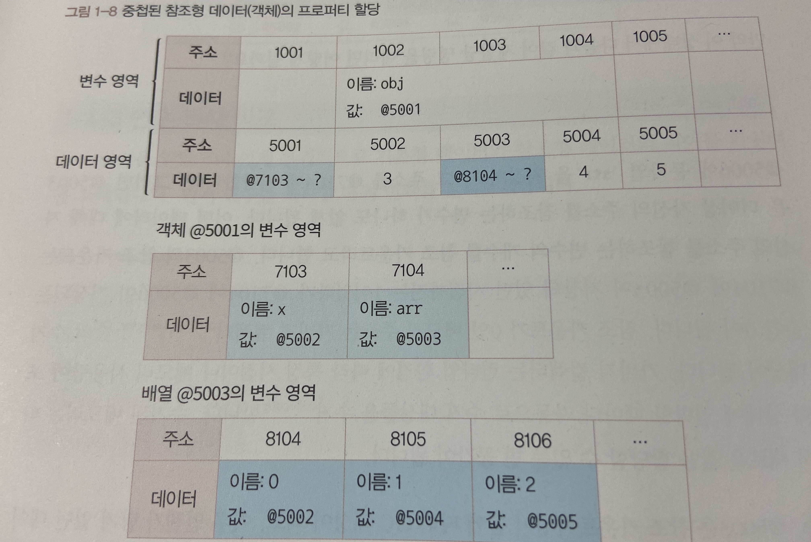
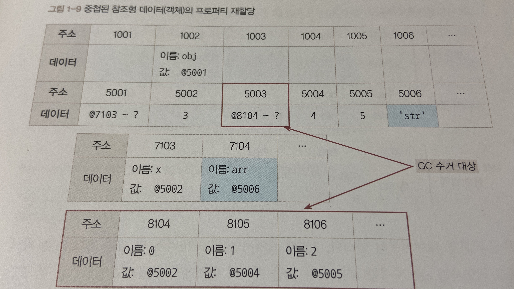
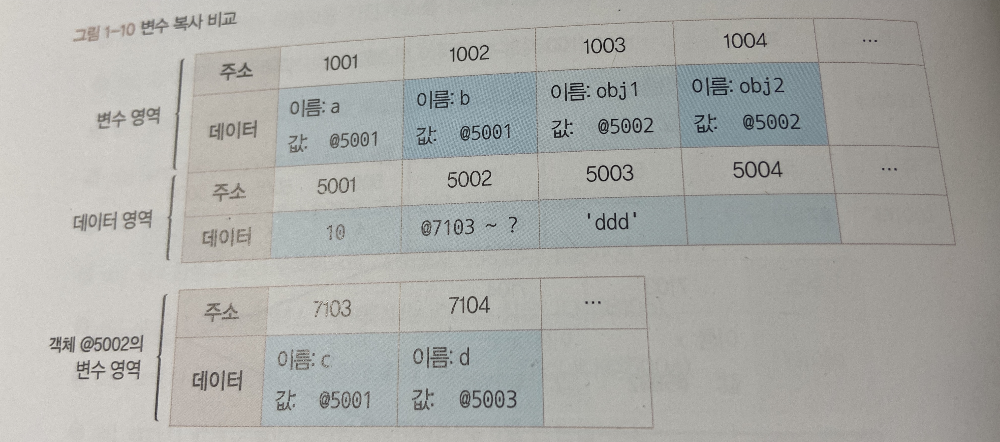
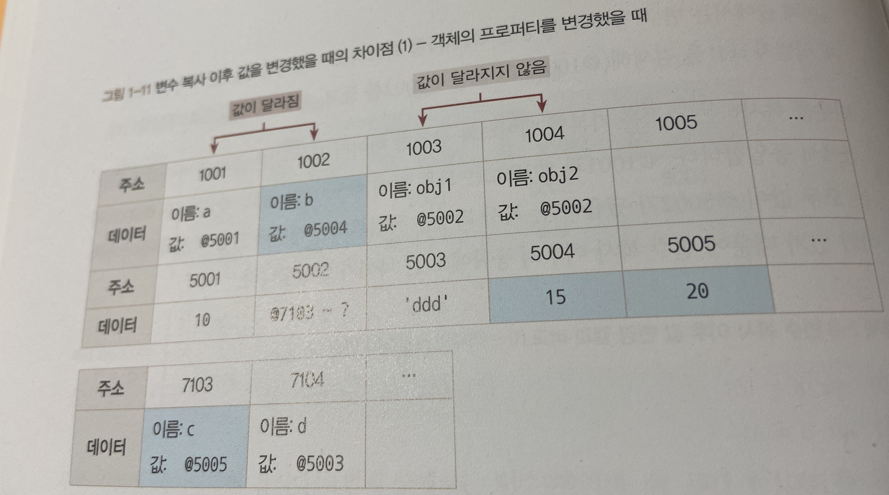

# Data

### `자바스크립트가 데이터를 처리하는 과정을 살펴봄으로써 기본형과 참조형이 다르게 동작하는 이유를 이해하고 활용할 수 있도록 하는 것을 목표`

#### 1. 데이터 타입의 종류

데이터 타입은 크게 기본형(primitive type)과 참조형(reference type)이 있다. 

기본형에는 number, string, boolean, null, undefined 등이 있으며 ES6에 symbol이 추가되었다. 

참조형은 Object, Array, Function, Date, RegExp 등이 있고 ES6에 추가된 Map, WeakMap, Set, WeakSet 등이 객체의 하위 분류에 속한다.

#### *그렇다면 어떤 기준으로 기본형과 참조형을 구분하는 걸까?*

일반적으로 기본형은 할당이나 연산시 복제되고 참조형은 참조된다고 알려져 있다. 사실 둘 모두 복제를 하긴 하지만 ***기본형은 값이 담긴 주솟값을 바로 복제하는 반면 참조형은 값이 담긴 주솟값들로 이루어진 묶음을 가리키는 주솟값을 복제한다는 점이다.***

기본형은 불변성(immutablilty)을 띈다. 불변성을 잘 이해하려면 메모리와 데이터에 대한 지식과 나아가 식별자와 변수의 개념을 구분할 수 있어야 한다.

#### 2. 데이터 타입에 관한 배경지식

**2-1 메모리와 데이터**

0 또는 1로 표현할 수 있는 하나의 메모리 조각을 비트(bit)라고 한다. 각 비트는 고유한 식별자(unique identifier)를 통해 위치를 확인할 수 있는데 0과 1만 표현할 수 있는 비트 단위로 위치를 확인하는 것은 매우 비효율적이다. 대신 ***몇 개씩 묶어 하나의 단위로 여긴다면 표현할 수 있는 값도 늘어나며 검색 시간도 줄일 수 있을 것이다.***

매우 많은 비트를 한 단위로 묶으면 검색 시간을 줄이고 표현할 수 있는 데이터의 개수도 늘어나지만 동시에 낭비되는 비트가 생기기도 한다. 따라서 표현 가능한 개수의 어느 정도 제약이 생기더라도 문제되지 않을 정도의 공간을 묶는 편이 낫다. 이 결과 *바이트(byte)* 가 생겼다. 

1바이트는 8개의 비트로 구성되어 있으며 1바이트는 총 256(2^8)개의 값을 표현할 수 있다. C/C++, 자바 등의 정적 타입 언어는 메모리의 낭비를 최소화하기 위해 데이터 타입별로 할당할 메모리 영역을 2바이트, 4바이트 등으로 나누어 놨다. 예를 들어 2바이트 크기의 정수형 타(short)는 0을 포함해 -32768~ +32768까지의 숫자만 허용된다. 그 이상 또는 이하의 숫자를 입력할 경우 오류가 나거나 잘못된 값이 저장된다.

메모리 용량이 부족하던 시절에는 숫자를 표현하기 위해 형변환을 해주어야 했기에 번거로운 작업이었지만 메모리의 용량이 과거보다 커진 상황에 등장한 자바스크립트는 상대적으로 메모리 관리에 대한 압박에서 자유로워졌다. 숫자의 경우 정수형인지 부동소수형인지 구분하지 않고 64bit 즉, 8byte를 확보한다.

앞서 각 비트는 고유한 식별자를 지닌다고 언급했는데 바이트 또한 시작하는 비트의 식별자로 위치를 파악할 수 있다. 모든 데이터는 바이트 단위의 식별자, 정확하게 ***메모리 주솟값을 통해 서로를 구분하고 연결***할 수 있다.

**2-2 식별자와 변수**

변수는 '변할 수 있는 수'를 뜻한다. 반드시 숫자여야 하는 것은 아니고 컴퓨터 용어에서는  **'변할 수 있는 무언가'** 로 확장되었다. 여기서 '무언가'는 **데이터**를 뜻한다. 숫자, 문자열, 객체, 배열 등 모두 데이터가 된다. **식별자**는 어떤 데이터를 식별하는 데 사용하는 이름 즉, **변수명**이다.

#### 3. 변수 선언과 데이터 할당

**3-1 변수 선언**

```javascript
var a;
```

위 코드는 기본적인 변수 선언식이다.

이를 말로 풀어보면 **"변할 수 있는 데이터를 만든다. 이 데이터의 식별자는 a로 한다"**가 된다. 변할 수 있는 데이터이니 선언할 때는 undefined이더라도 나중에 다른 값으로 바꾸면 된다. 변수란 결국 **변경 가능한 데이터가 담길 수 있는 공간 또는 그릇** 이라고 생각할 수 있다.

위 코드의 명령을 받은 컴퓨터는 메모리에서 비어있는 공간 하나를 확보한다. 이 임의의 공간을 1003번이라고 하고 이름(식별자)을 a라고 지정한다. 여기까지가 변수 선언 과정이다. 이후에 사용자가 a에 접근하고자 하면 컴퓨터는 메모리에서 a라는 이름을 가진 주소를 검색해 해당 공간에 담긴 데이터를 반환할 것이다.

**3-2 데이터 할당**

```javascript
var a;						// 변수 a 선언
a = 'abc'; 				// 변수 a에 데이터 할당

var a = 'abc'; 		// 변수 선언과 할당을 한 문장으로 표현
```

위의 예제처럼 두 문장으로 나누어 명령하든 한 문장으로 명령하든, 자바스크립트 엔진은 결국 같은 동작을 수행한다. 메모리에서 비어있는 공간을 확보하고 그 공간의 이름을 설정하는 선언 과정은 앞서 살펴본 것과 같다. 할당 과정은 a라는 이름을 가진 주소를 검색해서 그곳에 문자열 'abc'를 할당하면 될 것이다.

그런데 실제로는 해당 위치에 문자열 'abc'를 직접 저장하지는 않는다. 데이터를 저장하기 위한 별도의 메모리 공간을 다시 확보해서 문자열 'abc'를 저장하고, 그 주소를 변수 영역에 저장하는 식으로 이루어진다. 

|    변수영역     | **주소** | ...  |   1002   |        1003         |   1004   |   1005   | ...  |
| :-------------: | :------: | :--: | :------: | :-----------------: | :------: | :------: | :--: |
|                 |  데이터  |      |          | 이름: a,  값: @5004 |          |          |      |
| **데이터 영역** | **주소** | ...  | **5002** |      **5003**       | **5004** | **5005** | ...  |
|                 |  데이터  |      |          |                     |  'abc'   |          |      |

>1. 변수 영역에서 빈 공간(@1003)을 확보
>2. 확보한 공간의 식별자를 a로 지정
>3. 데이터 영역의 빈 공간(@5004)에 문자열 'abc'를 저장
>4. 변수 영역에서 a라는 식별자 검색(@1003)
>5. 앞서 저장한 문자열의 주소(@5004)를 @1003의 공간에 대입

#### ***왜 변수 영역에 값을 직접 대입하지 않고 번거롭게 한 단계를 더 거치는 것일까?***

이는 데이터 변환을 자유롭게 할 수 있게 함과 동시에 메모리를 더욱 효율적으로 관리하기 위한 고민의 결과다. 앞서 자바스크립트는 숫자형 데이터에 대해 64bit의 공간을 확보한다고 했다. 반면 문자열은 특별히 정해진 규격이 없다. 한 글자마다 영어는 1byte, 한글은 2byte 등으로 각각 필요한 메모리 용량이 가변적이며 전체 글자 수 역시 가변적이기 때문이다.

**만약 미리 확보한 공간 내에서만 데이터 변환을 할 수 있다면 변환한 데이터를 다시 저장하기 위해서는 '확보된 공간을 변환된 데이터의 크기에 맞게 늘리는 작업'이 선행돼야 할 것이다.** 이처럼 효율적으로 문자열 데이터의 변환을 처리하려면 변수와 데이터를 별도의 공간에 나누어 저장하는 것이 최적이다.

문자열 'abc'의 마지막에 'def'를 추가하려고 하면 컴퓨터는 앞서 'abc'가 저장된 공간에 'abcdef'를 할당하는 대신 문자열을 **새로** 만들어 별도의 공간에 저장하고, 그 주소를 변수 공간에 연결한다. 반대로 'abc'의 마지막 'c'를 제거하라고 해도 새로 만든다. 즉, **기존 문자열에 어떤 변환을 가하든 상관 없이 무조건 새로 만들어 별도의 공간에 저장한다.**

|    변수영역     | **주소** | ...  |   1002   |        1003         |   1004   |   1005   | ...  |
| :-------------: | :------: | :--: | :------: | :-----------------: | :------: | :------: | :--: |
|                 |  데이터  |      |          | 이름: a,  값: @5005 |          |          |      |
| **데이터 영역** | **주소** | ...  | **5002** |      **5003**       | **5004** | **5005** | ...  |
|                 |  데이터  |      |          |                     |  'abc'   | 'abcdef' |      |

다른 예로 500개의 변수를 생성해 모든 변수에 숫자 5를 할당하는 상황을 생각해보자.

각 변수를 별개로 인식하려면 500개의 변수 공간을 확보하는 것은 불가피하다. 그런데 각 변수 공간마다 매번 숫자 5를 할당하려면 숫자형 데이터는 8byte가 필요하므로 총 4000(500 * 8byte)byte가 필요하게 된다. 

그 대신 5를 별도의 공간에 한 번만 저장하고 해당 주소만 입력한다면 어떨까? 예를 들어, 주소 공간의 크기가 2byte라고 한다면 1008(500*2 + 8)byte만 이용하면 된다. 이처럼 변수 영역과 데이터 영역을 분리하면 중복된 데이터에 대한 처리 효율이 높아진다.

#### 4. 기본형 데이터와 참조형 데이터

**4-1 불변값**

변수와 상수를 구분하는 성질은 '변경 가능성'이다. 바꿀 수 있으면 변수, 바꿀 수 없으면 상수다. 불변값과 상수를 같은 개념으로 오해하기 쉬운데 이를 명확히 구분할 필요가 있다. 변수와 상수를 구분 짓는 변경 가능성의 대상은 **변경 가능성** 메모리다. 한 번 데이터 할당이 이뤄진 변수 공간에 다른 데이터를 재할당할 수 있는지 여부가 관건이다. 반면 불변성 여부를 구분할 때의 변경 가능성의 대상은 **데이터 영역** 메모리다.

기본형 데이터인 숫자, 문자열, boolean, null, undefined, Symbol은 모두 불변값이다. 숫자와 문자열을 예로 알아보자.

```javascript
var a = 'abc';
a = a + 'def';

var b = 5;
var c = 5;
b = 7;
```

위 예제의 1~2번째 줄을 보면 변수 a에 문자열 'abc'를 할당했다가 뒤에 'def'를 추가하면 기본의 'abc'가 'abcdef'로 바뀌는 것이 아니라 새로운 문자열 'abcdef'를 만들어 그 주소를 변수 a에 저장한다. 따라서 'abc'와 'abcdef'는 완전히 변개의 데이터가 된다.

4번째 줄에서는 변수 b에 숫자 5를 할당한다. 그러면 컴퓨터는 일단 데이터 영역에서 5를 찾고, 없으면 그제서야 데이터 공간을 하나 만들어 저장한다. 그리고 그 주소를 b에 저장한다. 5번째 줄에서는 다시 같은 수인 5를 할당하려 하는데 컴퓨터는 데이터 영역에서 5를 찾는다. 4번째 줄에서 이미 만들어 놓은 값이 있으니 그 주소를 재활용하게 된다.

6번째 줄에서는 변수 b의 값을 7로 바꾸고자 한다. 그러면 기존에 저장된 5 자체를 7로 바꾸는 것이 아니라 기존에 저장했던 7을 찾아서 있으면 재활용하고, 없으면 새로 만들어서 b에 저장한다. 결국 5와 7 모두 다른 값으로 변경할 수 없다.

이처럼 문자열 값도 한 번 만든 값을 바꿀 수 없고, 숫자 값도 다른 값으로 변경할 수 없다. 변경은 새로 만드는 동작을 통해서만 이뤄진다. 이것이 바로 불변값의 성질이 된다. 한 번 만들어진 값은 가비지 컬렉팅을 당하지 않는 한 영원히 변하지 않는다.

**4-2 가변값**

앞서 **기본형 데이터는 모두 불변값** 이라고 했다. 그렇다면 참조형 데이터는 모두 가변값일까? 결론부터 말하면 **기본적인 성질은 가변값인 경우가 많지만 설정에 따라 변경 불가능한 경우도 있고, 아예 불변값으로 활용하는 방안도 있다.** 먼저 참조형 데이터를 변수에 할당하는 과정부터 확인해보자.

```javascript
var obj1 = {
	a: 1,
  b: 'bbb'
}
```


>1. 컴퓨터는 우선 변수 영역의 빈 공간(@1002)를 확보하고, 그 주소의 이름을 obj1으로 지정
>2. 임의의 데이터 저장곤간(@5001)에 데이터를 저장하려고 보니 여러 개의 프로퍼티로 이루어진 데이터 그룹이다. 이 그룹 내부의 프로퍼티들을 저장하기 위해 별도의 변수 영역을 마련하고, 그 영역의 주소(@7103~?)를 @5001에 저장
>3. @7103 및 @7104에 각각 a와 b라는 프로퍼티 이름을 저장
>4. 데이터 영역에서 숫자 1을 검색하고 검색 결과가 없으므로 임의로 @5003에 저장하고, 이 주소를 @7103에 저장한다. 문자열 'bbb' 역시 임의로 @5004에 저장하고, 이 주소를 @7104에 저장

기본형 데이터와의 차이는 **'객체의 변수(프로퍼티)영역'이 별도로 존재**한다는 점이다. 그림을 자세히 보면 객체가 별도로 할애한 영역은 변수 영역일 뿐 '데이터 영역'은 기존의 메모리 공간을 그대로 활용하고 있다. 데이터 영역에 저장된 값은 모두 불변값이다. 그러나 변수에는 다른 값을 얼마든지 대입할 수 있다. 바로 이 부분 때문에 흔히 참조형 데이터는 immutable하지 않다라고 하는 것이다. 

```javascript
var obj1 = {
	a: 1,
  b: 'bbb'
};
obj1.a = 2;
```

위 코드는 obj1의 a 프로퍼티에 숫자 2를 할당하는 코드다. 위와 같은 명령을 받으면 우선 컴퓨터는 데이터 영역에서 숫자 2를 검색한다. 검색 결과가 없으므로 빈 공간인 @5005에 저장하고, 이 주소를 @7103에 저장한다. 4번째 줄 전과 후에 변수 obj1이 바라보고 있는 주소는 @5001 그대로 변하지 않았다. 즉, '새로운 객체'가 만들어진 것이 아니라 기존의 객체 내부의 값만 바뀐 것이다.


이번에는 참조형 데이터의 프로퍼티에 다시 참조형 데이터를 할당하는 경우르 보자. 이런 경우를 중첩 객체(nested object)라고 한다.

```javascript
var obj = {
  x: 3,
  arr: [3, 4, 5]
};
```

> 1. 컴퓨터는 우선 변수 영역의 빈 공간(@1002)를 확보하고 그 주소의 이름을 obj로 지정
> 2. 임의의 데이터 저장공간(@5001)에 데이터를 저장하려는데, 이 데이터는 여러 개의 변수와 값들을 모아놓은 그룹(객체)다. 이 그룹의 각 변수(프로퍼티)들을 저장하기 위해 별도의 변수 영역을 마련하고(@7103~?) 그 영역의 주소를 @5001에 저장
> 3. @7103에 이름 x, @7104에 이름 arr을 저장
> 4. 데이터 영역에서 숫자 3을 검색하고 없으므로 임의로 @5002에 저장하고, 이 주소를 @7103에 저장
> 5. @7104에 저장할 값은 배열로서 역시 데이터 그룹이다. 이 그룹 내부의 프로퍼티들을 저장하기 위해 별도의 변수 영역을 마련하고(@8104~?) 그 영역의 주소를 @7104에 저장
> 6. 배열의 요소가 총 3개이므로 3개의 변수 공간을 확보하고 각각 인덱스를 부여
> 7. 데이터 영역에서 숫자 3을 검색해서(@5002) 그 주소를 @8104에 저장
> 8. 데이터 영역에 숫자 4가 없으므로 @5004에 저장하고, 이 주소를 @8105에 저장
> 9. 데이터 영역에 숫자 5가 없으므로 @5005에 저장하고, 이 주소를 @8106에 저장



이제 obj.arr[1]을 검색하고자 하면 메모리에서는 다음과 같은 검색 과정을 거치게 된다.

> 1. Obj 검색 1: obj라는 식별자를 가진 주소를 찾는다(@1002)
> 2. Obj 검색 2: 값이 주소이므로 그 주소로 이동(@5001)
> 3. Obj 검색 3: 값이 주소이므로 그 주소로 이동(@7103~?)
> 4. obj.arr 검색 1: arr이라는 식별자를 가진 주소를 찾는다(@7104)
> 5. obj.arr 검색 2: 값이 주소이므로 그 주소로 이동(@5003)
> 6. obj.arr 검색 3: 값이 주소이므로 그 주소로 이동(@8104~?)
> 7. obj.arr[1] 검색 1: 인덱스 1에 해당하는 주소를 찾는다(@8105)
> 8. obj.arr[1] 검색 2: 값이 주소이므로 그 주소로 이동(@5004)
> 9. obj.arr[1] 검색 3: 값이 숫자형 데이터이므로 4를 반환
>
> ***@1002 -> @5001 -> (@7103~?) -> @7104 -> @5003 -> (@8104~?) -> @8105 -> @5004 -> 4 반환***

만약 이 상태에서 다음과 같이 재할당 명령을 내리면 어떻게 될까?

```javascript
obj.arr = 'str';
```

@5006에 'str'을 저장하고, 그 주소를 @7104에 저장한다. 그러면 @5003은 더이상 자신의 주소를 참조하는 변수가 하나도 없게 된다. **어떤 데이터에 대해 자신의 주소를 참조하는 변수의 개수를 참조 카운트라고 한다.** @5003의 참조 카운트는 @7104에 @5003이 저장돼 있던 시점까지 1이었다가 @7104에 @5006이 저장되는 순간 0이 된다. **참조 카운트가 0인 메모리 주소를 가비지 컬렉터(Garbage Collector, GC)의 수거 대상이 된다.** 가비지 컬렉터는 런타임 환경에 따라 특정 시점이나 메모리 사용량이 포화 상태에 임박할 때마다 자동으로 수거 대상들을 수거한다. 그렇게 수거된 메모리는 다시 새로운 값으 할당할 수 있는 빈 공간이 된다.

즉, @5003은 참조 카운트가 0이 됨에 따라 GC 대상이 되고, 이후 언젠가 담겨 있던 데이터인 "@8104~?" 라는 값이 사라진다. 이 과정에서 연쇄적으로 @8104~?의 각 데이터들의 참조 카운트가 0이 되고, 이들 역시 GC의 대상이 되어 사라지게 될 것이다.



**4-3 변수 복사 비교**

동작 방식을 알았으니 본격적으로 기본형 데이터와 참조형 데이터의 차이를 확인해보자. 먼저 변수를 복사할 때의 변화를 살펴보도록 하자.

```javascript
var a = 10;
var b = a;

var obj1 = {c: 10, d: 'ddd'};
var obj2 = obj1;
```



1번째 줄에서는 변수 영역의 빈 공간 @1001을 확보하고 식별자를 a로 지정한다. 숫자 10을 데이터 영역에서 검색하고 없으므로 빈 공간 @5001에 저장한 다음, 이 주소를 @1001에 넣었다. 이로써 기본형 데이터에 대한 변수 선언 및 할당이 종료된다.

이제 복사를 할 차례다. 변수 영역의 빈 공간 @1002를 확보하고 식별자를 b로 지정한다. 이제 식별자 a를 검색해 그 값을 찾아야 하는데 @1001에 저장된 값인 @5001을 들고 좀 전에 확보해둔 @1002에 값으로 대입한다.

3번째 줄에서는 변수 영역의 빈 공간 @1003을 확보해 식별자로 obj1을 지정한다. 데이터 영역의 빈 공간 @5002를 확보하고, 데이터 그룹이 담겨야 하기 때문에 별도의 변수 영역 @7103~?을 확보해 그 주소를 저장한다. @7103에는 식별자 c를 @7104에는 식별자 d를 입력한 다음, c에 대입할 값 10을 데이터 영역에서 검색한다. 10을 @5001에 이미 저장되어 있으므로 이 주소를 @7103에 연결하고, 문자열인 'ddd'는 데이터 영역의 빈 공간에 새로 만들어서 @7104에 연결한다. 여기까지가 참조형 데이터인 객체에 대한 변수 선언 및 할당 과정이다.

4번째 줄에서는 변수 영역의 빈 공간 @1004를 확보하고 식별자를 obj2로 지정한다. 이제 식별자 obj1을 검색해(@1003) 그 값이 @5002를 들고, @1004에 값으로 대입한다.

**변수를 복사하는 과정은 기본형 데이터와 참조형 데이터 모두 같은 주소를 바라보게 되는 점에서 동일하다.** @1001과 @1002는 모두 값이 @5001로 됐고, @1003과 @1004는 값이 모두 @5002가 됐다. 복사 과정은 동일하지만 데이터 할당 과정에서 이미 차이가 있기 떄문에 변수 복사 이후에도 큰 차이가 발생한다. 

```javascript
var a = 10;
var b = a;

var obj1 = {c: 10, d: 'ddd'};
var obj2 = obj1;

b = 15;
obj2.c = 20;
```

6번째 줄에서는 데이터 영역에 아직 15가 없으므로 새로운 공간 5004에 저장하고, 그 주소를 든 채로 변수 영역에서 식별자가 b인 주소를 찾는다. 이렇게 되면 @1002의 값이 @5004가 될 것이다.

7번째 줄에서는 데이터 영역에 아직 20이 없으므로 새로운 공간 @5005에 저장하고, 그 주소를 든 채로 변수 영역에서 obj2를 찾고(@1004), obj2의 값인 @5002가 가리키는 변수 영역에서 다시 c를 찾아(@7103) 그곳에 @5005를 대입한다.



기본형 데이터를 복사한 변수 b의 값을 바꿨더니 @1002의 값이 달라진 반면, 참조형 데이터를 복사한 변수 obj2의 프로퍼티의 값을 바꾸었더니 @1004의 값은 달라지지 않았다. 즉, **변수 a와 b는 서로 다른 주소를 바라보게 됐으나, 변수 obj1과 obj2는 여전히 같은 객체를 바라보고 있는 상태**다. 이를 코드로 표현하면 다음과 같다.

```javascript
a !== b
obj1 === obj2
```

이 결과가 바로 기본형과 참조형 데이터의 가장 큰 차이점이다. 대부분의 자바스크립트 책에서는 '기본형은 값을 복사하고 참조형은 주솟값을 복사한다'고 설명하고 있지만, **사실은 어떤 데이터 타입이든 변수에 할당하기 위해 주솟값을 복사해야 하기 때문에, 엄밀히 따지면 자바스크립트의 모든 데이터 타입은 참조형 데이터일 수 밖에 없다. 다만 기본형은 주솟값을 복사하는 과정이 한 번만 이뤄지고, 참조형은 한 단계를 더 거치게 된다는 차이가 있는 것이다.**

위의 예제는 변수의 값(b)를 직접 변경할 때와 값이 아닌 내부 프로퍼티(obj2.c)를 변경할 때의 결과를 비교한 것이다. 비교 대상의 조건 자체가 다르니 내부 동작도 서로 다를 수 밖에 없지만 같은 조건인 상태에서 비교하면 어떻게 될 지 확인해보도록 하자.

```javascript
var a = 10;
var b = a;

var obj1 = {c: 10, d: 'ddd'};
var obj2 = obj1;

b = 15;
obj2 = {c: 20, d: 'ddd'};
```

이번에는 b의 경우와 마찬가지로 obj2에도 새로운 객체를 할당함으로써 값을 직접 변경했다. 그러면 메모리의 데이터 영역의 새로운 공간에 새 객체가 저장되고 그 주소를 변수 영역의 obj2 위치에 저장하게 된다. 즉, 객체에 대한 변경임에도 값이 달라지는 것을 확인할 수 있다.


**즉, 참조형 데이터가 '가변값'이라고 설명할 때의 '가변'은 참조형 데이터 자체를 변경할 경우가 아니라 그 내부의 프로퍼티를 변경할 때만 성립한다.**

#### 5. 불변 객체

**5-1 불변 객체를 만드는 간단한 방법**

위에서 언급했듯이 참조형 데이터의 '가변'은 데이터 자체가 아닌 내부 프로퍼티를 변경할 때만 성립된다. 데이터 자체를 변경하고자 하면(새로운 데이터를 할당하고자 하면) 기본형 데이터와 마찬가지로 **기존 데이터는 변하지 않는다.** 그렇다면 내부 프로퍼티를 변경할 필요가 있을 때마다 매번 새로운 객체를 만들어 재할당하기로 규칙을 정하거나 자동으로 새로운 객체를 만드는 도구를 활용한다면 객체 역시 불변성을 확보할 수 있을 것이다. 

그렇다면 어떠한 경우에 불변 객체가 필요할까? 예컨데, 값으로 전달받은 객체에 변경을 가하더라도 원본 객체는 변하지 않아야 하는 경우가 종종 발생하는데 이럴때 불변 객체가 필요하다.

```javascript
var user = {
	name: 'Jayhyeok',
  gender: 'male'
};

var changeName = function(user, newName) {
  var newUser = user;
  newUser.name = newName;
  return newUser;
};

var user2 = changeName(user, 'Seol');

if (user !== user) {
  console.log('유저 정보가 변경되었습니다.');
}
console.log(user.name, user2.name); // Jung Jung
console.log(user === user2); // true
```

위 예제는 객체의 가변성으로 인한 문제점을 보여주는 간단한 예시다. 1번째 줄에서 user 객체를 생성하고, 12번째 줄에서 user 객체의 name 프로퍼티를 'Seol'로 바꾸는 함수 changeName 함수를 호출해서 그 결과를 user2 변수에 담았다.

14번째 줄에서 user 변수와 user2 변수가 서로 같지 않다는 조건이 성립하면 15번째 줄의 내용이 출력되겠지만 실제로는 출력없이 통과한다. 17번째 줄에서 두 변수의 name 프로퍼티 모두 'Jung'으로 출력되고, 18번째 줄에서는 두 변수가 서로 동일하다고 나온다.

만약 14번째 줄처럼 정보가 바뀐 시점에 알림을 보내야 한다거나, 바뀌기 전의 정보와 바뀐 후의 정보의 차이를 가시적으로 보여줘야 하는 등의 기능을 구현하려면 위와 같이 작성해서는 안된다. 즉, 변경 전과 후에 서로 다른 객체를 바라보도록 만들어야 한다.

```javascript
var user = {
	name: 'Jayhyeok',
  gender: 'male'
};

var changeName = function(user, newName) {
  return {
    name: newName,
    gender: user.gender
  };
};

var user2 = changeName(user, 'Seol');

if (user !== user) {
  console.log('유저 정보가 변경되었습니다.'); // 유저 정보가 변경되었습니다.
}
console.log(user.name, user2.name); // JaeHyeok Seol
console.log(user === user2); // false
```

changeName 함수가 새로운 객체를 반환하도록 수정했다. 이제 user와 user2는 서로 다른 객체이므로 안전하게 변경 전과 후를 비교할 수 있다. 하지만 아직 미흡한 점이 있다. changeName 함수는 새로운 객체를 만들면서 변경할 필요가 없는 기존의 객체의 프로퍼티(gender)를 하드코딩으로 입력했다. 이런 식으로는 대상 객체에 정보가 많을수록, 변경해야 할 정보가 많을수록 사용자가 입력하는 수고가 늘어날 것이다. 이런 방식보다는 대상 객체의 프로퍼티 개수에 상관없이 모든 프로퍼티를 복사하는 함수를 만드는 편이 더 좋을 것이다.

```javascript
var copyObject = function(target) {
  var result = {};
  for (var prop in target) {
    result[prop] = target[prop];
  }
  return result;
};

/*
이 함수는 프로토타입 체이닝 상의 모든 프로퍼티를 복사하는 점, getter/setter는 복사하지 않는 점, 얕은 복사만을 수행한다는 아쉬운 점이 있지만 이를 해결하려면 함수가 무거워질 수 밖에 없다. 하지만 위 예제에 대해서는 문제가 되지 않으므로 그냥 진행하도록 하자.
*/
```

copyObject는 for in 문법을 이용해 result 객체에 target 객체의 프로퍼티들을 복사하는 함수다. 

```javascript
var copyObject = function(target) {
  var result = {};
  for (var prop in target) {
    result[prop] = target[prop];
  }
  return result;
};

var user = {
  name: 'Jaenam',
  gender: 'male',
};

var user2 = copyObject(user);
user2.name = 'Jung';

if (user !== user2) {
  console.log('유저 정보가 변경되었습니다.'); // 유저 정보가 변경되었습니다.
}
console.log(user.name, user2.name); // Jaenam Jung
console.log(user === user2); // false
```

copyObject함수를 통해 간단하게 객체를 복사하고 내용을 수정하는데 성공했다.

이제부터 user 객체 내부의 변경이 필요할 때는 copyObject 함수를 사용하기로 합의한다는 전제하에서는 user 객체가 곧 불변 객체라고 볼 수 있다.

하지만 이렇게 서로간의 약속을 통해서가 아닌 시스템적으로 제약을 거는 편이 훨씬 안전할 것이다. 이런 맥락에서 immutable.js, immer.js, baobab.js 등의 라이브러리가 등장해서 인기를 끌고 있다. 이 라이브러리들은 자바스크립트 내장 객체가 아닌 라이브러리 자체에서 불변성을 지닌 별도의 데이터 타입과 그에 따른 메서드를 제공한다.

위에서 만든 copyObject는 간단하지만 앞에서 언급했듯이 아쉬운 점이 많다. 무엇보다 '얕은 복사만을 수행한다'는 부분이 가장 아쉬운데, 이 부분을 보완하는 내용을 살펴보자.

**5-2 얕은 복사와 깊은 복사**

얕은 복사(shallow copy)는 바로 아래 단계의 값만 복사하는 방법이고, 깊은 복사(deep copy)는 내부의 모든 값들을 하나하나 찾아서 전부 복사하는 방법이다. 위 예제의 copyObject 함수는 얕은 복사만 수행했다. 이 말은 **중첩된 객체에서 참조형 데이터가 저장된 프로퍼티를 복사할 때 그 주솟값만을 복사한다는 의미**다. 그러면 해당 프로퍼티에 대해 원본과 사본이 모두 동일한 참조형 데이터의 주소를 가리키게 된다. 사본을 바꾸면 원본도 바뀌고 원본을 바꾸면 사본도 바뀐다. 이런 현상(기본형 데이터와 참조형 데이터를 복사할 때의 차이점)은 위에서 살펴본 **1-4-3절 변수 복사 비교** 에서 나타난 현상이다.

```javascript
var copyObject = function(target) {
  var result = {};
  for (var prop in target) {
    result[prop] = target[prop];
  }
  return result;
};

var user = {
  name: 'Jaenam',
  urls: {
    portfolio: 'http://github.com/abc',
    blog: 'http://blog.com',
    facebook: 'http://facebook.com/abc',
  },
};
var user2 = copyObject(user);
user2.name = 'Jung';

console.log(user.name === user2.name); // false

user.urls.portfolio = 'http://portfolio.com';
console.log(user.urls.portfolio === user2.urls.portfolio); // true

user2.urls.blog = '';
console.log(user.urls.blog === user2.urls.blog); // true
```

11번째 줄에서 사본인 user2의 name 프로퍼티를 바꿔도 user의 name 프로퍼티는 바뀌지 않았다. 반면 14번째 줄과 17번째 줄에서는 원본과 사본 중 어느 쪽을 바꾸더라도 다른 한쪽의 값도 함께 바뀐 것을 확인할 수 있다. 즉, user 객체에 직접 속한 프로퍼티에 대해서는 복사해서 완전히 새로운 데이터가 만들어진 반면, 한 단계 더 들어간 urls의 내부 프로퍼티들은 **기존 데이터를 그대로 참조**하는 것이다. 이런 현상이 발생하지 않게 하려면 user.urls 프로퍼티에 대해서도 불변 객체로 만들 필요가 있다.

```javascript
var user2 = copyObject(user);
user2.urls = copyObject(user.urls);

user.urls.portfolio = 'http://portfolio.com';
console.log(user.urls.portfolio === user2.urls.portfolio); // false

user2.urls.blog = '';
console.log(user.urls.blog === user2.urls.blog); // false
```

2번째 줄에서는 urls 프로퍼티에 copyObject 함수를 실행한 결과를 할당했다. 이제 urls 프로퍼티의 내부까지 복사해서 새로운 데이터가 만들어졌으므로 5번째 줄과 8번째 줄에서 값이 서로 다르다는 결과를 얻을 수 있다.

그러니까 어떤 객체를 복사할 때 객체 내부의 모든 값을 복사해서 완전히 새로운 데이터를 만들고자 할 때 , 객체의 프로퍼티 중에서 그 값이 **기본형 데이터일 경우에는 그대로 복사**하면 되지만 **참조형 데이터는 다시 그 내부의 프로퍼티들을 복사**해야 한다. 이 과정을 참조형 데이터가 있을 때마다 재귀적으로 수행해야만 비로소 깊은 복사가 되는 것이다.

이 개념을 바탕으로 copuObject 함수를 깊은 복사 방식으로 고치면 아래와 같다.

```javascript
var copyObjectDeep = function(target) {
  var result = {};
  if (typeof target === 'object' && target !== null) {
    for (var prop in target) {
      result[prop] = copyObjectDeep(target[prop]);
    }
  } else {
    result = target;
  }
  return result;
};
```

3번째 줄에서 target이 객체인 경우에는 내부 프로퍼티들을 순회하며 copyObjectDeep 함수를 재귀적으로 호출하고, 객체가 아닌 경우에는 8번째 줄에서 target을 그대로 지정하게끔 했다. 이 함수를 사용해 객체를 복사한 다음에는 원본과 사본이 서로 완전히 다른 객체를 참조하게 되어 어느 쪽의 프로퍼티를 변경하더라도 다른 쪽에 영향을 주지 않는다.

```javascript
var copyObjectDeep = function(target) {
  var result = {};
  if (typeof target === 'object' && target !== null) {
    for (var prop in target) {
      result[prop] = copyObjectDeep(target[prop]);
    }
  } else {
    result = target;
  }
  return result;
};

var obj = {
  a: 1,
  b: {
    c: null,
    d: [1, 2],
  },
};
var obj2 = copyObjectDeep(obj);

obj2.a = 3;
obj2.b.c = 4;
obj.b.d[1] = 3;

console.log(obj); // { a: 1. b: { c: null, d: [1, 3] } }
console.log(obj2); // { a: 3. b: { c: 4, d: { 0: 1, 1: 2 } } }
```

추가로 `hasOwnProperty` 메서드를 활용해 프로토타입 체이닝을 통해 상속된 프로퍼티를 복사하지 않게끔 할 수도 있다. ES5의 getter/setter를 복사하는 방법은 안타깝게도 ES6의 `Object.getOwnPropertyDescriptor` 또는 ES2017의 `Object.getOwnPropertyDescriptors` 외에는 마땅한 방법이 없다.

깊은 복사를 처리할 수 있는 다른 방법으로는 **객체를 JSON 문법으로 표현된 문자열도 전환했다가 다시 JSON 객체로 바꾸는 것**이다. 이 방법은 단순함에도 잘 동작한다. 다만 메서드(함수)나 숨겨진 프로퍼티인 _proto_나 getter/setter 등과 같이 JSON으로 변경할 수 없는 프로퍼티들은 모두 무시한다. httpRequest로 받은 데이터를 저장한 객체를 복사할때 등 순수한 정보만 다룰때 활용하기 좋은 방법이다. 

```javascript
var copyObjectViaJSON = function(target) {
  return JSON.parse(JSON.stringify(target));
};
var obj = {
  a: 1,
  b: {
    c: null,
    d: [1, 2],
    func1: function() {
      console.log(3);
    },
  },
  func2: function() {
    console.log(4);
  },
};
var obj2 = copyObjectViaJSON(obj);

obj2.a = 3;
obj2.b.c = 4;
obj.b.d[1] = 3;

console.log(obj); // { a: 1. b: { c: null, d: [1, 3], func1: f() }, func2: f() }
console.log(obj2); // { a: 3. b: { c: 4,    d: [1, 2] } }
```

#### 6. undefined와 null

자바스크립트에는 '없음'을 나타내는 값이 두 가지가 있는데 바로 undefined와 null이다. 두 값의 의미는 같은 것 같지만 미세하게 다르고, 사용하는 목적 또한 다르다.

우선 undefined의 경우 사용자가 명시적으로 지정할 수도 있지만 값이 존재하지 않을 때 자바스크립트 엔진이 자동으로 부여하는 경우도 있다. 사용자가 명시적으로 undefined를 지정하는 경우는 달리 덧붙일 내용이 없어 넘어가고, 자바스크립트 엔진이 자동으로 부여하는 경우에 대해 살펴보도록 하자.

자바스크립트 엔진은 사용자가 응당 어떤 값을 지정할 것이라고 예상되는 상황임에도 실제로는 그렇게 하지 않았을 때 undefined를 반환한다. 다음 세 경우가 이에 해당한다.

1. 값을 대입하지 않은 변수, 즉 데이터 영역의 메모리 주소를 지정하지 않은 식별자에 접근할 때
2. 객체 내부의 존재하지 않는 프로퍼티에 접근하려고 할 때
3. return 문이 없거나 호출되지 않은 함수의 실행 결과

```javascript
var a;
console.log(a); // (1) undefined. 값을 대입하지 않은 변수에 접근

var obj = { a: 1 };
console.log(obj.a); // 1
console.log(obj.b); // (2) 존재하지 않는 프로퍼티에 접근
console.log(b); // c.f) ReferenceError: b is not defined

var func = function() {};
var c = func(); // (3) 반환(return)값이 없으면 undefined를 반환한 것으로 간주.
console.log(c); // undefined
```

그런데 위의 [1] 값을 대입하지 않은 경우에 대해 배열의 경우에는 조금 특이한 동작은 확인할 수 있다.

```javascript
var arr1 = [];
arr1.length = 3;
console.log(arr1); // [empty x 3]

var arr2 = new Array(3);
console.log(arr2); // [empty x 3]

var arr3 = [undefined, undefined, undefined];
console.log(arr3); // [undefined, undefined, undefined]
```

1번째 줄에서 빈 배열을 만들고, 2번째 줄에서 배열의 크기를 3으로 하자 3번째 줄에서 [empty x 3]이 출력됐다. 이는 배열에 3개의 빈 요소를 확보했지만 확보된 각 요소에 문자 그대로 어떤 값도, 심지어 undefined 조차도 할당돼 있지 않음을 의미한다.

5번째 줄에서는 new 연산자와 함께 Array 생성자 함수를 호출함으로써 배열 인스턴스를 생성했는데, 이때 배열의 크기를 3으로 지정했다. 6번째 줄에서 출력된 결과는 arr1과 같다. 한편 8번째 줄에서는 리터럴 방식으로 배열을 생성하면서 각 요소에 undefined를 부여했다. 9번째 줄의 출력 결과는 3번째 및 6번째 줄의 경과와 다른 것을 확인할 수 있다.

이처럼 **'비어있는 요소'와 'undefined를 할당한 요소'는 출력 결과부터 다르다. 또한 '비어있는 요소'는 순회와 관련된 많은 배열 메서드들의 순회 대상에서 제외된다.** 

```javascript
var arr1 = [undefined, 1];
var arr2 = [];
arr2[1] = 1;

arr1.forEach(function(v, i) {
  console.log(v, i);
}); // undefined 0 / 1 1
arr2.forEach(function(v, i) {
  console.log(v, i);
}); // 1 1

arr1.map(function(v, i) {
  return v + i;
}); // [NaN, 2]
arr2.map(function(v, i) {
  return v + i;
}); // [empty, 2]

arr1.filter(function(v) {
  return !v;
}); // [undefined]
arr2.filter(function(v) {
  return !v;
}); // []

arr1.reduce(function(p, c, i) {
  return p + c + i;
}, ''); // undefined011
arr2.reduce(function(p, c, i) {
  return p + c + i;
}, ''); // 11
```

예제 arr1은 undefined와 1을 직접 할당한 반면 arr2는 빈 배열의 인덱스 1에 값 1을 할당했다. 이 두 배열은 배열의 각 요소를 순회하는 것을 기본으로 추가적인 기능을 수행하는 메서드들, 즉 `forEach`, ` map`, ` filter`, ` reduce` 등에서 서로 다른 결과를 보인다.

사용자가 직접 undefined를 할당한 arr1에 대해서는 일반적으로 알고 있는 대로 배열의 모든 요소를 순회해서 결과를 출력한다. 그러나 arr2에 대한 결과를 보면, 각 메서드들이 비어 있는 요소에 대해서는 어떠한 처리도 하지 않고 건너뛰었음을 알 수 있다.

이러한 동작이 배열에서만 발견할 수 있는 특별한 현상인 것처럼 얘기했지만, 사실은 '배열도 객체'임을 생각해보면 지극히 자연스러운 현상이다. 존재하지 않는 프로퍼티에 대해서는 순회할 수 없는 것이 당연하기 때문이다. 배열은 무조건 length 프로퍼티의 개수만큼 빈 공간을 확보하고 각 공간의 인덱스를 이름으로 지정할 것이라고 생각하기 쉽지만, 실제로는 객체와 마찬가지로 특정 인덱스에 값을 지정할 때 비로소 빈 공간을 확보하고 인덱스를 이름으로 지정하고 데이터의 주솟값을 저장하는 등의 동작을 한다. 즉, **값이 지정되지 않은 인덱스는 '아직은 존재하지 않는 프로퍼티'에 지나지 않는다는 것**이다.

그렇다면 사용자가 명시적으로 부여한 경우와 비어있는 요소에 접근하려 할 때 반환되는 두 경우의 'undefined'의 의미를 구분할 수 있다. 전자의 undefined의 경우 그 자체로 값이다. undefined가 비록 '비어있음'을 의미하긴 하지만 하나의 값으로 동작하기 때문에 이떄의 프로퍼티나 배열의 요소는 고유의 키값(프로퍼티 이름)이 존재하게 되고, 따라서 순회의 대상이 될 수 있다. 한편 사용자가 아무것도 하지 않은 채로 접근했을 때 자바스크립트 엔진이 하는 수 없이 반환해주는 undefined는 해당 프로퍼티 내지 배열의 키값(인덱스) 자체가 존재하지 않음을 의미한다. **다시 말해, 값으로써 어딘가에 할당된 undefined는 실존하는 데이터인 반면, 자바스크립트 엔진이 반환해주는 undefined는 문자 그대로 값이 없음을 나타내는 것이다.**

> 🔍
>
> 위 [1]의 '값을 대입하지 않은 변수, 즉 데이터 영역의 메모리 주소를 지정하지 않은 식별자에 접근할 때 undefined를 반환한다'는 내용은 다른 자바스크립트 입문서에서 소개하는 내용과는 거리가 있다. 즉 'var a'라는 구문에 의해 식별자 a에 자동으로 undefined가 '할당된다'고 소개하는 것이 일반적이다. 하지만 **자바스크립트가 실제로 그렇게 동작하는 것은 아니다.** 정확히는 아무것도 할당하지 않고 끝나며, 이후 변수 a에 접근하고자 할 때 비로소 undefined를 반환하는 것이 맞다.

헷갈릴 수 있는 내용이지만 직접 undefined만 할당하지 않으면 되는 문제다. 또한 같은 의미를 가진 null이라는 값이 있는데 굳이 undefined를 사용할 이유가 없다. '비어있음'을 명시적으로 나타내고 싶을 때는 undefined가 아닌 null을 사용하면 된다. null은 애초에 이런 용도로 만들어진 데이터 타입이기 때문에 이런 규칙을 따르는 한 undefined는 오직 '**값을 대입하지 않은 변수에 접근하고자 할 때 자바스크립트 엔진이 반환해주는 값**'으로서만 존재할 수 있다.

null을 사용할 때 주의할 점이 있는데 바로 `typeof null`이 `object`라는 점이다. 이는 자바스크립트 자체 버그이기때문에 어떤 변수의 값이 null인지 여부를 판결하기 위해서는 `typeof` 대신 다른 방식으로 접근해야 한다.

```javascript
var n = null;
console.log(typeof n); // object

console.log(n == undefined); // true
console.log(n == null); // true

console.log(n === undefined); // false
console.log(n === null); // true
```

4번째 줄과 같이 동등 연산자(==)로 비교할 경우 null과 undefined가 서로 같다고 판단한다. 따라서 어떤 변수가 실제로 null인지 아니면 undefined인지를 판단할 때는 일치 연산자(===)를 써야만 정확한 비교를 할 수 있다.

#### 7. 정리

- 자바스크립트 데이터 타입은 크게 기본형과 참조형이 있다. 기본적으로 기본형은 불변값이고 참조형은 가변값이다.

- **변수**는 변경 가능한 데이터가 담길 수 있는 공간이고, **식별자**는 그 변수의 이름을 말한다.
- 변수를 선언하면 컴퓨터는 우선 메모리의 빈 공간에 식별자를 저장하고, 그 공간의 값은 undefined를 할당한다. 이후 그 변수에 기본형 데이터를 할당하려고 하면 별도의 공간에 데이터를 저장하고, 그 공간의 주소를 변수의 값 영역에 할당한다.
- 참조형 데이터를 할당하고자 할 경우 컴퓨터는 참조형 데이터 내부 프로퍼티들을 위한 변수 영역을 별도로 확보해서 확보된 주소를 변수에 연결하고, 다시 앞서 확보한 변수 영역에 각 프로퍼티의 식별자를 저장하고, 각 데이터를 별도의 공간(데이터 영역)에 저장해서 그 주소를 식별자들과 매칭시킨다. 이처럼 할당과정에서 기본형과 차이가 생긴 이유는 참조형 데이터가 여러 개의 프로퍼티(변수)를 모은 '그룹'이기 때문이다. 그리고 이 차이로 인해 참조형 데이터를 '가변값'으로 여겨야만 하는 상황이 발생한다.
- 참조형 데이터를 가변값으로 여겨야 하는 상황임에도 이를 불변값으로 사용하는 방법이 없지는 않다. 이 경우 내부 프로퍼티들을 일일이 복사하면 된다(깊은 복사). 혹은 라이브러리를 사용하는 방법도 있다. 불변 객체는 최근 자바스크립트 진영에서 가장 중요한 개념 중 하나다.
- '없음'을 나타내는 값은 두 가지가 있는데, undefined는 어떤 변수에 값이 존재하지 않을 경우를 의미하고 null은 사용자가 명시적으로 '없음'을 표현하기 위해 대입한 값이다. 