# 프로토타입

자바스크립트는 프로토타입(prototype)기반 언어다. 클래스 기반 언어에서는 '상속'을 사용하지만 프로토타입 기반 언어에서는 어떤 객체를 원형(prototype)으로 삼고 이를 복제(참조)함으로써 상속과 비슷한 효과를 얻는다. 유명 프로그래밍 언어의 상당수가 클래스 기반인 것에 비교하면 프로토타입은 꽤나 독특한 개념이라고 할 수 있다.

클래스에 익숙한 많은 개발자들이 자바스크립트를 배척하는 이유로 프로토타입이 어렵고 복잡하다는 점을 들지만, 오히려 자바스크립트는 프로토타입 개념을 제대로 이해하는 것만으로도 이미 숙련자 레벨에 도달할 수 있는 시야를 확보하게 되는 셈이다.

### 1. 프로토타입의 개념 이해

#### 6-1-1 constructor, prototype, instance

먼저 그림부터 보고 시작하자. 이 그림은 7장 클래스까지 반복적으로 등장할 그림이다.

**그림 6-1** 프로토타입 도식(1)

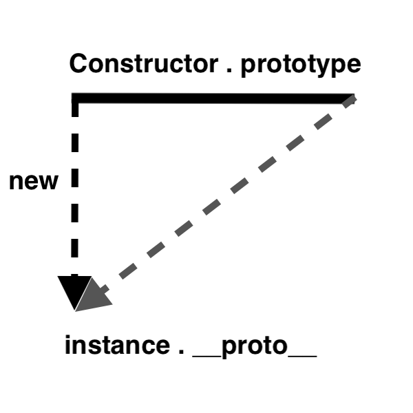

위 그림만 이해하면 프로토타입은 끝이다. 즉, 이 그림으로부터 전체 구조를 파악할 수 있고, 반대로 전체 구조로부터 이 그림을 도출해낼 수 있으면 된다. 위 그림은 사실 아래 코드의 내용을 추상화한 것이다.

```javascript
var instance = new Constructor();
```

위 그림의 윗변(실선)의 왼쪽 꼭지점에는 `Constructor(생성자 함수)` 를, 오른쪽 꼭짓점에는 `Constructor.prototype` 이라는 프로퍼티를 위치시켰다. 왼쪽 꼭짓점으로부터 아래를 향한 화살표 중간에 `new` 가 있고, 화살표의 종점에는 `instance` 가 있다. 오른쪽 꼭짓점으로부터 대각선 아래로 향하는 화살표의 종점에는 `instance.__prototype__` 이라는 프로퍼티를 위치시켰다. 위 코드와 그림을 따라서 흐름을 살펴보면

> - 어떤 생성자 함수(Constructor)를 new 연산자와 함께 호출하면
> - `Constructor` 에서 정의된 내용을 바탕으로 새로운 인스턴스(instance)가 생성된다.
> - 이떄 `instance` 에는 `__proto__` 라는 프로퍼티가 자동으로 부여되는데,
> - 이 프로퍼티는 `Constructor` 의 `prototype` 이라는 프로퍼티를 참조한다.

`prototype` 이라는 프로퍼티와 `__proto__` 라는 프로퍼티가 새로 등장했는데, 이 둘의 관계가 프로토타입 개념의 핵심이다. `prototype` 은 객체다. 이를 참조하는 `__proto__` 역시 당연히 객체다. `prototype` 객체 내부에는 인스턴스가 사용할 메서드를 저장한다. 그러면 인스턴스에서도 숨겨진 프로퍼티인 `__proto__` 를 통해 이 메서드들에 접근할 수 있게 된다.

> ❗️
>
> ES5.1 명세에는 `__proto__` 가 아니라 `[[prototype]]` 이라는 명칭으로 정의돼 있다. `__proto__` 라는 프로퍼티는 사실 부라우저들이 `[[prototype]]` 을 구현한 대상에 지나지 않았다. 명세에는 또 `instance.__proto__` 와 같은 방식으로 직접 접근하는 것은 허용하지 않고 오직 `Object.getPrototypeOf(instance) / Refelect.getPrototypeOf(instance)` 를 통해서만 접근할 수 있도록 정의했었다. 하지만 이런 명세에도 불구하고 대부분의 브라우저들이 `__proto__` 에 직접 접근하는 방식을 포기하지 않았고, 결국 ES6에서 이를 브라우저에서 동작하는 레거시 코드에 대한 호환성 유지 차원에서 정식으로 인정하기에 이르렀다. 다만 어디까지나 브라우저에서의 호환성을 고려한 지원일 뿐 권장되는 방식은 아니며, 브라우저가 아닌 다른 환경에서는 얼마든지 이 방식이 지원되지 않을 가능성이 있다.
>
>  가급적  `__proto__` 를 사용하는 대신 `Object.getPrototypeOf() / Object.create()` 등을 이용하는 것이 권장된다.

예를 들어, `Person` 이라는 생성자 함수의 `prototype`에 `getName` 이라는 메서드를 지정했다고 하자.

**6-1** Person.prototype

```javascript
var Person = function(name) {
  this._name = name;
};
Person.prototype.getName = function() {
  return this._name;
};
```

이제 `Person` 의 인스턴스는 `__proto__` 프로퍼티를 통해 `getName` 을 호출할 수 있다.

```javascript
var carina = new Person('Carina');
carina.__proto__.getName(); // undefined
```

왜냐하면 `instance` 의 `__proto__` 가 `Constructor` 의 `prototype` 을 참조하므로 결국 둘은 같은 객체를 바라보기 때문이다.

```javascript
Person.prototype === carina.__proto__ // true
```

메서드 호출의 결과로 `undefined` 가 나온 점에 주목해보자. 'Carina' 라는 값이 나오지 않은것보다는 '에러가 발생하지 않았다는 점'이 우선이다. **어떤 변수를 실행해 `undefined` 가 나온다는 것은 이 변수가 '호출할 수 있는 함수'에 해당한다는 것을 의미한다.** 만약 실행할 수 없는, 즉 함수가 아닌 다른 데이터 타입이었다면 `TypeError` 가 발생했을 것이다.그런데 값이 에러가 아닌 다른 값이 다왔으니까 `getName`이 실제로 실행됐음을 알 수 있고, 이로부터 `getName` 이 함수라는 것이 입증됐다.

다음으로 함수 내부에서 어떤 값을 반환하는지를 살펴볼 차례다. 위 함수에서는  `this.name` 값을 리턴하는 것으로 보여진다. 그렇다면 `this` 에 원래의 의도와는 다른 값이 할당된 것이 아닐까, 라는 의심을 할 수있다. 이런 의문을 가지로 로그를 출력해보거나 `debugger` 를 지정하는 등으로 의심되는 사항을 하나하나 추적하다 보면 원인을 파악할 수 있을 것이다. 하지만 앞서 상황별로 어떤 값이 `this` 에 할당되는지를 살펴본 바 있다. 이 지식을 바탕으로 디버깅 과정을 거치지 않고도 문제를 파악할 수 있다. 결론부터 말하자면, **문제는 바로 `this` 에 바인딩된 대상이 잘못 지정됐다는 것이다.**

어떤 함수를 '메서드로서' 호출할 때는 메서드명 바로 앞의 객체가 곧 `this` 가 된다고 언급했었다. 그러니까 `thomas.__proto__.getName()` 에서 `getName` 함수 내부에서의 `this` 는 `thomas` 가 아니라 `thomas.__proto__` 라는 객체가 되는 것이다. 이 객체 내부에는 `name` 프로퍼티가 없으므로 '찾고자 하는 식별자가 정의돼 있지 않을 때는 `Error` 대신 `undefined` 를 반환한다' 라는 자바스크립트 규약에 의해 `undefined` 가 반환된 것이다.

그럼 만약 `__proto__` 객체에 `name` 프로퍼티가 있다면 어떨까?

```javascript
var carina = new Person("Carina");
carina.__proto__._name = "Carina__proto__";
carina.__proto__.getName(); // Carina__proto__
```

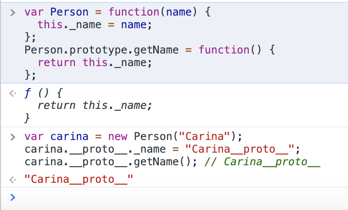

예상대로 "Carina\__proto__" 가 잘 출력되는 것을 확인할 수 있다. 그러니까 관건은 `this` 다. `this` 를 인스턴스로 할 수 있다면 좋을 것이다. 그 방법은 `__proto__` 없이 인스턴스에서 곧바로 메서드를 쓰는 것이다.

```javascript
var carina = new Person("Carina", 22);
carina.getName(); // Carina
var iu = new Person("Jieun", 29);
iu.getName(); // Jieun
```

`__proto__` 을 빼면 `this` 는 `instance` 가 되는 것은 맞지만, 이대로 메서드가 호출되고 심지어 원하는 값이 나오는 건 조금 이상하다고 느낄 수 있다. 이상하지만 의외로 정상인데 그 이유는 바로 `__proto__` 가 **생략 가능한** 프로퍼티이기 때문이다. 원래부터 생략 가능하도록 정의돼 있다. 그리고 이 정의를 바탕으로 자바스크립트 전체 구조가 구성됐다고 해도 과언이 아니다. 그러니까 '생략 가능한 프로퍼티' 라는 개념은 언어를 창시하고 전체 구조를 설계한 브랜든 아이크의 머리에서 나온 아이디러로, 이해의 영역이 아니므로 '그냥 그런가보다' 하는 수 밖에 없다. 이유야 어찌됐든 중요한 것은 **`__proto__` 은 생략이 가능하다** 는 점만 기억하면 된다.

```javascript
carina.__proto__.getName
-> carina.(__proto__).getName
-> carina.getName
```

`__proto__` 를 생략하지 않으면 `this` 는 `carina.__proto__` 를 가리키지만, 이를 생략하면 `carina` 를 가리킨다. `carina.__proto__` 에 있는 메서드인 `getName` 을 실행하지만 `this` 는 `carina` 를 바라보게 할 수 있게 된 것이다. 도식으로 보면 다음과 같다.

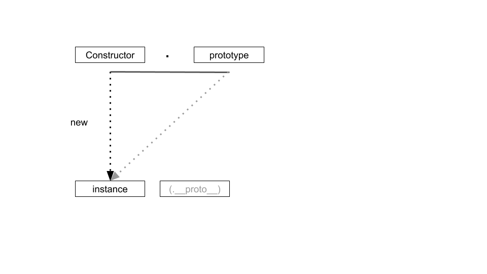

다시 한번 프로토타입에 대해 정의하면 아래와 같이 정의할 수 있다.

**new 연산자로 `Constructor` 를 호출하면 `instance` 가 만들어 지는데, 이 `instance`의 생략 가능한 프로퍼티인 `__proto__` 는 `Constructor` 의 `prototype`을 참조한다.** 

프로토타입의 개념을 좀 더 상세히 설명하면 자바스크립트는 함수에 자동으로 객체인 `prototype` 프로퍼티를 생성해 놓는데, 해당 함수를 생성자 함수로서 사용할 경우, 즉 `new` 연산자와 함께 호출할 경우, 그로부터 생성된 인스턴스에는 숨겨진 프로퍼티인 `__proto__` 가 자동으로 생성되며, 이 프로퍼티는 생성자 함수의 `prototype` 프로퍼티를 참조한다.`__proto__` 프로퍼티는 생략 가능하도록 구현돼 있기 때문에 **생성자 함수의 `prototype`에 어떤 메서드나 프로퍼티가 있다면 인스턴스에서도 마친 자신의 것처럼 해당 메서드나 프로퍼티에 접근할 수 있게 된다.**

**6-2** prototype과 \__proto__

```javascript
var Constructor = function(name) {
  this.name = name;
};
Constructor.prototype.method1 = function() {};
Constructor.prototype.property1 = 'Constructor Prototype Property';

var instance = new Constructor('Instance');
console.dir(Constructor);
console.dir(instance);
```

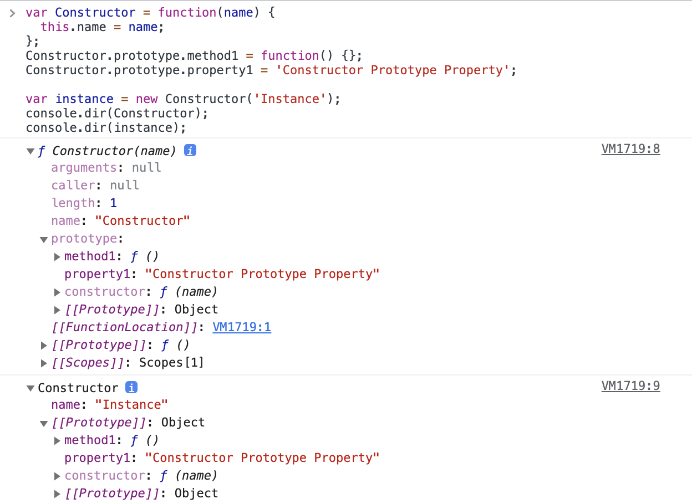

실행 결과를 보면 예제 6-2의 8번째 줄에서 `Constructor` 의 디렉터리 구조를 출력하라고 했다. 출력 결과의 첫 줄에는 함수라는 의미의 `f` 와 함수 이름인 `Constructor` , 인자 `name` 이 보인다. 그 내부에는 옅은 색의 `arguments, caller, length, name, prototype, [[Prototype]], [[Scopes]]` 등의 프로퍼티들이 보인다. `prototype` 을 열어보면 예제 6-2의 4,5번째 중에서 추가한 `method1`, `property1` 등의 값이 짙은 색으로 보이고 `Constructor` , `[[Prototype]]` 등이 옅은 색으로 보인다.

> ❗️
>
> 이런 색상의 차이는 `{ enumerable: false }` 속성이 부여된 프로퍼티인지 여부에 따른다. 짙은색은 enumerable, 즉 열거 가능한 프로퍼티임을 의미하고, 옅은색은 innumerable, 즉 열거할 수 없는 프로퍼티임을 의미한다. `for`, `in` 등으로 객체의 프로퍼티 전체에 접근하고자 할 때 접근 가능 여부를 색상으로 구분지어 표기하는 것이다.

9번째 줄에서는 `instance` 의 디렉터리 구조를 출력하는 문장이 있다. 그런데 출력 결과를 보면 `Constructor` 가 나오고 있는 것을 확인할 수 있다. 어떤 생성자 함수의 인스턴스는 해당 생성자 함수의 이름을 표기함으로써 해당 함수의 인스턴스임을 표기하고 있다. `Constructor` 를 열어보면 `name` 프로퍼티가 짙은 색으로 보이고, `[[Prototype]] == __proto__` 프로퍼티가 옅은 색으로 보인다. 다시 `[[Prototype]]` 을 열어보니 `method1`, `property1` , `constructor`, `__proto__` 등이 보이는 것으로 봐엇 `Constructor` 의 `prototype` 과 동일한 내용으로 구성돼 있음이 확인된다.

이번에는 대표적인 내장 생성자 함수인 `Array` 를 바탕으로 살펴보도록 하자.

```javascript
var arr = [1, 2];
console.dir(arr);
console.dir(Array);
```

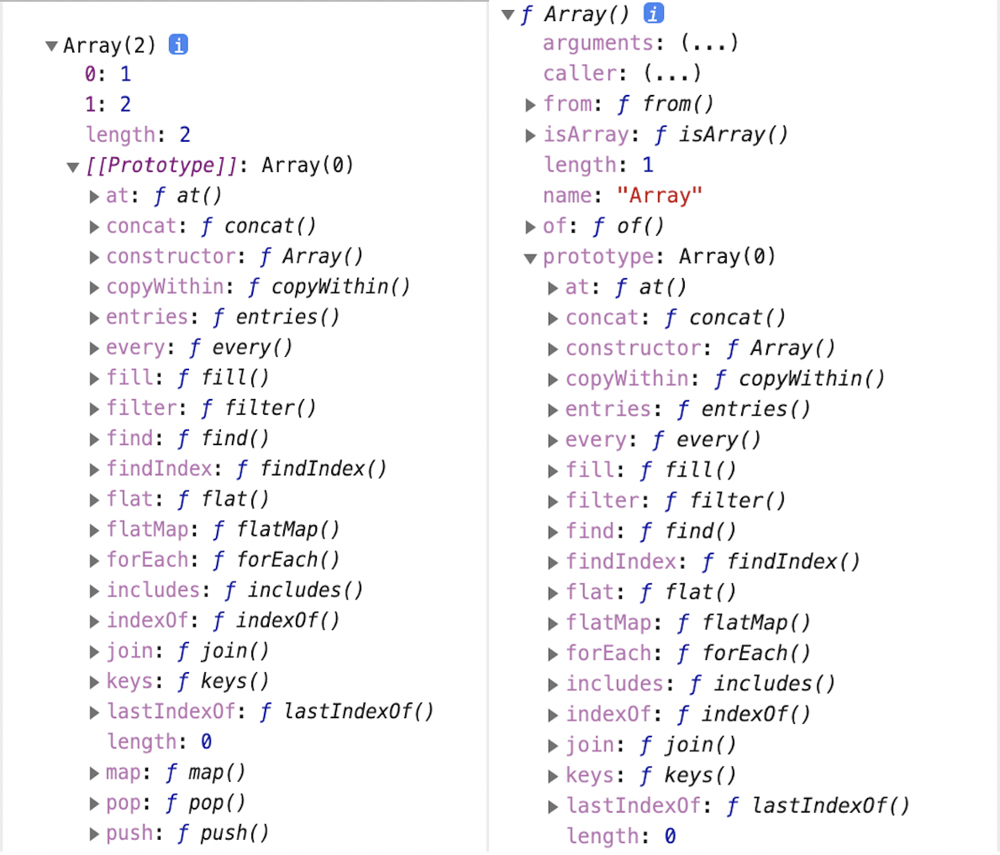

왼쪽은 `arr` 변수를 출력한 결과고, 오른쪽은 생성자 함수인 `Array` 를 출력한 결과다. 왼쪽부터 보면 첫 줄에는 Array(2)라고 표기되고 있다. `Array` 라는 생성자 함수를 원형으로 삼아 생성됐고, `length` 가 2임을 알 수 있다. 인덱스인 0, 1이 짙은 색상으로, `length` 와 `[[Prototype]] == __proto__` 가 옅은 색상으로 표기된다(책에서는 옅은 색상으로 표기되는데 직접 콘솔에서 확인할 때는 짙은 색상으로 확인된다.. 뭐지 ). `[[Prototype]]` 을 열어보니 옅은 색상의 다양한 배열 메서드들이 길게 펼쳐지는 것을 확인할 수 있다.

이제 오른쪽을 보게되면, 첫 줄에는 함수라는 의미의 `f` 가 표시돼 있고, 둘째 줄부터는 함수의 기본적인 프로퍼티들인 `arguments`, `caller`, `length`, `name` 등이 옅은 색으로 보인다.  또한 `Array` 함수의 정적 메서드인 `from`, `isArray`, `of` 등도 보인다. `prototype` 을 열어보니 왼쪽의 `[[Prototype]] == __proto__` 과 완전히 동일한 내용으로 구성돼 있다. 위 출력 결과를 바탕으로 위 그림의 도식을 더욱 구체화하면 다음과 같다.

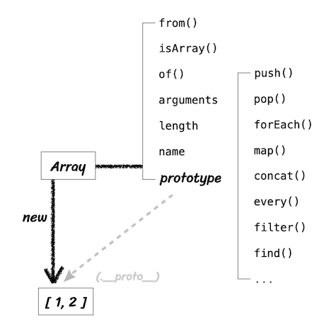

이제 생성자 함수와 `prototype` , 인스턴스 사이의 관계가 명확히 보이는 것 같다. `Array` 를 `new` 연산자와 함께 호출해서 인스턴스를 생성하든, 그냥 배열 리터럴을 생성하든, 어쨌든 `instance` 인 [1, 2]가 만들어진다. 이 인스턴스의 `__proto__` 은 `Array.prototype` 을 참조하는데, `__proto__` 가 생략 가능하도록 설계돼 있기 때문에 인스턴스가 `push`, `pop`, `forEach` 등의 메서드를 마친 자신의 것처럼 호출할 수 있다. 한편 `Array` 의 `prototype` 프로퍼티 내부에 있지 않은 `from`, `isArray`, `of` 등의 메서드들은 인스턴스가 직접 호출할 수 없는 것들이다. 이들은 `Array` 생성자 함수에서 직접 접근해야 실행이 가능하다.

```javascript
var arr = [1, 2];
arr.forEach(function(){}); 	// (0)
Array.isArray(arr);					// (0) true
arr.isArray();							// (x) TypeError: arr.isArray is not a function
```

#### 6-1-2 constructor 프로퍼티

생성자 함수의 프로퍼티인 `prototype` 객체 내부에는 `constructor` 라는 프로퍼티가 있다. 이는 물론 인스턴스의 `__proto__` 객체 내부에도 마찬가지다. 미 프로퍼티는 단어 그대로 원래의 생성자 함수(자기 자신)을 참조한다. 자신을 참조하는 프로퍼티를 굳이 뭐하러 가지고 있을까 싶지만, 이 역시 인스턴스와의 관계에 있어서 필요한 정보다. 인스턴스로부터 그 원형이 무엇인지를 알 수 있는 수단이기 때문이다.

**6-3** constructor 프로퍼티

```javascript
var arr = [1, 2];
Array.prototype.constructor === Array; // true
arr.__proto__.constructor === Array; // true
arr.constructor === Array; // true

var arr2 = new arr.constructor(3, 4);
console.log(arr2); // [3, 4]
```

인스턴스의 `__proto__` 가 생성자 함수의 `prototype` 를 참조하며 `__proto__` 가 생략 가능하기 때문에 인스턴스에서 직접 `constructor` 에 접근할 수 있는 수단이 생긴 것이다. 그러기에 6번째 줄과 같은 명령도 오류 없이 동작하게 된다.

한편 `constructor` 는 읽기 전용 속성이 부여된 예외적인 경우(기본형 리터럴 변수 - `number`, `boolean`, `string` )를 제외하고는 값을 바꿀 수 없다.

**6-4** constructor 변경

```javascript
var NewConstructor = function() {
  console.log('this is new constuctor!');
};
var dataTypes = [
  1, 							// Number & false
  'test', 				// String & false
  true, 					// Boolean & false
  {}, 						// NewConstructor & false
  [], 						// NewConstructor & false
  function() {}, 	// NewConstructor & false
  /test/, 				// NewConstructor & false
  new Number(), 	// NewConstructor & false
  new String(), 	// NewConstructor & false
  new Boolean(), 	// NewConstructor & false
  new Object(), 	// NewConstructor & false
  new Array(), 		// NewConstructor & false
  new Function(), // NewConstructor & false
  new RegExp(), 	// NewConstructor & false
  new Date(), 		// NewConstructor & false
  new Error(), 		// NewConstructor & false
];

dataTypes.forEach(function(d) {
  d.constructor = NewConstructor;
  console.log(d.constructor.name, '&', d instanceof NewConstructor);
});
```

모든 데이터가 `d instanceof NewConstructor` 명령에 대해 `false` 를 반환한다. 이로부터 `constructor` 를 변경하더라도 참조하는 대상이 변경될 뿐 이미 만들어진 인스턴스의 원형이 바뀐다거나 데이터 타입이 변하는 것은 아님을 알 수 있다. 어떤 인스턴스의 생성자 정보를 알아내기 위해 `constructor` 프로퍼티에 의존하는 게 항상 안전하지는 않은 것이다.

비록 어떤 인스턴스로부터 생성자 정보를 알아내느 유일한 수단인 `constructor` 가 항상 안전하지는 않지만 오히려 그렇기 떄문에 클래스 상속을 흉내 내는 등이 가능해진 측면도 있다. 이 내용은 추후에 '클래스' 에서 자세히 다뤄보도록 하자.

정리하는 차원에서 다른 예제도 살펴보도록 하자.

**6-5** 다양한 constructor 접근 방법

```javascript
var Person = function(name) {
  this.name = name;
};
var p1 = new Person('사람1'); 											// Person { name: "사람1" } true
var p1Proto = Object.getPrototypeOf(p1);
var p2 = new Person.prototype.constructor('사람2'); // Person { name: "사람2" } true
var p3 = new p1Proto.constructor('사람3'); 					// Person { name: "사람3" } true
var p4 = new p1.__proto__.constructor('사람4'); 		// Person { name: "사람4" } true
var p5 = new p1.constructor('사람5'); 							// Person { name: "사람5" } true

[p1, p2, p3, p4, p5].forEach(function(p) {
  console.log(p, p instanceof Person);
});
```

`p1` 부터 `p5` 까지 모두 `Person` 의 인스턴스다. 따라서 다음 두 공식이 성립한다.

첫째, 다음 각 줄은 모두 동일한 대상을 가리킨다.

```java
[Constructor]
[instance].__proto__.constructor
[instance].constructor
Object.getPrototypeOf([instance]).construcor
[Constructor].prototype.constructor
```

둘째, 다음 각 줄은 모두 동일한 객체(prototype) 에 접근할 수 있다.

```javascript
[Constructor].prototype
[instance].__proto__
[instance]
Object.getPrototypeOf([instance])
```

### 2. 프로토타입 체인

#### 6-2-1 메서드 오버라이드

`prototype` 객체를 참조하는 `__proto__` 를 생략하면 인스턴스는 `prototype` 에 정의된 프로퍼티나 메서드를 마치 자신의 것처럼 사용할 수 있다고 했다. 그런데 만약 인스턴스가 동일한 이름의 프로퍼티 또는 메서드를 가지고 있는 상황이라면 어떨까?

**6-6** 메서드 오버라이드

```javascript
var Person = function(name) {
  this.name = name;
};
Person.prototype.getName = function() {
  return this.name;
};

var iu = new Person('지금');
iu.getName = function() {
  return '바로 ' + this.name;
};
console.log(iu.getName()); // 바로 지금
```

`iu.__proto__.getName` 이 아닌 `iu` 객체에 있는 `getName` 메서드가 호출됐다. 당연한 결과인 것 같지만 의외로 혼란스러울 수 있는 상황이다. 여기서 일어난 현상을 메서드 오버라이드라고 한다. 메서드 위에 메서드를 덮어씌웠다는 표현이다. 원본을 제거하고 다른 대상으로 교체하는 것이 아니라 원본이 그대로 있는 상태에서 다른 대상을 그 위에 얹는 이미지를 떠올리면 된다.

자바스크립트 엔진이 `getName` 이라는 메서드를 찾는 방식은 가장 가까운 대상인 자신의 프로퍼티를 검색하고 없으면 그다음으로 가까운 대상인 `__proto__` 를 검색하는 검색하는 순서로 진행된다. 그러니까 `__proto__` 에 있는 메서드는 자신에게 있는 메서드보다 검색순서에서 밀려 호출되지 않으 것이다. 앞 문단에서 '교체'가 아니라 '얹는' 이미지라고 말했는데, 이 둘을 구분할 필요가 있다. 교체하는 형태라면 원본에는 접근할 수 없는 형태가 되겠지만 얹는 형태라면 원본이 아래에 유지되고 있으니 원본에 접근할 수 있는 방법도 있을 것이다. 그렇다면 메서드 오버라이딩이 이뤄져 있는 상황에서 `prototype` 에 있는 메서드에 접근하려면 어떻게 하면 될까?

```javascript
console.log(iu.__proto__.getName()); // undefined
```

`iu.__proto__.getName()` 를 호출했더니 `undefined` 가 출력됐다. `this` 가 `prototype` 객체(iu.\__proto__)를 가리키는데 `prototype` 상에는 `name` 프로퍼티가 없기 떄문이다. 만약 `prototype` 에 `name` 프로퍼티가 있다면 그 값을 출력할 것이다.

```javascript
Person.prototype.name = '이지금';
console.log(iu.__proto__.getName()); // 이지금
```

원하는 메서드(`prototype` 에 있는 `getName` )가 호출되고 있다는 게 확인됐다. 다만 `this` 가 `prototype` 을 바라보고 있는데 그걸 인스턴스를 바라보도록 바꿔주면 될 것이다. 이는 `call` 이나 `apply` 를 사용하면 해결이 된다.

```javascript
console.log(iu.__proto__.getName.call(iu)); // 지금
```

즉 일반적으로 메서드가 오버라이드된 경우에는 자신으로부터 가장 가까운 메서드에만 접근할 수 있지만, 그다음으로 가까운 `__proto__` 의 메서드도 우회적인 방법을 통해서이긴 하지만 접근이 불가능한 것은 아니다.

#### 6-2-2 프로토타입 체인

프로토타입 체인을 설명하기에 앞서 이번에는 객체의 내부 구조를 살펴보자

```javascript
console.dir({a: 1});
```

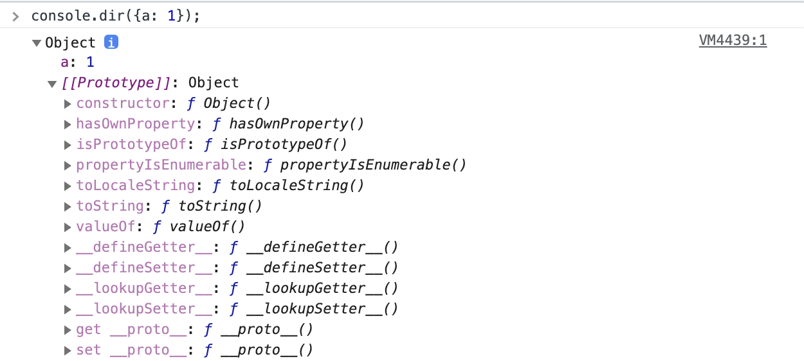

첫 줄을 통해 `Object` 의 인스턴스임을 알 수 있고, 프로퍼티 a의 값 1이 보이고, `__proto__ == [[Prototype]]` 내부에는 `hasOwnProperty`, `isPrototypeOf`, `toLocaleString`, `toString`, `valueOf` 등의 메서드가 보인다. `constructor` 는 생성자인 `Object` 를 가리키고 있다.

이번에는 다시 한 번 배열의 구조를 살펴보자. `__proto__` 내부의 다양한 메서드들을 생략하고 나머지 부분 위주로 표기했다.

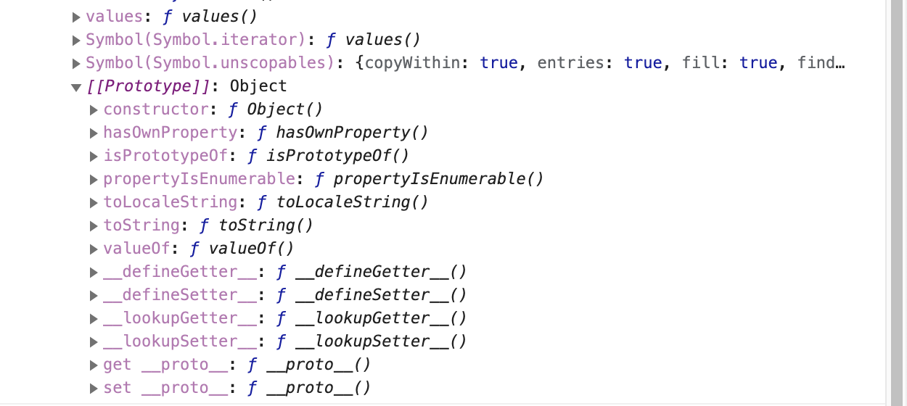

배열 리터럴 `__proto__` 에는 `pop`, `push` 등의 익숙한 배열 메서드 및 `constructor` 가 있다는 것은 이미 알아봤었고, 추가로, 이 `__proto__` 안에는 또다시 `__proto__` 가 등장한다. 열어보니 이전 그림에서 살펴본 객체의 `__proto__` 와 동일한 내용으로 이뤄져 있는 것을 확인할 수 있다. 이는 바로 `prototype` 객체가 '객체'이기 때문이다. 기본적으로 모든 객체의 `__proto__` 에는 `Object.prototype` 이 연결된다. `prototype` 객체도 예외가 아니다. 이를 그림으로 표현하면 다음과 같다.

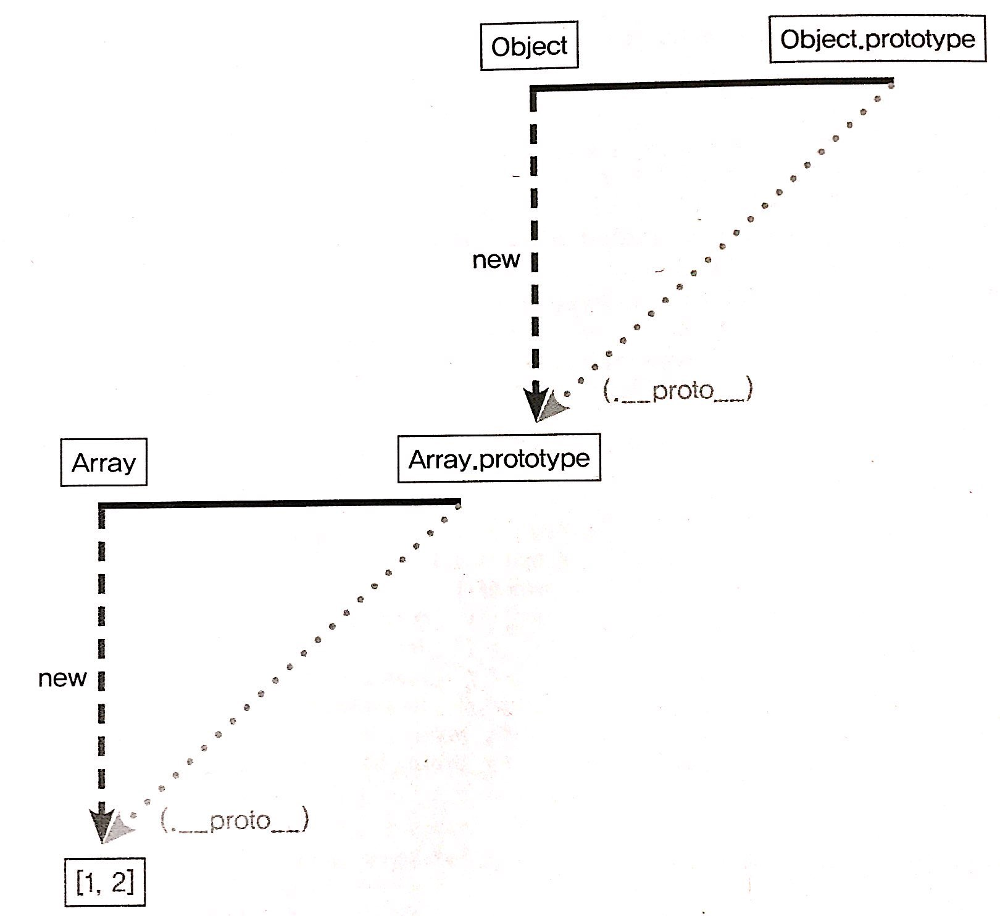

`__proto__` 생략이 가능하다고 했다. 그렇기 때문에 배열리 `Array.__proto__` 내부의 메서드를 마치 자신의 것처럼 실행할 수 있다. 마찬가지로 `Object.prototype` 내부의 메서드도 자신의 것처럼 실행할 수 있다. 생략 가능한 `__proto__` 를 한 번 더 따라가면 `Object.prototype` 을 참조할 수 있기 때문이다.

**6-7** 배열에서 배열 메서드 및 객체 메서드 실행

```javascript
var arr = [1, 2];
arr.push(3);
arr.hasOwnProperty(2); // true
```

어떤 데이터의 `__proto__` 프로퍼티 내부에 다시 `__proto__` 프로퍼티가 연쇄적으로 이어진 것을 프로토타입 체인(prototype chain)이라 하고, 이 체인을 따라가며 검색하는 것을 프로토타입 체이닝(prototype chaining)이라 한다.

프로토타입 체이닝은 6-2절에서 소개한 메서드 오버라이드와 동일한 맥락이다. 어떤 메서드를 호출하면 자바스크립트 엔진은 데이터 자신의 프로퍼티들을 검색해서 원하는 메서드가 있으면 그 메서드를 실행하고, 없으면 `__proto__` 를 검색해서 있으면 그 메서드를 실행하고, 없으면 다시 `__proto__` 를 검색해서 실행하는 식으로 진행한다.

**6-8** 메서드 오버라이드와 프로토타입 체이닝

```javascript
var arr = [1, 2];
Array.prototype.toString.call(arr); // 1,2
Object.prototype.toString.call(arr); // [object Array]
arr.toString(); // 1,2

arr.toString = function() {
  return this.join('_');
};
arr.toString(); // 1_2
```

`arr` 변수는 배열이므로 `arr.__proto__` 는 `Array.prototype` 을 참조하고, `Array.prototype` 은 객체이므로 `Array.prototype.__proto__` 는 `Object.prototype` 을 참조할 것이다. `toString` 이라는 이름을 가진 메서드는 `Array.prototype` 뿐만 아니라 `Object.prototype` 에도 있다. 이 둘 중 어떤 값이 출력되는지를 확인하기 위해 우선 2, 3 번째 줄에서 `Array`, `Object` 의 각 프로토타입에 있는 `toString` 메서드를 `arr` 에 적용했을 때의 출력값을 미리 확인해 봤다. 4번째 줄에서 `arr.toString` 을 실행했더니 결과가 `Array.prototype.toString` 을 적용한 것과 동일하다. 6번쨰 줄에서는 `arr` 에 직접 `toString` 메서드를 부여했다. 이제 9번째 줄에서는 `Array.prototype.toString` 이 아닌 `arr.toString` 이 바로 실행될 것이다.

비단 배열만이 아니라, 자바스크립트 데이터는 모두 아래 그림처럼 동일한 형태의 프로토타입 체인 구조를 지닌다.

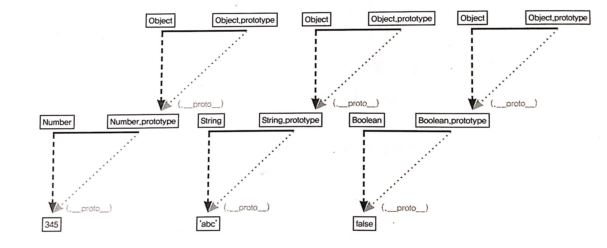

#### 6-2-3 객체 전용 메서드의 예외사항

어떤 생성자 함수이든 `prototype` 은 반드시 객체이기 때문에 `Object.prototype` 이 언제나 프로토타입 체인의 최상단에 존재하게 된다. 따라서 객체에서만 사용할 메서드는 다른 여느 데이터 타입처럼 프로토타입 객체 안에 정의할 수가 없다. 객체에서만 사용할 메서드를 `Object.prototype` 내부에 정의한다면 다른 데이터 타입도 해당 메서드를 사용할 수 있게 되기 때문이다.

**6-9** `Object.prototype` 에 추가한 메서드에서의 접근

```javascript
Object.prototype.getEntries = function() {
  var res = [];
  for (var prop in this) {
    if (this.hasOwnProperty(prop)) {
      res.push([prop, this[prop]]);
    }
  }
  return res;
};
var data = [
  ['object', { a: 1, b: 2, c: 3 }], // [["a",1], ["b", 2], ["c",3]]
  ['number', 345], // []
  ['string', 'abc'], // [["0","a"], ["1","b"], ["2","c"]]
  ['boolean', false], // []
  ['func', function() {}], // []
  ['array', [1, 2, 3]], // [["0", 1], ["1", 2], ["2", 3]]
];
data.forEach(function(datum) {
  console.log(datum[1].getEntries());
});
```

위 예제의 1번째 줄에서는 객체에서만 사용할 의도로 `getEntries` 라는 메서드를 만들었다. 18번째 줄의 `forEach` 에 따라 11번째 줄부터 16번째 줄의 각 데이터마다 `getEntries` 를 실행해 보니, 모든 데이터가 오류 없이 결과를 반환하고 있다. 원래 의도대로라면 객체가 아닌 다른 데이터 타입에 대해서는 오류를 던지게끔 돼야 할 텐데, 어느 데이터 타입이건 거의 무조건 프로토타입 체이닝을 통해 `getEntries` 메서드에 접근할 수 있으니 그렇게 동작하지 않는 것이다.

이 같은 이유로 객체만을 대상으로 동작하는 객체 전용 메서드들은 부들이 `Object.prototype` 이 아닌 `Object` 에 스태틱 메서드(static method)로 부여할 수 밖에 없었다. 또한 생성자 함수인 `Object` 와 인스턴스인 객체 리터럴 사이에는 `this` 를 통한 연결이 불가능하기 때문에 여느 전용 메서드처럼 '메서드명 앞의 대상이 곧 `this`' 가 되는 방식 대신 `this` 의 사용을 포기하고 대상 인스턴스를 인자로 직접 주입해야 하는 방식으로 구현돼 있다.

만약 객체 전용 메서드에 대해서도 다른 데이터 타입과 마찬가지의 규칙을 적용할 수 있다면, 예를 들어 `Object.freeze(instance)` 의 경우 `instance.freeze()` 처럼 표현할 수 있었을 것이다. 그러니까 `instance.__proto__` (생성자 함수의 prototype)에 `freeze` 라는 메서드가 있었을 것이다. 또한 앞서 말한 `Object.getPrototypeOf(instance)` 의 경우에도 `instance.getPrototype()` 정도로 충분했을 것이다. 객체 한정 메서드들은 `Object.prototype` 이 아닌 `Object` 에 직접 부여할 수 밖에 없었던 이유를 다시 얘기하면, `Object.prototype` 이 여타의 참조형 데이터뿐 아니라 기본형 데이터조차 `__proto__` 에 반복 접근함으로써 도달할 수 있는 최상위 존재이기 때문이다.

반대로 같은 이유에서 `Object.prototype` 에는 어떤 데이터에서도 활용할 수 있는 범용적인 메서드들만 있다. `toString`, `hasOwnProperty`, `valueOf`, `isPrototypeOf` 등은 모든 변수가 마치 자신의 메서드인 것처럼 호출할 수 있다.

> ❗️
>
> 앞서 '프로토타입 체인상 가장 마지막에는 언제나 `Object.prototype` 이 있다'고 했는데, 예외적으로 `Object.create` 를 사용하면 `Object.prototype` 의 메서드에 접근할 수 없는 경우가 있다. `Object.create(null)` 은 `__proto__` 가 없는 객체를 생성한다.
>
> ```javascript
> var _proto = Object.create(null);
> _proto.getValue = function(key) {
> 	return this[key];
> }
> var obj = Object.create(_proto);
> obj.a = 1;
> console.log(obj.getValue('a'));  // 1
> console.dir(obj);
> ```
>
> 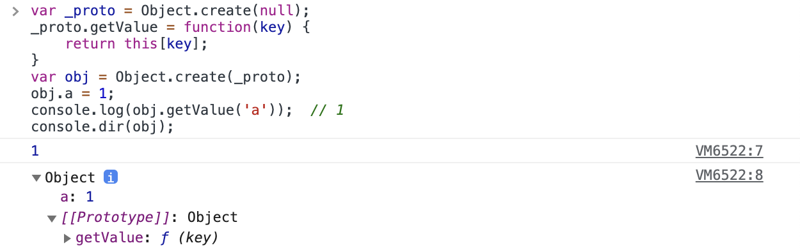
>
> \_proto에는 \__proto\__ 프로퍼티가 없는 객체를 할당했다. 다시 obj는 앞서 만든 \_proto 를 \__proto__로 하는 객체를 할당했다. 이제 obj를 출력해보면,     \_proto\_ 에는 오직 getValue 메서드만 존재하며, \__proto\_ 및 constructor 프로퍼티는 보이지 않는다. 이 방식으로 만든 객체는 일반적인 데이터에서 반드시 존재하던 내장 메서드 및 프로퍼티들이 제거됨으로써 기본 기능에 제약이 생긴 대신 객체 자체의 무게가 가벼워짐으로써 성능상의 이점을 가진다.

#### 6-2-4 다중 프로토타입 체인

자바스크립트의 기본 내장 데이터 타입들은 모두 프로토타입 체인이 1단계(객체)이거나 2단계(나머지)로 끝나는 경우만 있었지만 사용자가 새롭게 만드는 경우에는 그 이상도 얼마든지 가능하다. 대각선의 `__proto__` 를 연결해나가기만 하면 무한대로 체인 관계를 이어나갈 수 있다. 이 방법으로부터 다른 언어의 클래스와 비슷하게 동작하는 구조를 만들 수도 있다.

대각선의 `__proto__` 를 연결하는 방법은 `__proto__` 가 가리키는 대상, 즉 생성자 함수의 `prototype` 이 연결하고자 하는 상위 생성자 함수의 인스턴스를 바라보게끔 해주면 된다. 말로는 설명이 어려우니 예제를 통해 알아보자.

```javascript
var Grade = function() {
  var args = Array.prototype.slice.call(arguments);
  for (var i = 0; i < args.length; i++) {
    this[i] = args[i];
  }
  this.length = args.length;
};
var g = new Grade(100, 80);
```

변수 `g` 는 `Grade` 의 인스턴스를 바라본다. `Grade` 의 인스턴스는 여러 개의 인자를 받아 각 순서대로 인덱싱해서 저장하고  `length` 프로퍼티가 존재하는 등으로 배열의 형태를 지니지만, 배열의 메서드를 사용할 수 는 없는 유사배열객체다. 일전에 유사배열객체에 배열 메서드를 적용하는 방법으로 `call/apply` 를 소개했지만, 이번에는 생성자 함수를 직접 만들었기에 인스턴스에서 배열 메서드를 직접 쓸 수 있게끔 해보자. 그러기 위해서는 `g.__proto__`, 즉 `Grade.prototype` 이 배열의 인스턴스를 바라보게 하면 된다.

```javascript
Grade.prototype = [];
```

이 명령에 의해 아래 그림과 같이 서로 별개로 분리돼 있던 데이터가 연결되어 프로토 타입 체인 형태를 띄게 된다.

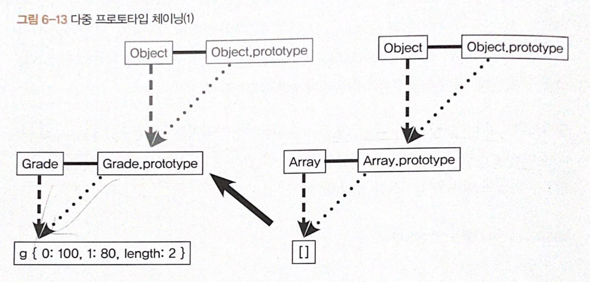

​																													⬇️ 

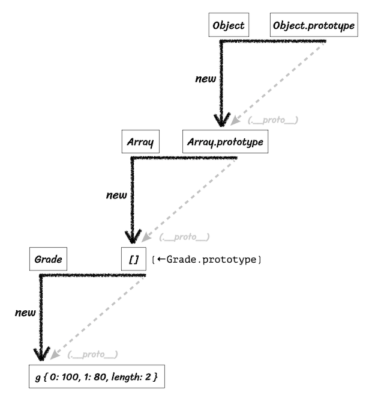

이제 `Grade` 의 인스턴스인 `g` 에서 직접 배열의 메서드를 사용할 수 있다.

```javascript
console.log(g); // Grage(2) [100, 80]
g.pop();
console.log(g); // Grade(1) [100]
g.push(90);
console.log(g); // Grade(2) [100,90]
```

`g` 인스턴스의 입장에서는 프로토타입 체인에 따라 `g` 객체 자신이 지니는 멤버, `Grade` 의 `prototype` 에 있는 멤버, `Array.prototype` 에 있는 멤버, 끝으로 `Object.prototype` 에 있는 멤버에까지 접근할 수 있게 됐다. 

이번 절은 '두 단계 이상의 체인을 지니는 다중 프로토타입 체인'도 가능하다를 확인하는 것에 목적을 두었고 이렇게 하는 이유는 7장에서 살펴보도록 하자.

### 3. 정리

- 어떤 생성자 함수를 `new` 연산자와 함께 호출하면 `Constructor` 에서 정의된 내용을 바탕으로 새로운 인스턴스가 생성되는데, 이 인스턴스에는 `__proto__` 라는,  `Constructor` 의 `prototype` 프로퍼티를 참조하는 프로퍼티가 자동으로 부여된다. `__proto__` 는 생략 가능한 속성이라서, 인스턴스는 `Constructor.prototype` 의 메서드를 마치 자신의 메서드인 것처럼 호출할 수 있다.
- `Constructor.prototype` 에는 `constructor` 라는 프로퍼티가 있는데, 이는 다시 생성자 함수 자신을 가리킨다. 이 프로퍼티는 인스턴스가 자신의 생성자 함수가 무엇인지 알고자 할 때 필요한 수단이다.
- 직각삼각형의 대각선 방향, 즉 `__proto__` 방향을 계속 찾아가면 최종적으로는 `Object.prototype` 에 도달하게 된다. 이런 식으로 `__proto__` 안에 다시 `__proto__` 를 찾아가는 과정을 프로토타입 체이닝이라고 하며, 이 프로토타입 체이닝을 통해 각 프로토타입 메서드를 자신의 것처럼 호출할 수 있다. 이때 접근 방식은 자신으로부터 가장 가까운 대상부터 점차 먼 대상으로 나아가며, 원하는 값을 찾으면 검색을 중단한다.
- `Object.prototype` 에 모든 데이터 타입에서 사용할 수 있는 범용적인 메서드만이 존재하며, 객체 전용 메서드는 여는 데이터 타입과 달리 `Object` 생성자 함수에 스태틱하게 담겨있다.
- 프로토타입 체인은 반드시 2단계로만 이뤄지는 것이 아니라 무한대의 단계를 생성할 수 있다. 