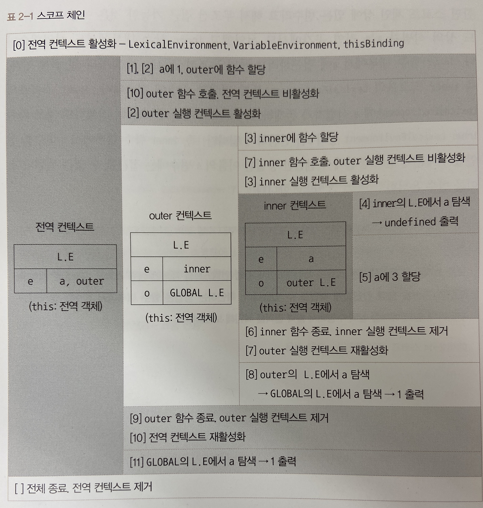
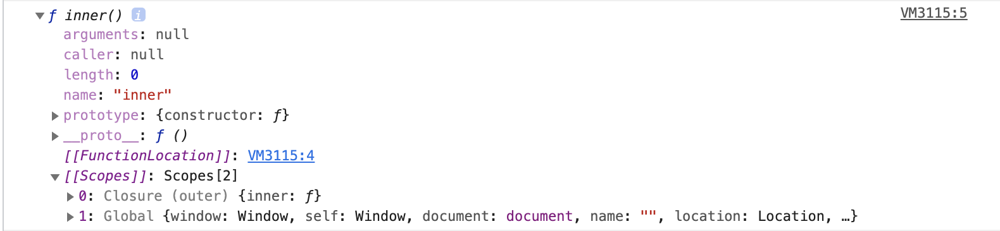
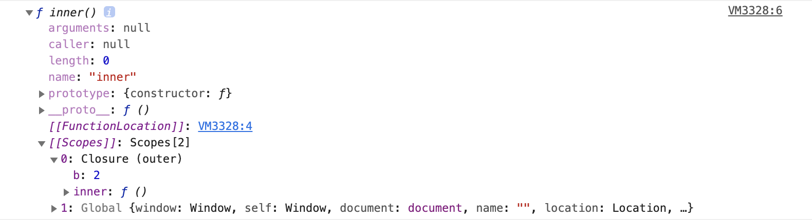
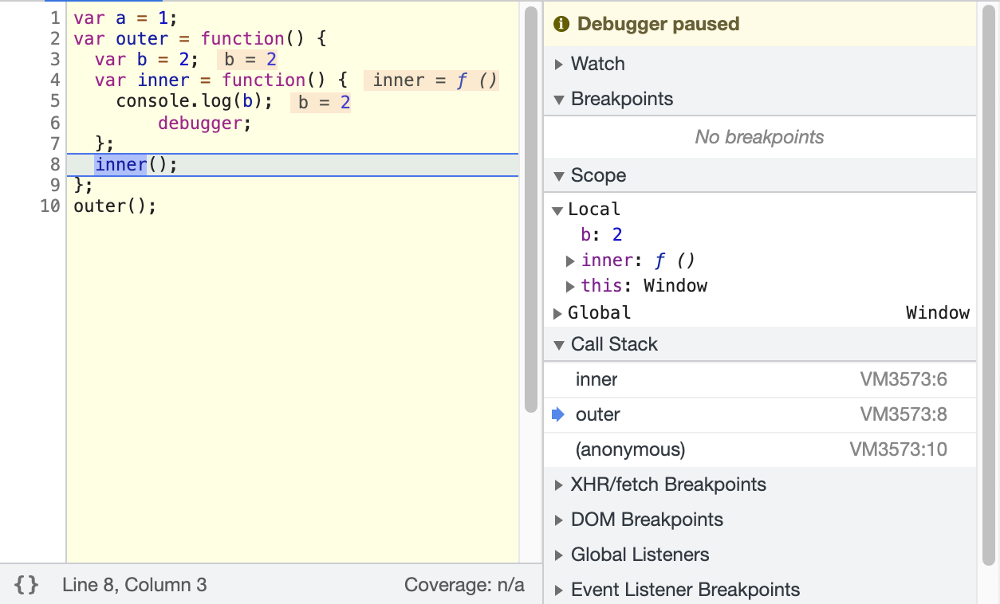

# 실행 컨텍스트

**실행 컨텍스트는(execution context)는 실행할 코드에 제공할 환경 정보를 모아놓은 객체**로, 자바스크립트의 동적 언어로서의 개념을 가장 잘 파악할 수 있는 개념이다. 자바스크립트는 어떤 실행 컨텍스트가 활성화되는 시점에 선언된 변수를 위로 끌어올리고(호이스팅), 외부 환경 정보를 구성하고, `this` 값을 설정하는 등의 동작을 수행하는데, 이로 인해 다른 언어에서는 발생할 수 없는 특이한 현상들이 발생한다.

#### 1. 실행 컨텍스트란?

앞서 실행 컨텍스트를 **실행할 코드에 제공할 환경 정보들을 모아놓은 객체**라고 했다. 동일한 환경에 있는 코드들을 실행할 때 필요한 환경 정보들을 모아 컨텍스트를 구성하고, 이를 콜 스택에 쌓아올려다가, 가장 위에 쌓여있는 컨텍스트와 관련 있는 코드들을 실행하는 식으로 전체 코드의 환경과 순서를 보장한다. 여기서 '동일한 환경', 즉 하나의 실행 컨텍스트를 구성할 수 있는 방법으로 전역공간, `eval()` 함수, 함수 등이 있다. 자동으로 생성되는 전역공간과 악마로 취급받는 `eval` 을 제외하면 흔히 실행 컨텍스트를 구성하는 방법은 **함수를 실행**하는 것뿐이다. 

```javascript
// -------------------------- (1)
var a = 1;
function outer() {
  function inner() {
    console.log(a); // undefined
    var a = 3;
  }
  inner(); // ------------ (2)
  console.log(a); // 1
}
outer(); // ---------------- (3)
console.log(a); // 1
```


위 그림과 같이 처음 자바스크립트 코드를 실행하는 순간(1) 전역 컨텍스트가 콜 스택에 담긴다. 전역 컨텍스트라는 개념ㅇ은 일반적인 실행 컨텍스트와 특별히 다를 것이 없다. 최상단의 공간은 코드 내부에서 별도의 실행 명령이 없어도 브라우저에서 자동으로 실행하므로 자바스크립트 파일이 열리는 순간 전역 컨텍스트가 활성화된다고 이해하면 된다.

어찌됐든 콜 스택에는 전역 컨텍스트 외에 다른 덩어리가 없으므로 전역 컨텍스트와 관련된 코드들을 순차로 진행하다가 (3)에서 outer 함수를 호출하면 자바스크립트 엔진은 outer에 대한 환경 정보를 수집해서 outer 실행 컨텍스트를 생성한 후 콜 스택에 담는다. 콜 스택의 맨 위에 outer 실행 컨텍스트가 놓인 상태가 됐으므로 전역 컨텍스트와 관련되 코드의 실행을 일시중단하고 대신 outer 실행 컨텍스트와 관련된 코드, 즉 outer 함수 내부의 코드들을 순서대로 실행한다.

그렇게 되면 다시 (2)에서 inner 함수의 실행 컨텍스트가 콜 스택의 가장 위에 담기면 outer 컨텍스트와 관련된 코드의 실행을 중단하고 inner 함수 내부의 코드를 순서대로 진할 것이다.

Inner 함수 내부에서 a 변수의 값을 출력하고 나면 inner 함수의 실행이 종료되면서 inner 실행 컨텍스트가 콜 스택에서 제거된다. 그러면 아래에 있던 outer 컨텍스트가 콜 스택의 맨 위에 존재하게 되므로 중단했던 (2)의 다음 줄부터 이어서 실행한다(`console.log(a)`). a 변수의 값을 출력하고 나면 outer 함수의 실행이 종료되어 outer 실행 컨텍스트가 콜 스택에서 제거되고, 콜 스택에는 전역 컨텍스트만 남아 있게 된다. 그런 다음, 실행을 중단했던 (3)의 다음 줄부터 이어서 실행한다. a 변수의 값을 출력하고 나면 전역 공간에 더는 실행할 코드가 남아 있지 않아 전역 컨텍스트도 제거되고, 콜 스택에는 아무것도 남지 않은 상태로 종료된다.

스택 구조를 잘 생각해보면 한 실행 컨텍스트가 콜 스택의 맨 위에 쌓이는 순간이 곧 현재 실행할 코드에 관여하게 되는 시점임을 알 수 있다. 기존의 컨텍스트는 새로 쌓인 컨텍스트보다 아래에 위치할 수 밖에 없기 때문이다. 이러헤 어떤 실행 컨텍스트가 활성화될 때 자바스크립트 엔진은 해당 컨텍스트에 관련된 코드들을 실행하는 데 필요한 환경 정보들을 수집해서 실행 컨텍스트 객체에 저장한다. 이 객체는 자바스크립트 엔진이 활용할 목적으로 생성할 뿐 개발자가 코드를 통해 확인할 수는 없다. 여기에 담기는 정보는 다음과 같다.

- VariableEnviroment: 현재 컨텍스트 내의 식별자들에 대한 정보 + 외부 환경 정보 선언 시점의 LexicalEnvironment의 스냅샷으로 변경사항은 반영되지 않음
- LexicalEnvironment: 처음에는 VaraiableEnviroment와 같지만 변경 사항이 실시간으로 반영됨.
- ThisBinding: this 식별자가 바라봐야 할 대상 객체


#### 2. VaraiableEnviroment

VariableEnviroment에 담기는 내용은 LexicalEnvironment와 같지만 최초 실행 시의 스냅샷을 유지한다는 점이 다르다. 실행 컨텍스트를 생성할 때 VariableEnviroment에 정보를 먼저 담은 다음, 이를 그대로 복사해서 VariableEnviroment를 만들고, 이후에는 LexicalEnvironment를 주로 활용하게 된다.

VariableEnviroment와 LexicalEnvironment의 내부에서 environmentRecord와 outerEnvironmentReference로 구성돼 있다. 초기화 과정 중에는 사실상 완전히 동일하고 이후 코드 진행에 따라 서로 달라지게 될 것이므로 자세한 내용은 LexicalEnvironment를 통해 알아보도록 하자.

#### 3. LexicalEnvironment

LexicalEnvironment에 대한 한국어 번역은 문서마다 제각각 다른데 '어휘적 환경', '정적 환경'이라는 단어가 많이 등장한다. '어휘적'은 lexical을 영어사전에 대입하여 치환한 것이고, '정적'이라는 말은 수시로 변하는 환경 정보를 의미하는 LexicalEnvironment에 대한 적절한 번역이라고 할 수 없다고 말한다. 필자는 이보다 '사전적인'이 더욱 어울리는 표현이라고 말하고 있다. 즉, "현재 컨텍스트 내부에는 a, b, c와 같은 식별자들이 있고 그 외부 정보는 D를 참조하도록 구성돼 있다"라는, 컨텍스트를 구성하는 환경 정보들을 사전에서 접하는 느낌으로 모아놓은 것이다.

**3-1 environmentRecord와 호이스팅**

environmentRecord에는 현재 컨텍스트와 관련된 코드의 식별자 정보들이 저장된다. 컨텍스트를 구성하는 함수에 지정된 매개변수 실벽자, 선언한 함수가 있을 경우 그 함수 자체, var로 선언된 변수의 식별자 등이 식별자에 해당된다. 컨텍스트 내부 전체를 처음부터 끝까지 쭉 풅어나가면 **순서대로** 수집한다.

변수 정보를 수집하는 과정을 모두 마쳤더라도 아직 실행 컨텍스트가 관여할 코드들은 실행되기 전의 상태다. 코드가 실행되기 전임에도 불구하고 자바스크립트 엔진은 이미 해당 환경에 속한 코드의 변수명들을 모두 알고 있게 되는 셈이다. 그렇다면 엔진의 실제 동작 방식 대신에 '자바스크립트 엔진은 식별자들을 최상단으로 끌어올려놓은 다음 실제 코드를 실행한다'라고 생각하더라도 코드를 해석하는 데는 문제될 것이 전혀 없을 것이다. 

여기서 호이스팅(hoisting)이라는 개념이 등장한다. 호이스팅이란 '끌어올리다'라는 의미의 hoist와 ing를 붙여 만든 동명사로, 변수 정보를 수집하는 과정을 더욱 이해하기 쉬운 방법으로 대체한 가상의 개념이다. 자바스크립트 엔진이 실제로 끌어올리지는 않지만 편의상 끌어올린 것으로 간주하자는 것이다.

**호이스팅 규칙**

앞서 environmentRecord에는 매개변수의 이름, 함수 선언, 변수명 등이 담긴다고 했다. 

```javascript
function a(x) {
  // 수집 대상 1(매개변수)
  console.log(x); // (1)
  var x; // 수집 대상 2(변수 선언)
  console.log(x); // (2)
  var x = 2; // 수집 대상 3(변수 선언)
  console.log(x); // (3)
}
a(1);
```

우선 호이스팅이 되지 않았을 때, (1), (2), (3)에서 어떤 값들이 출력될지를 예상해 보자. 아마 (1)에는 매개변수로 전달한 1이 출력될 것이고, (2)에는 undefined, (3)에는 2가 출력될 것 같다. 이제 실제로는 어떤 값이 나오고 왜 그렇게 되는지 알아보도록 하자.

> ❗️
>
> 지금부터는 자바스크립트 엔진의 구동 방식을 좀 더 사람의 입장에서 이해해보고자 코드를 몇 차례 변경할 것이다. 실제 엔진은 이러한 변환 과정을 거치지 않는다는 것에 주의해야 한다.

위 예제처럼 인자들과 함께 함수를 호출한 경우의 동작을 살펴보면, arguments에 전달된 인자를 담는 것을 제외하면 다음의 예제 코드처럼 코드 내부에서 변수를 선언한 것과 다름이 없다. 특히 LexicalEnvironment 입장에서는 완전히 같다. 그러니까 인자를 함수 내부의 다른 코드보다 먼저 선언 및 할당이 이뤄진 것으로 간주할 수 있다.

```javascript
function a() {
  var x = 1; // 수집 대상 1(매개변수 선언)
  console.log(x); // (1)
  var x; // 수집 대상 2(변수 선언)
  console.log(x); // (2)
  var x = 2; // 수집 대상 3(변수 선언)
  console.log(x); // (3)
}
a();
```

이 상태에서 변수를 수집하는 과정, 즉 호이스팅을 처리해보자. environmentRecord는 현재 실행될 컨텍스트의 대상 코드 내에 어떤 식별자들이 있는지에만 관심이 있고, 각 식별자에 어떤 값이 할당될 것인지는 관심이 없다. 따라서 변수를 호이스팅할 때 변수명만 끌어올리고 할당 과정은 원래 자리에 그대로 남겨둔다. 매개변수의 경우도 마찬가지다. environmentRecord의 관심사에 맞춰 수집 대상 1, 2, 3을 순서대로 끌어올리고 나면 다음과 같은 형태로 바뀐다.

```javascript
function a() {
  var x; // 수집 대상 1의 변수 선언 부분
  var x; // 수집 대상 2의 변수 선언 부분
  var x; // 수집 대상 3의 변수 선언 부분

  x = 1; // 수집 대상 1의 할당 부분
  console.log(x); // (1)
  console.log(x); // (2)
  x = 2; // 수집 대상 3의 할당 부분
  console.log(x); // (3)
}
a(1);
```

이제 호이스팅이 끝났으니 실제 코드를 실행할 차례다(스코프체인 수집 및 this 할당 과정은 추후 논의할 예정)

- 2번째 줄: 변수 x를 선언한다. 이때 메모리에서는 저장할 공간을 미리 확보하고, 확보한 공간의 주솟값을 변수 x에 연결해둔다.
- 3번째 줄과 4번째 줄: 다시 변수 x를 선언한다. 이미 선언된 변수 x가 있으므로 무시한다.
- 6번째 줄: x에 1을 할당하라고 한다. 우선 숫자 1을 별도의 메모리에 담고, x와 연결된 메모리 공간에 숫자 1을 가리키는 주솟값을 입력한다.
- 7번째 줄과 8번째 줄: 각 x를 출력하라고 한다. (1) (2) 모두 1이 출력된다.
- 9번째 줄: x에 2를 할당하라고 한다. 숫자 2를 별도의 메모리에 담고, 그 주솟값을 든 채로 x와 연결된 메모리 공간으로 간다. 여기에는 숫자 1을 가리키는 주솟값이 들어있었는데, 이걸 2의 주솟값으로 대치한다. 이제 변수 x는 숫자 2를 가리키게 된다.
- 10번째 줄: x를 출력하라고 하니 (3)에서는 2가 출력되고, 이제 함수 내부의 모든 코드가 실행됐으므로 실행 컨텍스트가 콜 스택에서 제거된다.

나는 처음에 (1) 1, (2) undefined, (3) 2가 출력될 것이라고 예상했는데, 실제로는 (1) 1, (2) 1, (3) 2라는 결과가 나왔다. (2)에서 undefined가 아닌 1이 출력된다는 건 호이스팅 개념을 정확히 이해하지 못하면 예측하기 어려운 결과다.

함수 선언을 추가한 예제를 하나 더 살펴보자.

```javascript
function a() {
  console.log(b); // (1)
  var b = 'bbb'; // 수집 대상 1(변수 선언)
  console.log(b); // (2)
  function b() {} // 수집 대상 2(함수 선언)
  console.log(b); // (3)
}
a();
```

마찬가지로 출력 결과를 예상해보면 (1)에는 b값이 없으니 에러가 나거나 undefined가 할당이 되고 (2) 'bbb' (3) b함수 가 출력될 것 같다. 실제로 어떻게 출력이 되는지 확인해보면 a함수를 실행하는 순간 a 함수의 실행 컨텍스트가 생성된다. 이때 변수명과 함수 선언의 정보를 위로 끌어올린다(수집). 변수는 선언부와 할당부를 나누어 선언부만 끌어올리는 반면 함수는 함수 전체를 끌어올린다.  수집대상을 끌어올리고 나면 아래와 같은 형태로 변한다.

```javascript
function a() {
  var b; // 수집 대상 1. 변수는 선언부만 끌어올립니다.
  function b() {} // 수집 대상 2. 함수 선언은 전체를 끌어올립니다.

  console.log(b); // (1)
  b = 'bbb'; // 변수의 할당부는 원래 자리에 남겨둡니다.
  console.log(b); // (2)
  console.log(b); // (3)
}
a();
```

해석의 편의를 위해 한 가지만 더 바꿔보자. 호이스팅이 끝난 상태에서의 함수 선언문은 함수명으로 선언한 변수에 함수를 할당한 것처럼 여길 수 있다.

```javascript
function a() {
  var b;
  var b = function b() {}; // ← 바뀐 부분

  console.log(b); // (1)
  b = 'bbb';
  console.log(b); // (2)
  console.log(b); // (3)
}
a();
```

코드를 실행시켜 보면

- 2번째 줄: 변수 b를 선언한다. 이때 메모리에서는 저장할 공간을 미리 확보하고, 확보한 공간의 주솟값을 b에 연결해 둔다.
- 3번째 줄: 다시 변수 b를 선언하고 함수 b를 선언된 변수 b에 할당하려고 한다. 이미 선언된 변수 b가 있으므로 선언과정은 무시한다. 함수는 별도의 메모리에 담길 것이고, 그 함수가 저장된 주솟값을 b와 연결된 공간에 저장한다. 이때 b는 함수를 가리키게 된다.
- 5번째 줄: 변수 b에 할당된 함수 b를 출력한다.
- 6번째 줄: 변수 b에 'bbb'를 할당하라고 한다. b와 연결된 메모리 공간에서 함수가 저장된 주솟값이 담겨있었는데 이걸 문자열 'bbb'가 담긴 주솟값으로 덮어쓴다. 이제 변수 b는 문자열 'bbb'를 가리키게 된다.
- 7번째 줄과 8번째 줄: (2)와 (3) 모두 'bbb'가 출력되고, 이제 함수 내부의 모든 코드가 실행됐으므로 실행 컨텍스트가 콜 스택에서 제거된다.

앞선 예제와 마찬가지로 호이스팅을 고려하지 않은 상태에서 예상한 값들과는 전혀 다른 값들이 출력되는 것을 확인할 수 있다.

**함수 선언문과 함수 표현식**

함수 선언문(function declaration)과 함수 표현식(function expression)이다. 둘 모두 함수를 새롭게 정의할 때 쓰이는 방식인데, 그중 함수 선언문은 function 정의부만 존재하고 별도의 할당 명령이 없는 것을 의미하고, 반대로 함수 표현식은 정의한 function을 별도의 변수에 할당하는 것을 말한다.

함수 선언문의 경우 반드시 함수명이 정의돼 있어야 하는 반면, 함수 표현식은 없어도 된다. 함수명을 정의한 함수 표현식을 '기명 함수 표현식', 정의하지 않은 것을 '익명 함수 표현식'이라고 부르기도 하는데, 일반적으로 함수 표현식은 익명 함수 표현식을 말한다.

```javascript
function a() {
  /* ... */
} // 함수 선언문. 함수명 a가 곧 변수명.
a(); // 실행 OK.

var b = function() {
  /* ... */
}; // (익명) 함수 표현식. 변수명 b가 곧 함수명.
b(); // 실행 OK.

var c = function d() {
  /* ... */
}; // 기명 함수 표현식. 변수명은 c, 함수명은 d.
c(); // 실행 OK.
d(); // 에러!
```

예제를 통해 함수 선언문과 함수 표현식의 실질적인 차이를 살펴보자.

```javascript
console.log(sum(1, 2));
console.log(multiply(3, 4));

function sum(a, b) {
  // 함수 선언문 sum
  return a + b;
}

var multiply = function(a, b) {
  // 함수 표현식 multiply
  return a * b;
};
```

실행 컨텍스트의 LexicalEnvironment는 두 가지 정보를 수집하는데, 여기서는 그중에서 environmentRecord의 정보 수집 과정에서 발생하는 호이스팅을 살펴보는 중이다. 이제는 중간 과정을 생략하고 호이스팅을 마친 최종 상태를 바로 확인해보자.

```javascript
var sum = function sum(a, b) {
  // 함수 선언문은 전체를 호이스팅합니다.
  return a + b;
};
var multiply; // 변수는 선언부만 끌어올립니다.
console.log(sum(1, 2));
console.log(multiply(3, 4));

multiply = function(a, b) {
  // 변수의 할당부는 원래 자리에 남겨둡니다.
  return a * b;
};
```

함수 선언문은 전체를 호이스팅한 반면 함수 표현식은 변수 선언부만 호이스팅했다. 함수도 하나의 값으로 취급할 수 있다는 것이 바로 이런 것이다. 함수를 다른 변수에 값으로써 '할당'한 것이 곧 함수 표현식이다. 여기서 바로 함수 선언문과 함수 표현식의 극적인 차이가 발생한다.

코드를 실행시켜보면

- 1번째 줄: 메모리 공간을 확보하고 확보된 공간의 주솟값을 변수 sum에 연결시킨다.
- 4번째 줄: 또 다른 메모리 공간을 확보하고 확보된 공간의 주솟값을 변수 multiply에 연결시킨다.
- 1번째 줄(다시): sum 함수를 또 다른 메모리 공간에 저장하고, 그 주솟값을 앞서 선언한 변수 sum의 공간에 할당한다. 이로써 변수 sum은 함수 sum을 바라보는 상태가 된다.
- 5번째 줄: sum을 실행한다. 정상적으로 3이 출력될 것이다.
- 6번째 줄: 현재 multiply에는 값이 할당돼 있지 않다. 비어있는 대상을 함수로 여겨 실행하라고 명령한 것이다. 따라서 'multiply is not a function'이라는 에러 메세지가 출력되고 뒤의 8번째 줄은 에러로 인해 실행되지 않고 런타임이 종료된다.

sum 함수는 선언 전에 호출해도 아무 문제 없이 실행된다. 어떻게 작성해도 오류를 내지 않는다는 면에서 자바스크립트를 좀 더 쉽게 접근할 수 있게 해주는 측면도 있지만, 큰 혼란의 원인이 되기도 한다.

예를 들어보자.

개발자 JS가 sum 함수를 선언했다. 인자 두 개를 받아 두 인자의 합을 반환하는 단순한 함수다. 이 함수가 거대한 자바스크립트 파일 내의 100번째 줄에 위치한다고 가정해보자. A는 이 함수를 여기저기서 호출해서 잘 활용해 왔다. 그런데 어느날 새로 입사한 React가 같은 파일의 5000번째 줄에서 sum 함수를 새로 선언했다고 하자. x, y를 받아 가독성 좋게 문자열로 "x + y = (x+y)"를 반환하는 함수다. 자바스크립트를 잘 모르는 React는 본인이 작성한 sum 함수가 선언한 위치인 5000번째 줄 이후에만 영향을 줄 것이라고 굳게 믿고 별다른 테스트를 거치지 않은 채 커밋하고 머지하여 배포까지 끝냈다고 해버렸다.

```javascript
...
console.log(sum(3, 4)); // 60번째 줄
...
function sum(x, y) { // 100번째 줄
  return x + y;
}
...
var a = sum(1, 2); // 200번째 줄
...
function sum(x, y) { // 5000번째 줄
  return x + ' + ' + y + ' = ' + (x + y);
}
...
var c = sum(1, 2); // 5010번째 줄
console.log(c); // 5011번째 줄
...
```

전역 컨텍스트가 활성활될 때 전역공간에 선언된 함수들이 모두 가장 위로 끌어올려진다. **동일한 변수명에 서로 다른 값을 할당한 경우 나중에 할당한 값이 먼저 할당한 값을 덮어씌운다(override).** 따라서 코드를 실행하는 중에 실제로 호출되는 함수는 오직 마지막에 할당한 함수, 즉 맨 마지막에 선언된 함수뿐이다. JS가 의도했던 함수는 숫자로 된 결과값을 반환하는 것이었는데 실제로는 전혀 다른 문자열을 반환하게 된다. 여기저기서 문제가 생기고 있는데 정작 문제의 원인이 되는 sum 함수(React가 선언한 sum 함수)는 아무런 에러를 내지 않는다. 

심지어 sum 함수의 결과를 활용하는 다른 함수에서도 숫자 대신 문자열을 넘겨받았음에도 심지어 sum 함수의 결과를 활용하는 다른 함수에서도 숫자 대신 문자열을 넘겨받았음에도 암묵적 형변환에 따라 (잘못된 값일지라도) 오류 없이 통과된다. 문제는 전혀 생뚱맞은 곳에서 터졌고 문제가 된 함수를 살펴봐도 뭐가 문제인지 도통 알 수가 없게 된다.

만약 JS와 React 모두 함수 표현식으로 sum 함수를 정의했다면 어땠을까? 5000번째 줄 이전까지는 JS의 의도대로, 5000번째 줄 이후부터는 React의 의도대로 잘 동작했을 것이다. 그뿐만 아니라 sum 함수를 처음 선언한 100번째 줄보다 이전 줄에 sum 함수를 호출하는 코드가 있었다면 그 줄에서 바로 에러가 검출되므로 더욱 빠른 타이밍에 손쉽게 디버깅을 할 수 있었을 것이다.

```javascript
(...)
console.log(sum(3, 4)); // Uncaught Type Error: sum is not a function, 60번째 줄
(...)
var sum = function(x, y) { // 100번째 줄
  return x + y;
};
(...)
var a = sum(1, 2); // 200번째 줄
(...)
var sum = function(x, y) { // 5000번째 줄
  return x + ' + ' + y + ' = ' + (x + y);
};
(...)
var c = sum(1, 2); // 5010번째 줄
console.log(c); // 5011번째 줄
```

비록 극단적인 예시이긴 하나 원활한 협엽을 위해서는 전역공간에 함수를 선언하거나 동명의 함수를 중복 선언하는 경우는 없어야 한다. 허나 만약에라도 전역 공간에 동일한 이름의 함수가 여럿 존재하는 상황일지라도 모든 함수가 함수 표현식으로 정의돼 있다면 위와 같은 상황은 일어나지 않을 것이다.

**3-2 스코프, 스코프 체인, outerEnvironmentReference**

스코프란 식별자에 대한 유효범위다. 어떤 경계 A의 외부에서 선언한 변수는 A의 외부뿐 아니라 A의 내부에서도 접근이 가능하지만, A의 내부에서 선언한 변수는 오직 A의 내부에서만 접근할 수 있다. 이러한 스코프의 개념은 대부분의 언어에 존재한다. 자바스크립트도 예외는 아닌데, 다만 ES5까지의 자바스크립트는 특이하게도 전역공간을 제외하면 **오직 함수에 의해서만** 스코프가 생성된다.

> 🔍
>
> ES6에서는 블록에 의해서도 스코프 경계가 발생하게 함으로써 다른 언어와 훨씬  비슷해졌다. 다만 이러한 블록은 var로 선언한 변수에 대해서는 작용하지 않고 오직 새로 생긴 let과 const, class, strict mode에서의 함수 선언 등에 대해서만 범위로서의 역할을 수행한다. ES6에서는 둘을 구분하기 위해 함수 스코프, 블록 스코프라는 용어를 사용한다. 

이러한 '식별자의 유효범위'를 안에서부터 바깥으로 차례로 검색해나가는 것을 스코프 체인(scope chain)이라고 한다. 그리고 이를 가능케 하는 것이 바로 LexicalEnvironment의 두 번째 수집 자료인 outerEnvironmentReference다.

**스코프 체인**

**outerEnvironmentReference는 현재 호출된 함수가 선언될 당시의 LexicalEnvironment를 참조**한다. 여기서 '선언될 당시'라는 과거 시점에 주목해야 한다. '선언하다'라는 행위가 실제로 일어날 수 있는 시점이면 콜 스택  상에서 어떤 실행 컨텍스트가 활성화된 상태일 때뿐이다. 어떤 함수를 선언(정의)하는 행위 자체도 하나의 코드에 지나지 않으며, 모든 코드는 실행 컨텍스트가 활성화 상태일 때 실행되기 때문이다.

예를 들어, A 함수 내부에 B 함수를 선언하고 다시 B 함수 내부에 C 함수를 선언한 경우, 함수 C의 outerEnvironmentReference는 함수 B의 LexicalEnvironment를 참조한다. 함수 B의 LexicalEnvironment에 있는 outerEnvironmentReference는 다시 함수 B가 선언되던 때(A)의 LexicalEnvironment를 참조할 것이다. 이처럼 outerEnvironmentReference는 연결리스트의 형태를 띈다. '선언 시점의 LexicalEnvironment'를 계속 찾아 올라가면 마지막엔 전역 컨텍스트의 LexicalEnvironment가 있을 것이다. 또한 각 outerEnvironmentReference는 오직 자신이 선언된 시점의 LexicalEnvironment만 참조하고 있으므로 갖아 가까운 요소부터 차례대로만 접근할 수 있고 다른 순서로 접근하는 것은 불가능할 것이다.

이런 구조적 특성 덕분에 여러 스코프에서 동일한 식별자를 선언한 경우에 **무조건 스코프 체인 상에서 가장 먼저 발견된 식별자에게만 접근 가능**하게 된다.

예제를 통해 이해해보자.

```javascript
var a = 1;
var outer = function() {
  var inner = function() {
    console.log(a);
    var a = 3;
  };
  inner();
  console.log(a);
};
outer();
console.log(a);
```

- 시작: 전역 컨텍스트가 활성화된다. 전역 컨텍스트의 environmentRecord에 { a, outer } 식별자를 저장한다. 전역 컨텍스트는 선언 시점이 없으므로 전역 컨텍스트의 outerEnvironmentReference에는 아무것도 담기지 않는다(this: 전역 객체)
- 1번째 줄과 2번째 줄: 전역 스코프에 있는 변수 a에 1을 outer에 함수를 할당한다.
- 10번째 줄: outer 함수를 호출한다. 이에 따라 전역 컨텍스트의 코드는 10번째 줄에서 임시중단되고, outer 실행 컨텍스트가 활성화되어 2번째 줄로 이동한다.
- 2번째 줄: outer 실행 컨텍스트의 environmentRecord에 { inner } 식별자를 저장한다. outerEnvironmentReference에는 outer 함수가 선언될 당시의 LexicalEnvironment가 담긴다. outer 함수는 전역 공간에서 선언됐으므로 전역 컨텍스트의 LexicalEnvironment를 참조복사 한다. 이를 [ GLOBAL, { a, outer } ]라고 표기하자. 첫 번째는 실행 컨텍스트의 이름, 두 번째는 environmentRecord 객체다(this: 전역 객체).
- 3번째 줄: outer 스코프에 있는 변수 inner에 함수를 할당한다.
- 7번째 줄: inner 함수를 호출한다. 이에 따라 outer 실행 컨텍스트의 코드는 7번째 줄에서 임시 중단되고 inner 실행 컨텍스트가 활성화되어 3번째 줄로 이동한다.
- 3번째 줄: inner 실행 컨텍스트의 environmentRecord에 { a } 식별자를 저장한다. outerEnvironmentReference에는 inner 함수가 선언될 당시의 LexicalEnvironment가 담긴다. inner 함수는 outer 함수 내부에서 선언됐으므로 outer 함수의 LexicalEnvironment 즉 [ outer, { inner } ]를 참조복사한다(this: 전역 객체).
- 4번째 줄: 식별자 a에 접근하고자 한다. 현재 활성화 상태인 inner 컨텍스트의 environmentRecord에서 a를 검색한다. a가 발견됐는데 여기에는 아직 할당된 값이 없다(undefined 출력).
- 5번째 출력: inner 스코프에 있는 변수 a에 3을 할당한다.
- 6번째 줄:Inner 함수 실행이 종료된다. inner 실행 컨텍스트가 콜 스택에서 제거되고, 바로 아래의 outer 실행 컨텍스트가 다시 활성화되면서, 앞서 중단했던 7번째 줄의 다음으로 이동한다. 
- 8번째 줄: 식별자 a에 접근하고자 한다. 이때 자바스크립트 엔진은 활성화된 실행 컨텍스트의 LexicalEnvironment에 접근한다. 첫 요소의 environmentRecord에서 a가 있는지 찾아보고 없으면 outerEnvironmentReference에 있는 environmentRecord로 넘어가는 식으로 계속해서 검색한다. 위 예제에서는 두 번째, 즉 전역 LexicalEnvironment에 a가 있으니 그 a에 저장된 값 1을 반환한다(1 출력).
- 9번째 줄: outer 함수의 실행이 종료된다. outer 실행 컨텍스트가 콜 스택에서 제거되고, 바로 아래의 전역 컨텍스트가 다시 활성화되면서, 앞서 중단됐던 10번째 줄의 다음으로 이동한다.
- 11번째 줄: 식별자 a에 접근하고자 한다. 현재 활성화 상태인 전역 컨텍스트의 environmentRecord에서 a를 검색한다. 바로 a를 찾을 수 있으므로(1 출력) 모든 코드의 실행이 완료되고 전역 컨텍스트가 콜 스택에서 제거되고 종료된다.



위 표의 전체 윤곽을 왼쪽에서 오른쪽으로 바라보면 '전역 컨텍스트 -> outer 컨텍스트 -> inner 컨텍스트'순으로 점차 규모가 작아지는 반면 스코프 체인을 타고 접근 가능한 변수의 수는 늘어난다. 전역 공간에서는 전역 스코프에서 생성된 변수에만 접근할 수 있다. outer 함수 내부에서는 outer 및 전역 스코프에서 생성된 변수에 접근할 수 있지만 inner 스코프 내부에서 생성된 변수에는 접근하지 못한다. inner 함수 내부에서는 inner, outer, 전역스코프에 모두 접근할 수 있다.

한편 스코프 체인 상에 있는 변수라고 해서 무조건 접근 가능한 것은 아니다. 위 코드 상의 식별자 a는 전역 공간에서도 선언했고 inner 함수 내부에서도 선언했다. Inner 함수 내부에서 a에 접근하려고 하면 무조건 스코프 체인 상의 첫 번째 인자, 즉 inner 스코프의 LexicalEnvironment부터 검색할 수 밖에 없다. inner 스코프의 LexicalEnvironment에 a 식별자가 존재하므로 스코프 체인 검색을 더 진행하지 않고 즉시 inner LexicalEnvironment 상의 a를 반환 하게 된다. 즉, inner 함수 내부에서 a 변수를 선언했기 때문에 전역 공간에서 선언한 동일한 이름의 a 변수에는 접근할 수 없는 셈이다. 이를 **변수 은닉화** 라고 한다.

> 🔍
>
> 크롬 브라우저에서는 스코프 체인 중 현재 실행 컨텍스트를 제외한 상위 스코프 정보들을 개발자 도구의 콘솔을 통해 간단하게 확인할 수 있다. 확인하는 방법은 함수 내부에서 함수를 출력하는 것이다. 앞의 예제를 살짝 수정해서 확인해보자.
>
> ```javascript
> var a = 1;
> var outer = function() {
>   var b = 2;
>   var inner = function() {
> 		console.dir(inner);
>   };
>   inner();
> };
> outer();
> ```
>
> 
>
> 여기서 눈에 띄는 점은 함수 내부에서 실제로 호출할 외부 변수들의 정보만 보여준다는 점이다. 위 예제에서는 outer 스코프에 inner 변수만 노출되는데, 아래의 예제와 같이 함수 내부에서 b 변수를 호출하면 이번에는 b도 노출된다.
>
> ```javascript
> var a = 1;
> var outer = function() {
>   var b = 2;
>   var inner = function() {
>     console.log(b);
>     console.dir(inner);
>   };
>   inner();
> };
> outer();
> ```
>
> 
>
> 한편 디버거를 이용하면 좀 더 제대로 된 정보를 확인할 수 있다. 이 방법은 모든 모던 브라우저에서 통용된다. 확인하는 방법은 위 코드의 console.dir(...) 부분을 debugger로 바꾸어 실행하는 것이다. 
>
> ```javascript
> var a = 1;
> var outer = function() {
>   var b = 2;
>   var inner = function() {
>     console.log(b);
> 		debugger;
>   };
>   inner();
> };
> outer();
> ```
>
> 

**전역변수와 지역변수**

위 예제에서 전역변수는 전역 스코프에서 선언한 a와 outer 둘이다. 지역변수는 outer 함수 내부에서 선언한 inner와 inner 함수 내부에서 선언한 a 둘이다. 즉 전역 공간에서 선언한 변수는 전역변수이고, 함수 내부에서 선언한 변수는 무조건 지역변수다. 코드의 안정성을 위해서라면 전역변수의 사용을 가급적 최소화 하는 것이 좋다.

#### 4. this

실행 컨텍스트의 thisBinding에는 this로 지정된 객체가 저장된다. 실행 컨텍스트 활성화 당시에 this가 지정되지 않은 경우 this에는 전역 객체가 저장된다. 그밖에는 함수를 호출하는 방법에 따라 this에 저장되는 대상이 다르다. this에 관한 내용은 뒤에서 자세히 다루도록 하자.

