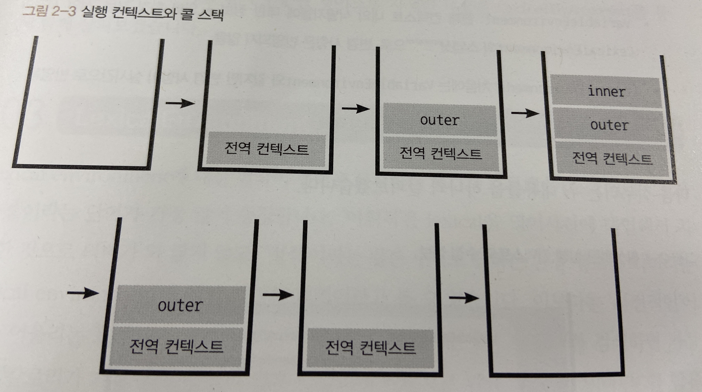
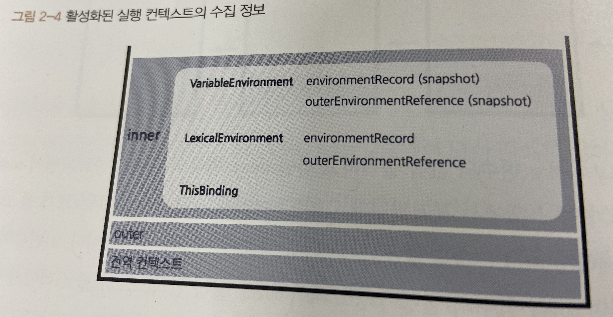

# 실행 컨텍스트

**실행 컨텍스트는(execution context)는 실행할 코드에 제공할 환경 정보를 모아놓은 객체**로, 자바스크립트의 동적 언어로서의 개념을 가장 잘 파악할 수 있는 개념이다. 자바스크립트는 어떤 실행 컨텍스트가 활성화되는 시점에 선언된 변수를 위로 끌어올리고(호이스팅), 외부 환경 정보를 구성하고, `this` 값을 설정하는 등의 동작을 수행하는데, 이로 인해 다른 언어에서는 발생할 수 없는 특이한 현상들이 발생한다.

#### 1. 실행 컨텍스트란?

앞서 실행 컨텍스트를 **실행할 코드에 제공할 환경 정보들을 모아놓은 객체**라고 했다. 동일한 환경에 있는 코드들을 실행할 때 필요한 환경 정보들을 모아 컨텍스트를 구성하고, 이를 콜 스택에 쌓아올려다가, 가장 위에 쌓여있는 컨텍스트와 관련 있는 코드들을 실행하는 식으로 전체 코드의 환경과 순서를 보장한다. 여기서 '동일한 환경', 즉 하나의 실행 컨텍스트를 구성할 수 있는 방법으로 전역공간, `eval()` 함수, 함수 등이 있다. 자동으로 생성되는 전역공간과 악마로 취급받는 `eval` 을 제외하면 흔히 실행 컨텍스트를 구성하는 방법은 **함수를 실행**하는 것뿐이다. 

```javascript
// -------------------------- (1)
var a = 1;
function outer() {
  function inner() {
    console.log(a); // undefined
    var a = 3;
  }
  inner(); // ------------ (2)
  console.log(a); // 1
}
outer(); // ---------------- (3)
console.log(a); // 1
```



위 그림과 같이 처음 자바스크립트 코드를 실행하는 순간(1) 전역 컨텍스트가 콜 스택에 담긴다. 전역 컨텍스트라는 개념ㅇ은 일반적인 실행 컨텍스트와 특별히 다를 것이 없다. 최상단의 공간은 코드 내부에서 별도의 실행 명령이 없어도 브라우저에서 자동으로 실행하므로 자바스크립트 파일이 열리는 순간 전역 컨텍스트가 활성화된다고 이해하면 된다.

어찌됐든 콜 스택에는 전역 컨텍스트 외에 다른 덩어리가 없으므로 전역 컨텍스트와 관련된 코드들을 순차로 진행하다가 (3)에서 outer 함수를 호출하면 자바스크립트 엔진은 outer에 대한 환경 정보를 수집해서 outer 실행 컨텍스트를 생성한 후 콜 스택에 담는다. 콜 스택의 맨 위에 outer 실행 컨텍스트가 놓인 상태가 됐으므로 전역 컨텍스트와 관련되 코드의 실행을 일시중단하고 대신 outer 실행 컨텍스트와 관련된 코드, 즉 outer 함수 내부의 코드들을 순서대로 실행한다.

그렇게 되면 다시 (2)에서 inner 함수의 실행 컨텍스트가 콜 스택의 가장 위에 담기면 outer 컨텍스트와 관련된 코드의 실행을 중단하고 inner 함수 내부의 코드를 순서대로 진할 것이다.

Inner 함수 내부에서 a 변수의 값을 출력하고 나면 inner 함수의 실행이 종료되면서 inner 실행 컨텍스트가 콜 스택에서 제거된다. 그러면 아래에 있던 outer 컨텍스트가 콜 스택의 맨 위에 존재하게 되므로 중단했던 (2)의 다음 줄부터 이어서 실행한다(`console.log(a)`). a 변수의 값을 출력하고 나면 outer 함수의 실행이 종료되어 outer 실행 컨텍스트가 콜 스택에서 제거되고, 콜 스택에는 전역 컨텍스트만 남아 있게 된다. 그런 다음, 실행을 중단했던 (3)의 다음 줄부터 이어서 실행한다. a 변수의 값을 출력하고 나면 전역 공간에 더는 실행할 코드가 남아 있지 않아 전역 컨텍스트도 제거되고, 콜 스택에는 아무것도 남지 않은 상태로 종료된다.

스택 구조를 잘 생각해보면 한 실행 컨텍스트가 콜 스택의 맨 위에 쌓이는 순간이 곧 현재 실행할 코드에 관여하게 되는 시점임을 알 수 있다. 기존의 컨텍스트는 새로 쌓인 컨텍스트보다 아래에 위치할 수 밖에 없기 때문이다. 이러헤 어떤 실행 컨텍스트가 활성화될 때 자바스크립트 엔진은 해당 컨텍스트에 관련된 코드들을 실행하는 데 필요한 환경 정보들을 수집해서 실행 컨텍스트 객체에 저장한다. 이 객체는 자바스크립트 엔진이 활용할 목적으로 생성할 뿐 개발자가 코드를 통해 확인할 수는 없다. 여기에 담기는 정보는 다음과 같다.

- VariableEnviroment: 현재 컨텍스트 내의 식별자들에 대한 정보 + 외부 환경 정보 선언 시점의 LexicalEnvironment의 스냅샷으로 변경사항은 반영되지 않음
- LexicalEnvironment: 처음에는 VaraiableEnviroment와 같지만 변경 사항이 실시간으로 반영됨.
- ThisBinding: this 식별자가 바라봐야 할 대상 객체



#### 2. VaraiableEnviroment

VariableEnviroment에 담기는 내용은 LexicalEnvironment와 같지만 최초 실행 시의 스냅샷을 유지한다는 점이 다르다. 실행 컨텍스트를 생성할 때 VariableEnviroment에 정보를 먼저 담은 다음, 이를 그대로 복사해서 VariableEnviroment를 만들고, 이후에는 LexicalEnvironment를 주로 활용하게 된다.

VariableEnviroment와 LexicalEnvironment의 내부에서 environmentRecord와 outerEnvironmentReference로 구성돼 있다. 초기화 과정 중에는 사실상 완전히 동일하고 이후 코드 진행에 따라 서로 달라지게 될 것이므로 자세한 내용은 LexicalEnvironment를 통해 알아보도록 하자.

#### 3. LexicalEnvironment

LexicalEnvironment에 대한 한국어 번역은 문서마다 제각각 다른데 '어휘적 환경', '정적 환경'이라는 단어가 많이 등장한다. '어휘적'은 lexical을 영어사전에 대입하여 치환한 것이고, '정적'이라는 말은 수시로 변하는 환경 정보를 의미하는 LexicalEnvironment에 대한 적절한 번역이라고 할 수 없다고 말한다. 필자는 이보다 '사전적인'이 더욱 어울리는 표현이라고 말하고 있다. 즉, "현재 컨텍스트 내부에는 a, b, c와 같은 식별자들이 있고 그 외부 정보는 D를 참조하도록 구성돼 있다"라는, 컨텍스트를 구성하는 환경 정보들을 사전에서 접하는 느낌으로 모아놓은 것이다.

**3-1 environmentRecord와 호이스팅**

environmentRecord에는 현재 컨텍스트와 관련된 코드의 식별자 정보들이 저장된다. 컨텍스트를 구성하는 함수에 지정된 매개변수 실벽자, 선언한 함수가 있을 경우 그 함수 자체, var로 선언된 변수의 식별자 등이 식별자에 해당된다. 컨텍스트 내부 전체를 처음부터 끝까지 쭉 풅어나가면 **순서대로** 수집한다.

변수 정보를 수집하는 과정을 모두 마쳤더라도 아직 실행 컨텍스트가 관여할 코드들은 실행되기 전의 상태다. 코드가 실행되기 전임에도 불구하고 자바스크립트 엔진은 이미 해당 환경에 속한 코드의 변수명들을 모두 알고 있게 되는 셈이다. 그렇다면 엔진의 실제 동작 방식 대신에 '자바스크립트 엔진은 식별자들을 최상단으로 끌어올려놓은 다음 실제 코드를 실행한다'라고 생각하더라도 코드를 해석하는 데는 문제될 것이 전혀 없을 것이다. 

여기서 호이스팅(hoisting)이라는 개념이 등장한다. 호이스팅이란 '끌어올리다'라는 의미의 hoist와 ing를 붙여 만든 동명사로, 변수 정보를 수집하는 과정을 더욱 이해하기 쉬운 방법으로 대체한 가상의 개념이다. 자바스크립트 엔진이 실제로 끌어올리지는 않지만 편의상 끌어올린 것으로 간주하자는 것이다.

**호이스팅 규칙**

앞서 environmentRecord에는 매개변수의 이름, 함수 선언, 변수명 등이 담긴다고 했다. 

```javascript
function a(x) {
  // 수집 대상 1(매개변수)
  console.log(x); // (1)
  var x; // 수집 대상 2(변수 선언)
  console.log(x); // (2)
  var x = 2; // 수집 대상 3(변수 선언)
  console.log(x); // (3)
}
a(1);
```

우선 호이스팅이 되지 않았을 때, (1), (2), (3)에서 어떤 값들이 출력될지를 예상해 보자. 아마 (1)에는 매개변수로 전달한 1이 출력될 것이고, (2)에는 undefined, (3)에는 2가 출력될 것 같다. 이제 실제로는 어떤 값이 나오고 왜 그렇게 되는지 알아보도록 하자.

> ❗️
>
> 지금부터는 자바스크립트 엔진의 구동 방식을 좀 더 사람의 입장에서 이해해보고자 코드를 몇 차례 변경할 것이다. 실제 엔진은 이러한 변환 과정을 거치지 않는다는 것에 주의해야 한다.

위 예제처럼 인자들과 함께 함수를 호출한 경우의 동작을 살펴보면, arguments에 전달된 인자를 담는 것을 제외하면 다음의 예제 코드처럼 코드 내부에서 변수를 선언한 것과 다름이 없다. 특히 LexicalEnvironment 입장에서는 완전히 같다. 그러니까 인자를 함수 내부의 다른 코드보다 먼저 선언 및 할당이 이뤄진 것으로 간주할 수 있다.

```javascript
function a() {
  var x = 1; // 수집 대상 1(매개변수 선언)
  console.log(x); // (1)
  var x; // 수집 대상 2(변수 선언)
  console.log(x); // (2)
  var x = 2; // 수집 대상 3(변수 선언)
  console.log(x); // (3)
}
a();
```

이 상태에서 변수를 수집하는 과정, 즉 호이스팅을 처리해보자. environmentRecord는 현재 실행될 컨텍스트의 대상 코드 내에 어떤 식별자들이 있는지에만 관심이 있고, 각 식별자에 어떤 값이 할당될 것인지는 관심이 없다. 따라서 변수를 호이스팅할 때 변수명만 끌어올리고 할당 과정은 원래 자리에 그대로 남겨둔다. 매개변수의 경우도 마찬가지다. environmentRecord의 관심사에 맞춰 수집 대상 1, 2, 3을 순서대로 끌어올리고 나면 다음과 같은 형태로 바뀐다.

```javascript
function a() {
  var x; // 수집 대상 1의 변수 선언 부분
  var x; // 수집 대상 2의 변수 선언 부분
  var x; // 수집 대상 3의 변수 선언 부분

  x = 1; // 수집 대상 1의 할당 부분
  console.log(x); // (1)
  console.log(x); // (2)
  x = 2; // 수집 대상 3의 할당 부분
  console.log(x); // (3)
}
a(1);
```

이제 호이스팅이 끝났으니 실제 코드를 실행할 차례다(스코프체인 수집 및 this 할당 과정은 추후 논의할 예정)

- 2번째 줄: 변수 x를 선언한다. 이때 메모리에서는 저장할 공간을 미리 확보하고, 확보한 공간의 주솟값을 변수 x에 연결해둔다.
- 3번째 줄과 4번째 줄: 다시 변수 x를 선언한다. 이미 선언된 변수 x가 있으므로 무시한다.
- 6번째 줄: x에 1을 할당하라고 한다. 우선 숫자 1을 별도의 메모리에 담고, x와 연결된 메모리 공간에 숫자 1을 가리키는 주솟값을 입력한다.
- 7번째 줄과 8번째 줄: 각 x를 출력하라고 한다. (1) (2) 모두 1이 출력된다.
- 9번째 줄: x에 2를 할당하라고 한다. 숫자 2를 별도의 메모리에 담고, 그 주솟값을 든 채로 x와 연결된 메모리 공간으로 간다. 여기에는 숫자 1을 가리키는 주솟값이 들어있었는데, 이걸 2의 주솟값으로 대치한다. 이제 변수 x는 숫자 2를 가리키게 된다.
- 10번째 줄: x를 출력하라고 하니 (3)에서는 2가 출력되고, 이제 함수 내부의 모든 코드가 실행됐으므로 실행 컨텍스트가 콜 스택에서 제거된다.

나는 처음에 (1) 1, (2) undefined, (3) 2가 출력될 것이라고 예상했는데, 실제로는 (1) 1, (2) 1, (3) 2라는 결과가 나왔다. (2)에서 undefined가 아닌 1이 출력된다는 건 호이스팅 개념을 정확히 이해하지 못하면 예측하기 어려운 결과다.

함수 선언을 추가한 예제를 하나 더 살펴보자.

```javascript
function a() {
  console.log(b); // (1)
  var b = 'bbb'; // 수집 대상 1(변수 선언)
  console.log(b); // (2)
  function b() {} // 수집 대상 2(함수 선언)
  console.log(b); // (3)
}
a();
```

