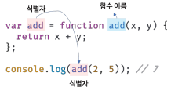

## 12.1 함수란?

함수는 자바스크립트에서 가장 중요한 핵심 개념이다. 또 다른 자바스크립트의 핵심 개념인 스코프, 실행 컨텍스트, 클로저, 생성자 함수에 의한 객체 생성, 메서드, this, 프로토타입, 모듈화 등이 모두 함수와 깊은 관련이 있다. 따라서 함수는 자바스크립트를 정확히 이해하고 사용하기 위해 피해갈 수 없는 핵심 중의 핵심이다.

수학의 함수는 "입력"을 받아 "출력"을 내보내는 일련의 과정을 정의한 것이다. 예를 들어, `f(x, y) = x + y` 라는 함수를 정의하고 이 함수에 두 개의 2, 5를 전달하면 함수는 정의된 일련의 과정, 즉 `x + y` 실행하여 7을 출력한다. 이처럼 함수는 마치 재료를 투입받아 제품을 생산하는 기계와 같다.

미리 정의해 둔 함수를 실행하는 것을 수식으로 표현하면 `f(2, 5) = 7` 이다. 이때 함수의 x, y는 함수 내부로 입력을 받아들이는 변수이고 2, 5는 함수에서 정의된 일련의 과정을 실행하기 위해 필요한 입력이며, 7은 함수의 실행 결과인 출력이다.

```javascript
// f(x, y) = x + y
function add(x, y) {
  return x + y;
}

// f(2, 5) = 7
add(2, 5); // 7
```

프로그래밍 언어의 **함수는 일련의 과정을 문으로 구현하고 코드 블록으로 감싸서 하나의 실행 단위로 정의한 것이다.**

프로그래밍 언어의 함수도 입력을 받아서 출력을 내보낸다. 이때 함수 내부로 입력을 전달받는 변수를 **매개 변수<sup>parameter</sup>** , 입력은 **인수<sup>argument</sup>** , 출력을 **반환값<sup>return value</sup>** 라고 한다. 또한 함수는 값이며, 여러 개 존재할 수 있으므로 특정 함수를 구별하기 위해 식별자인 함수 이름을 사용할 수 있다.

함수는 함수 정의를 통해 생성한다. 

```javascript
// 함수 정의
function add(x, y) {
  return x + y;
}
```

물론 함수 정의만으로 함수가 실행되는 것은 아니다. 수학의 함수처럼 미리 정의된 일련의 과정을 실행하기 위해 필요한 입력, 즉 인수를 매개변수를 통해 함수에 전달하면서 함수의 실행을 명시적으로 지시해야 한다. 이를 **함수 호출** 이라 한다. 함수를 호출하면 코드 블록에 담긴 문들이 일괄저긍로 실행되고 실행결과를 반환한다.

```javascript
// 함수 호출
var result = add(2, 5);

// 함수 add에 인수 2, 5를 전달하면서 호출하면 반환값 7을 반환한다.
console.log(result); // 7
```

## 12.2 함수를 사용하는 이유

함수는 필요할 때 여러 번 호출할 수 있다. 즉, 실행 시점을 개발자가 결정할 수 있고 몇 번이든 재사용이 가능하다. 함수는 몇 번이든 호출할 수 있으므로 **코드의 재사용**이라는 측면에서 매우 유용하다.

함수를 사용하지 않으면 코드를 수정해야 할 때 중복된 코드를 일일이 수정해야 한다. 그렇기 때문에 코드 수정에 걸리는 시간도 길어지고 실수가 발생할 수 있다. 코드의 중복을 억제하고 재사용성을 높이는 함수는 **유지보수의 편의성** 을 높이고 실수를 줄여 **코드의 신뢰성** 을 높이는 효과가 있다.

함수는 객체 타입의 값이다. 따라서 이름(식별자)을 붙일 수 있다. 적절한 함수 이름은 함수의 내부 코드를 이해하지 않고도 함수의 역할을 파악할 수 있게 돕는다. 이는 **코드의 가독성** 을 향상시킨다.

코드는 동작하는 것만이 존재 목적은 아니다. 코드는 개발자를 위한 문서이기 때문에 사람이 이해할 수 있는 코드, 즉 가독성이 좋은 코드가 좋은 코드다.

## 12.3 함수 리터럴

자바스크립트의 함수는 객체 타입의 값이다. 따라서 숫자 값을 숫자 리터럴로 생성하고 객체를 객체 리터럴로 생성하는 것처럼 함수도 함수 리터럴로 생성할 수 있다. 함수 리터럴은 `function` 키워드, 함수 이름, 매개 변수 목록, 함수 몸체로 구성된다.

```javascript
// 변수에 함수 리터럴을 할당
var f = function add(x, y) {
  return x + y;
};
```

함수 리터럴의 구성요소는 다음과 같다.

- 함수 이름
  - 함수 이름은 식별자다. 따라서 식별자 네이밍 규칙을 준수해야 한다.
  - 함수 이름은 함수 몸체 내에서만 참조할 수 있는 식별자다.
  - 함수 이름은 생략할 수 있다. 이름이 있는 함수를 기명 함수, 이름이 없는 함수를 익명 함수라고 한다.
- 매개 변수 목록
  - 0개 이상의 매개변수를 소괄호로 감싸고 쉼표로 구분한다.
  - 각 매개변수에는 함수를 호출할 때 지정한 인수가 순서대로 할당된다. 즉, 매개변수 목록은 순서에 의미가 있다.
  - 매개변수는 함수 몸체 내에서 변수와 동일하게 취급된다. 따라서 매개변수도 변수와 마찬가지로 식별자 네이밍 규칙을 준수해야 한다.
- 함수 몸체
  - 함수가 호출되었을 때 일괄적으로 실행될 문들을 하나의 실행 단위로 정의한 코드 블록이다.
  - 함수 몸체는 함수 호출에 의해 실행된다.

위 예제를 보면 함수 리터럴을 변수에 할당하고 있다. 리터럴은 앞에서 살펴봤듯이 사람이 이해할 수 있는 문자 또는 약속된 기호를 사용해 값을 생성하는 표기 방식을 말한다. 즉, 리터럴은 값을 생성하기 위한 표기법이다. 따라서 함수 리터럴도 평가되어 값을 생성하며, 이 값은 객체다. 즉, **함수는 객체다.**

함수는 객체지만 일반 객체와는 다르다. **일반 객체는 호출할 수 없지만 함수는 호출할 수 있다.** 그리고 일반 객체에는 없는 함수 객체만의 고유한 프로퍼티를 갖는다.

함수가 객체라는 사실은 다른 프로그래밍 언어와 구별되는 자바스크립트의 중요한 특징이다.

## 12.4 함수 정의

함수 정의란 함수를 호출하기 이전에 인수를 전달받을 매개변수와 실행할 문들, 그리고 반환할 값을 지정하는 것을 말한다. 정의된 함수는 자바스크립트 엔진에 의해 평가되어 함수 객체가 된다. 함수를 정의하는 방법에는 4가지가 있다.

```javascript
// 함수 선언문
function add(x,y) {
	return x + y;
}

// 함수 표현식
var add = function(x, y) {
	return x + y;
};

// Function 생성자 함수
var add = new Function('x', 'y', 'return x + y');

// 화살표 함수(ES6)
var add = (x, y) => x + y;
```

모든 함수 정의 방식은 함수를 정의한다는 면에서는 동일하지만 미묘하면서 중요한 차이가 존재한다.

> ❗️
>
> 변수 선언과 함수 정의
>
> 변수는 '선언'한다고 했지만 함수는 '정의'한다고 표현했다. 함수 선언문이 평가되면 식별자가 암묵적으로 생성되고 함수 객체가 할당된다. 따라서 ECMAScript 사양에서도 변수에는 선언<sup>declaration</sup> , 함수에는 정의<sup>function definition</sup> 이라고 표현한다.

#### 12.4.1 함수 선언문

함수 선언문을 사용해 함수를 정의하는 방식은 다음과 같다.

```javascript
// 함수 선언문
function add(x, y) {
  return x + y;
}

// 함수 참조
// console.dir은 console.log와는 달리 함수 객체의 프로퍼티까지 출력한다.
// 단, Node.js 환경에서는 console.log와 같은 결과가 출력된다.
console.dir(add); // ƒ add(x, y)

// 함수 호출
console.log(add(2, 5)); // 7
```

함수 선언문은 함수 리터럴과 형태가 똑같다. 단, 함수 리터럴은 함수 이름을 생략할 수 있으나 **함수 선언문은 함수 이름을 생략할 수 없다.** 

```javascript
// 함수 선언문은 함수 이름을 생략할 수 없다.
function (x, y) {
  return x + y;
}
// SyntaxError: Function statements require a function name
```

**함수 선언문은 표현식이 아닌 문이다.** 크롬 개발자 도구의 콘솔에서 함수 선언문을 실행하면 완료 값 `undefined` 가 출력된다. 함수 선언문이 만약 표현식인 문이라면 완료 값 `undefined` 대신 표현식이 평가되어 생성된 함수가 출력되어야 한다.

5.6절 "표현식인 문과 표현식이 아닌 문"에서도 살펴봤듯이 표현식이 아닌 문은 변수에 할당할 수 없다. 함수 선언문도 표현식이 아닌 문이므로 변수에 할당할 수 없다. 하지만 다음 예제를 보면 함수 선언문이 변수에 할당되는 것처럼 보인다.

```javascript
// 함수 선언문은 표현식이 아닌 문이므로 변수에 할당할 수 없다.
// 하지만 함수 선언문이 변수에 할당되는 것처럼 보인다.
var add = function add(x, y) {
  return x + y;
};

// 함수 호출
console.log(add(2, 5)); // 7
```

이렇게 동작하는 이유는 자바스크립트 엔진이 코드의 문맥에 따라 동일한 함수 리터럴을 표현식이 아닌 문인 함수 선언문으로 해석하는 경우와 표현식인 문인 함수 리터럴 표현식으로 해석하는 경우가 있기 때문이다. 

예를 들어 `{ }` 은 블록문일 수도 있고 객체 리터럴일 수도 있다. 즉, `{ } `는 중의적 표현이다. 자바스크립트 엔진은 `{ } ` 을 코드블록으로 해석할까 객체 리터럴로 해석할까? `{ } ` 처럼 중의적인 코드는 코드의 문맥에 따라 해석이 달라진다. `{ } ` 이 단독으로 존재하면 자바스크립트 엔진은 `{ } ` 을 블록문으로 해석한다. 하지만 `{ } ` 이 값으로 평가되어야 할 문맥(예를 들어, 할당 연산자의 우변)에서 피연산자로 사용되면 자바스크립트 엔진은 `{ } ` 을 객체 리터럴로 해석한다. 이처럼 동일한 코드도 코드의 문맥에 따라 해석이 달라질 수 있다.

기명 함수 리터럴도 중의적인 코드다. 따라서 코드의 문맥에 따라 해석이 달라질 수 있다. 자바스크립트 엔진은 함수 이름이 있는 함수 리터럴을 단독으로 사용(값으로 평가되어야 하는 문맥에서 함수 리터럴을 사용하지 않는 경우, 다시 말해 함수 리터럴을 피연산자로 사용하지 않는 경우)하면 함수 선언문으로 해석하고, 함수 리터럴이 값으로 평가되어야 하는 문맥, 예를 들어 함수 리터럴을 변수에 할당하거나 피연산자로 사용하면 함수 리터럴 표현식으로 해석한다. 이때 함수 선언문이든 함수 리터럴 표현식이든 함수가 생성되는 것은 동일하다. 하지만 함수를 생성하는 내부 동작에 차이가 있다.

```javascript
// 기명 함수 리터럴을 단독으로 사용하면 함수 선언문으로 해석된다.
// 함수 선언문에서는 함수 이름을 생략할 수 없다.
function foo() { console.log('foo'); }
foo(); // foo

// 함수 리터럴을 피연산자로 사용하면 함수 선언문이 아니라 함수 리터럴 표현식으로 해석된다.
// 함수 리터럴에서는 함수 이름을 생략할 수 있다.
(function bar() { console.log('bar'); });
bar(); // ReferenceError: bar is not defined
```

위 예제에서 단독으로 사용된 함수 리터럴(`foo`)은 함수 선언문으로 해석된다. 하지만 그룹 연산자 `()` 내에 있는 함수 리터럴(`bar`)은 함수 선언문으로 해석되지 않고 함수 리터럴 표현식으로 해석된다. 그룹 연산자의 피연산자는 값으로 평가될 수 있는 표현식이어야 한다. 따라서 표현식이 아닌 문인 함수 선언문은 피연산자로 사용할 수 없다.

이처럼 이름이 있는 기명 함수 리터럴은 코드의 문맥에 따라 함수 선언문 또는 함수 리터럴 표현식으로 해석된다. 함수 선언문과 함수 리터럴 표현식은 함수 객체를 생성한다는 점에서 동일하지만 호출에 차이가 있다. 위 예제에서 함수 선언문으로 생성된 `foo` 는 호출할 수 있으나 함수 리터럴 표현식으로 생성된 `bar` 는 호출할 수 없다.

앞에서 살펴본 12.3절 "함수 리터럴"에서 "함수 이름은 함수 몸체 내에서만 참조할 수 있는 식별자다"라고 했따. 이는 함수 몸체 외부에서 함수 이름으로 함수를 참조할 수 없으므로 함수 몸체 외부에서는 함수 이름으로 함수를 호출할 수 없다는 의미다. 즉, 함수를 가리키는 식별자가 없다는 것과 마찬가지다. 따라서 위 예제의 `bar` 함수는 호출할 수 없다.

하지만 위 예제에서 함수 선언문으로 정의된 함수는 `foo` 라는 이름으로 호출할 수 있었다. `foo` 는 함수 몸체 내부에서만 유효한 식별자인 함수 이름이므로 `foo` 함수로 호출할 수 없어야 한다. `foo` 라는 이름으로 함수를 호출하려면 `foo` 는 함수 이름이 아니라 함수 객체를 가리키는 식별자여야 한다. 그런데 위 예제에서는 식별자 `foo` 를 선언한 적도 없고 할당한 적도 없다. `foo` 는 무엇일까? 결론부터 말하자면 `foo` 는 자바스크립트 엔진이 암묵적으로 생성한 식별자다.

자바스크립트 엔진은 함수 선언문을 해석해 함수 객체를 생성한다. 이때 함수 이름은 함수 몸체 내부에서만 유효한 식별자이므로 함수 이름과는 별도로 생성된 함수 객체를 가리키는 식별자가 필요하다. 함수 객체를 가리키는 식별자가 없으면 함수 객체를 참조할 수 없으므로 호출할 수도 없다. 따라서 **자바스크립트 엔진은 생성된 함수를 호출하기 위해 함수 이름과 동일한 이름의 식별자를 암묵적으로 생성하고, 거기에 함수 객체를 할당한다.**

지금까지 살펴본 함수 선언문을 의사 코드로 표현하면 다음과 같다.

```javascript
var add = function add(x, y) {
  return x + y;
};

console.log(add(2, 5)); // 7
```

**함수는 함수 이름으로 호출하는 것이 아니라 함수 객체를 가리키는 식별자로 호출한다.** 즉, 함수 선언문으로 생성한 함수를 호출한 것은 함수 이름 `add` 가 아니라 자바스크립트 엔진이 암묵적으로 생성한 식별자 `add` 인 것이다. 함수 이름과 변수 이름이 일치하므로 함수 이름으로 호출되는 듯하지만 사실은 식별자로 호출된 것이다.



위 의사 코드가 바로 다음에 살펴볼 함수 표현식이다. 결론적으로 자바스크립트 엔진은 함수 선언문을 함수 표현식으로 변환해 생성한다고 생각할 수 있다. 단, 함수 선언문과 함수 표현식이 정확히 동일하게 동작하는 것은 아니다.

#### 12.4.2 함수 표현식

앞에서 언급했듯이 자바스크립트의 함수는 객체 타입의 값이다. 자바스크립트의 함수는 값처럼 변수에 할당할 수도 있고 프로퍼티 값이 될 수도 있으며 배열의 요소가 될 수도 있다. 이처럼 값의 성질을 갖는 객체를 **일급 객체**라 한다. **자바스크립트 함수는 일급 객체** 다. 함수가 일급 객체라는 것은 함수를 값처럼 자유롭게 사용할 수 있다는 의미다.

함수는 일급 객체이므로 함수 리터럴로 생성한 함수 객체를 변수에 할당할 수 있다. 이러한 함수 정의 방식을 함수 표현식이라 한다. 함수 선언문으로 정의한 `add` 함수를 함수 표현식으로 바꿔서 정의하면 아래와 같다.

```javascript
// 함수 표현식
var add = function (x, y) {
  return x + y;
};

console.log(add(2, 5)); // 7
```

함수 리터럴의 함수 이름은 생략할 수 있다. 이러한 함수를 익명 함수라 한다. 함수 표현식의 함수 리터럴은 함수 이름을 생략하는 것이 일반적이다.

함수 선언문에서 살펴본 바와 같이 함수를 호출할 떄는 함수 이름이 아니라 함수 객체를 가리키는 식별자를 사용해야 한다. 함수 이름은 함수 몸체 내부에서만 유효한 식별자이므로 함수 이름으로 함수를 호출할 수 없다.

```javascript
// 기명 함수 표현식
var add = function foo (x, y) {
  return x + y;
};

// 함수 객체를 가리키는 식별자로 호출
console.log(add(2, 5)); // 7

// 함수 이름으로 호출하면 ReferenceError가 발생한다.
// 함수 이름은 함수 몸체 내부에서만 유효한 식별자다.
console.log(foo(2, 5)); // ReferenceError: foo is not defined
```

자바스크립트 엔진은 함수 선언문의 함수 이름으로 식별자를 암묵적으로 생성하고 생성된 함수 객체를 할당하므로 함수 표현식과 유사하게 동작하는 것으로 보인다. 하지만 함수 선언문과 함수 표현식이 정확히 동일하게 동작하지는 않는다.

함수 선언문은 "표현식이 아닌 문"이고 함수 표현식은 "표현식인 문"이다. 따라서 미묘하지만 중요한 차이가 있다.

#### 12.4.3 함수 생성 시점과 함수 호이스팅

```javascript
// 함수 참조
console.dir(add); // ƒ add(x, y)
console.dir(sub); // undefined

// 함수 호출
console.log(add(2, 5)); // 7
console.log(sub(2, 5)); // TypeError: sub is not a function

// 함수 선언문
function add(x, y) {
  return x + y;
}

// 함수 표현식
var sub = function (x, y) {
  return x - y;
};
```

위 예제와 같이 함수 선언문으로 정의한 함수는 함수 선언문 이전에 호출할 수 있다. 그러나 함수 표현식으로 정의한 함수는 함수 표현식 이전에 호출할 수 없다. 이는 **함수 선언문으로 정의한 함수와 함수 표현식으로 정의한 함수의 생성 시점이 다르기 때문이다.**

모든 선언문이 그렇듯 함수 선언문도 코드가 한 줄씩 순차적으로 실행되는 시점인 런타임 이전에 자바스크립트 엔진에 의해 먼저 실행된다. 다시 말해, 함수 선언문으로 함수를 정의하면 런타임 이전에 함수 객체가 먼저 생성된다. 그리고 자바스크립트 엔진은 함수 이름과 동일한 이름의 식별자를 암묵적으로 생성하고 생성된 함수 객체를 할당한다.

즉, 코드가 한 줄씩 순차적으로 실행되기 시작하는 런타임에는 이미 함수 객체가 생성되어 있고 함수 이름과 동일한 식별자에 할당까지 완료된 상태다. 따라서 함수 선언문 이전에 함수를 참조할 수 있으며 호출할 수도 있다. 이처럼 **함수 선언문이 코드의 선두로 끌어 올려진 것처럼 동작하는 자바스크립트 고유의 특징을 호이스팅<sup>hoisting</sup>** 이라 한다.

함수 호이스팅과 변수 호이스팅은 미묘한 차이가 있으므로 주의해야 한다. `var` 키워드를 사용한 변수 선언문과 함수 선언문은 런타임 이전에 자바스크립트 엔진에 의해 먼저 실행되어 식별자를 생성한다는 점에서 동일하다. 하지만 `var` 키워드로 선언된 변수는 `undefined` 로 초기화 되고, 함수 선언문을 통해 암묵적으로 생성된 식별자는 함수 객체로 초기화 된다. 따라서 `var` 키워드를 사용한 변수 선언문 이전에 변수를 참조하면 변수 호이스팅에 의해 `undefined` 로 평가되지만 함수 선언문으로 정의한 함수는 함수 선언문 이전에 호출하면 함수 호이스팅에 의해 호출이 가능하다.

함수 표현식은 변수에 할당하는 값이 함수 리터럴인 문이다. 따라서 함수 표현식은 변수 선언문과 변수 할당문을 한 번에 기술한 축약 표현과 동일하게 동작한다. 변수 선언은 런타임 이전에 실행되여 `undefined` 로 초기화되지만 **변수 할당문의 값은 할당문이 실행되는 시점, 즉 런타임에 평가되므로 함수 표현식의 함수 리터럴도 할당문이 실행되는 시점에 평가되어 함수 객체가 된다.**

따라서 **함수 표현식으로 함수를 정의하면 함수 호이스팅이 발생하는 것이 아니라 변수 호이스팅이 발생한다.**

함수 표현식 이전에 함수를 참조하면 `undefined` 로 평가된다. 따라서 이때 함수를 호출하면 `undefined` 를 호출하는 것과 마찬가지이므로 타입 에러가 발생한다. 따라서 함수 표현식으로 정의한 함수는 반드시 함수 표현식 이후에 참조 또는 호출해야 한다.

함수 호이스팅은 함수를 호출하기 전에 반드시 함수를 선언해야 한다는 당연한 규칙을 무시한다. 이 같은 문제 때문에 JSON을 만든 더글라스 크락포드는 함수 선언문보다는 함수 표현식을 사용하는 것이 권장된다.

#### 12.4.4 Function 생성자 함수

자바스크립트가 기본 제공하는 빌트인 함수인 `Function` 생성자 함수에 매개변수 목록과 함수 몸체를 문자열로 전달하면서 `new` 연산자와 함께 호출하면 함수 객체를 생성해서 반환한다. 사실 `new` 연산자 없이 호출해도 결과는 동일하다.

> ❗️
>
> 생성자 함수
>
> 생성자 함수는 객체를 생성하는 함수를 말한다. 객체를 생성하는 방식은 객체 리터럴 외에 다양한 방법이 있다.

`Function` 생성자 함수로 `add` 함수를 생성해 보자.

```javascript
var add = new Function('x', 'y', 'return x + y');

console.log(add(2, 5)); // 7
```

`Function` 생성자 함수로 함수를 생성하는 방식은 일반적이지 않고 바람직하지도 않다. `Function` 생성자 함수로 생성한 함수는 클로저를 생성하지 않는 등, 함수 선언문이나 함수 표현식으로 생성한 함수와 다르게 동작한다.

```javascript
var add1 = (function () {
  var a = 10;
  return function (x, y) {
    return x + y + a;
  };
}());

console.log(add1(1, 2)); // 13

var add2 = (function () {
  var a = 10;
  return new Function('x', 'y', 'return x + y + a;');
}());

console.log(add2(1, 2)); // ReferenceError: a is not defined
```

#### 12.4.5 화살표 함수

ES6에서 도입된 화살표 함수는 `function` 키워드 대신 화살표 => 를 사용해 좀 더 간략한 방법으로 함수를 선언할 수 있다. 화살표 함수는 항상 익명 함수로 정의한다.

```javascript
// 화살표 함수
const add = (x, y) => x + y;
console.log(add(2, 5)); // 7
```

화살표 함수는 기존의 함수 선언문 또는 함수 표현식을 대체하기 위해 디자인된 것은 아니다. 화살표 함수는 기존의 함수보다 표현만 간략한 것이 아니라 내부 동작 또한 간략화되어 있다.

화살표 함수는 생성자 함수로 사용할 수 없으며, 기존 함수와 `this` 바인딩 방식이 다르고, `prototype` 프로퍼티가 없으며 `arguments` 객체를 생성하지 않는다. 

## 12.5 함수 호출

함수는 함수를 가리키는 식별자와 한 쌍의 소괄호인 함수 호출 연산자로 호출한다. 함수 호출 연산자 내에는 0개 이상의 인수를 쉼표로 구분해서 나열한다. 함수를 호출하면 현재의 실행 흐름을 중단하고 호출된 함수로 실행 흐름을 옮긴다. 이때 매개변수에 인수가 순서대로 할당되고 함수 몸체의 문들이 실행되기 시작한다.

#### 12.5.1 매개변수와 인수

함수를 실행하기 위해 필요한 값을 함수 외부에서 함수 내부로 전달할 필요가 있는 경우, 매개변수<sup>parameter</sup>를 통해 인수<sup>arguments</sup>를 전달한다. 인수는 값으로 평가될 수 있는 표현식이어야 한다. 인수는 함수를 호출할 때 지정하며, 개수와 타입에 제한이 없다.

```javascript
// 함수 선언문
function add(x, y) {
  return x + y;
}

// 함수 호출
// 인수 1과 2는 매개변수 x와 y에 순서대로 할당되고 함수 몸체의 문들이 실행된다.
var result = add(1, 2);
```

매개변수는 함수를 정의할 때 선언하며, 함수 몸체 내부에서 변수와 동일하게 취급된다. 즉, 함수가 호출되면 함수 몸체 내에서 암묵적으로 매개변수가 생성되고 일반 변수와 마찬가지로 `undefined` 로 초기화된 이후 인수가 순서대로 할당된다. 함수가 호출될 때마다 매개변수는 이와 같은 단계를 거친다.

매개변수는 함수 몸체 내부에서만 참조할 수 있고 함수 몸체 외부에서는 참조할 수 없다. 즉, 매개변수의 스코프(유효 범위)는 함수 내부다.

```javascript
function add(x, y) {
  console.log(x, y); // 2 5
  return x + y;
}

add(2, 5);

// add 함수의 매개변수 x, y는 함수 몸체 내부에서만 참조할 수 있다.
console.log(x, y); // ReferenceError: x is not defined
```

함수는 매개변수의 개수와 인수의 개수가 일치하는지 체크하지 않는다. 즉, 함수를 호출할 때 매개변수의 개수만큼 인수를 전달하는 것이 일반적이지만 그렇지 않은 경우에도 에러가 발생하지 않는다. 인수가 부족해서 인수가 할당되지 않은 매개변수의 값은 `undefined` 이다.

```javascript
function add(x, y) {
  return x + y;
}

console.log(add(2)); // NaN
```

위 예제의 매개변수 `x` 에는 인수 2가 전달되지만, 매개변수 `y` 에는 전달할 인수가 없다. 따라서 매개변수 `y` 는 `undefined` 로 초기화된 그대로다. 따라서 함수 몸체의 문 `x + y` 는 `2 + undefined` 와 같으므로 `NaN` 이 반환된다.

매개변수보다 인수가 더 많은 경우 초과된 인수는 무시한다.

```javascript
function add(x, y) {
  return x + y;
}

console.log(add(2, 5, 10)); // 7
```

사실 초과된 인수가 그냥 버려지는 것은 아니다. 모든 인수는 암묵적으로 `arguments` 객체의 프로퍼티로 보관된다.

```javascript
function add(x, y) {
  console.log(arguments);
  // Arguments(3) [2, 5, 10, callee: ƒ, Symbol(Symbol.iterator): ƒ]

  return x + y;
}

add(2, 5, 10);
```

`arguments` 객체는 함수를 정의할 때 매개변수 개수를 확정할 수 없는 가변 인자 함수를 구현할 때 유용하게 사용된다. 

#### 12.5.2 인수 확인

```javascript
function add(x, y) {
  return x + y;
}
```

위 함수를 정의한 개발자의 의도는 아마도 2개의 숫자 타입 인수를 전달받아 그 합계를 반환하려는 것으로 추측된다. 하지만 코드 상으로는 어떤 타입의 인수를 전달해야 하는지, 어떤 타입의 값을 반환하는지 명확하지 않다. 따라서 위 함수는 다음고과 같이 호출될 수 있다.

```javascript
function add(x, y) {
  return x + y;
}

console.log(add(2));        // NaN
console.log(add('a', 'b')); // 'ab'
```

따라서 자바스크립트의 경우 함수를 정의할 때 적절한 인수가 전달되었는지 확인할 필요가 있다.

```javascript
function add(x, y) {
  if (typeof x !== 'number' || typeof y !== 'number') {
    // 매개변수를 통해 전달된 인수의 타입이 부적절한 경우 에러를 발생시킨다.
    throw new TypeError('인수는 모두 숫자 값이어야 합니다.');
  }

  return x + y;
}

console.log(add(2));        // TypeError: 인수는 모두 숫자 값이어야 합니다.
console.log(add('a', 'b')); // TypeError: 인수는 모두 숫자 값이어야 합니다.
```

이처럼 함수 내부에서 적절한 인수가 전달되었는지 확인하더라도 부적적한 호출을 사전에 방지할 수는 없고 에러는 런타임에 발생하게 된다. 따라서 타입스크립트와 같은 정적 타입을 선언할 수 있는 자바스크립트의 상위 확장을 도입해 컴파일 시점에 부적절한 호출을 방지할 수있게 하는 것도 하나의 방법이다.

앞의 예제의 경우 인수의 개수는 확인하고 있지 않지만 `argument` 객체를 통해 인수 개수를 확인할 수도 있다. 또한 인수가 전달되지 않은 경우 단축 평가를 사용해 매개변수에 기본값을 할당하는 방법도 있다.

```javascript
function add(a, b, c) {
  a = a || 0;
  b = b || 0;
  c = c || 0;
  return a + b + c;
}

console.log(add(1, 2, 3)); // 6
console.log(add(1, 2)); // 3
console.log(add(1)); // 1
console.log(add()); // 0
```

ES6에서 도입된 매개변수 기본값을 사용하면 함수 내에서 수행하던 인수 체크 및 초기화를 간소화할 수 있다. 매개변수 기본값은 매개변수에 인수를 전달하지 않았을 경우와 `undefined` 를 전달한 경우에만 유효하다.

```javascript
function add(a = 0, b = 0, c = 0) {
  return a + b + c;
}

console.log(add(1, 2, 3)); // 6
console.log(add(1, 2)); // 3
console.log(add(1)); // 1
console.log(add()); // 0
```

#### 12.5.3 매개변수의 최대 개수

ECMAScript 사양에서는 매개변수의 최대 개수에 대해 명시적으로 제한하고 있지 않다. 하지만 물리적 한계는 있으므로 자바스크립트 엔진마다 매개변수의 최대 개수에 대한 제한이 있겠지만 충분히 많은 매개변수를 지정할 수 있다. 그렇다면 매개변수는 최대 몇 개까지 사용하는 것이 좋을까?

매개변수는 순서에 의미가 있다. 따라서 매개변수가 많아지면 함수를 호출할 때 전달해야 할 인수의 순서를 고려해야 한다. 이는 함수의 사용법을 이해하기 어렵게 만들고 실수를 발생시킬 가능성을 높인다. 또한 매개변수의 개수나 순서가 변경되면 함수의 호출 방법도 바뀌므로 함수를 사용하는 코드 전체가 영향을 받는다. 즉, 유지보수성이 나빠진다.

함수의 매개변수는 코드를 이해하는 데 방해되는 요소이므로 이상적인 매개변수 개수는 0개이며 적을수록 좋다. 매개변수의 개수가 많다는 것은 함수가 여러 가지 일을 한다는 증거이므로 바람직하지 않다. **이상적인 함수는 한 가지 일만 해야 하며 가급적 작게 만들어야 한다.**

따라서 매개변수는 최대 3개 이상을 넘지 않는 것이 권장된다. 만약 그 이상의 매개변수가 필요하다면 하나의 매개변수를 선언하고 객체를 인수로 전달하는 것이 유리하다. 다음은 jQuery의 `ajax` 메서드에 객체를 인수로 전달하는 예다.

```javascript
$.ajax({
  method: 'POST',
  url: '/user',
  data: { id: 1, name: 'Lee' },
  cache: false
});
```

객체를 인수로 사용하는 경우 프로퍼티 키만 정확히 지정하면 매개변수의 순서를 신경쓰지 않아도 된다. 또한 명시적으로 인수의 의미를 설명하는 프로퍼티 키를 사용하게 되므로 코드의 가독성도 좋아지고 실수도 줄어드는 효과가 있다.

주의할 것은 함수 외부에서 함수 내부로 전달한 객체를 함수 내부에서 변경하면 함수 외부의 객체가 변경되는 부수 효과가 발생한다는 것이다.

#### 12.5.4 반환문

함수는 `return` 키워드와 표현식(반환값)으로 이뤄진 반환문을 사용해 실행 결과를 함수 외부로 반환할 수 있다.

```javascript
function multiply(x, y) {
  return x * y; // 반환문
}

// 함수 호출은 반환값으로 평가된다.
var result = multiply(3, 5);
console.log(result); // 15
```

`multiply` 함수는 두 개의 인수를 전달받아 곱한 결과값을 `return` 키워드를 사용해 반환한다. 함수는 `return` 키워드를 사용해 자바스크립트에서 사용 가능한 모든 값을 반환할 수 있다. 5.3절 "표현식"에서 살펴 보았듯이 **함수 호출은 표현식**이다. 함수 호출 표현식은 `return` 키워드가 반환한 표현식의 평가 결과, 즉 반환값으로 평가된다.

반환문은 두 가지 역할을 한다. 첫째, 반환문은 함수의 실행을 중단하고 함수 몸체를 빠져나간다. 따라서 반환문 이후에 다른 문이 존재하면 그 문은 실행되지 않고 무시된다.

```javascript
function multiply(x, y) {
  return x * y; // 반환문
  // 반환문 이후에 다른 문이 존재하면 그 문은 실행되지 않고 무시된다.
  console.log('실행되지 않는다.');
}

console.log(multiply(3, 5)); // 15
```

둘째, 반환문은 `return` 키워드 뒤에 오는 표현식을 평가해 반환한다. `return` 뒤에 반환값으로 사용할 표현식을 명시적으로 지정해놓지 않으면 `undefined` 가 반환된다.

```javascript
function foo () {
  return;
}

console.log(foo()); // undefined
```

반환문은 생략할 수 있다. 이때 함수는 함수 몸체의 마지막 문까지 실행한 후 암묵적으로 `undefined` 를 반환한다.

```javascript
function foo () {
  // 반환문을 생략하면 암묵적으로 undefined가 반환된다.
}

console.log(foo()); // undefined
```

`return` 키워드와 반환값으로 사용할 표현식 사이에 줄바꿈이 있으면 5.5절 "세미콜론과 세미콜론 자동 삽입 기능"에서 살펴본 세미콜론 자동 삽입 기능에 의해 세미콜론이 추가되어 다음과 같이 의도치 않은 결과가 발생할 수 있다.

```javascript
function multiply(x, y) {
  // return 키워드와 반환값 사이에 줄바꿈이 있으면
  return // 세미콜론 자동 삽입 기능(ASI)에 의해 세미콜론이 추가된다.
  x * y; // 무시된다.
}

console.log(multiply(3, 5)); // undefined
```

반환문은 함수 몸체 내부에서만 사용할 수 있다. 전역에서 반환문을 사용하면 문법 에러가 발생한다.

```html
<!DOCTYPE html>
<html>
<body>
  <script>
    return; // SyntaxError: Illegal return statement
  </script>
</body>
</html>
```

## 12.6 참조에 의한 전달과 외부 상태의 변경

11장 "원시 값과 객체의 비교"에서 살펴보았듯이 원시 값은 값에 의한 전달, 객체는 참조에 의한 전달 방식으로 동작한다. 매개변수도 함수 몸체 내부에서 변수와 동일하게 취급되므로 매개변수 또한 타입에 따라 값에 의한 전달, 참조에 의한 전달 방식을 그대로 따른다.

함수를 호출하면서 매개변수에 값을 전달하는 방식을 값에 의한 호출<sup>call by value</sup> , 참조에 의한 호출<sup>call by reference</sup> 로 구별해 부르는 경우도 있으나 동작 방식은 값에 의한 전달, 참조에 의한 전달과 동일하다.

```javascript
// 매개변수 primitive는 원시값을 전달받고, 매개변수 obj는 객체를 전달받는다.
function changeVal(primitive, obj) {
  primitive += 100;
  obj.name = 'Kim';
}

// 외부 상태
var num = 100;
var person = { name: 'Lee' };

console.log(num); // 100
console.log(person); // {name: "Lee"}

// 원시값은 값 자체가 복사되어 전달되고 객체는 참조값이 복사되어 전달된다.
changeVal(num, person);

// 원시값은 원본이 훼손되지 않는다.
console.log(num); // 100

// 객체는 원본이 훼손된다.
console.log(person); // {name: "Kim"}
```

`changeVal` 함수는 매개변수를 통해 전달받은 원시 타입 인수와 객체 타입 인수를 함수 몸체에서 변경한다. 더 엄밀히 말하자면 원시 타입 인수를 전달받은 매개변수 `primitive` 의 경우, 원시 값은 변경 불가능한 값이므로 직접 변경할 수 없기 때문에 재할당을 통해 할당된 원시 값을 새로운 원시 값으로 교체했고, 객체 타입 인수를 전달받은 매개변수의 `obj` 의 경우, 객체는 변경 가능한 값이므로 직접 변경할 수 있기 때문에 재할당 없이 직접 할당된 객체를 변경했다.

이때 원시 타입 인수는 값 자체가 복사되어 매개변수에 전달되기 때문에 함수 몸체에서 그 값을 변경(재할당을 통한 교체)해도 원본은 훼손되지 않는다. 다시 말해, 외부 상태, 즉 함수 외부에서 함수 몸체 내부로 전달한 원시 값의 원본을 변경하는 어떠한 부수 효과도 발생하지 않는다. 

하지만 객체 타입 인수는 참조 값이 복사되어 매개변수에 전달되기 때문에 함수 몸체에서 참조 값을 통해 객체를 변경할 경우 원본이 훼손된다. 다시 말해, 외부 상태, 즉 함수 외부에서 함수 몸체 내부로 전달한 참조값에 의해 원본 객체가 변경되는 부수 효과가 발생한다. 

이처럼 함수가 외부 상태(위 예제의 경우, 객체를 할당한 `person` 변수)를 변경하면 상태 변화를 추적하기 어려워진다. 이는 코드의 복잡성을 증가시키고 가독성을 해치는 원인이 된다. 함수 내부의 동작을 유심히 관찰하지 않으면 외부 상태가 변하는지 아닌지 알기 어렵기 때문이다. **언제나 그러하듯 논리가 간단해야 버그가 숨어들지 못한다.**

이러한 현상은 객체가 변경할 수 있는 값이며, 참조에 의한 전달 방식으로 동작하기 때문에 발생하는 부작용이다. 여러 변수가 참조에 의한 전달 방식을 통해 참조 값을 공유하고 있다면 이 변수들은 언제든지 참조하고 있는 객체를 직접 변경할 수 있다. 복잡한 코드에서 의도치 않는 객체의 변경을 추적하는 것은 어려운 일이다. 객체의 변경을 추적하려면 옵저버 패턴 등을 통해 객체를 참조를 공유하는 모든 이들에게 변경 사실을 통지하고 이에 대처하는 추가 대응이 필요하다.

이러한 문제를 해결하는 방법 중 하나가 바로 불변 객체<sup>immutable object</sup> 로 만들어 사용하는 것이다. 객체의 복사본을 새롭게 생성하는 비용은 들디만 객체를 마치 원시 값처럼 변경 불가능한 값으로 동작하게 만드는 것이다.

이를 통해 객체의 상태 변경을 원천봉쇄하고 객체의 상태 변경이 필요한 경우에는 객체의 방어적 복사를 통해 원본 객체를 완전히 복제, 즉 깊은 복사<sup>deep copy</sup> 를 통해 새로운 객체를 생성하고 재할당을 통해 교체한다. 이를 통해 외부 상태가 변경되는 부수 효과를 없앨 수 있다.

외부 상태를 변경하지 않고 외부 상태에 의존하지도 않는 함수를 순수 함수라 한다. 순수 함수를 통해 부수 효과를 최대한 억제하여 오류를 피하고 프로그램의 안전성을 높이려는 프로그래밍 패러다임을 함수형 프로그래밍이라고 한다.

