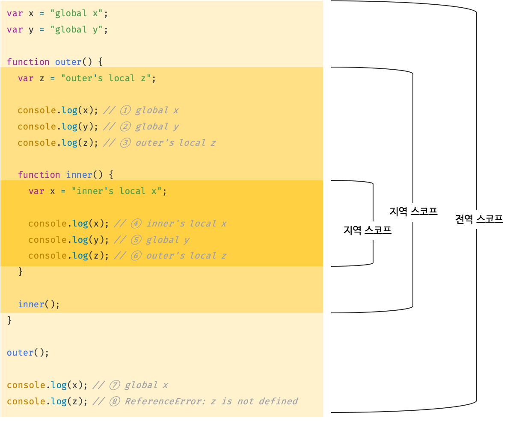

## 13.1 스코프란?

스코프<sup>scope</sup> (유효범위)는 자바스크립트를 포함한 모든 프로그래밍 언어의 기본적이며 중요한 개념이다. 스코프의 이해가 부족하면 다른 개념을 이해하기 어려울 수 있다. 더욱이 자바스크립트의 스코프는 다른 언어의 스코프와 구별되는 특징이 있으므로 주의가 필요하다. 그리고 `var` 키워드로 선언한 변수와 `let` 또는 `const` 키워드로 선언한 변수의 스코프도 다르게 동작한다. 스코프는 변수 그리고 함수와 깊은 관련이 있다.

함수의 매개변수는 함수 몸체 내부에서만 참조할 수 있고 함수 몸체 외부에서는 참조할 수 없다고 했다. 이것은 매개변수를 참조할 수 있는 유효범위, 즉 매개변수의 스코프가 함수 몸체 내부로 한정되기 때문이다.

```javascript
function add(x, y) {
  // 매개변수는 함수 몸체 내부에서만 참조할 수 있다.
  // 즉, 매개변수의 스코프(유효범위)는 함수 몸체 내부다.
  console.log(x, y); // 2 5
  return x + y;
}

add(2, 5);

// 매개변수는 함수 몸체 내부에서만 참조할 수 있다.
console.log(x, y); // ReferenceError: x is not defined
```

변수는 코드의 가장 바깥 영역뿐 아니라 코드 블록이나 함수 몸체 내에서도 선언할 수 있다. 이때 코드 블록이나 함수는 중첩될 수 있다.

```javascript
var var1 = 1; // 코드의 가장 바깥 영역에서 선언한 변수

if (true) {
  var var2 = 2; // 코드 블록 내에서 선언한 변수
  if (true) {
    var var3 = 3; // 중첩된 코드 블록 내에서 선언한 변수
  }
}

function foo() {
  var var4 = 4; // 함수 내에서 선언한 변수

  function bar() {
    var var5 = 5; // 중첩된 함수 내에서 선언한 변수
  }
}

console.log(var1); // 1
console.log(var2); // 2
console.log(var3); // 3
console.log(var4); // ReferenceError: var4 is not defined
console.log(var5); // ReferenceError: var5 is not defined
```

변수는 자신이 선언된 위치에 의해 자신이 유효한 범위, 즉 다른 코드가 변수 자신을 참조할 수 있는 범위가 결정된다. 변수뿐만 아니라 모든 식별자가 그렇다. 다시 말해, **모든 식별자(변수 이름, 함수 이름, 클래스 이름 등)는 자신이 선언된 위치에 의해 다른 코드가 식별자 자신을 참조할 수 있는 유효 범위가 결정된다. 이를 스코프라 한다. 즉, 스코프는 식별자가 유효한 범위를 말한다.**

```javascript
var x = 'global';

function foo() {
  var x = 'local';
  console.log(x); // ①
}

foo();

console.log(x); // ②
```

코드의 가장 바깥 영역과 `foo` 함수 내부에 같은 이름을 갖는 `x` 변수를 선언했고 1과 2에서 `x` 변수를 참조한다. 이때 자바스크립트 엔진은 이름이 같은 두 개의 변수 중에서 어떤 변수를 참조해야 할 것인지를 결정해야 한다. 이를 **식별자 결정**이라 한다. 자바스크립트 엔진은 스코프를 통해 어떤 변수를 참조해야 할 것인지 결정한다. 따라서 스코프란 자바스크립트 엔진이 **식별자를 검색할 때 사용하는 규칙**이라고도 할 수 있다.

자바스크립트 엔진은 코드를 실행할 때 코드의 문맥<sup>context</sup> 를 고려한다. 코드가 어디서 실행되며 주변에 어떤 코드가 있ㄴ느지에 따라 위 예제의 1과 2처럼 동일한 코드도 다른 결과를 만들어 낸다.

> ❗️
>
> 코드의 문맥과 환경
>
> "코드가 어디서 실행되며 주변에 어떤 코드가 있는지"를 렉시컬 환경<sup>lexical environment</sup> 라고 한다. 즉, 코드의 문맥<sup>context</sup> 은 렉시컬 환경으로 이뤄진다. 이를 구현한 것이 "실행 컨텍스트"이며, 모든 코드는 실행 컨텍스트에서 평가되고 실행된다. 스코프는 이 실행 컨텍스트와 깊은 관련이 있다.

위 예제에서 코드의 가장 바깥 영역에서 선언된 `x` 변수는 어디서든 참조할 수 있다. 하지만 `foo` 함수 내부에서 선언된 `x` 변수는 `foo` 함수 내부에서만 참조할 수 있고 `foo` 함수 외부에서는 참조할 수 없다. 이때 두 개의 `x` 변수는 식별자 이름이 동일하지만 자신이 유효한 범위, 즉 스코프가 다른 별개의 변수다.

만약 스코프라는 개념이 없다면 같은 이름을 갖는 변수가 충돌을 일으키므로 프로그램 전체에서 하나밖에 사용할 수 없다.

변수나 함수의 이름과 같은 식별자는 어떤 값을 구별하여 식별해낼 수 있는 고유한 이름을 말한다. 사람을 고유한 이름으로 구별하듯이 값도 사람이 이해할 수 있는 언어로 지정한 고유한 식별자인 변수 이름에 의해 구별하여 참조할 수 있다.

식별자는 어떤 값을 구별할 수 있어야 하므로 유일해야 한다. 따라서 식별자인 변수 이름은 중복될 수 없다. 즉, 하나의 값은 유일한 식별자에 연결되어야 한다.

예를 들어, 파일 이름은 하나의 파일을 구별하여 식별할 수 있는 식별자다. 식별자인 파일 이름은 유일해야 한다. 하지만 우리는 컴퓨터를 사용할 때 하나의 파일 이름만 사용하지 않는다. 식별자인 파일 이름을 중복해서 사용할 수 있는 이유는 폴더라는 개념이 있기 때문이다. 만약 폴더가 없다면 파일 이름은 유일해야 한다. 컴퓨터 전체를 통틀어 하나의 파일 이름만 사용해야 한다면 파일 이름을 만드는 것이 무척이나 번거로울 것이다.

이와 마찬가지로 프로그래밍 언어에서는 스코프를 통해 식별자인 변수 이름의 충돌을 방지하여 같은 이름의 변수를 사용할 수 있게 한다. 스코프 내에서 식별자는 유일해야 하지만 다른 스코프에는 같은 이름의 식별자를 사용할 수 있다. 즉, 스코프는 네임스페이스다.

>❗️
>
>var 키워드로 선언한 변수의 중복 선언
>
>`var` 키워드로 선언한 변수는 같은 스코프 내에서도 중복 선언이 허용된다. 이는 의도치 않게 변수값이 재할당되어 변경되는 부작용을 발생시킨다.
>
>```javascript
>function foo() {
>  var x = 1;
>  // var 키워드로 선언된 변수는 같은 스코프 내에서 중복 선언을 허용한다.
>  // 아래 변수 선언문은 자바스크립트 엔진에 의해 var 키워드가 없는 것처럼 동작한다.
>  var x = 2;
>  console.log(x); // 2
>}
>foo();
>```
>
>하지만 `let` 이나 `const` 로 선언한 변수는 같은 스코프 내에서 중복 선언을 허용하지 않는다.
>
>```javascript
>function bar() {
>  let x = 1;
>  // let이나 const 키워드로 선언된 변수는 같은 스코프 내에서 중복 선언을 허용하지 않는다.
>  let x = 2; // SyntaxError: Identifier 'x' has already been declared
>}
>bar();
>```

## 13.2 스코프의 종류

코드는 전역과 지역으로 구분할 수 있다.

| 구분 |         설명          |   스코프    |   변수    |
| :--: | :-------------------: | :---------: | :-------: |
| 전역 | 코드의 가장 바깥 영역 | 전역 스코프 | 전역 변수 |
| 지역 |    함수 몸체 내부     | 지역 스코프 | 지역 변수 |

이때 변수는 자신이 선언된 위치(전역 또는 지역)에 의해 자신이 유효한 범위인 스코프가 결정된다. 즉, 전역에서 선언된 변수는 전역 스코프를 갖는 전역 변수이고, 지역에서 선언된 변수는 지역 스코프를 갖는 지역 변수다.

#### 13.2.1 전역과 전역 스코프



전역이란 코드의 가장 바깥 영역을 말한다. 전역은 전역 스코프를 만든다. 전역에 변수를 선언하면 전역 스코프를 같는 전역 변수가 된다. **전역 변수는 어디서든 참조할 수 있다.**

위 예제의 `x` 와 `y` 는 전역 변수다. 전역 변수는 어디서든 참조할 수 있으므로 함수 내부에서도 참조할 수 있다.

#### 13.2.2 지역과 지역 스코프

지역이란 **함수 몸체 내부** 를 말한다. 지역은 지역 스코프를 만든다. 지역에 변수를 선언하면 지역 스코프를 갖는 지역 변수가 된다. 지역 변수는 자신이 선언된 지역과 하위 지역에서만 참조할 수 있다. 다시 말해, **지역 변수는 지역 스코프와 하위 지역 스코프에서 유효하다.**

위 예제에서 `outer` 함수 내부에서 선언된 변수 `z` 는 지역 변수다. 지역 변수 `z` 는 자신의 지역 스코프인 `outer` 함수 내부와 하위 지역 스코프인 `inner` 함수 내부에서 참조할 수 있다. 하지만 지역 변수 `z` 를 전역에서 참조하면 참조 에러가 발생한다.

`inner` 함수 내부에서 선언된 `x` 변수도 지역 변수다. 지역 변수 `x` 는 자신의 지역 스코프인 함수 `inner` 내부에서만 참조할 수 있다. 하지만 지역 변수 `x` 를 전역 또는 `inner` 함수 내부 이외의 지역에서 참조하면 참조 에러가 발생한다.

그런데 `inner` 함수 내부에서 선언된 변수 `x` 이외에 이름이 같은 전역 변수 `x` 가 존재한다. 이때 `inner` 함수 내부에서 `x` 변수를 참조하면 전역 변수 `x` 를 참조하는 것이 아니라 `inner` 함수 내부에서 선언된 `x` 변수를 참조한다. 이는 자바스크립트 엔진이 스코프 체인을 통해 참조할 변수를 검색했기 때문이다. 

