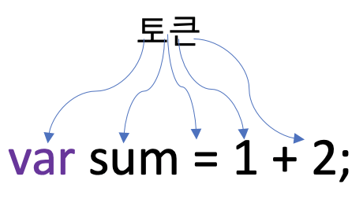

# 5. 표현식과 문

## 5.1 값

**값<sup>value</sup> 은 식(표현식)이 평가되어 생성된 결과를 말한다.** 평가란 식을 해석해서 값을 생성하거나 참조하는 것을 의미한다. 다음 예제의 식은 평가되어 숫자 값 30을 생성한다.

```javascript
// 10 + 20은 평가되어 숫자 값 30을 생성한다.
10 + 20;	// 30
```

모든 값은 데이터 타입을 가지며, 메모리에 2진수, 즉 비트의 나열로 저장된다. 메모리에 저장된 값은 데이터 타입에 따라 다르게 해석될 수 있다. 예를 들어, 메모리에 저장된 값 0100 0001을 숫자로 해석하면 65지만 문자로 해석하면 'A'다.

변수는 **하나의 값**을 저장하기 위해 확보한 메모리 공간 자체 또는 그 메모리 공간을 식별하기 위해 붙인 이름이라고 했다. 따라서 변수에 할당되는 것은 값이다.

값은 다양한 방법으로 생성할 수 있다. 식으로도 생성할 수 있지만 가장 기본적인 방법은 리터럴을 사용하는 것이다.

## 5.2 리터럴

**리터럴<sup>literal</sup> 은 사람이 이해할 수 있는 문자 또는 약속된 기호를 사용해 값을 생성하는 표기법<sup>notation</sup>을 말한다.**

```javascript
// 숫자 리터럴 3
3
```

위 예제에서 3은 단순한 아라비아 숫자가 아니라 숫자 리터럴이다. 사람이 이해할 수 있는 아라비아 숫자를 사용해 숫자 리터럴 3을 코드에 기술하면 자바스크립트 엔진은 이를 평가해 숫자 값 3을 생성한다. 

이처럼 리터럴은 사람이 이해할 수 있는 문자(아라비아 숫자, 알파벳, 한글 등) 또는 미리 약속된 기호('', "", ., [], {}, // 등 )으로 표기한 코드다. 자바스크립트 엔진은 코드가 실행되는 시점인 런타임에 리터럴을 평가해 값을 생성한다. 즉, 리터럴은 값을 생성하기 위해 미리 약속한 표기법이라고 할 수 있다.

리터럴을 사용하면 다음과 같이 다양한 종류의 값을 생성할 수 있다.

| 리터럴             | 예시                                 | 비고                    |
| ------------------ | ------------------------------------ | ----------------------- |
| 정수 리터럴        | 100                                  |                         |
| 부동소수점 리터럴  | 10.5                                 |                         |
| 2진수 리터럴       | 0b01000001                           | 0b로 시작               |
| 8진수 리터럴       | 0o101                                | ES6에서 도입. 0o로 시작 |
| 16진수 리터럴      | 0x41                                 | ES6에서 도입. 0x로 시작 |
| 문자열 리터럴      | 'Hello', 'World'                     |                         |
| 불리언 리터럴      | true, false                          |                         |
| null 리터럴        | null                                 |                         |
| undefined 리터럴   | undefined                            |                         |
| 객체 리터럴        | { name: 'Seol', address: 'Incheon' } |                         |
| 배열 리터럴        | [1, 2, 3]                            |                         |
| 함수 리터럴        | function() {}                        |                         |
| 정규 표현식 리터럴 | /[A-Z]+/g                            |                         |

## 5.3 표현식

**표현식<sup>expression<sup>은 값으로 평가될 수 있는 문<sup>statement</sup>이다. 즉, 표현식이 평가되면 새로운 값을 생성하거나 기존의 값을 참조한다.**

앞서 살펴본 리터럴은 값으로 평가된다. 따라서 리터럴도 표현식이다.

```javascript
var score = 100;
```

위 예제의 100은 리터럴이다. 리터럴 100은 자바스크립트 엔진에 의해 평가되어 값을 생성하므로 리터럴 그 자체로 표현식이다.

```javascript
var score = 50 + 50;
```

50 + 50은 리터럴과 연산자로 이뤄져 있다. 하지만 50 + 50도 평가되어 숫자 값 100을 생성하므로 표현식이다.

```javascript
score; // -> 100
```

변수 식별자를 참조하면 변수 값으로 평가된다. 식별자 참조는 값을 생성하지는 않지만 값으로 평가되므로 표현식이다.

이처럼 표현식은 리터럴 식별자(변수, 함수 등의 이름), 연산자, 함수 호출 등의 조합으로 이뤄질 수 있다. 다음과 같이 다양한 표현식이 있지만 값으로 평가된다는 점에서 모두 동일하다. 즉, **값으로 평가될 수 있는 문은 모두 표현식이다.**

```javascript
// 리터럴 표현식
10
'Hello'

// 식별자 표현식(선언이 이미 존재한다고 가정)
sum
person.name
arr[1]

// 연산자 표현식
10 + 20
sum = 10
sum !== 10

// 함수/메서드 호출 표현식(선언이 이미 존재한다고 가정)
square()
person.getName()
```

표현식은 값으로 평가된다. 이때 표현식과 표현식이 평가된 값은 동등한 관계, 즉 동치<sup>equivalent</sup>다. 예를 들어, 수학 수식 1 + 2 = 3에서 1 + 2는 3과 동치다. 즉, 1 + 2는 3과 같다고 할 수 있다. 자바스크립트의 표현식 1 + 2는 평가되어 값 3을 생성하므로 표현식 1 + 2와 값 3은 동치다. 따라서 표현식은 값처럼 사용할 수 있다. 이것은 문법적으로 값이 위치할 수 있는 자리에는 표현식도 위치할 수 있다는 것을 의미한다.

예를 들어, 산술 연산자 +의 좌항과 우항에는 숫자 값이 위치해야 한다. 이때 숫자 값으로 평가될 수 있는 표현식이라면 숫자 값 대신 사용할 수 있다.

```javascript
var x = 1 + 2;

// 식별자 표현식 x는 3으로 평가된다.
x + 3; // 6
```

위 예제의 x + 3은 표현식이다. + 연산자는 좌항과 우항의 값을 산술 연산하는 연산자이므로 좌항과 우항에는 숫자 값이 위치해야 한다. 이때 좌항 x는 식별자 표현식이다. 즉, x는 할당되어 있는 숫자 값 3으로 평가된다. 따라서 숫자 값이 위치해야 할 자리에 표현식 x를 사용할 수 있다. 이처럼 표현식은 다른 표현식의 일부가 되어 새로운 값을 만들어낼 수 있다.

## 5.4 문

**문<sup>statement</sup>은 프로그램을 구성하는 기본 단위이자 최소 실행 단위다.** 문이 집합으로 이뤄진것이 바로 프로그램이며, 문을 작성하고 순서에 맞게 나열하는 것이 프로그램이이다.

문은 여러 토큰으로 구성된다. **토큰<sup>token</sup>이란 문법적인 의미를 가지며, 문법적으로 더 이상 나눌 수 없는 코드의 기본 요소를 의미한다.** 예를 들어, 키워드, 식별자, 연산자, 리터럴, 세미콜론이나 마침표 등의 특수 기호는 문법적인 의미를 가지며, 문법적으로 더 이상 나눌 수 없는 코드의 기본 요소이므로 모두 토큰이다.



문은 명령문이라고도 부른다. 즉, 문은 컴퓨터에 내리는 명령이다. 문이 실행되면 명령이 실행되고 어떠한 일이 일어난다.

문은 선언문, 할당문, 조건문, 반복문 등으로 구분할 수 있다. 변수 선언문을 실행하면 변수가 선언되고, 할당문을 실행하면 값이 할당된다. 조건문을 실행하면 지정한 조건에 따라 실행할 코드블록이 결정되어 실행되고, 반복문을 실행하면 특정 코드 블록이 반복 실행된다.

```javascript
// 변수 선언문
var x;

// 표현식 문(할당문)
x = 5;

// 함수 선언문
function foo () {}

// 조건문
if (x > 1) { console.log(x); }

// 반복문
for (var i = 0; i < 2; i++) { console.log(i); }
```

## 5.5 세미콜론과 세미콜론 자동 삽입 기능

세미콜론은 문의 종료를 나타낸다. 즉, 자바스크립트 엔진은 세미콜론으로 문이 종료한 위치를 파악하고 순차적으로 하나씩 문을 실행한다. 따라서 문을 끝낼 때는 세미콜론을 붙여야 한다. 단, 0개 이상이 문을 중괄호로 묶은 코드 블록 뒤에는 세미콜론을 붙이지 않는다. 이러한 코드 블록은 언제나 문의 종료를 의미하는 자체 종결성<sup>self closing</sup> 을 갖기 때문이다.

문에 끝에 붙이는 세미콜로은 옵션이다. 즉, 세미콜론은 생략 가능하다. 이는 자바스크립트 엔진이 소스코드를 해석할 때 문의 끝이라고 예측되는 시점에 세미콜론을 자동으로 붙여주는 세미콜론 자동 삽입 기능(ASI<sup>automatic semicolon insertion</sup>)이 암묵적으로 수행되기 때문이다.

하지만 세미콜론 자동 삽입 기능의 동작과 개발자의 예측이 일치하지 않는 경우가 간혹있다.

```javascript
function foo () {
  return
    {}
  // ASI의 동작 결과 => return; {};
  // 개발자의 예측 => return {};
}

console.log(foo()); // undefined

var bar = function () {}
(function() {})();
// ASI의 동작 결과 => var bar = function () {}(function() {})();
// 개발자의 예측 => var bar = function () {}; (function() {})();
// TypeError: (intermediate value)(...) is not a function
```

자동 삽입 기능이 있지만 웬만하면 세미콜론은 문의 끝에 붙여주는 것이 바람직하다.

## 5.6 표현식인 문과 표현식이 아닌 문

표현식은 문의 일부일 수도 있고 그 자체로 문이 될 수도 있다.

```javascript
// 변수 선언문은 값으로 평가될 수 없으므로 표현식이 아니다.
var x;
// 1, 2, 1 + 2, x = 1 + 2는 모두 표현식이다.
// x = 1 + 2는 표현식이면서 완전한 문이기도 하다.
x = 1 + 2;
```

이처럼 표현식과 문은 비슷해서 구별하기 어렵다고 느낄 수 있다. 하지만 표현식과 문을 구별하는 방법은 간단하다.

문에는 표현식인 문과 표현식이 아닌 문이 있다. 표현식인 문은 값으로 평가될수 있는 문이며, 표현식이 아닌 문은 값으로 평가될 수 없는 문이다. 예를 들어, 변수 선언문은 값으로 평가될 수 없다. 따라서 표현식이 아닌 문이다. 하지만 할당문은 값으로 평가되므로 표현식인 문이다.

**표현식인 문과 표현식이 아닌 문을 구별하는 가장 간단하고 명료한 방법은 변수에 할당해 보는 것이다.** 표현식인 문은 값으로 평가되므로 변수에 할당할 수 있다. 하지만 표현식이 아닌 문은 값으로 평가할 수 없으므로 변수에 할당하면 에러가 발생한다.

```javascript
// 표현식이 아닌 문은 값처럼 사용할 수 없다.
var foo = var x; // SyntaxError: Unexpected token var
```

```javascript
// 표현식인 문은 값처럼 사용할 수 있다
var foo = x = 100;
console.log(foo); // 100
```

> ❗️
>
> 완료값
>
> 개발자 도구에서 표현식이 아닌 문을 실행하면 언제나 `undefined` 를 출력한다. 이를 완료 값이라고 한다. 완료 값은 표현식의 평가 결과가 아니다. 따라서 다른 값과 같이 변수에 할당할 수 없고 참조할 수도 없다.

