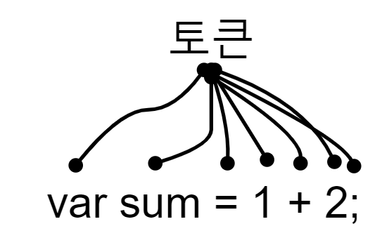

# 2nd

# 4. 변수

### 변수란 무엇인가? 왜 필요한가?

- 컴퓨터는 CPU를 사용해 연산을 하고, 메모리를 사용해 데이터를 기억한다. 메모리란 데이터를 저장할 수 있는 메모리 셀의 집합체다. 메모리 셀 하나의 크기는 1바이트(8비트)이며, 컴퓨터는 메모리 셀의 크기, 즉 1바이트 단위로 데이터를 저장하거나 읽어 들인다.
- CPU가 연산한 값이 메모리에 저장되고 난 후 해당 값에 또다시 접근하기 위해서는 메모리 주소에 직접 접근해야 한다. 이는 치명적인 오류를 발생시킬 가능성이 매우 높다. 따라서 프로그래밍 언어는 기억하고 싶은 값을 저장하고, 저장된 값을 읽어 들여 재사용하기 위해 변수라는 메커니즘을 제공한다.
- **변수란 하나의 값을 저장하기 위해 확보한 메모리 공간 자체 또는 그 메모리 공간을 식별하기 위해 붙인 이름** 을 말한다. 간단히 말하면 변수는 프로그래밍 언어에서 값을 저장하고 참조하는 메커니즘으로, **값의 위치를 가리키는 상징적인 이름**이다. 상징적 이름인 변수는 프로그래밍 언어의 컴파일러 또는 인터프리터에 의해 값이 저장된 메모리 공간의 주소로 치환되어 실행된다. 따라서 개발자는 메모리 주소에 직접 접근하지 않고도 값을 저장하고 참조할 수 있다.
- 메모리 공간에 저장된 값을 식별할 수 있는 고유한 이름을 **변수 이름** 또는 변수명이라 하고 변수에 저장된 값을 **변수 값** 이라 한다.
- 변수 이름은 변수 이름을 통해 변수의 저장된 값의 의미를 명확하게 파악할 수 있게 만드는 것이 중요하다.

### 식별자

- 변수 이름을 식별자라고도 한다. **식별자는 어떤 값을 구별해서 식별할 수 있는 고유한 이름**을 말한다.
- 값은 메모리 공간에 저장되어 있기 때문에 식별자는 메모리 공간에 저장되어 있는 어떤 값을 구별해서 식별해낼 수 있어야 한다. 이를 위해 식별자는 어떤 값이 저장되어 있는 메모리 주소를 기억(저장)해야 한다.
- 즉, 식별자는 값이 저장되어 있는 메모리 주소와 매핑 관계를 맺으며, 이 매핑 정보도 메모리에 저장되어야 한다.
- 이처럼 **식별자는 값이 아닌 메모리 주소를 기억하고 있다.**
- 식별자로 값을 구별해서 식별한다는 것은 식별자가 기억하고 있는 메모리 주소를 통해 메모리 공간에 저장된 값에 접근할 수 있다는 의미다. 다시 말해, 식별자는 메모리 주소에 붙인 이름이라고도 할 수 있다.
- 식별자라는 이름은 변수 뿐만 아니라 클래스, 함수 등의 이름도 모두 식별자다. 다시 말해, 메모리 상의 어떤 값을 식별할 수 있는 이름을 모두 식별자라고 부른다.

### 변수 선언

- 변수를 사용하려면 반드시 선언이 필요하다. 변수를 선언할 때는 `var`, `const,` `let` 키워드를 사용한다.
- 아래와 같은 변수 선언문은 변수 이름을 등록하고 값을 저장할 임의의 메모리 공간을 확보한다.

```javascript
var score;
```

- 변수를 선언한 이후, 변수에 따로 값을 할당하지 않았으니 변수 선언에 의해 확보된 메모리 공간은 비어있을 것이라고 생각할 수 있으나 확보된 메모리 공간에는 자바스크립트 엔진에 의해 `undefined` 값이 암묵적으로 할당된다.
- 자바스크립트 엔진은 변수 선언을 다음과 같은 2단계에 거쳐 수행한다.
  - 선언 단계: 변수 이름을 등록해서 자바스크립트 엔진에 변수의 존재를 알린다.
  - 초기화 단계: 값을 저장하기 위한 메모리 공간을 확보하고 암묵적으로 `undefined` 를 할당해 초기화한다.
- 선언을 하지 않고 변수뿐만 아니라 모든 식별자(함수, 클래스 등)를 참조하려고 하면 참조 에러 `ReferenceError` 가 발생한다. `ReferenceError` 는 식별자를 통해 값을 참조하려 했지만 자바스크립트 엔진이 등록된 식별자를 찾을 수 없을 때 발생하는 에러다.

### 변수 선언의 실행 시점과 변수 호이스팅

```javascript
console.log(score); // undefined

var score; // 변수 선언문
```

- 위 코드는 변수 선언문보다 변수를 참조하는 코드가 앞에 있다. 직관적으로 생각해보면 변수가 선언되기 이전에 참조를 했으므로 `ReferenceError` 가 발생할 것으로 보이지만 자바스크립트 엔진은 `ReferenceError` 를 발생시키지 않고 `undefined` 를 출력한다.
- 그 이유는 **변수 선언이 소스코드가 한 줄씩 순차적으로 실행되는 시점, 즉 런타임이 아니라 그 이전 단계에서 먼저 실행되기 때문이다.**
- 자바스크립트 엔진은 소스코드를 한 줄씩 순차적으로 실행하기에 앞서 먼저 소스코드의 평가 과정을 거치며 소스코드를 실행하기 위한 준비를 한다.
- 이때 자바스크립트 엔진은 소스코드 평가 과정에서 변수 선언을 포함한 모든 선언문을 소스코드에서 찾아 먼저 실행한다. 그리고 소스코드 평가과정이 끝나면 비로소 변수 선언문을 포함한 모든 선언문을 제외하고 소스코드를 한 줄씩 순차적으로 실행한다.
- 즉, 자바스크립트 엔진은 변수 선언이 소스코드의 어디에 있든 상관없이 다른 코드보다 먼저 실행한다. 따라서 변수 선언이 소스코드 어디에 위치하는지와 상관없이 어디서든 변수를 참조할 수 있다.
- 이처럼 **변수 선언문이 코드의 선두로 끌어 올려진 것처럼 동작하는 자바스크립트 고유의 특징을 변수 호이스팅**이라 한다.
- 변수 선언뿐 아니라, `var`, `let`, `const`, `function`, `function*`, `class` 키워드를 사용해 선언하는 모든 식별자는 호이스팅된다.

### 값의 할당

- 자바스크립트 엔진은 변수 선언과 값의 할당의 실행 시점이 다르다. 
- **변수 선언은 소스코드가 순차적으로 실행되는 시점인 런타임 이전에 먼저 실행되지만 값의 할당은 소스코드가 순차적으로 실행되는 시점인 런타임에 실행된다.**
- 변수를 선언하는 것은 런타임 이전에 먼저 실행된다. 따라서 변수의 값은 자바스크립트 엔진에 의해 암묵적으로 할당된 `undefined` 가 할당된다. 그 후에 런타임 상황에서 변수에 값을 할당하면 할당한 값이 `undefined` 의 값을 덮어쓰는 것이 아니라 새로운 메모리 공간을 확보하고 그곳에 값을 저장한다.

### 값의 재할당

- `var` 키워드로 선언한 변수는 값을 재할당할 수 있다. 엄밀히 말하면 `var` 키워드로 선언한 변수는 선언과 동시에 `undefined` 로 초기화되기 때문에 변수에 처음으로 값을 할당하는 것도 재할당하는 것이다.
- 재할당은 변수에 저장된 값을 다른 값으로 변경한다. 그래서 "변할 수 있는 수" 변수라고 한다.
- **만약 값을 재할당할 수 없어서 변수에 저장된 값을 변경할 수 없다면 변수가 아니라 상수라고 한다.**
- 상수는 단 한번만 할당할 수 있는 변수다.
- 재할당도 마찬가지로 이전 값이 저장되어 있던 메모리 공간을 지우고 그 메모리 공간에 재할당하는 값을 저장하는 것이 아니라 새로운 메모리 공간을 확보하고 그 메모리 공간에 새로운 값을 저장한다.
- 이렇게 재할당을 하고 나면 원래의 값과 초기화 과정에서 할당된 `undefined` 는 아무런 식별자와도 연결되어 있지 않다. 자바스크립트 엔진은 이러한 불필요한 값들은 가비지 컬렉터에 의해 메모리에서 자동 해제를 해줌으로써 메모리 누수를 방지한다.

----

# 5. 표현식과 문

### 값

- 값은 식(표현식)이 평가되어 생성된 결과를 말한다.
- 변수는 **하나의 값** 을 저장하기 위해 확보한 메모리 공간 자체 또는 그 메모리 공간을 식별하기 위해 붙인 이름이다.
- 값은 다양한 방법으로 생성할 수 있지만 가장 기본적인 방법은 리터럴을 사용하는 것이다.

### 리터럴

- 리터럴은 사람이 이해할 수 있는 문자 또는 약속된 기호를 사용해 값을 생성하는 표기법을 말한다.
- 자바스크립트 엔진은 코드가 실행되는 시점인 런타임에 리터럴을 평가해 값을 생성한다. 즉, 리터럴은 값을 생성하기 위해 미리 약속한 표기법이라고 할 수 있다.

### 표현식

- **표현식은 값으로 평가될 수 있는 문이다. 즉, 표현식이 평가되면 새로운 값을 생성하거나 기존의 값을 참조한다.**

- 표현식은 리터럴, 식별자(변수, 함수 등의 이름), 연산자, 함수 호출 등의 조합으로 이뤄질 수 있다.

- 다음과 같이 다양한 표현식이 있지만 값으로 평가되는 점에서 모두 동일하다. 즉, **값으로 평가될 수 있는 문은 모두 표현식이다.**

  ```javascript
  // 리터럴 표현식
  10
  'Hello'
  
  // 식별자 표현식(선언이 이미 존재한다고 가정)
  sum
  person.name
  arr[1]
  
  // 연산자 표현식
  10 + 20
  sum = 10
  sum !== 10
  
  // 함수/메서드 호출 표현식(선언이 이미 존재한다고 가정)
  square()
  person.getName()
  ```

### 문

- **문<sup>statement</sup> 은 프로그램을 구성하는 기본 단위이자 최소 실행 단위다.** 문의 집합으로 이뤄진 것이 바로 프로그램이며, 문을 작성하고 순서에 맞게 나열하는 것이 프로그래밍이다.

- 문은 여러 토큰으로 구성된다. **토큰<sup>token</sup> 이란 문법적인 의미를 가지며, 문법적으로 더 이상 나눌 수 없는 코드의 기본 요소를 의미한다.**

  

- 문은 선언문, 조건문, 할당문, 반복문 등으로 구분할 수 있다.

### 표현식인 문과 표현식이 아닌 문

- 표현식은 문의 일부일 수도 있고 그 자체로 문이 될 수도 있다.

  ```javascript
  // 변수 선언문은 값으로 평가될 수 없으므로 표현식이 아니다.
  var x;
  // 1, 2, 1 + 2, x = 1 + 2는 모두 표현식이다.
  // x = 1 + 2는 표현식이면서 완전한 문이기도 하다.
  x = 1 + 2;
  ```

- 표현식과 표현식이 아닌 문을 구별하는 간단하고 명료한 방법은 변수에 할당해 보는 것이다.

----

# 6. 데이터 타입

- 자바스크립트의 모든 값은 데이터 타입을 갖는다. 자바스크립트는 7개의 데이터 타입을 제공한다. 7개의 타입은 원시 타입과 객체 타입으로 구분할 수 있다.

- 원시 타입으로는 숫자<sup>number</sup> , 문자열<sup>string</sup>, 불리언<sup>boolean</sup>, `undefined` 타입, `null` 타입, 심벌<sup>symbol</sup> 타입이 있고

  객체 타입으로는 객체, 함수, 배열 등이 있다.

### 숫자 타입

자바스크립트는 C나 자바와는 달리 하나의 숫자 타입만 존재한다.

ECMAScript 사양에 따르면 숫자 타입의 값은 배정밀도 64비트 부동소수점 형식을 따른다. 즉, 모든 수를 실수로 처리하고 정수를 표현하기 위한 데이터 타입이 따로 존재하지 않는다.

이 말은 즉, 정수로 표시한다 해도 사실은 실수라는 것을 의미한다. 따라서 정수로 표시되는 수끼리 나누더라도 실수가 나올 수 있다.

```javascript
// 숫자 타입은 모두 실수로 처리된다.
console.log(1 === 1.0); // true
console.log(4 / 2);     // 2
console.log(3 / 2);     // 1.5
```

숫자 타입은 추가적으로 세 가지 특별한 값도 표현할 수 있다.

- `Infinity` : 양의 무한대
- `-Infinity` : 음의 무한대
- `NaN` : 산술 연산 불가

### 문자열 타입

- 문자열 타입은 0개 이상의 16비트의 유니코드 문자(UTF-16)의 집합으로 전세계 대부분의 문자를 표현할 수 있다.

- 자바스크립트의 문자열은 원시 타입이며, 변경 불가능한 값이다.

### 템플릿 리터럴

- 템플릿 리터럴은 멀티라인 문자열, 표현식 삽입, 태그드 템플릿 등 편리한 문자열 처리 기능을 제공한다. 템플릿 리터럴은 런타임에 일반 문자열로 변환되어 처리된다.

- 템플릿 리터럴은 일반적인 따옴표 대신 백틱(\``)을 사용해 표현한다.

### undefined 타입

- `var` 키워드로 선언한 변수는 자바스크립트 엔진이 암묵적으로 `undefined` 로 초기화한다. 
- 변수를 선언한 이후 값을 할당하지 않은 변수를 참조하면 `undefined` 가 반환된다. 이처럼 `undefined` 는 개발자가 의도적을 할당하기 위한 값이 아니라 자바스크립트 엔진이 변수를 초기화할 때 사용하는 것이다. 변수를 참조했을 때 `undefined` 가 반환되면 변수가 선언된 이후 할당된 적이 없는 변수라는 것을 알 수 있다.
- 그렇기 때문에 개발자가 의도적으로 변수에 `undefined` 를 할당하는 것은 바람직하지 않은 방법이다.

### null 타입

- '값이 없음'을 의도적으로 명시하기 위해서는 `undefined` 가 아니라 `null` 을 사용해야 한다.
- 변수에 `null` 을 할당하는 것은 변수가 이전에 참조하던 값을 더 이상 참조하지 않겠다는 의미다. 이는 이전에 할당되어 있던 값에 대한 참조를 명시적으로 제거하는 것을 의미하고 자바스크립트 엔진은 누구도 참조하지 않는 메모리 공간에 대해서 가비지 컬렉션을 수행할 것이다.
- 함수가 유효한 값을 반환할 수 없는 경우 명시적으로 `null` 을 반환하기도 한다.

### 심벌 타입

- 심벌은 ES6에서 추가된 7번쨰 타입으로 변경 불가능한 원시 타입의 값이다.
- 심벌은 다른 값과 중복되지 않는 유일무이한 값이다. 따라서 주로 이름이 충돌할 위험이 없는 객체의 유일한 프로퍼티 키를 만들기 위해 사용한다.
- 심벌은 다른 원시값과는 달리 `Symbol` 생성자 함수를 통해 생성한다.

### 데이터 타입의 필요성 

- 자바스크립트 엔진은 데이터 타입, 즉 값의 종류에 따라 정해진 크기의 메모리 공간을 확보한다. 즉, 변수에 할당되는 값의 데이터 타입에 따라 확보해야 할 메모리 공간의 크기가 결정된다.
- 값을 참조할 때는 식별자를 통해 값이 저장되어 있는 메모리 공간의 주소를 찾아갈 수 있다. 엄밀히 말하면 값이 저장되어 있는 메모리 공간의 선두 메모리 셀의 주소를 찾아갈 수 있다.
- 이때 값을 참조하려면 한 번에 읽어 들여야 할 메모리 공간의 크기, 즉 메모리 셀의 개수(바이트 수)를 알아야 한다. 
- 자바스크립트 엔진은 변수에 저장된 값의 타입에 따라 변수를 인식하고 값을 읽어 들인다.
- 그렇게 읽어들인 2진수 값은 타입에 따라 다르게 해석될 수 있다. 
- 즉, 데이터 타입이 필요한 이유는 다음과 같다.
  - 값을 저장할 때 확보해야 하는 **메모리 공간의 크기를 결정**하기 위해
  - 값을 참조할 때 한 번에 읽어 들여야 할 **메모리 공간의 크기를 결정**하기 위해
  - 메모리에서 읽어 들인 **2진수를 어떻게 해석**할지 결정하기 위해

### 동적 타이핑

- C나 자바 같은 **정적 타입 언어** 는 변수를 선언할 때 변수에 할당할 수 있는 값의 종류, 즉 데이터 타입을 사전에 선언해야 한다. 이를 명시적 타입 선언이라 한다.
- 정적 타입 언어는 변수 타입을 변경할 수 없고 변수에 선언한 타입에 맞는 값만 할당할 수 있다.
- 정적 타입 언어는 컴파일 시점에 **타입 체크** (선언한 데이터 타입에 맞는 값을 할당했는지 검사하는 처리)를 수행한다.
- 자바스크립트는 정적 타입 언어와 다르게 변수를 선언할 때 타입을 선언하지 않는다. `var`, `let`, `const` 와 같은 키워드를 사용해 변수를 선언할 뿐이다. 또한 어떠한 데이터 타입의 값이라도 자유롭게 할당할 수 있다.
- **자바스크립트의 변수는 선언이 아닌 할당에 의해 타입이 결정(타입 추론)된다. 그리고 재할당에 의해 변수의 타입은 언제든지 동적으로 변할 수 있다.** 이러한 특징을 **동적 타이핑**이라 하고 자바스크립트를 **동적 타입 언어** 라 한다.
- 그렇다면 변수는 타입을 가질까? 기본적으로 변수는 타입을 갖지 않는다. 하지만 값은 타입을 갖는다. 따라서 현재 변수에 할당되어 있는 값에 의해 변수의 타입이 동적으로 결정된다.
- 자바스크립트의 경우 변수 값은 언제든지 변경될 수 있기 때문에 복잡한 프로그램에서 변화하는 변수의 값을 추적하기 어려울 수 있다. 또한 변수의 타입이 동적으로 변하는 동적 타입 언어의 변수는 값의 변경에 의해 타입도 언제든지 변화할 수 있다.
- 위와 같은 문제를 해결하고 안정적인 프로그램을 만들기 위해서 변수를 사용하기 이전에 데이터 타입을 체크해야 하는 경우가 있는데 매우 번거롭고 코드의 양도 증가한다. 이를 해결하기 위해 TypeScript와 같은 자바스크립트의 Superset을 사용하는 방법이 있고 변수를 사용할 때 다음과 같은 사항을 주의하며 사용해야 한다.
  - 변수는 꼭 필요한 경우에 한해 제한적으로 사용한다. 변수의 개수가 많을수록 오류가 발생할 확률도 높아진다. 따라서 변수의 무분별한 남발은 금물이며, 최소한으로 유지하도록 주의해야 한다.
  - 변수의 스코프(유효 범위)를 최대한 좁게 만들어 변수의 부작용을 억제해야 한다.
  - 전역 변수는 최대한 사용하지 않도록 한다.
  - 변수보다는 상수를 사용해 값의 변경을 억제한다.
  - 변수 이름은 변수의 목적이나 의미를 파악할 수 있도록 네이밍한다.

----

# 7. 연산자

### 산술 연산자

- 이항 산술 연산자는 2개의 피연산자를 산술 연산하여 새로운 값을 만든다. 여기서 모든 이항 산술 연산자는 피연산자의 값을 변경하는 부수 효과가 없고 언제나 새로운 값을 만들어낸다. Ex) `+`, `-`, `*`, `%`, `/` 

- 단항 산술 연산자는 1개의 피연산자를 산술 연산하여 숫자 값을 만든다. 주의할 점은 증가/감소 연산자(`++`, `--`)는 피연산자의 값을 변경하는 부수 효과가 있다. Ex) `++`, `--`, `+`, `-` 

- `+` 연산자 는 피연산자 중 하나 이상이 문자열인 경우 문자열 연결 연산자로 동작한다. 이때 주의해야 할 것은 

  ```javascript
  // 문자열 연결 연산자
  '1' + 2 // -> '12'
  // true는 1로 타입 변환
  1 + true; // -> 2
  ```

  위 예시처럼 암묵적으로 타입이 자동 변환되기고 한다는 것이다. 이를 **암묵적 타입 변환** 또는 **타입 강제 변환**이라고 한다.

### 비교 연산자

- 동등/일치 비교 연산자

  | 비교 연산자 |    의미     |  사례   |               설명                | 부수 효과 |
  | :---------: | :---------: | :-----: | :-------------------------------: | :-------: |
  |     ==      |  동등 비교  | x == y  |        x와 y의 '값'이 같음        |     X     |
  |     ===     |  일치 비교  | x === y |   x와 y의 '값'과 '타입'이 같음    |     X     |
  |     !=      | 부동등 비교 | x != y  |     x와 y의 '값'이 같지 않음      |     X     |
  |     !==     | 불일칠 비교 | x !== y | x와 y의 '값'과 '타입'이 같지 않음 |     X     |

  - **동등 비교(==) 연산자는 좌항과 우항의 피연산자를 비교할 때 먼저 암묵적 타입 변환을 통해 타입을 일치시킨 후 같은 값인지 비교한다.**

  - **일치 비교(===) 연산자는 좌항과 우항의 피연산자가 타입도 같고 값도 같은 경우에 한하여 `true` 를 반환한다.** 일치 비교 연산자에서 주의할 것은 `NaN` 이다. `NaN` 은 유일하게 자기 자신과 일치하지 않는 값이다. 따라서 `NaN` 인지 조사하려면 `isNaN` 함수를 이용해야 한다.

### 삼항 조건 연산자

- 삼항 조건 연산자는 조건식의 결과에 따라 결과값을 다르게 반환한다.

  `조건식 ? 조건식이 true일 때 반환할 값 : 조건식이 false일 때 반환할 값`

  ```javascript
  var result = score >= 60 ? 'Pass' : 'Fail'
  ```

### 연산자의 부수 효과

- 위에서 언급한 연산자 뿐만 아니라 쉼표, 그룹, 지수, typeof, 논리 등의 연산자들은 대부분 부수 효과(값을 변경 시키는 효과)가 없다. 하지만 일부 연산자들은 부수 효과를 일으킨다.
- 부수 효과를 일으키는 연산자는 증감 연산자 (++/--), delete 연산자, 할당 연산자(=)가 있다.

# 8. 제어문

### 1. switch 문

`switch` 문은 주어진 표현식을 평가하며 그 값과 일치하는 표현식을 갖는 `case` 문으로 실행 흐름을 옮긴다.

`switch` 문의 표현식과 일치하는 `case` 문이 없다면 실행 순서는 `default` 문으로 이동한다. `default` 는 `optional` 

```javascript
// 월을 영어로 변환한다. (11 → 'November')
var month = 11;
var monthName;

switch (month) {
  case 1: monthName = 'January';
    break;
  case 2: monthName = 'February';
    break;
  case 3: monthName = 'March';
    break;
  case 4: monthName = 'April';
    break;
  case 5: monthName = 'May';
    break;
  case 6: monthName = 'June';
    break;
  case 7: monthName = 'July';
    break;
  case 8: monthName = 'August';
    break;
  case 9: monthName = 'September';
    break;
  case 10: monthName = 'October';
    break;
  case 11: monthName = 'November';
    break;
  case 12: monthName = 'December';
    break;
  default: monthName = 'Invalid month';
}

console.log(monthName); // November
```

`break` 를 사용하지 않으면 **폴스루**가 발생

> ❗️폴스루
>
> 표현식에 맞는 case문을 실행한 후 switch문을 탈출하지 않고 switch 문이 끝날 때까지 이후의 모든 case 문와 default 문을 실행하는 것

`default` 문에는 `break` 문을 생략하는 것이 일반적이다.

폴스루를 유용하게 활용하는 경우도 있다.

```javascript
var year = 2000; // 2000년은 윤년으로 2월이 29일이다.
var month = 2;
var days = 0;

switch (month) {
  case 1: case 3: case 5: case 7: case 8: case 10: case 12:
    days = 31;
    break;
  case 4: case 6: case 9: case 11:
    days = 30;
    break;
  case 2:
    // 윤년 계산 알고리즘
    // 1. 연도가 4로 나누어떨어지는 해(2000, 2004, 2008, 2012, 2016, 2020...)는 윤년이다.
    // 2. 연도가 4로 나누어떨어지더라도 연도가 100으로 나누어떨어지는 해(2000, 2100, 2200...)는 평년이다.
    // 3. 연도가 400으로 나누어떨어지는 해(2000, 2400, 2800...)는 윤년이다.
    days = ((year % 4 === 0 && year % 100 !== 0) || (year % 400 === 0)) ? 29 : 28;
    break;
  default:
    console.log('Invalid month');
}

console.log(days); // 29
```


