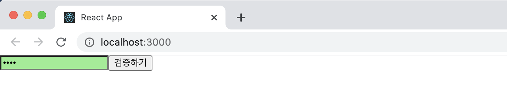

# ref: DOM에 이름 달기

일반 HTML에서 DOM 요소에 이름을 달 때는 id를 사용한다.

```react
<div id="my-element"></div>
```

특정 DOM 요소에 어떤 작업을 해야 할 때 이렇게 요소에 id를 달면 CSS에서 특정 id에 특정 스타일을 적용하거나 자바스크립트에서 해당 id를 가진 요소를 찾아서 작업할 수도 있다. 

이렇게 HTML에서 id를 사용하여 DOM에 이름을 다는 것처럼 리액트 프로젝트 내부에서 DOM에 이름을 다는 방법이 있는데 그것이 바로 ref(reference)개념이다.

> 💬
>
> <b>리액트 컴포넌트 안에서는 id를 사용하면 안되는건가?</b>
>
> 리액트 컴포넌트 안에서도 id를 사용할 수는 있다. JSX 안에서 DOM에 id를 달면 해당 DOM을 렌더링할 때 그대로 전달된다. 하지만 특수한 경우가 아니라면 권장되지는 않는다. 예를 들어 같은 컴포넌트를 여러 번 사용한다고 가정할 때, HTML에서 id는 유일해야하는데 이런 상황에서는 중복 id를 가진 DOM이 여러 개 생기므로 잘못된 사용이라고 할 수 있다.
>
> ref는 전역적으로 작동하지 않고 컴포넌트 내부에서만 작동하기 때문에 이런문제가 생기지 않는다.
>
> 대부분 id를 사용하지 않고도 원하는 기능을 구현할 수 있지만, 다른 라이브러리나 프레임워크와 함께 id를 사용해야 하는 상황이 발생할 수 있다. 이런 상황에서는 컴포넌트를 만들 때마다 id 뒷부분에 추가 텍스트를 붙여서 (ex: button01, button02, button03 ...) 중복 id가 발생하는 것을 방지해야 한다.

## 5.1 ref는 어떤 상황에서 사용해야 할까?

먼저 ref는 어떤 상황에 사용해야 하는지 제대로 짚고 넘어가보자.

특정 DOM에 작업을 해야할 때 ref를 사용해야 한다는 것은 이미 알고 있다. 하지만 '어떤' 작업을 할 때 ref를 사용해야 할까?

정답은 '<b>DOM을 꼭 직접적으로 건드려야 할 때</b>'이다. 예를 들어 일반 바닐라 자바스크립트 및 jQuery로 만든 웹 사이트에서 검증할 때는 아래와 같이 특정 id를 가진 input에 클래스를 설정해준다.

```html
<html>
  <head>
    <meta charset="utf-8">
    <meta name="viewport" content="width=device-width">
    <title>Example</title>
    <style>
      .success {
        background-color: green;
      }
      .failure {
        background-color: red;
      }
    </style>
    <script>
    	function validate() {
        var input = document.getElementById("password");
        input.className = '';
        if(input.value === "0000") {
          input.className = "success";
        } else {
          input.className = "failure";
        }
      }
    </script>
  </head>
  <body>
    <input type="password" id="password"></input>
  	<button onClick="validate()">Validate</button>
  </body>
</html>
```

하지만 리액트에서 이런 작업은 굳이 DOM에 접근하지 않아도 state를 통해 구현할 수 있다. 

이 장에서는 클래스형 컴포넌트에서 ref를 사용하는 방법을 알아보도록 하자. 함수형 컴포넌트에서 ref를 사용하려면 Hooks를 사용해야 하기 때문에 8장에서 Hooks를 배우면서 실습해보도록 하고 이번 실습을 진행하도록 할 예정이다.

이번 실습은 다음과 같은 흐름으로 진행된다.

> ValidationSample 컴포넌트 만들기 → input에 ref 달기 → 버튼을 누를 때마다 input에 포커스 주기

#### 5.1.1 예제 컴포넌트 생성

아래처럼 ValidationSample.css 파일을 만들어 className의 변화에 따라 다른 배경색을 가질 수 있도록 두 개의 className을 스타일링했고

```react
.success {
  background-color: lightgreen;
}

.failure {
  background-color: lightcoral;
}
```

```react
import React, { Component } from "react";
import "./ValidationSample.css";

class ValidationSample extends Component {
  state = {
    password: "",
    clicked: false,
    validated: false,
  };

  handleChange = (e) => {
    this.setState({
      password: e.target.value,
    });
  };

  handleButtonClick = (e) => {
    this.setState({
      clicked: true,
      validated: this.state.password === "0000",
    });
  };

  render() {
    return (
      <div>
        <input
          type="password"
          value={this.state.password}
          onChange={this.handleChange}
          className={
            this.state.clicked
              ? this.state.validated
                ? "success"
                : "failure"
              : ""
          }
        />
        <button onClick={this.handleButtonClick}>검증하기</button>
      </div>
    );
  }
}

export default ValidationSample;

```

ValidationSample 컴포넌트를 만들어서 App 컴포넌트에서 렌더링을 시켜줬다. 

input에서는 onChange 이벤트가 발생할 때 handleChange 함수를 호출하여 state의 password를 업데이트 시켜줬고, button에서는 onClick 이벤트가 발생하면 handleButtonChange 함수를 호출하여 clicked의 값을 참으로 validated 값을 검증 결과로 설정했다.

input의 className은 버튼을 누르기 전에는 빈 문자열을 전달하여, 버튼을 누른 후에는 검증 결과에 따라 success 또는 failure 값으로 설정하게끔 했다. 이 값에 따라 input의 배경색이 초록색 또는 빨간색으로 나타난다.

#### 5.1.2 DOM을 꼭 사용해야 하는 상황

앞선 예제들에서는 state를 사용하여 우리에게 필요한 기능을 구현했지만, 가끔 state만으로 해결할 수 없는 기능이 있다.

1. 특정 input에 포커스 주기
2. 스크롤 박스 조작하기
3. Canvas 요소에 그림 그리기 등

이때는 어쩔 수 없이 DOM에 직접적을 접근을 해야 하는데, 이를 위해 ref를 사용하게 된다.

## 5.2 ref 사용

ref를 사용하는 방법은 두 가지다. 

#### 5.2.1 콜백 함수를 통한 ref 설정

ref를 만드는 가장 기본적인 방법은 콜백 함수를 사용하는 것이다. ref를 달고자 하는 요소에 ref라는 콜백 함수를 props로 전달해주면 된다. 이 콜백 함수는 ref 값을 파라미터로 전달받고 함수 내부에서 파라미터로 받은 ref를 컴포넌트의 멤버 변수로 설정을 해준다.

```react
<input ref={(ref) => {this.input = ref}} />
```

이렇게 하면 앞으로 this.input은 input 요소의 DOM을 가리키게 된다. 또한 ref의 이름은 원하는 것으로 자유롭게 지정할 수 있다

#### 5.2.2 createRef를 통한 ref 설정

ref를 만드는 또 다른 방법은 리액트에 내장되어 있는 createRef라는 함수를 사용하는 것이다. 이 하수를 사용해서 만들면 더 적은 코드로 쉽게 사용할 수 있다. 이 기능은 리액트 v16.3부터 도입됐다.

```react
import React, {Component} from "react";

class RefSample extends Component {
  input = React.createRef();

	handleFocus = () => {
    this.input.current.focus();
  }
  
  render() {
    return (
    	<div>
      	<input ref={this.input} />
      </div>
    );
  }
}

export default RefSample;
```

createRef를 사용하여 ref를 만들려면 우선 컴포넌트 내부에서 멤버 변수로 React.createRef()를 담아주어야 한다. 그리고 해당 멤버 변수를 ref를 달고자 하는 요소에 ref props로 넣어주면 ref 설정이 완료된다.

설정한 뒤 나중에 ref를 설정해준 DOM에 접근하려면 this.input.current를 조회하면 된다. 콜백함수를 사용할 때와 다른 점은 이렇게 뒷부분에 .current를 넣어 주어야 한다는 것이다.

#### 5.2.3 적용

앞서 만든 ValidationSample 컴포넌트의 렌더링 결과를 보게 되면 아래처럼 input 요소에 포커스가 되어 텍스트 커서가 깜빡이는 걸 볼 수 있다.


버튼을 누르게 되면 success든 faliure든 배경색이 바뀌게 되고 input 요소에 텍스트 커서가 깜빡이지 않는 것(포커스 x)을 확인할 수 있다.



버튼을 한 번 눌렀을 때 포커스가 input 쪽으로 자동으로 넘어가도록 코드를 작정해보자.

위에서 배운대로 콜백 함수를 이용해 ValidationSample 컴포넌트에 ref를 달아보면 아래처럼 작성할 수 있다.

```react
(...)
 		<input 
 			ref={(ref) => {this.input = ref}}
			(...)
    />
```

그 다음으로 버튼에 onClick 이벤트가 발생했을 때 input에 포커스를 주도록 코드를 아래와 같이 수정한다.

```react
handleButtonClick = (e) => {
  this.setState({
    clicked: true,
    validated: this.state.password === "0000"
  });
  this.input.focus();
}
```

this.input이 컴포넌트 내부의 input 요소를 가리키고 있으니, 일반 DOM을 다루듯이 코드를 작성하면 된다.

결과를 보게 되면 아래와 같이 포커스가 옮겨진 것을 확인 할 수 있다.


