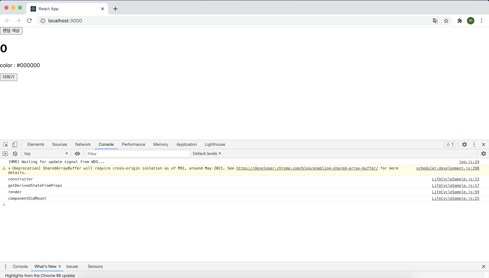
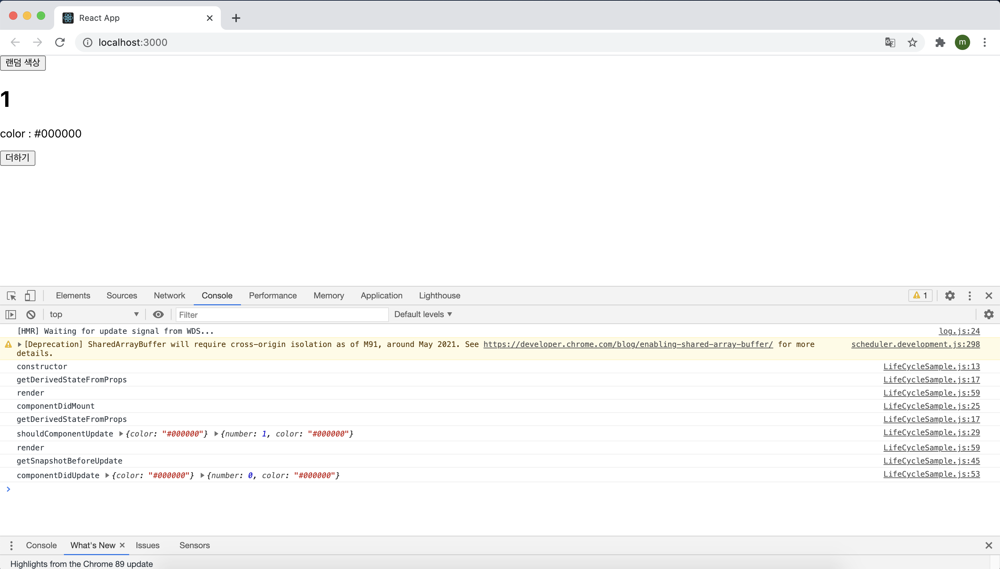
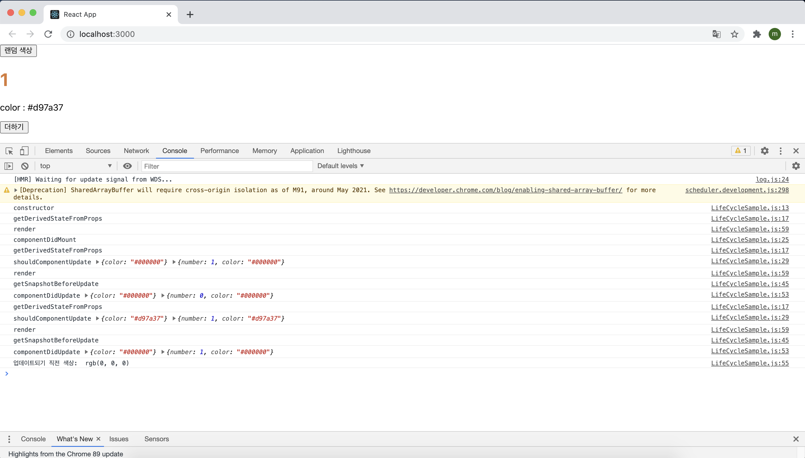
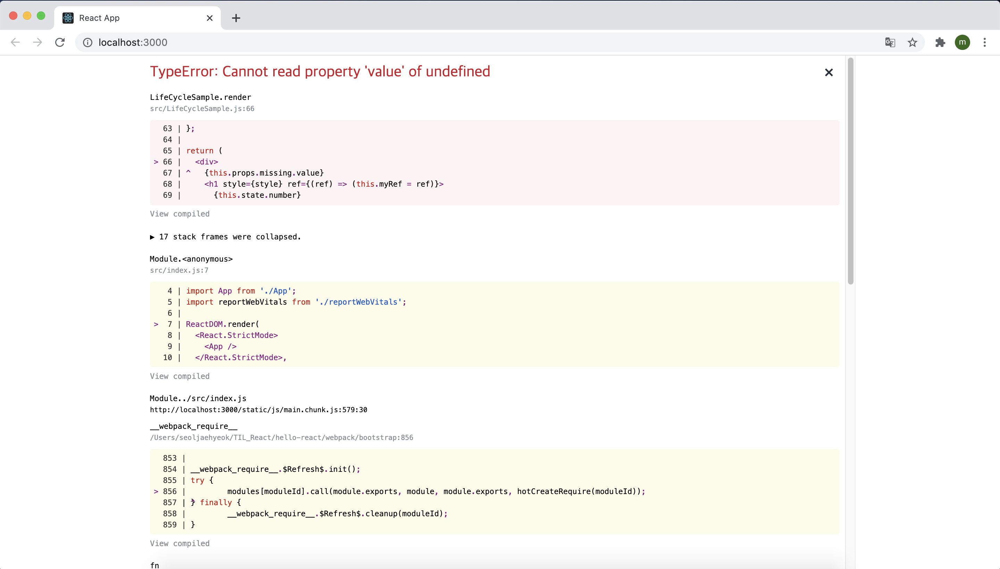
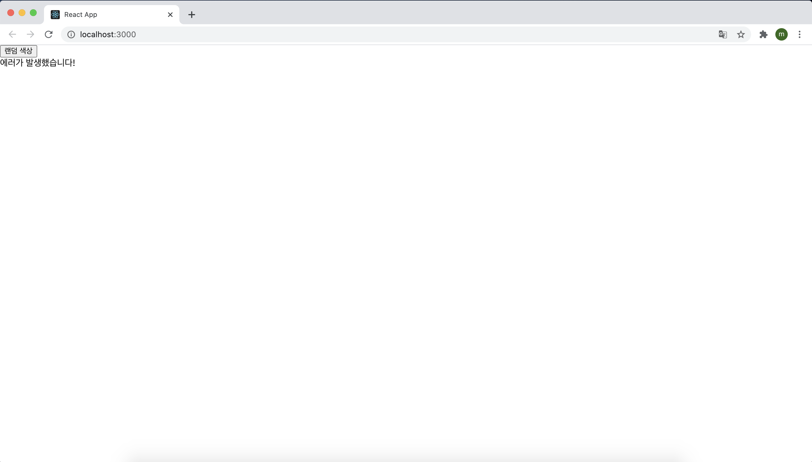
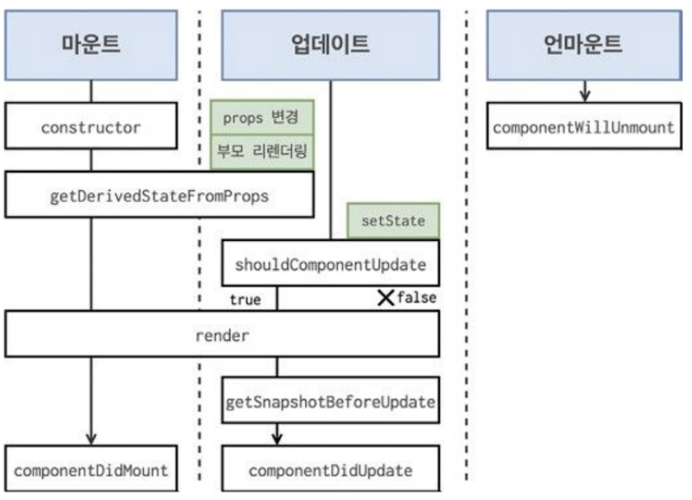

# 컴포넌트의 라이프사이클 메서드

모든 리액트 컴포넌트에는 라이프사이클(수명주기)가 존재한다. 컴포넌트의 수명은 페이지에 렌더링되기 전인 준비 과정에서 시작하여 페이지가 사라질 때 끝이 난다.

리액트 프로젝트를 진행하다 보면 가끔 컴포넌트를 처음으로 렌더링할 때 어떤 작업을 처리해야 하거나 컴포넌트를 업데이트하기 전후로 어떤 작업을 처리해야 할 수도 있고, 불필요한 업데이트를 방지해야 할 수도 있다.

이때 사용하는 것이 컴포넌트의 라이프사이클 메서드이다. 참고로 라이프사이클 메서드는 클래스형 컴포넌트에서만 사용할 수 있고 함수형 컴포넌트는 Hooks를 사용하여 비슷한 작업을 처리할 수 있다.

## 7.1 라이프사이클 메서드의 이해

라이프사이클 메서드의 종류는 총 아홉가지다.

<b>Will</b> 접두사가 붙은 메서드는 어떤 작업을 작동하기 <b>전</b>에 실행되는 메서드이고, <b>Did</b> 접두사가 붙은 메서드는 어떤 작업을 작동한 <b>후</b>에 실행되는 메서드이다.이 메서드들은 우리가 컴포넌트 클래스에서 덮어 써 선언함으로써 사용할 수 있다. 

라이프사이클은 총 세 가지, 즉 마운트, 업데이트, 언마운트 카테고리로 나뉜다.

1. 마운트

   DOM이 생성되고 웹 브라우저상에 나타나는 것을 마운트(mount)라고 한다. 이때 호출하는 메서드는 다음과 같다.

   > 컴포넌트 만들기 → constructor → getDerivedStateFromProps → render → conponentDidMount

   - constructor : 컴포넌트를 새로 만들 때마다 호출되는 클래스 생성자 메서드
   - getDerivedStateFromProps : props에 있는 값을 state에 넣을 때 사용하는 메서드
   - render : 우리가 준비가 UI를 렌더링하는 메서드
   - componentDidMount : 컴포넌트가 웹 브라우저 상에 나타난 후 호출하는 메서드

2. 업데이트 : 컴포넌트는 다음와 같은 총 네 가지 경우에 업데이트를 한다.

   - props가 바뀔 때 : 컴포넌트에 전달하는 props의 값이 바뀌면 컴포넌트 렌더링이 이뤄진다.
   - state가 바뀔 때 : 컴포넌트 자신이 들고 있는 state가 setState를 통해 업데이트 될 때 컴포넌트 렌더링이 이뤄진다
   - 부모 컴포넌트가 리렌더링될 때 : 자신에게 할당된 props가 바뀌지 않아도, 또는 자신이 들고 있는 state가 바뀌지 않아도, 부모 컴포넌트가 리렌    더링되면 자식 컴포넌트 또한 리렌더링 된다.
   - this.forceUpdate로 강제로 렌더링을 트리거할 때

   위와 같은 경우에서 컴포넌트를 업데이트할 때 다음 메서드를 호출한다.

   > 업데이트를 발생시키는 요인(props 변경, state 변경, 부모 컴포넌트 리렌더링 등) → getDerivedStateFromProps → shouldComponentUpdate → true 반환 시 render 호출, false 반환 시 여기서 작업 취소  → render → getSnapshotBeforeUpdate → 웹 브라우저 상의 실제 DOM 반환 → componentDidUpdate

   - getDerivedStateFromProps : 이 메서드는 마운트 과정에서도 호출되며, 업데이트가 시작하기 전에도 호출된다. props의 변화에 따라 state 값에도 변화를 주고 싶을 때 사용한다.
   - shouldComponentUpdate : 컴포넌트가 리렌더링 해야 할지 말아야 할지를 결정하는 메서드이다. true가 반환되면 다음 라이프사이클 메서드를 계속 실행하고, false를 반환하면 작업을 중지 즉, 리렌더링을 하지 않는다. 만약 특정 함수에서 this.forceUpdate() 함수를 호출한다면 이 과정을 생략하고 바로 render함수를 호출한다.
   - render : 컴포넌트를 리렌더링한다.
   - getSnapshotBeforeUpdate : 컴포넌트 변화를 DOM에 반영하기 바로 직전에 호출하는 메서드
   - componentDidMount : 컴포넌트의 업데이트 작업이 끝난 후 호출하는 메서드

3. 언마운트 : 마운트의 반대 과정, 즉 컴포넌트를 DOM에서 제거하는 것을 언마운트(unmount)라고 한다.

   > 언마운트하기 → componentWillUnmount

   - componentWillUnmount : 컴포넌트가 웹 브라우저 상에서 사라지기 전에 호출하는 메서드

## 7.2 라이프사이클 메서드 살펴보기

#### 7.2.1 render() 함수

이 메서드는 컴포넌트의 모양새를 정의한다. 가장 중요한 메서드이기도 하기에 라이프사이클 메서드 중 유일한 필수 메서드이기도 하다.

이 메서드 안에서 this.props와 this.state에 접근할 수 있으며, 리액트 요소를 반환한다. 요소는 div 같은 태그가 될 수도 있고, 따로 선언한 컴포넌트가 될 수도 있다. 아무것도 보여주고 싶지 않다면 null 값이나 false 값을 반환하면 된다.

> ❗️
>
> 이 메서드 안에서는 이벤트 설정이 아닌 곳에서 setState를 사용하면 안되며, 브라우저의 DOM에 접근해서도 안된다.
>
> DOM 정보를 가져오거나 state에 변화를 줄 때는 componentDidMount에서 처리해야 한다.

#### 7.2.2 constructor 메서드

컴포넌트의 생성자 메서드로 컴포넌트를 만들 때 처음으로 실행된다. 이 메서드에서는 초기 state를 정할 수 있다.

#### 7.2.3 getDerivedStateFromProps 메서드

리액트 v16.3 이후에 새로 만든 라이프사이클 메서드이다. props로 받아 온 값을 state에 동기화시키는 용도로 사용하며, 컴포넌트가 마운트될 때와 업데이트될 때 호출된다.

```react
static getDerivedStateFromProps(nextProps, prevState) {
  if(nextProps.value !== prevState.value) { // 조건에 따라 특정 값 동기화
    return {value : nextProps.value};
  }
  return null; // state를 변경할 필요가 없다면 null 반환 
}
```

#### 7.2.4 componentDidMount 메서드

컴포넌트를 만들고, 첫 렌더링을 다 마친 후 실행한다. 이 안에서 다른 자바스크립트 라이브러리 또는 프레임워크의 함수를 호출하거나 이벤트 등록, setTimeout, setInterval, 네트워크 요청 같은 비동기 작업을 처리하면 된다.

#### 7.2.5 shouldComponentUpdate 메서드

이것은 props 또는 state를 변경했을 때, 리렌더링을 시작할지 여부를 지정하는 메서드이다. 이 메서드에서는 반드시 true or false 값을 반환해야 한다. 

이 메서드 안에서 현재 props와 state는 this.props와 this.state로 접근하고, 새로 설정될 props 또는 state는 nextProps와 nextState로 접근할 수 있다.

#### 7.2.6 getSnapshotBeforeUpdate 메서드

리액트 v16.3 이후에 만든 메서드다. 이 메서드는 render에서 만들어진 결과물이 브라우저에 실제로 반영되기 직전에 호출된다.

이 메서드에서 반환하는 값은 componentDidUpdate에서 세 번째 파라미터인 snapshot 값으로 전달받을 수 있는데 주로 업데이트하기 직전의 값을 참고할 일이 있을 때 활용된다. (예 : 스크롤바 위치 유지)

```react
getSnapshotBeforeUpdate(prevProps, prevState) {
  if(prevState.array !== this.state.array) {
    const { scrollTop, scrollHeight } = this.list;
    return { scrollTop, scrollHeight };
  }
}
```

#### 7.2.7 componentDidUpdate 메서드

이것은 리렌더링을 완료한 후 실행한다. 업데이트가 끝난 직후이므로 DOM 관련 처리를 해도 무방하다. 여기서는 prevProps 또는 prevState를 사용하여 컴포넌트가 이전에 가졌던 데이터에 접근할 수 있다. 

또 getSnapshotBeforeUpdate에서 반환한 값이 있다면 여기서 snapshot 값을 전달받을 수 있다.

#### 7.2.8 componentWillUnmount 메서드

이것은 컴포넌트를 DOM에서 제거할 때 실행한다. componentWillUnmount에서 등록한 이벤트, 타이머, 직접 생성한 DOM이 있다면 여기서 제거 작업을 해야 한다.

#### 7.2.9 componentDidCatch 메서드

componentDidCatch 메서드는 v16에서 새롭게 도입되었으며, 컴포넌트 렌더링 도중에 에러가 발생했을 때 애플리케이션이 먹통이 되지 않고 오류 UI를 보여 줄 수 있게 해준다. 사용법은 다음과 같다.

```react
componentDidCatch(error, info) {
  this.setState({
    error: true,
  });
  console.log({error, info});
}
```

여기서 error는 파라미터에 어떤 에러가 발생했는지 알려 주며, info 파라미터는 어디에 있는 코드에서 오류가 발생했는지에 대한 정보를 준다.

앞의 코드에서는 그저 console.log만 했지만, 나중에 실제로 사용할 때 오류가 발생하면 서버 API를 호출하여 따로 수집할 수도 있다.

그러나 이 메서드를 사용할 때는 컴포넌트 자신에게 발생하는 에러를 잡아낼 수 없고, 자신의 this.props.children으로 전달되는 컴포넌트에서 발생하는 에러만 잡아낼 수 있다는 점을  알아야한다.

## 7.3 라이프사이클 메서드 사용하기

라이프사이클 실습은 다음과 같은 흐름으로 진행될 예정이다.

> LifrCycleSample 컴포넌트 만들기 → App에 렌더링하기 → 버튼 누르고 콘솔창 관찰하기

#### 7.3.1 예제 컴포넌트 생성

예제 컴포넌트 LifeCycleSample을 만들었다.

```react
import React, { Component } from "react";

class LifeCycleSample extends Component {
  state = {
    number: 0,
    color: null,
  };

  myRef = null; // ref를 설정할 부분

  constructor(props) {
    super(props);
    console.log("constructor");
  }

  static getDerivedStateFromProps(nextProps, prevState) {
    console.log("getDerivedStateFromProps");
    if (nextProps.color !== prevState.color) {
      return { color: nextProps.color };
    }
    return null;
  }

  componentDidMount() {
    console.log("componentDidMount");
  }

  shouldComponentUpdate(nextProps, nextState) {
    console.log("shouldComponentUpdate", nextProps, nextState);
    // 숫자의 마지막 자리가 4면 리렌더링하지 않는다.
    return nextState.number % 10 !== 4;
  }

  componentWillUnmount() {
    console.log("componentWillUnmount");
  }

  handleClick = () => {
    this.setState({
      number: this.state.number + 1,
    });
  };

  getSnapshotBeforeUpdate(prevProps, prevState) {
    console.log("getSnapshotBeforeUpdate");
    if (prevProps.color !== this.props.color) {
      return this.myRef.style.color;
    }
    return null;
  }

  componentDidUpdate(prevProps, prevState, snapshot) {
    console.log("componentDidUpdate", prevProps, prevState);
    if (snapshot) {
      console.log("업데이트되기 직전 색상: ", snapshot);
    }
  }
  render() {
    console.log("render");

    const style = {
      color: this.props.color,
    };

    return (
      <div>
        <h1 style={style} ref={(ref) => (this.myRef = ref)}>
          {this.state.number}
        </h1>
        <p>color : {this.state.color}</p>
        <button onClick={this.handleClick}>더하기</button>
      </div>
    );
  }
}

export default LifeCycleSample;
```

이 컴포넌트는 각 라이프사이클 메서드를 실행할 때마다 콘솔 디버거에 기록하고, 부모 컴포넌트에서 props로 색상을 받아 버튼을 누르면 state.number 값을 1씩 더한다.

getDerivedStateFromProps는 부모에게서 받은 color 값을 state에 동기화하고 있다. 그리고 getSnapshotBeforeUpdate는 DOM에 변화가 일어나기 직전의 색상 속성을 snapshot 값으로 반환하여 이것을 componentDidUpdate에서 조회할 수 있게 했다.

추가로 shouldComponentUpdate 메서드에서 state.number 값의 마지막 자리 수가 4이면(예: 4, 14, 24, 34) 리렌더링을 취소하도록 설정했다.

#### 7.3.2 App 컴포넌트에서 예제 컴포넌트 사용

App.js 파일을 다음과 같이 수정해줬다.

```react
import React, { Component } from "react";
import LifeCycleSample from "./LifeCycleSample";

// 랜덤 색상을 생성
function getRandomColor() {
  return "#" + Math.floor(Math.random() * 16777215).toString(16);
}

class App extends Component {
  state = {
    color: "#000000",
  };

  handleClick = () => {
    this.setState({
      color: getRandomColor(),
    });
  };

  render() {
    return (
      <div>
        <button onClick={this.handleClick}>랜덤 색상</button>
        <LifeCycleSample color={this.state.color} />
      </div>
    );
  }
}

export default App;
```

getRandomColor 함수는 state의 color 값을 랜덤 색상으로 설정한다. 16777215를 hex로 표현하면 ffffff가 되므로 해당 코드는 000000부터 ffffff 값을 반환한다.

버튼을 렌더링하고, 누를 때마다 handleClick 메서드가 호출되게 이벤트를 설정하며, 불러온 LifeCycleSample 컴포넌트에 color 값을 props로 설정한다. 코드를 저장하면 다음과 같은 화면이 나타난다. 



더하기 버튼을 누르면 다음과 같은 화면이 나타난다.



랜덤 색상 버튼을 누르면 다음과 같은 화면이 나타난다.




#### 7.3.3 에러 잡아내기

방금 만든 LifeCycleSample 컴포넌트의 render 함수에서 의도적으로 에러를 한번 발생시켜 보자

render 함수에서의 에러는 주로 존재하지 않는 함수를 사용하려고 하거나, 존재하지 않는 객체의 값을 조회하려고 할 때 발생한다.

```react
render() {
    console.log("render");

    const style = {
      color: this.props.color,
    };

    return (
      <div>
        {this.props.missing.value}
        <h1 style={style} ref={(ref) => (this.myRef = ref)}>
          {this.state.number}
        </h1>
        <p>color : {this.state.color}</p>
        <button onClick={this.handleClick}>더하기</button>
      </div>
    );
  }
```

위 코드와 같이 존재하지 않는 props인 missing 객체의 value를 조회해서 렌더링 하게 되면 브라우저에는 다음과 같은 에러가 발생하게 된다.



이렇게 어디에서 에러가 발생했는지 알 수 있는 정보가 나타난 것은 현재 개발 서버를 실행 중이기 때문이다. 해당 페이지의 오른쪽 상단에 있는 x 버튼을 누르면 오류 창이 닫히고 흰 페이지만 남게 된다. 

만약 사용자가 웹 서비스를 실제로 사용할 때 이렇게 흰 화면만 나타나면 어리둥절하게 생각할 것이다. 이럴 때는 에러가 발생했다고 사용자에게 인지 시켜줘야한다. 

지금부터 에러를 잡아 주는 ErrorBoundary라는 컴포넌트를 생성해보자.

```react
import React, { Component } from "react";

class ErrorBoundary extends Component {
  state = {
    error: false,
  };

  componentDidCatch(error, info) {
    this.setState({
      error: true,
    });
    console.log({ error, info });
  }
  render() {
    if (this.state.error) return <div>에러가 발생했습니다!</div>;
    return this.props.children;
  }
}

export default ErrorBoundary;
```

에러가 발생하면 componentDidCatch 메서드가 호출되며, 이 메서드는 this,state.error 값을 업데이트 해준다. 그리고 render 함수는 this.state.error 값이 true라면 에러가 발생했음을 알려 주는 문구를 보여준다.

이제 이 컴포넌트를 사용해 App.js에서 LifeCycleSample 컴포넌트를 감싸보자.

```react
import React, { Component } from "react";
import ErrorBoundary from "./ErrorBoundary";
import LifeCycleSample from "./LifeCycleSample";

// 랜덤 색상을 생성
function getRandomColor() {
  return "#" + Math.floor(Math.random() * 16777215).toString(16);
}

class App extends Component {
  state = {
    color: "#000000",
  };

  handleClick = () => {
    this.setState({
      color: getRandomColor(),
    });
  };

  render() {
    return (
      <div>
        <button onClick={this.handleClick}>랜덤 색상</button>
        <ErrorBoundary>
          <LifeCycleSample color={this.state.color} />
        </ErrorBoundary>
      </div>
    );
  }
}

export default App;
```

이렇게 코드를 작성하고 저장하면 에러가 발생하고 x버튼을 눌러 종료시키면 다음과 같은 화면이 나와 사용자가 에러가 발생했다는 것을 인지할 수 있게 된다.



## 7.4 정리

컴포넌트의 라이프사이클 메서드 흐름을 한눈에 정리해보자



라이프사이클 메서드는 컴포넌트 상태에 변화가 있을 때마다 실행하는 메서드다. 이 메스드들은 서드파티 라이브러리를 사용하거나 DOM을 직접 건드려야 하는 상화에서 유용하다. 추가로 컴포넌트 업데이트의 성능을 개선할 때는 shouldComponentUpdate가 중요하게 사용된다.

