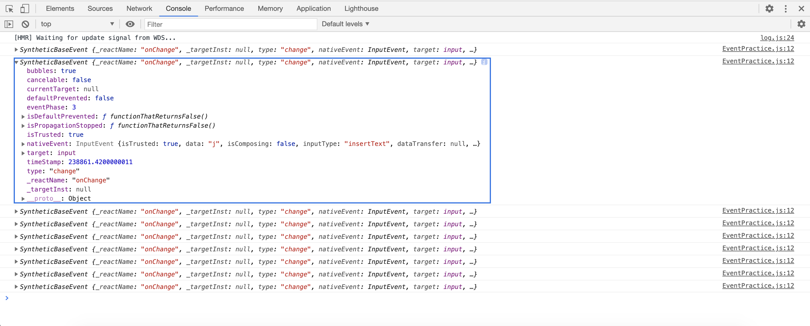
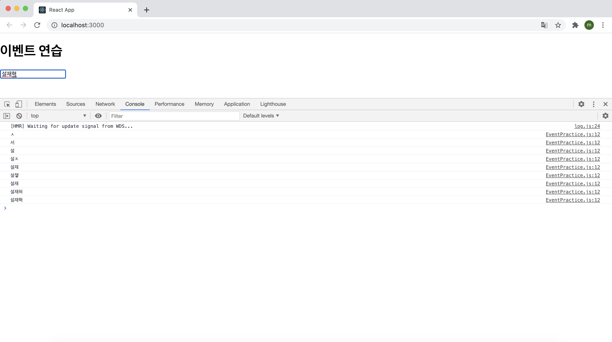

# 2021.03.08

## 4.1 리액트의 이벤트 시스템

리액트의 이벤트 시스템은 웹 브라우저의 HTML 이벤트와 인터페이스가 동일하기 때문에 사용법이 비슷하다. 3장에서 작성한 코드를 다시 살펴보자

```react
import React, { useState } from "react";

const Say = () => {
  const [message, setMessage] = useState("");
  const onClickEnter = () => setMessage("안녕하세요!");
  const onClickLeave = () => setMessage("안녕히가세요!");

  const [color, setColor] = useState("black");
  return (
    <div>
      <button onClick={onClickEnter}>입장</button>
      <button onClick={onClickLeave}>퇴장</button>
      <h1 style={{ color }}>{message}</h1>
      <button style={{ color: "red" }} onClick={() => setColor("red")}>
        빨간색
      </button>
      <button style={{ color: "green" }} onClick={() => setColor("green")}>
        초록색
      </button>
      <button style={{ color: "blue" }} onClick={() => setColor("blue")}>
        파란색
      </button>
    </div>
  );
};

export default Say;
```

사용법은 HTML에서 이벤트 작성하는 것과 비슷하지만 몇가지 주의사항이 있다

#### 4.1.1 이벤트를 사용할 때 주의 사항

1. 이벤트 이름은 카멜 표기법으로 작성한다.

2. 이벤트에 실행할 자바스크립트 코드를 전달하는 것이 아니라, 함수 형태의 값을 전달한다.

   - HTML에서 이벤트 설정할 때는 큰따옴표 안에 실행할 코드를 넣었지만, 리액트에서는 함수 형태의 객체를 전달한다. 화살표 함수 문법으로 바로 만들어서 전달해도 되고, 렌더링 외부에 미리 만들어서 전달해도 된다.

3. DOM 요소에만 이벤트를 설정할 수 있다.

   - 즉 div, button, input, form, span 등의 DOM 요소에는 이벤트를 설정할 수 있지만, 우리가 직접 만든 컴포넌트에는 이벤트를 자체적으로 설정할 수 없다.

   - 예를 들어 아래와 같이 MyComponent에 onClick 값을 설정한다면 MyComponent를 클릭할 때 doSomething 함수를 실행하는 것이 아니라, 그냥 이름이 onClick인 props를 MyComponent에게 전달해줄 뿐이다.

     ```react
     <MyComponent onClick={doSomething} />
     ```

   - 따라서 컴포넌트에 자체적으로 이벤트를 설정할 수 는 없다. 하지만 전달받은 props를 컴포넌트 내부의 DOM 이벤트로 설정할 수는 있다.

     ```react
     <div onClick={this.props.onClick}>
     	{/*(...)*/}
     </div>
     ```

#### 4.1.2 이벤트 종류

리액트에서 지원하는 이벤트 종류는 아래와 같다.

> 💬
>
> - Clipboard
> - Touch
> - Composition
> - UI
> - Keyboard
> - Wheel
> - Focus
> - Media
> - Form
> - Image
> - Mouse
> - Animation
> - Selection
> - Transition

## 4.2 예제로 이벤트 핸들링 익히기

앞으로 실습할 각 단계는 다음과 같다.

> 컴포넌트 생성 및 불러오기 → onChange 이벤트 핸들링하기 → 임의 메서드 만들기 → input 여러 개 다루기 → onKeyPress 이벤트 핸들링하기

#### 4.2.1 컴포넌트 생성 및 불러오기

먼저 클래스형 컴포넌트로 연습할 컴포넌트를 생성했다.

```react
import React, { Component } from "react";

class EventPractice extends Component {
  render() {
    return (
    	<div>
      	<h1>
        	이벤트 연습
        </h1>
      </div>
    )
  }
}

export default EventPractice;
```

#### 4.2.2 onChange 이벤트 핸들링하기

EventPractice 컴포넌트에 input 요소를 렌더링하는 코드와 해당 요소의 onChange 이벤트를 설정하는 코드를 작성한다.

```react
import React, { Component } from "react";

class EventPractice extends Component {
  render() {
    return (
    	<div>
      	<h1>이벤트 연습</h1>
        <input 
          type="text"
          name="message"
          placeholder="아무거나 입력하세요."
          onChange={
          	(e) => console.log(e)  
          }
         />
      </div>
    )
  }
}

export default EventPractice;
```

그런 다음 콘솔을 열고 인풋에 아무거나 입력해보면 콘솔에 이벤트객체가 나타나는 것을 볼 수 있다.



```react
onChange={
  (e) => console.log(e);
}
```

위 코드에서 콘솔에 기록되는 e 객체는 SyntheticEvent로 웹 브라우저의 네이티브 이벤트를 감싸는 객체다. 네이티브 이벤트와 인터페이스가 같으므로 순수 자바스크립트에서 HTML 이벤트를 다룰 때와 동일하게 사용하면 된다.

SyntheticEvent는 네이티브 이벤트와 달리 이벤트가 끝나고 초기화가 되므로 정보를 참조할 수 없다. 예를 들어, 0.5초 뒤에 e 객체를 참조하면 e 객체 내부의 모든 값이 비워지게 된다.

만약 비동기적으로 이벤트 객체를 참조할 일이 있다면 e.persist() 함수를 호출해야 한다.

예를 들어 onChange 이벤트가 발생할 때, 앞으로 변할 인풋 값인 e.target.value를 콘솔에 기록해 보면

```react
onChange={
  (e) => console.log(e.target.value);
}
```

코드를 위와 같이 수정해주고 콘솔을 보게 되면



위 처럼 값이 바뀔 때마다 바뀌는 값을 콘솔에 출력하는 것을 볼 수 있다.

그 다음은 state에 input 값을 담는 것이다.

