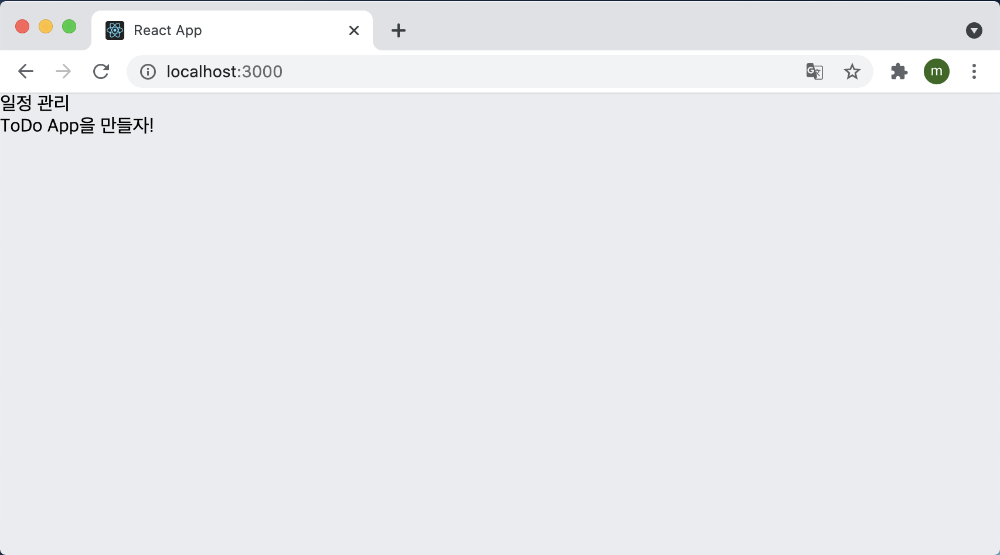
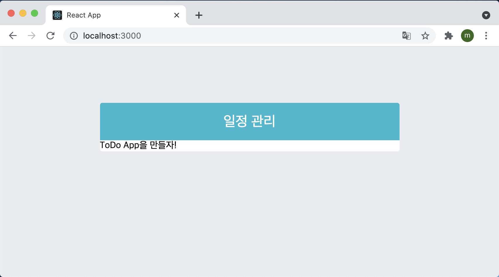
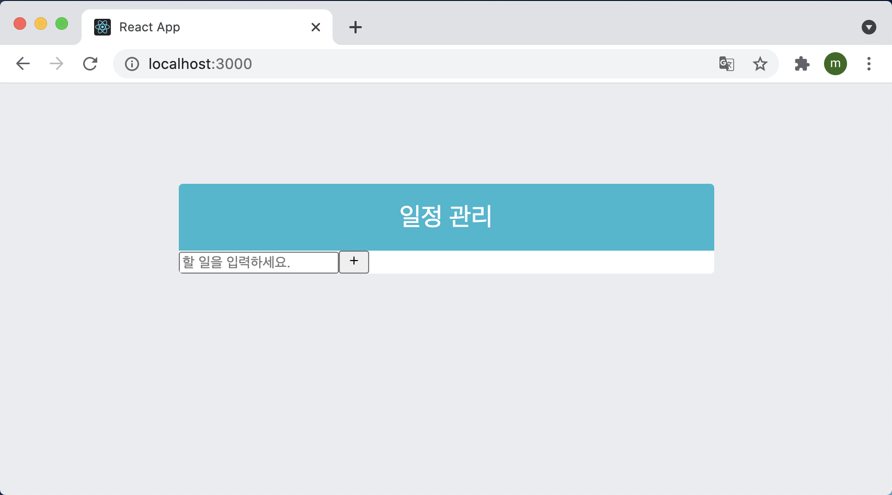
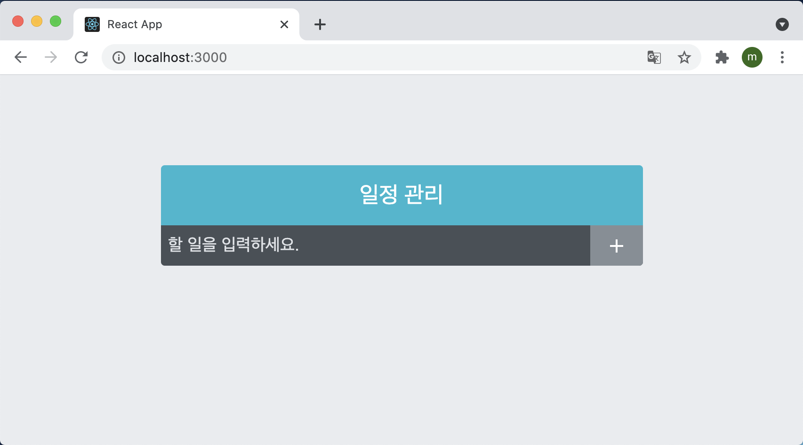
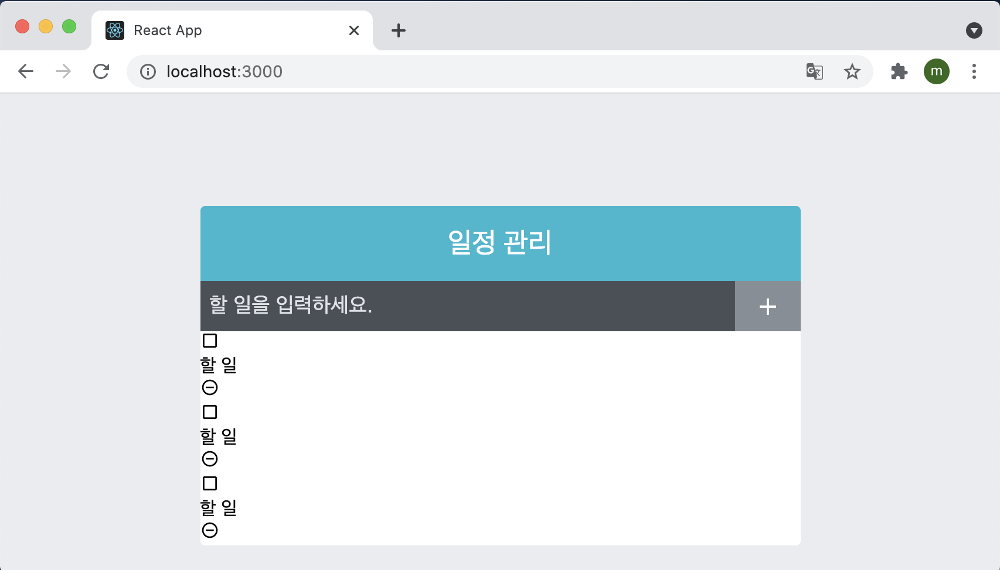
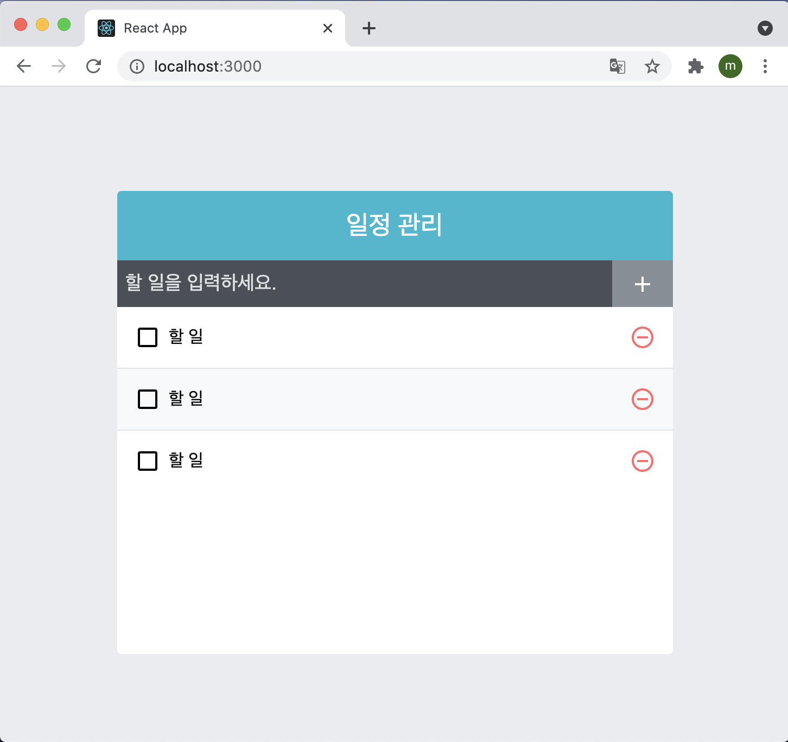

# 일정관리 웹 애플리케이션

지금가지 리액트의 기본에서부터 컴포넌트 스타일링까지 배워봤다. 이제 배운것을 활용해서 프런트엔드를 공부할 때 많이 구현하는 일정관리 애플리케이션을 만들어 보도록 하자.

이번 실습은 다음과 같은 흐름으로 진행된다.

> 프로젝트 준비하기 → UI 구성하기 → 기능 구현하기

## 10.1 프로젝트 준비하기

`$ yarn create react-app todo-app` 을 사용하여 프로젝트를 생성하고 필요한 라이브러리를 설치해줬다.

`$ yarn add node-sass classnames react-icons` 

이 프로젝트에서는 Sass를 사용할 예정이므로 node-sass를 설치해 주었고, classnames는 나중에 조건부 스타일링을 좀 더 편하게 하기 위해 설치했다. react-icons는 리액트에서 다양하고 예쁜 아이콘을 사용할 수 있는 라이브러리다. 아이콘 리스트와 사용법은  [여기](https://react-icons.netlify.com/)	에서 확인할 수 있다. 이 라이브러리의 장점은 SVG형태로 이루어진 아이콘을 리액트 컴포넌트처럼 매우 쉽게 사용할 수 있다는 것이다. 아이콘의 크기나 색상은 props 혹은 CSS 스타일로 변경하여 사용할 수 있다.

그런 다음 프로젝트의 글로벌 스타일 파일이 들어 있는 index.css 파일을 조금 수정했다. 기존에 있던 설정은 지우고 background 속성을 설정했다.

```react
body {
  margin: 0;
  padding: 0;
  background: #e9ecef;
}
```

App 컴포넌트도 아래와 같이 수정해줬다.

```react
import React from "react";

const App = () => {
  return <div>TODO App을 만들자!</div>;
}

export default App;
```

이렇게 하면 프로젝트의 기본적인 준비는 끝났다.

## 10.2 UI 구성하기

앞으로 만들 컴포넌트는 다음과 같다.

1. ToDoTemplate : 화면을 가운데 정렬시켜 주며, 앱 타이틀(일정 관리)를 보여 준다. children으로 내부 JSX를 받아 와서 렌더링해 준다.
2. ToDoInsert : 새로운 항목을 입력하고 추가할 수 있는 컴포넌트. todo 객체를 props로 받아 와서 상태에 따라 다른 스타일의 UI를 보여준다.
3. ToDoListItem : 각 할 일 항목에 대한 정보를 보여 주는 컴포넌트. todo객체를 props로 받아 와서 상태에 따라 다른 스타일의 UI를 보여준다.
4. ToDoList : todos 배열을 props로 받아 온 후, 이를 배열 내장 함수 map을 사용해서 여러 개의 ToDoListItem 컴포넌트로 변환하여 보여준다.

src디렉터리에 components라는 디렉터리를 만들고 그 안에 저장을 할 예정이다.

#### 10.2.1 ToDoTemplate

```react
import React from "react";
import "./ToDoTemplate.scss";

const ToDoTemplate = ({ children }) => {
  return (
    <div className="ToDoTemplate">
      <div className="app-title">일정 관리</div>
      <div className="content">{children}</div>
    </div>
  );
};

export default ToDoTemplate;
```

```react
import "./App.css";
import ToDoTemplate from "./components/ToDoTemplate";

const App = () => {
  return <ToDoTemplate>ToDo App을 만들자!</ToDoTemplate>;
};

export default App;
```

ToDoTemplate.js와 ToDoTemplate.scss 파일을 만든 뒤 위와 같이 작성하여 App에 렌더링 시켜주면 아래와 같은 화면이 나타난다.



그런 다음 아까 만들어둔 ToDoTemplate.scss 파일에서 스타일을 작성한다.

```react
.ToDoTemplate {
  width: 512px;
  // width가 주어진 상태에서 좌우 중앙 정렬
  margin-left: auto;
  margin-right: auto;
  margin-top: 6rem;
  border-radius: 4px;
  overflow: hidden;

  .app-title {
    background: #22b8cf;
    color: white;
    height: 4rem;
    font-size: 1.5rem;
    display: flex;
    align-items: center;
    justify-content: center;
  }

  .content {
    background: white;
  }
}
```

저장하고 화면을 보게 되면 다음과 같은 결과가 나오는 것을 확인할 수 있다.



스타일 속성 중 `display: flex;` 를 많이 사용하게 되는데 flex에 대해 자세히 알아보고 게임을 통해 연습을 하고 싶다면 [여기](http://flexboxfroggy.com/#ko)에서 학습하면 큰 도움이 될 것이다.

#### 10.2.2 ToDoInsert

이번에는 components 디렉터리 안에 ToDoinsert.js 와 ToDoInsert.scss 파일을 만들어 작성해보자.

```react
import React from "react";
import { MdAdd } from "react-icons/md";
import "./ToDoInsert.scss";

const ToDoInsert = () => {
  return (
    <form className="ToDoInsert">
      <input placeholder="할 일을 입력하세요." />
      <button type="submit">
        <MdAdd />
      </button>
    </form>
  );
};

export default ToDoInsert;
```

 ToDoInsert.js에 위와 같이 작성한 뒤 App 컴포넌트에 렌더링 시켜 보면 아래와 같은 화면이 나타난다.



이제 컴포넌트를 스타일링 해보자. ToDoInsert.scss 파일을 아래와 같이 작성한 뒤 브라우저를 확인해 보면 원하는 결과가 잘 출력되는 것을 볼 수 있다.

```scss
.ToDoInsert {
  display: flex;
  background: #495057;
  input {
    // 기본 스타일 초기화
    background: none;
    outline: none;
    border: none;
    padding: 0.5rem;
    font-size: 1.125rem;
    line-height: 1.5;
    color: white;
    &::placeholder {
      color: #dee2e6;
    }
    // 버튼을 제외한 영역을 모두 차지하기
    flex: 1;
  }
  button {
    // 기본 스타일 초기화
    background: none;
    outline: none;
    border: none;
    background: #868e96;
    color: white;
    padding-left: 1rem;
    padding-right: 1rem;
    font-size: 1.5rem;
    display: flex;
    align-items: center;
    cursor: pointer;
    transition: 0.1s background ease-in;
    &:hover {
      background: #abd5bd;
    }
  }
}
```



#### 10.2.3 ToDoListItem, ToDoList

먼저 ToDoListItem 컴포넌트부터 만들어보자.

```react
import React from "react";
import { MdCheckBoxOutlineBlank, MdRemoveCircleOutline } from "react-icons/md";
import "./ToDoListItem.scss";

const ToDoListItem = () => {
  return (
    <div className="ToDoListItem">
      <div className="checkbox">
        <MdCheckBoxOutlineBlank />
        <div className="text">할 일</div>
      </div>
      <div className="remove">
        <MdRemoveCircleOutline />
      </div>
    </div>
  );
};

export default ToDoListItem;
```

이 컴포넌트를 다 작성했으면 ToDoList.js 파일과 ToDoList.scss 파일을 생성하고 ToDoList.js 파일을 아래와 같이 작성한다.

```react
import React from "react";
import ToDoListItem from "./ToDoListItem";
import "./ToDoList.scss";

const ToDoLIst = () => {
  return (
    <div className="ToDoList">
      <ToDoListItem />
      <ToDoListItem />
      <ToDoListItem />
    </div>
  );
};

export default ToDoLIst;
```

지금은 이 컴포넌트에 ToDoListItem을 불러와 별도의 props 전달 없이 그대로 여러 번 보여 주고 있다. UI설계가 끝나고 기능을 추가하여 다양한 데이터를 전달할 예정이다. 컴포넌트를 다 작성했으면 App 컴포넌트에 렌더링 시켜주면 아래와 같은 화면이 나타난다.



이제 여기에 스타일링을 해보자.

처음 스타일링할 컴포넌트는 ToDoList인데 아래와 같이 작성해준다.

```scss
.ToDoList {
  min-height: 320px;
  max-height: 513px;
  overflow: auto;
}
```

그런 다음 ToDoListItem을 아래와 같이 스타일링 해준다.

```scss
.ToDoListItem {
  padding: 1rem;
  display: flex;
  align-items: center; // 세로 중앙 정렬
  &:nth-child(even) {
    background: #f8f9fa;
  }
  .checkbox {
    cursor: pointer;
    flex: 1; // 차지할 수 있는 영역 모두 차지
    display: flex;
    align-items: center; // 세로 중앙 정렬
    svg {
      // 아이콘
      font-size: 1.5rem;
    }
    .text {
      margin-left: 0.5rem;
      flex: 1; // 차지할 수 있는 영역 모두 차지
    }
    // 체크되었을 때 보여 줄 스타일
    &.checked {
      svg {
        color: #22b8cf;
      }
      .text {
        color: #abd5bd;
        text-decoration: line-through;
      }
    }
  }
  .remove {
    display: flex;
    align-items: center;
    font-size: 1.5rem;
    color: #ff6b6b;
    cursor: pointer;
    &:hover {
      color: #ff8787;
    }
  }

  // 엘리먼트 사이사이에 테두리를 넣어 줌
  & + & {
    border-top: 1px solid #dee2e6;
  }
}
```

저장하고 화면을 확인해보면 아래와 같이 스타일링이 끝난 화면이 나온다.



## 10.3 기능 구현

