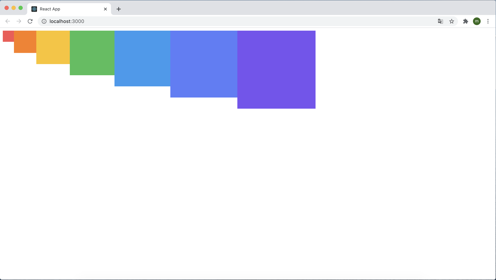

# 컴포넌트 스타일링

리액트에서 컴포넌트를 스타일링할 때는 다양한 방식을 사용할 수 있다. 이 장에서 알아볼 스타일링 방식을 아래와 같다.

1. 일반 CSS : 컴포넌트는 스타일링하는 가장 기본적인 방식
2. Sass : 자주 사용되는 CSS 전처리기 중 하나로 확장된 CSS 문법을 사용하여 CSS 코드를 더욱 쉽게 작성할 수 있도록 해주는 방식
3. CSS Module : 스타일을 작성할 때 CSS 클래스가 다른 CSS 클래스의 이름과 절대 충돌하지 않도록 파일마다 고유한 이름을 자동으로 생성해주는 옵션
4. styled-component : 스타일을 자바스크립트 파일에 내장시키는 방식으로 스타일을 작성함과 동시에 해당 스타일이 적용된 컴포넌트를 만들 수 있게 해주는 방식

실습은 다음 흐름으로 진행된다.

> 프로젝트 준비하기 → 일반 CSS 사용하기 → Sass 사용하기 → CSS module 사용하기 → styled-component 사용하기

우선 실습을 진행할 프로젝트를 생성해줘야한다.

```
$ yarn create react-app styling-react
$ cd styling-react
$ yarn start
```

위 명령을 통해 프로젝트를 생성하고 해당 프로젝트의 개발 서버를 시작하면 된다.

## 9.1 가장 흔한 방식, 일반 CSS

현재 생성한 프로젝트트는 일반 CSS 방식으로 만들어져 있다. 기존의 CSS 스타일링이 딱히 불편하지 않고 새로운 기술을 배울 필요가 없다고 생각되면, 일반 CSS를 계속 사용해도 상관이 없다. **<하지만 나는 styled-component를 사용하는 것이 더 편리하고 좋다고 느낀다.. 이유는 추후에 설명>**

프로젝트 내부의 src 디렉터리를 보게 되면 App.js와 App.css이 있는 것을 확인할 수 있다.

```react
import logo from './logo.svg';
import './App.css';

function App() {
  return (
    <div className="App">
      <header className="App-header">
        
        <p>
          Edit <code>src/App.js</code> and save to reload.
        </p>
        <a
          className="App-link"
          href="https://reactjs.org"
          target="_blank"
          rel="noopener noreferrer"
        >
          Learn React
        </a>
      </header>
    </div>
  );
}

export default App;
```

```react
.App {
  text-align: center;
}

.App-logo {
  height: 40vmin;
  pointer-events: none;
}

@media (prefers-reduced-motion: no-preference) {
  .App-logo {
    animation: App-logo-spin infinite 20s linear;
  }
}

.App-header {
  background-color: #282c34;
  min-height: 100vh;
  display: flex;
  flex-direction: column;
  align-items: center;
  justify-content: center;
  font-size: calc(10px + 2vmin);
  color: white;
}

.App-link {
  color: #61dafb;
}

@keyframes App-logo-spin {
  from {
    transform: rotate(0deg);
  }
  to {
    transform: rotate(360deg);
  }
}
```

CSS를 작성할 때 가장 중요한 점은 CSS 클래스를 중복되지 않게 만드는 것이다. 중복을 막기 위한 여러 방식이 있는데, 그 중 하나는 이름을 지을 때 특별한 규칙을 사용하여 짓는 것이고, 또 다른 하나는 CSS Selector를 활용하는 것이다.

#### 9.1.1 이름 짓는 규칙

프로젝트 내의 생성된 App.css 파일을 보면 클래스 이름이 컴포넌트 이름-클래스 형태로 지어져 있다(ex:App-header). 클래스 이름에 컴포넌트 이름을 포함시킴으로써 중복되는 클래스를 만들어 사용하는 것을 방지할 수있다.

비슷한 방식으로 BEM Naming 이라는 방식도 있다. 이는 CSS 방법론 중 하나로, 이름을 지을 때 일종의 규칙을 준수하여 해당 클래스가 어디에서 어떤 용도로 사용되는 명확하게 작성하는 방식이다(ex: .card__title-primary).

#### 9.1.2 CSS Selector

CSS Selector를 이용하면 CSS 클래스가 특정 클래스 내부에 있는 경우에만 스타일을 적용할 수 있다. 예를 들어 .App 안에 들어 있는 .logo에 스타일을 적용하고 싶다면 아래와 같이 작성하면 된다.

```css
.App .logo {
  animation: App-logo-spin infinite 20s linear;
  height: 40vmin;
}
```

이러한 방식을 사용하여 기존 App.css와 App.js의 CSS 클래스 부분을 다시 작성해보자.

```react
.App {
  text-align: center;
}

.App .logo {
  height: 40vmin;
  pointer-events: none;
}

/* App 안에 들어 있는 .logo */
@media (prefers-reduced-motion: no-preference) {
  .App .logo {
    animation: App-logo-spin infinite 20s linear;
  }
}

/* .App 안에 들어 있는 header
header 클래스가 아닌 header 태크 자체에 스타일 적용 
*/
.App header {
  background-color: #282c34;
  min-height: 100vh;
  display: flex;
  flex-direction: column;
  align-items: center;
  justify-content: center;
  font-size: calc(10px + 2vmin);
  color: white;
}

.App .link {
  color: #61dafb;
}

@keyframes App-logo-spin {
  from {
    transform: rotate(0deg);
  }
  to {
    transform: rotate(360deg);
  }
}
```

```react
import logo from "./logo.svg";
import "./App.css";

function App() {
  return (
    <div className="App">
      <header>
        
        <p>
          Edit <code>src/App.js</code> and save to reload.
        </p>
        <a
          className="link"
          href="https://reactjs.org"
          target="_blank"
          rel="noopener noreferrer"
        >
          Learn React
        </a>
      </header>
    </div>
  );
}

export default App;
```

위 처럼 작성을 해도 문제없이 작동하는 것을 확인할 수 있다. 

## 9.2 Sass 사용하기

Sass(Syntactically Awesome Style Sheets)(문법적으로 매우 멋진 스타일시트)는 CSS 전처리기로 복잡한 작업을 쉽게 할 수 있도록 해 주고, 스타일 코드의 재활용성을 높여 줄 뿐만 아니라 코드의 가독성을 높여서 유지 보수를 더욱 쉽게 해준다.

Sass에서는 두 가지 확장자 .scss와 .sass를 지원한다. 

.scss의 문법과 .sass의 문법을 꽤나 다르다. 다음 코드를 확인해보자.

```css
** .sass **

$font-stack: Helvetica, sans-serif
$primary-color: #333

body
	font: 100% $font-stack
	color: $primary-color
```

```css
** .scss **

$font-stack: Helvetica, sans-serif;
$primary-color: #333;

body {
  font: 100% $font-stack;
  color: $primary-color;
}
```

주요 차이점을 살펴보면, .sass 확장자는 중괄호({})와 세미콜론(;)을 사용하지 않는다. 반면 .scss 확장자는 기존 CSS를 작성하는 방식과 비교해서 크게 다르지 않다.

보통 .scss 문법이 더 자주 사용되므로 .scss 확장자를 사용하여 스타일을 작성해보도록 하자.

새 컴포넌트를 만들어 Sass를 사용하보도록 할텐데 그에 앞서 우선 node-sass라는 라이브러리를 설치해줘야 한다. 이 라이브러리는 Sass를 CSS로 변환해준다. 프로젝트 디렉터리에서 다음 명령어를 실행한다.

> $ yarn add node-sass

설치가 완료되고 난 후 src 디렉터리에 다음과 같이 SassComponent.scss 파일을 작성해준다.

```scss
// 변수
$red: #fa5252;
$orange: #fd7e14;
$yellow: #fcc419;
$green: #40c057;
$blue: #339af0;
$indigo: #5c7cfa;
$violet: #7950f2;
// 믹스인 만들기(재사용되는 스타일 블록을 함수처럼 사용할 수 있음)
@mixin square($size) {
  $caculated: 32px * $size;
  width: $caculated;
  height: $caculated;
}

.SassComponent {
  display: flex;
  .box {
    // 일반 CSS에서는 .SassComponent .box 와 마찬가지
    background: red;
    cursor: pointer;
    transition: all 0.3s ease-in;
    &.red {
      // .red class가 .box와 함께 사용되었을 때
      background: $red;
      @include square(1);
    }
    &.orange {
      background: $orange;
      @include square(2);
    }
    &.yellow {
      background: $yellow;
      @include square(3);
    }
    &.green {
      background: $green;
      @include square(4);
    }
    &.blue {
      background: $blue;
      @include square(5);
    }
    &.indigo {
      background: $indigo;
      @include square(6);
    }
    &.violet {
      background: $violet;
      @include square(7);
    }
    &:hover {
      // .box에 마우스를 올렸을 때
      background: black;
    }
  }
}
```

그리고 이 sass 스타일시트를 사용하는 SassComponent.js 컴포넌트 파일도 만들어준다.

```react
import React from "react";
import "./SassComponent.scss";

const SassComponent = () => {
  return (
    <div className="SassComponent">
      <div className="box red" />
      <div className="box orange" />
      <div className="box yellow" />
      <div className="box green" />
      <div className="box blue" />
      <div className="box indigo" />
      <div className="box violet" />
    </div>
  );
};

export default SassComponent;
```

App 컴포넌트에 렌더링시키고 결과를 보게 되면 아래와 같은 화면이 정상적으로 나오는걸 확인할 수 있다. 



#### 9.2.1 utils 함수 분리하기

여러 파일에서 사용될 수 있는 Sass 변수 및 믹스인은 다른 파일로 따로 분리하여 작성한 뒤 필요한 곳에서 쉽게 불러와 사용할 수 있다.

src 디렉터리에 styles라는 디렉터리를 생성하고, 그 안에 utils.scss라는 파일을 만들어 기존 scss 파일에서 작성했던 변수와 믹스인을 잘라서 사용해보도록 하자.

```scss
// 변수
$red: #fa5252;
$orange: #fd7e14;
$yellow: #fcc419;
$green: #40c057;
$blue: #339af0;
$indigo: #5c7cfa;
$violet: #7950f2;
// 믹스인 만들기(재사용되는 스타일 블록을 함수처럼 사용할 수 있음)
@mixin square($size) {
  $caculated: 32px * $size;
  width: $caculated;
  height: $caculated;
}
```

utils.scss 파일에 위와 같은 내용을 옮기고 SassComponent.scss 파일에서 import하여 사용하면 전과 동일한 결과를 얻을 수 있고 재사용성 및 코드의 간결성을 높일 수 있다. SassComponent.scss 파일을 보게 되면 아래와 같이 utils.scss 파일을 import해서 사용하는 것을 볼 수 있다.

```react
@import "./styles/utils.scss";

.SassComponent {
  display: flex;
  .box {
    // 일반 CSS에서는 .SassComponent .box 와 마찬가지
    background: red;
    cursor: pointer;
    transition: all 0.3s ease-in;
    (...)
  }
}

```

#### 9.2.2 sass-loader 설정 커스터마이징하기

이 작업은 Sass를 사용할 때 반드시 해야 하는 것은 아니지만, 해 두면 유용한 설정이다. 예를 들어 방금 SassComponent에서 utils를 불러 올때 아래와 같은 형태로 불러왔다. 

```scss
@import './styles/utils';
```

만약 프로젝트에 디렉터리를 많이 만들어서 구조가 깊어졌다면(ex: src/Components/somefeature/ThisComponent.scss) 해당 파일에서 다음과 같이 상위폴더로 한참 거슬러 올라가야 한다는 단점이 있다.

```scss
@import '../../../styles/utils';
```

이 문제는 웹팩에서 Sass를 처리하는 sass-loader의 설정을 커스터마이징하여 해결할 수 있다. create-react-app으로 만든 프로젝트는 프로젝트 구조의 복잡도를 낮추기 위해 세부 설정이 모두 숨겨져 있다. 이를 커스터마이징하려면 프로젝트 디렉터리에서 `yarn eject`  명령어를 통해 세부 설정을 밖으로 꺼내줘야 한다.

create-react-app에서는 기본적으로 Git 설정이 되어 있다. `yarn eject` 는 아직 Git에 커밋되지 않은 변화가 있다면 진행되지 않으니 먼저 커밋을 해줘야 한다.

